# Employee Compensation Management

<cite>
**Referenced Files in This Document**
- [EmployeeController.php](file://app/Http/Controllers/EmployeeController.php)
- [PayrollController.php](file://app/Http/Controllers/PayrollController.php)
- [SalaryController.php](file://app/Http/Controllers/SalaryController.php)
- [PeraController.php](file://app/Http/Controllers/PeraController.php)
- [RataController.php](file://app/Http/Controllers/RataController.php)
- [EmployeeDeductionController.php](file://app/Http/Controllers/EmployeeDeductionController.php)
- [ManageEmployeeController.php](file://app/Http/Controllers/ManageEmployeeController.php)
- [Employee.php](file://app/Models/Employee.php)
- [Salary.php](file://app/Models/Salary.php)
- [Pera.php](file://app/Models/Pera.php)
- [Rata.php](file://app/Models/Rata.php)
- [EmployeeDeduction.php](file://app/Models/EmployeeDeduction.php)
- [DeductionType.php](file://app/Models/DeductionType.php)
- [web.php](file://routes/web.php)
- [deductions.tsx](file://resources/js/pages/Employees/Manage/compensation/deductions.tsx)
- [pera.tsx](file://resources/js/pages/Employees/Manage/compensation/pera.tsx)
- [rata.tsx](file://resources/js/pages/Employees/Manage/compensation/rata.tsx)
- [salary.tsx](file://resources/js/pages/Employees/Manage/compensation/salary.tsx)
- [salaryDialog.tsx](file://resources/js/pages/Employees/Manage/compensation/salaryDialog.tsx)
- [Manage.tsx](file://resources/js/pages/Employees/Manage/Manage.tsx)
- [Compensation.tsx](file://resources/js/pages/Employees/Manage/Compensation.tsx)
- [Reports.tsx](file://resources/js/pages/Employees/Manage/Reports.tsx)
- [PrintReport.tsx](file://resources/js/pages/Employees/Manage/PrintReport.tsx)
- [custom-date-picker.tsx](file://resources/js/components/custom-date-picker.tsx)
- [employee.d.ts](file://resources/js/types/employee.d.ts)
- [employeeDeduction.d.ts](file://resources/js/types/employeeDeduction.d.ts)
- [filter.d.ts](file://resources/js/types/filter.d.ts)
- [pagination.d.ts](file://resources/js/types/pagination.d.ts)
- [pera.d.ts](file://resources/js/types/pera.d.ts)
- [rata.d.ts](file://resources/js/types/rata.d.ts)
- [salary.d.ts](file://resources/js/types/salary.d.ts)
</cite>

## Update Summary
**Changes Made**
- Enhanced with full CRUD functionality for salary, PERA, and RATA records
- Added edit and delete capabilities with new dialog components and real-time validation
- Implemented comprehensive form validation, error handling, and user feedback through toast notifications
- Enhanced PERA and RATA components with professional UI design, currency formatting, and effective date display
- Added RATA eligibility validation with conditional UI rendering
- Improved PERA and RATA management with proper routing, controller methods, and model relationships

## Table of Contents
1. [Introduction](#introduction)
2. [Project Structure](#project-structure)
3. [Core Components](#core-components)
4. [Architecture Overview](#architecture-overview)
5. [Detailed Component Analysis](#detailed-component-analysis)
6. [Enhanced Historical Compensation System](#enhanced-historical-compensation-system)
7. [Enhanced Deduction Management System](#enhanced-deduction-management-system)
8. [Enhanced PERA and RATA Management Components](#enhanced-pera-and-rata-management-components)
9. [Custom DatePicker Component Integration](#custom-datepicker-component-integration)
10. [Enhanced Form Validation and User Feedback](#enhanced-form-validation-and-user-feedback)
11. [Compensation Management Workflows](#compensation-management-workflows)
12. [Data Models and Relationships](#data-models-and-relationships)
13. [User Interface Components](#user-interface-components)
14. [Performance Considerations](#performance-considerations)
15. [Troubleshooting Guide](#troubleshooting-guide)
16. [Conclusion](#conclusion)

## Introduction

The Employee Compensation Management system is a comprehensive payroll and compensation tracking solution built with Laravel and Inertia.js. This system manages employee compensation through three primary components: Basic Salary, PERA (Employees' Profit Sharing), and RATA (Retirement Allowance), along with a sophisticated deduction management system featuring comprehensive pagination, filtering, and enhanced historical compensation calculation capabilities. The platform provides robust functionality for employee management, compensation tracking, payroll processing, and deduction management with full CRUD operations and enhanced user experience.

The system follows modern web development practices with a clean separation of concerns, utilizing Eloquent ORM for database operations, Inertia.js for seamless single-page application experiences, and comprehensive validation for data integrity. It supports multiple offices, employment statuses, and provides detailed compensation histories for each employee with enhanced deduction management capabilities including sophisticated pagination, filtering systems, and historical compensation calculation for accurate payroll processing.

## Project Structure

The application follows a modular Laravel architecture with clear separation between controllers, models, routes, and frontend components:

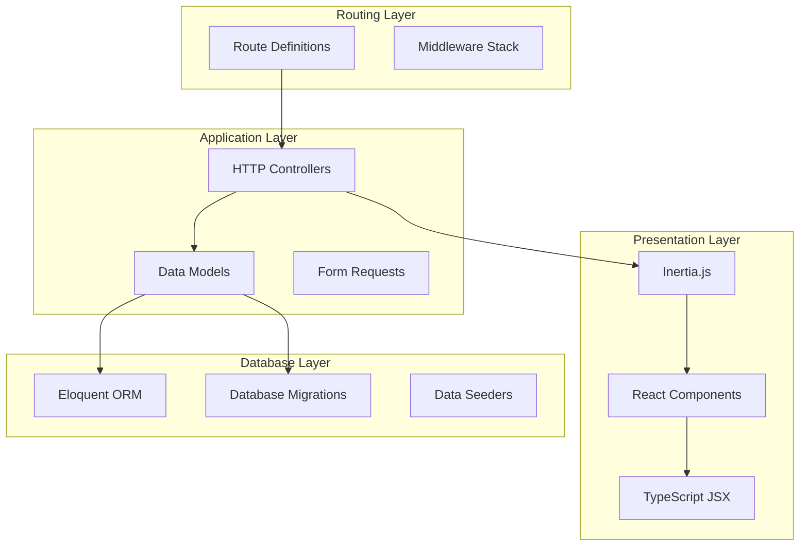
```mermaid
graph TB
subgraph "Application Layer"
Controllers[HTTP Controllers]
Models[Data Models]
Requests[Form Requests]
end
subgraph "Presentation Layer"
Inertia[Inertia.js]
React[React Components]
TSX[TypeScript JSX]
end
subgraph "Routing Layer"
Routes[Route Definitions]
Middleware[Middleware Stack]
end
subgraph "Database Layer"
Eloquent[Eloquent ORM]
Migrations[Database Migrations]
Seeders[Data Seeders]
end
Controllers --> Models
Models --> Eloquent
Inertia --> React
React --> TSX
Routes --> Controllers
Controllers --> Inertia
Models --> Migrations
```

**Diagram sources**
- [web.php:1-148](file://routes/web.php#L1-L148)
- [EmployeeController.php:1-139](file://app/Http/Controllers/EmployeeController.php#L1-L139)

The project is organized into several key areas:

- **Controllers**: Handle HTTP requests and coordinate between models and views
- **Models**: Define database relationships and business logic
- **Routes**: Define URL patterns and controller mappings
- **Resources**: Frontend components and TypeScript definitions
- **Database**: Migrations and seeders for data structure initialization

**Section sources**
- [web.php:1-148](file://routes/web.php#L1-L148)

## Core Components

The system consists of seven primary controllers that handle different aspects of compensation management, with enhanced CRUD functionality, comprehensive deduction management, and sophisticated historical compensation calculation capabilities:

### Employee Management Controller
Manages employee records, including CRUD operations, photo uploads, and basic employee information maintenance with enhanced deduction integration.

### Payroll Processing Controller  
Handles comprehensive payroll calculations, including gross pay computation, deduction processing, and net pay determination with sophisticated filtering capabilities and historical compensation calculation for accurate period-specific payroll processing.

### Salary Management Controller
Controls salary records, effective dates, amount changes, and compensation history tracking with full CRUD operations.

### PERA Management Controller
Manages profit-sharing contributions with effective date tracking, historical records, full CRUD functionality, and comprehensive form validation with enhanced user feedback.

### RATA Management Controller
Handles retirement allowance calculations with eligibility filtering, historical tracking, full CRUD operations, and professional UI design with custom date picker integration.

### Employee Deduction Controller
Processes various deduction types applied to employee paychecks during specific pay periods with comprehensive CRUD operations, sophisticated filtering, pagination support, and enhanced historical compensation calculation capabilities for accurate payroll processing.

### Manage Employee Controller
Provides comprehensive employee management interface with deduction creation and update functionality through period-based forms, enhanced with pagination and filtering capabilities, and new data aggregation methods for allDeductions and allClaims with historical compensation data.

Each controller implements standardized CRUD operations with proper validation, authorization, and response handling through the Inertia.js framework, with enhanced deduction management capabilities including sophisticated pagination, filtering systems, and historical compensation calculation for accurate payroll processing.

**Section sources**
- [EmployeeController.php:12-139](file://app/Http/Controllers/EmployeeController.php#L12-L139)
- [PayrollController.php:11-171](file://app/Http/Controllers/PayrollController.php#L11-L171)
- [SalaryController.php:11-106](file://app/Http/Controllers/SalaryController.php#L11-L106)
- [PeraController.php:11-106](file://app/Http/Controllers/PeraController.php#L11-L106)
- [RataController.php:11-107](file://app/Http/Controllers/RataController.php#L11-L107)
- [EmployeeDeductionController.php:12-173](file://app/Http/Controllers/EmployeeDeductionController.php#L12-L173)
- [ManageEmployeeController.php:14-212](file://app/Http/Controllers/ManageEmployeeController.php#L14-L212)

## Architecture Overview

The system employs a layered architecture with clear separation between presentation, business logic, and data access layers, enhanced with comprehensive deduction management, sophisticated pagination, and historical compensation calculation capabilities:

```mermaid
graph TD
subgraph "Presentation Layer"
WebUI[Web Interface]
API[REST API]
EmployeeManage[Employee Management Page]
Compensation[Compensation Components]
DeductionDialog[Deduction Dialog]
Pagination[Pagination Controls]
Filters[Filter System]
DeductionsTab[Deductions Tab]
Reports[Reports Module]
HistoricalCalc[Historical Calculation]
DatePicker[Custom Date Picker]
ToastNotifications[Toast Notifications]
EndUserFeedback[User Feedback]
end
subgraph "Application Layer"
Controllers[Controllers]
Services[Business Services]
Validators[Validation Layer]
ManageController[ManageEmployeeController]
DeductionController[EmployeeDeductionController]
PayrollController[PayrollController]
PaginationService[Pagination Service]
FilterService[Filter Service]
HistoricalService[Historical Compensation Service]
PERAController[PeraController]
RATAController[RataController]
end
subgraph "Domain Layer"
Models[Domain Models]
Repositories[Repository Pattern]
EmployeeDeduction[EmployeeDeduction Model]
DeductionType[DeductionType Model]
PaginationData[Pagination Data]
FilterData[Filter Data]
HistoricalData[Historical Compensation Data]
PeraModel[Pera Model]
RataModel[Rata Model]
end
subgraph "Infrastructure Layer"
Database[(Database)]
Storage[(File Storage)]
Cache[(Cache Layer)]
PaginationEngine[Pagination Engine]
FilterEngine[Filter Engine]
HistoricalEngine[Historical Engine]
DatePickerEngine[Date Picker Engine]
ToastEngine[Toast Notification Engine]
end
WebUI --> Controllers
API --> Controllers
EmployeeManage --> ManageController
Compensation --> Controllers
DeductionDialog --> ManageController
Pagination --> PaginationService
Filters --> FilterService
DeductionsTab --> ManageController
Reports --> HistoricalCalc
HistoricalCalc --> HistoricalService
ManageController --> DeductionController
DeductionController --> PayrollController
PayrollController --> EmployeeDeduction
EmployeeDeduction --> DeductionType
Controllers --> Services
Services --> Models
Models --> Repositories
Repositories --> Database
Models --> Storage
Services --> Cache
Controllers --> Validators
PaginationService --> PaginationEngine
FilterService --> FilterEngine
HistoricalService --> HistoricalEngine
DatePicker --> DatePickerEngine
ToastNotifications --> ToastEngine
EndUserFeedback --> ToastEngine
```

**Diagram sources**
- [EmployeeController.php:1-139](file://app/Http/Controllers/EmployeeController.php#L1-L139)
- [PayrollController.php:1-171](file://app/Http/Controllers/PayrollController.php#L1-L171)
- [ManageEmployeeController.php:1-212](file://app/Http/Controllers/ManageEmployeeController.php#L1-L212)
- [EmployeeDeductionController.php:1-173](file://app/Http/Controllers/EmployeeDeductionController.php#L1-L173)
- [PeraController.php:1-106](file://app/Http/Controllers/PeraController.php#L1-L106)
- [RataController.php:1-107](file://app/Http/Controllers/RataController.php#L1-L107)

The architecture emphasizes:
- **Separation of Concerns**: Clear boundaries between presentation, business logic, and data access
- **Dependency Injection**: Controllers receive dependencies through constructor injection
- **Event-Driven Design**: Models utilize Eloquent events for automatic auditing
- **Caching Strategy**: Efficient data retrieval through eager loading and caching
- **Security**: Comprehensive validation and authorization middleware
- **Enhanced Deduction Management**: Dedicated components for comprehensive deduction handling with pagination, filtering, and historical compensation calculation
- **Sophisticated Pagination**: Built-in pagination engine for efficient data handling
- **Advanced Filtering**: Sophisticated filter system for deduction records
- **Historical Compensation Processing**: Specialized service for accurate historical compensation calculations
- **Multi-layered Historical Data**: Backend and frontend historical calculation capabilities
- **Custom Date Picker Integration**: Professional date selection component with validation
- **Toast Notification System**: User feedback mechanism for CRUD operations
- **Enhanced User Experience**: Professional UI design with currency formatting and effective date display

## Detailed Component Analysis

### Employee Management System

The Employee Management component serves as the foundation for all compensation activities, providing comprehensive employee lifecycle management with enhanced deduction integration, sophisticated pagination, and historical compensation calculation capabilities.

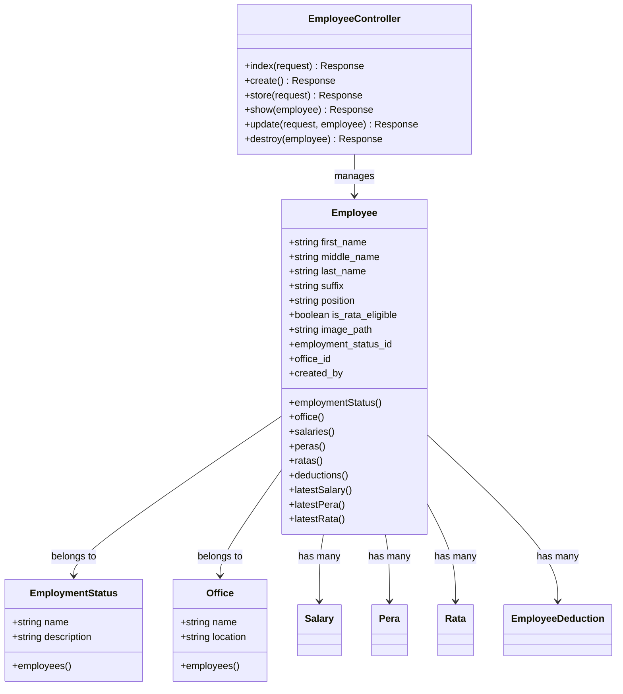
```mermaid
classDiagram
class Employee {
+string first_name
+string middle_name
+string last_name
+string suffix
+string position
+boolean is_rata_eligible
+string image_path
+employment_status_id
+office_id
+created_by
+employmentStatus()
+office()
+salaries()
+peras()
+ratas()
+deductions()
+latestSalary()
+latestPera()
+latestRata()
}
class EmployeeController {
+index(request) Response
+create() Response
+store(request) Response
+show(employee) Response
+update(request, employee) Response
+destroy(employee) Response
}
class EmploymentStatus {
+string name
+string description
+employees()
}
class Office {
+string name
+string location
+employees()
}
EmployeeController --> Employee : manages
Employee --> EmploymentStatus : belongs to
Employee --> Office : belongs to
Employee --> Salary : has many
Employee --> Pera : has many
Employee --> Rata : has many
Employee --> EmployeeDeduction : has many
```

**Diagram sources**
- [Employee.php:10-104](file://app/Models/Employee.php#L10-L104)
- [EmployeeController.php:12-139](file://app/Http/Controllers/EmployeeController.php#L12-L139)

Key features include:
- **Photo Management**: Secure file upload and storage with validation
- **Search Functionality**: Multi-field search across employee names and identifiers
- **Relationship Management**: Automatic population of related employment status and office data
- **Soft Deletion**: Non-destructive removal with restore capability
- **Enhanced Deduction Integration**: Comprehensive deduction tracking with period-based grouping, pagination, and historical compensation calculation
- **Sophisticated Pagination**: Efficient handling of large employee datasets with pagination controls
- **Historical Compensation Processing**: Accurate historical data processing for compensation calculations

**Section sources**
- [EmployeeController.php:14-139](file://app/Http/Controllers/EmployeeController.php#L14-L139)
- [Employee.php:31-104](file://app/Models/Employee.php#L31-L104)

### Enhanced Payroll Processing Engine

The Payroll Processing component calculates employee compensation for specific pay periods with enhanced historical compensation calculation capabilities, aggregating salary, PERA, and RATA components while applying comprehensive deductions with sophisticated filtering and accurate historical data processing.

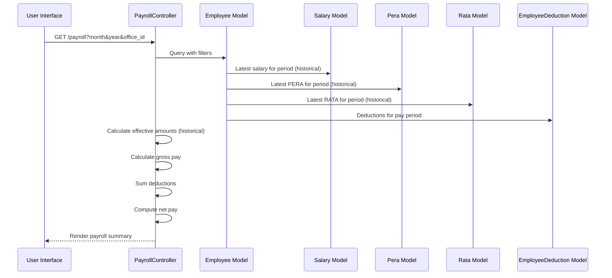
```mermaid
sequenceDiagram
participant User as User Interface
participant Controller as PayrollController
participant Employee as Employee Model
participant Salary as Salary Model
participant Pera as Pera Model
participant Rata as Rata Model
participant Deduction as EmployeeDeduction Model
User->>Controller : GET /payroll?month&year&office_id
Controller->>Employee : Query with filters
Employee->>Salary : Latest salary for period (historical)
Employee->>Pera : Latest PERA for period (historical)
Employee->>Rata : Latest RATA for period (historical)
Employee->>Deduction : Deductions for pay period
Controller->>Controller : Calculate effective amounts (historical)
Controller->>Controller : Calculate gross pay
Controller->>Controller : Sum deductions
Controller->>Controller : Compute net pay
Controller-->>User : Render payroll summary
```

**Diagram sources**
- [PayrollController.php:13-171](file://app/Http/Controllers/PayrollController.php#L13-L171)

The payroll calculation process involves:
- **Historical Amount Retrieval**: Using getEffectiveAmount method to retrieve compensation amounts for specific pay periods
- **Gross Pay Calculation**: Sum of current salary, PERA, and RATA amounts using historical data
- **Deduction Aggregation**: Total of all applicable deductions for the pay period
- **Net Pay Determination**: Gross pay minus total deductions
- **Historical Tracking**: Complete audit trail of all compensation changes with accurate historical calculations
- **Enhanced Deduction Processing**: Comprehensive deduction management with period-specific application, filtering, and historical compensation calculation
- **Sophisticated Filtering**: Advanced filtering capabilities for payroll data with historical accuracy

**Section sources**
- [PayrollController.php:13-171](file://app/Http/Controllers/PayrollController.php#L13-L171)

### Enhanced Compensation Management System

The compensation management system has been significantly enhanced with comprehensive CRUD functionality for all compensation types, dedicated deduction management capabilities, sophisticated pagination, filtering, and historical compensation calculation capabilities.

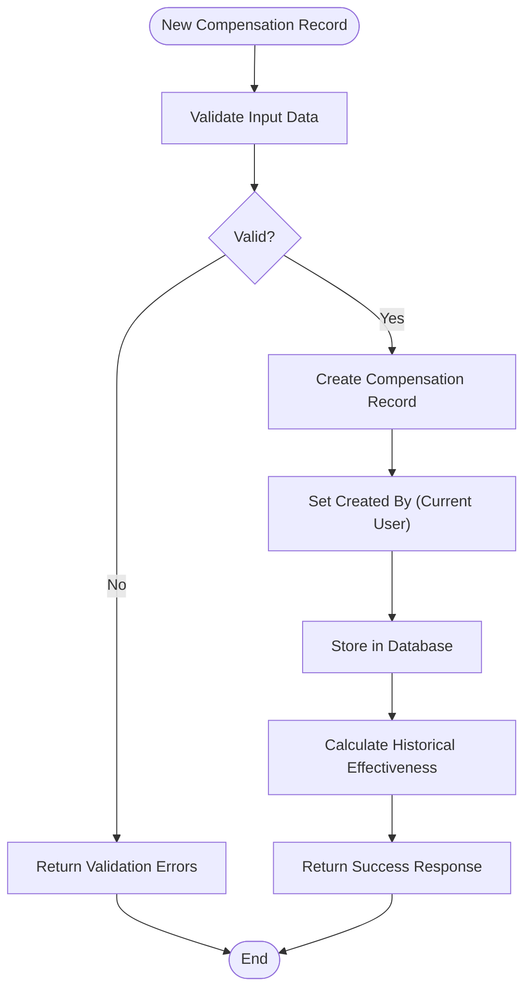
```mermaid
flowchart TD
Start([New Compensation Record]) --> Validate["Validate Input Data"]
Validate --> Valid{"Valid?"}
Valid --> |No| Error["Return Validation Errors"]
Valid --> |Yes| Create["Create Compensation Record"]
Create --> Audit["Set Created By (Current User)"]
Audit --> Store["Store in Database"]
Store --> HistoricalCalc["Calculate Historical Effectiveness"]
HistoricalCalc --> Success["Return Success Response"]
Error --> End([End])
Success --> End
```

**Diagram sources**
- [SalaryController.php:66-106](file://app/Http/Controllers/SalaryController.php#L66-L106)
- [PeraController.php:66-106](file://app/Http/Controllers/PeraController.php#L66-L106)
- [RataController.php:67-107](file://app/Http/Controllers/RataController.php#L67-L107)

The system ensures:
- **Audit Trail**: Every change is tracked with who made it and when
- **Effective Dating**: Proper chronological ordering of compensation changes with historical accuracy
- **Data Integrity**: Validation prevents invalid or conflicting records
- **Full CRUD Operations**: Complete create, read, update, and delete functionality for all compensation types
- **Enhanced Deduction Management**: Comprehensive deduction tracking with period-based grouping, editing capabilities, pagination, and historical compensation calculation
- **Sophisticated Pagination**: Efficient handling of large datasets with pagination controls
- **Advanced Filtering**: Sophisticated filtering mechanisms for deduction records
- **Historical Compensation Processing**: Accurate historical data processing for all compensation types
- **Professional UI Design**: Enhanced user interfaces with currency formatting and effective date display

**Section sources**
- [SalaryController.php:66-106](file://app/Http/Controllers/SalaryController.php#L66-L106)
- [PeraController.php:66-106](file://app/Http/Controllers/PeraController.php#L66-L106)
- [RataController.php:67-107](file://app/Http/Controllers/RataController.php#L67-L107)

### Enhanced Manage Page Architecture

The main Manage page has been enhanced with a new Deductions tab and integrated CompensationDeductions component for streamlined user experience, with comprehensive historical compensation calculation capabilities.

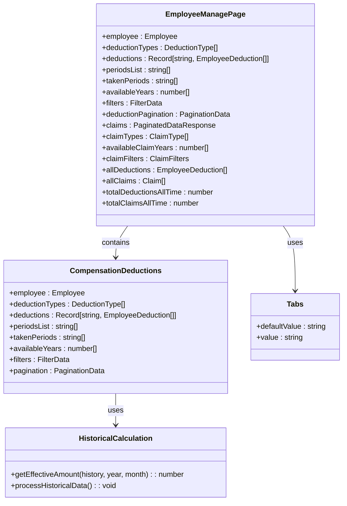
```mermaid
classDiagram
class EmployeeManagePage {
+employee : Employee
+deductionTypes : DeductionType[]
+deductions : Record[string, EmployeeDeduction[]]
+periodsList : string[]
+takenPeriods : string[]
+availableYears : number[]
+filters : FilterData
+deductionPagination : PaginationData
+claims : PaginatedDataResponse
+claimTypes : ClaimType[]
+availableClaimYears : number[]
+claimFilters : ClaimFilters
+allDeductions : EmployeeDeduction[]
+allClaims : Claim[]
+totalDeductionsAllTime : number
+totalClaimsAllTime : number
}
class CompensationDeductions {
+employee : Employee
+deductionTypes : DeductionType[]
+deductions : Record[string, EmployeeDeduction[]]
+periodsList : string[]
+takenPeriods : string[]
+availableYears : number[]
+filters : FilterData
+pagination : PaginationData
}
class Tabs {
+defaultValue : string
+value : string
}
class HistoricalCalculation {
+getEffectiveAmount(history, year, month) : number
+processHistoricalData() : void
}
EmployeeManagePage --> CompensationDeductions : contains
EmployeeManagePage --> Tabs : uses
CompensationDeductions --> HistoricalCalculation : uses
```

**Diagram sources**
- [Manage.tsx:58-205](file://resources/js/pages/Employees/Manage/Manage.tsx#L58-L205)
- [Compensation.tsx:11-38](file://resources/js/pages/Employees/Manage/Compensation.tsx#L11-L38)

The enhanced manage page now features:
- **Integrated Deductions Tab**: New dedicated tab for comprehensive deduction management with historical compensation calculation
- **Streamlined Compensation Section**: Removed complex deduction management interface from main compensation view
- **Direct Component Integration**: CompensationDeductions component integrated directly into main Manage page with historical data processing
- **Enhanced Data Aggregation**: New backend methods for allDeductions and allClaims data with historical accuracy
- **Improved User Experience**: Simplified navigation between compensation and deduction management with historical compensation capabilities
- **Historical Calculation Integration**: Seamless integration of historical compensation calculation across all management interfaces

**Section sources**
- [Manage.tsx:174-185](file://resources/js/pages/Employees/Manage/Manage.tsx#L174-L185)
- [Compensation.tsx:11-38](file://resources/js/pages/Employees/Manage/Compensation.tsx#L11-L38)

## Enhanced Historical Compensation System

**Updated** The system now includes comprehensive historical compensation calculation capabilities with getEffectiveAmount methods in both backend controllers and frontend components for accurate period-specific compensation processing.

The historical compensation system provides sophisticated calculation capabilities for determining effective compensation amounts for specific pay periods, ensuring accurate payroll processing and reporting:

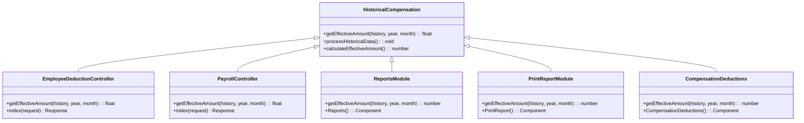
```mermaid
classDiagram
class HistoricalCompensation {
+getEffectiveAmount(history, year, month) : float
+processHistoricalData() : void
+calculateEffectiveAmount() : number
}
class EmployeeDeductionController {
+getEffectiveAmount(history, year, month) : float
+index(request) Response
}
class PayrollController {
+getEffectiveAmount(history, year, month) : float
+index(request) Response
}
class ReportsModule {
+getEffectiveAmount(history, year, month) : number
+Reports() : Component
}
class PrintReportModule {
+getEffectiveAmount(history, year, month) : number
+PrintReport() : Component
}
class CompensationDeductions {
+getEffectiveAmount(history, year, month) : number
+CompensationDeductions() : Component
}
HistoricalCompensation <|-- EmployeeDeductionController
HistoricalCompensation <|-- PayrollController
HistoricalCompensation <|-- ReportsModule
HistoricalCompensation <|-- PrintReportModule
HistoricalCompensation <|-- CompensationDeductions
```

**Diagram sources**
- [EmployeeDeductionController.php:17-42](file://app/Http/Controllers/EmployeeDeductionController.php#L17-L42)
- [PayrollController.php:17-43](file://app/Http/Controllers/PayrollController.php#L17-L43)
- [Reports.tsx:28-47](file://resources/js/pages/Employees/Manage/Reports.tsx#L28-L47)
- [PrintReport.tsx:27-46](file://resources/js/pages/Employees/Manage/PrintReport.tsx#L27-L46)
- [deductions.tsx:81-105](file://resources/js/pages/Employees/Manage/compensation/deductions.tsx#L81-L105)

### Backend Historical Calculation Methods

Both backend controllers implement sophisticated historical compensation calculation methods:

**EmployeeDeductionController.getEffectiveAmount()**
- Processes salary, PERA, and RATA history for specific pay periods
- Uses Laravel Collection methods for efficient data processing
- Handles edge cases with fallback to oldest record when no effective record found
- Returns accurate compensation amounts for payroll processing

**PayrollController.getEffectiveAmount()**
- Identical implementation to EmployeeDeductionController for consistency
- Ensures uniform historical compensation calculation across the system
- Supports accurate payroll calculations with historical data precision

### Frontend Historical Calculation Methods

Multiple frontend components implement historical compensation calculation for client-side processing:

**Reports.getEffectiveAmount()**
- Processes historical compensation data for reporting purposes
- Handles month/year filtering with historical accuracy
- Supports print preview with accurate historical calculations

**PrintReport.getEffectiveAmount()**
- Optimized version for print functionality
- Ensures historical compensation accuracy in printed reports
- Supports year-only filtering with December end-of-year calculations

**CompensationDeductions.getEffectiveAmount()**
- Real-time calculation for deduction management interface
- Provides immediate feedback for historical compensation amounts
- Supports dynamic UI updates with historical data

### Historical Calculation Logic

The historical compensation calculation follows a precise algorithm:

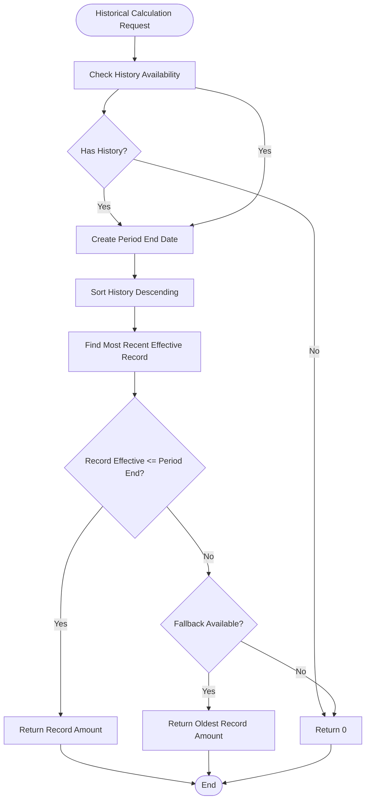
```mermaid
flowchart TD
Start([Historical Calculation Request]) --> CheckHistory["Check History Availability"]
CheckHistory --> HasHistory{"Has History?"}
HasHistory --> |No| ReturnZero["Return 0"]
HasHistory --> |Yes| CreatePeriod["Create Period End Date"]
CreatePeriod --> SortHistory["Sort History Descending"]
SortHistory --> FindEffective["Find Most Recent Effective Record"]
FindEffective --> CheckDate{"Record Effective <= Period End?"}
CheckDate --> |Yes| ReturnAmount["Return Record Amount"]
CheckDate --> |No| CheckFallback{"Fallback Available?"}
CheckFallback --> |Yes| ReturnOldest["Return Oldest Record Amount"]
CheckFallback --> |No| ReturnZero
CheckHistory --> |Yes| CreatePeriod
ReturnAmount --> End([End])
ReturnOldest --> End
ReturnZero --> End
```

**Diagram sources**
- [EmployeeDeductionController.php:19-42](file://app/Http/Controllers/EmployeeDeductionController.php#L19-L42)
- [PayrollController.php:20-43](file://app/Http/Controllers/PayrollController.php#L20-L43)
- [Reports.tsx:28-47](file://resources/js/pages/Employees/Manage/Reports.tsx#L28-L47)

The calculation process ensures:
- **Date Precision**: Uses end-of-month date for accurate historical matching
- **Descending Order**: Sorts by effective_date to find most recent applicable record
- **Fallback Handling**: Graceful fallback to oldest record when no effective match found
- **Consistent Results**: Uniform calculation logic across all system components

**Section sources**
- [EmployeeDeductionController.php:17-42](file://app/Http/Controllers/EmployeeDeductionController.php#L17-L42)
- [PayrollController.php:17-43](file://app/Http/Controllers/PayrollController.php#L17-L43)
- [Reports.tsx:28-47](file://resources/js/pages/Employees/Manage/Reports.tsx#L28-L47)
- [PrintReport.tsx:27-46](file://resources/js/pages/Employees/Manage/PrintReport.tsx#L27-L46)
- [deductions.tsx:81-105](file://resources/js/pages/Employees/Manage/compensation/deductions.tsx#L81-L105)

## Enhanced Deduction Management System

The deduction management system has been completely redesigned with a comprehensive front-end component, enhanced backend processing capabilities, sophisticated pagination, advanced filtering mechanisms, and historical compensation calculation for accurate payroll processing.

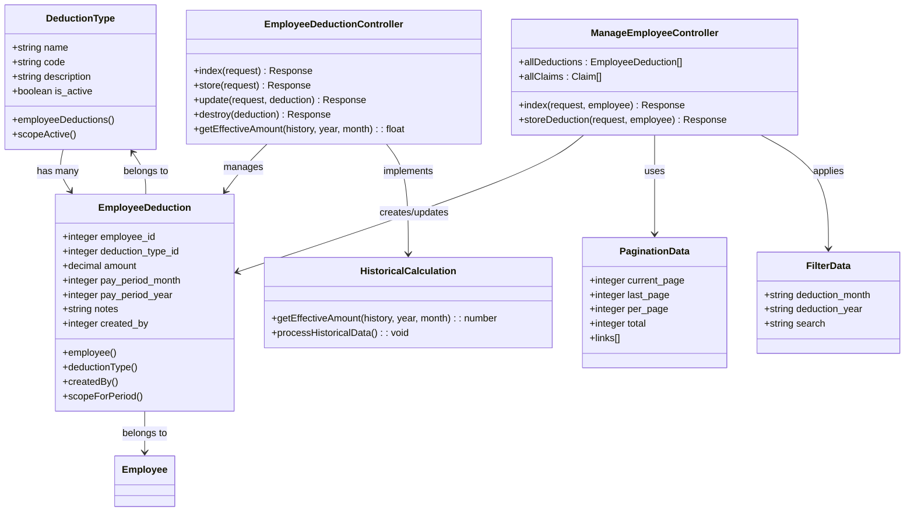
```mermaid
classDiagram
class DeductionType {
+string name
+string code
+string description
+boolean is_active
+employeeDeductions()
+scopeActive()
}
class EmployeeDeduction {
+integer employee_id
+integer deduction_type_id
+decimal amount
+integer pay_period_month
+integer pay_period_year
+string notes
+integer created_by
+employee()
+deductionType()
+createdBy()
+scopeForPeriod()
}
class EmployeeDeductionController {
+index(request) Response
+store(request) Response
+update(request, deduction) Response
+destroy(deduction) Response
+getEffectiveAmount(history, year, month) : float
}
class ManageEmployeeController {
+index(request, employee) Response
+storeDeduction(request, employee) Response
+allDeductions : EmployeeDeduction[]
+allClaims : Claim[]
}
class PaginationData {
+integer current_page
+integer last_page
+integer per_page
+integer total
+links[]
}
class FilterData {
+string deduction_month
+string deduction_year
+string search
}
class HistoricalCalculation {
+getEffectiveAmount(history, year, month) : number
+processHistoricalData() : void
}
EmployeeDeductionController --> EmployeeDeduction : manages
EmployeeDeduction --> DeductionType : belongs to
EmployeeDeduction --> Employee : belongs to
ManageEmployeeController --> EmployeeDeduction : creates/updates
DeductionType --> EmployeeDeduction : has many
ManageEmployeeController --> PaginationData : uses
ManageEmployeeController --> FilterData : applies
EmployeeDeductionController --> HistoricalCalculation : implements
```

**Diagram sources**
- [EmployeeDeduction.php:8-59](file://app/Models/EmployeeDeduction.php#L8-L59)
- [DeductionType.php:7-33](file://app/Models/DeductionType.php#L7-L33)
- [EmployeeDeductionController.php:12-173](file://app/Http/Controllers/EmployeeDeductionController.php#L12-L173)
- [ManageEmployeeController.php:52-212](file://app/Http/Controllers/ManageEmployeeController.php#L52-L212)
- [pagination.d.ts:7-18](file://resources/js/types/pagination.d.ts#L7-L18)
- [filter.d.ts:3-11](file://resources/js/types/filter.d.ts#L3-L11)

The comprehensive deduction management system includes:
- **Period-Based Deduction Groups**: Deductions grouped by pay period (month-year) for better organization with pagination support and historical compensation calculation
- **Deduction Dialog Interface**: Interactive dialog for adding and editing deductions with real-time validation, conflict detection, and historical data processing
- **Duplicate Prevention**: Automatic detection and prevention of duplicate deductions for the same employee and period
- **Flexible Amount Entry**: Support for nullable deduction amounts with conditional processing and historical accuracy
- **Enhanced UI Components**: Professional interfaces for deduction management with currency formatting, period selection, pagination controls, and historical compensation display
- **Sophisticated Filtering**: Advanced month/year filtering capabilities with clear filter options and historical data accuracy
- **Pagination Controls**: Comprehensive pagination system with page navigation, record count display, and historical data grouping
- **Responsive Design**: Mobile-optimized interfaces with touch-friendly controls and historical calculation performance
- **New Backend Aggregation**: Enhanced data aggregation methods for allDeductions and allClaims with historical compensation processing
- **Historical Compensation Integration**: Seamless integration of historical compensation calculation across all deduction management interfaces

**Section sources**
- [EmployeeDeductionController.php:14-173](file://app/Http/Controllers/EmployeeDeductionController.php#L14-L173)
- [EmployeeDeduction.php:26-59](file://app/Models/EmployeeDeduction.php#L26-L59)
- [DeductionType.php:20-33](file://app/Models/DeductionType.php#L20-L33)
- [deductions.tsx:25-279](file://resources/js/pages/Employees/Manage/compensation/deductions.tsx#L25-L279)
- [salaryDialog.tsx:42-197](file://resources/js/pages/Employees/Manage/compensation/salaryDialog.tsx#L42-L197)
- [Manage.tsx:21-185](file://resources/js/pages/Employees/Manage/Manage.tsx#L21-L185)
- [ManageEmployeeController.php:128-142](file://app/Http/Controllers/ManageEmployeeController.php#L128-L142)

### Enhanced Pagination System

The system implements a sophisticated pagination system for deduction management with comprehensive controls, efficient data handling, and historical compensation calculation capabilities:

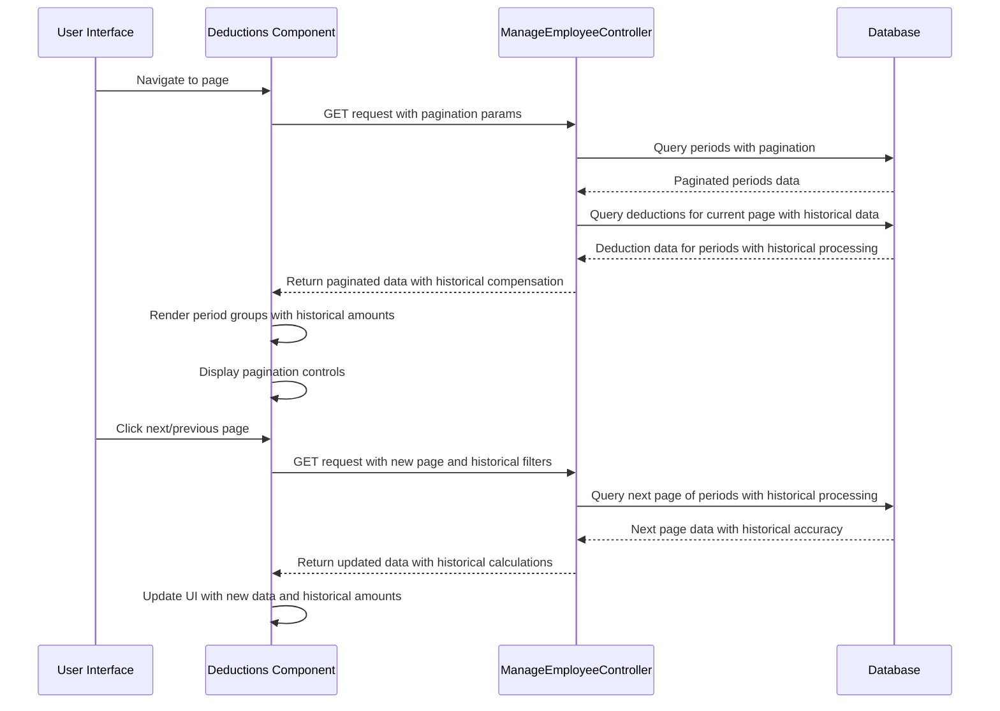
```mermaid
sequenceDiagram
participant User as User Interface
participant Component as Deductions Component
participant Controller as ManageEmployeeController
participant Database as Database
User->>Component : Navigate to page
Component->>Controller : GET request with pagination params
Controller->>Database : Query periods with pagination
Database-->>Controller : Paginated periods data
Controller->>Database : Query deductions for current page with historical data
Database-->>Controller : Deduction data for periods with historical processing
Controller-->>Component : Return paginated data with historical compensation
Component->>Component : Render period groups with historical amounts
Component->>Component : Display pagination controls
User->>Component : Click next/previous page
Component->>Controller : GET request with new page and historical filters
Controller->>Database : Query next page of periods with historical processing
Database-->>Controller : Next page data with historical accuracy
Controller-->>Component : Return updated data with historical calculations
Component->>Component : Update UI with new data and historical amounts
```

**Diagram sources**
- [ManageEmployeeController.php:54-114](file://app/Http/Controllers/ManageEmployeeController.php#L54-L114)
- [deductions.tsx:58-76](file://resources/js/pages/Employees/Manage/compensation/deductions.tsx#L58-L76)

The pagination system features:
- **Efficient Querying**: Separate queries for period listing and deduction data retrieval with historical data processing
- **Smart Grouping**: Deductions grouped by pay period for optimal display with historical compensation calculation
- **Conflict Detection**: Taken periods identified for duplicate prevention with historical accuracy
- **Year Filtering**: Available years dynamically populated for filtering with historical data support
- **Page Navigation**: Intuitive previous/next controls with disabled states and historical calculation preservation
- **Record Counting**: Total period count displayed for user awareness with historical data accuracy
- **Historical Data Integration**: Seamless integration of historical compensation calculation in pagination results

**Section sources**
- [ManageEmployeeController.php:38-89](file://app/Http/Controllers/ManageEmployeeController.php#L38-L89)
- [deductions.tsx:102-104](file://resources/js/pages/Employees/Manage/compensation/deductions.tsx#L102-L104)

### Advanced Filtering Mechanisms

The system provides sophisticated filtering capabilities for deduction records with month/year selection, clear filter options, and historical compensation calculation:

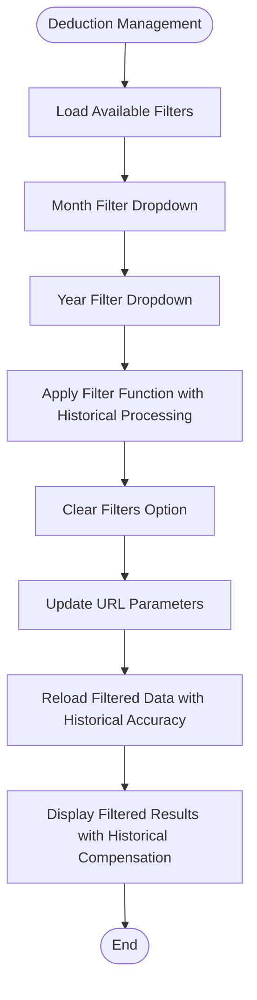
```mermaid
flowchart TD
Start([Deduction Management]) --> LoadFilters["Load Available Filters"]
LoadFilters --> MonthFilter["Month Filter Dropdown"]
MonthFilter --> YearFilter["Year Filter Dropdown"]
YearFilter --> ApplyFilters["Apply Filter Function with Historical Processing"]
ApplyFilters --> ClearFilters["Clear Filters Option"]
ClearFilters --> UpdateURL["Update URL Parameters"]
UpdateURL --> ReloadData["Reload Filtered Data with Historical Accuracy"]
ReloadData --> DisplayResults["Display Filtered Results with Historical Compensation"]
DisplayResults --> End([End])
```

**Diagram sources**
- [deductions.tsx:66-76](file://resources/js/pages/Employees/Manage/compensation/deductions.tsx#L66-L76)
- [ManageEmployeeController.php:18-52](file://app/Http/Controllers/ManageEmployeeController.php#L18-L52)

The filtering system includes:
- **Month Selection**: Dropdown with all 12 months plus "All Months" option with historical data support
- **Year Selection**: Dynamic dropdown with available years from deduction data with historical accuracy
- **Filter Persistence**: URL parameters maintained across navigation with historical calculation preservation
- **Clear Filters**: One-click filter clearing functionality with historical data reset
- **Real-time Updates**: Immediate data reloading when filters change with historical compensation recalculation
- **Responsive Design**: Mobile-optimized filter controls with historical calculation performance
- **Historical Processing**: Automatic historical compensation calculation for filtered results

**Section sources**
- [deductions.tsx:109-149](file://resources/js/pages/Employees/Manage/compensation/deductions.tsx#L109-L149)
- [ManageEmployeeController.php:44-52](file://app/Http/Controllers/ManageEmployeeController.php#L44-L52)

### New Backend Data Aggregation Methods

The backend controller now includes new data aggregation methods for comprehensive reporting and overview functionality with historical compensation calculation:

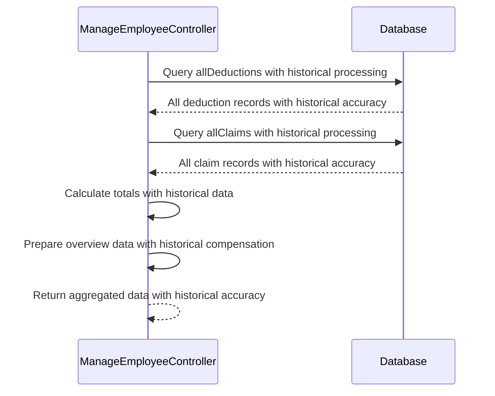
```mermaid
sequenceDiagram
participant Controller as ManageEmployeeController
participant Database as Database
Controller->>Database : Query allDeductions with historical processing
Database-->>Controller : All deduction records with historical accuracy
Controller->>Database : Query allClaims with historical processing
Database-->>Controller : All claim records with historical accuracy
Controller->>Controller : Calculate totals with historical data
Controller->>Controller : Prepare overview data with historical compensation
Controller-->>Controller : Return aggregated data with historical accuracy
```

**Diagram sources**
- [ManageEmployeeController.php:128-142](file://app/Http/Controllers/ManageEmployeeController.php#L128-L142)

The new aggregation methods provide:
- **allDeductions**: Unpaginated collection of all employee deductions with deduction type relationships and historical compensation processing
- **allClaims**: Unpaginated collection of all employee claims with claim type relationships and historical data processing
- **Total Calculations**: Automatic calculation of total deductions and claims amounts with historical accuracy
- **Overview Integration**: Seamless integration with overview and reports sections with historical compensation data
- **Performance Optimization**: Efficient data retrieval for reporting without pagination overhead and historical calculation performance
- **Historical Data Processing**: Sophisticated historical compensation calculation for accurate reporting

**Section sources**
- [ManageEmployeeController.php:128-142](file://app/Http/Controllers/ManageEmployeeController.php#L128-L142)

## Enhanced PERA and RATA Management Components

**Updated** The PERA and RATA management components have been completely redesigned with full CRUD operations, professional UI design, custom date picker integration, comprehensive form validation, and enhanced user feedback through toast notifications.

### PERA Management Component

The PERA management component provides a comprehensive interface for managing profit-sharing contributions with full CRUD functionality and professional user experience:

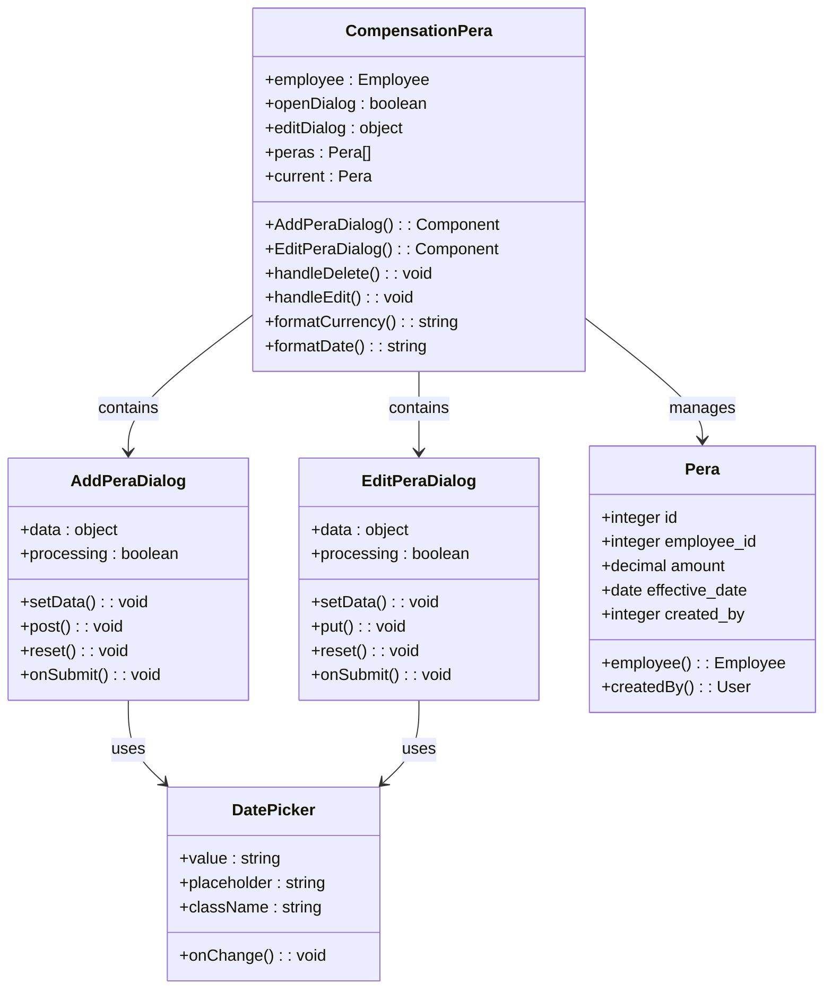
```mermaid
classDiagram
class CompensationPera {
+employee : Employee
+openDialog : boolean
+editDialog : object
+peras : Pera[]
+current : Pera
+AddPeraDialog() : Component
+EditPeraDialog() : Component
+handleDelete() : void
+handleEdit() : void
+formatCurrency() : string
+formatDate() : string
}
class AddPeraDialog {
+data : object
+setData() : void
+post() : void
+processing : boolean
+reset() : void
+onSubmit() : void
}
class EditPeraDialog {
+data : object
+setData() : void
+put() : void
+processing : boolean
+reset() : void
+onSubmit() : void
}
class Pera {
+integer id
+integer employee_id
+decimal amount
+date effective_date
+integer created_by
+employee() : Employee
+createdBy() : User
}
class DatePicker {
+value : string
+onChange() : void
+placeholder : string
+className : string
}
CompensationPera --> AddPeraDialog : contains
CompensationPera --> EditPeraDialog : contains
CompensationPera --> Pera : manages
AddPeraDialog --> DatePicker : uses
EditPeraDialog --> DatePicker : uses
```

**Diagram sources**
- [pera.tsx:14-260](file://resources/js/pages/Employees/Manage/compensation/pera.tsx#L14-L260)
- [Pera.php:8-41](file://app/Models/Pera.php#L8-L41)

Key features of the PERA component include:
- **Professional UI Design**: Gradient cards with blue/purple color scheme for visual distinction
- **Full CRUD Operations**: Complete create, read, update, and delete functionality
- **Custom Date Picker Integration**: Professional date selection with validation and formatting
- **Form Validation**: Client-side validation with proper error handling
- **User Feedback**: Toast notifications for success and error states
- **Currency Formatting**: Philippine peso formatting with proper localization
- **Effective Date Display**: Proper date formatting with calendar icons
- **Modal Dialogs**: Professional modal interfaces for add/edit operations
- **Action Buttons**: Edit and delete functionality with proper icons and styling
- **Current PERA Display**: Dedicated card for current PERA amount and effective date

### RATA Management Component

The RATA management component provides a comprehensive interface for managing retirement allowance with eligibility validation, full CRUD operations, and professional user experience:

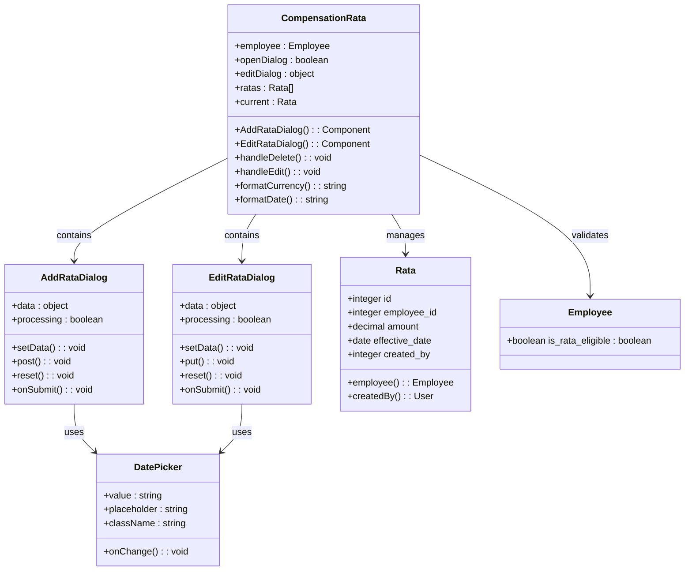
```mermaid
classDiagram
class CompensationRata {
+employee : Employee
+openDialog : boolean
+editDialog : object
+ratas : Rata[]
+current : Rata
+AddRataDialog() : Component
+EditRataDialog() : Component
+handleDelete() : void
+handleEdit() : void
+formatCurrency() : string
+formatDate() : string
}
class AddRataDialog {
+data : object
+setData() : void
+post() : void
+processing : boolean
+reset() : void
+onSubmit() : void
}
class EditRataDialog {
+data : object
+setData() : void
+put() : void
+processing : boolean
+reset() : void
+onSubmit() : void
}
class Rata {
+integer id
+integer employee_id
+decimal amount
+date effective_date
+integer created_by
+employee() : Employee
+createdBy() : User
}
class DatePicker {
+value : string
+onChange() : void
+placeholder : string
+className : string
}
class Employee {
+boolean is_rata_eligible : boolean
}
CompensationRata --> AddRataDialog : contains
CompensationRata --> EditRataDialog : contains
CompensationRata --> Rata : manages
CompensationRata --> Employee : validates
AddRataDialog --> DatePicker : uses
EditRataDialog --> DatePicker : uses
```

**Diagram sources**
- [rata.tsx:14-269](file://resources/js/pages/Employees/Manage/compensation/rata.tsx#L14-L269)
- [Rata.php:8-41](file://app/Models/Rata.php#L8-L41)
- [Employee.php:14-104](file://app/Models/Employee.php#L14-L104)

Key features of the RATA component include:
- **Eligibility Validation**: Conditional UI rendering based on employee RATA eligibility
- **Professional UI Design**: Gradient cards with purple/violet color scheme
- **Full CRUD Operations**: Complete create, read, update, and delete functionality
- **Custom Date Picker Integration**: Professional date selection with validation and formatting
- **Form Validation**: Client-side validation with proper error handling
- **User Feedback**: Toast notifications for success and error states
- **Currency Formatting**: Philippine peso formatting with proper localization
- **Effective Date Display**: Proper date formatting with calendar icons
- **Modal Dialogs**: Professional modal interfaces for add/edit operations
- **Action Buttons**: Edit and delete functionality with proper icons and styling
- **Current RATA Display**: Dedicated card for current RATA amount and effective date
- **Eligibility Notice**: Informative message for non-eligible employees

### Backend Controller Enhancements

The backend controllers for PERA and RATA have been enhanced with comprehensive CRUD operations and validation:

**PeraController**
- **Store Method**: Validates employee_id, amount, and effective_date with numeric and date validation
- **Update Method**: Validates and updates existing PERA records with proper authorization
- **Destroy Method**: Deletes PERA records with proper authorization and feedback
- **History Method**: Provides detailed history view with creator information
- **Index Method**: Supports filtering by search, office, and employment status with pagination

**RataController**
- **Store Method**: Validates employee_id, amount, and effective_date with numeric and date validation
- **Update Method**: Validates and updates existing RATA records with proper authorization
- **Destroy Method**: Deletes RATA records with proper authorization and feedback
- **History Method**: Provides detailed history view with creator information
- **Index Method**: Filters by RATA eligibility, search, office, and employment status with pagination

**Section sources**
- [pera.tsx:18-260](file://resources/js/pages/Employees/Manage/compensation/pera.tsx#L18-L260)
- [rata.tsx:18-269](file://resources/js/pages/Employees/Manage/compensation/rata.tsx#L18-L269)
- [PeraController.php:66-106](file://app/Http/Controllers/PeraController.php#L66-L106)
- [RataController.php:67-107](file://app/Http/Controllers/RataController.php#L67-L107)

## Custom DatePicker Component Integration

**Updated** The system now includes a custom DatePicker component that provides professional date selection with validation, formatting, and integration with the PERA and RATA management components.

The custom DatePicker component offers a comprehensive date selection interface with the following features:

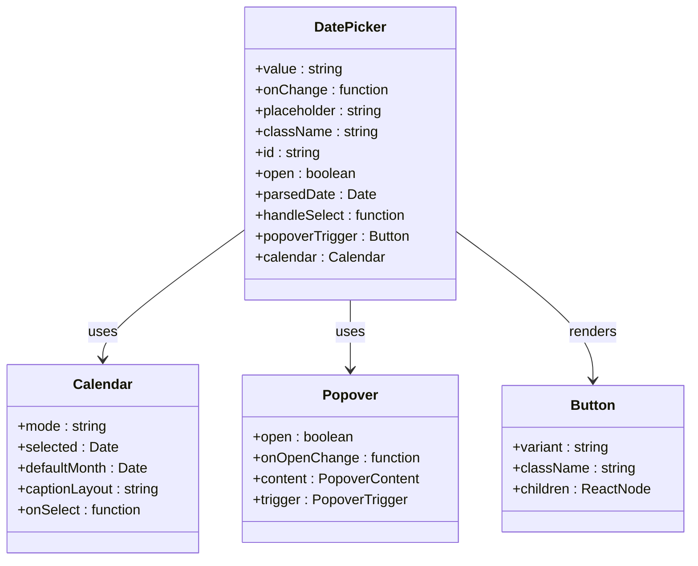
```mermaid
classDiagram
class DatePicker {
+value : string
+onChange : function
+placeholder : string
+className : string
+id : string
+open : boolean
+parsedDate : Date
+handleSelect : function
+popoverTrigger : Button
+calendar : Calendar
}
class Calendar {
+mode : string
+selected : Date
+defaultMonth : Date
+captionLayout : string
+onSelect : function
}
class Popover {
+open : boolean
+onOpenChange : function
+content : PopoverContent
+trigger : PopoverTrigger
}
class Button {
+variant : string
+className : string
+children : ReactNode
}
DatePicker --> Calendar : uses
DatePicker --> Popover : uses
DatePicker --> Button : renders
```

**Diagram sources**
- [custom-date-picker.tsx:11-55](file://resources/js/components/custom-date-picker.tsx#L11-L55)

### Key Features of the DatePicker Component

**Professional Date Selection Interface**
- **Dropdown Calendar**: Calendar component with dropdown caption layout for month/year selection
- **ISO String Format**: Returns dates in "yyyy-MM-dd" format for backend compatibility
- **Validation Support**: Proper date parsing and validation with fallback handling
- **Accessibility**: Keyboard navigation and screen reader support with proper ARIA labels

**Integration with PERA and RATA Components**
- **Form Integration**: Seamlessly integrated into PERA and RATA add/edit dialogs
- **State Management**: Proper state synchronization with form data
- **Error Handling**: Graceful handling of invalid dates and empty values
- **Formatting**: Proper date formatting for display ("MM/dd/yyyy") while maintaining ISO format internally

**Technical Implementation**
- **Date Parsing**: Uses date-fns library for reliable date parsing and formatting
- **State Management**: React state hooks for open/close state and selected date
- **Event Handling**: Proper event handling for date selection and input changes
- **Type Safety**: TypeScript interfaces for type-safe prop passing

**User Experience Features**
- **Visual Feedback**: Calendar icon and placeholder text for clear indication
- **Responsive Design**: Adapts to different screen sizes and input widths
- **Consistent Styling**: Matches the application's design system with Tailwind CSS classes
- **Smooth Interaction**: Animated popover transitions and smooth calendar interactions

**Section sources**
- [custom-date-picker.tsx:19-55](file://resources/js/components/custom-date-picker.tsx#L19-L55)
- [pera.tsx:59-61](file://resources/js/pages/Employees/Manage/compensation/pera.tsx#L59-L61)
- [rata.tsx:59-61](file://resources/js/pages/Employees/Manage/compensation/rata.tsx#L59-L61)

## Enhanced Form Validation and User Feedback

**Updated** The system now includes comprehensive form validation, error handling, and user feedback mechanisms through toast notifications for all CRUD operations in the PERA and RATA management components.

### Form Validation Implementation

The PERA and RATA components implement comprehensive form validation at multiple levels:

**Client-Side Validation**
- **Required Fields**: Amount and effective_date fields are required with proper HTML5 validation
- **Numeric Validation**: Amount field accepts only numeric values with decimal support
- **Range Validation**: Minimum value validation (>= 0) for amount fields
- **Date Validation**: Effective_date validation with proper date format requirements
- **Real-time Feedback**: Immediate validation feedback during form input

**Backend Validation**
- **Server-side Validation**: Laravel validation rules for data integrity
- **Unique Constraints**: Prevention of duplicate effective dates for the same employee
- **Authorization**: Proper authorization checks for CRUD operations
- **Error Handling**: Comprehensive error handling with user-friendly messages

### Toast Notification System

The system implements a comprehensive toast notification system for user feedback:

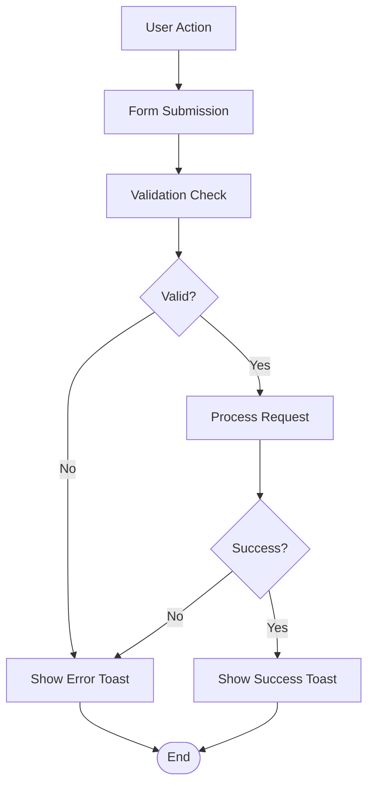
```mermaid
flowchart TD
UserAction["User Action"] --> FormSubmit["Form Submission"]
FormSubmit --> Validation["Validation Check"]
Validation --> Valid{"Valid?"}
Valid --> |No| ShowError["Show Error Toast"]
Valid --> |Yes| ProcessRequest["Process Request"]
ProcessRequest --> Success{"Success?"}
Success --> |No| ShowError
Success --> |Yes| ShowSuccess["Show Success Toast"]
ShowError --> End([End])
ShowSuccess --> End
```

**Toast Notification Types**
- **Success Notifications**: Confirmation of successful operations (add/update/delete)
- **Error Notifications**: Error messages for failed operations with validation errors
- **Confirmation Dialogs**: Delete confirmation with user consent
- **Processing States**: Loading indicators during form submission

**Notification Content**
- **PERA Operations**: "PERA added successfully", "PERA updated successfully", "Failed to add PERA", "Failed to update PERA", "PERA record deleted successfully", "Failed to delete PERA record"
- **RATA Operations**: "RATA added successfully", "RATA updated successfully", "Failed to add RATA", "Failed to update RATA", "RATA record deleted successfully", "Failed to delete RATA record"
- **User Feedback**: Professional messaging with clear action outcomes

**Section sources**
- [pera.tsx:25-35](file://resources/js/pages/Employees/Manage/compensation/pera.tsx#L25-L35)
- [pera.tsx:95-107](file://resources/js/pages/Employees/Manage/compensation/pera.tsx#L95-L107)
- [pera.tsx:167-174](file://resources/js/pages/Employees/Manage/compensation/pera.tsx#L167-L174)
- [rata.tsx:25-35](file://resources/js/pages/Employees/Manage/compensation/rata.tsx#L25-L35)
- [rata.tsx:95-107](file://resources/js/pages/Employees/Manage/compensation/rata.tsx#L95-L107)
- [rata.tsx:167-174](file://resources/js/pages/Employees/Manage/compensation/rata.tsx#L167-L174)

## Compensation Management Workflows

### Employee Onboarding Workflow

The employee onboarding process integrates multiple systems to establish a complete compensation profile with comprehensive deduction management, sophisticated pagination, and historical compensation calculation capabilities:

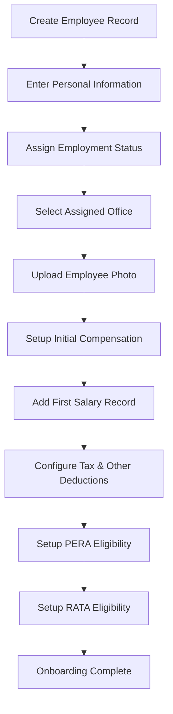
```mermaid
flowchart TD
CreateEmployee["Create Employee Record"] --> SetBasicInfo["Enter Personal Information"]
SetBasicInfo --> AssignStatus["Assign Employment Status"]
AssignStatus --> SelectOffice["Select Assigned Office"]
SelectOffice --> UploadPhoto["Upload Employee Photo"]
UploadPhoto --> SetupCompensation["Setup Initial Compensation"]
SetupCompensation --> AddSalary["Add First Salary Record"]
AddSalary --> ConfigureDeductions["Configure Tax & Other Deductions"]
ConfigureDeductions --> SetupPerf["Setup PERA Eligibility"]
SetupPerf --> SetupRata["Setup RATA Eligibility"]
SetupRata --> CompleteOnboarding["Onboarding Complete"]
```

### Enhanced Pay Period Processing Workflow

The monthly payroll processing follows a systematic approach to ensure accurate compensation calculation with comprehensive deduction management, advanced filtering, and historical compensation calculation for accurate period-specific payroll processing:

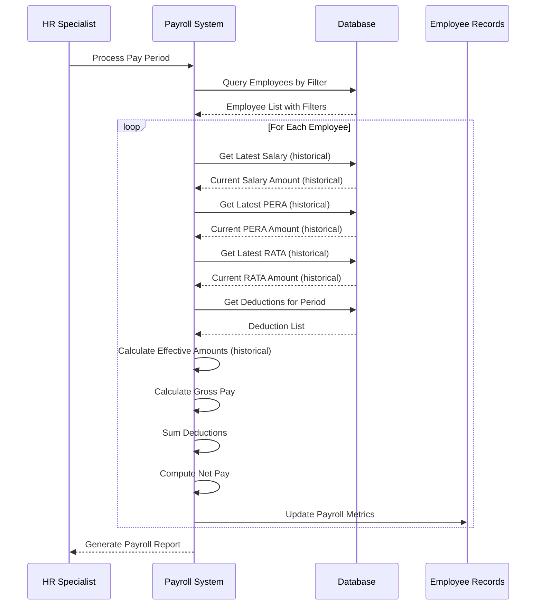
```mermaid
sequenceDiagram
participant HR as HR Specialist
participant System as Payroll System
participant Database as Database
participant Employee as Employee Records
HR->>System : Process Pay Period
System->>Database : Query Employees by Filter
Database-->>System : Employee List with Filters
loop For Each Employee
System->>Database : Get Latest Salary (historical)
Database-->>System : Current Salary Amount (historical)
System->>Database : Get Latest PERA (historical)
Database-->>System : Current PERA Amount (historical)
System->>Database : Get Latest RATA (historical)
Database-->>System : Current RATA Amount (historical)
System->>Database : Get Deductions for Period
Database-->>System : Deduction List
System->>System : Calculate Effective Amounts (historical)
System->>System : Calculate Gross Pay
System->>System : Sum Deductions
System->>System : Compute Net Pay
System->>Employee : Update Payroll Metrics
end
System-->>HR : Generate Payroll Report
```

**Diagram sources**
- [PayrollController.php:13-125](file://app/Http/Controllers/PayrollController.php#L13-L125)

### Comprehensive Compensation Change Management

The system maintains comprehensive audit trails for all compensation modifications with enhanced deduction management, sophisticated pagination, filtering, and historical compensation calculation capabilities:

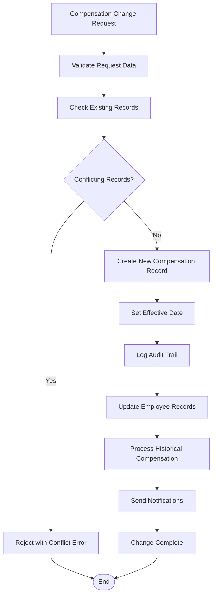
```mermaid
flowchart TD
RequestChange["Compensation Change Request"] --> ValidateRequest["Validate Request Data"]
ValidateRequest --> CheckExisting["Check Existing Records"]
CheckExisting --> Conflict{"Conflicting Records?"}
Conflict --> |Yes| RejectRequest["Reject with Conflict Error"]
Conflict --> |No| CreateRecord["Create New Compensation Record"]
CreateRecord --> SetEffectiveDate["Set Effective Date"]
SetEffectiveDate --> LogAudit["Log Audit Trail"]
LogAudit --> UpdateEmployee["Update Employee Records"]
UpdateEmployee --> HistoricalCalc["Process Historical Compensation"]
HistoricalCalc --> Notify["Send Notifications"]
Notify --> Complete["Change Complete"]
RejectRequest --> End([End])
Complete --> End
```

### Enhanced Deduction Management Workflow

The comprehensive deduction management system provides streamlined workflows for deduction creation, editing, and period-based organization with sophisticated pagination, filtering, and historical compensation calculation:

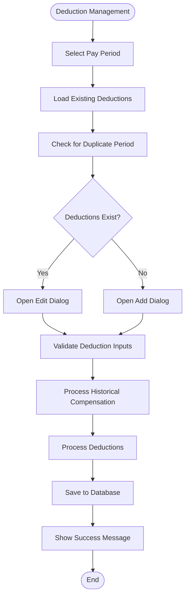
```mermaid
flowchart TD
Start([Deduction Management]) --> SelectPeriod["Select Pay Period"]
SelectPeriod --> LoadDeductions["Load Existing Deductions"]
LoadDeductions --> CheckDuplicates["Check for Duplicate Period"]
CheckDuplicates --> HasDeductions{"Deductions Exist?"}
HasDeductions --> |Yes| EditMode["Open Edit Dialog"]
HasDeductions --> |No| AddMode["Open Add Dialog"]
EditMode --> ValidateInputs["Validate Deduction Inputs"]
AddMode --> ValidateInputs
ValidateInputs --> HistoricalCalc["Process Historical Compensation"]
HistoricalCalc --> ProcessDeductions["Process Deductions"]
ProcessDeductions --> SaveDeductions["Save to Database"]
SaveDeductions --> Success["Show Success Message"]
Success --> End([End])
```

**Diagram sources**
- [ManageEmployeeController.php:178-210](file://app/Http/Controllers/ManageEmployeeController.php#L178-L210)
- [salaryDialog.tsx:80-98](file://resources/js/pages/Employees/Manage/compensation/salaryDialog.tsx#L80-L98)

### Enhanced PERA and RATA Management Workflow

The enhanced PERA and RATA management system provides streamlined workflows for compensation record management with full CRUD operations, custom date picker integration, and comprehensive user feedback:

```mermaid
flowchart TD
Start([PERA/RATA Management]) --> ViewCurrent["View Current Record"]
ViewCurrent --> AddRecord["Add New Record"]
AddRecord --> SelectDate["Select Effective Date"]
SelectDate --> EnterAmount["Enter Amount"]
EnterAmount --> ValidateForm["Validate Form"]
ValidateForm --> Valid{"Valid?"}
Valid --> |No| ShowErrors["Show Validation Errors"]
Valid --> |Yes| SubmitForm["Submit Form"]
SubmitForm --> ShowSuccess["Show Success Toast"]
ShowSuccess --> UpdateUI["Update UI"]
UpdateUI --> ViewHistory["View History"]
ViewHistory --> EditRecord["Edit Existing Record"]
EditRecord --> DeleteRecord["Delete Record"]
DeleteRecord --> ConfirmDelete["Confirm Delete"]
ConfirmDelete --> ShowDeleteToast["Show Delete Toast"]
ShowDeleteToast --> End([End])
ShowErrors --> End
```

**Diagram sources**
- [pera.tsx:18-260](file://resources/js/pages/Employees/Manage/compensation/pera.tsx#L18-L260)
- [rata.tsx:18-269](file://resources/js/pages/Employees/Manage/compensation/rata.tsx#L18-L269)

### Sophisticated Pagination and Filtering Workflow

The enhanced deduction management system provides comprehensive pagination and filtering capabilities with historical compensation calculation:

```mermaid
flowchart TD
Start([Deduction Management]) --> LoadPage["Load First Page"]
LoadPage --> DisplayPeriods["Display Period Groups"]
DisplayPeriods --> CheckPagination{"More Pages?"}
CheckPagination --> |Yes| ShowPagination["Show Pagination Controls"]
CheckPagination --> |No| HidePagination["Hide Pagination Controls"]
ShowPagination --> FilterDeductions["Apply Month/Year Filters"]
FilterDeductions --> HistoricalCalc["Process Historical Compensation"]
HistoricalCalc --> UpdateURL["Update URL Parameters"]
UpdateURL --> ReloadData["Reload Filtered Data"]
ReloadData --> DisplayResults["Display Filtered Results"]
DisplayResults --> NavigatePages["Navigate Between Pages"]
NavigatePages --> LoadNextPage["Load Next Page"]
LoadNextPage --> HistoricalCalc
HistoricalCalc --> DisplayNextPage["Display Next Page"]
DisplayNextPage --> End([End])
```

**Diagram sources**
- [deductions.tsx:58-76](file://resources/js/pages/Employees/Manage/compensation/deductions.tsx#L58-L76)
- [ManageEmployeeController.php:54-114](file://app/Http/Controllers/ManageEmployeeController.php#L54-L114)

### Integrated Manage Page Workflow

The new integrated manage page workflow streamlines deduction management through dedicated tabs, consolidated interfaces, and historical compensation calculation capabilities:

```mermaid
flowchart TD
Start([Manage Employee]) --> LoadTabs["Load All Tabs"]
LoadTabs --> OverviewTab["Overview Tab"]
OverviewTab --> CompensationTab["Compensation Tab"]
CompensationTab --> DeductionsTab["Deductions Tab"]
DeductionsTab --> ClaimsTab["Claims Tab"]
ClaimsTab --> ReportsTab["Reports Tab"]
ReportsTab --> SettingsTab["Settings Tab"]
DeductionsTab --> DirectDeductionManagement["Direct Deduction Management"]
DirectDeductionManagement --> PeriodGrouping["Period-Based Grouping"]
PeriodGrouping --> FilterControls["Filter Controls"]
FilterControls --> PaginationControls["Pagination Controls"]
PaginationControls --> EditFunctionality["Edit Functionality"]
EditFunctionality --> HistoricalCalc["Historical Compensation Calculation"]
HistoricalCalc --> End([End])
```

**Diagram sources**
- [Manage.tsx:138-201](file://resources/js/pages/Employees/Manage/Manage.tsx#L138-L201)

The integrated workflow features:
- **Deductions Tab**: Dedicated tab for comprehensive deduction management with historical compensation calculation
- **Streamlined Compensation**: Simplified compensation section without complex deduction interface
- **Direct Component Integration**: CompensationDeductions component integrated directly into main page with historical data processing
- **Enhanced Navigation**: Improved tab-based navigation for better user experience
- **Consolidated Data**: Unified data access for all employee information with historical accuracy
- **Historical Integration**: Seamless integration of historical compensation calculation across all management functions

**Section sources**
- [Manage.tsx:171-185](file://resources/js/pages/Employees/Manage/Manage.tsx#L171-L185)

## Data Models and Relationships

The system utilizes a comprehensive entity relationship model that supports complex compensation scenarios with enhanced deduction management, sophisticated pagination, and historical compensation calculation capabilities:

```mermaid
erDiagram
EMPLOYEES {
integer id PK
string first_name
string middle_name
string last_name
string suffix
string position
boolean is_rata_eligible
string image_path
integer employment_status_id FK
integer office_id FK
integer created_by FK
timestamp created_at
timestamp updated_at
timestamp deleted_at
}
EMPLOYMENT_STATUSES {
integer id PK
string name
string description
timestamp created_at
timestamp updated_at
}
OFFICES {
integer id PK
string name
string location
timestamp created_at
timestamp updated_at
}
SALARIES {
integer id PK
integer employee_id FK
decimal amount
date effective_date
date end_date
integer created_by FK
timestamp created_at
timestamp updated_at
timestamp deleted_at
}
PERAS {
integer id PK
integer employee_id FK
decimal amount
date effective_date
integer created_by FK
timestamp created_at
timestamp updated_at
timestamp deleted_at
}
RATAS {
integer id PK
integer employee_id FK
decimal amount
date effective_date
integer created_by FK
timestamp created_at
timestamp updated_at
timestamp deleted_at
}
DEDUCTION_TYPES {
integer id PK
string name
string code
string description
boolean is_active
timestamp created_at
timestamp updated_at
}
EMPLOYEE_DEDUCTIONS {
integer id PK
integer employee_id FK
integer deduction_type_id FK
decimal amount
integer pay_period_month
integer pay_period_year
string notes
integer created_by FK
timestamp created_at
timestamp updated_at
}
CLAIMS {
integer id PK
integer employee_id FK
integer claim_type_id FK
decimal amount
date claim_date
string notes
integer created_by FK
timestamp created_at
timestamp updated_at
}
CLAIM_TYPES {
integer id PK
string name
string code
string description
boolean is_active
timestamp created_at
timestamp updated_at
}
USERS {
integer id PK
string name
string email
timestamp email_verified_at
string password
remember_token
timestamp created_at
timestamp updated_at
}
EMPLOYEES ||--|| EMPLOYMENT_STATUSES : "belongs to"
EMPLOYEES ||--|| OFFICES : "belongs to"
EMPLOYEES ||--o{ SALARIES : "has many"
EMPLOYEES ||--o{ PERAS : "has many"
EMPLOYEES ||--o{ RATAS : "has many"
EMPLOYEES ||--o{ EMPLOYEE_DEDUCTIONS : "has many"
EMPLOYEES ||--o{ CLAIMS : "has many"
DEDUCTION_TYPES ||--o{ EMPLOYEE_DEDUCTIONS : "has many"
CLAIM_TYPES ||--o{ CLAIMS : "has many"
EMPLOYEES ||--o{ EMPLOYEE_DEDUCTIONS : "has many"
EMPLOYEES ||--o{ CLAIMS : "has many"
USERS ||--o{ EMPLOYEES : "created"
USERS ||--o{ SALARIES : "created"
USERS ||--o{ PERAS : "created"
USERS ||--o{ RATAS : "created"
USERS ||--o{ EMPLOYEE_DEDUCTIONS : "created"
USERS ||--o{ CLAIMS : "created"
```

**Diagram sources**
- [Employee.php:14-104](file://app/Models/Employee.php#L14-L104)
- [Salary.php:12-36](file://app/Models/Salary.php#L12-L36)
- [Pera.php:10-41](file://app/Models/Pera.php#L10-L41)
- [Rata.php:10-41](file://app/Models/Rata.php#L10-L41)
- [EmployeeDeduction.php:10-59](file://app/Models/EmployeeDeduction.php#L10-L59)
- [DeductionType.php:9-33](file://app/Models/DeductionType.php#L9-L33)
- [Claim.php:10-41](file://app/Models/Claim.php#L10-L41)
- [ClaimType.php:9-33](file://app/Models/ClaimType.php#L9-L33)

### Data Validation and Constraints

The system implements comprehensive data validation at multiple levels with enhanced deduction management, sophisticated pagination, filtering, and historical compensation calculation capabilities:

- **Model Level Validation**: Type casting and attribute casting for financial data
- **Database Constraints**: Foreign key relationships and check constraints
- **Application Level Validation**: Form validation with custom rules, conflict detection, and historical data validation
- **Business Rule Validation**: Eligibility checks, conflict resolution, duplicate prevention, and historical data accuracy
- **Deduction Validation**: Period-based validation, amount processing rules, and historical calculation validation
- **Pagination Validation**: Page number validation, boundary checking, and historical data pagination validation
- **Filter Validation**: Month/year range validation, filter parameter sanitization, and historical data filtering validation
- **New Aggregation Validation**: Data integrity checks for allDeductions and allClaims methods with historical accuracy
- **Historical Compensation Validation**: Sophisticated validation for historical data processing and calculation accuracy
- **PERA/RATA Validation**: Custom validation rules for profit-sharing and retirement allowance records
- **Date Picker Validation**: Proper date validation and formatting for effective dates
- **Toast Notification Validation**: Proper error handling and user feedback for all operations

**Section sources**
- [Employee.php:27-29](file://app/Models/Employee.php#L27-L29)
- [Salary.php:20-24](file://app/Models/Salary.php#L20-L24)
- [EmployeeDeduction.php:20-24](file://app/Models/EmployeeDeduction.php#L20-L24)
- [Pera.php:17-20](file://app/Models/Pera.php#L17-L20)
- [Rata.php:17-20](file://app/Models/Rata.php#L17-L20)

## User Interface Components

The frontend components provide intuitive interfaces for managing employee compensation with comprehensive deduction management, sophisticated pagination, advanced filtering capabilities, and historical compensation calculation for accurate period-specific processing.

### Enhanced Employee Management Interface
- **Employee Listing**: Searchable grid with sorting and filtering capabilities, pagination, and historical data display
- **Employee Creation**: Multi-step form with validation feedback and historical data entry
- **Employee Editing**: Comprehensive profile management with photo upload and historical compensation tracking
- **Employee Details**: Historical compensation view with timeline visualization and historical calculation display
- **Enhanced Compensation Tabs**: Dedicated tabs for salary, PERA, RATA, and deductions management with pagination controls and historical compensation display
- **Sophisticated Deduction Interface**: Professional deduction management with period-based grouping, pagination, filtering, and historical compensation calculation
- **Integrated Deductions Tab**: New dedicated tab for comprehensive deduction management within main Manage page with historical data processing
- **Streamlined Compensation Interface**: Simplified compensation section without complex deduction management, historical calculation display
- **Historical Compensation Display**: Real-time historical compensation calculation in all interfaces
- **Professional PERA/RATA Interfaces**: Enhanced UI design with gradient cards, currency formatting, and effective date display

### Enhanced Compensation Management Interfaces
- **Salary Management**: Historical salary tracking with effective date management, full CRUD operations, and historical calculation display
- **PERA Management**: Profit-sharing contribution tracking and history with full CRUD operations, custom date picker integration, and comprehensive user feedback
- **RATA Management**: Retirement allowance calculation and history with full CRUD operations, eligibility validation, custom date picker integration, and professional UI design
- **Deduction Management**: Comprehensive deduction type configuration and assignment with period-based organization, pagination, filtering, and historical compensation calculation
- **Deduction Dialog**: Interactive dialog for adding and editing deductions with real-time validation, conflict detection, and historical data processing
- **Pagination Controls**: Professional pagination interface with page navigation, record counting, and historical data grouping
- **Integrated Deduction Management**: Direct integration of CompensationDeductions component into main Manage page with historical compensation calculation
- **Historical Compensation Integration**: Seamless integration of historical compensation calculation across all management interfaces
- **Custom Date Picker Integration**: Professional date selection component with validation and formatting

### Advanced Deduction Management Components
- **Deduction Groups**: Period-based grouping of deductions for better organization with pagination and historical compensation calculation
- **Edit Functionality**: Full CRUD operations for existing deduction periods with conflict detection and historical data accuracy
- **Duplicate Prevention**: Automatic detection and prevention of duplicate entries with period conflict warnings and historical calculation validation
- **Real-time Validation**: Form validation with immediate feedback, error handling, and historical data processing
- **Professional UI**: Currency formatting, professional styling, responsive design, and historical compensation display
- **Sophisticated Filtering**: Advanced month/year filtering with clear filter options, historical data accuracy, and historical calculation support
- **Pagination System**: Comprehensive pagination controls with page navigation, record count display, and historical data grouping
- **New Deductions Tab**: Dedicated tab for comprehensive deduction management within main interface with historical compensation processing
- **Historical Calculation Integration**: Real-time historical compensation calculation in all deduction management interfaces

### Custom DatePicker Component
- **Professional Date Selection**: Dropdown calendar with month/year selection and proper validation
- **Integration Support**: Seamless integration with PERA and RATA management components
- **State Management**: Proper state synchronization with form data and validation
- **Error Handling**: Graceful handling of invalid dates and empty values
- **Formatting Support**: Proper date formatting for display while maintaining ISO format internally
- **Accessibility**: Keyboard navigation and screen reader support with proper ARIA labels

### Responsive Design Features
- **Mobile Optimization**: Touch-friendly interfaces for mobile devices with responsive filter controls and historical data display
- **Accessibility**: Screen reader support and keyboard navigation with ARIA labels and historical data accessibility
- **Performance**: Lazy loading, efficient data fetching, pagination, and historical calculation performance optimization
- **Real-time Updates**: Live updates for new compensation records with pagination refresh and historical data accuracy
- **Enhanced User Experience**: Streamlined workflows for deduction management with sophisticated filtering, pagination, and historical compensation calculation
- **Integrated Navigation**: Seamless tab-based navigation for all management functions with historical data integration
- **Historical Data Display**: Consistent historical compensation calculation across all user interfaces
- **Professional Styling**: Consistent design system with gradient cards, proper spacing, and responsive layouts

## Performance Considerations

The system implements several performance optimization strategies with enhanced deduction management, sophisticated pagination, advanced filtering, and historical compensation calculation capabilities.

### Database Optimization
- **Eager Loading**: Strategic use of with() to prevent N+1 query problems with historical data loading
- **Indexing Strategy**: Proper indexing on frequently queried columns including pay_period_month, pay_period_year, and effective_date
- **Query Optimization**: Optimized queries with appropriate joins, filters, and historical data retrieval
- **Deduction Query Optimization**: Efficient querying of period-specific deductions with pagination support and historical calculation
- **Filter Optimization**: Optimized filtering queries for month/year combinations with historical data accuracy
- **New Aggregation Queries**: Efficient data aggregation for allDeductions and allClaims without pagination overhead and historical processing
- **Historical Query Optimization**: Optimized historical data queries with effective_date filtering and calculation optimization
- **PERA/RATA Query Optimization**: Efficient querying of PERA and RATA records with proper indexing and filtering

### Caching Strategy
- **Model Caching**: Frequently accessed lookup data cached in memory with historical data caching
- **Page Caching**: Payroll summaries cached for improved response times with historical calculation caching
- **Query Result Caching**: Expensive query results cached for configurable periods with historical data caching
- **Deduction Type Caching**: Active deduction types cached for quick access with historical data caching
- **Pagination Data Caching**: Paginated deduction data cached for improved navigation performance with historical accuracy
- **Aggregated Data Caching**: Overview and report data cached for improved performance with historical calculation caching
- **Historical Data Caching**: Historical compensation data cached for improved calculation performance
- **PERA/RATA Data Caching**: PERA and RATA records cached for improved management interface performance

### Frontend Performance
- **Component Lazy Loading**: Dynamic imports for route-based code splitting with historical data component loading
- **Image Optimization**: Efficient image handling and lazy loading with historical data display optimization
- **State Management**: Efficient state updates with minimal re-renders and historical data state management
- **Bundle Optimization**: Tree shaking and dead code elimination with historical calculation optimization
- **Deduction State Management**: Optimized state handling for period-based deduction groups with historical data
- **Pagination State Management**: Efficient pagination state handling with URL parameter synchronization and historical data
- **Filter State Management**: Optimized filter state management with real-time updates and historical calculation
- **Integrated Component Performance**: Optimized performance for integrated CompensationDeductions component with historical calculation
- **Historical Calculation Performance**: Optimized client-side historical compensation calculation with caching and performance optimization
- **DatePicker Performance**: Optimized date picker component with efficient state management and rendering

### Scalability Considerations
- **Horizontal Scaling**: Stateless controllers support load balancing with historical calculation scaling
- **Database Scaling**: Optimized queries support database replication with historical data replication
- **Caching Layer**: Redis or similar caching for distributed environments with historical data caching
- **Background Processing**: Queue-based processing for heavy computations with historical data processing
- **Deduction Batch Processing**: Efficient batch processing for multiple deduction updates with historical accuracy
- **Pagination Scalability**: Efficient pagination for large datasets with optimized query patterns and historical data
- **Aggregation Scalability**: Optimized data aggregation for large-scale reporting with historical calculation
- **Historical Data Scalability**: Efficient historical data processing and calculation for large-scale historical compensation tracking
- **PERA/RATA Scalability**: Efficient historical data processing for large-scale PERA and RATA management

## Troubleshooting Guide

### Common Issues and Solutions

**Employee Photo Upload Failures**
- Verify file size limits (2MB max) and supported formats (JPG, PNG, WEBP)
- Check storage permissions for the employees directory
- Ensure proper MIME type validation is configured

**Enhanced Payroll Calculation Errors**
- Verify that salary, PERA, and RATA records have proper effective dates
- Check for overlapping compensation records
- Ensure deduction types are properly configured and active
- Validate period-based deduction conflicts
- Check pagination parameter validation for deduction queries
- **New Issue**: Verify new allDeductions and allClaims aggregation methods are working correctly
- **New Issue**: Validate historical compensation calculation accuracy for payroll processing

**PERA/RATA Management Issues**
- **Issue**: Custom date picker not displaying properly in PERA/RATA dialogs
- **Solution**: Verify DatePicker component import and proper prop passing
- **Issue**: Form validation not working for PERA/RATA inputs
- **Solution**: Check validation rules and ensure proper form submission handling
- **Issue**: Toast notifications not appearing for PERA/RATA operations
- **Solution**: Verify toast library import and proper notification configuration
- **Issue**: RATA eligibility validation not working
- **Solution**: Check employee.is_rata_eligible property and conditional UI rendering

**Performance Issues**
- Monitor database query performance and optimize slow queries with historical data optimization
- Implement proper indexing on frequently filtered columns including pay_period_month, pay_period_year, and effective_date
- Consider database connection pooling for high-traffic scenarios with historical data processing
- Optimize deduction query performance for large datasets with pagination and historical calculation
- Monitor pagination query performance for period-based data with historical accuracy
- **New Issue**: Monitor performance of new aggregation methods for allDeductions and allClaims with historical processing
- **New Issue**: Validate historical compensation calculation performance across all system components

**Data Integrity Problems**
- Verify foreign key constraints are properly enforced with historical data integrity
- Check for orphaned records in compensation history with historical accuracy
- Ensure proper cleanup of soft-deleted records with historical data retention
- Validate deduction period uniqueness constraints with historical calculation validation
- Check pagination parameter validation and boundary conditions with historical data
- Verify filter parameter validation for month/year filtering with historical accuracy
- **New Issue**: Verify data integrity of new aggregation methods with historical accuracy
- **New Issue**: Validate historical compensation calculation data integrity

**Deduction Management Issues**
- Verify deduction type configurations are active with historical data support
- Check for duplicate period entries with conflict detection and historical calculation validation
- Ensure proper validation of deduction amounts with historical data accuracy
- Validate pay period month/year ranges with historical calculation validation
- Check pagination parameter handling for deduction queries with historical data
- Verify filter parameter validation for month/year filtering with historical accuracy
- **New Issue**: Verify integration of CompensationDeductions component into main Manage page with historical calculation
- **New Issue**: Validate historical compensation calculation across all deduction management interfaces

**Pagination and Filtering Issues**
- Verify pagination parameter handling in URL routing with historical data
- Check pagination query parameter validation with historical calculation
- Ensure filter parameter validation for month/year selections with historical accuracy
- Verify pagination data grouping and sorting with historical data accuracy
- Check pagination state synchronization with URL parameters and historical data
- **New Issue**: Verify pagination works correctly with new Deductions tab and historical calculation
- **New Issue**: Validate historical data accuracy in pagination results

**Integrated Manage Page Issues**
- **New Issue**: Verify Deductions tab loads correctly with all required data and historical calculation
- **New Issue**: Ensure CompensationDeductions component receives proper props with historical data
- **New Issue**: Verify tab switching works without data loss and historical calculation accuracy
- **New Issue**: Check that new aggregation methods are properly utilized with historical compensation
- **New Issue**: Validate historical compensation calculation across all integrated management interfaces

**Historical Compensation Calculation Issues**
- **New Issue**: Verify getEffectiveAmount method accuracy across all system components
- **New Issue**: Validate historical data processing for salary, PERA, and RATA records
- **New Issue**: Check historical calculation performance and accuracy for large datasets
- **New Issue**: Ensure historical data consistency across backend and frontend calculations
- **New Issue**: Validate historical calculation edge cases and fallback handling

**Custom DatePicker Issues**
- **Issue**: DatePicker component not rendering properly
- **Solution**: Verify component import and proper prop configuration
- **Issue**: Date formatting issues in PERA/RATA components
- **Solution**: Check date parsing and formatting logic in DatePicker component
- **Issue**: Validation errors with date selection
- **Solution**: Verify date validation and error handling in form components

### Debugging Tools and Techniques

**Database Query Logging**
- Enable query logging during development to identify performance bottlenecks with historical data
- Monitor slow query execution times with historical calculation optimization
- Analyze query plans for optimization opportunities with historical data processing
- Track deduction-related query performance with pagination and historical calculation
- Monitor filter query performance for month/year combinations with historical accuracy
- **New Issue**: Monitor performance of new aggregation queries with historical processing
- **New Issue**: Validate historical query performance and optimization

**Application Monitoring**
- Implement structured logging for error tracking with historical calculation debugging
- Monitor application performance metrics with historical data processing monitoring
- Set up alerts for unusual activity patterns with historical data anomalies
- Track deduction processing performance with pagination and historical calculation
- Monitor pagination query performance with historical data accuracy
- **New Issue**: Monitor performance of new aggregation methods with historical processing
- **New Issue**: Validate historical compensation calculation performance monitoring

**Data Validation**
- Implement comprehensive input validation at multiple layers with historical data validation
- Use database constraints to prevent invalid data with historical calculation constraints
- Regular data quality audits to identify inconsistencies with historical accuracy
- Validate deduction type and period combinations with historical calculation validation
- Check pagination parameter validation and boundary conditions with historical data
- Verify filter parameter validation for month/year filtering with historical accuracy
- **New Issue**: Validate new aggregation data integrity with historical accuracy
- **New Issue**: Validate historical compensation calculation data integrity across all components

**Historical Compensation Debugging**
- **New Issue**: Implement historical calculation debugging tools and logging
- **New Issue**: Validate historical data processing across all system components
- **New Issue**: Monitor historical calculation performance and accuracy
- **New Issue**: Test historical calculation edge cases and error handling
- **New Issue**: Validate historical data consistency and accuracy

**PERA/RATA Management Debugging**
- **Issue**: Debug form validation issues in PERA/RATA components
- **Solution**: Check validation rules and error handling in form components
- **Issue**: Debug toast notification issues for PERA/RATA operations
- **Solution**: Verify toast library configuration and notification triggers
- **Issue**: Debug custom date picker integration issues
- **Solution**: Check DatePicker component integration and prop passing
- **Issue**: Debug eligibility validation issues for RATA component
- **Solution**: Verify employee.is_rata_eligible property and conditional rendering

**Section sources**
- [EmployeeController.php:69-83](file://app/Http/Controllers/EmployeeController.php#L69-L83)
- [PayrollController.php:48-67](file://app/Http/Controllers/PayrollController.php#L48-L67)
- [ManageEmployeeController.php:178-210](file://app/Http/Controllers/ManageEmployeeController.php#L178-L210)
- [pera.tsx:25-35](file://resources/js/pages/Employees/Manage/compensation/pera.tsx#L25-L35)
- [rata.tsx:25-35](file://resources/js/pages/Employees/Manage/compensation/rata.tsx#L25-L35)

## Conclusion

The Employee Compensation Management system provides a robust, scalable solution for managing employee compensation across multiple pay components with comprehensive deduction management capabilities, sophisticated pagination, advanced filtering, and enhanced historical compensation calculation. The system's enhanced architecture supports future growth while maintaining performance and reliability.

Key strengths of the system include:

- **Comprehensive Coverage**: Handles all major compensation components (salary, PERA, RATA) with full CRUD operations and historical calculation
- **Advanced Deduction Management**: Complete deduction tracking with period-based organization, editing capabilities, pagination, filtering, and historical compensation calculation
- **Sophisticated Pagination System**: Efficient handling of large datasets with intelligent query patterns, pagination controls, and historical data processing
- **Advanced Filtering**: Sophisticated month/year filtering with clear filter options, real-time updates, and historical data accuracy
- **Audit Trail**: Complete tracking of all compensation changes with enhanced deduction management and historical accuracy
- **Flexible Payroll Processing**: Configurable deduction types and period-based calculations with advanced filtering and historical compensation accuracy
- **Enhanced User Interface**: Intuitive management interfaces with responsive design, professional styling, comprehensive pagination controls, historical compensation display, and custom date picker integration
- **Performance Optimization**: Efficient data handling, caching strategies, optimized deduction processing, pagination performance, historical calculation optimization, and PERA/RATA management performance
- **Security**: Comprehensive validation and authorization controls with enhanced deduction security, pagination validation, historical data security, and PERA/RATA security
- **Streamlined Workflows**: Professional interfaces for deduction management with real-time validation, conflict detection, sophisticated pagination, historical compensation calculation, and custom date picker integration
- **Integrated Management**: Seamless integration of deduction management into main employee management interface with historical data processing
- **Enhanced Reporting**: New data aggregation methods for comprehensive reporting and overview functionality with historical compensation accuracy
- **Historical Compensation Processing**: Sophisticated historical calculation capabilities across backend and frontend components for accurate period-specific processing
- **Multi-layered Historical Data**: Backend and frontend historical calculation capabilities with consistent accuracy and performance
- **Professional UI Design**: Enhanced user interfaces with gradient cards, currency formatting, effective date display, and professional styling
- **Custom Date Picker Integration**: Professional date selection component with validation, formatting, and seamless integration
- **Comprehensive Form Validation**: Multi-level validation with client-side and server-side validation, error handling, and user feedback
- **Toast Notification System**: Professional user feedback mechanism for all CRUD operations with success and error notifications

The system is well-positioned for enterprise deployment with proper monitoring, backup procedures, disaster recovery planning, and historical data management. Future enhancements could include advanced reporting capabilities with historical analysis, integration with external payroll systems with historical data synchronization, enhanced analytics features with historical trend analysis, expanded deduction type management capabilities, improved pagination performance optimizations, further integration of management workflows, enhanced historical compensation calculation algorithms, and expanded custom date picker functionality.