# Employee Compensation Management

<cite>
**Referenced Files in This Document**
- [EmployeeController.php](file://app/Http/Controllers/EmployeeController.php)
- [PayrollController.php](file://app/Http/Controllers/PayrollController.php)
- [SalaryController.php](file://app/Http/Controllers/SalaryController.php)
- [PeraController.php](file://app/Http/Controllers/PeraController.php)
- [RataController.php](file://app/Http/Controllers/RataController.php)
- [EmployeeDeductionController.php](file://app/Http/Controllers/EmployeeDeductionController.php)
- [ManageEmployeeController.php](file://app/Http/Controllers/ManageEmployeeController.php)
- [Employee.php](file://app/Models/Employee.php)
- [Salary.php](file://app/Models/Salary.php)
- [Pera.php](file://app/Models/Pera.php)
- [Rata.php](file://app/Models/Rata.php)
- [EmployeeDeduction.php](file://app/Models/EmployeeDeduction.php)
- [DeductionType.php](file://app/Models/DeductionType.php)
- [web.php](file://routes/web.php)
- [deductions.tsx](file://resources/js/pages/Employees/Manage/compensation/deductions.tsx)
- [pera.tsx](file://resources/js/pages/Employees/Manage/compensation/pera.tsx)
- [rata.tsx](file://resources/js/pages/Employees/Manage/compensation/rata.tsx)
- [salary.tsx](file://resources/js/pages/Employees/Manage/compensation/salary.tsx)
- [salaryDialog.tsx](file://resources/js/pages/Employees/Manage/compensation/salaryDialog.tsx)
- [Manage.tsx](file://resources/js/pages/Employees/Manage/Manage.tsx)
- [Compensation.tsx](file://resources/js/pages/Employees/Manage/Compensation.tsx)
- [employee.d.ts](file://resources/js/types/employee.d.ts)
- [employeeDeduction.d.ts](file://resources/js/types/employeeDeduction.d.ts)
- [filter.d.ts](file://resources/js/types/filter.d.ts)
- [pagination.d.ts](file://resources/js/types/pagination.d.ts)
</cite>

## Update Summary
**Changes Made**
- Enhanced Manage.tsx with new Deductions tab integrated directly into main Manage page
- Streamlined Compensation section by removing complex deduction management interface
- Integrated CompensationDeductions component directly into main Manage page
- Improved backend controller with new data aggregation methods for allDeductions and allClaims
- Added comprehensive pagination system for deduction management with period-based grouping
- Implemented sophisticated month/year filtering capabilities for employee deductions
- Enhanced frontend components with improved deduction management interfaces

## Table of Contents
1. [Introduction](#introduction)
2. [Project Structure](#project-structure)
3. [Core Components](#core-components)
4. [Architecture Overview](#architecture-overview)
5. [Detailed Component Analysis](#detailed-component-analysis)
6. [Enhanced Deduction Management System](#enhanced-deduction-management-system)
7. [Compensation Management Workflows](#compensation-management-workflows)
8. [Data Models and Relationships](#data-models-and-relationships)
9. [User Interface Components](#user-interface-components)
10. [Performance Considerations](#performance-considerations)
11. [Troubleshooting Guide](#troubleshooting-guide)
12. [Conclusion](#conclusion)

## Introduction

The Employee Compensation Management system is a comprehensive payroll and compensation tracking solution built with Laravel and Inertia.js. This system manages employee compensation through three primary components: Basic Salary, PERA (Employees' Profit Sharing), and RATA (Retirement Allowance), along with a sophisticated deduction management system featuring comprehensive pagination, filtering, and improved data organization. The platform provides robust functionality for employee management, compensation tracking, payroll processing, and deduction management with full CRUD operations and enhanced user experience.

The system follows modern web development practices with a clean separation of concerns, utilizing Eloquent ORM for database operations, Inertia.js for seamless single-page application experiences, and comprehensive validation for data integrity. It supports multiple offices, employment statuses, and provides detailed compensation histories for each employee with enhanced deduction management capabilities including sophisticated pagination and filtering systems.

## Project Structure

The application follows a modular Laravel architecture with clear separation between controllers, models, routes, and frontend components:

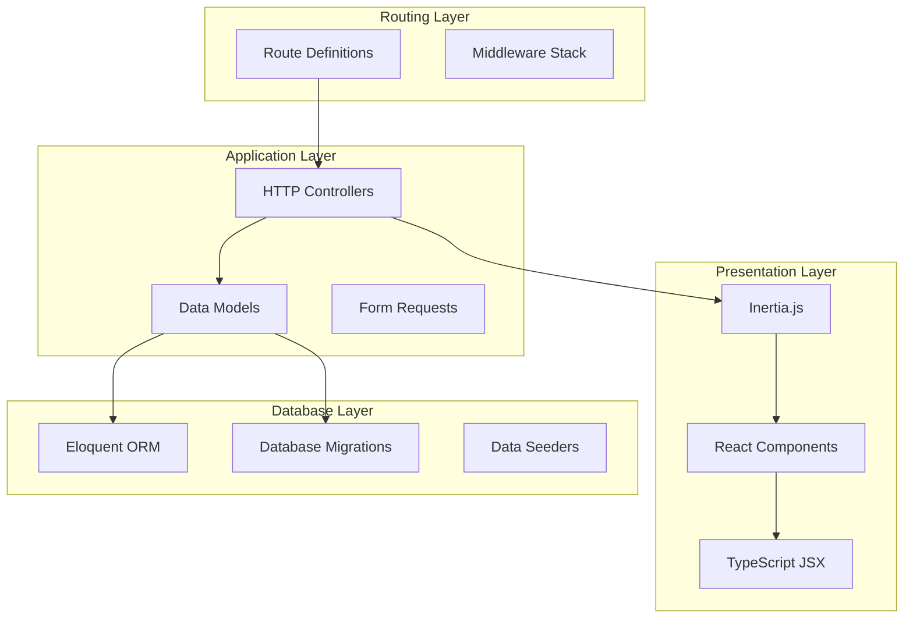

**Diagram sources**
- [web.php:1-129](file://routes/web.php#L1-L129)
- [EmployeeController.php:1-139](file://app/Http/Controllers/EmployeeController.php#L1-L139)

The project is organized into several key areas:

- **Controllers**: Handle HTTP requests and coordinate between models and views
- **Models**: Define database relationships and business logic
- **Routes**: Define URL patterns and controller mappings
- **Resources**: Frontend components and TypeScript definitions
- **Database**: Migrations and seeders for data structure initialization

**Section sources**
- [web.php:1-129](file://routes/web.php#L1-L129)

## Core Components

The system consists of seven primary controllers that handle different aspects of compensation management, with enhanced CRUD functionality and comprehensive deduction management:

### Employee Management Controller
Manages employee records, including CRUD operations, photo uploads, and basic employee information maintenance with enhanced deduction integration.

### Payroll Processing Controller  
Handles comprehensive payroll calculations, including gross pay computation, deduction processing, and net pay determination with sophisticated filtering capabilities.

### Salary Management Controller
Controls salary records, effective dates, amount changes, and compensation history tracking with full CRUD operations.

### PERA Management Controller
Manages profit-sharing contributions with effective date tracking, historical records, and full CRUD functionality.

### RATA Management Controller
Handles retirement allowance calculations with eligibility filtering, historical tracking, and full CRUD operations.

### Employee Deduction Controller
Processes various deduction types applied to employee paychecks during specific pay periods with comprehensive CRUD operations, sophisticated filtering, and pagination support.

### Manage Employee Controller
Provides comprehensive employee management interface with deduction creation and update functionality through period-based forms, enhanced with pagination and filtering capabilities. **Updated** Now includes new data aggregation methods for allDeductions and allClaims.

Each controller implements standardized CRUD operations with proper validation, authorization, and response handling through the Inertia.js framework, with enhanced deduction management capabilities including sophisticated pagination and filtering systems.

**Section sources**
- [EmployeeController.php:12-139](file://app/Http/Controllers/EmployeeController.php#L12-L139)
- [PayrollController.php:11-125](file://app/Http/Controllers/PayrollController.php#L11-L125)
- [SalaryController.php:11-74](file://app/Http/Controllers/SalaryController.php#L11-L74)
- [PeraController.php:11-74](file://app/Http/Controllers/PeraController.php#L11-L74)
- [RataController.php:11-75](file://app/Http/Controllers/RataController.php#L11-L75)
- [EmployeeDeductionController.php:12-119](file://app/Http/Controllers/EmployeeDeductionController.php#L12-L119)
- [ManageEmployeeController.php:14-212](file://app/Http/Controllers/ManageEmployeeController.php#L14-L212)

## Architecture Overview

The system employs a layered architecture with clear separation between presentation, business logic, and data access layers, enhanced with comprehensive deduction management and sophisticated pagination:

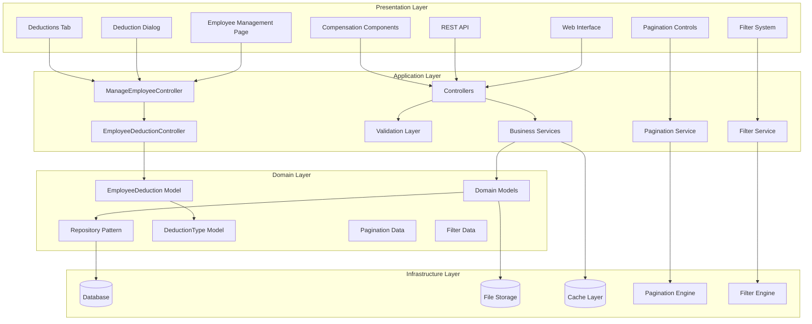

**Diagram sources**
- [EmployeeController.php:1-139](file://app/Http/Controllers/EmployeeController.php#L1-L139)
- [PayrollController.php:1-125](file://app/Http/Controllers/PayrollController.php#L1-L125)
- [ManageEmployeeController.php:1-212](file://app/Http/Controllers/ManageEmployeeController.php#L1-L212)
- [EmployeeDeductionController.php:1-119](file://app/Http/Controllers/EmployeeDeductionController.php#L1-L119)

The architecture emphasizes:
- **Separation of Concerns**: Clear boundaries between presentation, business logic, and data access
- **Dependency Injection**: Controllers receive dependencies through constructor injection
- **Event-Driven Design**: Models utilize Eloquent events for automatic auditing
- **Caching Strategy**: Efficient data retrieval through eager loading and caching
- **Security**: Comprehensive validation and authorization middleware
- **Enhanced Deduction Management**: Dedicated components for comprehensive deduction handling with pagination and filtering
- **Sophisticated Pagination**: Built-in pagination engine for efficient data handling
- **Advanced Filtering**: Sophisticated filter system for deduction records

## Detailed Component Analysis

### Employee Management System

The Employee Management component serves as the foundation for all compensation activities, providing comprehensive employee lifecycle management with enhanced deduction integration and sophisticated pagination.

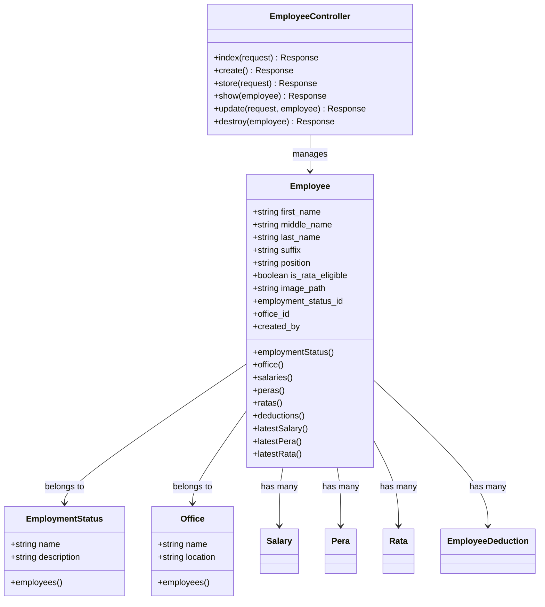

**Diagram sources**
- [Employee.php:10-104](file://app/Models/Employee.php#L10-L104)
- [EmployeeController.php:12-139](file://app/Http/Controllers/EmployeeController.php#L12-L139)

Key features include:
- **Photo Management**: Secure file upload and storage with validation
- **Search Functionality**: Multi-field search across employee names and identifiers
- **Relationship Management**: Automatic population of related employment status and office data
- **Soft Deletion**: Non-destructive removal with restore capability
- **Enhanced Deduction Integration**: Comprehensive deduction tracking with period-based grouping and pagination
- **Sophisticated Pagination**: Efficient handling of large employee datasets with pagination controls

**Section sources**
- [EmployeeController.php:14-139](file://app/Http/Controllers/EmployeeController.php#L14-L139)
- [Employee.php:31-104](file://app/Models/Employee.php#L31-L104)

### Payroll Processing Engine

The Payroll Processing component calculates employee compensation for specific pay periods, aggregating salary, PERA, and RATA components while applying comprehensive deductions with sophisticated filtering capabilities.

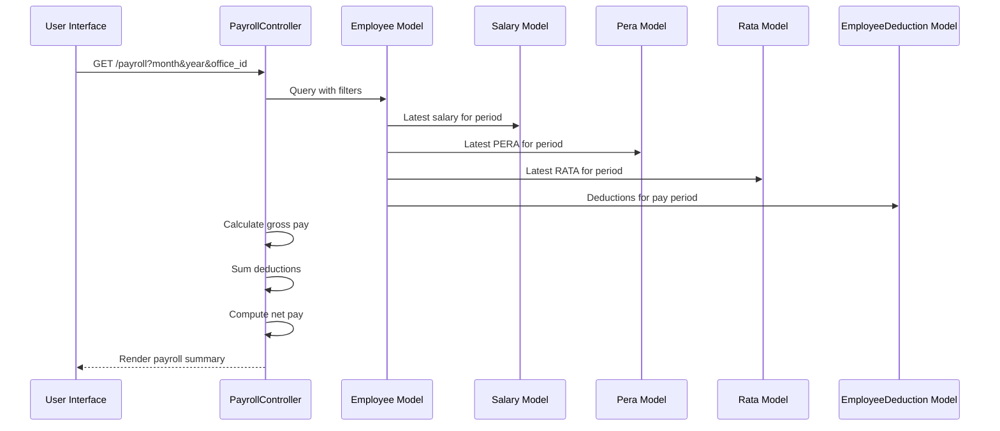

**Diagram sources**
- [PayrollController.php:13-125](file://app/Http/Controllers/PayrollController.php#L13-L125)

The payroll calculation process involves:
- **Gross Pay Calculation**: Sum of current salary, PERA, and RATA amounts
- **Deduction Aggregation**: Total of all applicable deductions for the pay period
- **Net Pay Determination**: Gross pay minus total deductions
- **Historical Tracking**: Complete audit trail of all compensation changes
- **Enhanced Deduction Processing**: Comprehensive deduction management with period-specific application and filtering
- **Sophisticated Filtering**: Advanced filtering capabilities for payroll data

**Section sources**
- [PayrollController.php:13-125](file://app/Http/Controllers/PayrollController.php#L13-L125)

### Compensation Management System

The compensation management system has been significantly enhanced with comprehensive CRUD functionality for all compensation types and dedicated deduction management capabilities with sophisticated pagination and filtering.

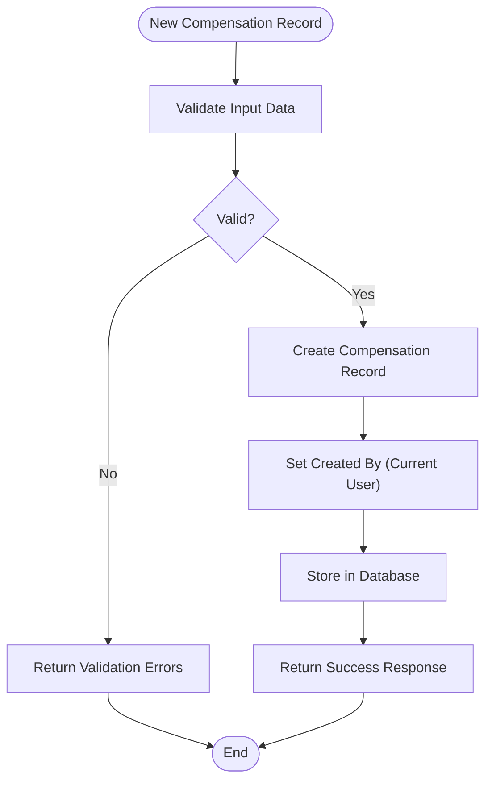

**Diagram sources**
- [SalaryController.php:49-74](file://app/Http/Controllers/SalaryController.php#L49-L74)
- [PeraController.php:49-74](file://app/Http/Controllers/PeraController.php#L49-L74)
- [RataController.php:50-75](file://app/Http/Controllers/RataController.php#L50-L75)

The system ensures:
- **Audit Trail**: Every change is tracked with who made it and when
- **Effective Dating**: Proper chronological ordering of compensation changes
- **Data Integrity**: Validation prevents invalid or conflicting records
- **Full CRUD Operations**: Complete create, read, update, and delete functionality for all compensation types
- **Enhanced Deduction Management**: Comprehensive deduction tracking with period-based grouping, editing capabilities, and pagination
- **Sophisticated Pagination**: Efficient handling of large datasets with pagination controls
- **Advanced Filtering**: Sophisticated filtering mechanisms for deduction records

**Section sources**
- [SalaryController.php:36-74](file://app/Http/Controllers/SalaryController.php#L36-L74)
- [PeraController.php:36-74](file://app/Http/Controllers/PeraController.php#L36-L74)
- [RataController.php:37-75](file://app/Http/Controllers/RataController.php#L37-L75)

### Enhanced Manage Page Architecture

**Updated** The main Manage page has been enhanced with a new Deductions tab and integrated CompensationDeductions component for streamlined user experience.

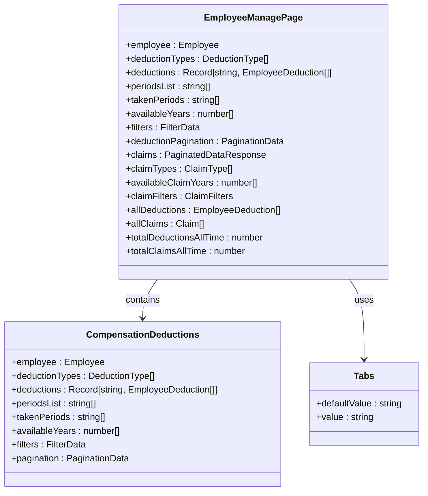

**Diagram sources**
- [Manage.tsx:58-205](file://resources/js/pages/Employees/Manage/Manage.tsx#L58-L205)
- [Compensation.tsx:11-38](file://resources/js/pages/Employees/Manage/Compensation.tsx#L11-L38)

The enhanced manage page now features:
- **Integrated Deductions Tab**: New dedicated tab for comprehensive deduction management
- **Streamlined Compensation Section**: Removed complex deduction management interface from main compensation view
- **Direct Component Integration**: CompensationDeductions component integrated directly into main Manage page
- **Enhanced Data Aggregation**: New backend methods for allDeductions and allClaims data
- **Improved User Experience**: Simplified navigation between compensation and deduction management

**Section sources**
- [Manage.tsx:174-185](file://resources/js/pages/Employees/Manage/Manage.tsx#L174-L185)
- [Compensation.tsx:11-38](file://resources/js/pages/Employees/Manage/Compensation.tsx#L11-L38)

## Enhanced Deduction Management System

The deduction management system has been completely redesigned with a comprehensive front-end component, enhanced backend processing capabilities, sophisticated pagination, and advanced filtering mechanisms.

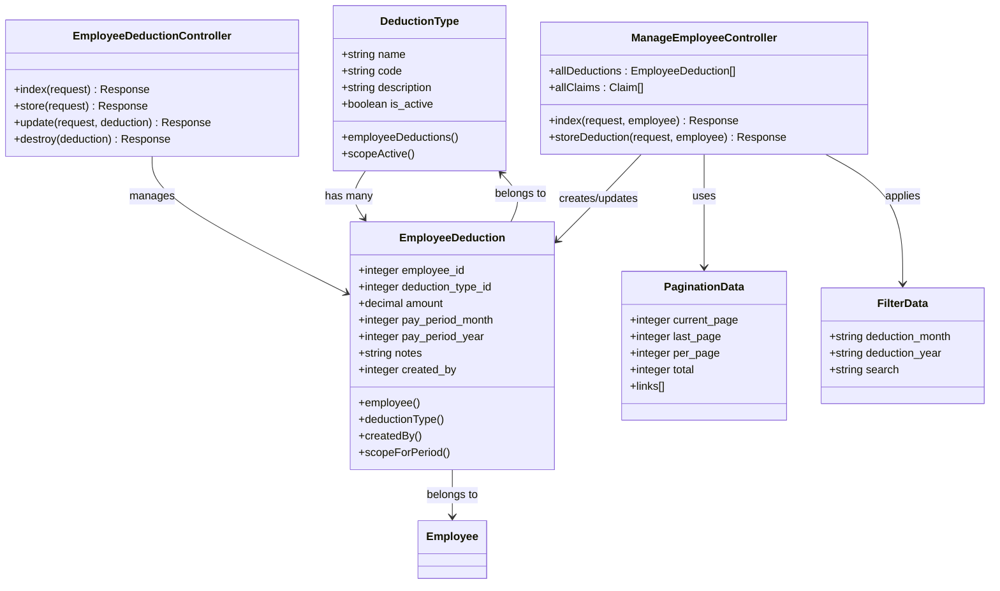

**Diagram sources**
- [EmployeeDeduction.php:8-59](file://app/Models/EmployeeDeduction.php#L8-L59)
- [DeductionType.php:7-33](file://app/Models/DeductionType.php#L7-L33)
- [EmployeeDeductionController.php:12-119](file://app/Http/Controllers/EmployeeDeductionController.php#L12-L119)
- [ManageEmployeeController.php:52-212](file://app/Http/Controllers/ManageEmployeeController.php#L52-L212)
- [pagination.d.ts:7-18](file://resources/js/types/pagination.d.ts#L7-L18)
- [filter.d.ts:3-11](file://resources/js/types/filter.d.ts#L3-L11)

The comprehensive deduction management system includes:
- **Period-Based Deduction Groups**: Deductions grouped by pay period (month-year) for better organization with pagination support
- **Deduction Dialog Interface**: Interactive dialog for adding and editing deductions with real-time validation and conflict detection
- **Duplicate Prevention**: Automatic detection and prevention of duplicate deductions for the same employee and period
- **Flexible Amount Entry**: Support for nullable deduction amounts with conditional processing
- **Enhanced UI Components**: Professional interfaces for deduction management with currency formatting, period selection, and pagination controls
- **Sophisticated Filtering**: Advanced month/year filtering capabilities with clear filter options
- **Pagination Controls**: Comprehensive pagination system with page navigation and record count display
- **Responsive Design**: Mobile-optimized interfaces with touch-friendly controls
- **New Backend Aggregation**: Enhanced data aggregation methods for allDeductions and allClaims

**Section sources**
- [EmployeeDeductionController.php:14-119](file://app/Http/Controllers/EmployeeDeductionController.php#L14-L119)
- [EmployeeDeduction.php:26-59](file://app/Models/EmployeeDeduction.php#L26-L59)
- [DeductionType.php:20-33](file://app/Models/DeductionType.php#L20-L33)
- [deductions.tsx:25-218](file://resources/js/pages/Employees/Manage/compensation/deductions.tsx#L25-L218)
- [salaryDialog.tsx:42-197](file://resources/js/pages/Employees/Manage/compensation/salaryDialog.tsx#L42-L197)
- [Manage.tsx:21-157](file://resources/js/pages/Employees/Manage/Manage.tsx#L21-L157)
- [ManageEmployeeController.php:128-142](file://app/Http/Controllers/ManageEmployeeController.php#L128-L142)

### Enhanced Pagination System

The system implements a sophisticated pagination system for deduction management with comprehensive controls and efficient data handling:

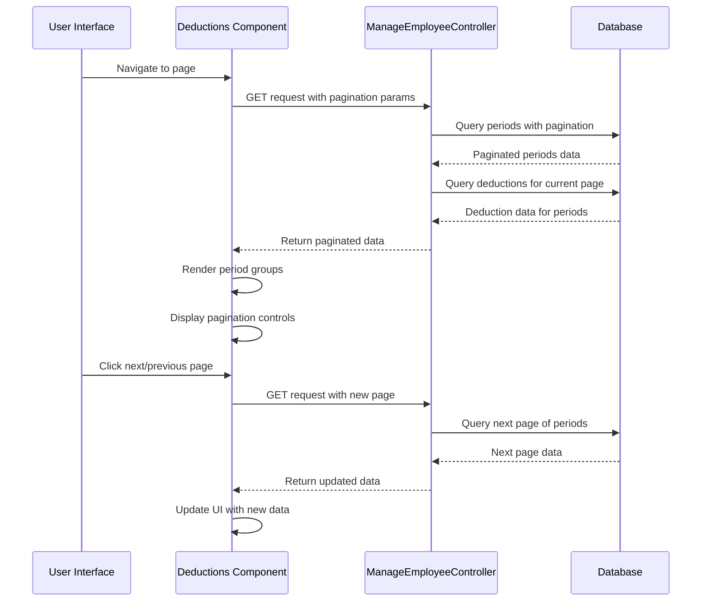

**Diagram sources**
- [ManageEmployeeController.php:54-114](file://app/Http/Controllers/ManageEmployeeController.php#L54-L114)
- [deductions.tsx:58-76](file://resources/js/pages/Employees/Manage/compensation/deductions.tsx#L58-L76)

The pagination system features:
- **Efficient Querying**: Separate queries for period listing and deduction data retrieval
- **Smart Grouping**: Deductions grouped by pay period for optimal display
- **Conflict Detection**: Taken periods identified for duplicate prevention
- **Year Filtering**: Available years dynamically populated for filtering
- **Page Navigation**: Intuitive previous/next controls with disabled states
- **Record Counting**: Total period count displayed for user awareness

**Section sources**
- [ManageEmployeeController.php:38-89](file://app/Http/Controllers/ManageEmployeeController.php#L38-L89)
- [deductions.tsx:102-104](file://resources/js/pages/Employees/Manage/compensation/deductions.tsx#L102-L104)

### Advanced Filtering Mechanisms

The system provides sophisticated filtering capabilities for deduction records with month/year selection and clear filter options:

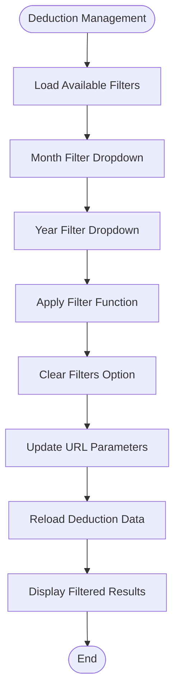

**Diagram sources**
- [deductions.tsx:66-76](file://resources/js/pages/Employees/Manage/compensation/deductions.tsx#L66-L76)
- [ManageEmployeeController.php:18-52](file://app/Http/Controllers/ManageEmployeeController.php#L18-L52)

The filtering system includes:
- **Month Selection**: Dropdown with all 12 months plus "All Months" option
- **Year Selection**: Dynamic dropdown with available years from deduction data
- **Filter Persistence**: URL parameters maintained across navigation
- **Clear Filters**: One-click filter clearing functionality
- **Real-time Updates**: Immediate data reloading when filters change
- **Responsive Design**: Mobile-optimized filter controls

**Section sources**
- [deductions.tsx:109-149](file://resources/js/pages/Employees/Manage/compensation/deductions.tsx#L109-L149)
- [ManageEmployeeController.php:44-52](file://app/Http/Controllers/ManageEmployeeController.php#L44-L52)

### New Backend Data Aggregation Methods

**Updated** The backend controller now includes new data aggregation methods for comprehensive reporting and overview functionality.

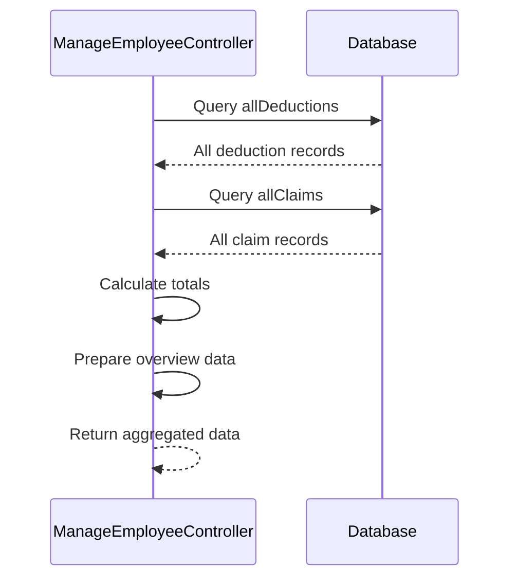

**Diagram sources**
- [ManageEmployeeController.php:128-142](file://app/Http/Controllers/ManageEmployeeController.php#L128-L142)

The new aggregation methods provide:
- **allDeductions**: Unpaginated collection of all employee deductions with deduction type relationships
- **allClaims**: Unpaginated collection of all employee claims with claim type relationships
- **Total Calculations**: Automatic calculation of total deductions and claims amounts
- **Overview Integration**: Seamless integration with overview and reports sections
- **Performance Optimization**: Efficient data retrieval for reporting without pagination overhead

**Section sources**
- [ManageEmployeeController.php:128-142](file://app/Http/Controllers/ManageEmployeeController.php#L128-L142)

## Compensation Management Workflows

### Employee Onboarding Workflow

The employee onboarding process integrates multiple systems to establish a complete compensation profile with comprehensive deduction management and sophisticated pagination:

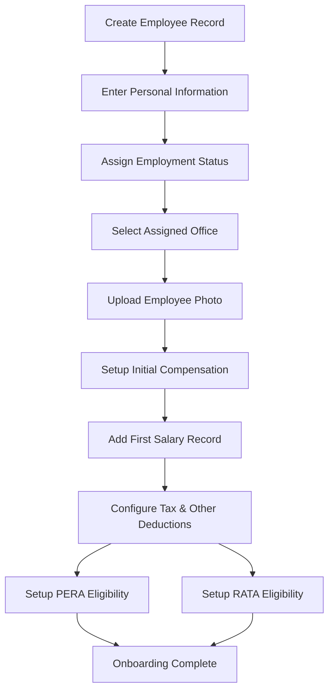

### Pay Period Processing Workflow

The monthly payroll processing follows a systematic approach to ensure accurate compensation calculation with comprehensive deduction management and advanced filtering:

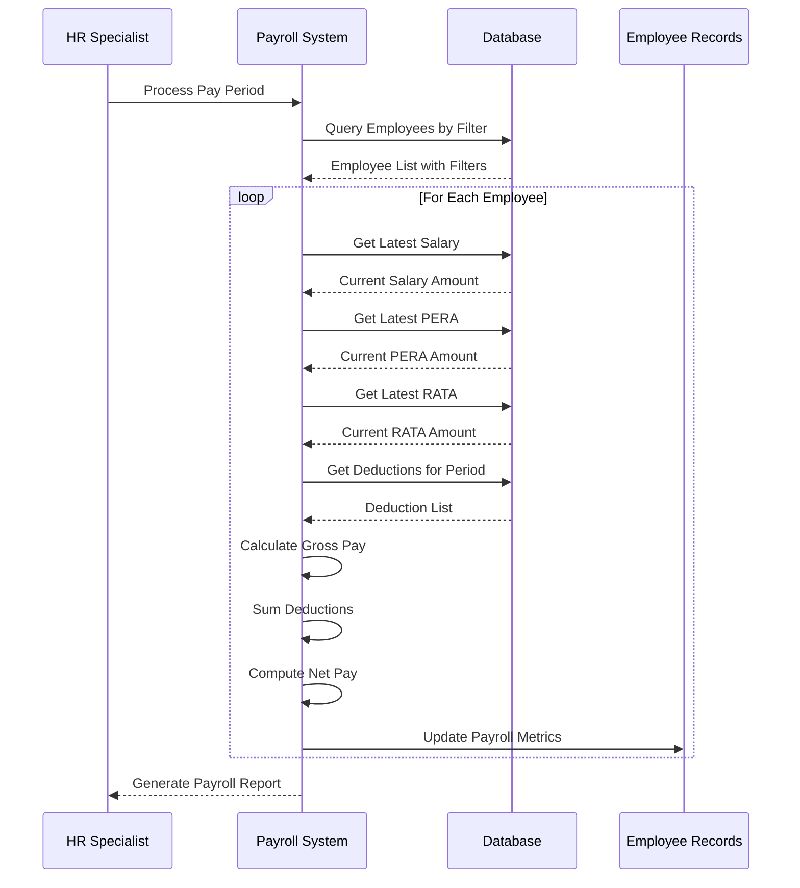

**Diagram sources**
- [PayrollController.php:13-81](file://app/Http/Controllers/PayrollController.php#L13-L81)

### Comprehensive Compensation Change Management

The system maintains comprehensive audit trails for all compensation modifications with enhanced deduction management and sophisticated pagination:

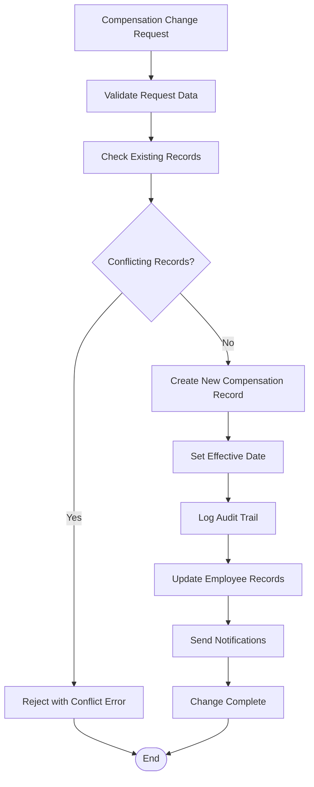

### Enhanced Deduction Management Workflow

The comprehensive deduction management system provides streamlined workflows for deduction creation, editing, and period-based organization with sophisticated pagination and filtering:


**Diagram sources**
- [ManageEmployeeController.php:178-210](file://app/Http/Controllers/ManageEmployeeController.php#L178-L210)
- [salaryDialog.tsx:80-98](file://resources/js/pages/Employees/Manage/compensation/salaryDialog.tsx#L80-L98)

### Sophisticated Pagination and Filtering Workflow

The enhanced deduction management system provides comprehensive pagination and filtering capabilities:

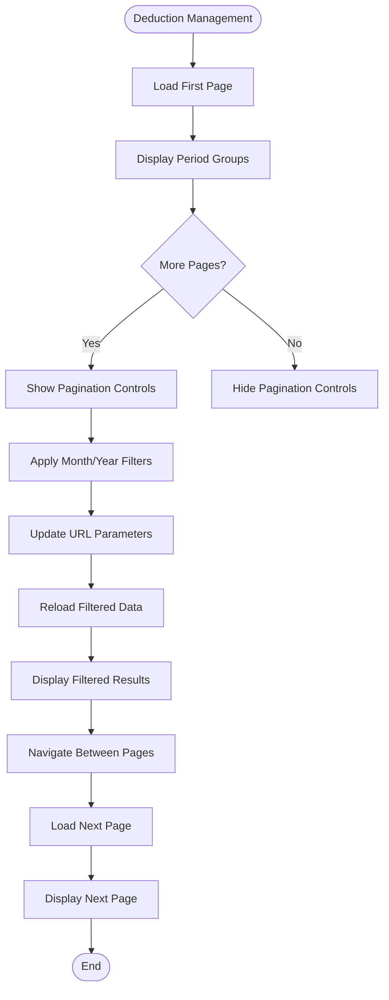

**Diagram sources**
- [deductions.tsx:58-76](file://resources/js/pages/Employees/Manage/compensation/deductions.tsx#L58-L76)
- [ManageEmployeeController.php:54-114](file://app/Http/Controllers/ManageEmployeeController.php#L54-L114)

### Integrated Manage Page Workflow

**Updated** The new integrated manage page workflow streamlines deduction management through dedicated tabs and consolidated interfaces.

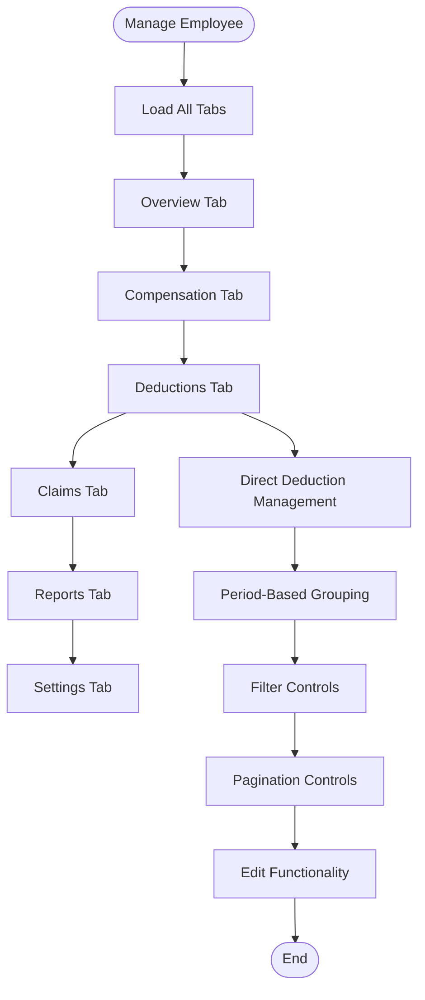

**Diagram sources**
- [Manage.tsx:138-201](file://resources/js/pages/Employees/Manage/Manage.tsx#L138-L201)

The integrated workflow features:
- **Deductions Tab**: Dedicated tab for comprehensive deduction management
- **Streamlined Compensation**: Simplified compensation section without complex deduction interface
- **Direct Component Integration**: CompensationDeductions component integrated directly into main page
- **Enhanced Navigation**: Improved tab-based navigation for better user experience
- **Consolidated Data**: Unified data access for all employee information

**Section sources**
- [Manage.tsx:171-185](file://resources/js/pages/Employees/Manage/Manage.tsx#L171-L185)

## Data Models and Relationships

The system utilizes a comprehensive entity relationship model that supports complex compensation scenarios with enhanced deduction management and sophisticated pagination:

```mermaid
erDiagram
EMPLOYEES {
integer id PK
string first_name
string middle_name
string last_name
string suffix
string position
boolean is_rata_eligible
string image_path
integer employment_status_id FK
integer office_id FK
integer created_by FK
timestamp created_at
timestamp updated_at
timestamp deleted_at
}
EMPLOYMENT_STATUSES {
integer id PK
string name
string description
timestamp created_at
timestamp updated_at
}
OFFICES {
integer id PK
string name
string location
timestamp created_at
timestamp updated_at
}
SALARIES {
integer id PK
integer employee_id FK
decimal amount
date effective_date
date end_date
integer created_by FK
timestamp created_at
timestamp updated_at
timestamp deleted_at
}
PERAS {
integer id PK
integer employee_id FK
decimal amount
date effective_date
integer created_by FK
timestamp created_at
timestamp updated_at
timestamp deleted_at
}
RATAS {
integer id PK
integer employee_id FK
decimal amount
date effective_date
integer created_by FK
timestamp created_at
timestamp updated_at
timestamp deleted_at
}
DEDUCTION_TYPES {
integer id PK
string name
string code
string description
boolean is_active
timestamp created_at
timestamp updated_at
}
EMPLOYEE_DEDUCTIONS {
integer id PK
integer employee_id FK
integer deduction_type_id FK
decimal amount
integer pay_period_month
integer pay_period_year
string notes
integer created_by FK
timestamp created_at
timestamp updated_at
}
CLAIMS {
integer id PK
integer employee_id FK
integer claim_type_id FK
decimal amount
date claim_date
string notes
integer created_by FK
timestamp created_at
timestamp updated_at
}
CLAIM_TYPES {
integer id PK
string name
string code
string description
boolean is_active
timestamp created_at
timestamp updated_at
}
USERS {
integer id PK
string name
string email
timestamp email_verified_at
string password
remember_token
timestamp created_at
timestamp updated_at
}
EMPLOYEES ||--|| EMPLOYMENT_STATUSES : "belongs to"
EMPLOYEES ||--|| OFFICES : "belongs to"
EMPLOYEES ||--o{ SALARIES : "has many"
EMPLOYEES ||--o{ PERAS : "has many"
EMPLOYEES ||--o{ RATAS : "has many"
EMPLOYEES ||--o{ EMPLOYEE_DEDUCTIONS : "has many"
EMPLOYEES ||--o{ CLAIMS : "has many"
DEDUCTION_TYPES ||--o{ EMPLOYEE_DEDUCTIONS : "has many"
CLAIM_TYPES ||--o{ CLAIMS : "has many"
EMPLOYEES ||--o{ EMPLOYEE_DEDUCTIONS : "has many"
EMPLOYEES ||--o{ CLAIMS : "has many"
USERS ||--o{ EMPLOYEES : "created"
USERS ||--o{ SALARIES : "created"
USERS ||--o{ PERAS : "created"
USERS ||--o{ RATAS : "created"
USERS ||--o{ EMPLOYEE_DEDUCTIONS : "created"
USERS ||--o{ CLAIMS : "created"
```

**Diagram sources**
- [Employee.php:14-104](file://app/Models/Employee.php#L14-L104)
- [Salary.php:12-36](file://app/Models/Salary.php#L12-L36)
- [Pera.php:10-41](file://app/Models/Pera.php#L10-L41)
- [Rata.php:10-41](file://app/Models/Rata.php#L10-L41)
- [EmployeeDeduction.php:10-59](file://app/Models/EmployeeDeduction.php#L10-L59)
- [DeductionType.php:9-33](file://app/Models/DeductionType.php#L9-L33)
- [Claim.php:10-41](file://app/Models/Claim.php#L10-L41)
- [ClaimType.php:9-33](file://app/Models/ClaimType.php#L9-L33)

### Data Validation and Constraints

The system implements comprehensive data validation at multiple levels with enhanced deduction management and sophisticated pagination:

- **Model Level Validation**: Type casting and attribute casting for financial data
- **Database Constraints**: Foreign key relationships and check constraints
- **Application Level Validation**: Form validation with custom rules and conflict detection
- **Business Rule Validation**: Eligibility checks, conflict resolution, and duplicate prevention
- **Deduction Validation**: Period-based validation and amount processing rules
- **Pagination Validation**: Page number validation and boundary checking
- **Filter Validation**: Month/year range validation and filter parameter sanitization
- **New Aggregation Validation**: Data integrity checks for allDeductions and allClaims methods

**Section sources**
- [Employee.php:27-29](file://app/Models/Employee.php#L27-L29)
- [Salary.php:20-24](file://app/Models/Salary.php#L20-L24)
- [EmployeeDeduction.php:20-24](file://app/Models/EmployeeDeduction.php#L20-L24)

## User Interface Components

The frontend components provide intuitive interfaces for managing employee compensation with comprehensive deduction management, sophisticated pagination, and advanced filtering capabilities:

### Enhanced Employee Management Interface
- **Employee Listing**: Searchable grid with sorting and filtering capabilities and pagination
- **Employee Creation**: Multi-step form with validation feedback
- **Employee Editing**: Comprehensive profile management with photo upload
- **Employee Details**: Historical compensation view with timeline visualization
- **Enhanced Compensation Tabs**: Dedicated tabs for salary, PERA, RATA, and deductions management with pagination controls
- **Sophisticated Deduction Interface**: Professional deduction management with period-based grouping and pagination
- **Integrated Deductions Tab**: New dedicated tab for comprehensive deduction management within main Manage page
- **Streamlined Compensation Interface**: Simplified compensation section without complex deduction management

### Comprehensive Payroll Interface
- **Payroll Dashboard**: Summary view with gross pay, deductions, and net pay metrics and filtering
- **Payroll Detail View**: Individual employee payroll breakdown with advanced filtering
- **Filter Controls**: Month/year selection and office filtering with clear options
- **Export Capabilities**: Payroll report generation and export with pagination support

### Enhanced Compensation Management Interfaces
- **Salary Management**: Historical salary tracking with effective date management and full CRUD operations
- **PERA Management**: Profit-sharing contribution tracking and history with full CRUD operations
- **RATA Management**: Retirement allowance calculation and history with full CRUD operations
- **Deduction Management**: Comprehensive deduction type configuration and assignment with period-based organization, pagination, and filtering
- **Deduction Dialog**: Interactive dialog for adding and editing deductions with real-time validation and conflict detection
- **Pagination Controls**: Professional pagination interface with page navigation and record counting
- **Integrated Deduction Management**: Direct integration of CompensationDeductions component into main Manage page

### Advanced Deduction Management Components
- **Deduction Groups**: Period-based grouping of deductions for better organization with pagination
- **Edit Functionality**: Full CRUD operations for existing deduction periods with conflict detection
- **Duplicate Prevention**: Automatic detection and prevention of duplicate entries with period conflict warnings
- **Real-time Validation**: Form validation with immediate feedback and error handling
- **Professional UI**: Currency formatting and professional styling with responsive design
- **Sophisticated Filtering**: Advanced month/year filtering with clear filter options
- **Pagination System**: Comprehensive pagination controls with page navigation and record count display
- **New Deductions Tab**: Dedicated tab for comprehensive deduction management within main interface

### Responsive Design Features
- **Mobile Optimization**: Touch-friendly interfaces for mobile devices with responsive filter controls
- **Accessibility**: Screen reader support and keyboard navigation with ARIA labels
- **Performance**: Lazy loading and efficient data fetching with pagination
- **Real-time Updates**: Live updates for new compensation records with pagination refresh
- **Enhanced User Experience**: Streamlined workflows for deduction management with sophisticated filtering and pagination
- **Integrated Navigation**: Seamless tab-based navigation for all management functions

## Performance Considerations

The system implements several performance optimization strategies with enhanced deduction management, sophisticated pagination, and advanced filtering:

### Database Optimization
- **Eager Loading**: Strategic use of with() to prevent N+1 query problems
- **Indexing Strategy**: Proper indexing on frequently queried columns including pay_period_month and pay_period_year
- **Pagination**: Efficient pagination for large datasets with optimized query patterns
- **Query Optimization**: Optimized queries with appropriate joins and filters for deduction data
- **Deduction Query Optimization**: Efficient querying of period-specific deductions with pagination support
- **Filter Optimization**: Optimized filtering queries for month/year combinations
- **New Aggregation Queries**: Efficient data aggregation for allDeductions and allClaims without pagination overhead

### Caching Strategy
- **Model Caching**: Frequently accessed lookup data cached in memory
- **Page Caching**: Payroll summaries cached for improved response times
- **Query Result Caching**: Expensive query results cached for configurable periods
- **Deduction Type Caching**: Active deduction types cached for quick access
- **Pagination Data Caching**: Paginated deduction data cached for improved navigation performance
- **Aggregated Data Caching**: Overview and report data cached for improved performance

### Frontend Performance
- **Component Lazy Loading**: Dynamic imports for route-based code splitting
- **Image Optimization**: Efficient image handling and lazy loading
- **State Management**: Efficient state updates with minimal re-renders
- **Bundle Optimization**: Tree shaking and dead code elimination
- **Deduction State Management**: Optimized state handling for period-based deduction groups
- **Pagination State Management**: Efficient pagination state handling with URL parameter synchronization
- **Filter State Management**: Optimized filter state management with real-time updates
- **Integrated Component Performance**: Optimized performance for integrated CompensationDeductions component

### Scalability Considerations
- **Horizontal Scaling**: Stateless controllers support load balancing
- **Database Scaling**: Optimized queries support database replication
- **Caching Layer**: Redis or similar caching for distributed environments
- **Background Processing**: Queue-based processing for heavy computations
- **Deduction Batch Processing**: Efficient batch processing for multiple deduction updates
- **Pagination Scalability**: Efficient pagination for large datasets with optimized query patterns
- **Aggregation Scalability**: Optimized data aggregation for large-scale reporting

## Troubleshooting Guide

### Common Issues and Solutions

**Employee Photo Upload Failures**
- Verify file size limits (2MB max) and supported formats (JPG, PNG, WEBP)
- Check storage permissions for the employees directory
- Ensure proper MIME type validation is configured

**Enhanced Payroll Calculation Errors**
- Verify that salary, PERA, and RATA records have proper effective dates
- Check for overlapping compensation records
- Ensure deduction types are properly configured and active
- Validate period-based deduction conflicts
- Check pagination parameter validation for deduction queries
- **New Issue**: Verify new allDeductions and allClaims aggregation methods are working correctly

**Performance Issues**
- Monitor database query performance and optimize slow queries
- Implement proper indexing on frequently filtered columns including pay_period_month and pay_period_year
- Consider database connection pooling for high-traffic scenarios
- Optimize deduction query performance for large datasets with pagination
- Monitor pagination query performance for period-based data
- **New Issue**: Monitor performance of new aggregation methods for allDeductions and allClaims

**Data Integrity Problems**
- Verify foreign key constraints are properly enforced
- Check for orphaned records in compensation history
- Ensure proper cleanup of soft-deleted records
- Validate deduction period uniqueness constraints
- Check pagination parameter validation and boundary conditions
- **New Issue**: Verify data integrity of new aggregation methods

**Deduction Management Issues**
- Verify deduction type configurations are active
- Check for duplicate period entries with conflict detection
- Ensure proper validation of deduction amounts
- Validate pay period month/year ranges
- Check pagination parameter handling for deduction queries
- Verify filter parameter validation for month/year filtering
- **New Issue**: Verify integration of CompensationDeductions component into main Manage page

**Pagination and Filtering Issues**
- Verify pagination parameter handling in URL routing
- Check pagination query parameter validation
- Ensure filter parameter validation for month/year selections
- Verify pagination data grouping and sorting
- Check pagination state synchronization with URL parameters
- **New Issue**: Verify pagination works correctly with new Deductions tab

**Integrated Manage Page Issues**
- **New Issue**: Verify Deductions tab loads correctly with all required data
- **New Issue**: Ensure CompensationDeductions component receives proper props
- **New Issue**: Verify tab switching works without data loss
- **New Issue**: Check that new aggregation methods are properly utilized

### Debugging Tools and Techniques

**Database Query Logging**
- Enable query logging during development to identify performance bottlenecks
- Monitor slow query execution times
- Analyze query plans for optimization opportunities
- Track deduction-related query performance with pagination
- Monitor filter query performance for month/year combinations
- **New Issue**: Monitor performance of new aggregation queries

**Application Monitoring**
- Implement structured logging for error tracking
- Monitor application performance metrics
- Set up alerts for unusual activity patterns
- Track deduction processing performance with pagination
- Monitor pagination query performance
- **New Issue**: Monitor performance of new aggregation methods

**Data Validation**
- Implement comprehensive input validation at multiple layers
- Use database constraints to prevent invalid data
- Regular data quality audits to identify inconsistencies
- Validate deduction type and period combinations
- Check pagination parameter validation and boundary conditions
- Verify filter parameter validation for month/year filtering
- **New Issue**: Validate new aggregation data integrity

**Section sources**
- [EmployeeController.php:69-83](file://app/Http/Controllers/EmployeeController.php#L69-L83)
- [PayrollController.php:48-67](file://app/Http/Controllers/PayrollController.php#L48-L67)
- [ManageEmployeeController.php:178-210](file://app/Http/Controllers/ManageEmployeeController.php#L178-L210)

## Conclusion

The Employee Compensation Management system provides a robust, scalable solution for managing employee compensation across multiple pay components with comprehensive deduction management capabilities, sophisticated pagination, and advanced filtering. The system's enhanced architecture supports future growth while maintaining performance and reliability.

Key strengths of the system include:

- **Comprehensive Coverage**: Handles all major compensation components (salary, PERA, RATA) with full CRUD operations
- **Advanced Deduction Management**: Complete deduction tracking with period-based organization, editing capabilities, pagination, and filtering
- **Sophisticated Pagination System**: Efficient handling of large datasets with intelligent query patterns and pagination controls
- **Advanced Filtering**: Sophisticated month/year filtering with clear filter options and real-time updates
- **Audit Trail**: Complete tracking of all compensation changes with enhanced deduction management
- **Flexible Payroll Processing**: Configurable deduction types and period-based calculations with advanced filtering
- **Enhanced User Interface**: Intuitive management interfaces with responsive design, professional styling, and comprehensive pagination controls
- **Performance Optimization**: Efficient data handling, caching strategies, optimized deduction processing, and pagination performance
- **Security**: Comprehensive validation and authorization controls with enhanced deduction security and pagination validation
- **Streamlined Workflows**: Professional interfaces for deduction management with real-time validation, conflict detection, and sophisticated pagination
- **Integrated Management**: Seamless integration of deduction management into main employee management interface
- **Enhanced Reporting**: New data aggregation methods for comprehensive reporting and overview functionality

The system is well-positioned for enterprise deployment with proper monitoring, backup procedures, and disaster recovery planning. Future enhancements could include advanced reporting capabilities, integration with external payroll systems, enhanced analytics features, expanded deduction type management capabilities, improved pagination performance optimizations, and further integration of management workflows.