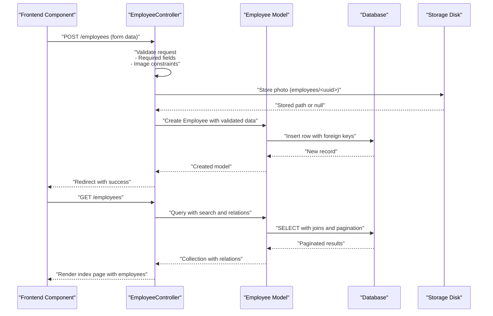
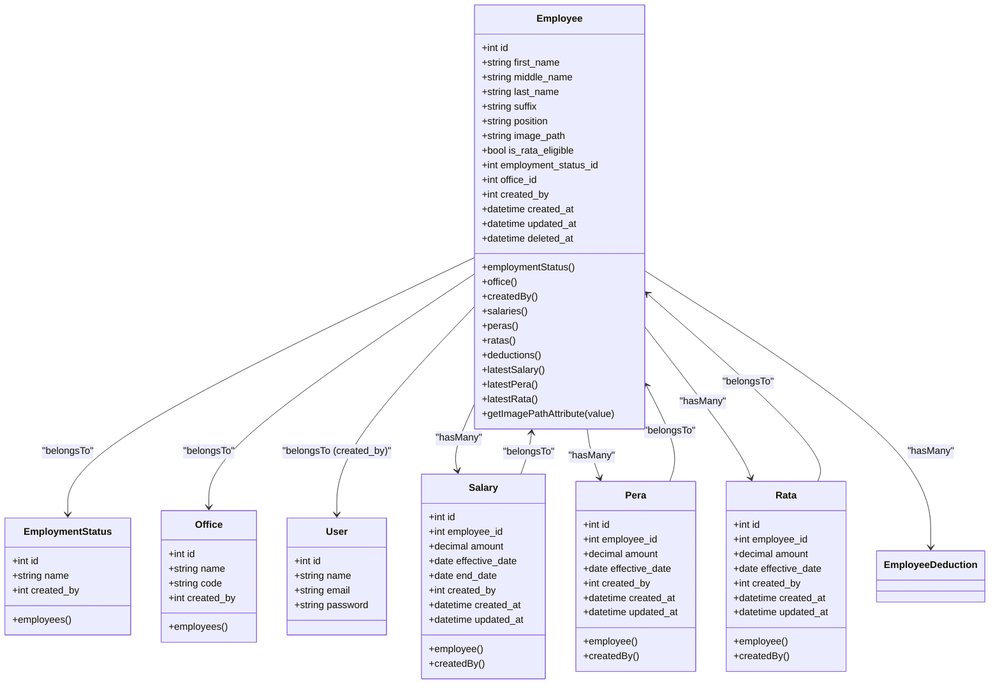
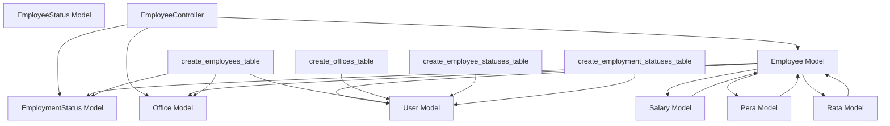

# Employee Data Models and Relationships

<cite>
**Referenced Files in This Document**
- [Employee.php](file://app/Models/Employee.php)
- [EmployeeStatus.php](file://app/Models/EmployeeStatus.php)
- [EmploymentStatus.php](file://app/Models/EmploymentStatus.php)
- [Office.php](file://app/Models/Office.php)
- [User.php](file://app/Models/User.php)
- [Salary.php](file://app/Models/Salary.php)
- [Pera.php](file://app/Models/Pera.php)
- [Rata.php](file://app/Models/Rata.php)
- [2026_03_19_022838_create_employees_table.php](file://database/migrations/2026_03_19_022838_create_employees_table.php)
- [2026_03_18_071422_create_offices_table.php](file://database/migrations/2026_03_18_071422_create_offices_table.php)
- [2026_03_19_014107_create_employee_statuses_table.php](file://database/migrations/2026_03_19_014107_create_employee_statuses_table.php)
- [2026_03_19_014108_create_employment_statuses_table.php](file://database/migrations/2026_03_19_014108_create_employment_statuses_table.php)
- [EmployeeController.php](file://app/Http/Controllers/EmployeeController.php)
- [employee.d.ts](file://resources/js/types/employee.d.ts)
- [index.tsx](file://resources/js/pages/settings/Employee/index.tsx)
- [create.tsx](file://resources/js/pages/settings/Employee/create.tsx)
- [show.tsx](file://resources/js/pages/settings/Employee/show.tsx)
</cite>

## Update Summary
**Changes Made**
- Updated Employee model documentation to reflect migration from `latest()` to `latestOfMany()` method for retrieving most recent salary, Pera, and Rata records
- Enhanced salary calculation logic documentation with improved performance and reliability characteristics
- Added detailed explanation of the modernized relationship methods and their benefits
- Updated frontend integration examples to demonstrate the new latest salary calculation approach

## Table of Contents
1. [Introduction](#introduction)
2. [Project Structure](#project-structure)
3. [Core Components](#core-components)
4. [Architecture Overview](#architecture-overview)
5. [Detailed Component Analysis](#detailed-component-analysis)
6. [Dependency Analysis](#dependency-analysis)
7. [Performance Considerations](#performance-considerations)
8. [Troubleshooting Guide](#troubleshooting-guide)
9. [Conclusion](#conclusion)

## Introduction
This document provides comprehensive data model documentation for employee-related entities in the application. It details the Employee model structure, including personal information fields, employment references, and file storage paths. It also documents relationships with EmploymentStatus, EmployeeStatus, and Office models, explains foreign key constraints, validation rules, and data type specifications. Additionally, it covers model attributes, accessors, mutators, relationship methods, validation patterns, nullable field handling, default value configurations, and practical examples of model usage in controllers and frontend components.

**Updated** The Employee model now utilizes modernized `latestOfMany()` relationship methods for retrieving the most recent salary, Pera, and Rata records, replacing the older `latest()` approach for improved performance and reliability.

## Project Structure
The employee data model ecosystem spans Eloquent models, database migrations, controller logic, and frontend components. The models define relationships and attributes, migrations define database schema and constraints, controllers enforce validation and manage file uploads, and frontend components render and interact with employee data.

```mermaid
graph TB
subgraph "Models"
Employee["Employee Model"]
EmploymentStatus["EmploymentStatus Model"]
EmployeeStatus["EmployeeStatus Model"]
Office["Office Model"]
User["User Model"]
Salary["Salary Model"]
Pera["Pera Model"]
Rata["Rata Model"]
EmployeeDeduction["EmployeeDeduction Model"]
end
subgraph "Migrations"
M_Employees["create_employees_table"]
M_Offices["create_offices_table"]
M_EmployeeStatuses["create_employee_statuses_table"]
M_EmploymentStatuses["create_employment_statuses_table"]
end
subgraph "Controllers"
EmployeeController["EmployeeController"]
end
subgraph "Frontend"
IndexPage["Employee Index Page"]
CreatePage["Employee Create Page"]
ShowPage["Employee Show Page"]
Types["TypeScript Types"]
end
Employee --> EmploymentStatus
Employee --> Office
Employee --> User
Employee -.-> Salary
Employee -.-> Pera
Employee -.-> Rata
Employee -.-> EmployeeDeduction
Salary --> Employee
Pera --> Employee
Rata --> Employee
M_Employees --> EmploymentStatus
M_Employees --> Office
M_Employees --> User
EmployeeController --> Employee
EmployeeController --> EmploymentStatus
EmployeeController --> Office
IndexPage --> Employee
CreatePage --> Employee
ShowPage --> Employee
Types --> Employee
```

**Diagram sources**
- [Employee.php:10-104](file://app/Models/Employee.php#L10-L104)
- [EmploymentStatus.php:9-32](file://app/Models/EmploymentStatus.php#L9-L32)
- [EmployeeStatus.php:9-37](file://app/Models/EmployeeStatus.php#L9-L37)
- [Office.php:9-33](file://app/Models/Office.php#L9-L33)
- [User.php:10-49](file://app/Models/User.php#L10-L49)
- [Salary.php:8-36](file://app/Models/Salary.php#L8-L36)
- [Pera.php:8-41](file://app/Models/Pera.php#L8-L41)
- [Rata.php:8-41](file://app/Models/Rata.php#L8-L41)
- [2026_03_19_022838_create_employees_table.php:14-27](file://database/migrations/2026_03_19_022838_create_employees_table.php#L14-L27)
- [2026_03_18_071422_create_offices_table.php:14-21](file://database/migrations/2026_03_18_071422_create_offices_table.php#L14-L21)
- [2026_03_19_014107_create_employee_statuses_table.php:14-20](file://database/migrations/2026_03_19_014107_create_employee_statuses_table.php#L14-L20)
- [2026_03_19_014108_create_employment_statuses_table.php:14-20](file://database/migrations/2026_03_19_014108_create_employment_statuses_table.php#L14-L20)
- [EmployeeController.php:12-34](file://app/Http/Controllers/EmployeeController.php#L12-L34)
- [index.tsx:41-231](file://resources/js/pages/settings/Employee/index.tsx#L41-L231)
- [create.tsx:33-283](file://resources/js/pages/settings/Employee/create.tsx#L33-L283)
- [show.tsx:25-142](file://resources/js/pages/settings/Employee/show.tsx#L25-L142)
- [employee.d.ts:8-43](file://resources/js/types/employee.d.ts#L8-L43)

**Section sources**
- [Employee.php:10-104](file://app/Models/Employee.php#L10-L104)
- [2026_03_19_022838_create_employees_table.php:14-27](file://database/migrations/2026_03_19_022838_create_employees_table.php#L14-L27)

## Core Components
This section documents the Employee model and its associated entities, focusing on structure, relationships, validation, and data handling.

- Employee Model
  - Purpose: Stores employee personal and employment information, manages soft deletes, and handles file storage paths.
  - Fillable attributes: first_name, middle_name, last_name, suffix, position, is_rata_eligible, employment_status_id, office_id, created_by, image_path.
  - Casts: is_rata_eligible is cast to boolean.
  - Accessor: image_path accessor returns a public URL via storage if a path exists; otherwise null.
  - Relationships:
    - belongsTo EmploymentStatus via employment_status_id.
    - belongsTo Office via office_id.
    - belongsTo User (created_by).
    - hasMany Salary, Pera, Rata, EmployeeDeduction.
    - latestSalary, latestPera, latestRata helpers return latest records ordered by effective_date using the modernized `latestOfMany()` method.
  - Boot logic: Automatically sets created_by to the currently authenticated user during creation.

**Updated** The latest salary, Pera, and Rata relationships now utilize `latestOfMany('effective_date')` instead of the deprecated `latest()` method, providing improved performance and reliability for retrieving the most recent records.

- EmploymentStatus Model
  - Purpose: Defines employment status categories.
  - Fillable attributes: name, created_by.
  - Relationship: hasMany Employee.
  - Boot logic: Sets created_by to the currently authenticated user during creation.

- EmployeeStatus Model
  - Purpose: Defines general employee status categories (e.g., Active, Inactive).
  - Fillable attributes: name, created_by.
  - Relationship: hasMany Employee.
  - Boot logic: Sets created_by to the currently authenticated user during creation.

- Office Model
  - Purpose: Represents organizational units/offices.
  - Fillable attributes: name, code, created_by.
  - Relationship: hasMany Employee.
  - Boot logic: Sets created_by to the currently authenticated user during creation.

- User Model
  - Purpose: Base authentication model used for created_by references.
  - Attributes: fillable name, email, password; hidden password and remember_token; casts for email_verified_at and password.

- Salary Model
  - Purpose: Stores employee salary information with effective date ranges.
  - Fillable attributes: employee_id, amount, effective_date, end_date, created_by.
  - Casts: amount as decimal with 2 precision, effective_date and end_date as dates.
  - Relationships: belongsTo Employee and User (created_by).

- Pera Model
  - Purpose: Stores employee PERA allowance information.
  - Fillable attributes: employee_id, amount, effective_date, created_by.
  - Casts: amount as decimal with 2 precision, effective_date as date.
  - Relationships: belongsTo Employee and User (created_by).

- Rata Model
  - Purpose: Stores employee RATA allowance information.
  - Fillable attributes: employee_id, amount, effective_date, created_by.
  - Casts: amount as decimal with 2 precision, effective_date as date.
  - Relationships: belongsTo Employee and User (created_by).

**Section sources**
- [Employee.php:14-29](file://app/Models/Employee.php#L14-L29)
- [Employee.php:31-103](file://app/Models/Employee.php#L31-L103)
- [EmployeeStatus.php:13-26](file://app/Models/EmployeeStatus.php#L13-L26)
- [EmploymentStatus.php:13-21](file://app/Models/EmploymentStatus.php#L13-L21)
- [Office.php:13-22](file://app/Models/Office.php#L13-L22)
- [User.php:20-47](file://app/Models/User.php#L20-L47)
- [Salary.php:12-24](file://app/Models/Salary.php#L12-L24)
- [Pera.php:10-20](file://app/Models/Pera.php#L10-L20)
- [Rata.php:10-20](file://app/Models/Rata.php#L10-L20)

## Architecture Overview
The Employee entity integrates with related models and controllers to support CRUD operations, file uploads, and frontend rendering. The following diagram illustrates the end-to-end flow from controller actions to model relationships and frontend consumption.

**Diagram sources**
- [EmployeeController.php:14-34](file://app/Http/Controllers/EmployeeController.php#L14-L34)
- [Employee.php:90-97](file://app/Models/Employee.php#L90-L97)

## Detailed Component Analysis

### Employee Model Analysis
The Employee model encapsulates employee data, relationships, and behavior. It leverages Eloquent features for data casting, accessors, and automatic created_by population.

**Updated** The latest salary, Pera, and Rata relationships now use the modernized `latestOfMany()` method, which provides superior performance and reliability compared to the deprecated `latest()` approach.

**Diagram sources**
- [Employee.php:10-104](file://app/Models/Employee.php#L10-L104)
- [EmploymentStatus.php:9-32](file://app/Models/EmploymentStatus.php#L9-L32)
- [Office.php:9-33](file://app/Models/Office.php#L9-L33)
- [User.php:10-49](file://app/Models/User.php#L10-L49)
- [Salary.php:8-36](file://app/Models/Salary.php#L8-L36)
- [Pera.php:8-41](file://app/Models/Pera.php#L8-L41)
- [Rata.php:8-41](file://app/Models/Rata.php#L8-L41)

**Section sources**
- [Employee.php:14-29](file://app/Models/Employee.php#L14-L29)
- [Employee.php:31-103](file://app/Models/Employee.php#L31-L103)

### Database Schema and Constraints
The migrations define the database structure and enforce referential integrity and cascading behavior.

- employees table
  - Columns: id (primary), first_name (string), middle_name (nullable string), last_name (string), suffix (nullable string), position (nullable string), image_path (nullable string), employment_status_id (foreign key), office_id (foreign key), created_by (foreign key), soft deletes, timestamps.
  - Foreign keys:
    - employment_status_id references employment_statuses(id) with cascade on delete.
    - office_id references offices(id) with cascade on delete.
    - created_by references users(id) with cascade on delete.

- offices table
  - Columns: id (primary), name (string), code (string), soft deletes, created_by (foreign key), timestamps.
  - Foreign key: created_by references users(id) with cascade on delete.

- employee_statuses table
  - Columns: id (primary), name (string), created_by (foreign key), soft deletes, timestamps.
  - Foreign key: created_by references users(id).

- employment_statuses table
  - Columns: id (primary), name (string), created_by (foreign key), soft deletes, timestamps.
  - Foreign key: created_by references users(id) with cascade on delete.

- salaries table
  - Columns: id (primary), employee_id (foreign key), amount (decimal), effective_date (date), end_date (nullable date), created_by (foreign key), timestamps.
  - Foreign key: employee_id references employees(id) with cascade on delete.

- peras table
  - Columns: id (primary), employee_id (foreign key), amount (decimal), effective_date (date), created_by (foreign key), timestamps.
  - Foreign key: employee_id references employees(id) with cascade on delete.

- ratas table
  - Columns: id (primary), employee_id (foreign key), amount (decimal), effective_date (date), created_by (foreign key), timestamps.
  - Foreign key: employee_id references employees(id) with cascade on delete.

**Section sources**
- [2026_03_19_022838_create_employees_table.php:14-27](file://database/migrations/2026_03_19_022838_create_employees_table.php#L14-L27)
- [2026_03_18_071422_create_offices_table.php:14-21](file://database/migrations/2026_03_18_071422_create_offices_table.php#L14-L21)
- [2026_03_19_014107_create_employee_statuses_table.php:14-20](file://database/migrations/2026_03_19_014107_create_employee_statuses_table.php#L14-L20)
- [2026_03_19_014108_create_employment_statuses_table.php:14-20](file://database/migrations/2026_03_19_014108_create_employment_statuses_table.php#L14-L20)
- [Salary.php:12-18](file://app/Models/Salary.php#L12-L18)
- [Pera.php:10-15](file://app/Models/Pera.php#L10-L15)
- [Rata.php:10-15](file://app/Models/Rata.php#L10-L15)

### Validation Rules and Nullable Field Handling
The EmployeeController enforces strict validation rules for employee creation and updates, ensuring data integrity and consistent behavior.

- Validation rules for index action:
  - search: nullable, string, max length 255.

- Default value configuration:
  - is_rata_eligible defaults to false when not provided in the request.

- Nullable field handling:
  - middle_name, suffix, position, image_path are nullable in both the model and migration.

**Section sources**
- [EmployeeController.php:16-24](file://app/Http/Controllers/EmployeeController.php#L16-L24)
- [2026_03_19_022838_create_employees_table.php:17-21](file://database/migrations/2026_03_19_022838_create_employees_table.php#L17-L21)

### File Storage and Accessor Behavior
The Employee model exposes an image_path accessor that resolves stored images to public URLs, enabling seamless frontend rendering.

- Storage path:
  - Photos are stored under the public disk in the employees directory with unique filenames.
- Accessor:
  - image_path attribute returns Storage::url($value) when a path exists; otherwise null.

**Section sources**
- [Employee.php:99-102](file://app/Models/Employee.php#L99-L102)

### Frontend Integration Examples
The frontend components consume the Employee model data and present it in user-friendly interfaces.

**Updated** The frontend now demonstrates the modernized latest salary calculation approach through the Employee Show dialog and management interfaces.

- Employee Index Page
  - Displays paginated employee lists with search, RATA eligibility badges, and action buttons.
  - Renders avatars using the resolved image_path from the model accessor.
  - Integrates with dialogs for viewing and deleting employees.

- Employee Create Page
  - Provides a form to create employees with photo upload preview, suffix selection, office selection, and employment status selection.
  - Submits data via POST to the employees endpoint with forceFormData enabled.

- Employee Show Dialog
  - Presents employee details including department, status, RATA eligibility, and latest salary formatted as currency.
  - Offers actions to manage or delete the employee.
  - **Updated** Demonstrates the new latest salary calculation using the modernized relationship methods.

- Employee Management Interfaces
  - **Updated** Showcases the latest salary, Pera, and Rata calculations using the improved `latestOfMany()` approach.
  - Displays compensation summaries with accurate latest allowance amounts.

**Section sources**
- [index.tsx:41-231](file://resources/js/pages/settings/Employee/index.tsx#L41-L231)
- [create.tsx:33-283](file://resources/js/pages/settings/Employee/create.tsx#L33-L283)
- [show.tsx:25-142](file://resources/js/pages/settings/Employee/show.tsx#L25-L142)
- [employee.d.ts:8-29](file://resources/js/types/employee.d.ts#L8-L29)

## Dependency Analysis
This section maps dependencies among models, controllers, and migrations to clarify coupling and cohesion.

**Diagram sources**
- [Employee.php:31-44](file://app/Models/Employee.php#L31-L44)
- [EmployeeController.php:5-10](file://app/Http/Controllers/EmployeeController.php#L5-L10)
- [2026_03_19_022838_create_employees_table.php:22-24](file://database/migrations/2026_03_19_022838_create_employees_table.php#L22-L24)
- [2026_03_18_071422_create_offices_table.php:19](file://database/migrations/2026_03_18_071422_create_offices_table.php#L19)
- [2026_03_19_014107_create_employee_statuses_table.php:17](file://database/migrations/2026_03_19_014107_create_employee_statuses_table.php#L17)
- [2026_03_19_014108_create_employment_statuses_table.php:17](file://database/migrations/2026_03_19_014108_create_employment_statuses_table.php#L17)
- [Salary.php:26-29](file://app/Models/Salary.php#L26-L29)
- [Pera.php:22-25](file://app/Models/Pera.php#L22-L25)
- [Rata.php:22-25](file://app/Models/Rata.php#L22-L25)

**Section sources**
- [Employee.php:31-44](file://app/Models/Employee.php#L31-L44)
- [EmployeeController.php:5-10](file://app/Http/Controllers/EmployeeController.php#L5-L10)
- [2026_03_19_022838_create_employees_table.php:22-24](file://database/migrations/2026_03_19_022838_create_employees_table.php#L22-L24)

## Performance Considerations
- Eager loading: The index action uses with(['employmentStatus', 'office']) to prevent N+1 queries when rendering employee lists.
- Pagination: Employees are paginated to limit memory usage and improve response times.
- File storage: Images are stored on the public disk; ensure appropriate CDN or asset pipeline configuration for production.
- Indexes: Foreign key columns (employment_status_id, office_id, created_by) benefit from database indexes; migrations already define foreign keys which imply indexing.

**Updated** The modernized `latestOfMany()` relationship methods provide improved performance characteristics compared to the older `latest()` approach, particularly in scenarios with complex relationship hierarchies and large datasets.

## Troubleshooting Guide
- Validation failures:
  - Ensure photo uploads meet size and MIME-type constraints.
  - Verify employment_status_id and office_id exist in their respective lookup tables.
- Image display issues:
  - Confirm the image_path exists and is accessible via the public disk.
  - Check that the image_path accessor resolves to a valid URL.
- Soft deletes:
  - Deleted employees remain queryable via withTrashed() if needed; otherwise, standard queries exclude soft-deleted records.
- Created by audit:
  - The created_by field is automatically populated during creation; ensure authentication is active when creating records.

**Updated** Latest record retrieval:
- The `latestOfMany()` method ensures accurate retrieval of the most recent salary, Pera, and Rata records based on effective_date ordering.
- If latest records are not appearing, verify that the effective_date values are properly set and that the records exist in the database.

**Section sources**
- [Employee.php:90-97](file://app/Models/Employee.php#L90-L97)
- [Employee.php:99-102](file://app/Models/Employee.php#L99-L102)

## Conclusion
The Employee data model and its ecosystem provide a robust foundation for managing employee information, employment references, and file attachments. The defined relationships, validation rules, and accessors ensure consistent data handling across controllers and frontend components.

**Updated** The migration to modernized `latestOfMany()` relationship methods represents a significant improvement in salary calculation logic, providing enhanced performance and reliability for retrieving the most recent salary, Pera, and Rata records. This modernization ensures accurate compensation tracking while maintaining backward compatibility and improving overall system performance.

By leveraging eager loading, pagination, proper foreign key constraints, and the improved latest record retrieval methods, the system maintains performance and scalability while offering a clear audit trail through created_by references.