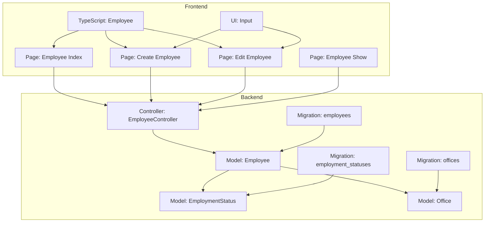
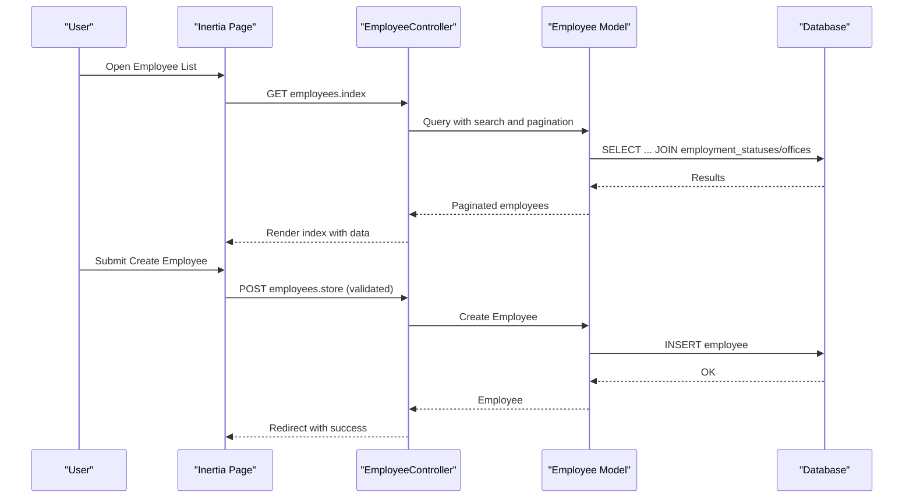
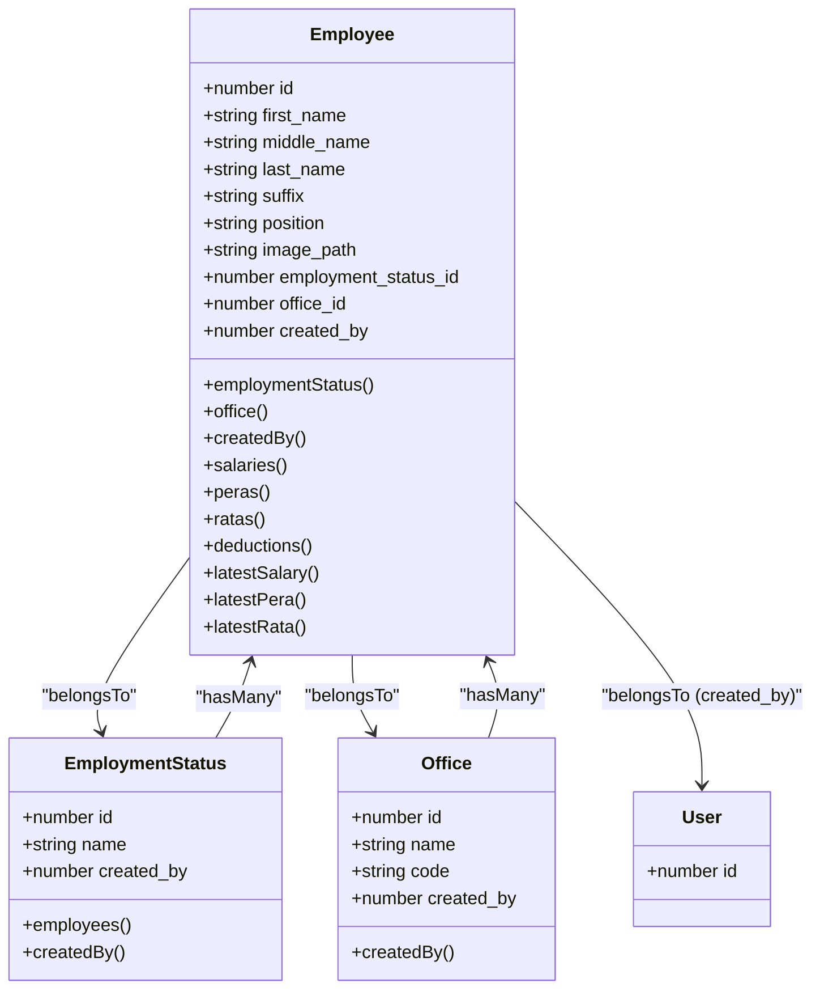
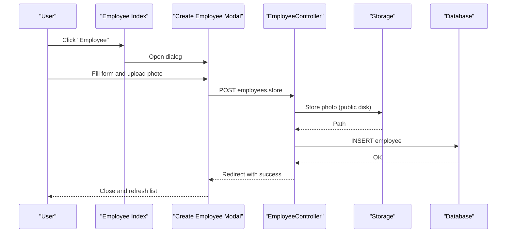
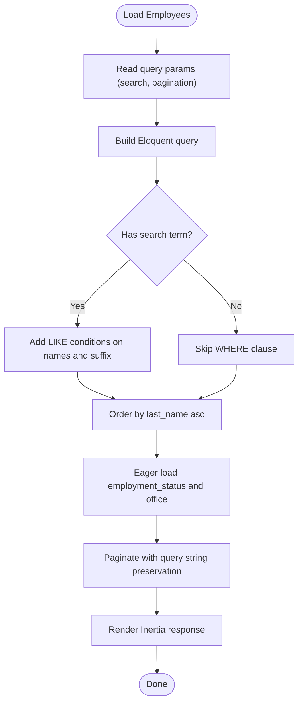
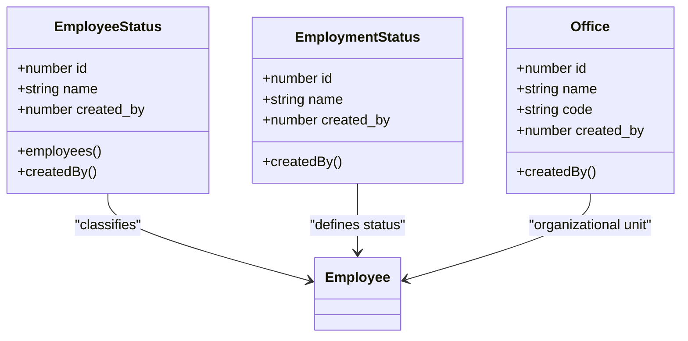
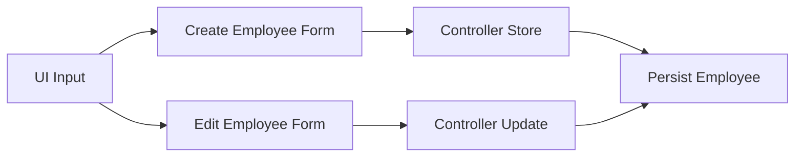
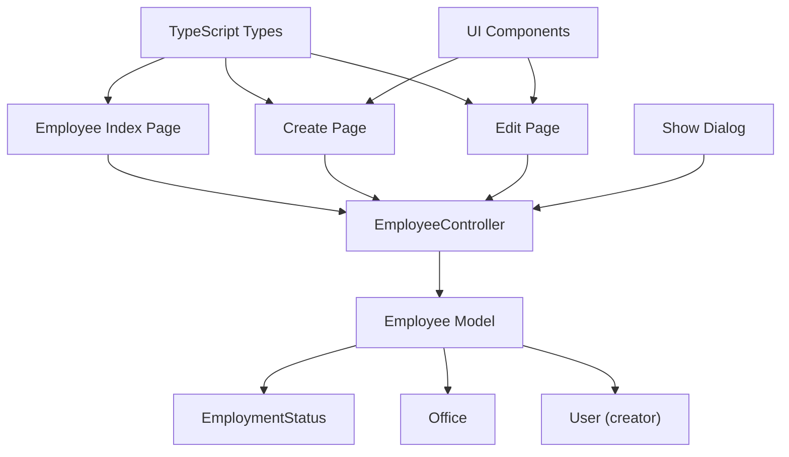

# Employee Management

<cite>
**Referenced Files in This Document**
- [Employee.php](file://app/Models/Employee.php)
- [EmployeeController.php](file://app/Http/Controllers/EmployeeController.php)
- [EmployeeStatus.php](file://app/Models/EmployeeStatus.php)
- [EmploymentStatus.php](file://app/Models/EmploymentStatus.php)
- [Office.php](file://app/Models/Office.php)
- [2026_03_19_022838_create_employees_table.php](file://database/migrations/2026_03_19_022838_create_employees_table.php)
- [2026_03_19_014107_create_employee_statuses_table.php](file://database/migrations/2026_03_19_014107_create_employee_statuses_table.php)
- [2026_03_19_014108_create_employment_statuses_table.php](file://database/migrations/2026_03_19_014108_create_employment_statuses_table.php)
- [2026_03_18_071422_create_offices_table.php](file://database/migrations/2026_03_18_071422_create_offices_table.php)
- [employee.d.ts](file://resources/js/types/employee.d.ts)
- [index.tsx](file://resources/js/pages/settings/Employee/index.tsx)
- [create.tsx](file://resources/js/pages/settings/Employee/create.tsx)
- [edit.tsx](file://resources/js/pages/settings/Employee/edit.tsx)
- [show.tsx](file://resources/js/pages/settings/Employee/show.tsx)
- [input.tsx](file://resources/js/components/ui/input.tsx)
</cite>

## Table of Contents
1. [Introduction](#introduction)
2. [Project Structure](#project-structure)
3. [Core Components](#core-components)
4. [Architecture Overview](#architecture-overview)
5. [Detailed Component Analysis](#detailed-component-analysis)
6. [Dependency Analysis](#dependency-analysis)
7. [Performance Considerations](#performance-considerations)
8. [Troubleshooting Guide](#troubleshooting-guide)
9. [Conclusion](#conclusion)
10. [Appendices](#appendices)

## Introduction
This document describes the complete employee lifecycle management system built with Laravel and Inertia.js. It covers employee creation, editing, viewing, and deletion, along with status tracking, employment status management, organizational hierarchy, and administrative controls. It also documents data models, relationships, business logic, UI components, form validation, data persistence, search and filtering, and reporting capabilities.

## Project Structure
The system follows a layered architecture:
- Backend: Laravel Eloquent models, controllers, and migrations define the domain and persistence layer.
- Frontend: Inertia-driven React pages and TypeScript types define the presentation and interaction layer.
- Assets: Images are stored via Laravel Storage under a public disk.

**Diagram sources**
- [Employee.php:10-104](file://app/Models/Employee.php#L10-L104)
- [EmployeeController.php:12-125](file://app/Http/Controllers/EmployeeController.php#L12-L125)
- [EmploymentStatus.php:9-32](file://app/Models/EmploymentStatus.php#L9-L32)
- [Office.php:9-33](file://app/Models/Office.php#L9-L33)
- [2026_03_19_022838_create_employees_table.php:14-27](file://database/migrations/2026_03_19_022838_create_employees_table.php#L14-L27)
- [2026_03_19_014108_create_employment_statuses_table.php:14-20](file://database/migrations/2026_03_19_014108_create_employment_statuses_table.php#L14-L20)
- [2026_03_18_071422_create_offices_table.php:14-21](file://database/migrations/2026_03_18_071422_create_offices_table.php#L14-L21)
- [index.tsx:33-169](file://resources/js/pages/settings/Employee/index.tsx#L33-L169)
- [create.tsx:37-304](file://resources/js/pages/settings/Employee/create.tsx#L37-L304)
- [edit.tsx:35-362](file://resources/js/pages/settings/Employee/edit.tsx#L35-L362)
- [show.tsx:19-112](file://resources/js/pages/settings/Employee/show.tsx#L19-L112)
- [employee.d.ts:8-35](file://resources/js/types/employee.d.ts#L8-L35)
- [input.tsx:5-17](file://resources/js/components/ui/input.tsx#L5-L17)

**Section sources**
- [Employee.php:10-104](file://app/Models/Employee.php#L10-L104)
- [EmployeeController.php:12-125](file://app/Http/Controllers/EmployeeController.php#L12-L125)
- [index.tsx:33-169](file://resources/js/pages/settings/Employee/index.tsx#L33-L169)

## Core Components
- Employee model encapsulates personal info, employment status, office assignment, creator attribution, and associations to payroll-related records. It provides helpers to fetch latest salary, PERA, and RATA records and resolves image URLs from storage.
- EmployeeController orchestrates listing, creating, updating, and rendering employee records with search and pagination, and integrates with Inertia for SSR-like UX.
- EmploymentStatus and Office models represent hierarchical classification and organizational units, respectively, with soft deletes and creator attribution.
- Frontend pages provide CRUD actions, search, and photo upload previews with client-side validation feedback.

Key responsibilities:
- Data modeling and relationships
- Validation and persistence
- Image storage and retrieval
- Search and pagination
- UI composition and user interactions

**Section sources**
- [Employee.php:10-104](file://app/Models/Employee.php#L10-L104)
- [EmployeeController.php:12-125](file://app/Http/Controllers/EmployeeController.php#L12-L125)
- [EmploymentStatus.php:9-32](file://app/Models/EmploymentStatus.php#L9-L32)
- [Office.php:9-33](file://app/Models/Office.php#L9-L33)
- [index.tsx:33-169](file://resources/js/pages/settings/Employee/index.tsx#L33-L169)
- [create.tsx:37-304](file://resources/js/pages/settings/Employee/create.tsx#L37-L304)
- [edit.tsx:35-362](file://resources/js/pages/settings/Employee/edit.tsx#L35-L362)
- [show.tsx:19-112](file://resources/js/pages/settings/Employee/show.tsx#L19-L112)

## Architecture Overview
The system uses a classic MVC pattern with Eloquent ORM and Inertia for full-stack development:
- Controllers receive requests and render Inertia responses.
- Models define relationships and business behaviors.
- Migrations define relational schemas.
- Pages and components handle user interactions and present data.

**Diagram sources**
- [EmployeeController.php:14-80](file://app/Http/Controllers/EmployeeController.php#L14-L80)
- [Employee.php:10-104](file://app/Models/Employee.php#L10-L104)
- [2026_03_19_022838_create_employees_table.php:14-27](file://database/migrations/2026_03_19_022838_create_employees_table.php#L14-L27)
- [index.tsx:33-169](file://resources/js/pages/settings/Employee/index.tsx#L33-L169)

## Detailed Component Analysis

### Data Models and Relationships
The Employee model defines attributes, casts, and relationships to EmploymentStatus, Office, and User (creator). It also exposes associations to Salary, Pera, Rata, and EmployeeDeduction, with helpers to fetch latest records by effective date. EmploymentStatus and Office models include soft deletes and creator attribution hooks.

**Diagram sources**
- [Employee.php:10-104](file://app/Models/Employee.php#L10-L104)
- [EmploymentStatus.php:9-32](file://app/Models/EmploymentStatus.php#L9-L32)
- [Office.php:9-33](file://app/Models/Office.php#L9-L33)

**Section sources**
- [Employee.php:10-104](file://app/Models/Employee.php#L10-L104)
- [EmploymentStatus.php:9-32](file://app/Models/EmploymentStatus.php#L9-L32)
- [Office.php:9-33](file://app/Models/Office.php#L9-L33)
- [2026_03_19_022838_create_employees_table.php:14-27](file://database/migrations/2026_03_19_022838_create_employees_table.php#L14-L27)
- [2026_03_19_014108_create_employment_statuses_table.php:14-20](file://database/migrations/2026_03_19_014108_create_employment_statuses_table.php#L14-L20)
- [2026_03_18_071422_create_offices_table.php:14-21](file://database/migrations/2026_03_18_071422_create_offices_table.php#L14-L21)

### Employee Lifecycle: Creation, Editing, Viewing, Deletion
- Creation: The index page opens a modal to create an employee. The form collects personal info, suffix, position, office, employment status, and optional photo. On submit, the controller validates, stores the photo, persists the employee, and redirects with a success message.
- Editing: The edit page preloads current values, supports photo preview and removal, and submits updates via a PUT request. Validation mirrors creation rules.
- Viewing: The show dialog displays employee details including department code, status, and placeholders for salary, PERA, and RATA.
- Deletion: The list row includes a delete action; while the frontend markup exists, the controller currently does not implement the destroy route.

**Diagram sources**
- [index.tsx:33-169](file://resources/js/pages/settings/Employee/index.tsx#L33-L169)
- [create.tsx:37-304](file://resources/js/pages/settings/Employee/create.tsx#L37-L304)
- [EmployeeController.php:45-80](file://app/Http/Controllers/EmployeeController.php#L45-L80)

**Section sources**
- [EmployeeController.php:45-125](file://app/Http/Controllers/EmployeeController.php#L45-L125)
- [create.tsx:37-304](file://resources/js/pages/settings/Employee/create.tsx#L37-L304)
- [edit.tsx:35-362](file://resources/js/pages/settings/Employee/edit.tsx#L35-L362)
- [show.tsx:19-112](file://resources/js/pages/settings/Employee/show.tsx#L19-L112)
- [index.tsx:33-169](file://resources/js/pages/settings/Employee/index.tsx#L33-L169)

### Search, Filtering, and Reporting
- Search: The index endpoint supports a search query parameter that matches across first, middle, last names, and suffix. Results are paginated and ordered by last name.
- Filtering: The index page renders a search input and triggers a GET request with query strings to preserve state and scroll.
- Reporting: The current implementation focuses on listing and detail views; dedicated reporting endpoints are not present in the referenced files.

**Diagram sources**
- [EmployeeController.php:14-41](file://app/Http/Controllers/EmployeeController.php#L14-L41)
- [index.tsx:33-169](file://resources/js/pages/settings/Employee/index.tsx#L33-L169)

**Section sources**
- [EmployeeController.php:14-41](file://app/Http/Controllers/EmployeeController.php#L14-L41)
- [index.tsx:33-169](file://resources/js/pages/settings/Employee/index.tsx#L33-L169)

### Administrative Controls and Status Management
- Employment status management: EmploymentStatus and EmployeeStatus models support soft deletes and creator attribution. They are used to classify employees and provide administrative controls for status definitions.
- Office hierarchy: Office model defines organizational units with code and creator attribution, linked to employees via foreign keys.
- Creator attribution: Models capture the authenticated user ID during creation via model boot hooks.

**Diagram sources**
- [EmployeeStatus.php:9-37](file://app/Models/EmployeeStatus.php#L9-L37)
- [EmploymentStatus.php:9-32](file://app/Models/EmploymentStatus.php#L9-L32)
- [Office.php:9-33](file://app/Models/Office.php#L9-L33)

**Section sources**
- [EmployeeStatus.php:9-37](file://app/Models/EmployeeStatus.php#L9-L37)
- [EmploymentStatus.php:9-32](file://app/Models/EmploymentStatus.php#L9-L32)
- [Office.php:9-33](file://app/Models/Office.php#L9-L33)

### User Interface Components and Form Validation
- Input component: Provides standardized styling and accessibility for form inputs.
- Create/Edit forms: Collect required and optional fields, enforce image constraints, and support photo preview/removal.
- Type safety: TypeScript types define the shape of Employee and related entities, ensuring consistent frontend-backend contracts.

**Diagram sources**
- [input.tsx:5-17](file://resources/js/components/ui/input.tsx#L5-L17)
- [create.tsx:37-304](file://resources/js/pages/settings/Employee/create.tsx#L37-L304)
- [edit.tsx:35-362](file://resources/js/pages/settings/Employee/edit.tsx#L35-L362)
- [EmployeeController.php:45-125](file://app/Http/Controllers/EmployeeController.php#L45-L125)

**Section sources**
- [input.tsx:5-17](file://resources/js/components/ui/input.tsx#L5-L17)
- [create.tsx:37-304](file://resources/js/pages/settings/Employee/create.tsx#L37-L304)
- [edit.tsx:35-362](file://resources/js/pages/settings/Employee/edit.tsx#L35-L362)
- [employee.d.ts:8-35](file://resources/js/types/employee.d.ts#L8-L35)

## Dependency Analysis
- Controllers depend on models and Inertia for rendering.
- Models depend on Eloquent relationships and Storage for images.
- Pages depend on TypeScript types and UI components.
- Migrations define referential integrity and cascading deletes.

**Diagram sources**
- [EmployeeController.php:12-125](file://app/Http/Controllers/EmployeeController.php#L12-L125)
- [Employee.php:10-104](file://app/Models/Employee.php#L10-L104)
- [index.tsx:33-169](file://resources/js/pages/settings/Employee/index.tsx#L33-L169)
- [create.tsx:37-304](file://resources/js/pages/settings/Employee/create.tsx#L37-L304)
- [edit.tsx:35-362](file://resources/js/pages/settings/Employee/edit.tsx#L35-L362)
- [show.tsx:19-112](file://resources/js/pages/settings/Employee/show.tsx#L19-L112)
- [employee.d.ts:8-35](file://resources/js/types/employee.d.ts#L8-L35)
- [input.tsx:5-17](file://resources/js/components/ui/input.tsx#L5-L17)

**Section sources**
- [EmployeeController.php:12-125](file://app/Http/Controllers/EmployeeController.php#L12-L125)
- [Employee.php:10-104](file://app/Models/Employee.php#L10-L104)
- [index.tsx:33-169](file://resources/js/pages/settings/Employee/index.tsx#L33-L169)

## Performance Considerations
- Pagination: The index uses pagination to limit result sets and improve responsiveness.
- Eager loading: The controller eager-loads related employment status and office data to avoid N+1 queries.
- Image storage: Photos are stored on a public disk; consider CDN integration for scalability.
- Validation: Client-side formatting prevents invalid numeric inputs but server-side validation remains the authoritative check.

[No sources needed since this section provides general guidance]

## Troubleshooting Guide
- Photo upload issues: Ensure the public disk is writable and the storage symlink is configured. Verify MIME types and size limits in the controller.
- Search not returning results: Confirm the search parameter is passed as a query string and that LIKE conditions match the intended fields.
- Relationship errors: Verify foreign key constraints and that related records (employment status, office) exist before creating or updating employees.
- Soft deletes: If records appear missing, check for soft-deleted entries and restore or purge as appropriate.

**Section sources**
- [EmployeeController.php:45-125](file://app/Http/Controllers/EmployeeController.php#L45-L125)
- [2026_03_19_022838_create_employees_table.php:22-24](file://database/migrations/2026_03_19_022838_create_employees_table.php#L22-L24)

## Conclusion
The employee management system provides a robust foundation for managing employee lifecycles, including creation, editing, viewing, and deletion, with integrated search, filtering, and administrative controls. The backend leverages Eloquent models and controllers, while the frontend delivers responsive, type-safe interactions through Inertia and React. Extending reporting and implementing the delete operation would further enhance the system’s completeness.

[No sources needed since this section summarizes without analyzing specific files]

## Appendices

### Data Model Definitions
- Employee: Personal info, position, image path, employment status, office, creator, timestamps, and soft deletes.
- EmploymentStatus: Name, creator, timestamps, and soft deletes.
- Office: Name, code, creator, timestamps, and soft deletes.

**Section sources**
- [2026_03_19_022838_create_employees_table.php:14-27](file://database/migrations/2026_03_19_022838_create_employees_table.php#L14-L27)
- [2026_03_19_014108_create_employment_statuses_table.php:14-20](file://database/migrations/2026_03_19_014108_create_employment_statuses_table.php#L14-L20)
- [2026_03_18_071422_create_offices_table.php:14-21](file://database/migrations/2026_03_18_071422_create_offices_table.php#L14-L21)