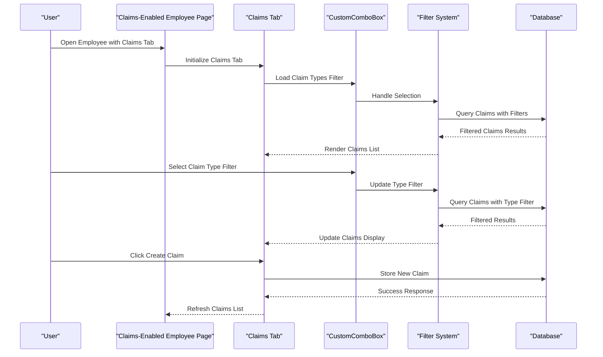
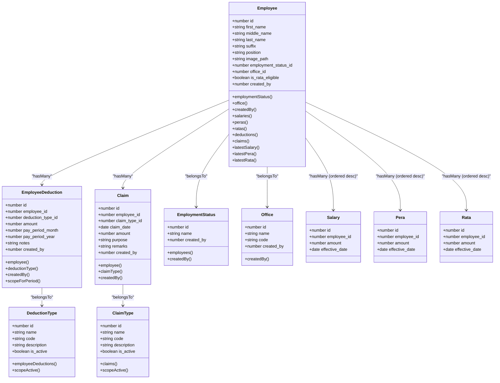
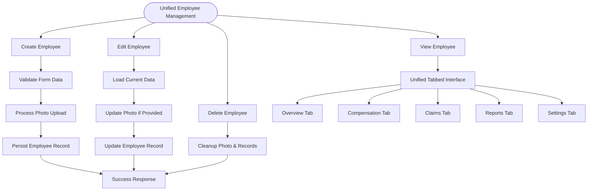
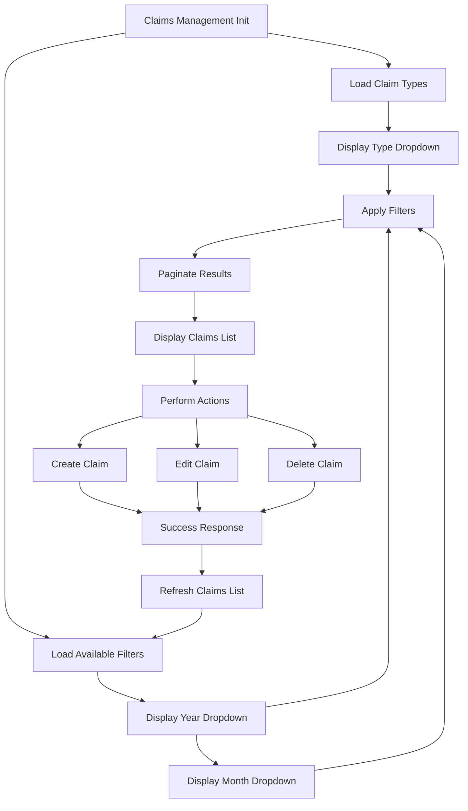
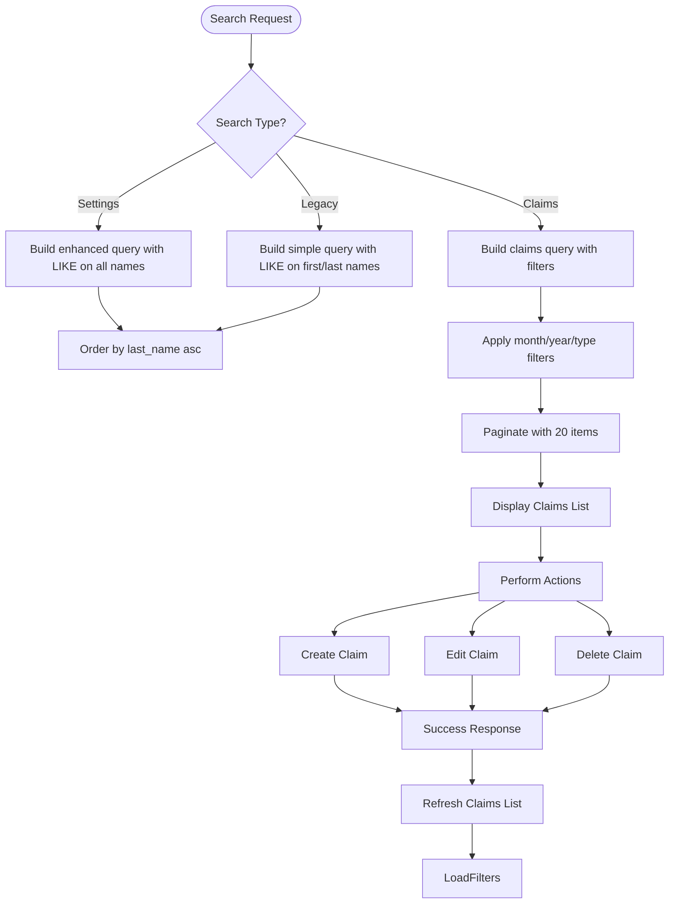
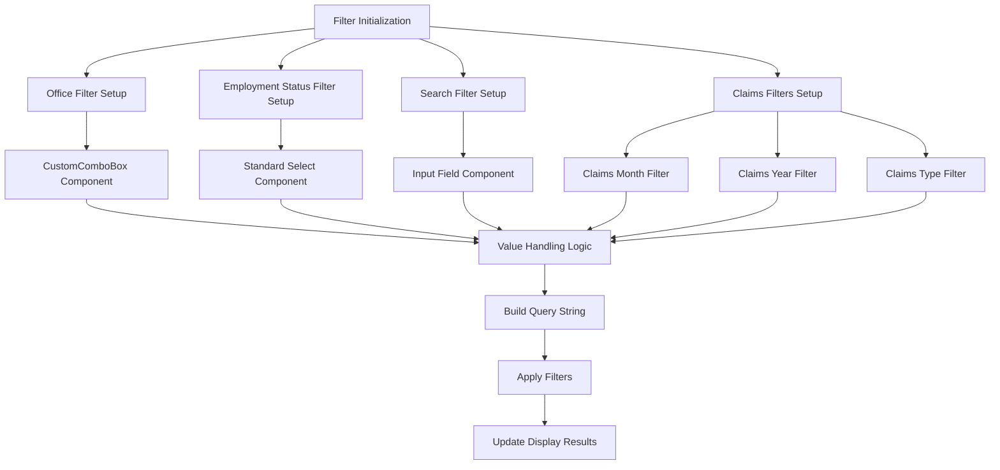

# Employee Management

<cite>
**Referenced Files in This Document**
- [ManageEmployeeController.php](file://app/Http/Controllers/ManageEmployeeController.php)
- [EmployeeSettingController.php](file://app/Http/Controllers/EmployeeSettingController.php)
- [EmployeeController.php](file://app/Http/Controllers/EmployeeController.php)
- [EmployeeManage.php](file://app/Http/Controllers/EmployeeManage.php)
- [EmployeeDeductionController.php](file://app/Http/Controllers/EmployeeDeductionController.php)
- [PayrollController.php](file://app/Http/Controllers/PayrollController.php)
- [PeraController.php](file://app/Http/Controllers/PeraController.php)
- [RataController.php](file://app/Http/Controllers/RataController.php)
- [SalaryController.php](file://app/Http/Controllers/SalaryController.php)
- [ClaimController.php](file://app/Http/Controllers/ClaimController.php)
- [Claim.php](file://app/Models/Claim.php)
- [ClaimType.php](file://app/Models/ClaimType.php)
- [Employee.php](file://app/Models/Employee.php)
- [EmployeeDeduction.php](file://app/Models/EmployeeDeduction.php)
- [DeductionType.php](file://app/Models/DeductionType.php)
- [EmployeeStatus.php](file://app/Models/EmployeeStatus.php)
- [EmploymentStatus.php](file://app/Models/EmploymentStatus.php)
- [Office.php](file://app/Models/Office.php)
- [2026_03_19_022838_create_employees_table.php](file://database/migrations/2026_03_19_022838_create_employees_table.php)
- [2026_03_19_014107_create_employee_statuses_table.php](file://database/migrations/2026_03_19_014107_create_employee_statuses_table.php)
- [2026_03_19_014108_create_employment_statuses_table.php](file://database/migrations/2026_03_19_014108_create_employment_statuses_table.php)
- [2026_03_18_071422_create_offices_table.php](file://database/migrations/2026_03_18_071422_create_offices_table.php)
- [2026_03_23_053019_create_claim_types_table.php](file://database/migrations/2026_03_23_053019_create_claim_types_table.php)
- [2026_03_23_053024_create_claims_table.php](file://database/migrations/2026_03_23_053024_create_claims_table.php)
- [employee.d.ts](file://resources/js/types/employee.d.ts)
- [employmentStatuses.d.ts](file://resources/js/types/employmentStatuses.d.ts)
- [claim.ts](file://resources/js/types/claim.ts)
- [claimType.ts](file://resources/js/types/claimType.ts)
- [CustomComboBox.tsx](file://resources/js/components/CustomComboBox.tsx)
- [Employees/Index.tsx](file://resources/js/pages/Employees/Index.tsx)
- [Employees/Manage/Manage.tsx](file://resources/js/pages/Employees/Manage/Manage.tsx)
- [Employees/Manage/claims/index.tsx](file://resources/js/pages/Employees/Manage/claims/index.tsx)
- [Employees/Manage/claims/create.tsx](file://resources/js/pages/Employees/Manage/claims/create.tsx)
- [Employees/Manage/claims/edit.tsx](file://resources/js/pages/Employees/Manage/claims/edit.tsx)
- [payroll/index.tsx](file://resources/js/pages/payroll/index.tsx)
- [employee-deductions/index.tsx](file://resources/js/pages/employee-deductions/index.tsx)
- [salaries/index.tsx](file://resources/js/pages/salaries/index.tsx)
- [peras/index.tsx](file://resources/js/pages/peras/index.tsx)
- [ratas/index.tsx](file://resources/js/pages/ratas/index.tsx)
- [routes/web.php](file://routes/web.php)
</cite>

## Update Summary
**Changes Made**
- **Integrated Claims Management System**: Added comprehensive claims functionality with dedicated controllers, models, and frontend components
- **Enhanced ManageEmployeeController**: Integrated claims data loading, filtering capabilities, and claims tab within unified employee interface
- **Added Claims Pagination**: Implemented 20-item pagination with month/year/type filtering for claims history
- **Claims Tab Integration**: Added Claims tab to unified employee management interface with separate routing
- **Claims Data Models**: Introduced Claim and ClaimType models with foreign key relationships and validation
- **Claims CRUD Operations**: Added full create, read, update, delete functionality for employee claims
- **Claims Reporting**: Integrated claims data into overview and reports sections with total claims calculation
- **Enhanced UI Components**: Improved CustomComboBox with better value handling and selection logic
- **Modernized Employee Interfaces**: Updated employee management interfaces with enhanced filtering and claims integration

## Table of Contents
1. [Introduction](#introduction)
2. [Project Structure](#project-structure)
3. [Core Components](#core-components)
4. [Architecture Overview](#architecture-overview)
5. [Detailed Component Analysis](#detailed-component-analysis)
6. [Administrative Management Interface](#administrative-management-interface)
7. [Claims Management System](#claims-management-system)
8. [Allowance Management System](#allowance-management-system)
9. [Deduction Management System](#deduction-management-system)
10. [Employee Profile Management](#employee-profile-management)
11. [Payroll Integration](#payroll-integration)
12. [Enhanced Filtering and Search](#enhanced-filtering-and-search)
13. [Navigation and User Interface](#navigation-and-user-interface)
14. [Dependency Analysis](#dependency-analysis)
15. [Performance Considerations](#performance-considerations)
16. [Troubleshooting Guide](#troubleshooting-guide)
17. [Conclusion](#conclusion)
18. [Appendices](#appendices)

## Introduction
This document describes the complete employee lifecycle management system built with Laravel and Inertia.js. The system has undergone significant enhancements to integrate comprehensive claims management functionality alongside existing allowance tracking, deduction management, and payroll integration capabilities.

The recent updates introduce a fully integrated claims management system that allows employees to record, track, and manage various types of claims with sophisticated filtering, pagination, and reporting capabilities. The enhanced ManageEmployeeController now provides unified access to employee data including claims history, while the new Claims tab in the employee management interface offers dedicated functionality for claims administration.

The system continues to provide comprehensive employee lifecycle management with tabbed navigation, advanced allowance tracking, deduction management, claims processing, and seamless payroll integration, now with significantly improved administrative capabilities and user experience.

## Project Structure
The system maintains its unified multi-controller architecture while adding comprehensive claims management functionality:

```mermaid
graph TB
subgraph "Backend Controllers"
C_ManageEmployee["Controller: ManageEmployeeController"]
C_EmployeeSetting["Controller: EmployeeSettingController"]
C_EmployeeLegacy["Controller: EmployeeController"]
C_Claim["Controller: ClaimController"]
C_Salary["Controller: SalaryController"]
C_Pera["Controller: PeraController"]
C_Rata["Controller: RataController"]
C_Deduction["Controller: EmployeeDeductionController"]
C_Payroll["Controller: PayrollController"]
C_DeductionType["Controller: DeductionTypeController"]
C_ClaimType["Controller: ClaimTypeController"]
end
subgraph "Models & Relationships"
M_Employee["Model: Employee"]
M_EmployeeDeduction["Model: EmployeeDeduction"]
M_DeductionType["Model: DeductionType"]
M_Claim["Model: Claim"]
M_ClaimType["Model: ClaimType"]
M_EmploymentStatus["Model: EmploymentStatus"]
M_Office["Model: Office"]
M_Salary["Model: Salary"]
M_Pera["Model: Pera"]
M_Rata["Model: Rata"]
end
subgraph "Enhanced Frontend Pages"
P_Manage["Page: Employees/Manage/Manage"]
P_Overview["Page: Employees/Manage/Overview"]
P_Compensation["Page: Employees/Manage/Compensation"]
P_Claims["Page: Employees/Manage/Claims"]
P_ClaimsIndex["Page: Employees/Manage/claims/index"]
P_ClaimsCreate["Page: Employees/Manage/claims/create"]
P_ClaimsEdit["Page: Employees/Manage/claims/edit"]
P_Settings["Page: Employees/Manage/Settings"]
P_Deductions["Page: Employees/Manage/compensation/deductions"]
P_Salary["Page: Employees/Manage/compensation/salary"]
P_Rata["Page: Employees/Manage/compensation/rata"]
P_List["Page: Employees/Index"]
P_Payroll["Page: Payroll/Index"]
P_EmpDed["Page: Employee-Deductions/Index"]
P_DedType["Page: Deduction-Types/Index"]
P_ClaimType["Page: Claim-Types/Index"]
end
subgraph "Enhanced Routes"
R_Manage["Route: manage.employees.*"]
R_Settings["Route: employees.*"]
R_Claims["Route: manage.employees.claims.*"]
R_Allowances["Route: salaries/peras/ratas.*"]
R_Deductions["Route: employee-deductions.*"]
R_Payroll["Route: payroll.*"]
R_DeductionTypes["Route: deduction-types.*"]
R_ClaimTypes["Route: claim-types.*"]
end
C_ManageEmployee --> M_Employee
C_ManageEmployee --> M_EmployeeDeduction
C_ManageEmployee --> M_DeductionType
C_ManageEmployee --> M_Claim
C_Claim --> M_Employee
C_Claim --> M_ClaimType
C_EmployeeSetting --> M_Employee
C_EmployeeLegacy --> M_Employee
C_Payroll --> M_Employee
C_Deduction --> M_EmployeeDeduction
C_Deduction --> M_DeductionType
C_DeductionType --> M_DeductionType
C_ClaimType --> M_ClaimType
M_Employee --> M_EmploymentStatus
M_Employee --> M_Office
M_Employee --> M_Salary
M_Employee --> M_Pera
M_Employee --> M_Rata
M_Employee --> M_EmployeeDeduction
M_Employee --> M_Claim
M_EmployeeDeduction --> M_DeductionType
M_Claim --> M_Employee
M_Claim --> M_ClaimType
P_Manage --> C_ManageEmployee
P_List --> C_EmployeeLegacy
P_Payroll --> C_Payroll
P_EmpDed --> C_Deduction
P_DedType --> C_DeductionType
P_Claims --> C_Claim
P_ClaimsIndex --> C_Claim
P_ClaimsCreate --> C_Claim
P_ClaimsEdit --> C_Claim
P_ClaimType --> C_ClaimType
R_Manage --> C_ManageEmployee
R_Settings --> C_EmployeeSetting
R_Claims --> C_Claim
R_Allowances --> C_Salary
R_Allowances --> C_Pera
R_Allowances --> C_Rata
R_Deductions --> C_Deduction
R_Payroll --> C_Payroll
R_DeductionTypes --> C_DeductionType
R_ClaimTypes --> C_ClaimType
```

**Diagram sources**
- [ManageEmployeeController.php:16-176](file://app/Http/Controllers/ManageEmployeeController.php#L16-L176)
- [EmployeeSettingController.php:12-139](file://app/Http/Controllers/EmployeeSettingController.php#L12-L139)
- [EmployeeController.php:12-132](file://app/Http/Controllers/EmployeeController.php#L12-L132)
- [ClaimController.php:11-98](file://app/Http/Controllers/ClaimController.php#L11-L98)
- [Employee.php:10-104](file://app/Models/Employee.php#L10-L104)
- [EmployeeDeduction.php:8-59](file://app/Models/EmployeeDeduction.php#L8-L59)
- [DeductionType.php:7-33](file://app/Models/DeductionType.php#L7-L33)
- [Claim.php:8-36](file://app/Models/Claim.php#L8-L36)
- [ClaimType.php:8-28](file://app/Models/ClaimType.php#L8-L28)
- [routes/web.php:77-105](file://routes/web.php#L77-L105)

**Section sources**
- [ManageEmployeeController.php:16-176](file://app/Http/Controllers/ManageEmployeeController.php#L16-L176)
- [routes/web.php:77-105](file://routes/web.php#L77-L105)

## Core Components
The system now features enhanced filtering capabilities and comprehensive claims management functionality:

### Integrated Claims Management System
**New Claims Infrastructure** providing comprehensive claims processing:
- **Claims Data Model**: Complete claims tracking with type categorization, date, amount, and purpose
- **Claims Type Management**: Active/inactive claim types with code and description support
- **Claims CRUD Operations**: Full create, read, update, delete functionality with validation
- **Claims Pagination**: 20 items per page with query string preservation for efficient browsing
- **Claims Filtering**: Month/year/type filtering with dynamic query building
- **Claims Reporting**: Integration with overview and reports sections with total claims calculation

### Enhanced Filtering System
**New Filtering Infrastructure** providing comprehensive search and filter options:
- **Office ID Filter**: Dropdown selection for filtering by organizational unit
- **Employment Status Filter**: Dropdown selection for filtering by employment classification
- **Claims Month/Year Filter**: Specialized filtering for claims by pay period
- **Claims Type Filter**: Dropdown selection for filtering by claim category
- **Consistent Implementation**: Standardized filter handling across multiple pages
- **Real-time Updates**: Dynamic filter application with query string preservation

### Improved Combobox Components
**Enhanced CustomComboBox** providing better user interaction:
- **Value Handling**: Improved value-to-label mapping and selection logic
- **Default Values**: Better handling of default selections and null values
- **Type Safety**: Strongly typed item handling with value/label structure
- **Event Handling**: Enhanced onSelect callback with proper null handling

### Streamlined Navigation
**Refined Navigation Structure** with improved user experience:
- **Removed Redundant Items**: Eliminated Deduction Types from main sidebar navigation
- **Added Claims Navigation**: Claims Types accessible via dedicated route
- **Maintained Access**: All pages remain accessible via direct routes
- **Focused Navigation**: Cleaner sidebar with essential navigation items only

**Section sources**
- [Employees/Index.tsx:98-120](file://resources/js/pages/Employees/Index.tsx#L98-L120)
- [payroll/index.tsx:128-146](file://resources/js/pages/payroll/index.tsx#L128-L146)
- [employee-deductions/index.tsx:196-212](file://resources/js/pages/employee-deductions/index.tsx#L196-L212)
- [CustomComboBox.tsx:14-60](file://resources/js/components/CustomComboBox.tsx#L14-L60)

## Architecture Overview
The system maintains its unified architecture while adding comprehensive claims management capabilities:

**Diagram sources**
- [Employees/Manage/Manage.tsx:179-187](file://resources/js/pages/Employees/Manage/Manage.tsx#L179-L187)
- [CustomComboBox.tsx:21-44](file://resources/js/components/CustomComboBox.tsx#L21-L44)

## Detailed Component Analysis

### Data Models and Relationships
The Employee model now includes comprehensive claims management with enhanced relationships:

**Diagram sources**
- [Employee.php:10-104](file://app/Models/Employee.php#L10-L104)
- [EmployeeDeduction.php:8-59](file://app/Models/EmployeeDeduction.php#L8-L59)
- [Claim.php:8-36](file://app/Models/Claim.php#L8-L36)
- [ClaimType.php:8-28](file://app/Models/ClaimType.php#L8-L28)
- [DeductionType.php:7-33](file://app/Models/DeductionType.php#L7-L33)
- [EmploymentStatus.php:9-32](file://app/Models/EmploymentStatus.php#L9-L32)
- [Office.php:9-33](file://app/Models/Office.php#L9-L33)

**Section sources**
- [Employee.php:10-104](file://app/Models/Employee.php#L10-L104)
- [EmployeeDeduction.php:8-59](file://app/Models/EmployeeDeduction.php#L8-L59)
- [Claim.php:8-36](file://app/Models/Claim.php#L8-L36)
- [ClaimType.php:8-28](file://app/Models/ClaimType.php#L8-L28)
- [DeductionType.php:7-33](file://app/Models/DeductionType.php#L7-L33)

### Unified Employee Lifecycle Management
The new ManageEmployeeController provides comprehensive CRUD operations with enhanced functionality including claims management:

#### Creation Process
- **Modal Interface**: Opens comprehensive create dialog with allowance configuration
- **Photo Upload**: Validates and stores images on public disk with cleanup on update/delete
- **Allowance Tracking**: Creates employee with allowance eligibility flags
- **Validation**: Comprehensive form validation with image constraints

#### Editing Process  
- **Preloaded Data**: Shows current values with photo preview and removal option
- **Photo Management**: Supports upload, preview, and removal with automatic cleanup
- **Allowance Configuration**: Real-time eligibility toggling for RATA and PERA

#### Management Interface
- **Unified Tabbed Navigation**: Overview, Compensation, Claims, Reports, Settings tabs in single interface
- **Real-time Updates**: Live currency formatting and allowance calculations
- **Status Indicators**: Visual indicators for current vs previous records
- **Eligibility Management**: Conditional access to allowance management based on RATA status
- **Deduction Integration**: Comprehensive deduction tracking within unified interface
- **Claims Integration**: Claims history display with pagination and filtering within unified interface

**Diagram sources**
- [EmployeeSettingController.php:54-137](file://app/Http/Controllers/EmployeeSettingController.php#L54-L137)
- [ManageEmployeeController.php:16-50](file://app/Http/Controllers/ManageEmployeeController.php#L16-L50)
- [Employees/Manage/Manage.tsx:88-115](file://resources/js/pages/Employees/Manage/Manage.tsx#L88-L115)

**Section sources**
- [EmployeeSettingController.php:54-137](file://app/Http/Controllers/EmployeeSettingController.php#L54-L137)
- [ManageEmployeeController.php:16-50](file://app/Http/Controllers/ManageEmployeeController.php#L16-L50)
- [create.tsx:37-304](file://resources/js/pages/settings/Employee/create.tsx#L37-L304)
- [edit.tsx:35-362](file://resources/js/pages/settings/Employee/edit.tsx#L35-L362)
- [Employees/Manage/Manage.tsx:88-115](file://resources/js/pages/Employees/Manage/Manage.tsx#L88-L115)

### Claims Management System
**New Claims Infrastructure** providing comprehensive claims processing:

#### Claims Data Model
- **Complete Claims Tracking**: Foreign key relationships to employees and claim types
- **Date and Amount Precision**: Proper casting for claim_date and decimal amount fields
- **Purpose and Remarks**: Text fields for claim details and administrative notes
- **Timestamp Management**: Automatic created_at and updated_at tracking

#### Claims Type Management
- **Active/Inactive Control**: Claim types can be enabled/disabled for active use
- **Code Management**: Unique codes for each claim type
- **Description Support**: Detailed descriptions for audit purposes
- **Validation**: Ensures claim types are properly configured before use

#### Claims CRUD Operations
- **Create Claims**: Form validation with claim_type_id, claim_date, amount, purpose, remarks
- **Read Claims**: Paginated listing with filtering by month, year, and type
- **Update Claims**: Edit existing claims with validation
- **Delete Claims**: Remove claims with confirmation dialog

#### Claims Filtering and Pagination
- **Claims Pagination**: 20 items per page with query string preservation
- **Month/Year Filtering**: Dropdown selection for filtering by pay period
- **Type Filtering**: Dropdown selection for filtering by claim category
- **Available Years**: Dynamic year dropdown based on existing claims data

**Diagram sources**
- [ClaimController.php:13-57](file://app/Http/Controllers/ClaimController.php#L13-L57)
- [ManageEmployeeController.php:97-127](file://app/Http/Controllers/ManageEmployeeController.php#L97-L127)

**Section sources**
- [ClaimController.php:13-98](file://app/Http/Controllers/ClaimController.php#L13-L98)
- [ManageEmployeeController.php:97-175](file://app/Http/Controllers/ManageEmployeeController.php#L97-L175)
- [Claim.php:8-36](file://app/Models/Claim.php#L8-L36)
- [ClaimType.php:8-28](file://app/Models/ClaimType.php#L8-L28)

### Routing Restructuring
The routing system has been completely restructured to support the new unified controller architecture with claims management:

```mermaid
graph LR
subgraph "Manage Routes"
M_Index["GET /manage/employees/{employee}"]
M_Deductions["POST /manage/employees/{employee}/deductions"]
end
subgraph "Claims Routes"
C_Index["GET /manage/employees/{employee}/claims"]
C_Store["POST /manage/employees/{employee}/claims"]
C_Update["PUT /manage/employees/{employee}/claims/{claim}"]
C_Destroy["DELETE /manage/employees/{employee}/claims/{claim}"]
end
subgraph "Settings Routes"
S_Index["GET /settings/employees"]
S_Create["GET /settings/employees/create"]
S_Store["POST /settings/employees"]
S_Show["GET /settings/employees/{employee}"]
S_Update["PUT /settings/employees/{employee}"]
S_Destroy["DELETE /settings/employees/{employee}"]
end
subgraph "Legacy Routes"
L_Index["GET /employees"]
L_Create["GET /employees/create"]
L_Store["POST /employees"]
L_Show["GET /employees/{employee}"]
L_Update["PUT /employees/{employee}"]
L_Destroy["DELETE /employees/{employee}"]
end
subgraph "Payroll Routes"
P_Index["GET /payroll"]
P_Show["GET /payroll/{employee}"]
end
subgraph "Deduction Routes"
D_Index["GET /employee-deductions"]
D_Store["POST /employee-deductions"]
D_Update["PUT /employee-deductions/{employeeDeduction}"]
D_Destroy["DELETE /employee-deductions/{employeeDeduction}"]
end
subgraph "Deduction Types Routes"
DT_Index["GET /settings/deduction-types"]
DT_Store["POST /settings/deduction-types"]
DT_Update["PUT /settings/deduction-types/{deductionType}"]
DT_Destroy["DELETE /settings/deduction-types/{deductionType}"]
end
subgraph "Claim Types Routes"
CT_Index["GET /settings/claim-types"]
CT_Store["POST /settings/claim-types"]
CT_Update["PUT /settings/claim-types/{claimType}"]
CT_Destroy["DELETE /settings/claim-types/{claimType}"]
end
M_Index --> ManageEmployeeController
M_Deductions --> ManageEmployeeController
C_Index --> ClaimController
C_Store --> ClaimController
C_Update --> ClaimController
C_Destroy --> ClaimController
S_Index --> EmployeeSettingController
S_Create --> EmployeeSettingController
S_Store --> EmployeeSettingController
S_Show --> EmployeeSettingController
S_Update --> EmployeeSettingController
S_Destroy --> EmployeeSettingController
L_Index --> EmployeeController
L_Create --> EmployeeController
L_Store --> EmployeeController
L_Show --> EmployeeController
L_Update --> EmployeeController
L_Destroy --> EmployeeController
P_Index --> PayrollController
P_Show --> PayrollController
D_Index --> EmployeeDeductionController
D_Store --> EmployeeDeductionController
D_Update --> EmployeeDeductionController
D_Destroy --> EmployeeDeductionController
DT_Index --> DeductionTypeController
DT_Store --> DeductionTypeController
DT_Update --> DeductionTypeController
DT_Destroy --> DeductionTypeController
CT_Index --> ClaimTypeController
CT_Store --> ClaimTypeController
CT_Update --> ClaimTypeController
CT_Destroy --> ClaimTypeController
```

**Diagram sources**
- [routes/web.php:77-105](file://routes/web.php#L77-L105)

**Section sources**
- [routes/web.php:77-105](file://routes/web.php#L77-L105)

### Search, Filtering, and Reporting
The enhanced search functionality now supports comprehensive employee discovery with extensive filtering options including claims management:

#### Settings Employee Search
- **Enhanced Search**: LIKE operators across first_name, middle_name, last_name, and suffix
- **Pagination**: 50 items per page with query string preservation
- **Relationship Loading**: Eager loading of employment_status and office for performance

#### Legacy Employee Search  
- **Basic Search**: LIKE operators across first_name and last_name only
- **Lightweight**: 10 items per page for basic display functionality

#### Enhanced Filtering System
**New Comprehensive Filtering** providing multiple filter dimensions:
- **Office Filter**: Dropdown selection for filtering by organizational unit
- **Employment Status Filter**: Dropdown selection for filtering by employment classification
- **Claims Month Filter**: Dropdown selection for filtering by claim month
- **Claims Year Filter**: Dropdown selection for filtering by claim year
- **Claims Type Filter**: Dropdown selection for filtering by claim type
- **Search Integration**: Combined search functionality with filter persistence
- **Real-time Updates**: Dynamic filter application with immediate results

**Diagram sources**
- [EmployeeSettingController.php:18-28](file://app/Http/Controllers/EmployeeSettingController.php#L18-L28)
- [EmployeeController.php:19-26](file://app/Http/Controllers/EmployeeController.php#L19-L26)
- [ClaimController.php:13-57](file://app/Http/Controllers/ClaimController.php#L13-L57)

**Section sources**
- [EmployeeSettingController.php:18-28](file://app/Http/Controllers/EmployeeSettingController.php#L18-L28)
- [EmployeeController.php:19-26](file://app/Http/Controllers/EmployeeController.php#L19-L26)
- [ClaimController.php:13-57](file://app/Http/Controllers/ClaimController.php#L13-L57)

### Administrative Controls and Status Management
The system maintains comprehensive administrative capabilities:

#### Employment Status Management
- **Soft Deletes**: EmploymentStatus and EmployeeStatus models support soft deletes
- **Creator Attribution**: Models capture authenticated user ID during creation
- **Classification**: EmploymentStatus classifies employees with administrative controls

#### Office Hierarchy
- **Organizational Units**: Office model defines departments with code and creator attribution
- **Foreign Key Relationships**: Links employees to organizational structure
- **Hierarchical Support**: Foundation for complex organizational structures

#### Claims Type Management
- **Active/Inactive Control**: ClaimType models support enable/disable functionality
- **Code Management**: Unique codes for each claim type
- **Description Support**: Detailed descriptions for audit purposes
- **Validation**: Ensures claim types are properly configured before use

**Section sources**
- [EmployeeStatus.php:9-37](file://app/Models/EmployeeStatus.php#L9-L37)
- [EmploymentStatus.php:9-32](file://app/Models/EmploymentStatus.php#L9-L32)
- [Office.php:9-33](file://app/Models/Office.php#L9-L33)
- [ClaimType.php:8-28](file://app/Models/ClaimType.php#L8-L28)

### User Interface Components and Form Validation
The enhanced interface provides sophisticated administrative controls with improved filtering and comprehensive claims management:

#### Unified Tabbed Navigation System
- **Overview Tab**: Consolidated employee information with allowance status, deduction summary, and claims summary
- **Compensation Tab**: Detailed allowance management with salary, PERA, RATA, and deduction tracking
- **Claims Tab**: Comprehensive claims management with creation, editing, and history tracking
- **Reports Tab**: Comprehensive reporting capabilities and analytics including claims data
- **Settings Tab**: Profile configuration and administrative controls

#### Enhanced Form Components
- **Photo Management**: Upload, preview, and removal with validation
- **Combobox Selection**: Custom combobox for office selection with search
- **Switch Controls**: RATA eligibility toggles with real-time feedback
- **Real-time Formatting**: Currency formatting and validation
- **Deduction Management**: Comprehensive deduction type selection and amount entry
- **Claims Management**: Claims type selection, date picker, amount entry, and purpose description

#### Enhanced Filtering Interface
**New Filtering Components** providing comprehensive search capabilities:
- **Office Filter**: CustomComboBox for office selection with value handling
- **Employment Status Filter**: Standard Select component for status filtering
- **Claims Month Filter**: CustomComboBox for month selection with value handling
- **Claims Year Filter**: CustomComboBox for year selection with value handling
- **Claims Type Filter**: CustomComboBox for claim type selection with value handling
- **Search Integration**: Combined search functionality with filter persistence
- **Real-time Updates**: Dynamic filter application with immediate results

#### Claims Management Interface
**New Claims Interface** providing comprehensive claims administration:
- **Claims List**: Paginated display of claims with filtering and sorting
- **Claims Creation**: Modal dialog for creating new claims with validation
- **Claims Editing**: Modal dialog for editing existing claims with validation
- **Claims Deletion**: Confirmation dialog for deleting claims
- **Claims History**: Complete claims history with date, type, amount, and purpose
- **Claims Summary**: Total claims calculation and summary statistics
- **Claims Filtering**: Dynamic filtering by month, year, and type with query string preservation

#### Type Safety and Contracts
- **TypeScript Types**: Strong typing for Employee, EmployeeDeduction, Claim, and related entities
- **Form Contracts**: Strict validation for all form submissions
- **Error Handling**: Comprehensive error display and recovery

**Section sources**
- [Employees/Manage/Manage.tsx:88-115](file://resources/js/pages/Employees/Manage/Manage.tsx#L88-L115)
- [Employees/Manage/Overview.tsx:1-6](file://resources/js/pages/Employees/Manage/Overview.tsx#L1-L6)
- [Employees/Manage/Compensation.tsx:13-42](file://resources/js/pages/Employees/Manage/Compensation.tsx#L13-L42)
- [Employees/Manage/Settings.tsx:21-265](file://resources/js/pages/Employees/Manage/Settings.tsx#L21-L265)
- [employee.d.ts:8-43](file://resources/js/types/employee.d.ts#L8-L43)
- [claim.ts:3-31](file://resources/js/types/claim.ts#L3-L31)
- [claimType.ts:1-19](file://resources/js/types/claimType.ts#L1-L19)

## Administrative Management Interface
The new unified administrative interface provides comprehensive employee management through a sophisticated tabbed navigation system with enhanced filtering capabilities and integrated claims management:

### Unified Tabbed Navigation Structure
The interface features five main tabs providing different aspects of employee management:
- **Overview Tab**: Displays consolidated employee information including current salary, allowance status, deduction summary, claims summary, and compensation summary
- **Compensation Tab**: Manages salary, RATA, PERA allowances, and comprehensive deduction tracking
- **Claims Tab**: Manages all employee claims with creation, editing, deletion, and comprehensive filtering
- **Reports Tab**: Provides comprehensive reporting capabilities and analytics including claims data
- **Settings Tab**: Handles employee profile configuration and administrative settings

### Overview Tab Implementation
The Overview tab presents a comprehensive dashboard showing:
- Monthly salary information with currency formatting
- Allowance status (RATA/PERA eligibility) with visual indicators
- Employment status and office assignment
- Detailed compensation summary with total monthly earnings calculation
- Deduction summary showing total monthly deductions
- Claims summary showing total claims and claim count
- Real-time allowance value displays with conditional formatting

### Compensation Tab Features
The Compensation tab offers specialized management for each allowance type:
- **Salary Management**: Complete salary history with effective dates and status indicators
- **RATA Management**: Representation and Transportation Allowance with eligibility-based access
- **PERA Management**: Personnel Economic Relief Allowance with dedicated tracking
- **Deduction Management**: Comprehensive deduction tracking by pay period with type categorization
- Real-time calculations and currency formatting
- Interactive dialogs for adding new records across all allowance types

### Claims Tab Features
The Claims tab provides comprehensive claims management:
- **Claims List**: Paginated display of all claims with filtering by month, year, and type
- **Claims Creation**: Modal dialog for creating new claims with validation
- **Claims Editing**: Modal dialog for editing existing claims with validation
- **Claims Deletion**: Confirmation dialog for deleting claims
- **Claims History**: Complete claims history with date, type, amount, purpose, and remarks
- **Claims Summary**: Total claims calculation and summary statistics
- **Claims Filtering**: Dynamic filtering by month, year, and type with query string preservation

### Settings Tab Functionality
The Settings tab provides comprehensive employee profile management:
- Photo upload with preview and removal capabilities
- Personal information editing (names, suffix, position)
- Office assignment with combobox selection
- Employment status configuration
- RATA eligibility toggle for administrative control

**Section sources**
- [Employees/Manage/Manage.tsx:88-115](file://resources/js/pages/Employees/Manage/Manage.tsx#L88-L115)
- [Employees/Manage/Overview.tsx:1-6](file://resources/js/pages/Employees/Manage/Overview.tsx#L1-L6)
- [Employees/Manage/Compensation.tsx:13-42](file://resources/js/pages/Employees/Manage/Compensation.tsx#L13-L42)
- [Employees/Manage/Settings.tsx:21-265](file://resources/js/pages/Employees/Manage/Settings.tsx#L21-L265)

## Claims Management System
**New Claims Infrastructure** providing comprehensive claims processing within the unified employee management system:

### Claims Data Model
The Claim model provides complete claims tracking with sophisticated relationships:
- **Foreign Key Relationships**: Links to Employee and ClaimType models
- **Date and Amount Precision**: Proper casting for claim_date and decimal amount fields
- **Purpose and Remarks**: Text fields for claim details and administrative notes
- **Timestamp Management**: Automatic created_at and updated_at tracking

### Claims Type Management
The ClaimType model manages claim categories with active/inactive control:
- **Active/Inactive Control**: Claim types can be enabled/disabled for active use
- **Code Management**: Unique codes for each claim type
- **Description Support**: Detailed descriptions for audit purposes
- **Validation**: Ensures claim types are properly configured before use

### Claims CRUD Operations
The ClaimController provides full claims management functionality:
- **Create Claims**: Form validation with claim_type_id, claim_date, amount, purpose, remarks
- **Read Claims**: Paginated listing with filtering by month, year, and type
- **Update Claims**: Edit existing claims with validation
- **Delete Claims**: Remove claims with confirmation dialog

### Claims Filtering and Pagination
The claims system provides sophisticated filtering and pagination:
- **Claims Pagination**: 20 items per page with query string preservation
- **Month/Year Filtering**: Dropdown selection for filtering by pay period
- **Type Filtering**: Dropdown selection for filtering by claim category
- **Available Years**: Dynamic year dropdown based on existing claims data

### Claims Integration with Overview and Reports
Claims data is seamlessly integrated into the system:
- **Overview Integration**: Claims summary and total claims calculation
- **Reports Integration**: Claims data in comprehensive reporting capabilities
- **Total Claims Calculation**: Automatic calculation of total claims across all time

**Section sources**
- [ClaimController.php:13-98](file://app/Http/Controllers/ClaimController.php#L13-L98)
- [ManageEmployeeController.php:97-175](file://app/Http/Controllers/ManageEmployeeController.php#L97-L175)
- [Claim.php:8-36](file://app/Models/Claim.php#L8-L36)
- [ClaimType.php:8-28](file://app/Models/ClaimType.php#L8-L28)

## Allowance Management System
The system implements a comprehensive allowance management system with specialized controllers and interfaces for each allowance type:

### Salary Management
- **History Tracking**: Complete salary history with effective dates and status indicators
- **Real-time Updates**: Automatic recalculation of total compensation
- **Add New Records**: Dialog-based interface for adding new salary records
- **Status Management**: Clear indication of current vs previous salary records

### RATA Management
- **Eligibility Control**: Toggle-based system for RATA eligibility
- **Conditional Access**: RATA management only available for eligible employees
- **Allowance Tracking**: Dedicated interface for RATA allowance records
- **Historical Records**: Complete RATA history with effective dates

### PERA Management
- **Standard Allowance**: Fixed PERA allowance tracking
- **Historical Records**: Complete PERA history with effective dates
- **Integration**: Seamless integration with overall compensation calculation

### Allowance Calculation Engine
The system automatically calculates total monthly compensation by summing:
- Base salary amount
- PERA allowance (if applicable)
- RATA allowance (if eligible)
- Total deduction amounts (if applicable)

**Section sources**
- [Employees/Manage/Compensation.tsx:13-42](file://resources/js/pages/Employees/Manage/Compensation.tsx#L13-L42)
- [Employees/Manage/Overview.tsx:1-6](file://resources/js/pages/Employees/Manage/Overview.tsx#L1-L6)
- [routes/web.php:34-55](file://routes/web.php#L34-L55)

## Deduction Management System
The system implements a comprehensive deduction management system with specialized controllers and interfaces:

### Deduction Types Management
- **Active/Inactive Control**: Deduction types can be enabled/disabled for active use
- **Code Management**: Unique codes for each deduction type
- **Description Support**: Detailed descriptions for audit purposes
- **Validation**: Ensures deduction types are properly configured before use

### Employee Deduction Tracking
- **Pay Period Management**: Deductions tracked by month and year
- **Amount Precision**: Decimal precision for accurate deduction calculations
- **Batch Processing**: Efficient bulk deduction updates and validations
- **Audit Trail**: Complete history of deduction changes with creator attribution

### Deduction Interface Features
- **Grouped by Pay Period**: Deductions organized by month/year for easy management
- **Total Calculation**: Automatic calculation of total deductions per pay period
- **Type Categorization**: Clear identification of deduction types and codes
- **Edit Functionality**: Individual deduction editing and deletion capabilities

### Deduction Calculation Engine
The system automatically calculates total monthly deductions by summing:
- All deduction amounts for the selected pay period
- Integration with overall compensation calculation
- Real-time updates to net pay calculations

**Section sources**
- [ManageEmployeeController.php:52-84](file://app/Http/Controllers/ManageEmployeeController.php#L52-L84)
- [Employees/Manage/compensation/deductions.tsx:25-143](file://resources/js/pages/Employees/Manage/compensation/deductions.tsx#L25-L143)
- [DeductionType.php:7-33](file://app/Models/DeductionType.php#L7-L33)
- [EmployeeDeduction.php:8-59](file://app/Models/EmployeeDeduction.php#L8-L59)

## Employee Profile Management
Enhanced employee profile management provides comprehensive administrative control with improved filtering and integrated claims management:

### Profile Information Management
- **Personal Details**: Full name management with suffix options
- **Professional Information**: Position and office assignment
- **Photo Management**: Upload, preview, and removal capabilities
- **Status Configuration**: Employment status and RATA eligibility

### Real-time Updates
- **Live Currency Formatting**: Automatic PHP currency formatting
- **Dynamic Calculations**: Real-time compensation, deduction, and claims summaries
- **Status Indicators**: Visual indicators for current vs previous records
- **Eligibility Updates**: Immediate reflection of RATA eligibility changes

### Administrative Controls
- **Bulk Operations**: Administrative interface for mass updates
- **Audit Trail**: Complete history of profile changes
- **Validation**: Comprehensive form validation with error handling
- **Claims Integration**: Claims data seamlessly integrated into profile management

### Claims Profile Integration
- **Claims Summary**: Display of total claims and claim count
- **Claims History**: Integration of claims data into profile view
- **Claims Management**: Direct access to claims administration from profile

**Section sources**
- [Employees/Manage/Settings.tsx:21-265](file://resources/js/pages/Employees/Manage/Settings.tsx#L21-L265)
- [Employees/Manage/Overview.tsx:1-6](file://resources/js/pages/Employees/Manage/Overview.tsx#L1-L6)
- [employee.d.ts:8-43](file://resources/js/types/employee.d.ts#L8-L43)

## Payroll Integration
The system provides comprehensive payroll integration with dedicated controllers and interfaces:

### Payroll Management Features
- **Pay Period Tracking**: Month/year-based payroll processing
- **Employee Selection**: Filter employees by various criteria including office, employment status, and claims
- **Payroll Generation**: Automated calculation of gross pay, deductions, and net pay
- **Payroll History**: Complete payroll history with detailed breakdowns

### Payroll Interface Components
- **Payroll List**: Comprehensive list of generated payrolls with filtering
- **Payroll Details**: Detailed breakdown of individual payroll calculations
- **Payroll Export**: Support for payroll data export and reporting
- **Payroll Audit**: Complete audit trail of payroll processing activities

### Integration Capabilities
- **Allowance Integration**: Direct integration with salary, PERA, and RATA allowances
- **Deduction Integration**: Seamless integration with employee deduction tracking
- **Claims Integration**: Integration of claims data into payroll calculations
- **Status Integration**: Incorporation of employment status for payroll eligibility
- **Office Integration**: Organizational hierarchy for payroll department reporting

**Section sources**
- [routes/web.php:28-31](file://routes/web.php#L28-L31)
- [routes/web.php:41-55](file://routes/web.php#L41-L55)

## Enhanced Filtering and Search

### Comprehensive Filter Implementation
The system now provides extensive filtering capabilities across multiple interfaces including claims management:

#### Employee List Filtering
- **Office Filter**: CustomComboBox for selecting office/department
- **Employment Status Filter**: Standard Select component for status filtering
- **Search Integration**: Combined search functionality with filter persistence
- **Real-time Updates**: Dynamic filter application with immediate results

#### Payroll Filtering
- **Office Filter**: CustomComboBox for filtering by office location
- **Employment Status Filter**: CustomComboBox for filtering by employment status
- **Month/Year Selection**: Standard Select and Input components for pay period filtering
- **Search Integration**: Combined search functionality with filter persistence

#### Employee Deductions Filtering
- **Office Filter**: CustomComboBox for filtering by office location
- **Employment Status Filter**: CustomComboBox for filtering by employment status
- **Month/Year Selection**: Standard Select and Input components for pay period filtering
- **Search Integration**: Combined search functionality with filter persistence

#### Claims Filtering
**New Claims Filtering System** providing comprehensive claims search:
- **Claims Month Filter**: CustomComboBox for filtering by claim month
- **Claims Year Filter**: CustomComboBox for filtering by claim year
- **Claims Type Filter**: CustomComboBox for filtering by claim type
- **Search Integration**: Combined search functionality with filter persistence
- **Real-time Updates**: Dynamic filter application with immediate results

### Filter Implementation Details
**Enhanced Filter System** providing consistent filtering across interfaces:
- **CustomComboBox Integration**: Standardized combobox component for dropdown selections
- **Value Handling**: Proper handling of string values and null selections
- **Query String Preservation**: Maintains filter state across page navigation
- **Real-time Application**: Immediate filter application with dynamic updates

**Diagram sources**
- [Employees/Index.tsx:35-77](file://resources/js/pages/Employees/Index.tsx#L35-L77)
- [payroll/index.tsx:54-84](file://resources/js/pages/payroll/index.tsx#L54-L84)
- [employee-deductions/index.tsx:66-115](file://resources/js/pages/employee-deductions/index.tsx#L66-L115)
- [ClaimController.php:13-57](file://app/Http/Controllers/ClaimController.php#L13-L57)

**Section sources**
- [Employees/Index.tsx:98-120](file://resources/js/pages/Employees/Index.tsx#L98-L120)
- [payroll/index.tsx:128-160](file://resources/js/pages/payroll/index.tsx#L128-L160)
- [employee-deductions/index.tsx:196-226](file://resources/js/pages/employee-deductions/index.tsx#L196-L226)
- [ClaimController.php:13-57](file://app/Http/Controllers/ClaimController.php#L13-L57)

## Navigation and User Interface

### Streamlined Navigation Structure
The navigation system has been refined to provide a cleaner user experience with integrated claims management:

#### Main Navigation
- **Dashboard**: Primary access point for all administrative functions
- **Simplified Sidebar**: Reduced to essential navigation items only
- **Direct Access**: Deduction Types and Claim Types accessible via dedicated routes

#### Navigation Components
**Enhanced Navigation Components** providing improved user experience:
- **NavMain**: Simple sidebar navigation for main items
- **NavMain2**: Advanced navigation with dropdown support
- **AppSidebar**: Complete sidebar with logo, navigation, and user controls

#### Removed Navigation Item
**Deduction Types Menu Item Removal**:
- **Location**: Sidebar navigation in main sidebar component
- **Reason**: Streamlined navigation reducing redundancy
- **Access**: Maintained via dedicated route `/settings/deduction-types`
- **Impact**: Cleaner sidebar with essential navigation items only

#### Added Navigation Items
**New Navigation Items**:
- **Claim Types**: Added to settings section for claims type management
- **Claims Tab**: Integrated into employee management interface
- **Claims Reports**: Added to reports section for claims analytics

### Enhanced User Interface Components
**Improved UI Components** providing better user interaction:
- **CustomComboBox**: Enhanced dropdown component with better value handling
- **Claims Interface**: New dedicated interface for claims management
- **Filter Integration**: Consistent filtering across all major interfaces
- **Responsive Design**: Mobile-friendly filter components
- **Accessibility**: Improved keyboard navigation and screen reader support

**Section sources**
- [app-sidebar.tsx:10-57](file://resources/js/components/app-sidebar.tsx#L10-L57)
- [nav-main.tsx:5-25](file://resources/js/components/nav-main.tsx#L5-L25)
- [CustomComboBox.tsx:14-60](file://resources/js/components/CustomComboBox.tsx#L14-L60)

## Dependency Analysis
The system now features a unified multi-controller architecture with clear separation of concerns, enhanced filtering capabilities, and comprehensive claims management:

```mermaid
graph TB
subgraph "Controllers"
ME["ManageEmployeeController"] --> EMP["Employee Model"]
ME --> ED["EmployeeDeduction Model"]
ME --> DT["DeductionType Model"]
ME --> CL["Claim Model"]
ESC["EmployeeSettingController"] --> EMP
EC["EmployeeController"] --> EMP
PT["PayrollController"] --> EMP
EDC["EmployeeDeductionController"] --> ED
EDC --> DT
DTC["DeductionTypeController"] --> DT
CLC["ClaimController"] --> CL
CLC --> CT["ClaimType Model"]
CTC["ClaimTypeController"] --> CT
end
subgraph "Models"
EMP --> ES["EmploymentStatus"]
EMP --> OFF["Office"]
EMP --> SAL["Salary"]
EMP --> PRA["Pera"]
EMP --> RAT["Rata"]
EMP --> ED["EmployeeDeduction"]
EMP --> CL["Claim"]
ED --> DT["DeductionType"]
CL --> CT["ClaimType"]
end
subgraph "Enhanced Frontend"
FE_MANAGE["Employees/Manage/Manage"] --> ME
FE_LIST["Employees/Index"] --> EC
FE_PAYROLL["Payroll/Index"] --> PT
FE_DED["Employee-Deductions/Index"] --> EDC
FE_TYPE["Deduction-Types/Index"] --> DTC
FE_CLAIMS["Employees/Manage/Claims"] --> CLC
FE_CLAIMTYPE["Claim-Types/Index"] --> CTC
end
subgraph "Enhanced Routes"
R_MANAGE["manage.employees.*"] --> ME
R_SETTINGS["employees.*"] --> ESC
R_LEGACY["employees.*"] --> EC
R_PAYROLL["payroll.*"] --> PT
R_DEDUCTIONS["employee-deductions.*"] --> EDC
R_DEDUCTION_TYPES["deduction-types.*"] --> DTC
R_CLAIMS["manage.employees.claims.*"] --> CLC
R_CLAIM_TYPES["claim-types.*"] --> CTC
end
```

**Diagram sources**
- [ManageEmployeeController.php:16-176](file://app/Http/Controllers/ManageEmployeeController.php#L16-L176)
- [EmployeeSettingController.php:12-139](file://app/Http/Controllers/EmployeeSettingController.php#L12-L139)
- [EmployeeController.php:12-132](file://app/Http/Controllers/EmployeeController.php#L12-L132)
- [ClaimController.php:11-98](file://app/Http/Controllers/ClaimController.php#L11-L98)
- [routes/web.php:77-105](file://routes/web.php#L77-L105)

**Section sources**
- [ManageEmployeeController.php:16-176](file://app/Http/Controllers/ManageEmployeeController.php#L16-L176)
- [routes/web.php:77-105](file://routes/web.php#L77-L105)

## Performance Considerations
- **Unified Loading**: ManageEmployeeController loads all necessary data including claims in single request
- **Pagination**: Settings interface uses 50 items per page, legacy uses 10, claims use 20 for optimal performance
- **Eager Loading**: Controllers eager-load related data to prevent N+1 queries
- **Image Storage**: Photos stored on public disk with automatic cleanup on updates/deletes
- **Tabbed Interface**: Efficient lazy loading of tab content to minimize initial page load
- **Real-time Updates**: Optimized data fetching for allowance histories, deduction summaries, claims histories, and compensation calculations
- **Route Separation**: Clear separation reduces controller complexity and improves maintainability
- **Deduction Optimization**: Batch processing for efficient deduction updates and validations
- **Filter Performance**: CustomComboBox components optimized for large datasets with virtual scrolling
- **Query Optimization**: Filter queries use appropriate indexes and avoid N+1 query patterns
- **Claims Optimization**: Claims queries optimized with proper indexing on claim_date and claim_type_id
- **Claims Pagination**: 20-item pagination prevents large result sets and improves user experience

## Troubleshooting Guide
- **Photo upload issues**: Ensure public disk is writable and storage symlink configured. Verify MIME types and size limits in controllers.
- **Search not returning results**: Confirm search parameter passed as query string. Check LIKE conditions match intended fields.
- **Route conflicts**: Verify manage routes use `manage.employees.*` naming convention. Settings routes use `employees.*`. Claims routes use `manage.employees.claims.*`.
- **Controller confusion**: Use `ManageEmployeeController` for unified management, `EmployeeSettingController` for settings interface, `EmployeeController` for basic display, `ClaimController` for claims management.
- **Deduction management issues**: Verify deduction eligibility flags and ensure proper routing for deduction-specific endpoints.
- **Claims management issues**: Verify claim types are properly configured as active before use in claims processing.
- **Tab navigation problems**: Check route configurations and ensure proper tab activation states.
- **Payroll integration issues**: Verify payroll routes and ensure proper integration with allowance, deduction, and claims systems.
- **Deduction type management**: Ensure deduction types are properly configured as active before use in payroll processing.
- **Claims type management**: Ensure claim types are properly configured as active before use in claims processing.
- **Filter not working**: Verify CustomComboBox component is properly initialized and value handling logic is correct.
- **Navigation issues**: Check sidebar configuration and ensure proper menu item definitions.
- **Performance issues**: Monitor filter query performance and consider implementing additional indexes if needed.

**Section sources**
- [ManageEmployeeController.php:52-84](file://app/Http/Controllers/ManageEmployeeController.php#L52-L84)
- [ClaimController.php:13-98](file://app/Http/Controllers/ClaimController.php#L13-L98)
- [routes/web.php:77-105](file://routes/web.php#L77-L105)

## Conclusion
The enhanced employee management system provides a comprehensive administrative interface for managing employee lifecycles with advanced allowance tracking, deduction management, claims processing, and significantly improved filtering capabilities. The recent architectural enhancements introduce comprehensive claims management functionality with dedicated controllers, models, and frontend components, while maintaining backward compatibility and enhancing user experience through sophisticated frontend components and real-time data synchronization.

The system now features comprehensive filtering across Employee List, Payroll, Employee Deductions, and Claims interfaces, providing users with powerful search and filter capabilities. The enhanced CustomComboBox component offers better user interaction and value handling, while the refined navigation structure removes redundant items while maintaining essential access points.

The new unified controller architecture separates basic display functionality from comprehensive management while maintaining backward compatibility and enhancing user experience through sophisticated frontend components and real-time data synchronization. The integration of Salary, RATA, PERA, deduction, and claims management systems with real-time calculations and historical tracking makes it a complete solution for modern HR administration.

The enhanced interface supports both operational efficiency and administrative oversight with its comprehensive allowance tracking, real-time update capabilities, deduction management, claims processing, sophisticated tabbed navigation system, and extensive filtering options. The system now provides enterprise-grade employee management with robust administrative controls, comprehensive reporting capabilities, seamless payroll integration, enhanced filtering and navigation, and comprehensive claims management functionality.

## Appendices

### Data Model Definitions
- **Employee**: Personal info, position, image path, employment status, office, creator, timestamps, soft deletes, and comprehensive allowance tracking
- **EmployeeDeduction**: Deduction records with pay period tracking, amount precision, and deduction type relationships
- **DeductionType**: Active/inactive deduction type management with code and description support
- **Claim**: Claims tracking with employee relationship, claim type relationship, date, amount, purpose, and remarks
- **ClaimType**: Active/inactive claim type management with code and description support
- **EmploymentStatus**: Name, creator, timestamps, soft deletes, and employee classifications  
- **Office**: Name, code, creator, timestamps, soft deletes, and organizational hierarchy
- **Allowance Models**: Separate models for Salary, Pera, and Rata with effective date tracking

**Section sources**
- [2026_03_19_022838_create_employees_table.php:14-27](file://database/migrations/2026_03_19_022838_create_employees_table.php#L14-L27)
- [2026_03_19_014108_create_employment_statuses_table.php:14-20](file://database/migrations/2026_03_19_014108_create_employment_statuses_table.php#L14-L20)
- [2026_03_18_071422_create_offices_table.php:14-21](file://database/migrations/2026_03_18_071422_create_offices_table.php#L14-L21)
- [2026_03_23_053019_create_claim_types_table.php:14-21](file://database/migrations/2026_03_23_053019_create_claim_types_table.php#L14-L21)
- [2026_03_23_053024_create_claims_table.php:14-23](file://database/migrations/2026_03_23_053024_create_claims_table.php#L14-L23)

### Route Configuration
- **Manage Routes**: Unified employee management with comprehensive CRUD operations, deduction tracking, and claims management
- **Claims Routes**: Dedicated endpoints for claims management with create, read, update, delete operations and filtering
- **Settings Routes**: Enhanced CRUD operations with show and edit endpoints for settings interface
- **Legacy Routes**: Basic display functionality with simplified search and pagination
- **Payroll Routes**: Dedicated endpoints for payroll management and processing with enhanced filtering
- **Deduction Routes**: Comprehensive deduction type and employee deduction management
- **Allowance Routes**: Dedicated endpoints for salary, pera, and rata management
- **Deduction Types Routes**: Dedicated endpoints for deduction type management with enhanced filtering
- **Claim Types Routes**: Dedicated endpoints for claim type management with enhanced filtering

**Section sources**
- [routes/web.php:77-105](file://routes/web.php#L77-L105)

### Enhanced Controller Implementations
**Updated Backend Controllers** supporting comprehensive functionality:
- **ManageEmployeeController**: Enhanced with claims data loading, filtering capabilities, and claims tab integration
- **ClaimController**: New dedicated controller for claims management with full CRUD operations
- **EmployeeDeductionController**: Enhanced with employment_status_id filtering and employment status data in responses
- **PayrollController**: Updated to support employment_status_id parameter for payroll filtering and reporting
- **PeraController**: Enhanced with employment_status_id filtering for PERA allowance management
- **RataController**: Updated with employment_status_id filtering and eligibility-based access control
- **SalaryController**: Enhanced with employment_status_id filtering for salary management

**Section sources**
- [ManageEmployeeController.php:16-176](file://app/Http/Controllers/ManageEmployeeController.php#L16-L176)
- [ClaimController.php:13-98](file://app/Http/Controllers/ClaimController.php#L13-L98)
- [EmployeeDeductionController.php:16-63](file://app/Http/Controllers/EmployeeDeductionController.php#L16-L63)
- [PayrollController.php:14-89](file://app/Http/Controllers/PayrollController.php#L14-L89)
- [PeraController.php:15-51](file://app/Http/Controllers/PeraController.php#L15-L51)
- [RataController.php:15-51](file://app/Http/Controllers/RataController.php#L15-L51)
- [SalaryController.php:15-50](file://app/Http/Controllers/SalaryController.php#L15-L50)

### Frontend Filter Components
**Enhanced Frontend Components** with comprehensive filtering:
- **CustomComboBox**: Improved value handling and selection logic for employment status filtering
- **Employee List**: Combined office and employment status filtering with search integration
- **Payroll Interface**: Dual filtering system with office and employment status selection
- **Deduction Management**: Comprehensive filtering with pay period, office, and employment status controls
- **Claims Interface**: Sophisticated filtering with month, year, and type controls with pagination
- **Allowance Interfaces**: Individual filtering for salary, PERA, and RATA management with employment status support

**Section sources**
- [CustomComboBox.tsx:14-60](file://resources/js/components/CustomComboBox.tsx#L14-L60)
- [Employees/Index.tsx:35-120](file://resources/js/pages/Employees/Index.tsx#L35-L120)
- [payroll/index.tsx:54-160](file://resources/js/pages/payroll/index.tsx#L54-L160)
- [employee-deductions/index.tsx:66-226](file://resources/js/pages/employee-deductions/index.tsx#L66-L226)
- [salaries/index.tsx:107-125](file://resources/js/pages/salaries/index.tsx#L107-L125)
- [peras/index.tsx:107-125](file://resources/js/pages/peras/index.tsx#L107-L125)
- [ratas/index.tsx:107-125](file://resources/js/pages/ratas/index.tsx#L107-L125)
- [Employees/Manage/claims/index.tsx:26-179](file://resources/js/pages/Employees/Manage/claims/index.tsx#L26-L179)

### Claims Management Components
**New Claims Management Components** providing comprehensive claims administration:
- **Claims Data Model**: Complete claims tracking with type categorization, date, amount, and purpose
- **Claims Type Model**: Active/inactive claim types with code and description support
- **Claims Controller**: Full CRUD operations with validation and filtering
- **Claims Interface**: Paginated display with filtering and modal dialogs for creation/editing
- **Claims Types Interface**: Dedicated interface for managing claim types with active/inactive control
- **Claims Reporting**: Integration with overview and reports sections with total claims calculation

**Section sources**
- [Claim.php:8-36](file://app/Models/Claim.php#L8-L36)
- [ClaimType.php:8-28](file://app/Models/ClaimType.php#L8-L28)
- [ClaimController.php:13-98](file://app/Http/Controllers/ClaimController.php#L13-L98)
- [claim.ts:3-31](file://resources/js/types/claim.ts#L3-L31)
- [claimType.ts:1-19](file://resources/js/types/claimType.ts#L1-L19)