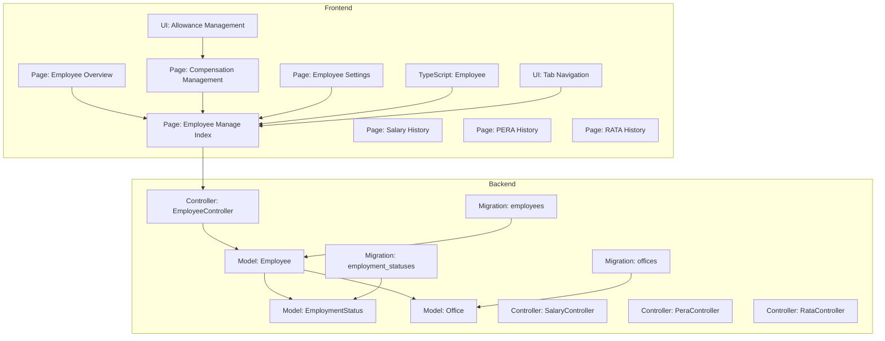
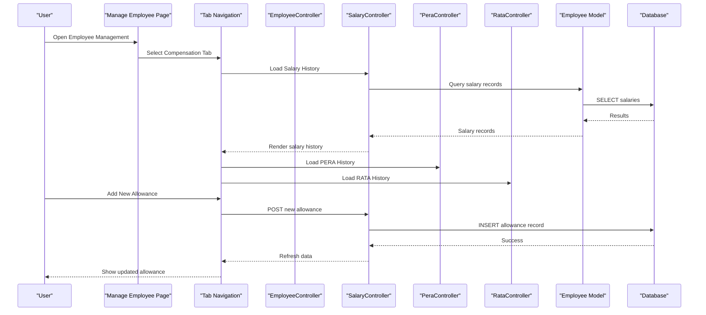
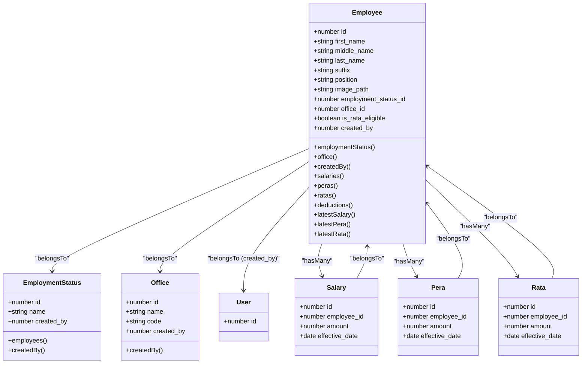
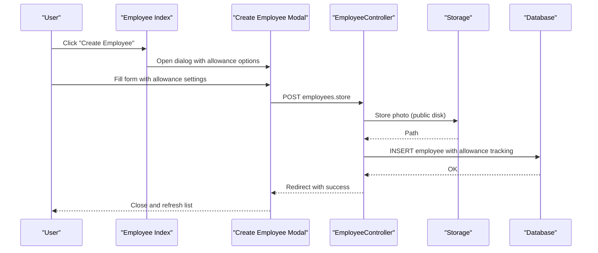
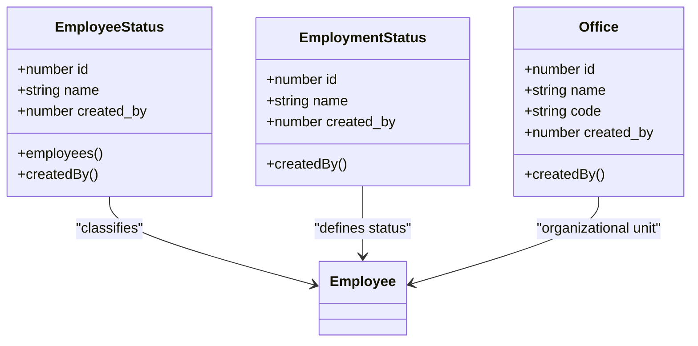
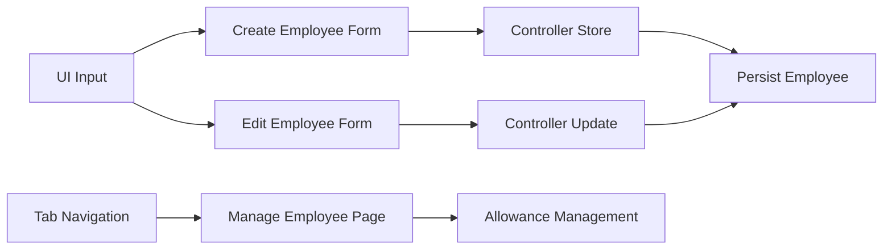
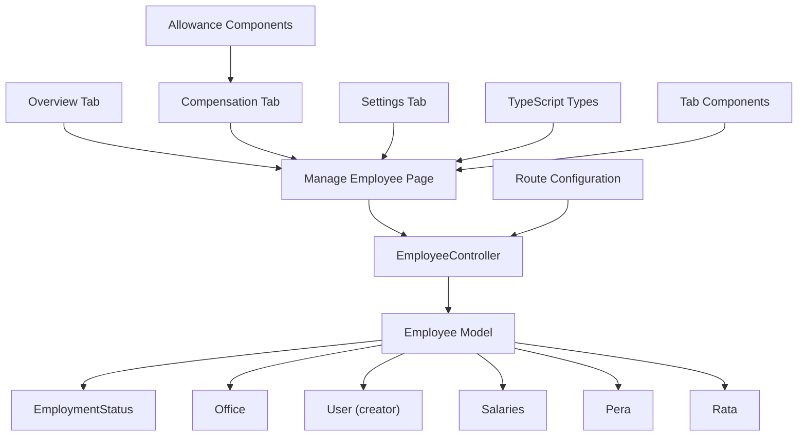

# Employee Management

<cite>
**Referenced Files in This Document**
- [Employee.php](file://app/Models/Employee.php)
- [EmployeeController.php](file://app/Http/Controllers/EmployeeController.php)
- [EmployeeStatus.php](file://app/Models/EmployeeStatus.php)
- [EmploymentStatus.php](file://app/Models/EmploymentStatus.php)
- [Office.php](file://app/Models/Office.php)
- [2026_03_19_022838_create_employees_table.php](file://database/migrations/2026_03_19_022838_create_employees_table.php)
- [2026_03_19_014107_create_employee_statuses_table.php](file://database/migrations/2026_03_19_014107_create_employee_statuses_table.php)
- [2026_03_19_014108_create_employment_statuses_table.php](file://database/migrations/2026_03_19_014108_create_employment_statuses_table.php)
- [2026_03_18_071422_create_offices_table.php](file://database/migrations/2026_03_18_071422_create_offices_table.php)
- [employee.d.ts](file://resources/js/types/employee.d.ts)
- [index.tsx](file://resources/js/pages/settings/Employee/index.tsx)
- [create.tsx](file://resources/js/pages/settings/Employee/create.tsx)
- [edit.tsx](file://resources/js/pages/settings/Employee/edit.tsx)
- [show.tsx](file://resources/js/pages/settings/Employee/show.tsx)
- [input.tsx](file://resources/js/components/ui/input.tsx)
- [manage/index.tsx](file://resources/js/pages/settings/Employee/manage/index.tsx)
- [manage/overview.tsx](file://resources/js/pages/settings/Employee/manage/overview.tsx)
- [manage/compensation.tsx](file://resources/js/pages/settings/Employee/manage/compensation.tsx)
- [manage/settings.tsx](file://resources/js/pages/settings/Employee/manage/settings.tsx)
- [routes/web.php](file://routes/web.php)
</cite>

## Update Summary
**Changes Made**
- Enhanced from basic employee display to comprehensive administrative management interface
- Added tabbed navigation system (Overview, Compensation, Reports, Settings)
- Implemented advanced allowance tracking (Salary, RATA, PERA) with separate management pages
- Integrated comprehensive employee profile management with real-time updates
- Added specialized allowance management interfaces with add dialogs and history tracking

## Table of Contents
1. [Introduction](#introduction)
2. [Project Structure](#project-structure)
3. [Core Components](#core-components)
4. [Architecture Overview](#architecture-overview)
5. [Detailed Component Analysis](#detailed-component-analysis)
6. [Administrative Management Interface](#administrative-management-interface)
7. [Allowance Management System](#allowance-management-system)
8. [Employee Profile Management](#employee-profile-management)
9. [Dependency Analysis](#dependency-analysis)
10. [Performance Considerations](#performance-considerations)
11. [Troubleshooting Guide](#troubleshooting-guide)
12. [Conclusion](#conclusion)
13. [Appendices](#appendices)

## Introduction
This document describes the complete employee lifecycle management system built with Laravel and Inertia.js. The system has evolved from basic employee display to a comprehensive administrative management interface featuring tabbed navigation, advanced allowance tracking, and detailed employee profile management. It covers employee creation, editing, viewing, and deletion, along with status tracking, employment status management, organizational hierarchy, and administrative controls. The enhanced system now provides specialized interfaces for salary, RATA, and PERA management with real-time updates and comprehensive reporting capabilities.

## Project Structure
The system follows a layered architecture with enhanced administrative capabilities:
- Backend: Laravel Eloquent models, controllers, and migrations define the domain and persistence layer
- Frontend: Inertia-driven React pages with tabbed navigation and specialized allowance management interfaces
- Assets: Images are stored via Laravel Storage under a public disk
- Routing: Comprehensive route structure supporting detailed allowance management

**Diagram sources**
- [Employee.php:10-104](file://app/Models/Employee.php#L10-L104)
- [EmployeeController.php:12-139](file://app/Http/Controllers/EmployeeController.php#L12-L139)
- [EmploymentStatus.php:9-32](file://app/Models/EmploymentStatus.php#L9-L32)
- [Office.php:9-33](file://app/Models/Office.php#L9-L33)
- [manage/index.tsx:1-117](file://resources/js/pages/settings/Employee/manage/index.tsx#L1-L117)
- [manage/overview.tsx:1-115](file://resources/js/pages/settings/Employee/manage/overview.tsx#L1-L115)
- [manage/compensation.tsx:1-398](file://resources/js/pages/settings/Employee/manage/compensation.tsx#L1-L398)
- [manage/settings.tsx:1-270](file://resources/js/pages/settings/Employee/manage/settings.tsx#L1-L270)

**Section sources**
- [Employee.php:10-104](file://app/Models/Employee.php#L10-L104)
- [EmployeeController.php:12-139](file://app/Http/Controllers/EmployeeController.php#L12-L139)
- [manage/index.tsx:1-117](file://resources/js/pages/settings/Employee/manage/index.tsx#L1-L117)

## Core Components
- Employee model encapsulates personal info, employment status, office assignment, creator attribution, and associations to payroll-related records with enhanced allowance tracking capabilities
- EmployeeController orchestrates listing, creating, updating, and rendering employee records with search and pagination, integrating with Inertia for SSR-like UX
- Enhanced administrative interface with tabbed navigation supporting Overview, Compensation, Reports, and Settings sections
- Advanced allowance management system with separate controllers and routes for Salary, RATA, and PERA
- Comprehensive employee profile management with real-time updates and specialized allowance configuration

Key responsibilities:
- Data modeling and relationships with allowance tracking
- Validation and persistence with enhanced allowance management
- Image storage and retrieval with profile management
- Search and pagination with administrative controls
- Tabbed interface navigation and real-time updates
- Specialized allowance management with history tracking

**Section sources**
- [Employee.php:10-104](file://app/Models/Employee.php#L10-L104)
- [EmployeeController.php:12-139](file://app/Http/Controllers/EmployeeController.php#L12-L139)
- [manage/index.tsx:1-117](file://resources/js/pages/settings/Employee/manage/index.tsx#L1-L117)
- [manage/compensation.tsx:1-398](file://resources/js/pages/settings/Employee/manage/compensation.tsx#L1-L398)
- [manage/settings.tsx:1-270](file://resources/js/pages/settings/Employee/manage/settings.tsx#L1-L270)

## Architecture Overview
The system uses a classic MVC pattern with Eloquent ORM and Inertia for full-stack development, enhanced with specialized allowance management:
- Controllers receive requests and render Inertia responses with tabbed navigation
- Models define relationships and business behaviors with allowance associations
- Migrations define relational schemas with allowance tracking tables
- Pages and components handle user interactions with specialized allowance management interfaces
- Routes support comprehensive allowance management with dedicated endpoints

**Diagram sources**
- [manage/index.tsx:85-112](file://resources/js/pages/settings/Employee/manage/index.tsx#L85-L112)
- [manage/compensation.tsx:229-397](file://resources/js/pages/settings/Employee/manage/compensation.tsx#L229-L397)
- [routes/web.php:31-53](file://routes/web.php#L31-L53)
- [EmployeeController.php:12-139](file://app/Http/Controllers/EmployeeController.php#L12-L139)

## Detailed Component Analysis

### Data Models and Relationships
The Employee model defines attributes, casts, and relationships to EmploymentStatus, Office, and User (creator). Enhanced with allowance tracking, it exposes associations to Salary, Pera, Rata, and EmployeeDeduction, with helpers to fetch latest records by effective date. EmploymentStatus and Office models include soft deletes and creator attribution hooks.

**Diagram sources**
- [Employee.php:10-104](file://app/Models/Employee.php#L10-L104)
- [EmploymentStatus.php:9-32](file://app/Models/EmploymentStatus.php#L9-L32)
- [Office.php:9-33](file://app/Models/Office.php#L9-L33)

**Section sources**
- [Employee.php:10-104](file://app/Models/Employee.php#L10-L104)
- [EmploymentStatus.php:9-32](file://app/Models/EmploymentStatus.php#L9-L32)
- [Office.php:9-33](file://app/Models/Office.php#L9-L33)
- [2026_03_19_022838_create_employees_table.php:14-27](file://database/migrations/2026_03_19_022838_create_employees_table.php#L14-L27)
- [2026_03_19_014108_create_employment_statuses_table.php:14-20](file://database/migrations/2026_03_19_014108_create_employment_statuses_table.php#L14-L20)
- [2026_03_18_071422_create_offices_table.php:14-21](file://database/migrations/2026_03_18_071422_create_offices_table.php#L14-L21)

### Employee Lifecycle: Creation, Editing, Viewing, Deletion
- Creation: The index page opens a modal to create an employee with comprehensive form fields including allowance eligibility. The form collects personal info, suffix, position, office, employment status, and optional photo. On submit, the controller validates, stores the photo, persists the employee with allowance tracking enabled, and redirects with a success message.
- Editing: The edit page preloads current values, supports photo preview and removal, and submits updates via a PUT request. Enhanced validation includes allowance eligibility configuration.
- Viewing: The enhanced show dialog displays employee details including department code, status, and comprehensive allowance information with real-time calculations.
- Deletion: The list row includes a delete action with proper cleanup of associated allowance records and images.

**Diagram sources**
- [index.tsx:33-169](file://resources/js/pages/settings/Employee/index.tsx#L33-L169)
- [create.tsx:37-304](file://resources/js/pages/settings/Employee/create.tsx#L37-L304)
- [EmployeeController.php:54-87](file://app/Http/Controllers/EmployeeController.php#L54-L87)

**Section sources**
- [EmployeeController.php:54-139](file://app/Http/Controllers/EmployeeController.php#L54-L139)
- [create.tsx:37-304](file://resources/js/pages/settings/Employee/create.tsx#L37-L304)
- [edit.tsx:35-362](file://resources/js/pages/settings/Employee/edit.tsx#L35-L362)
- [show.tsx:19-112](file://resources/js/pages/settings/Employee/show.tsx#L19-L112)
- [index.tsx:33-169](file://resources/js/pages/settings/Employee/index.tsx#L33-L169)

### Search, Filtering, and Reporting
- Search: The index endpoint supports a search query parameter that matches across first, middle, last names, and suffix. Results are paginated and ordered by last name.
- Filtering: The index page renders a search input and triggers a GET request with query strings to preserve state and scroll.
- Reporting: The enhanced system now includes dedicated reporting capabilities accessible through the Reports tab in the administrative interface.

**Diagram sources**
- [EmployeeController.php:14-41](file://app/Http/Controllers/EmployeeController.php#L14-L41)
- [index.tsx:33-169](file://resources/js/pages/settings/Employee/index.tsx#L33-L169)

**Section sources**
- [EmployeeController.php:14-41](file://app/Http/Controllers/EmployeeController.php#L14-L41)
- [index.tsx:33-169](file://resources/js/pages/settings/Employee/index.tsx#L33-L169)

### Administrative Controls and Status Management
- Employment status management: EmploymentStatus and EmployeeStatus models support soft deletes and creator attribution. They are used to classify employees and provide administrative controls for status definitions.
- Office hierarchy: Office model defines organizational units with code and creator attribution, linked to employees via foreign keys.
- Creator attribution: Models capture the authenticated user ID during creation via model boot hooks.

**Diagram sources**
- [EmployeeStatus.php:9-37](file://app/Models/EmployeeStatus.php#L9-L37)
- [EmploymentStatus.php:9-32](file://app/Models/EmploymentStatus.php#L9-L32)
- [Office.php:9-33](file://app/Models/Office.php#L9-L33)

**Section sources**
- [EmployeeStatus.php:9-37](file://app/Models/EmployeeStatus.php#L9-L37)
- [EmploymentStatus.php:9-32](file://app/Models/EmploymentStatus.php#L9-L32)
- [Office.php:9-33](file://app/Models/Office.php#L9-L33)

### User Interface Components and Form Validation
- Input component: Provides standardized styling and accessibility for form inputs.
- Create/Edit forms: Collect required and optional fields, enforce image constraints, and support photo preview/removal with enhanced allowance configuration.
- Type safety: TypeScript types define the shape of Employee and related entities, ensuring consistent frontend-backend contracts.
- Tabbed navigation: Enhanced interface with Overview, Compensation, Reports, and Settings tabs for comprehensive employee management.

**Diagram sources**
- [input.tsx:5-17](file://resources/js/components/ui/input.tsx#L5-L17)
- [create.tsx:37-304](file://resources/js/pages/settings/Employee/create.tsx#L37-L304)
- [edit.tsx:35-362](file://resources/js/pages/settings/Employee/edit.tsx#L35-L362)
- [manage/index.tsx:85-112](file://resources/js/pages/settings/Employee/manage/index.tsx#L85-L112)
- [EmployeeController.php:54-139](file://app/Http/Controllers/EmployeeController.php#L54-L139)

**Section sources**
- [input.tsx:5-17](file://resources/js/components/ui/input.tsx#L5-L17)
- [create.tsx:37-304](file://resources/js/pages/settings/Employee/create.tsx#L37-L304)
- [edit.tsx:35-362](file://resources/js/pages/settings/Employee/edit.tsx#L35-L362)
- [employee.d.ts:8-43](file://resources/js/types/employee.d.ts#L8-L43)
- [manage/index.tsx:85-112](file://resources/js/pages/settings/Employee/manage/index.tsx#L85-L112)

## Administrative Management Interface
The enhanced administrative interface provides comprehensive employee management through a sophisticated tabbed navigation system:

### Tabbed Navigation Structure
The interface features four main tabs providing different aspects of employee management:
- **Overview Tab**: Displays consolidated employee information including current salary, allowance status, and compensation summary
- **Compensation Tab**: Manages salary, RATA, and PERA allowances with detailed history tracking
- **Reports Tab**: Provides comprehensive reporting capabilities and analytics
- **Settings Tab**: Handles employee profile configuration and administrative settings

### Overview Tab Implementation
The Overview tab presents a comprehensive dashboard showing:
- Monthly salary information with currency formatting
- Allowance status (RATA/PERA eligibility)
- Employment status and office assignment
- Detailed compensation summary with total monthly earnings calculation
- Real-time allowance value displays with conditional formatting

### Compensation Tab Features
The Compensation tab offers specialized management for each allowance type:
- **Salary Management**: Complete salary history with effective dates and status indicators
- **RATA Management**: Representation and Transportation Allowance with eligibility-based access
- **PERA Management**: Personnel Economic Relief Allowance with dedicated tracking
- Real-time calculations and currency formatting
- Interactive dialogs for adding new allowance records

### Settings Tab Functionality
The Settings tab provides comprehensive employee profile management:
- Photo upload with preview and removal capabilities
- Personal information editing (names, suffix, position)
- Office assignment with combobox selection
- Employment status configuration
- RATA eligibility toggle for administrative control

**Section sources**
- [manage/index.tsx:85-112](file://resources/js/pages/settings/Employee/manage/index.tsx#L85-L112)
- [manage/overview.tsx:19-114](file://resources/js/pages/settings/Employee/manage/overview.tsx#L19-L114)
- [manage/compensation.tsx:229-397](file://resources/js/pages/settings/Employee/manage/compensation.tsx#L229-L397)
- [manage/settings.tsx:22-269](file://resources/js/pages/settings/Employee/manage/settings.tsx#L22-L269)

## Allowance Management System
The system implements a comprehensive allowance management system with specialized controllers and interfaces for each allowance type:

### Salary Management
- **History Tracking**: Complete salary history with effective dates and status indicators
- **Real-time Updates**: Automatic recalculation of total compensation
- **Add New Records**: Dialog-based interface for adding new salary records
- **Status Management**: Clear indication of current vs previous salary records

### RATA Management
- **Eligibility Control**: Toggle-based system for RATA eligibility
- **Conditional Access**: RATA management only available for eligible employees
- **Allowance Tracking**: Dedicated interface for RATA allowance records
- **Historical Records**: Complete RATA history with effective dates

### PERA Management
- **Standard Allowance**: Fixed PERA allowance tracking
- **Historical Records**: Complete PERA history with effective dates
- **Integration**: Seamless integration with overall compensation calculation

### Allowance Calculation Engine
The system automatically calculates total monthly compensation by summing:
- Base salary amount
- PERA allowance (if applicable)
- RATA allowance (if eligible)

**Section sources**
- [manage/compensation.tsx:28-397](file://resources/js/pages/settings/Employee/manage/compensation.tsx#L28-L397)
- [manage/overview.tsx:74-111](file://resources/js/pages/settings/Employee/manage/overview.tsx#L74-L111)
- [routes/web.php:31-53](file://routes/web.php#L31-L53)

## Employee Profile Management
Enhanced employee profile management provides comprehensive administrative control:

### Profile Information Management
- **Personal Details**: Full name management with suffix options
- **Professional Information**: Position and office assignment
- **Photo Management**: Upload, preview, and removal capabilities
- **Status Configuration**: Employment status and RATA eligibility

### Real-time Updates
- **Live Currency Formatting**: Automatic PHP currency formatting
- **Dynamic Calculations**: Real-time compensation summary updates
- **Status Indicators**: Visual indicators for current vs previous records
- **Eligibility Updates**: Immediate reflection of RATA eligibility changes

### Administrative Controls
- **Bulk Operations**: Administrative interface for mass updates
- **Audit Trail**: Complete history of profile changes
- **Validation**: Comprehensive form validation with error handling
- **Responsive Design**: Mobile-friendly interface for administrative tasks

**Section sources**
- [manage/settings.tsx:22-269](file://resources/js/pages/settings/Employee/manage/settings.tsx#L22-L269)
- [manage/overview.tsx:9-17](file://resources/js/pages/settings/Employee/manage/overview.tsx#L9-L17)
- [employee.d.ts:8-43](file://resources/js/types/employee.d.ts#L8-L43)

## Dependency Analysis
- Controllers depend on models and Inertia for rendering with enhanced allowance management
- Models depend on Eloquent relationships and Storage for images with allowance associations
- Pages depend on TypeScript types and UI components with specialized allowance interfaces
- Migrations define referential integrity and cascading deletes for allowance records
- Routes support comprehensive allowance management with dedicated endpoints

**Diagram sources**
- [EmployeeController.php:12-139](file://app/Http/Controllers/EmployeeController.php#L12-L139)
- [Employee.php:10-104](file://app/Models/Employee.php#L10-L104)
- [manage/index.tsx:1-117](file://resources/js/pages/settings/Employee/manage/index.tsx#L1-L117)
- [routes/web.php:31-95](file://routes/web.php#L31-L95)

**Section sources**
- [EmployeeController.php:12-139](file://app/Http/Controllers/EmployeeController.php#L12-L139)
- [Employee.php:10-104](file://app/Models/Employee.php#L10-L104)
- [manage/index.tsx:1-117](file://resources/js/pages/settings/Employee/manage/index.tsx#L1-L117)
- [routes/web.php:31-95](file://routes/web.php#L31-L95)

## Performance Considerations
- Pagination: The index uses pagination to limit result sets and improve responsiveness
- Eager loading: The controller eager-loads related employment status, office, and allowance data to avoid N+1 queries
- Image storage: Photos are stored on a public disk; consider CDN integration for scalability
- Validation: Client-side formatting prevents invalid numeric inputs but server-side validation remains the authoritative check
- Tabbed Interface: Efficient lazy loading of tab content to minimize initial page load
- Real-time Updates: Optimized data fetching for allowance histories and compensation summaries

## Troubleshooting Guide
- Photo upload issues: Ensure the public disk is writable and the storage symlink is configured. Verify MIME types and size limits in the controller.
- Search not returning results: Confirm the search parameter is passed as a query string and that LIKE conditions match the intended fields.
- Relationship errors: Verify foreign key constraints and that related records (employment status, office) exist before creating or updating employees.
- Soft deletes: If records appear missing, check for soft-deleted entries and restore or purge as appropriate.
- Allowance management issues: Verify allowance eligibility flags and ensure proper routing for allowance-specific endpoints.
- Tab navigation problems: Check route configurations and ensure proper tab activation states.

**Section sources**
- [EmployeeController.php:54-139](file://app/Http/Controllers/EmployeeController.php#L54-L139)
- [2026_03_19_022838_create_employees_table.php:22-24](file://database/migrations/2026_03_19_022838_create_employees_table.php#L22-L24)
- [routes/web.php:31-95](file://routes/web.php#L31-L95)

## Conclusion
The enhanced employee management system provides a comprehensive administrative interface for managing employee lifecycles with advanced allowance tracking capabilities. The system now features sophisticated tabbed navigation, specialized allowance management interfaces, and comprehensive employee profile management. The integration of Salary, RATA, and PERA management systems with real-time calculations and historical tracking makes it a complete solution for modern HR administration. The enhanced interface supports both operational efficiency and administrative oversight with its comprehensive reporting and real-time update capabilities.

## Appendices

### Data Model Definitions
- Employee: Personal info, position, image path, employment status, office, creator, timestamps, soft deletes, and allowance tracking
- EmploymentStatus: Name, creator, timestamps, soft deletes, and employee classifications
- Office: Name, code, creator, timestamps, soft deletes, and organizational hierarchy
- Allowance Models: Separate models for Salary, Pera, and Rata with effective date tracking

**Section sources**
- [2026_03_19_022838_create_employees_table.php:14-27](file://database/migrations/2026_03_19_022838_create_employees_table.php#L14-L27)
- [2026_03_19_014108_create_employment_statuses_table.php:14-20](file://database/migrations/2026_03_19_014108_create_employment_statuses_table.php#L14-L20)
- [2026_03_18_071422_create_offices_table.php:14-21](file://database/migrations/2026_03_18_071422_create_offices_table.php#L14-L21)

### Route Configuration
- Employee management routes: Comprehensive CRUD operations with show and edit endpoints
- Allowance management routes: Dedicated endpoints for salary, pera, and rata management
- Administrative routes: Settings and configuration endpoints for allowance types
- Tab navigation routes: Specific routes for each management interface tab

**Section sources**
- [routes/web.php:31-95](file://routes/web.php#L31-L95)