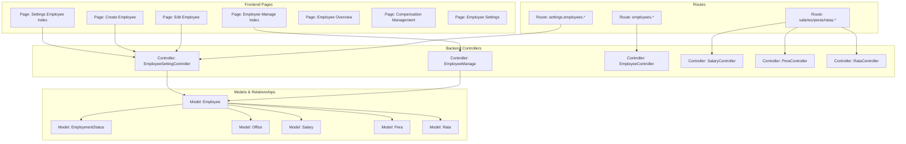
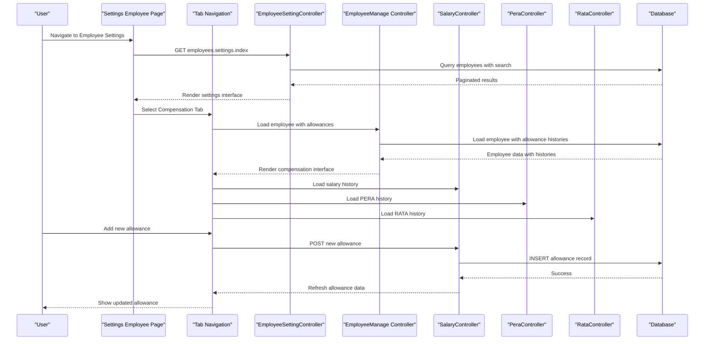
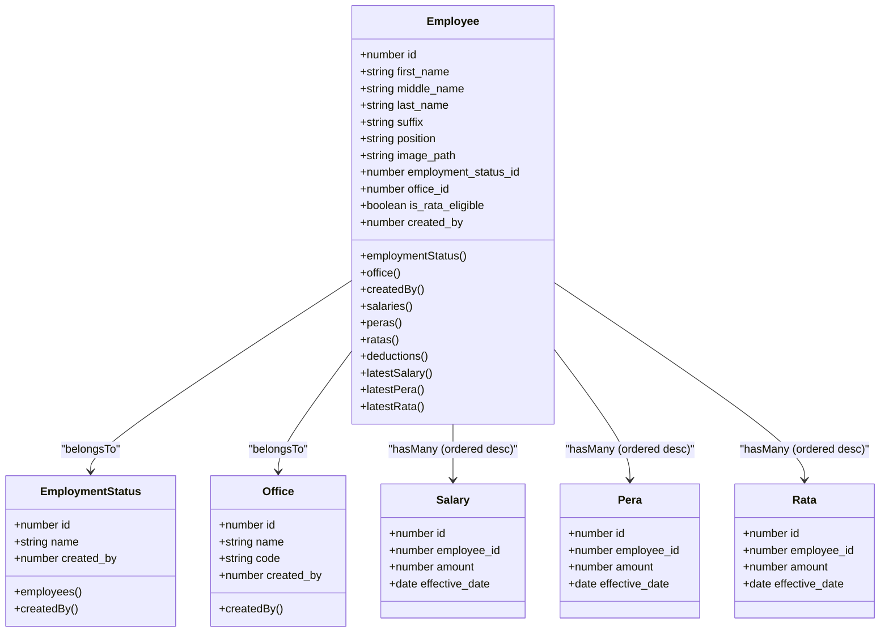
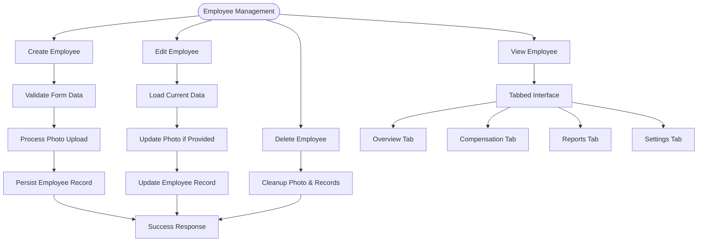
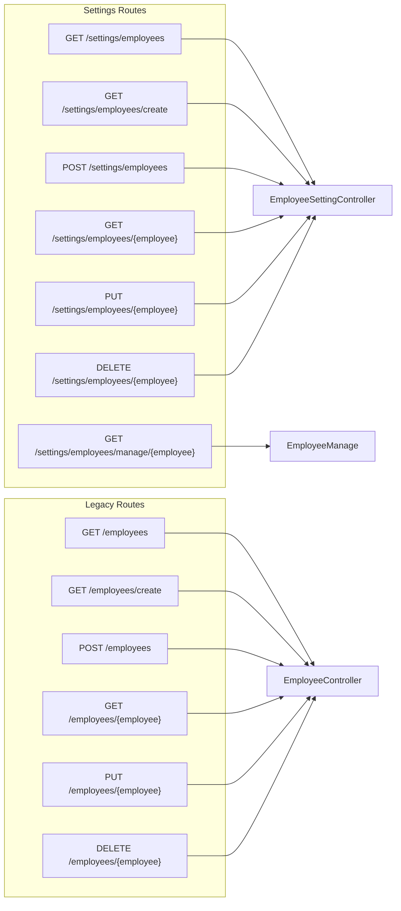
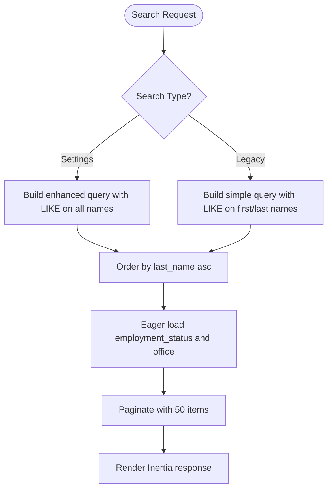
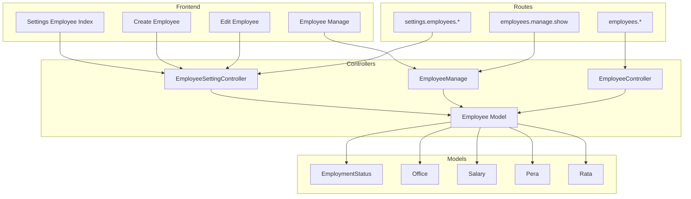

# Employee Management

<cite>
**Referenced Files in This Document**
- [Employee.php](file://app/Models/Employee.php)
- [EmployeeSettingController.php](file://app/Http/Controllers/EmployeeSettingController.php)
- [EmployeeController.php](file://app/Http/Controllers/EmployeeController.php)
- [EmployeeManage.php](file://app/Http/Controllers/EmployeeManage.php)
- [EmployeeStatus.php](file://app/Models/EmployeeStatus.php)
- [EmploymentStatus.php](file://app/Models/EmploymentStatus.php)
- [Office.php](file://app/Models/Office.php)
- [2026_03_19_022838_create_employees_table.php](file://database/migrations/2026_03_19_022838_create_employees_table.php)
- [2026_03_19_014107_create_employee_statuses_table.php](file://database/migrations/2026_03_19_014107_create_employee_statuses_table.php)
- [2026_03_19_014108_create_employment_statuses_table.php](file://database/migrations/2026_03_19_014108_create_employment_statuses_table.php)
- [2026_03_18_071422_create_offices_table.php](file://database/migrations/2026_03_18_071422_create_offices_table.php)
- [employee.d.ts](file://resources/js/types/employee.d.ts)
- [index.tsx](file://resources/js/pages/settings/Employee/index.tsx)
- [create.tsx](file://resources/js/pages/settings/Employee/create.tsx)
- [edit.tsx](file://resources/js/pages/settings/Employee/edit.tsx)
- [show.tsx](file://resources/js/pages/settings/Employee/show.tsx)
- [manage/index.tsx](file://resources/js/pages/settings/Employee/manage/index.tsx)
- [manage/overview.tsx](file://resources/js/pages/settings/Employee/manage/overview.tsx)
- [manage/compensation.tsx](file://resources/js/pages/settings/Employee/manage/compensation.tsx)
- [manage/settings.tsx](file://resources/js/pages/settings/Employee/manage/settings.tsx)
- [routes/web.php](file://routes/web.php)
</cite>

## Update Summary
**Changes Made**
- **Routing Restructuring**: Employee management routes now use `EmployeeSettingController` instead of `EmployeeController`
- **New EmployeeSettingController**: Comprehensive CRUD functionality with enhanced allowance tracking
- **Enhanced Administrative Interface**: New tabbed layout with Overview, Compensation, Reports, and Settings sections
- **Advanced Allowance Management**: Separate controllers and routes for Salary, RATA, and PERA with real-time updates
- **Employee Management Controller**: New `EmployeeManage` controller for detailed employee management interface

## Table of Contents
1. [Introduction](#introduction)
2. [Project Structure](#project-structure)
3. [Core Components](#core-components)
4. [Architecture Overview](#architecture-overview)
5. [Detailed Component Analysis](#detailed-component-analysis)
6. [Administrative Management Interface](#administrative-management-interface)
7. [Allowance Management System](#allowance-management-system)
8. [Employee Profile Management](#employee-profile-management)
9. [Dependency Analysis](#dependency-analysis)
10. [Performance Considerations](#performance-considerations)
11. [Troubleshooting Guide](#troubleshooting-guide)
12. [Conclusion](#conclusion)
13. [Appendices](#appendices)

## Introduction
This document describes the complete employee lifecycle management system built with Laravel and Inertia.js. The system has evolved from basic employee display to a comprehensive administrative management interface featuring tabbed navigation, advanced allowance tracking, and detailed employee profile management. The recent restructuring moved employee management functionality from the legacy `EmployeeController` to the new `EmployeeSettingController`, introducing enhanced CRUD operations and a sophisticated tabbed interface for comprehensive employee administration.

The system now provides specialized interfaces for salary, RATA, and PERA management with real-time updates, comprehensive reporting capabilities, and seamless integration with the allowance management system. The enhanced interface supports both operational efficiency and administrative oversight with its comprehensive allowance tracking and real-time calculation capabilities.

## Project Structure
The system follows a layered architecture with enhanced administrative capabilities and comprehensive routing structure:
- **Backend**: Laravel Eloquent models, controllers, and migrations define the domain and persistence layer
- **Frontend**: Inertia-driven React pages with tabbed navigation and specialized allowance management interfaces
- **Assets**: Images are stored via Laravel Storage under a public disk
- **Routing**: Comprehensive route structure supporting detailed allowance management and administrative controls

**Diagram sources**
- [EmployeeSettingController.php:12-139](file://app/Http/Controllers/EmployeeSettingController.php#L12-L139)
- [EmployeeManage.php:11-42](file://app/Http/Controllers/EmployeeManage.php#L11-L42)
- [EmployeeController.php:12-132](file://app/Http/Controllers/EmployeeController.php#L12-L132)
- [Employee.php:10-104](file://app/Models/Employee.php#L10-L104)
- [routes/web.php:72-107](file://routes/web.php#L72-L107)

**Section sources**
- [EmployeeSettingController.php:12-139](file://app/Http/Controllers/EmployeeSettingController.php#L12-L139)
- [EmployeeManage.php:11-42](file://app/Http/Controllers/EmployeeManage.php#L11-L42)
- [routes/web.php:72-107](file://routes/web.php#L72-L107)

## Core Components
The system now features three distinct controller layers with specialized responsibilities:

### EmployeeSettingController
**New Primary Controller** handling comprehensive employee management with full CRUD operations:
- **Index**: Enhanced search with LIKE operators across first, middle, last names, and suffix
- **Create/Store**: Complete employee creation with photo upload, allowance eligibility, and validation
- **Show/Update**: Detailed employee editing with photo management and allowance configuration
- **Destroy**: Safe deletion with image cleanup and cascade handling

### EmployeeManage Controller  
**New Management Controller** providing detailed employee administration:
- **Show**: Comprehensive employee data loading with allowance histories and status information
- **Eager Loading**: Optimized queries with allowance records and status relationships
- **Real-time Data**: Latest allowance amounts and eligibility status

### Legacy EmployeeController
**Maintained for Basic Display** functionality:
- **Index**: Simplified employee listing with basic search
- **Limited Scope**: Focused on basic display rather than comprehensive management

Key responsibilities:
- **Data Modeling**: Enhanced allowance tracking with salary, PERA, and RATA associations
- **Validation**: Comprehensive form validation with image constraints
- **Image Management**: Secure photo storage and retrieval with cleanup
- **Tabbed Interface**: Sophisticated navigation with Overview, Compensation, Reports, Settings
- **Allowance Management**: Real-time calculations and historical tracking
- **Search & Pagination**: Advanced filtering with query string preservation

**Section sources**
- [EmployeeSettingController.php:12-139](file://app/Http/Controllers/EmployeeSettingController.php#L12-L139)
- [EmployeeManage.php:11-42](file://app/Http/Controllers/EmployeeManage.php#L11-L42)
- [EmployeeController.php:12-132](file://app/Http/Controllers/EmployeeController.php#L12-L132)

## Architecture Overview
The system uses a multi-controller architecture with clear separation of concerns and enhanced routing structure:

**Diagram sources**
- [routes/web.php:97-107](file://routes/web.php#L97-L107)
- [EmployeeSettingController.php:14-41](file://app/Http/Controllers/EmployeeSettingController.php#L14-L41)
- [EmployeeManage.php:13-40](file://app/Http/Controllers/EmployeeManage.php#L13-L40)
- [manage/index.tsx:85-112](file://resources/js/pages/settings/Employee/manage/index.tsx#L85-L112)

## Detailed Component Analysis

### Data Models and Relationships
The Employee model maintains its comprehensive structure with enhanced allowance tracking capabilities:

**Diagram sources**
- [Employee.php:10-104](file://app/Models/Employee.php#L10-L104)
- [EmploymentStatus.php:9-32](file://app/Models/EmploymentStatus.php#L9-L32)
- [Office.php:9-33](file://app/Models/Office.php#L9-L33)

**Section sources**
- [Employee.php:10-104](file://app/Models/Employee.php#L10-L104)
- [routes/web.php:97-107](file://routes/web.php#L97-L107)

### Enhanced Employee Lifecycle Management
The new `EmployeeSettingController` provides comprehensive CRUD operations with enhanced functionality:

#### Creation Process
- **Modal Interface**: Opens comprehensive create dialog with allowance configuration
- **Photo Upload**: Validates and stores images on public disk with cleanup on update/delete
- **Allowance Tracking**: Creates employee with allowance eligibility flags
- **Validation**: Comprehensive form validation with image constraints

#### Editing Process  
- **Preloaded Data**: Shows current values with photo preview and removal option
- **Photo Management**: Supports upload, preview, and removal with automatic cleanup
- **Allowance Configuration**: Real-time eligibility toggling for RATA and PERA

#### Management Interface
- **Tabbed Navigation**: Overview, Compensation, Reports, Settings tabs
- **Real-time Updates**: Live currency formatting and allowance calculations
- **Status Indicators**: Visual indicators for current vs previous records
- **Eligibility Management**: Conditional access to allowance management based on RATA status

**Diagram sources**
- [EmployeeSettingController.php:54-137](file://app/Http/Controllers/EmployeeSettingController.php#L54-L137)
- [manage/index.tsx:85-112](file://resources/js/pages/settings/Employee/manage/index.tsx#L85-L112)

**Section sources**
- [EmployeeSettingController.php:54-137](file://app/Http/Controllers/EmployeeSettingController.php#L54-L137)
- [create.tsx:37-304](file://resources/js/pages/settings/Employee/create.tsx#L37-L304)
- [edit.tsx:35-362](file://resources/js/pages/settings/Employee/edit.tsx#L35-L362)
- [manage/index.tsx:85-112](file://resources/js/pages/settings/Employee/manage/index.tsx#L85-L112)

### Routing Restructuring
The routing system has been completely restructured to support the new controller architecture:

**Diagram sources**
- [routes/web.php:72-107](file://routes/web.php#L72-L107)

**Section sources**
- [routes/web.php:72-107](file://routes/web.php#L72-L107)

### Search, Filtering, and Reporting
The enhanced search functionality now supports comprehensive employee discovery:

#### Settings Employee Search
- **Enhanced Search**: LIKE operators across first_name, middle_name, last_name, and suffix
- **Pagination**: 50 items per page with query string preservation
- **Relationship Loading**: Eager loading of employment_status and office for performance

#### Legacy Employee Search  
- **Basic Search**: LIKE operators across first_name and last_name only
- **Lightweight**: 10 items per page for basic display functionality

**Diagram sources**
- [EmployeeSettingController.php:18-28](file://app/Http/Controllers/EmployeeSettingController.php#L18-L28)
- [EmployeeController.php:19-26](file://app/Http/Controllers/EmployeeController.php#L19-L26)

**Section sources**
- [EmployeeSettingController.php:18-28](file://app/Http/Controllers/EmployeeSettingController.php#L18-L28)
- [EmployeeController.php:19-26](file://app/Http/Controllers/EmployeeController.php#L19-L26)

### Administrative Controls and Status Management
The system maintains comprehensive administrative capabilities:

#### Employment Status Management
- **Soft Deletes**: EmploymentStatus and EmployeeStatus models support soft deletes
- **Creator Attribution**: Models capture authenticated user ID during creation
- **Classification**: EmploymentStatus classifies employees with administrative controls

#### Office Hierarchy
- **Organizational Units**: Office model defines departments with code and creator attribution
- **Foreign Key Relationships**: Links employees to organizational structure
- **Hierarchical Support**: Foundation for complex organizational structures

**Section sources**
- [EmployeeStatus.php:9-37](file://app/Models/EmployeeStatus.php#L9-L37)
- [EmploymentStatus.php:9-32](file://app/Models/EmploymentStatus.php#L9-L32)
- [Office.php:9-33](file://app/Models/Office.php#L9-L33)

### User Interface Components and Form Validation
The enhanced interface provides sophisticated administrative controls:

#### Tabbed Navigation System
- **Overview Tab**: Consolidated employee information with allowance status
- **Compensation Tab**: Detailed allowance management with history tracking
- **Reports Tab**: Comprehensive reporting capabilities
- **Settings Tab**: Profile configuration and administrative controls

#### Enhanced Form Components
- **Photo Management**: Upload, preview, and removal with validation
- **Combobox Selection**: Custom combobox for office selection with search
- **Switch Controls**: RATA eligibility toggles with real-time feedback
- **Real-time Formatting**: Currency formatting and validation

#### Type Safety and Contracts
- **TypeScript Types**: Strong typing for Employee and related entities
- **Form Contracts**: Strict validation for all form submissions
- **Error Handling**: Comprehensive error display and recovery

**Section sources**
- [manage/index.tsx:85-112](file://resources/js/pages/settings/Employee/manage/index.tsx#L85-L112)
- [manage/overview.tsx:19-114](file://resources/js/pages/settings/Employee/manage/overview.tsx#L19-L114)
- [manage/compensation.tsx:229-397](file://resources/js/pages/settings/Employee/manage/compensation.tsx#L229-L397)
- [employee.d.ts:8-43](file://resources/js/types/employee.d.ts#L8-L43)

## Administrative Management Interface
The new administrative interface provides comprehensive employee management through a sophisticated tabbed navigation system:

### Tabbed Navigation Structure
The interface features four main tabs providing different aspects of employee management:
- **Overview Tab**: Displays consolidated employee information including current salary, allowance status, and compensation summary
- **Compensation Tab**: Manages salary, RATA, and PERA allowances with detailed history tracking
- **Reports Tab**: Provides comprehensive reporting capabilities and analytics  
- **Settings Tab**: Handles employee profile configuration and administrative settings

### Overview Tab Implementation
The Overview tab presents a comprehensive dashboard showing:
- Monthly salary information with currency formatting
- Allowance status (RATA/PERA eligibility) with visual indicators
- Employment status and office assignment
- Detailed compensation summary with total monthly earnings calculation
- Real-time allowance value displays with conditional formatting

### Compensation Tab Features
The Compensation tab offers specialized management for each allowance type:
- **Salary Management**: Complete salary history with effective dates and status indicators
- **RATA Management**: Representation and Transportation Allowance with eligibility-based access
- **PERA Management**: Personnel Economic Relief Allowance with dedicated tracking
- Real-time calculations and currency formatting
- Interactive dialogs for adding new allowance records

### Settings Tab Functionality
The Settings tab provides comprehensive employee profile management:
- Photo upload with preview and removal capabilities
- Personal information editing (names, suffix, position)
- Office assignment with combobox selection
- Employment status configuration
- RATA eligibility toggle for administrative control

**Section sources**
- [manage/index.tsx:85-112](file://resources/js/pages/settings/Employee/manage/index.tsx#L85-L112)
- [manage/overview.tsx:19-114](file://resources/js/pages/settings/Employee/manage/overview.tsx#L19-L114)
- [manage/compensation.tsx:229-397](file://resources/js/pages/settings/Employee/manage/compensation.tsx#L229-L397)
- [manage/settings.tsx:22-269](file://resources/js/pages/settings/Employee/manage/settings.tsx#L22-L269)

## Allowance Management System
The system implements a comprehensive allowance management system with specialized controllers and interfaces for each allowance type:

### Salary Management
- **History Tracking**: Complete salary history with effective dates and status indicators
- **Real-time Updates**: Automatic recalculation of total compensation
- **Add New Records**: Dialog-based interface for adding new salary records
- **Status Management**: Clear indication of current vs previous salary records

### RATA Management
- **Eligibility Control**: Toggle-based system for RATA eligibility
- **Conditional Access**: RATA management only available for eligible employees
- **Allowance Tracking**: Dedicated interface for RATA allowance records
- **Historical Records**: Complete RATA history with effective dates

### PERA Management
- **Standard Allowance**: Fixed PERA allowance tracking
- **Historical Records**: Complete PERA history with effective dates
- **Integration**: Seamless integration with overall compensation calculation

### Allowance Calculation Engine
The system automatically calculates total monthly compensation by summing:
- Base salary amount
- PERA allowance (if applicable)
- RATA allowance (if eligible)

**Section sources**
- [manage/compensation.tsx:28-397](file://resources/js/pages/settings/Employee/manage/compensation.tsx#L28-L397)
- [manage/overview.tsx:74-111](file://resources/js/pages/settings/Employee/manage/overview.tsx#L74-L111)
- [routes/web.php:31-54](file://routes/web.php#L31-L54)

## Employee Profile Management
Enhanced employee profile management provides comprehensive administrative control:

### Profile Information Management
- **Personal Details**: Full name management with suffix options
- **Professional Information**: Position and office assignment
- **Photo Management**: Upload, preview, and removal capabilities
- **Status Configuration**: Employment status and RATA eligibility

### Real-time Updates
- **Live Currency Formatting**: Automatic PHP currency formatting
- **Dynamic Calculations**: Real-time compensation summary updates
- **Status Indicators**: Visual indicators for current vs previous records
- **Eligibility Updates**: Immediate reflection of RATA eligibility changes

### Administrative Controls
- **Bulk Operations**: Administrative interface for mass updates
- **Audit Trail**: Complete history of profile changes
- **Validation**: Comprehensive form validation with error handling
- **Responsive Design**: Mobile-friendly interface for administrative tasks

**Section sources**
- [manage/settings.tsx:22-269](file://resources/js/pages/settings/Employee/manage/settings.tsx#L22-L269)
- [manage/overview.tsx:9-17](file://resources/js/pages/settings/Employee/manage/overview.tsx#L9-L17)
- [employee.d.ts:8-43](file://resources/js/types/employee.d.ts#L8-L43)

## Dependency Analysis
The system now features a multi-controller architecture with clear separation of concerns:

**Diagram sources**
- [EmployeeSettingController.php:12-139](file://app/Http/Controllers/EmployeeSettingController.php#L12-L139)
- [EmployeeManage.php:11-42](file://app/Http/Controllers/EmployeeManage.php#L11-L42)
- [EmployeeController.php:12-132](file://app/Http/Controllers/EmployeeController.php#L12-L132)
- [routes/web.php:72-107](file://routes/web.php#L72-L107)

**Section sources**
- [EmployeeSettingController.php:12-139](file://app/Http/Controllers/EmployeeSettingController.php#L12-L139)
- [EmployeeManage.php:11-42](file://app/Http/Controllers/EmployeeManage.php#L11-L42)
- [routes/web.php:72-107](file://routes/web.php#L72-L107)

## Performance Considerations
- **Pagination**: Settings interface uses 50 items per page, legacy uses 10 for lightweight display
- **Eager Loading**: Controllers eager-load related data to prevent N+1 queries
- **Image Storage**: Photos stored on public disk with automatic cleanup on updates/deletes
- **Tabbed Interface**: Efficient lazy loading of tab content to minimize initial page load
- **Real-time Updates**: Optimized data fetching for allowance histories and compensation summaries
- **Route Separation**: Clear separation reduces controller complexity and improves maintainability

## Troubleshooting Guide
- **Photo upload issues**: Ensure public disk is writable and storage symlink configured. Verify MIME types and size limits in controllers.
- **Search not returning results**: Confirm search parameter passed as query string. Check LIKE conditions match intended fields.
- **Route conflicts**: Verify settings routes use `employees.settings.*` naming convention. Legacy routes use `employees.*`.
- **Controller confusion**: Use `EmployeeSettingController` for comprehensive management, `EmployeeController` for basic display.
- **Allowance management issues**: Verify allowance eligibility flags and ensure proper routing for allowance-specific endpoints.
- **Tab navigation problems**: Check route configurations and ensure proper tab activation states.

**Section sources**
- [EmployeeSettingController.php:54-137](file://app/Http/Controllers/EmployeeSettingController.php#L54-L137)
- [routes/web.php:72-107](file://routes/web.php#L72-L107)

## Conclusion
The enhanced employee management system provides a comprehensive administrative interface for managing employee lifecycles with advanced allowance tracking capabilities. The recent restructuring from `EmployeeController` to `EmployeeSettingController` introduces sophisticated tabbed navigation, specialized allowance management interfaces, and comprehensive employee profile management.

The new multi-controller architecture separates basic display functionality from comprehensive management, providing clear separation of concerns and improved maintainability. The integration of Salary, RATA, and PERA management systems with real-time calculations and historical tracking makes it a complete solution for modern HR administration.

The enhanced interface supports both operational efficiency and administrative oversight with its comprehensive allowance tracking, real-time update capabilities, and sophisticated tabbed navigation system. The system now provides enterprise-grade employee management with robust administrative controls and comprehensive reporting capabilities.

## Appendices

### Data Model Definitions
- **Employee**: Personal info, position, image path, employment status, office, creator, timestamps, soft deletes, and allowance tracking
- **EmploymentStatus**: Name, creator, timestamps, soft deletes, and employee classifications  
- **Office**: Name, code, creator, timestamps, soft deletes, and organizational hierarchy
- **Allowance Models**: Separate models for Salary, Pera, and Rata with effective date tracking

**Section sources**
- [2026_03_19_022838_create_employees_table.php:14-27](file://database/migrations/2026_03_19_022838_create_employees_table.php#L14-L27)
- [2026_03_19_014108_create_employment_statuses_table.php:14-20](file://database/migrations/2026_03_19_014108_create_employment_statuses_table.php#L14-L20)
- [2026_03_18_071422_create_offices_table.php:14-21](file://database/migrations/2026_03_18_071422_create_offices_table.php#L14-L21)

### Route Configuration
- **Settings Routes**: Comprehensive CRUD operations with show and edit endpoints for settings interface
- **Legacy Routes**: Basic display functionality with simplified search and pagination
- **Allowance Routes**: Dedicated endpoints for salary, pera, and rata management
- **Management Routes**: Specific routes for detailed employee management interface

**Section sources**
- [routes/web.php:72-107](file://routes/web.php#L72-L107)