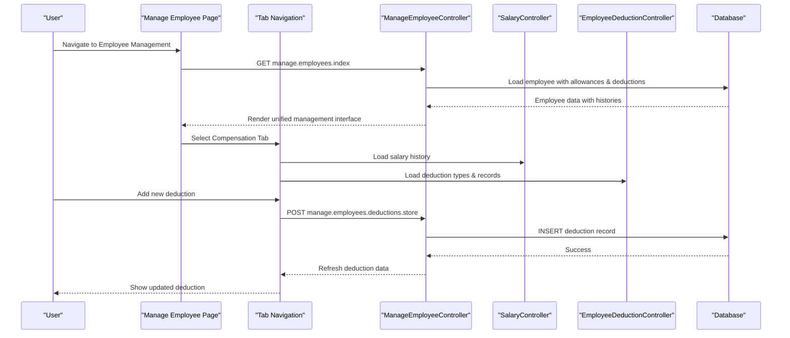
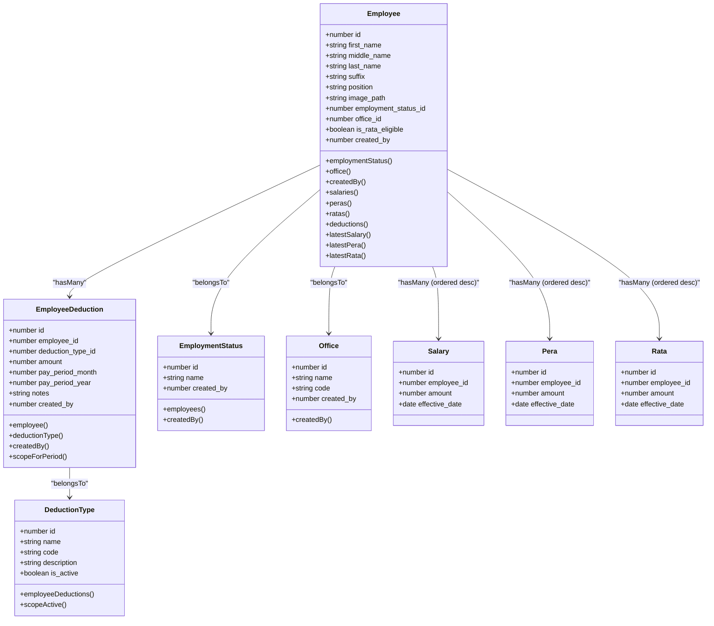
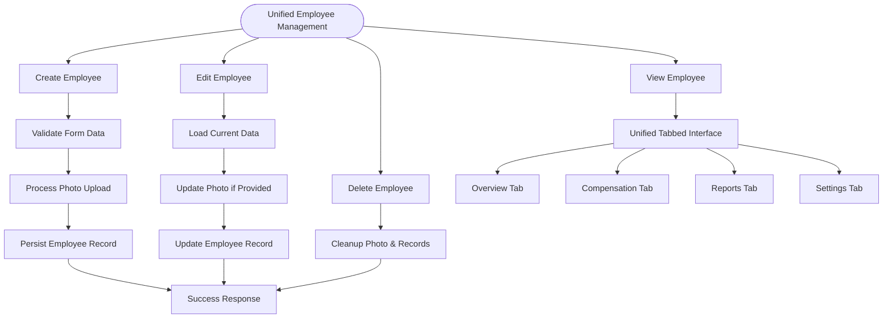
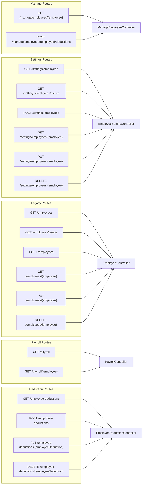
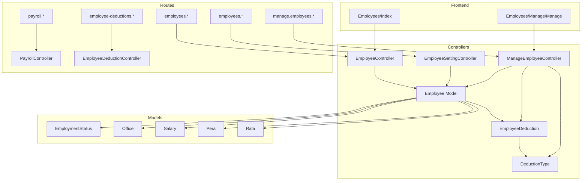

# Employee Management

<cite>
**Referenced Files in This Document**
- [ManageEmployeeController.php](file://app/Http/Controllers/ManageEmployeeController.php)
- [EmployeeSettingController.php](file://app/Http/Controllers/EmployeeSettingController.php)
- [EmployeeController.php](file://app/Http/Controllers/EmployeeController.php)
- [EmployeeManage.php](file://app/Http/Controllers/EmployeeManage.php)
- [Employee.php](file://app/Models/Employee.php)
- [EmployeeDeduction.php](file://app/Models/EmployeeDeduction.php)
- [DeductionType.php](file://app/Models/DeductionType.php)
- [EmployeeStatus.php](file://app/Models/EmployeeStatus.php)
- [EmploymentStatus.php](file://app/Models/EmploymentStatus.php)
- [Office.php](file://app/Models/Office.php)
- [2026_03_19_022838_create_employees_table.php](file://database/migrations/2026_03_19_022838_create_employees_table.php)
- [2026_03_19_014107_create_employee_statuses_table.php](file://database/migrations/2026_03_19_014107_create_employee_statuses_table.php)
- [2026_03_19_014108_create_employment_statuses_table.php](file://database/migrations/2026_03_19_014108_create_employment_statuses_table.php)
- [2026_03_18_071422_create_offices_table.php](file://database/migrations/2026_03_18_071422_create_offices_table.php)
- [employee.d.ts](file://resources/js/types/employee.d.ts)
- [index.tsx](file://resources/js/pages/settings/Employee/index.tsx)
- [create.tsx](file://resources/js/pages/settings/Employee/create.tsx)
- [edit.tsx](file://resources/js/pages/settings/Employee/edit.tsx)
- [show.tsx](file://resources/js/pages/settings/Employee/show.tsx)
- [Employees/Index.tsx](file://resources/js/pages/Employees/Index.tsx)
- [Employees/Manage/Manage.tsx](file://resources/js/pages/Employees/Manage/Manage.tsx)
- [Employees/Manage/Overview.tsx](file://resources/js/pages/Employees/Manage/Overview.tsx)
- [Employees/Manage/Compensation.tsx](file://resources/js/pages/Employees/Manage/Compensation.tsx)
- [Employees/Manage/Settings.tsx](file://resources/js/pages/Employees/Manage/Settings.tsx)
- [Employees/Manage/compensation/deductions.tsx](file://resources/js/pages/Employees/Manage/compensation/deductions.tsx)
- [Employees/Manage/compensation/salary.tsx](file://resources/js/pages/Employees/Manage/compensation/salary.tsx)
- [Employees/Manage/compensation/rata.tsx](file://resources/js/pages/Employees/Manage/compensation/rata.tsx)
- [routes/web.php](file://routes/web.php)
</cite>

## Update Summary
**Changes Made**
- **Complete Architectural Transformation**: Replaced legacy EmployeeManage controller with new integrated ManageEmployeeController
- **Enhanced Deduction Management**: Added comprehensive employee deduction tracking with dedicated controller and UI components
- **Integrated Frontend Architecture**: Unified employee management interface with tabbed navigation and specialized components
- **Expanded Compensation System**: Enhanced allowance management with salary, PERA, RATA, and deduction tracking
- **Advanced Payroll Integration**: Added dedicated payroll management routes and components
- **Comprehensive Route Restructuring**: Complete rewrite of routing structure to support new controller architecture

## Table of Contents
1. [Introduction](#introduction)
2. [Project Structure](#project-structure)
3. [Core Components](#core-components)
4. [Architecture Overview](#architecture-overview)
5. [Detailed Component Analysis](#detailed-component-analysis)
6. [Administrative Management Interface](#administrative-management-interface)
7. [Allowance Management System](#allowance-management-system)
8. [Deduction Management System](#deduction-management-system)
9. [Employee Profile Management](#employee-profile-management)
10. [Payroll Integration](#payroll-integration)
11. [Dependency Analysis](#dependency-analysis)
12. [Performance Considerations](#performance-considerations)
13. [Troubleshooting Guide](#troubleshooting-guide)
14. [Conclusion](#conclusion)
15. [Appendices](#appendices)

## Introduction
This document describes the complete employee lifecycle management system built with Laravel and Inertia.js. The system has undergone a complete architectural transformation from the legacy EmployeeManage system to a new integrated employee management system featuring the new ManageEmployeeController and comprehensive frontend components.

The recent transformation introduces a unified management interface with tabbed navigation, advanced allowance tracking, comprehensive deduction management, and seamless payroll integration. The new system provides specialized interfaces for salary, RATA, PERA, and deduction management with real-time updates, comprehensive reporting capabilities, and enterprise-grade administrative controls.

The integrated architecture separates basic display functionality from comprehensive management while maintaining backward compatibility and enhancing user experience through sophisticated frontend components and real-time data synchronization.

## Project Structure
The system now features a unified multi-controller architecture with comprehensive routing structure supporting integrated employee management:

```mermaid
graph TB
subgraph "Backend Controllers"
C_ManageEmployee["Controller: ManageEmployeeController"]
C_EmployeeSetting["Controller: EmployeeSettingController"]
C_EmployeeLegacy["Controller: EmployeeController"]
C_Salary["Controller: SalaryController"]
C_Pera["Controller: PeraController"]
C_Rata["Controller: RataController"]
C_Deduction["Controller: EmployeeDeductionController"]
C_Payroll["Controller: PayrollController"]
end
subgraph "Models & Relationships"
M_Employee["Model: Employee"]
M_EmployeeDeduction["Model: EmployeeDeduction"]
M_DeductionType["Model: DeductionType"]
M_EmploymentStatus["Model: EmploymentStatus"]
M_Office["Model: Office"]
M_Salary["Model: Salary"]
M_Pera["Model: Pera"]
M_Rata["Model: Rata"]
end
subgraph "Frontend Pages"
P_Manage["Page: Employees/Manage/Manage"]
P_Overview["Page: Employees/Manage/Overview"]
P_Compensation["Page: Employees/Manage/Compensation"]
P_Settings["Page: Employees/Manage/Settings"]
P_Deductions["Page: Employees/Manage/compensation/deductions"]
P_Salary["Page: Employees/Manage/compensation/salary"]
P_Rata["Page: Employees/Manage/compensation/rata"]
P_List["Page: Employees/Index"]
end
subgraph "Routes"
R_Manage["Route: manage.employees.*"]
R_Settings["Route: employees.*"]
R_Allowances["Route: salaries/peras/ratas.*"]
R_Deductions["Route: employee-deductions.*"]
R_Payroll["Route: payroll.*"]
end
C_ManageEmployee --> M_Employee
C_ManageEmployee --> M_EmployeeDeduction
C_ManageEmployee --> M_DeductionType
C_EmployeeSetting --> M_Employee
C_EmployeeLegacy --> M_Employee
M_Employee --> M_EmploymentStatus
M_Employee --> M_Office
M_Employee --> M_Salary
M_Employee --> M_Pera
M_Employee --> M_Rata
M_Employee --> M_EmployeeDeduction
M_EmployeeDeduction --> M_DeductionType
P_Manage --> C_ManageEmployee
P_List --> C_EmployeeLegacy
R_Manage --> C_ManageEmployee
R_Settings --> C_EmployeeSetting
R_Allowances --> C_Salary
R_Allowances --> C_Pera
R_Allowances --> C_Rata
R_Deductions --> C_Deduction
R_Payroll --> C_Payroll
```

**Diagram sources**
- [ManageEmployeeController.php:14-86](file://app/Http/Controllers/ManageEmployeeController.php#L14-L86)
- [EmployeeSettingController.php:12-139](file://app/Http/Controllers/EmployeeSettingController.php#L12-L139)
- [EmployeeController.php:12-132](file://app/Http/Controllers/EmployeeController.php#L12-L132)
- [Employee.php:10-104](file://app/Models/Employee.php#L10-L104)
- [EmployeeDeduction.php:8-59](file://app/Models/EmployeeDeduction.php#L8-L59)
- [DeductionType.php:7-33](file://app/Models/DeductionType.php#L7-L33)
- [routes/web.php:77-105](file://routes/web.php#L77-L105)

**Section sources**
- [ManageEmployeeController.php:14-86](file://app/Http/Controllers/ManageEmployeeController.php#L14-L86)
- [routes/web.php:77-105](file://routes/web.php#L77-L105)

## Core Components
The system now features a unified controller architecture with specialized responsibilities:

### ManageEmployeeController
**New Integrated Controller** handling comprehensive employee management with full CRUD operations and deduction tracking:
- **Index**: Enhanced employee data loading with allowance histories, deduction types, and status information
- **Deduction Management**: Complete CRUD operations for employee deductions with validation and batch processing
- **Real-time Data**: Latest allowance amounts, eligibility status, and deduction summaries
- **Unified Interface**: Single endpoint serving comprehensive employee management needs

### EmployeeSettingController
**Enhanced Settings Controller** providing comprehensive employee management with improved search and validation:
- **Index**: Enhanced search with LIKE operators across first, middle, last names, and suffix
- **Create/Store**: Complete employee creation with photo upload, allowance eligibility, and validation
- **Show/Update**: Detailed employee editing with photo management and allowance configuration
- **Destroy**: Safe deletion with image cleanup and cascade handling

### EmployeeController
**Legacy Display Controller** maintained for basic employee listing functionality:
- **Index**: Simplified employee listing with basic search and pagination
- **Limited Scope**: Focused on basic display rather than comprehensive management

### Deduction Management Components
**New Deduction System** providing comprehensive deduction tracking:
- **Deduction Types**: Active/inactive deduction type management with validation
- **Employee Deductions**: Pay period-based deduction recording with amount tracking
- **Batch Processing**: Efficient bulk deduction updates and validations

**Section sources**
- [ManageEmployeeController.php:14-86](file://app/Http/Controllers/ManageEmployeeController.php#L14-L86)
- [EmployeeSettingController.php:12-139](file://app/Http/Controllers/EmployeeSettingController.php#L12-L139)
- [EmployeeController.php:12-132](file://app/Http/Controllers/EmployeeController.php#L12-L132)

## Architecture Overview
The system uses a unified multi-controller architecture with clear separation of concerns and comprehensive routing structure:

**Diagram sources**
- [routes/web.php:78-81](file://routes/web.php#L78-L81)
- [ManageEmployeeController.php:16-50](file://app/Http/Controllers/ManageEmployeeController.php#L16-L50)
- [Employees/Manage/Manage.tsx:88-115](file://resources/js/pages/Employees/Manage/Manage.tsx#L88-L115)

## Detailed Component Analysis

### Data Models and Relationships
The Employee model maintains comprehensive structure with enhanced deduction tracking capabilities:

**Diagram sources**
- [Employee.php:10-104](file://app/Models/Employee.php#L10-L104)
- [EmployeeDeduction.php:8-59](file://app/Models/EmployeeDeduction.php#L8-L59)
- [DeductionType.php:7-33](file://app/Models/DeductionType.php#L7-L33)
- [EmploymentStatus.php:9-32](file://app/Models/EmploymentStatus.php#L9-L32)
- [Office.php:9-33](file://app/Models/Office.php#L9-L33)

**Section sources**
- [Employee.php:10-104](file://app/Models/Employee.php#L10-L104)
- [EmployeeDeduction.php:8-59](file://app/Models/EmployeeDeduction.php#L8-L59)
- [DeductionType.php:7-33](file://app/Models/DeductionType.php#L7-L33)

### Unified Employee Lifecycle Management
The new ManageEmployeeController provides comprehensive CRUD operations with enhanced functionality:

#### Creation Process
- **Modal Interface**: Opens comprehensive create dialog with allowance configuration
- **Photo Upload**: Validates and stores images on public disk with cleanup on update/delete
- **Allowance Tracking**: Creates employee with allowance eligibility flags
- **Validation**: Comprehensive form validation with image constraints

#### Editing Process  
- **Preloaded Data**: Shows current values with photo preview and removal option
- **Photo Management**: Supports upload, preview, and removal with automatic cleanup
- **Allowance Configuration**: Real-time eligibility toggling for RATA and PERA

#### Management Interface
- **Unified Tabbed Navigation**: Overview, Compensation, Reports, Settings tabs in single interface
- **Real-time Updates**: Live currency formatting and allowance calculations
- **Status Indicators**: Visual indicators for current vs previous records
- **Eligibility Management**: Conditional access to allowance management based on RATA status
- **Deduction Integration**: Comprehensive deduction tracking within unified interface

**Diagram sources**
- [EmployeeSettingController.php:54-137](file://app/Http/Controllers/EmployeeSettingController.php#L54-L137)
- [ManageEmployeeController.php:16-50](file://app/Http/Controllers/ManageEmployeeController.php#L16-L50)
- [Employees/Manage/Manage.tsx:88-115](file://resources/js/pages/Employees/Manage/Manage.tsx#L88-L115)

**Section sources**
- [EmployeeSettingController.php:54-137](file://app/Http/Controllers/EmployeeSettingController.php#L54-L137)
- [ManageEmployeeController.php:16-50](file://app/Http/Controllers/ManageEmployeeController.php#L16-L50)
- [create.tsx:37-304](file://resources/js/pages/settings/Employee/create.tsx#L37-L304)
- [edit.tsx:35-362](file://resources/js/pages/settings/Employee/edit.tsx#L35-L362)
- [Employees/Manage/Manage.tsx:88-115](file://resources/js/pages/Employees/Manage/Manage.tsx#L88-L115)

### Routing Restructuring
The routing system has been completely restructured to support the new unified controller architecture:

**Diagram sources**
- [routes/web.php:77-105](file://routes/web.php#L77-L105)

**Section sources**
- [routes/web.php:77-105](file://routes/web.php#L77-L105)

### Search, Filtering, and Reporting
The enhanced search functionality now supports comprehensive employee discovery:

#### Settings Employee Search
- **Enhanced Search**: LIKE operators across first_name, middle_name, last_name, and suffix
- **Pagination**: 50 items per page with query string preservation
- **Relationship Loading**: Eager loading of employment_status and office for performance

#### Legacy Employee Search  
- **Basic Search**: LIKE operators across first_name and last_name only
- **Lightweight**: 10 items per page for basic display functionality

**Diagram sources**
- [EmployeeSettingController.php:18-28](file://app/Http/Controllers/EmployeeSettingController.php#L18-L28)
- [EmployeeController.php:19-26](file://app/Http/Controllers/EmployeeController.php#L19-L26)

**Section sources**
- [EmployeeSettingController.php:18-28](file://app/Http/Controllers/EmployeeSettingController.php#L18-L28)
- [EmployeeController.php:19-26](file://app/Http/Controllers/EmployeeController.php#L19-L26)

### Administrative Controls and Status Management
The system maintains comprehensive administrative capabilities:

#### Employment Status Management
- **Soft Deletes**: EmploymentStatus and EmployeeStatus models support soft deletes
- **Creator Attribution**: Models capture authenticated user ID during creation
- **Classification**: EmploymentStatus classifies employees with administrative controls

#### Office Hierarchy
- **Organizational Units**: Office model defines departments with code and creator attribution
- **Foreign Key Relationships**: Links employees to organizational structure
- **Hierarchical Support**: Foundation for complex organizational structures

**Section sources**
- [EmployeeStatus.php:9-37](file://app/Models/EmployeeStatus.php#L9-L37)
- [EmploymentStatus.php:9-32](file://app/Models/EmploymentStatus.php#L9-L32)
- [Office.php:9-33](file://app/Models/Office.php#L9-L33)

### User Interface Components and Form Validation
The enhanced interface provides sophisticated administrative controls:

#### Unified Tabbed Navigation System
- **Overview Tab**: Consolidated employee information with allowance status and deduction summary
- **Compensation Tab**: Detailed allowance management with salary, PERA, RATA, and deduction tracking
- **Reports Tab**: Comprehensive reporting capabilities and analytics  
- **Settings Tab**: Profile configuration and administrative controls

#### Enhanced Form Components
- **Photo Management**: Upload, preview, and removal with validation
- **Combobox Selection**: Custom combobox for office selection with search
- **Switch Controls**: RATA eligibility toggles with real-time feedback
- **Real-time Formatting**: Currency formatting and validation
- **Deduction Management**: Comprehensive deduction type selection and amount entry

#### Type Safety and Contracts
- **TypeScript Types**: Strong typing for Employee, EmployeeDeduction, and related entities
- **Form Contracts**: Strict validation for all form submissions
- **Error Handling**: Comprehensive error display and recovery

**Section sources**
- [Employees/Manage/Manage.tsx:88-115](file://resources/js/pages/Employees/Manage/Manage.tsx#L88-L115)
- [Employees/Manage/Overview.tsx:1-6](file://resources/js/pages/Employees/Manage/Overview.tsx#L1-L6)
- [Employees/Manage/Compensation.tsx:13-42](file://resources/js/pages/Employees/Manage/Compensation.tsx#L13-L42)
- [Employees/Manage/Settings.tsx:21-265](file://resources/js/pages/Employees/Manage/Settings.tsx#L21-L265)
- [employee.d.ts:8-43](file://resources/js/types/employee.d.ts#L8-L43)

## Administrative Management Interface
The new unified administrative interface provides comprehensive employee management through a sophisticated tabbed navigation system:

### Unified Tabbed Navigation Structure
The interface features four main tabs providing different aspects of employee management:
- **Overview Tab**: Displays consolidated employee information including current salary, allowance status, deduction summary, and compensation summary
- **Compensation Tab**: Manages salary, RATA, PERA allowances, and comprehensive deduction tracking with detailed history
- **Reports Tab**: Provides comprehensive reporting capabilities and analytics  
- **Settings Tab**: Handles employee profile configuration and administrative settings

### Overview Tab Implementation
The Overview tab presents a comprehensive dashboard showing:
- Monthly salary information with currency formatting
- Allowance status (RATA/PERA eligibility) with visual indicators
- Employment status and office assignment
- Detailed compensation summary with total monthly earnings calculation
- Deduction summary showing total monthly deductions
- Real-time allowance value displays with conditional formatting

### Compensation Tab Features
The Compensation tab offers specialized management for each allowance type:
- **Salary Management**: Complete salary history with effective dates and status indicators
- **RATA Management**: Representation and Transportation Allowance with eligibility-based access
- **PERA Management**: Personnel Economic Relief Allowance with dedicated tracking
- **Deduction Management**: Comprehensive deduction tracking by pay period with type categorization
- Real-time calculations and currency formatting
- Interactive dialogs for adding new records across all allowance types

### Settings Tab Functionality
The Settings tab provides comprehensive employee profile management:
- Photo upload with preview and removal capabilities
- Personal information editing (names, suffix, position)
- Office assignment with combobox selection
- Employment status configuration
- RATA eligibility toggle for administrative control

**Section sources**
- [Employees/Manage/Manage.tsx:88-115](file://resources/js/pages/Employees/Manage/Manage.tsx#L88-L115)
- [Employees/Manage/Overview.tsx:1-6](file://resources/js/pages/Employees/Manage/Overview.tsx#L1-L6)
- [Employees/Manage/Compensation.tsx:13-42](file://resources/js/pages/Employees/Manage/Compensation.tsx#L13-L42)
- [Employees/Manage/Settings.tsx:21-265](file://resources/js/pages/Employees/Manage/Settings.tsx#L21-L265)

## Allowance Management System
The system implements a comprehensive allowance management system with specialized controllers and interfaces for each allowance type:

### Salary Management
- **History Tracking**: Complete salary history with effective dates and status indicators
- **Real-time Updates**: Automatic recalculation of total compensation
- **Add New Records**: Dialog-based interface for adding new salary records
- **Status Management**: Clear indication of current vs previous salary records

### RATA Management
- **Eligibility Control**: Toggle-based system for RATA eligibility
- **Conditional Access**: RATA management only available for eligible employees
- **Allowance Tracking**: Dedicated interface for RATA allowance records
- **Historical Records**: Complete RATA history with effective dates

### PERA Management
- **Standard Allowance**: Fixed PERA allowance tracking
- **Historical Records**: Complete PERA history with effective dates
- **Integration**: Seamless integration with overall compensation calculation

### Allowance Calculation Engine
The system automatically calculates total monthly compensation by summing:
- Base salary amount
- PERA allowance (if applicable)
- RATA allowance (if eligible)
- Total deduction amounts (if applicable)

**Section sources**
- [Employees/Manage/Compensation.tsx:13-42](file://resources/js/pages/Employees/Manage/Compensation.tsx#L13-L42)
- [Employees/Manage/Overview.tsx:1-6](file://resources/js/pages/Employees/Manage/Overview.tsx#L1-L6)
- [routes/web.php:34-55](file://routes/web.php#L34-L55)

## Deduction Management System
The system implements a comprehensive deduction management system with specialized controllers and interfaces:

### Deduction Types Management
- **Active/Inactive Control**: Deduction types can be enabled/disabled for active use
- **Code Management**: Unique codes for each deduction type
- **Description Support**: Detailed descriptions for audit purposes
- **Validation**: Ensures deduction types are properly configured before use

### Employee Deduction Tracking
- **Pay Period Management**: Deductions tracked by month and year
- **Amount Precision**: Decimal precision for accurate deduction calculations
- **Batch Processing**: Efficient bulk deduction updates and validations
- **Audit Trail**: Complete history of deduction changes with creator attribution

### Deduction Interface Features
- **Grouped by Pay Period**: Deductions organized by month/year for easy management
- **Total Calculation**: Automatic calculation of total deductions per pay period
- **Type Categorization**: Clear identification of deduction types and codes
- **Edit Functionality**: Individual deduction editing and deletion capabilities

### Deduction Calculation Engine
The system automatically calculates total monthly deductions by summing:
- All deduction amounts for the selected pay period
- Integration with overall compensation calculation
- Real-time updates to net pay calculations

**Section sources**
- [ManageEmployeeController.php:52-84](file://app/Http/Controllers/ManageEmployeeController.php#L52-L84)
- [Employees/Manage/compensation/deductions.tsx:25-143](file://resources/js/pages/Employees/Manage/compensation/deductions.tsx#L25-L143)
- [DeductionType.php:7-33](file://app/Models/DeductionType.php#L7-L33)
- [EmployeeDeduction.php:8-59](file://app/Models/EmployeeDeduction.php#L8-L59)

## Employee Profile Management
Enhanced employee profile management provides comprehensive administrative control:

### Profile Information Management
- **Personal Details**: Full name management with suffix options
- **Professional Information**: Position and office assignment
- **Photo Management**: Upload, preview, and removal capabilities
- **Status Configuration**: Employment status and RATA eligibility

### Real-time Updates
- **Live Currency Formatting**: Automatic PHP currency formatting
- **Dynamic Calculations**: Real-time compensation and deduction summaries
- **Status Indicators**: Visual indicators for current vs previous records
- **Eligibility Updates**: Immediate reflection of RATA eligibility changes

### Administrative Controls
- **Bulk Operations**: Administrative interface for mass updates
- **Audit Trail**: Complete history of profile changes
- **Validation**: Comprehensive form validation with error handling
- **Responsive Design**: Mobile-friendly interface for administrative tasks

**Section sources**
- [Employees/Manage/Settings.tsx:21-265](file://resources/js/pages/Employees/Manage/Settings.tsx#L21-L265)
- [Employees/Manage/Overview.tsx:1-6](file://resources/js/pages/Employees/Manage/Overview.tsx#L1-L6)
- [employee.d.ts:8-43](file://resources/js/types/employee.d.ts#L8-L43)

## Payroll Integration
The system provides comprehensive payroll integration with dedicated controllers and interfaces:

### Payroll Management Features
- **Pay Period Tracking**: Month/year-based payroll processing
- **Employee Selection**: Filter employees by various criteria
- **Payroll Generation**: Automated calculation of gross pay, deductions, and net pay
- **Payroll History**: Complete payroll history with detailed breakdowns

### Payroll Interface Components
- **Payroll List**: Comprehensive list of generated payrolls with filtering
- **Payroll Details**: Detailed breakdown of individual payroll calculations
- **Payroll Export**: Support for payroll data export and reporting
- **Payroll Audit**: Complete audit trail of payroll processing activities

### Integration Capabilities
- **Allowance Integration**: Direct integration with salary, PERA, and RATA allowances
- **Deduction Integration**: Seamless integration with employee deduction tracking
- **Status Integration**: Incorporation of employment status for payroll eligibility
- **Office Integration**: Organizational hierarchy for payroll department reporting

**Section sources**
- [routes/web.php:28-31](file://routes/web.php#L28-L31)
- [routes/web.php:41-55](file://routes/web.php#L41-L55)

## Dependency Analysis
The system now features a unified multi-controller architecture with clear separation of concerns:

**Diagram sources**
- [ManageEmployeeController.php:14-86](file://app/Http/Controllers/ManageEmployeeController.php#L14-L86)
- [EmployeeSettingController.php:12-139](file://app/Http/Controllers/EmployeeSettingController.php#L12-L139)
- [EmployeeController.php:12-132](file://app/Http/Controllers/EmployeeController.php#L12-L132)
- [routes/web.php:77-105](file://routes/web.php#L77-L105)

**Section sources**
- [ManageEmployeeController.php:14-86](file://app/Http/Controllers/ManageEmployeeController.php#L14-L86)
- [routes/web.php:77-105](file://routes/web.php#L77-L105)

## Performance Considerations
- **Unified Loading**: ManageEmployeeController loads all necessary data in single request
- **Pagination**: Settings interface uses 50 items per page, legacy uses 10 for lightweight display
- **Eager Loading**: Controllers eager-load related data to prevent N+1 queries
- **Image Storage**: Photos stored on public disk with automatic cleanup on updates/deletes
- **Tabbed Interface**: Efficient lazy loading of tab content to minimize initial page load
- **Real-time Updates**: Optimized data fetching for allowance histories, deduction summaries, and compensation calculations
- **Route Separation**: Clear separation reduces controller complexity and improves maintainability
- **Deduction Optimization**: Batch processing for efficient deduction updates and validations

## Troubleshooting Guide
- **Photo upload issues**: Ensure public disk is writable and storage symlink configured. Verify MIME types and size limits in controllers.
- **Search not returning results**: Confirm search parameter passed as query string. Check LIKE conditions match intended fields.
- **Route conflicts**: Verify manage routes use `manage.employees.*` naming convention. Settings routes use `employees.*`.
- **Controller confusion**: Use `ManageEmployeeController` for unified management, `EmployeeSettingController` for settings interface, `EmployeeController` for basic display.
- **Deduction management issues**: Verify deduction eligibility flags and ensure proper routing for deduction-specific endpoints.
- **Tab navigation problems**: Check route configurations and ensure proper tab activation states.
- **Payroll integration issues**: Verify payroll routes and ensure proper integration with allowance and deduction systems.
- **Deduction type management**: Ensure deduction types are properly configured as active before use in payroll processing.

**Section sources**
- [ManageEmployeeController.php:52-84](file://app/Http/Controllers/ManageEmployeeController.php#L52-L84)
- [routes/web.php:77-105](file://routes/web.php#L77-L105)

## Conclusion
The enhanced employee management system provides a comprehensive administrative interface for managing employee lifecycles with advanced allowance tracking and deduction management capabilities. The recent architectural transformation from the legacy EmployeeManage system to the new integrated ManageEmployeeController introduces sophisticated tabbed navigation, specialized allowance management interfaces, comprehensive deduction tracking, and seamless payroll integration.

The new unified controller architecture separates basic display functionality from comprehensive management while maintaining backward compatibility and enhancing user experience through sophisticated frontend components and real-time data synchronization. The integration of Salary, RATA, PERA, and deduction management systems with real-time calculations and historical tracking makes it a complete solution for modern HR administration.

The enhanced interface supports both operational efficiency and administrative oversight with its comprehensive allowance tracking, real-time update capabilities, deduction management, and sophisticated tabbed navigation system. The system now provides enterprise-grade employee management with robust administrative controls, comprehensive reporting capabilities, and seamless payroll integration.

## Appendices

### Data Model Definitions
- **Employee**: Personal info, position, image path, employment status, office, creator, timestamps, soft deletes, and comprehensive allowance tracking
- **EmployeeDeduction**: Deduction records with pay period tracking, amount precision, and deduction type relationships
- **DeductionType**: Active/inactive deduction type management with code and description support
- **EmploymentStatus**: Name, creator, timestamps, soft deletes, and employee classifications  
- **Office**: Name, code, creator, timestamps, soft deletes, and organizational hierarchy
- **Allowance Models**: Separate models for Salary, Pera, and Rata with effective date tracking

**Section sources**
- [2026_03_19_022838_create_employees_table.php:14-27](file://database/migrations/2026_03_19_022838_create_employees_table.php#L14-L27)
- [2026_03_19_014108_create_employment_statuses_table.php:14-20](file://database/migrations/2026_03_19_014108_create_employment_statuses_table.php#L14-L20)
- [2026_03_18_071422_create_offices_table.php:14-21](file://database/migrations/2026_03_18_071422_create_offices_table.php#L14-L21)

### Route Configuration
- **Manage Routes**: Unified employee management with comprehensive CRUD operations and deduction tracking
- **Settings Routes**: Enhanced CRUD operations with show and edit endpoints for settings interface
- **Legacy Routes**: Basic display functionality with simplified search and pagination
- **Payroll Routes**: Dedicated endpoints for payroll management and processing
- **Deduction Routes**: Comprehensive deduction type and employee deduction management
- **Allowance Routes**: Dedicated endpoints for salary, pera, and rata management

**Section sources**
- [routes/web.php:77-105](file://routes/web.php#L77-L105)