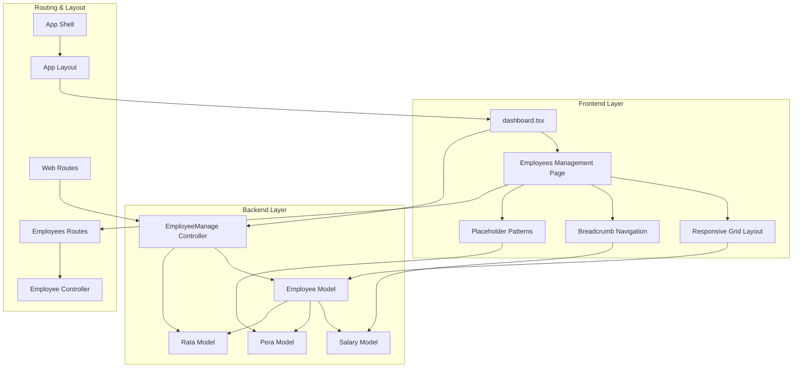
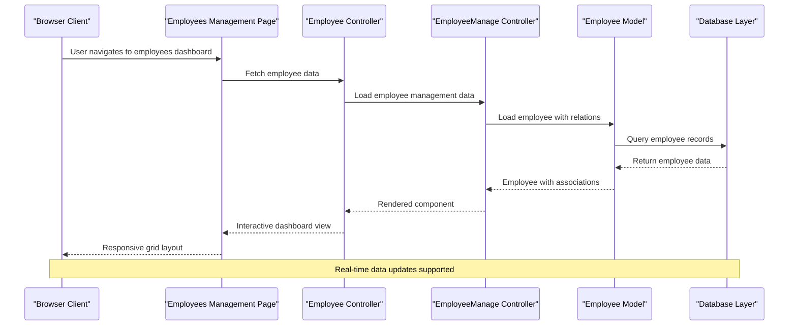
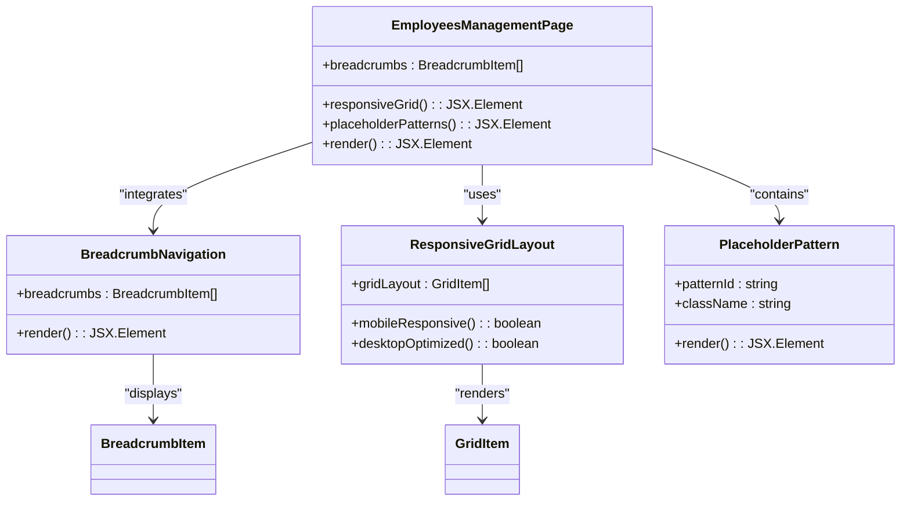
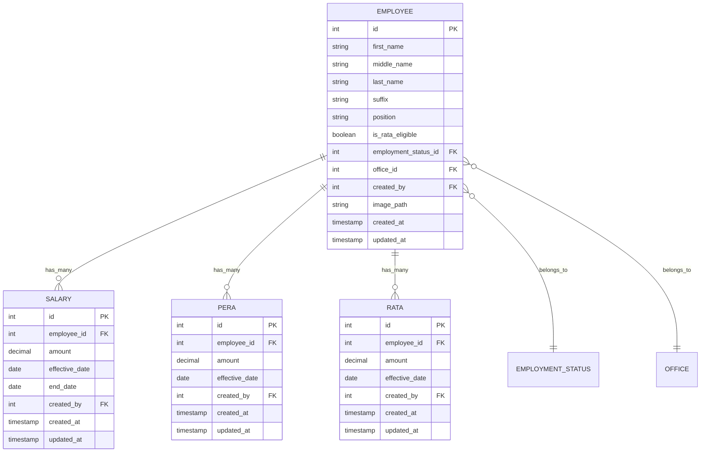
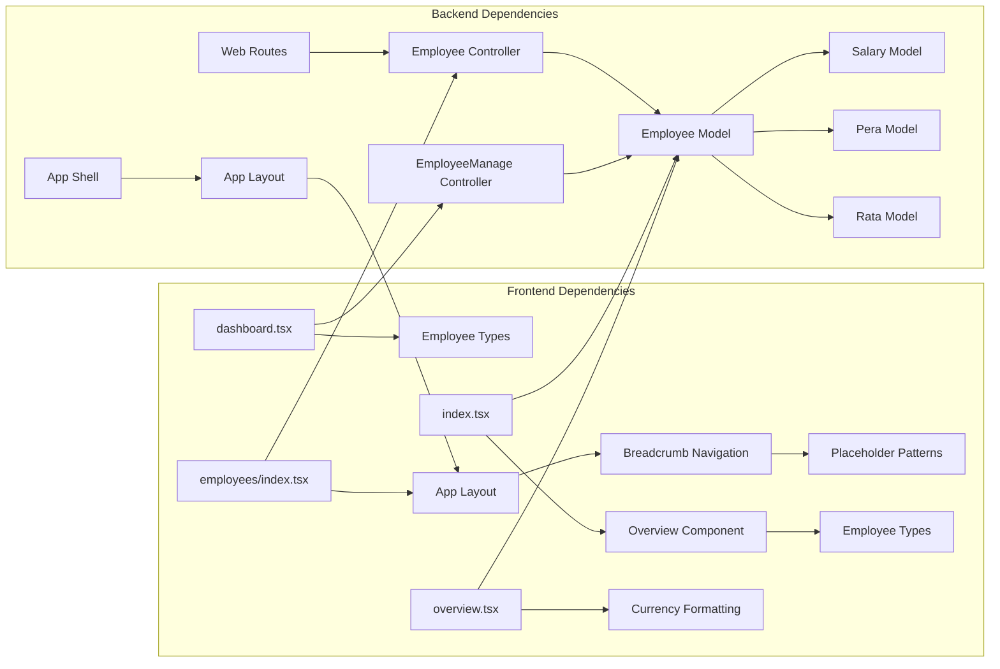

# Employee Overview Dashboard

<cite>
**Referenced Files in This Document**
- [dashboard.tsx](file://resources/js/pages/dashboard.tsx)
- [employees/index.tsx](file://resources/js/pages/employees/index.tsx)
- [EmployeeManage.php](file://app\Http\Controllers\EmployeeManage.php)
- [EmployeeController.php](file://app\Http\Controllers\EmployeeController.php)
- [Employee.php](file://app\Models\Employee.php)
- [employee.d.ts](file://resources/js/types/employee.d.ts)
- [overview.tsx](file://resources/js/pages/settings/Employee/manage/overview.tsx)
- [index.tsx](file://resources/js/pages/settings/Employee/manage/index.tsx)
- [web.php](file://routes/web.php)
- [app.blade.php](file://resources/views/app.blade.php)
- [app-layout.tsx](file://resources/js/layouts/app-layout.tsx)
- [app-shell.tsx](file://resources/js/components/app-shell.tsx)
- [breadcrumbs.tsx](file://resources/js/components/breadcrumbs.tsx)
- [placeholder-pattern.tsx](file://resources/js/components/ui/placeholder-pattern.tsx)
- [salary.d.ts](file://resources/js/types/salary.d.ts)
- [pera.d.ts](file://resources/js/types/pera.d.ts)
- [rata.d.ts](file://resources/js/types/rata.d.ts)
</cite>

## Update Summary
**Changes Made**
- Added comprehensive documentation for the new employees management page component
- Updated project structure to reflect the new employees page implementation
- Enhanced layout and breadcrumb integration documentation
- Added responsive grid layout and placeholder pattern documentation
- Updated routing structure to include new employees management routes

## Table of Contents
1. [Introduction](#introduction)
2. [Project Structure](#project-structure)
3. [Core Components](#core-components)
4. [Architecture Overview](#architecture-overview)
5. [Detailed Component Analysis](#detailed-component-analysis)
6. [Dependency Analysis](#dependency-analysis)
7. [Performance Considerations](#performance-considerations)
8. [Troubleshooting Guide](#troubleshooting-guide)
9. [Conclusion](#conclusion)

## Introduction
The Employee Overview Dashboard is a comprehensive payroll management interface designed to provide HR professionals and managers with a unified view of employee compensation and benefits. This dashboard integrates real-time salary data, allowance calculations, and eligibility status tracking to deliver actionable insights into workforce compensation strategies.

The system leverages Laravel's backend architecture with React frontend components, creating a seamless Single Page Application (SPA) experience. It supports dynamic data loading, real-time updates, and responsive design principles optimized for both desktop and mobile viewing experiences.

**Updated** The dashboard now includes a dedicated employees management page component that serves as the main interface for employee operations, featuring responsive grid layouts and comprehensive breadcrumb navigation.

## Project Structure
The dashboard implementation follows a modular architecture with clear separation between frontend React components and backend PHP controllers. The structure emphasizes maintainability and scalability through organized file organization and consistent naming conventions.

**Diagram sources**
- [employees/index.tsx:13-35](file://resources/js/pages/employees/index.tsx#L13-L35)
- [EmployeeManage.php:13-40](file://app\Http\Controllers\EmployeeManage.php#L13-L40)
- [EmployeeController.php:85-95](file://app\Http\Controllers\EmployeeController.php#L85-L95)

**Section sources**
- [dashboard.tsx:1-37](file://resources/js/pages/dashboard.tsx#L1-L37)
- [employees/index.tsx:1-36](file://resources/js/pages/employees/index.tsx#L1-L36)
- [web.php:20-96](file://routes/web.php#L20-L96)

## Core Components
The dashboard consists of several interconnected components that work together to provide comprehensive employee overview functionality. Each component serves a specific purpose in the overall system architecture while maintaining loose coupling and high cohesion.

### Dashboard Container
The main dashboard container provides the foundational layout structure with responsive grid systems and placeholder patterns for future content integration. It establishes the visual foundation upon which specialized employee management components are built.

### Employees Management Interface
**Updated** The employees management interface serves as the primary hub for viewing and managing employee compensation data. It incorporates a responsive grid layout with three main content areas: overview statistics, detailed employee information, and interactive management controls. The interface features breadcrumb navigation integration and placeholder patterns for content areas.

### Overview Statistics Module
The overview module presents key compensation metrics in an intuitive card-based layout. It displays monthly salary amounts, allowance configurations, RATA eligibility status, and employment classification information with appropriate visual indicators and formatting.

**Section sources**
- [dashboard.tsx:14-36](file://resources/js/pages/dashboard.tsx#L14-L36)
- [employees/index.tsx:13-35](file://resources/js/pages/employees/index.tsx#L13-L35)
- [index.tsx:24-116](file://resources/js/pages/settings/Employee/manage/index.tsx#L24-L116)
- [overview.tsx:9-114](file://resources/js/pages/settings/Employee/manage/overview.tsx#L9-L114)

## Architecture Overview
The dashboard architecture implements a client-server model with React frontend components communicating with Laravel backend services through AJAX requests. The system utilizes Inertia.js for seamless page transitions and state management.

**Diagram sources**
- [EmployeeController.php:85-95](file://app\Http\Controllers\EmployeeController.php#L85-L95)
- [EmployeeManage.php:13-40](file://app\Http\Controllers\EmployeeManage.php#L13-L40)
- [Employee.php:90-103](file://app\Models\Employee.php#L90-L103)

The architecture ensures efficient data loading through eager loading of related models, reducing database queries and improving response times. The frontend components utilize React's virtual DOM for optimal rendering performance.

**Section sources**
- [EmployeeManage.php:13-40](file://app\Http\Controllers\EmployeeManage.php#L13-L40)
- [Employee.php:31-64](file://app\Models\Employee.php#L31-L64)

## Detailed Component Analysis

### Employees Management Page Component
**Updated** The Employees Management Page component serves as the primary interface for employee operations, featuring a responsive grid layout with three main content areas. The component integrates breadcrumb navigation, placeholder patterns, and AppLayout wrapping to provide a cohesive user experience.

**Diagram sources**
- [employees/index.tsx:6-35](file://resources/js/pages/employees/index.tsx#L6-L35)
- [breadcrumbs.tsx:5-31](file://resources/js/components/breadcrumbs.tsx#L5-L31)
- [placeholder-pattern.tsx:7-20](file://resources/js/components/ui/placeholder-pattern.tsx#L7-L20)

The component implements intelligent responsive design patterns with CSS Grid for desktop optimization and mobile-first considerations. Placeholder patterns provide visual feedback during content loading phases.

**Section sources**
- [employees/index.tsx:13-35](file://resources/js/pages/employees/index.tsx#L13-L35)
- [breadcrumbs.tsx:5-31](file://resources/js/components/breadcrumbs.tsx#L5-L31)
- [placeholder-pattern.tsx:7-20](file://resources/js/components/ui/placeholder-pattern.tsx#L7-L20)

### Employee Management Controller
The EmployeeManage controller orchestrates data retrieval and presentation logic for the employee dashboard. It implements sophisticated relationship loading strategies to minimize database queries while ensuring comprehensive data availability.

**Diagram sources**
- [EmployeeManage.php:15-30](file://app\Http\Controllers\EmployeeManage.php#L15-L30)

The controller implements efficient data loading patterns through Laravel's relationship loading capabilities, ensuring optimal performance while maintaining data completeness.

**Section sources**
- [EmployeeManage.php:13-40](file://app\Http\Controllers\EmployeeManage.php#L13-L40)

### Backend Data Model Integration
The Employee model serves as the central data abstraction layer, defining relationships with compensation-related entities and implementing automatic data transformations. It maintains referential integrity while providing convenient accessors for derived data.

**Diagram sources**
- [Employee.php:31-64](file://app\Models\Employee.php#L31-L64)
- [salary.d.ts:3-17](file://resources/js/types/salary.d.ts#L3-L17)
- [pera.d.ts:3-16](file://resources/js/types/pera.d.ts#L3-L16)
- [rata.d.ts:3-16](file://resources/js/types/rata.d.ts#L3-L16)

The model architecture supports soft deletes, automatic timestamp management, and relationship definitions that enable complex queries without manual JOIN operations.

**Section sources**
- [Employee.php:14-29](file://app\Models\Employee.php#L14-L29)
- [Employee.php:31-64](file://app\Models\Employee.php#L31-L64)

## Dependency Analysis
The dashboard system exhibits well-structured dependencies with clear separation of concerns and minimal coupling between components. The dependency graph reveals a hierarchical organization where frontend components depend on backend services through well-defined interfaces.

**Diagram sources**
- [dashboard.tsx:1-37](file://resources/js/pages/dashboard.tsx#L1-L37)
- [employees/index.tsx:1-36](file://resources/js/pages/employees/index.tsx#L1-L36)
- [EmployeeManage.php:1-42](file://app\Http\Controllers\EmployeeManage.php#L1-L42)
- [EmployeeController.php:1-139](file://app\Http\Controllers\EmployeeController.php#L1-L139)

The dependency structure ensures maintainability through clear interfaces and reduces coupling through shared type definitions and common service layers.

**Section sources**
- [web.php:20-96](file://routes/web.php#L20-L96)
- [app.blade.php:12-18](file://resources/views/app.blade.php#L12-L18)

## Performance Considerations
The dashboard implementation incorporates several performance optimization strategies to ensure responsive user experience even with large datasets. Key optimization techniques include efficient database querying, lazy loading of non-critical data, and optimized rendering strategies.

### Database Query Optimization
The EmployeeManage controller implements eager loading strategies to minimize N+1 query problems. By loading related models in a single operation, the system reduces database round trips and improves overall response times.

### Frontend Rendering Efficiency
React's component architecture enables efficient re-rendering through proper state management and memoization patterns. The dashboard components utilize conditional rendering to avoid unnecessary computations when data is unavailable.

### Asset Loading Strategies
**Updated** The employees management page implements responsive grid optimization with CSS Grid for desktop layouts and mobile-first design principles. Placeholder patterns provide visual feedback during content loading phases, improving perceived performance.

## Troubleshooting Guide
Common issues encountered with the Employee Overview Dashboard typically relate to data loading, permission validation, and asset rendering. The following troubleshooting steps address typical scenarios:

### Data Loading Issues
Verify that employee records contain valid compensation data and that related models are properly associated. Check database relationships and ensure that foreign key constraints are satisfied.

### Permission and Access Control
Ensure that users have appropriate permissions to access employee records and compensation data. Verify middleware configuration and route protection mechanisms.

### Frontend Component Rendering
**Updated** Check for JavaScript errors in the browser console and verify that all required dependencies are properly loaded. Validate TypeScript definitions and component prop interfaces. Ensure that the AppLayout wrapper is properly configured and that breadcrumb navigation renders correctly.

### Responsive Layout Issues
Verify that CSS Grid properties are correctly applied and that placeholder patterns render properly across different screen sizes. Check for mobile responsiveness and ensure that grid layouts adapt appropriately to various viewport sizes.

**Section sources**
- [EmployeeManage.php:13-40](file://app\Http\Controllers\EmployeeManage.php#L13-L40)
- [EmployeeController.php:14-41](file://app\Http\Controllers\EmployeeController.php#L14-L41)

## Conclusion
The Employee Overview Dashboard represents a sophisticated payroll management solution that combines modern frontend development practices with robust backend architecture. The system successfully balances functionality, performance, and maintainability through careful architectural decisions and implementation patterns.

**Updated** The addition of the comprehensive employees management page component establishes a solid foundation for employee operations with responsive design, breadcrumb navigation, and placeholder patterns. The system serves as an excellent foundation for enterprise-level payroll management applications requiring real-time data visualization and interactive user interfaces.

Key strengths of the implementation include efficient data loading strategies, responsive design principles, comprehensive type safety through TypeScript integration, and modular component architecture. The dashboard provides comprehensive employee compensation visualization while maintaining extensibility for future enhancements.