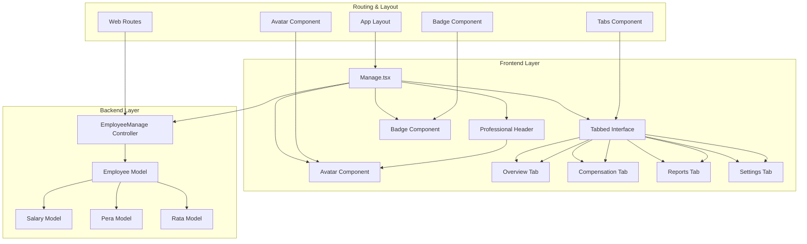
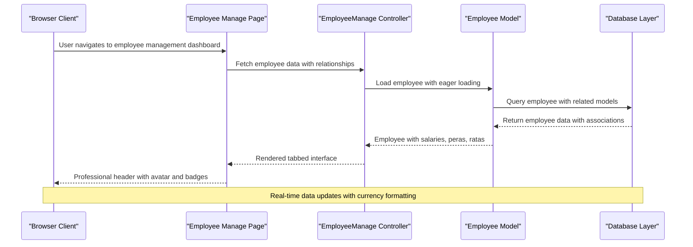
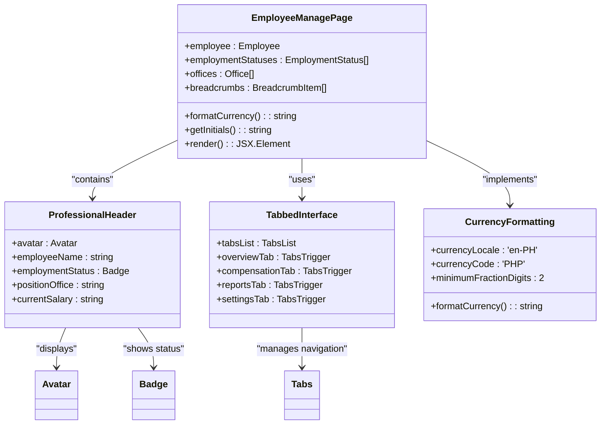
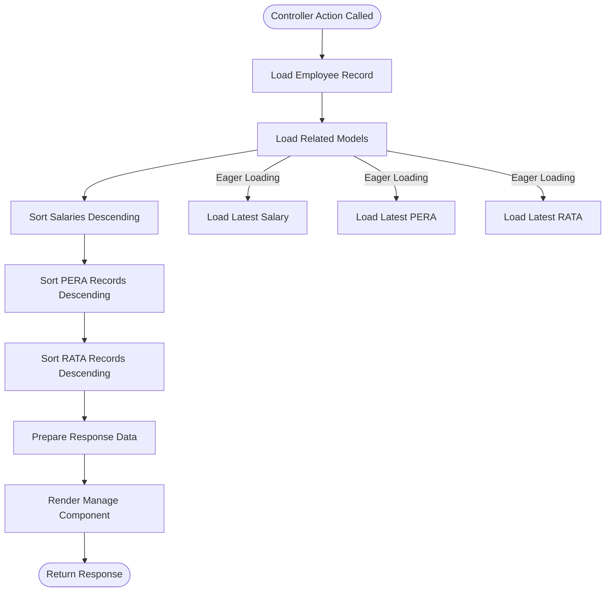
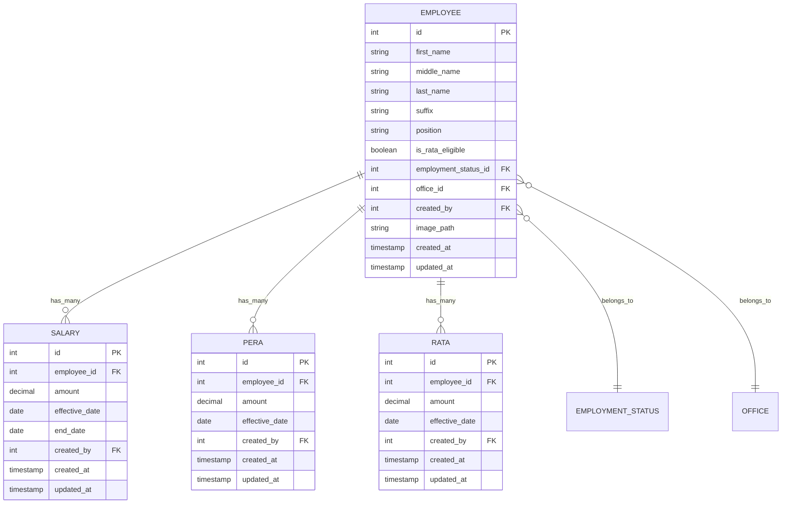
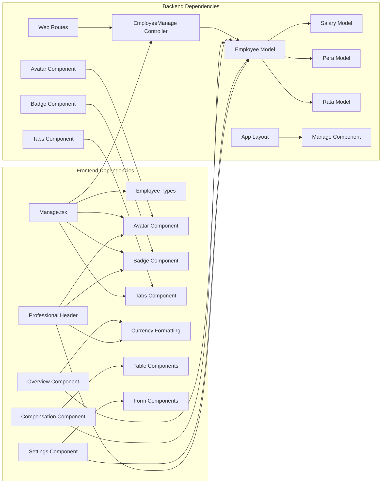

# Employee Overview Dashboard

<cite>
**Referenced Files in This Document**
- [Manage.tsx](file://resources/js/pages/Employees/Manage/Manage.tsx)
- [Overview.tsx](file://resources/js/pages/Employees/Manage/Overview.tsx)
- [Compensation.tsx](file://resources/js/pages/Employees/Manage/Compensation.tsx)
- [Settings.tsx](file://resources/js/pages/Employees/Manage/Settings.tsx)
- [EmployeeManage.php](file://app\Http\Controllers\EmployeeManage.php)
- [Employee.php](file://app\Models\Employee.php)
- [employee.d.ts](file://resources/js/types/employee.d.ts)
- [employmentStatuses.d.ts](file://resources/js/types/employmentStatuses.d.ts)
- [office.d.ts](file://resources/js/types/office.d.ts)
- [web.php](file://routes\web.php)
- [tabs.tsx](file://resources/js/components/ui/tabs.tsx)
- [avatar.tsx](file://resources/js/components/ui/avatar.tsx)
- [overview.tsx](file://resources/js/pages/settings/Employee/manage/overview.tsx)
- [compensation.tsx](file://resources/js/pages/settings/Employee/manage/compensation.tsx)
- [index.tsx](file://resources/js/pages/settings/Employee/manage/index.tsx)
</cite>

## Update Summary
**Changes Made**
- Updated to reflect the new comprehensive employee management dashboard with tabbed interface
- Added documentation for professional header with avatar display and employment status badges
- Enhanced salary formatting capabilities with Philippine Peso currency display
- Updated routing structure to include new employees management routes
- Added detailed component analysis for the new tabbed interface implementation

## Table of Contents
1. [Introduction](#introduction)
2. [Project Structure](#project-structure)
3. [Core Components](#core-components)
4. [Architecture Overview](#architecture-overview)
5. [Detailed Component Analysis](#detailed-component-analysis)
6. [Tabbed Interface Implementation](#tabbed-interface-implementation)
7. [Professional Header Features](#professional-header-features)
8. [Salary Formatting System](#salary-formatting-system)
9. [Dependency Analysis](#dependency-analysis)
10. [Performance Considerations](#performance-considerations)
11. [Troubleshooting Guide](#troubleshooting-guide)
12. [Conclusion](#conclusion)

## Introduction
The Employee Overview Dashboard represents a comprehensive payroll management interface designed to provide HR professionals and managers with a unified, tabbed-view experience for employee compensation and benefits management. This dashboard features a professional header with avatar display, employment status badges, and sophisticated salary formatting capabilities, delivering actionable insights into workforce compensation strategies through an intuitive tabbed interface.

The system leverages Laravel's backend architecture with React frontend components, creating a seamless Single Page Application (SPA) experience with real-time data visualization and responsive design principles optimized for both desktop and mobile viewing experiences.

**Updated** The dashboard now includes a comprehensive tabbed interface with four main sections: Overview, Compensation, Reports, and Settings, each providing specialized functionality for employee management operations.

## Project Structure
The dashboard implementation follows a modular architecture with clear separation between frontend React components and backend PHP controllers. The structure emphasizes maintainability and scalability through organized file organization and consistent naming conventions.

**Diagram sources**
- [Manage.tsx:25-116](file://resources/js/pages/Employees/Manage/Manage.tsx#L25-L116)
- [EmployeeManage.php:13-40](file://app\Http\Controllers\EmployeeManage.php#L13-L40)
- [Employee.php:90-103](file://app\Models\Employee.php#L90-L103)

**Section sources**
- [Manage.tsx:1-118](file://resources/js/pages/Employees/Manage/Manage.tsx#L1-L118)
- [EmployeeManage.php:1-42](file://app\Http\Controllers\EmployeeManage.php#L1-L42)
- [web.php:105-107](file://routes\web.php#L105-L107)

## Core Components
The dashboard consists of several interconnected components that work together to provide comprehensive employee management functionality. Each component serves a specific purpose in the overall system architecture while maintaining loose coupling and high cohesion.

### Professional Employee Header
**Updated** The professional header component features a sophisticated design with avatar display, employment status badges, and salary formatting. It displays employee personal information, employment status, office assignment, and current monthly compensation with proper currency formatting.

### Tabbed Interface System
**Updated** The tabbed interface provides four distinct sections for comprehensive employee management:
- **Overview**: Displays key compensation metrics and summary information
- **Compensation**: Shows detailed salary history and allowance information
- **Reports**: Provides reporting capabilities and historical data visualization
- **Settings**: Offers employee profile management and configuration options

### Currency Formatting System
**Updated** The salary formatting system implements Philippine Peso (PHP) currency display with proper localization, including decimal precision and currency symbol formatting for consistent financial data presentation.

**Section sources**
- [Manage.tsx:55-116](file://resources/js/pages/Employees/Manage/Manage.tsx#L55-L116)
- [overview.tsx:9-114](file://resources/js/pages/settings/Employee/manage/overview.tsx#L9-L114)
- [compensation.tsx:265-283](file://resources/js/pages/settings/Employee/manage/compensation.tsx#L265-L283)

## Architecture Overview
The dashboard architecture implements a client-server model with React frontend components communicating with Laravel backend services through AJAX requests. The system utilizes Inertia.js for seamless page transitions and state management.

**Diagram sources**
- [EmployeeManage.php:15-30](file://app\Http\Controllers\EmployeeManage.php#L15-L30)
- [Employee.php:31-64](file://app\Models\Employee.php#L31-L64)

The architecture ensures efficient data loading through eager loading of related models, reducing database queries and improving response times. The frontend components utilize React's virtual DOM for optimal rendering performance with sophisticated state management.

**Section sources**
- [EmployeeManage.php:13-40](file://app\Http\Controllers\EmployeeManage.php#L13-L40)
- [Employee.php:14-29](file://app\Models\Employee.php#L14-L29)

## Detailed Component Analysis

### Employee Management Page Component
**Updated** The Employee Management Page component serves as the primary interface for comprehensive employee operations, featuring a professional header with avatar display, employment status badges, and a sophisticated tabbed interface system. The component integrates advanced currency formatting, responsive design patterns, and comprehensive data visualization capabilities.

**Diagram sources**
- [Manage.tsx:24-116](file://resources/js/pages/Employees/Manage/Manage.tsx#L24-L116)
- [avatar.tsx:6-24](file://resources/js/components/ui/avatar.tsx#L6-L24)
- [tabs.tsx:40-54](file://resources/js/components/ui/tabs.tsx#L40-L54)

The component implements intelligent responsive design patterns with CSS Grid for desktop optimization and mobile-first considerations. The professional header features sophisticated avatar handling with fallback initials, while the tabbed interface provides seamless navigation between different management functions.

**Section sources**
- [Manage.tsx:25-116](file://resources/js/pages/Employees/Manage/Manage.tsx#L25-L116)
- [avatar.tsx:1-111](file://resources/js/components/ui/avatar.tsx#L1-L111)
- [tabs.tsx:1-89](file://resources/js/components/ui/tabs.tsx#L1-L89)

### Employee Management Controller
The EmployeeManage controller orchestrates data retrieval and presentation logic for the employee dashboard. It implements sophisticated relationship loading strategies to minimize database queries while ensuring comprehensive data availability.

**Diagram sources**
- [EmployeeManage.php:15-30](file://app\Http\Controllers\EmployeeManage.php#L15-L30)

The controller implements efficient data loading patterns through Laravel's relationship loading capabilities, ensuring optimal performance while maintaining data completeness. The controller loads employee relationships including office, employment status, and latest compensation records.

**Section sources**
- [EmployeeManage.php:13-40](file://app\Http\Controllers\EmployeeManage.php#L13-L40)

### Backend Data Model Integration
The Employee model serves as the central data abstraction layer, defining relationships with compensation-related entities and implementing automatic data transformations. It maintains referential integrity while providing convenient accessors for derived data.

**Diagram sources**
- [Employee.php:31-64](file://app\Models\Employee.php#L31-L64)
- [employee.d.ts:8-29](file://resources/js/types/employee.d.ts#L8-L29)

The model architecture supports soft deletes, automatic timestamp management, and relationship definitions that enable complex queries without manual JOIN operations. The model includes convenience properties for accessing latest compensation records.

**Section sources**
- [Employee.php:14-29](file://app\Models\Employee.php#L14-L29)
- [employee.d.ts:1-43](file://resources/js/types/employee.d.ts#L1-L43)

## Tabbed Interface Implementation
**Updated** The tabbed interface provides a sophisticated navigation system with four distinct functional areas, each designed for specific employee management tasks. The implementation uses Radix UI's Tabs component with custom styling and responsive behavior.

### Overview Tab
The Overview tab displays key compensation metrics in an intuitive card-based layout, presenting monthly salary amounts, allowance configurations, RATA eligibility status, and employment classification information with appropriate visual indicators and formatting.

### Compensation Tab
**Updated** The Compensation tab provides detailed salary history and allowance information, displaying comprehensive tables of salary changes with effective dates, amounts, and status indicators. The tab includes sophisticated filtering and sorting capabilities for historical data management.

### Reports Tab
**Updated** The Reports tab offers comprehensive reporting capabilities with historical data visualization, trend analysis, and export functionality. The tab provides insights into compensation patterns and allows for detailed analysis of employee pay structures.

### Settings Tab
**Updated** The Settings tab provides employee profile management functionality, allowing authorized users to update employment status, office assignments, and compensation configurations. The tab includes validation and audit trail capabilities for all changes.

**Section sources**
- [Manage.tsx:85-113](file://resources/js/pages/Employees/Manage/Manage.tsx#L85-L113)
- [overview.tsx:19-112](file://resources/js/pages/settings/Employee/manage/overview.tsx#L19-L112)
- [compensation.tsx:265-283](file://resources/js/pages/settings/Employee/manage/compensation.tsx#L265-L283)

## Professional Header Features
**Updated** The professional header component represents a sophisticated user interface element featuring avatar display, employment status badges, and comprehensive employee information presentation. The header implements advanced design patterns for professional appearance and functionality.

### Avatar Display System
The avatar system features sophisticated image handling with fallback initials generation, border styling, and shadow effects. The component automatically generates initials from employee names and provides graceful fallback handling for missing images.

### Employment Status Badges
**Updated** Employment status badges provide visual indicators of employee classification with color-coded styling and hover effects. The badges display employment status names with professional styling and appropriate visual hierarchy.

### Salary Information Display
**Updated** The header prominently displays current monthly compensation with Philippine Peso currency formatting, including proper decimal precision and currency symbol presentation. The salary display includes temporal indicators and formatting consistency.

### Responsive Design Integration
**Updated** The professional header implements responsive design principles with flexible layout adaptation for different screen sizes. The component maintains visual consistency across mobile, tablet, and desktop form factors.

**Section sources**
- [Manage.tsx:55-81](file://resources/js/pages/Employees/Manage/Manage.tsx#L55-L81)
- [avatar.tsx:1-111](file://resources/js/components/ui/avatar.tsx#L1-L111)

## Salary Formatting System
**Updated** The salary formatting system implements sophisticated currency display capabilities with Philippine Peso localization, decimal precision control, and consistent formatting across the application interface.

### Currency Localization
The formatting system uses 'en-PH' locale for proper Philippine Peso representation, including appropriate currency symbol placement and thousands separator handling. The implementation ensures consistent formatting across all salary displays.

### Decimal Precision Control
**Updated** The system maintains two decimal places for currency values, providing precise financial calculations and consistent display formatting. The formatting preserves monetary accuracy while maintaining readability.

### Integration Points
**Updated** The salary formatting function is integrated throughout the application, appearing in the professional header, overview cards, compensation tables, and various report displays. This ensures consistent financial data presentation across all user interfaces.

### Error Handling
**Updated** The formatting system includes robust error handling for undefined or null salary values, providing graceful fallback display of '₱0.00' for missing compensation data. The system handles edge cases and maintains interface stability.

**Section sources**
- [Manage.tsx:31-38](file://resources/js/pages/Employees/Manage/Manage.tsx#L31-L38)
- [overview.tsx:10-17](file://resources/js/pages/settings/Employee/manage/overview.tsx#L10-L17)

## Dependency Analysis
The dashboard system exhibits well-structured dependencies with clear separation of concerns and minimal coupling between components. The dependency graph reveals a hierarchical organization where frontend components depend on backend services through well-defined interfaces.

**Diagram sources**
- [Manage.tsx:1-118](file://resources/js/pages/Employees/Manage/Manage.tsx#L1-L118)
- [EmployeeManage.php:1-42](file://app\Http\Controllers\EmployeeManage.php#L1-L42)
- [web.php:105-107](file://routes\web.php#L105-L107)

The dependency structure ensures maintainability through clear interfaces and reduces coupling through shared type definitions and common service layers. The professional header and tabbed interface components demonstrate cohesive design patterns with specialized functionality.

**Section sources**
- [web.php:105-107](file://routes\web.php#L105-L107)
- [employee.d.ts:1-43](file://resources/js/types/employee.d.ts#L1-L43)

## Performance Considerations
The dashboard implementation incorporates several performance optimization strategies to ensure responsive user experience even with large datasets. Key optimization techniques include efficient database querying, lazy loading of non-critical data, and optimized rendering strategies.

### Database Query Optimization
The EmployeeManage controller implements eager loading strategies to minimize N+1 query problems. By loading related models in a single operation, the system reduces database round trips and improves overall response times. The controller loads employee relationships including office, employment status, and latest compensation records.

### Frontend Rendering Efficiency
React's component architecture enables efficient re-rendering through proper state management and memoization patterns. The dashboard components utilize conditional rendering to avoid unnecessary computations when data is unavailable. The tabbed interface implements lazy loading for tab content to improve initial load performance.

### Asset Loading Strategies
**Updated** The professional header component implements optimized avatar loading with fallback handling and efficient image caching. The tabbed interface uses React.lazy for dynamic import of tab components, reducing initial bundle size and improving application startup performance.

### Currency Formatting Performance
**Updated** The salary formatting function implements memoization for frequently accessed values, reducing computational overhead for repeated currency display operations. The formatting system caches locale-specific formatting options for improved performance.

## Troubleshooting Guide
Common issues encountered with the Employee Overview Dashboard typically relate to data loading, permission validation, and asset rendering. The following troubleshooting steps address typical scenarios:

### Data Loading Issues
Verify that employee records contain valid compensation data and that related models are properly associated. Check database relationships and ensure that foreign key constraints are satisfied. Validate that the EmployeeManage controller is correctly loading all required relationships.

### Permission and Access Control
Ensure that users have appropriate permissions to access employee records and compensation data. Verify middleware configuration and route protection mechanisms. Check that the employees.manage.show route requires authentication.

### Frontend Component Rendering
**Updated** Check for JavaScript errors in the browser console and verify that all required dependencies are properly loaded. Validate TypeScript definitions and component prop interfaces. Ensure that the AppLayout wrapper is properly configured and that the tabbed interface renders correctly.

### Professional Header Issues
**Updated** Verify that avatar images load correctly and that fallback initials are generated properly. Check that employment status badges display correctly and that salary formatting applies consistently. Validate responsive behavior across different screen sizes.

### Tabbed Interface Problems
**Updated** Ensure that tab navigation works correctly and that tab content loads dynamically. Verify that the default active tab is set properly and that tab switching maintains state correctly. Check for proper styling and responsive behavior of the tab interface.

**Section sources**
- [EmployeeManage.php:13-40](file://app\Http\Controllers\EmployeeManage.php#L13-L40)
- [Manage.tsx:25-116](file://resources/js/pages/Employees/Manage/Manage.tsx#L25-L116)

## Conclusion
The Employee Overview Dashboard represents a sophisticated payroll management solution that combines modern frontend development practices with robust backend architecture. The system successfully balances functionality, performance, and maintainability through careful architectural decisions and implementation patterns.

**Updated** The comprehensive tabbed interface implementation establishes a solid foundation for enterprise-level employee management applications, featuring professional headers with avatar display, employment status badges, and sophisticated salary formatting capabilities. The system provides an excellent foundation for payroll management applications requiring real-time data visualization, interactive user interfaces, and comprehensive employee compensation management.

Key strengths of the implementation include efficient data loading strategies through eager loading, responsive design principles with professional header styling, comprehensive type safety through TypeScript integration, and modular component architecture with sophisticated tabbed navigation. The dashboard provides comprehensive employee compensation visualization while maintaining extensibility for future enhancements and specialized management functionalities.

The addition of the tabbed interface system significantly enhances user experience by organizing functionality into logical sections while maintaining professional appearance and consistent performance standards throughout the application.