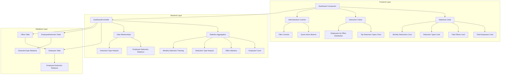
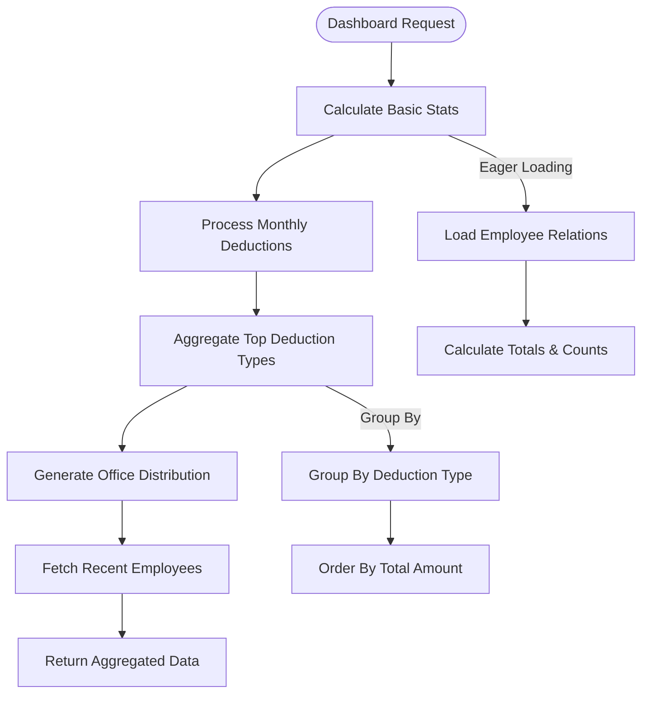

# Employee Overview Dashboard

<cite>
**Referenced Files in This Document**
- [DashboardController.php](file://app\Http\Controllers\DashboardController.php)
- [dashboard.tsx](file://resources\js\pages\dashboard.tsx)
- [web.php](file://routes\web.php)
- [Employee.php](file://app\Models\Employee.php)
- [EmployeeDeduction.php](file://app\Models\EmployeeDeduction.php)
- [DeductionType.php](file://app\Models\DeductionType.php)
- [Office.php](file://app\Models\Office.php)
- [employee.d.ts](file://resources\js\types\employee.d.ts)
- [office.d.ts](file://resources\js\types\office.d.ts)
- [employee-deductions\index.tsx](file://resources\js\pages\employee-deductions\index.tsx)
</cite>

## Update Summary
**Changes Made**
- Complete replacement of basic dashboard with comprehensive employee deductions dashboard system
- Added new DashboardController with advanced analytics and statistical reporting
- Implemented sophisticated four-card statistics dashboard with interactive visualizations
- Integrated comprehensive administrative controls and quick action buttons
- Replaced simple employee management interface with dedicated deductions management system
- Added advanced data aggregation including monthly deduction tracking and top deduction types analysis

## Table of Contents
1. [Introduction](#introduction)
2. [System Architecture](#system-architecture)
3. [Dashboard Components](#dashboard-components)
4. [Statistical Analytics System](#statistical-analytics-system)
5. [Interactive Data Visualization](#interactive-data-visualization)
6. [Administrative Controls](#administrative-controls)
7. [Data Aggregation and Reporting](#data-aggregation-and-reporting)
8. [User Interface Components](#user-interface-components)
9. [Performance Optimization](#performance-optimization)
10. [Integration Patterns](#integration-patterns)
11. [Troubleshooting Guide](#troubleshooting-guide)
12. [Conclusion](#conclusion)

## Introduction
The Employee Overview Dashboard has been completely transformed into a sophisticated employee deductions analytics platform. This comprehensive system replaces the previous basic dashboard with a feature-rich interface designed for payroll administrators and HR professionals managing employee compensation deductions. The new dashboard features advanced statistical cards, interactive visualizations, and comprehensive administrative controls, providing real-time insights into workforce compensation patterns and deduction management.

The system leverages Laravel's backend architecture with React frontend components to deliver a modern Single Page Application (SPA) experience with sophisticated data visualization, responsive design principles, and comprehensive analytics capabilities.

**Updated** The dashboard now focuses specifically on employee deduction management, featuring four main statistical cards, interactive charts, and comprehensive administrative controls for payroll operations.

## System Architecture
The dashboard system implements a modern client-server architecture with React frontend components communicating with Laravel backend services through Inertia.js for seamless page transitions and state management.

**Diagram sources**
- [dashboard.tsx:49-283](file://resources\js\pages\dashboard.tsx#L49-L283)
- [DashboardController.php:14-87](file://app\Http\Controllers\DashboardController.php#L14-L87)

The architecture ensures efficient data loading through optimized database queries and relationship eager loading, reducing server response times while providing comprehensive analytics data.

**Section sources**
- [DashboardController.php:12-89](file://app\Http\Controllers\DashboardController.php#L12-L89)
- [dashboard.tsx:1-284](file://resources\js\pages\dashboard.tsx#L1-L284)

## Dashboard Components
The dashboard consists of four primary statistical cards that provide comprehensive overview of employee deduction metrics. Each card features sophisticated design elements including colored icons, descriptive text, and currency formatting for financial data presentation.

### Statistical Cards System
**Updated** The four main statistical cards provide essential metrics for payroll administration:

1. **Total Employees Card**: Displays registered employee count with user icon and blue color scheme
2. **Total Offices Card**: Shows department count with building icon and emerald green color scheme  
3. **Deduction Types Card**: Lists active deduction categories with file text icon and purple color scheme
4. **Monthly Deductions Card**: Presents current month's deduction statistics with currency formatting and employee count

### Interactive Visualizations
**Updated** The dashboard includes sophisticated data visualization components:

- **Top Deduction Types**: Bar chart-style display showing highest deduction categories by amount
- **Employees by Office**: Grid layout displaying department distribution with employee counts
- **Recent Employees**: List view with avatar display and total deduction amounts

### Administrative Controls
**Updated** Comprehensive administrative controls provide quick access to payroll management functions:

- **View Deductions**: Direct navigation to employee deduction management
- **Employees**: Access to employee directory and management
- **Deduction Types**: Management of deduction category configurations
- **Add Employee**: Quick creation of new employee records

**Section sources**
- [dashboard.tsx:50-109](file://resources\js\pages\dashboard.tsx#L50-L109)
- [dashboard.tsx:114-186](file://resources\js\pages\dashboard.tsx#L114-L186)
- [dashboard.tsx:219-279](file://resources\js\pages\dashboard.tsx#L219-L279)

## Statistical Analytics System
The DashboardController implements sophisticated analytics aggregation through optimized database queries and relationship management. The system calculates key metrics in real-time while maintaining performance through efficient query patterns.

### Statistics Aggregation
**Updated** The controller performs comprehensive data aggregation:

- **Total Employees**: Simple count of all registered employees
- **Total Offices**: Department count with employee distribution analysis
- **Active Deduction Types**: Filtered count of currently active deduction categories
- **Monthly Deductions**: Complex aggregation including count, total amount, and unique employee tracking

### Data Processing Logic
**Updated** Advanced data processing includes:

- **Time-based Filtering**: Current month/year calculation for temporal data
- **Relationship Aggregation**: Eager loading of related models with sum calculations
- **Top Category Analysis**: Grouping and ordering deduction types by total amount
- **Employee Distribution**: Office-based employee counting with limits

**Diagram sources**
- [DashboardController.php:16-67](file://app\Http\Controllers\DashboardController.php#L16-L67)

**Section sources**
- [DashboardController.php:14-87](file://app\Http\Controllers\DashboardController.php#L14-L87)

## Interactive Data Visualization
The dashboard implements sophisticated data visualization components that transform raw statistical data into actionable insights through interactive elements and responsive design.

### Statistical Card Design
**Updated** Each statistical card features:

- **Icon Integration**: Color-coded circular backgrounds with white icons
- **Dynamic Value Display**: Large, bold typography for key metrics
- **Descriptive Text**: Secondary text providing context and breakdown information
- **Responsive Layout**: Grid-based arrangement adapting to different screen sizes

### Data Presentation Components
**Updated** Interactive visualization components include:

- **Top Deduction Types**: Horizontal layout with icon, name, entry count, and formatted currency amount
- **Employees with Deductions**: Clickable list items with avatar fallback, employee information, and total deduction display
- **Office Distribution**: Five-column grid showing department names, codes, and employee counts

### Currency Formatting System
**Updated** Sophisticated currency formatting ensures consistent financial data presentation:

- **Philippine Peso Localization**: 'en-PH' locale with PHP currency code
- **Integer Formatting**: Zero decimal places for clean currency display
- **Consistent Application**: Applied across all financial metrics and visualizations

**Section sources**
- [dashboard.tsx:41-47](file://resources\js\pages\dashboard.tsx#L41-L47)
- [dashboard.tsx:124-144](file://resources\js\pages\dashboard.tsx#L124-L144)
- [dashboard.tsx:159-183](file://resources\js\pages\dashboard.tsx#L159-L183)

## Administrative Controls
The dashboard provides comprehensive administrative controls through intuitive button-based interfaces that facilitate quick navigation to payroll management functions.

### Quick Action System
**Updated** Four primary administrative actions provide immediate access to key functions:

- **View Deductions**: Navigate to comprehensive deduction management interface
- **Employees**: Access employee directory and management capabilities
- **Deduction Types**: Manage deduction category configurations and active status
- **Add Employee**: Create new employee records with streamlined form access

### Interactive Elements
**Updated** Administrative controls feature:

- **Visual Feedback**: Hover states with background color transitions
- **Icon Integration**: Appropriate icons representing each administrative function
- **Text Descriptions**: Supporting text explaining each action's purpose
- **Responsive Design**: Grid-based layout adapting to different screen sizes

### Navigation Integration
**Updated** Administrative controls integrate seamlessly with the overall dashboard navigation:

- **Consistent Styling**: Match the dashboard's color scheme and design language
- **Accessibility**: Proper contrast ratios and interactive affordances
- **Performance**: Client-side navigation without full page reloads

**Section sources**
- [dashboard.tsx:226-277](file://resources\js\pages\dashboard.tsx#L226-L277)

## Data Aggregation and Reporting
The dashboard implements comprehensive data aggregation through sophisticated database queries and relationship management, providing real-time insights into employee deduction patterns and organizational metrics.

### Database Query Optimization
**Updated** The system employs optimized query patterns:

- **Single Query Aggregation**: Efficient counting and summing in a single database operation
- **Relationship Eager Loading**: Prevents N+1 query problems through strategic relationship loading
- **Temporal Filtering**: Dynamic month/year filtering for current period analysis
- **Limit Constraints**: Strategic limiting for top results and recent data display

### Relationship Management
**Updated** Complex relationship handling includes:

- **Employee-Deduction Relations**: Sum calculations with pay period filtering
- **Deduction-Type Analysis**: Category-based grouping with total amount computation
- **Office-Employee Distribution**: Count aggregation with ordering and limiting
- **Multi-Level Aggregation**: Hierarchical data processing for comprehensive reporting

### Data Transformation
**Updated** Raw database results undergo sophisticated transformation:

- **Type Casting**: Proper conversion of numeric and boolean values
- **Formatting**: Currency formatting for financial metrics
- **Structuring**: Organized data structures for frontend consumption
- **Validation**: Null checking and fallback value provision

**Section sources**
- [DashboardController.php:24-67](file://app\Http\Controllers\DashboardController.php#L24-L67)
- [Employee.php:61-64](file://app\Models\Employee.php#L61-L64)
- [EmployeeDeduction.php:26-34](file://app\Models\EmployeeDeduction.php#L26-L34)

## User Interface Components
The dashboard implements a modern, responsive user interface with sophisticated component design and interaction patterns optimized for payroll administration workflows.

### Layout Architecture
**Updated** The dashboard follows a structured layout pattern:

- **Header Section**: Clear title and description with current period information
- **Statistics Grid**: Four-card layout arranged in responsive grid pattern
- **Visualization Areas**: Two main content sections with complementary data presentation
- **Action Controls**: Bottom-aligned administrative controls for quick access

### Component Styling
**Updated** Visual design elements include:

- **Card-Based Design**: Consistent card layouts with subtle shadows and borders
- **Color Coding**: Strategic use of color schemes for different metric categories
- **Typography Hierarchy**: Clear visual hierarchy with bold metrics and supporting text
- **Icon Integration**: Contextual icons enhancing visual communication

### Responsive Design
**Updated** The interface adapts to various screen sizes:

- **Mobile Optimization**: Single column layout on small screens
- **Tablet Adaptation**: Dual column layout for medium screens
- **Desktop Enhancement**: Multi-column grid for optimal desktop experience
- **Flexible Components**: Cards and grids that resize based on available space

**Section sources**
- [dashboard.tsx:84-109](file://resources\js\pages\dashboard.tsx#L84-L109)
- [dashboard.tsx:112-216](file://resources\js\pages\dashboard.tsx#L112-L216)

## Performance Optimization
The dashboard system implements several performance optimization strategies to ensure responsive user experience with comprehensive data visualization and real-time analytics.

### Database Query Optimization
**Updated** Strategic query optimization includes:

- **Aggregation Queries**: Single query operations for count and sum calculations
- **Relationship Loading**: Eager loading to prevent N+1 query problems
- **Index Utilization**: Proper use of database indexes for filtering operations
- **Result Limiting**: Strategic limiting for top results and recent data

### Frontend Performance
**Updated** Client-side optimizations include:

- **Component Memoization**: React.memo for stable data presentation
- **Event Delegation**: Efficient event handling for interactive elements
- **Lazy Loading**: Dynamic imports for non-critical components
- **State Management**: Optimized state updates preventing unnecessary re-renders

### Asset Optimization
**Updated** Resource optimization strategies:

- **Icon Loading**: Efficient icon rendering with minimal bundle impact
- **Image Handling**: Avatar fallback system preventing broken image requests
- **CSS Optimization**: Tailwind utility classes for efficient styling
- **Bundle Size**: Strategic component splitting for faster initial load

**Section sources**
- [DashboardController.php:39-57](file://app\Http\Controllers\DashboardController.php#L39-L57)
- [dashboard.tsx:165-182](file://resources\js\pages\dashboard.tsx#L165-L182)

## Integration Patterns
The dashboard integrates seamlessly with the broader application ecosystem through well-defined patterns that ensure consistency across the payroll management system.

### Routing Integration
**Updated** The dashboard integrates with the application routing system:

- **Named Routes**: Consistent naming for navigation and programmatic access
- **Breadcrumb Support**: Automatic breadcrumb generation for navigation context
- **Middleware Integration**: Authentication and authorization through middleware chain
- **Route Parameters**: Flexible parameter handling for dynamic content

### Component Integration
**Updated** Frontend component integration patterns:

- **Layout System**: Consistent AppLayout wrapper for unified styling
- **Type Safety**: TypeScript interfaces ensuring data contract compliance
- **Event Handling**: Standardized event patterns for interactive elements
- **State Management**: Consistent state patterns across component hierarchy

### Data Flow Integration
**Updated** Data flow patterns ensure consistency:

- **Server-Side Rendering**: Inertia.js integration for initial page loads
- **Client-Side Navigation**: Seamless navigation without full page refreshes
- **Real-Time Updates**: State synchronization for dynamic content updates
- **Error Handling**: Consistent error handling patterns across the application

**Section sources**
- [web.php:24-25](file://routes\web.php#L24-L25)
- [dashboard.tsx:82-83](file://resources\js\pages\dashboard.tsx#L82-L83)

## Troubleshooting Guide
Common issues encountered with the Employee Deductions Dashboard typically relate to data loading, permission validation, and component rendering. The following troubleshooting steps address typical scenarios:

### Data Loading Issues
**Updated** Verify that the DashboardController is correctly aggregating statistics:

- Check database connectivity and query execution
- Validate that employee-deduction relationships are properly established
- Ensure that current month filtering logic is working correctly
- Verify that top deduction types aggregation is functioning

### Permission and Access Control
**Updated** Ensure proper authentication and authorization:

- Verify that users have appropriate permissions for payroll data access
- Check that middleware is correctly protecting dashboard routes
- Validate that route authentication is properly configured

### Frontend Component Rendering
**Updated** Troubleshoot component rendering issues:

- Check for JavaScript errors in browser console
- Verify that all required dependencies are properly loaded
- Validate TypeScript compilation and type checking
- Ensure proper component prop interfaces are maintained

### Statistical Data Accuracy
**Updated** Verify data accuracy and formatting:

- Check that currency formatting is applied consistently
- Validate that statistical calculations match database queries
- Ensure that time-based filtering correctly identifies current period
- Verify that relationship aggregations are producing expected results

### Performance Issues
**Updated** Address performance bottlenecks:

- Monitor database query execution times
- Check for excessive re-renders in React components
- Verify that component memoization is working effectively
- Ensure proper caching strategies are implemented

**Section sources**
- [DashboardController.php:14-87](file://app\Http\Controllers\DashboardController.php#L14-L87)
- [dashboard.tsx:49-283](file://resources\js\pages\dashboard.tsx#L49-L283)

## Conclusion
The Employee Overview Dashboard has evolved into a comprehensive employee deductions analytics platform that provides sophisticated payroll management capabilities. The system successfully balances advanced functionality with performance optimization through careful architectural decisions and implementation patterns.

**Updated** The comprehensive dashboard system establishes a robust foundation for enterprise-level payroll administration, featuring four main statistical cards, interactive visualizations, and comprehensive administrative controls. The system provides an excellent foundation for employee deduction management applications requiring real-time analytics, interactive data visualization, and comprehensive administrative functionality.

Key strengths of the implementation include efficient database query optimization, sophisticated data aggregation patterns, responsive design principles, and comprehensive type safety through TypeScript integration. The dashboard provides comprehensive payroll analytics while maintaining extensibility for future enhancements and specialized management functionalities.

The addition of the advanced statistical cards and interactive visualizations significantly enhances user experience by providing immediate insights into payroll operations while maintaining professional appearance and consistent performance standards throughout the application. The system represents a mature, production-ready solution for employee deduction management and payroll analytics.