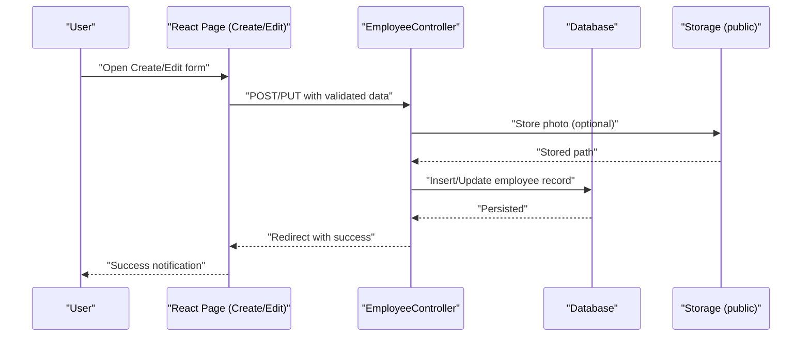
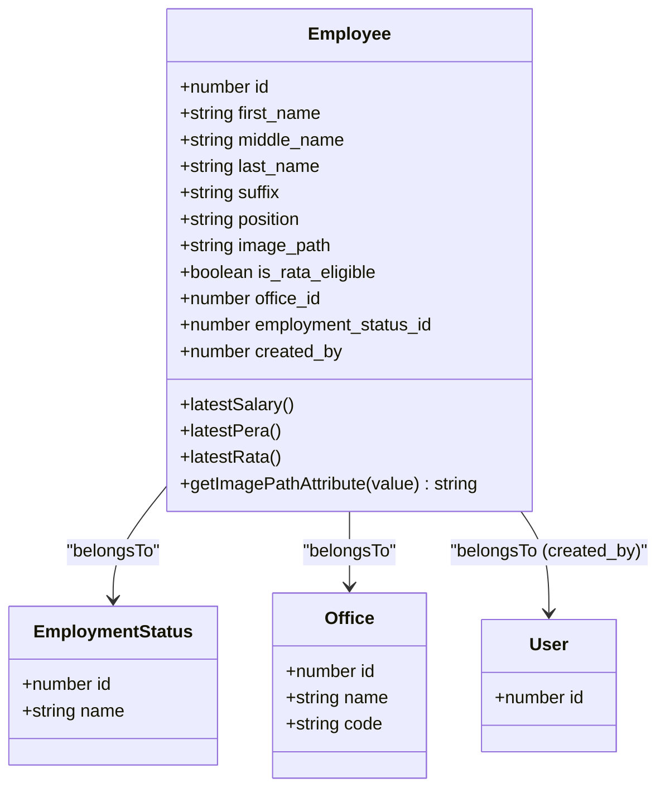
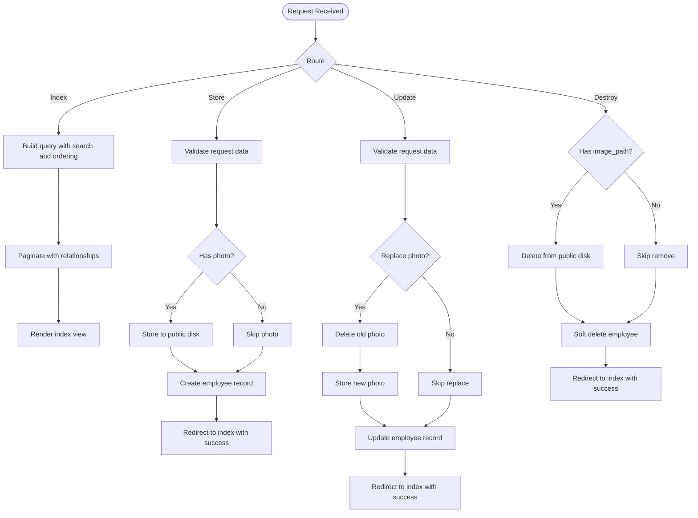
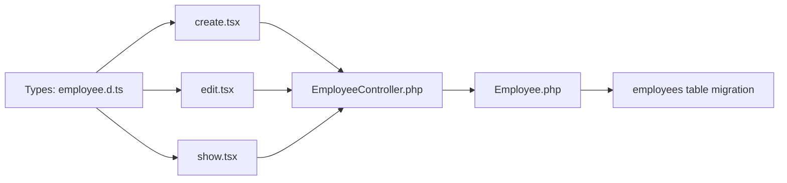

# Employee Profile Management

<cite>
**Referenced Files in This Document**
- [Employee.php](file://app/Models/Employee.php)
- [EmployeeController.php](file://app/Http/Controllers/EmployeeController.php)
- [EmployeeManage.php](file://app/Http/Controllers/EmployeeManage.php)
- [2026_03_19_022838_create_employees_table.php](file://database/migrations/2026_03_19_022838_create_employees_table.php)
- [employee.d.ts](file://resources/js/types/employee.d.ts)
- [show.tsx](file://resources/js/pages/settings/Employee/show.tsx)
- [create.tsx](file://resources/js/pages/settings/Employee/create.tsx)
- [edit.tsx](file://resources/js/pages/settings/Employee/edit.tsx)
- [overview.tsx](file://resources/js/pages/settings/Employee/manage/overview.tsx)
- [compensation.tsx](file://resources/js/pages/settings/Employee/manage/compensation.tsx)
- [rata.tsx](file://resources/js/pages/settings/Employee/manage/rata.tsx)
- [pera.tsx](file://resources/js/pages/settings/Employee/manage/pera.tsx)
</cite>

## Table of Contents
1. [Introduction](#introduction)
2. [Project Structure](#project-structure)
3. [Core Components](#core-components)
4. [Architecture Overview](#architecture-overview)
5. [Detailed Component Analysis](#detailed-component-analysis)
6. [Dependency Analysis](#dependency-analysis)
7. [Performance Considerations](#performance-considerations)
8. [Troubleshooting Guide](#troubleshooting-guide)
9. [Conclusion](#conclusion)

## Introduction
This document describes the employee profile management and display functionality of the application. It covers the employee profile structure, including personal information, contact details, position, and organizational details. It explains profile viewing capabilities, data presentation formats, and profile completeness indicators. It also documents the profile overview section showing key employee information, compensation details, and status indicators, along with profile enhancement features, data validation rules, and profile update procedures. Finally, it addresses profile security, access controls, and data privacy considerations.

## Project Structure
The employee profile system spans backend Laravel models/controllers and frontend React/Inertia components. The backend defines the employee model and controller actions for CRUD operations, while the frontend provides forms for creation and editing, a compact profile viewer, and a management dashboard with overview and compensation sections.

```mermaid
graph TB
subgraph "Backend"
M_Employee["Model: Employee<br/>app/Models/Employee.php"]
C_Employee["Controller: EmployeeController<br/>app/Http/Controllers/EmployeeController.php"]
C_Manage["Controller: EmployeeManage<br/>app/Http/Controllers/EmployeeManage.php"]
M_Migration["Migration: employees table<br/>database/migrations/2026_03_19_022838_create_employees_table.php"]
end
subgraph "Frontend"
T_EmployeeTypes["Types: Employee<br/>resources/js/types/employee.d.ts"]
P_Create["Page: Create Employee<br/>resources/js/pages/settings/Employee/create.tsx"]
P_Edit["Page: Edit Employee<br/>resources/js/pages/settings/Employee/edit.tsx"]
P_Show["Page: Employee Show Modal<br/>resources/js/pages/settings/Employee/show.tsx"]
P_Overview["Page: Overview<br/>resources/js/pages/settings/Employee/manage/overview.tsx"]
P_Compensation["Page: Compensation<br/>resources/js/pages/settings/Employee/manage/compensation.tsx"]
P_Rata["Page: RATA Table<br/>resources/js/pages/settings/Employee/manage/rata.tsx"]
P_Pera["Page: PERA Table<br/>resources/js/pages/settings/Employee/manage/pera.tsx"]
end
M_Migration --> M_Employee
C_Employee --> M_Employee
C_Manage --> P_Overview
C_Manage --> P_Compensation
P_Create --> C_Employee
P_Edit --> C_Employee
P_Show --> C_Employee
T_EmployeeTypes --> P_Create
T_EmployeeTypes --> P_Edit
T_EmployeeTypes --> P_Show
```

**Diagram sources**
- [Employee.php:10-104](file://app/Models/Employee.php#L10-L104)
- [EmployeeController.php:12-139](file://app/Http/Controllers/EmployeeController.php#L12-L139)
- [EmployeeManage.php:8-15](file://app/Http/Controllers/EmployeeManage.php#L8-L15)
- [2026_03_19_022838_create_employees_table.php:14-27](file://database/migrations/2026_03_19_022838_create_employees_table.php#L14-L27)
- [employee.d.ts:8-29](file://resources/js/types/employee.d.ts#L8-L29)
- [create.tsx:33-283](file://resources/js/pages/settings/Employee/create.tsx#L33-L283)
- [edit.tsx:28-311](file://resources/js/pages/settings/Employee/edit.tsx#L28-L311)
- [show.tsx:28-157](file://resources/js/pages/settings/Employee/show.tsx#L28-L157)
- [overview.tsx:4-85](file://resources/js/pages/settings/Employee/manage/overview.tsx#L4-L85)
- [compensation.tsx:49-88](file://resources/js/pages/settings/Employee/manage/compensation.tsx#L49-L88)
- [rata.tsx:47-81](file://resources/js/pages/settings/Employee/manage/rata.tsx#L47-L81)
- [pera.tsx:47-81](file://resources/js/pages/settings/Employee/manage/pera.tsx#L47-L81)

**Section sources**
- [Employee.php:10-104](file://app/Models/Employee.php#L10-L104)
- [EmployeeController.php:12-139](file://app/Http/Controllers/EmployeeController.php#L12-L139)
- [EmployeeManage.php:8-15](file://app/Http/Controllers/EmployeeManage.php#L8-L15)
- [2026_03_19_022838_create_employees_table.php:14-27](file://database/migrations/2026_03_19_022838_create_employees_table.php#L14-L27)
- [employee.d.ts:8-29](file://resources/js/types/employee.d.ts#L8-L29)
- [create.tsx:33-283](file://resources/js/pages/settings/Employee/create.tsx#L33-L283)
- [edit.tsx:28-311](file://resources/js/pages/settings/Employee/edit.tsx#L28-L311)
- [show.tsx:28-157](file://resources/js/pages/settings/Employee/show.tsx#L28-L157)
- [overview.tsx:4-85](file://resources/js/pages/settings/Employee/manage/overview.tsx#L4-L85)
- [compensation.tsx:49-88](file://resources/js/pages/settings/Employee/manage/compensation.tsx#L49-L88)
- [rata.tsx:47-81](file://resources/js/pages/settings/Employee/manage/rata.tsx#L47-L81)
- [pera.tsx:47-81](file://resources/js/pages/settings/Employee/manage/pera.tsx#L47-L81)

## Core Components
- Employee model: Defines fillable attributes, casts, relationships, and helper accessors for images. Includes automatic population of creator and soft-deletion support.
- EmployeeController: Implements listing, creation, viewing/editing, updating, and deletion with validation and file handling.
- Frontend pages: Create, edit, and show modal components for employee data entry, updates, and compact display.
- Management dashboard: Overview cards and compensation tabs for salary, RATA, and PERA records.
- TypeScript types: Strong typing for employee entity and form requests.

Key profile structure fields:
- Personal information: first_name, middle_name, last_name, suffix
- Contact/position: position
- Organization: office_id, employment_status_id
- Media: image_path (stored via Laravel Storage)
- Metadata: created_by, timestamps, soft deletes

Validation rules include required fields for names and IDs, optional suffix and position, and image constraints for photo uploads.

**Section sources**
- [Employee.php:14-29](file://app/Models/Employee.php#L14-L29)
- [EmployeeController.php:54-87](file://app/Http/Controllers/EmployeeController.php#L54-L87)
- [employee.d.ts:8-29](file://resources/js/types/employee.d.ts#L8-L29)
- [create.tsx:37-99](file://resources/js/pages/settings/Employee/create.tsx#L37-L99)
- [edit.tsx:42-88](file://resources/js/pages/settings/Employee/edit.tsx#L42-L88)
- [show.tsx:58-111](file://resources/js/pages/settings/Employee/show.tsx#L58-L111)

## Architecture Overview
The system follows a layered architecture:
- Backend: Laravel Eloquent model with relationships to office and employment status, controller actions for CRUD, and middleware for Inertia rendering.
- Frontend: Inertia-driven React pages/components with typed props and form handling.
- Data persistence: Employees table with foreign keys to offices and employment statuses; images stored in public disk.

**Diagram sources**
- [EmployeeController.php:54-87](file://app/Http/Controllers/EmployeeController.php#L54-L87)
- [create.tsx:90-99](file://resources/js/pages/settings/Employee/create.tsx#L90-L99)
- [edit.tsx:79-88](file://resources/js/pages/settings/Employee/edit.tsx#L79-L88)

## Detailed Component Analysis

### Employee Model
The Employee model encapsulates:
- Fillable attributes for profile creation/update
- Boolean cast for eligibility flag
- Relationships: employment status, office, creator user, and collections for salary/PERA/RATA/deductions
- Helper to resolve image URLs from storage
- Automatic created_by population on creation

**Diagram sources**
- [Employee.php:14-29](file://app/Models/Employee.php#L14-L29)
- [Employee.php:31-44](file://app/Models/Employee.php#L31-L44)

**Section sources**
- [Employee.php:14-29](file://app/Models/Employee.php#L14-L29)
- [Employee.php:31-44](file://app/Models/Employee.php#L31-L44)
- [Employee.php:69-88](file://app/Models/Employee.php#L69-L88)
- [Employee.php:99-102](file://app/Models/Employee.php#L99-L102)

### EmployeeController
Responsibilities:
- Index: Searchable paginated listing with filters and eager-loaded relationships
- Create/Show: Render creation and edit views with dropdown options
- Store: Validation, optional photo upload, and creation
- Update: Validation, optional photo replacement, and update
- Destroy: Optional photo removal and soft-delete

Validation rules:
- Names: required, max length
- Suffix: nullable, max length
- Position: nullable, max length
- Employment/Office: required, must exist
- Photo: optional, image, max size, allowed MIME types
- Eligibility: boolean cast

**Diagram sources**
- [EmployeeController.php:14-41](file://app/Http/Controllers/EmployeeController.php#L14-L41)
- [EmployeeController.php:54-87](file://app/Http/Controllers/EmployeeController.php#L54-L87)
- [EmployeeController.php:101-126](file://app/Http/Controllers/EmployeeController.php#L101-L126)
- [EmployeeController.php:128-137](file://app/Http/Controllers/EmployeeController.php#L128-L137)

**Section sources**
- [EmployeeController.php:14-41](file://app/Http/Controllers/EmployeeController.php#L14-L41)
- [EmployeeController.php:54-87](file://app/Http/Controllers/EmployeeController.php#L54-L87)
- [EmployeeController.php:101-126](file://app/Http/Controllers/EmployeeController.php#L101-L126)
- [EmployeeController.php:128-137](file://app/Http/Controllers/EmployeeController.php#L128-L137)

### Frontend Types
The TypeScript types define:
- Employee interface with identifiers, personal info, position, office/employment status relations, and optional arrays/collections
- Create/update request shape for form submissions

These types guide form handling and component props across create, edit, and show modals.

**Section sources**
- [employee.d.ts:8-29](file://resources/js/types/employee.d.ts#L8-L29)
- [employee.d.ts:31-42](file://resources/js/types/employee.d.ts#L31-L42)

### Create Employee Page
Features:
- Photo preview and upload with revoke on unmount
- Form fields for names, suffix, position, office, and employment status
- RATA eligibility toggle
- Validation feedback and submission via Inertia

**Section sources**
- [create.tsx:33-283](file://resources/js/pages/settings/Employee/create.tsx#L33-L283)

### Edit Employee Page
Features:
- Existing photo preview and optional replacement/removal
- Controlled form fields bound to typed data
- Employment status selection and suffix dropdown
- Numeric formatting helpers for related inputs
- Submission via Inertia with method override

**Section sources**
- [edit.tsx:28-311](file://resources/js/pages/settings/Employee/edit.tsx#L28-L311)

### Employee Show Modal
Features:
- Compact profile header with avatar fallback initials
- Display of department code, employment status, RATA eligibility, and latest salary
- Action buttons: Delete (confirmation), Manage (navigate to management)

**Section sources**
- [show.tsx:28-157](file://resources/js/pages/settings/Employee/show.tsx#L28-L157)

### Management Dashboard
Overview:
- KPI cards for YTD gross earnings, active allowances, filed documents, and tenure
- Income distribution visualization and informational note
- Compensation tabs for Salary, RATA, and PERA with dedicated tables

Note: The current implementation uses static data for demonstration; integration with backend APIs would populate dynamic values.

**Section sources**
- [overview.tsx:4-85](file://resources/js/pages/settings/Employee/manage/overview.tsx#L4-L85)
- [compensation.tsx:49-88](file://resources/js/pages/settings/Employee/manage/compensation.tsx#L49-L88)
- [rata.tsx:47-81](file://resources/js/pages/settings/Employee/manage/rata.tsx#L47-L81)
- [pera.tsx:47-81](file://resources/js/pages/settings/Employee/manage/pera.tsx#L47-L81)

## Dependency Analysis
- Model dependencies: Employee depends on EmploymentStatus, Office, and User (creator). It also exposes collections for Salary, Pera, Rata, and EmployeeDeduction.
- Controller dependencies: EmployeeController depends on Employee model, EmploymentStatus, Office, and Storage for photo handling.
- Frontend dependencies: Pages depend on types, UI components, and Inertia for navigation and form submission.

**Diagram sources**
- [employee.d.ts:8-29](file://resources/js/types/employee.d.ts#L8-L29)
- [create.tsx:33-283](file://resources/js/pages/settings/Employee/create.tsx#L33-L283)
- [edit.tsx:28-311](file://resources/js/pages/settings/Employee/edit.tsx#L28-L311)
- [show.tsx:28-157](file://resources/js/pages/settings/Employee/show.tsx#L28-L157)
- [EmployeeController.php:12-139](file://app/Http/Controllers/EmployeeController.php#L12-L139)
- [Employee.php:10-104](file://app/Models/Employee.php#L10-L104)
- [2026_03_19_022838_create_employees_table.php:14-27](file://database/migrations/2026_03_19_022838_create_employees_table.php#L14-L27)

**Section sources**
- [employee.d.ts:8-29](file://resources/js/types/employee.d.ts#L8-L29)
- [EmployeeController.php:12-139](file://app/Http/Controllers/EmployeeController.php#L12-L139)
- [Employee.php:10-104](file://app/Models/Employee.php#L10-L104)
- [2026_03_19_022838_create_employees_table.php:14-27](file://database/migrations/2026_03_19_022838_create_employees_table.php#L14-L27)

## Performance Considerations
- Pagination: Listing uses pagination to limit result sets and reduce memory usage.
- Eager loading: Relationships are preloaded to avoid N+1 queries.
- Image handling: Photos are stored on the public disk; consider CDN integration for scalability.
- Rendering: The show modal renders compact information; avoid heavy computations in render paths.

[No sources needed since this section provides general guidance]

## Troubleshooting Guide
Common issues and resolutions:
- Photo upload failures: Ensure file constraints are met (allowed MIME types and size limits). Verify storage disk permissions.
- Validation errors: Review form field validations and error messages surfaced in the UI.
- Soft deletes: Deletion removes the record but keeps data; confirm restoration steps if needed.
- Relationship mismatches: Confirm foreign key existence and referential integrity.

**Section sources**
- [EmployeeController.php:54-87](file://app/Http/Controllers/EmployeeController.php#L54-L87)
- [EmployeeController.php:101-126](file://app/Http/Controllers/EmployeeController.php#L101-L126)
- [EmployeeController.php:128-137](file://app/Http/Controllers/EmployeeController.php#L128-L137)

## Conclusion
The employee profile management system combines a robust backend model and controller with a responsive frontend interface. It supports creating, updating, and displaying employee profiles, managing photos, and presenting overview and compensation data. The system enforces validation rules, handles media uploads securely, and leverages relationships for rich profile information. Future enhancements could integrate dynamic data for the management dashboard and strengthen access controls around sensitive profile information.