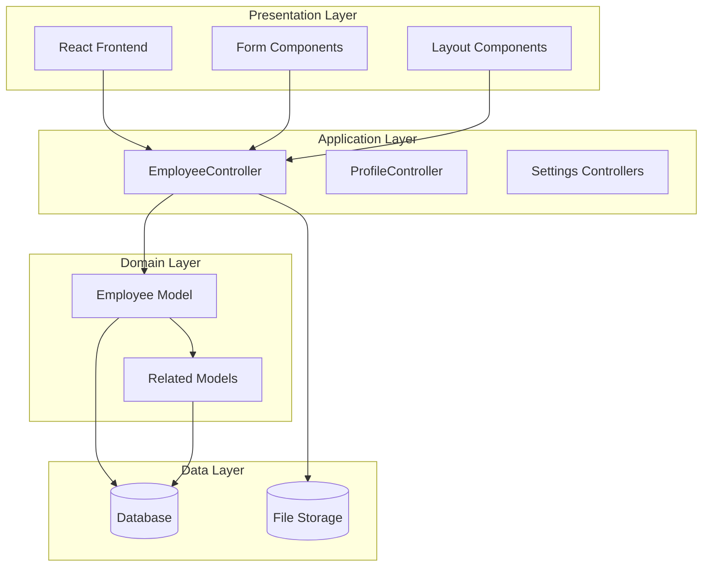
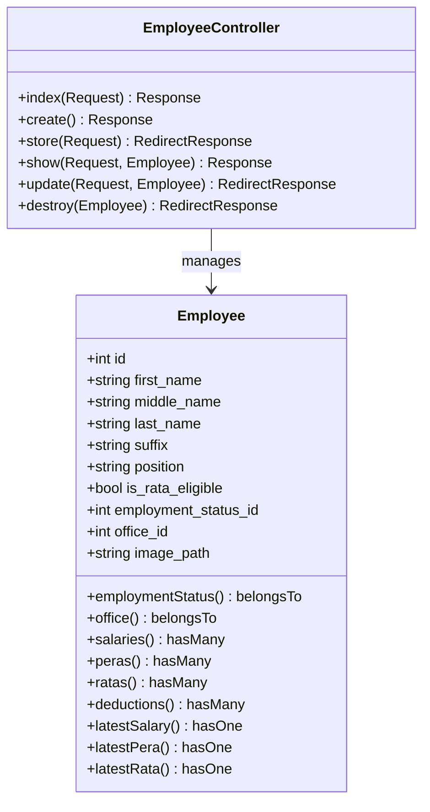
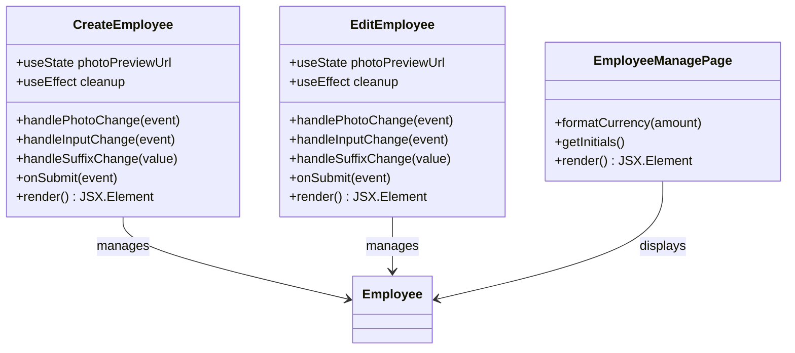
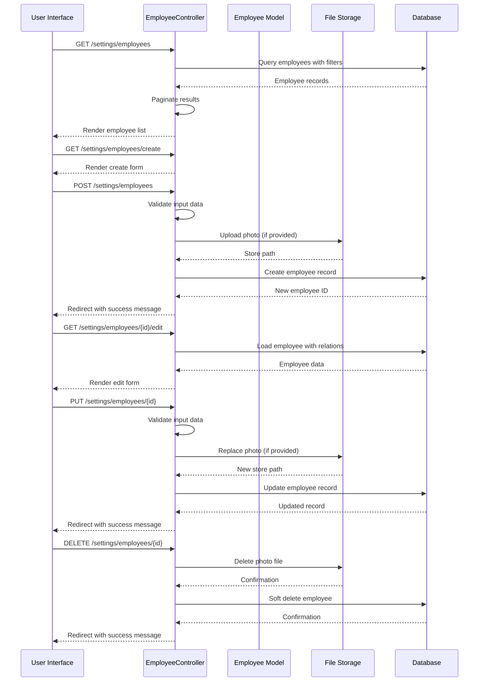
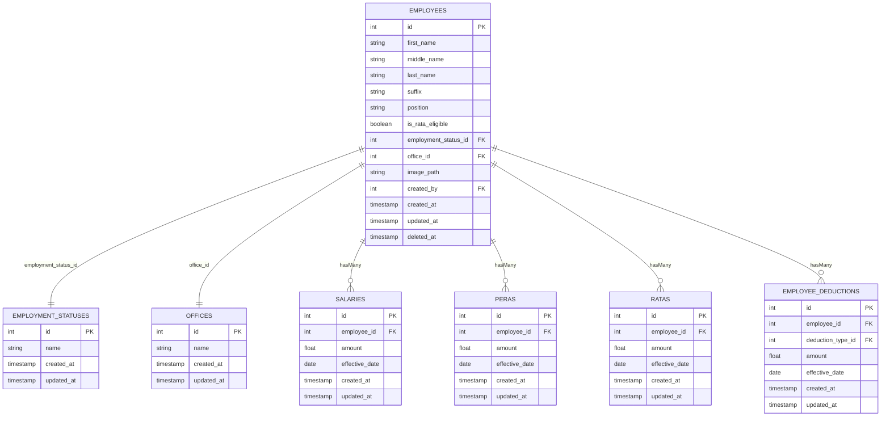
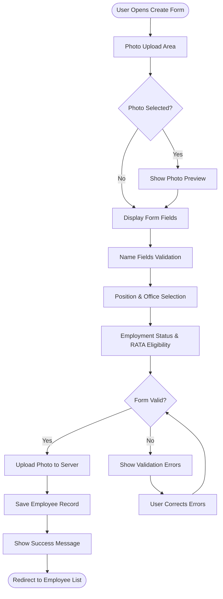
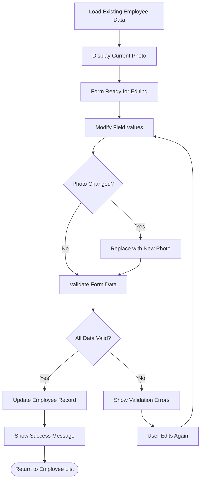
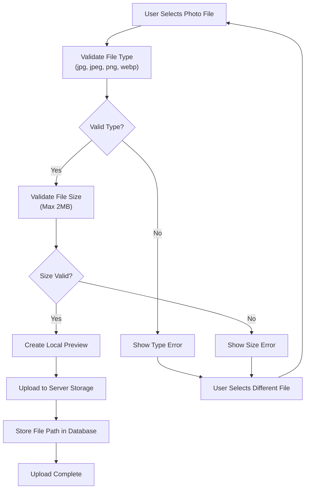

# Employee Profile Management

<cite>
**Referenced Files in This Document**
- [EmployeeController.php](file://app/Http/Controllers/EmployeeController.php)
- [Employee.php](file://app/Models/Employee.php)
- [create.tsx](file://resources/js/pages/settings/Employee/create.tsx)
- [edit.tsx](file://resources/js/pages/settings/Employee/edit.tsx)
- [manage/index.tsx](file://resources/js/pages/settings/Employee/manage/index.tsx)
- [employee.d.ts](file://resources/js/types/employee.d.ts)
</cite>

## Table of Contents
1. [Introduction](#introduction)
2. [System Architecture](#system-architecture)
3. [Core Components](#core-components)
4. [Employee Management Workflow](#employee-management-workflow)
5. [Data Model Analysis](#data-model-analysis)
6. [User Interface Components](#user-interface-components)
7. [File Upload and Storage](#file-upload-and-storage)
8. [Validation and Security](#validation-and-security)
9. [Performance Considerations](#performance-considerations)
10. [Troubleshooting Guide](#troubleshooting-guide)
11. [Conclusion](#conclusion)

## Introduction

The Employee Profile Management system is a comprehensive personnel management solution built with Laravel and React. This system provides complete employee lifecycle management including creation, modification, viewing, and deletion of employee profiles. The application features advanced functionalities such as employee compensation tracking, benefit management (PERA and RATA programs), deduction management, and payroll processing capabilities.

The system follows modern web development practices with a clean separation of concerns between backend PHP/Laravel controllers and frontend React components. It utilizes Inertia.js for seamless server-side rendering and client-side routing, providing a smooth user experience similar to single-page applications while maintaining server-side benefits.

## System Architecture

The Employee Profile Management system follows a layered architecture pattern with clear separation between presentation, business logic, and data access layers.

**Diagram sources**
- [EmployeeController.php:12-139](file://app/Http/Controllers/EmployeeController.php#L12-L139)
- [Employee.php:10-104](file://app/Models/Employee.php#L10-L104)

The architecture consists of three main layers:

- **Presentation Layer**: React-based frontend with reusable UI components and form handling
- **Application Layer**: Laravel controllers managing business logic and request handling
- **Domain Layer**: Eloquent models representing business entities and their relationships

## Core Components

### Employee Management Controller

The `EmployeeController` serves as the central hub for all employee-related operations, implementing the standard CRUD (Create, Read, Update, Delete) functionality with additional business logic for file uploads and data validation.

**Diagram sources**
- [EmployeeController.php:12-139](file://app/Http/Controllers/EmployeeController.php#L12-L139)
- [Employee.php:10-104](file://app/Models/Employee.php#L10-L104)

**Section sources**
- [EmployeeController.php:12-139](file://app/Http/Controllers/EmployeeController.php#L12-L139)
- [Employee.php:10-104](file://app/Models/Employee.php#L10-L104)

### Frontend Employee Management Components

The React-based frontend provides comprehensive employee management interfaces with real-time validation and user-friendly forms.

**Diagram sources**
- [create.tsx:33-283](file://resources/js/pages/settings/Employee/create.tsx#L33-L283)
- [edit.tsx:28-311](file://resources/js/pages/settings/Employee/edit.tsx#L28-L311)
- [manage/index.tsx:24-117](file://resources/js/pages/settings/Employee/manage/index.tsx#L24-L117)

**Section sources**
- [create.tsx:33-283](file://resources/js/pages/settings/Employee/create.tsx#L33-L283)
- [edit.tsx:28-311](file://resources/js/pages/settings/Employee/edit.tsx#L28-L311)
- [manage/index.tsx:24-117](file://resources/js/pages/settings/Employee/manage/index.tsx#L24-L117)

## Employee Management Workflow

The system implements a comprehensive workflow for employee profile management with validation, file handling, and data persistence.

**Diagram sources**
- [EmployeeController.php:14-137](file://app/Http/Controllers/EmployeeController.php#L14-L137)
- [create.tsx:90-99](file://resources/js/pages/settings/Employee/create.tsx#L90-L99)
- [edit.tsx:79-88](file://resources/js/pages/settings/Employee/edit.tsx#L79-L88)

**Section sources**
- [EmployeeController.php:14-137](file://app/Http/Controllers/EmployeeController.php#L14-L137)
- [create.tsx:90-99](file://resources/js/pages/settings/Employee/create.tsx#L90-L99)
- [edit.tsx:79-88](file://resources/js/pages/settings/Employee/edit.tsx#L79-L88)

## Data Model Analysis

The Employee model serves as the foundation for the entire employee management system, establishing relationships with related entities and providing convenient accessors for derived data.

**Diagram sources**
- [Employee.php:31-64](file://app/Models/Employee.php#L31-L64)
- [Employee.php:69-88](file://app/Models/Employee.php#L69-L88)

The data model establishes several key relationships:

- **Belongs To**: Employees belong to employment statuses and offices
- **Has Many**: Employees can have multiple salary, PERA, RATA, and deduction records
- **Latest Accessors**: Convenience methods for accessing most recent records
- **Soft Deletes**: Support for non-destructive removal of employee records

**Section sources**
- [Employee.php:31-88](file://app/Models/Employee.php#L31-L88)

## User Interface Components

The frontend components provide a comprehensive user experience for employee management with real-time validation and responsive design.

### Create Employee Form

The create form provides an intuitive interface for adding new employees with photo upload capabilities and real-time validation feedback.

**Diagram sources**
- [create.tsx:58-75](file://resources/js/pages/settings/Employee/create.tsx#L58-L75)
- [create.tsx:117-278](file://resources/js/pages/settings/Employee/create.tsx#L117-L278)

### Edit Employee Form

The edit form allows modification of existing employee information with photo replacement capabilities and maintains existing data integrity.

**Diagram sources**
- [edit.tsx:55-72](file://resources/js/pages/settings/Employee/edit.tsx#L55-L72)
- [edit.tsx:114-118](file://resources/js/pages/settings/Employee/edit.tsx#L114-L118)

**Section sources**
- [create.tsx:58-75](file://resources/js/pages/settings/Employee/create.tsx#L58-L75)
- [create.tsx:117-278](file://resources/js/pages/settings/Employee/create.tsx#L117-L278)
- [edit.tsx:55-72](file://resources/js/pages/settings/Employee/edit.tsx#L55-L72)
- [edit.tsx:114-118](file://resources/js/pages/settings/Employee/edit.tsx#L114-L118)

## File Upload and Storage

The system implements secure file upload functionality for employee photos with proper validation, storage management, and cleanup procedures.

### Photo Upload Process

**Diagram sources**
- [EmployeeController.php:69-71](file://app/Http/Controllers/EmployeeController.php#L69-L71)
- [create.tsx:122-146](file://resources/js/pages/settings/Employee/create.tsx#L122-L146)

### File Management Operations

The system handles various file operations including upload, replacement, and deletion with proper cleanup procedures.

**Section sources**
- [EmployeeController.php:69-132](file://app/Http/Controllers/EmployeeController.php#L69-L132)
- [create.tsx:122-175](file://resources/js/pages/settings/Employee/create.tsx#L122-L175)

## Validation and Security

The system implements comprehensive validation at both frontend and backend levels to ensure data integrity and security.

### Backend Validation Rules

The backend validation ensures data consistency and prevents malicious input:

- **Name Fields**: Required string validation with maximum length limits
- **Photo Upload**: Optional image validation with MIME type restrictions and size limits
- **Relationship Fields**: Required existence validation for employment status and office relationships
- **Boolean Fields**: Proper casting for RATA eligibility flag

### Frontend Validation Features

The frontend provides immediate feedback and prevents invalid submissions:

- **Real-time Input Validation**: Form validation triggers on field changes
- **Photo Preview**: Immediate visual feedback for uploaded images
- **Error Display**: Clear error messages for validation failures
- **Form State Management**: Maintains form state during editing operations

**Section sources**
- [EmployeeController.php:57-114](file://app/Http/Controllers/EmployeeController.php#L57-L114)
- [create.tsx:37-47](file://resources/js/pages/settings/Employee/create.tsx#L37-L47)

## Performance Considerations

The system incorporates several performance optimization strategies:

### Database Optimization

- **Eager Loading**: Strategic use of `with()` method to prevent N+1 query problems
- **Pagination**: Implemented with 50 records per page for efficient data loading
- **Indexing**: Foreign key relationships optimized for query performance
- **Soft Deletes**: Non-destructive removal preserving referential integrity

### Frontend Performance

- **Component Caching**: React components maintain state efficiently
- **Image Optimization**: Client-side preview generation reduces server load
- **Lazy Loading**: Tab-based interface loads content on demand
- **Minimal Re-renders**: Optimized state updates prevent unnecessary re-renders

### Scalability Features

- **Modular Architecture**: Clean separation enables easy scaling
- **API-like Structure**: Controller actions designed for future API expansion
- **File Storage Separation**: Media files stored separately from database records
- **Search Optimization**: Indexes on frequently searched fields (names, positions)

## Troubleshooting Guide

### Common Issues and Solutions

**Photo Upload Problems**
- **Issue**: Photos not uploading or displaying incorrectly
- **Solution**: Verify file type (jpg, jpeg, png, webp) and size (max 2MB) requirements
- **Debug Steps**: Check browser console for upload errors, verify server storage permissions

**Form Validation Errors**
- **Issue**: Form submission fails with validation errors
- **Solution**: Ensure all required fields are completed and meet validation criteria
- **Debug Steps**: Review error messages displayed on form, check network tab for validation responses

**Employee Search Not Working**
- **Issue**: Employee search returns unexpected results
- **Solution**: Verify search terms match expected name formats (first_name, middle_name, last_name, suffix)
- **Debug Steps**: Test with different search combinations, check database indexing

**Permission Issues**
- **Issue**: Users cannot access employee management features
- **Solution**: Verify user authentication and authorization roles
- **Debug Steps**: Check authentication middleware, review user role assignments

### Error Handling Procedures

The system implements robust error handling across all layers:

- **Frontend**: Comprehensive error state management and user feedback
- **Backend**: Structured exception handling with appropriate HTTP status codes
- **Database**: Transaction rollback on operation failures
- **File System**: Cleanup procedures for failed uploads

**Section sources**
- [EmployeeController.php:128-137](file://app/Http/Controllers/EmployeeController.php#L128-L137)
- [create.tsx:94-96](file://resources/js/pages/settings/Employee/create.tsx#L94-L96)

## Conclusion

The Employee Profile Management system provides a comprehensive solution for personnel administration with modern web development practices. The system successfully combines Laravel's robust backend capabilities with React's dynamic frontend to deliver an intuitive user experience.

Key strengths of the system include:

- **Complete CRUD Operations**: Full lifecycle management of employee profiles
- **Advanced Features**: Integration with compensation, benefits, and payroll systems
- **User Experience**: Responsive design with real-time validation and feedback
- **Security**: Comprehensive validation and secure file handling
- **Scalability**: Modular architecture supporting future enhancements

The system serves as a solid foundation for enterprise-level employee management, with clear extension points for additional features and integrations. The combination of server-side rendering and client-side interactivity provides optimal performance and user experience.