# Employee Reports Dashboard

<cite>
**Referenced Files in This Document**
- [DashboardController.php](file://app/Http/Controllers/DashboardController.php)
- [dashboard.tsx](file://resources/js/pages/dashboard.tsx)
- [EmployeeDeductionController.php](file://app/Http/Controllers/EmployeeDeductionController.php)
- [EmployeeController.php](file://app/Http/Controllers/EmployeeController.php)
- [Reports.tsx](file://resources/js/pages/Employees/Manage/Reports.tsx)
- [PrintReport.tsx](file://resources/js/pages/Employees/Manage/PrintReport.tsx)
- [Employee.php](file://app/Models/Employee.php)
- [EmployeeDeduction.php](file://app/Models/EmployeeDeduction.php)
- [DeductionType.php](file://app/Models/DeductionType.php)
- [Claim.php](file://app/Models/Claim.php)
- [web.php](file://routes/web.php)
- [employeeDeduction.d.ts](file://resources/js/types/employeeDeduction.d.ts)
- [claim.ts](file://resources/js/types/claim.ts)
- [employee.d.ts](file://resources/js/types/employee.d.ts)
</cite>

## Update Summary
**Changes Made**
- Added new PrintReport.tsx component with specialized print-friendly layout
- Enhanced Reports.tsx component with improved print preview dialog system
- Integrated dedicated print functionality for employee compensation and claims data
- Added comprehensive print styling and formatting capabilities

## Table of Contents
1. [Introduction](#introduction)
2. [Project Structure](#project-structure)
3. [Core Components](#core-components)
4. [Architecture Overview](#architecture-overview)
5. [Detailed Component Analysis](#detailed-component-analysis)
6. [Print System Enhancement](#print-system-enhancement)
7. [Dependency Analysis](#dependency-analysis)
8. [Performance Considerations](#performance-considerations)
9. [Troubleshooting Guide](#troubleshooting-guide)
10. [Conclusion](#conclusion)

## Introduction
The Employee Reports Dashboard is a comprehensive payroll and employee management system built with Laravel and React. This system provides real-time insights into employee deductions, manages payroll processing, tracks employee claims, and offers detailed reporting capabilities. The dashboard serves as the central hub for HR personnel and financial administrators to monitor and analyze employee compensation and benefit distributions across multiple offices and departments.

The system integrates modern web technologies including Inertia.js for seamless server-side rendering, TypeScript for type safety, and a robust Laravel backend with Eloquent ORM for data management. It supports advanced filtering, sorting, and aggregation features essential for large-scale employee management operations.

**Updated** Enhanced with dedicated print functionality for generating official employee compensation and claims reports with professional formatting and print optimization.

## Project Structure
The application follows a modular MVC architecture with clear separation of concerns between frontend React components and backend Laravel controllers. The structure emphasizes maintainability and scalability through organized file organization and consistent naming conventions.

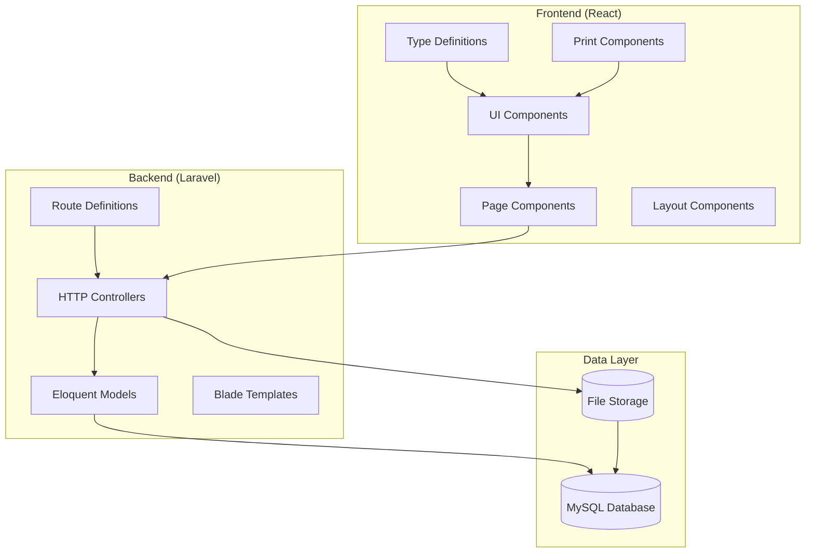

**Diagram sources**
- [DashboardController.php:12-87](file://app/Http/Controllers/DashboardController.php#L12-L87)
- [web.php:27-134](file://routes/web.php#L27-L134)

**Section sources**
- [DashboardController.php:1-89](file://app/Http/Controllers/DashboardController.php#L1-L89)
- [web.php:1-138](file://routes/web.php#L1-L138)

## Core Components

### Dashboard Analytics Engine
The dashboard controller serves as the central analytics engine, aggregating key metrics and generating comprehensive reports on employee deductions and organizational statistics.

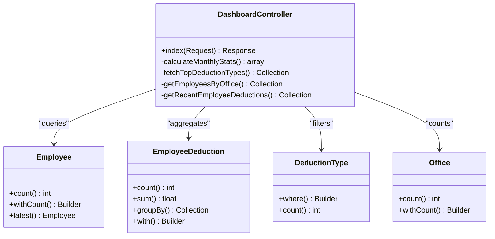

**Diagram sources**
- [DashboardController.php:14-87](file://app/Http/Controllers/DashboardController.php#L14-L87)
- [Employee.php:14-104](file://app/Models/Employee.php#L14-L104)
- [EmployeeDeduction.php:10-59](file://app/Models/EmployeeDeduction.php#L10-L59)
- [DeductionType.php:9-33](file://app/Models/DeductionType.php#L9-L33)

### Employee Management System
The employee management system provides comprehensive CRUD operations with advanced filtering capabilities and image management functionality.

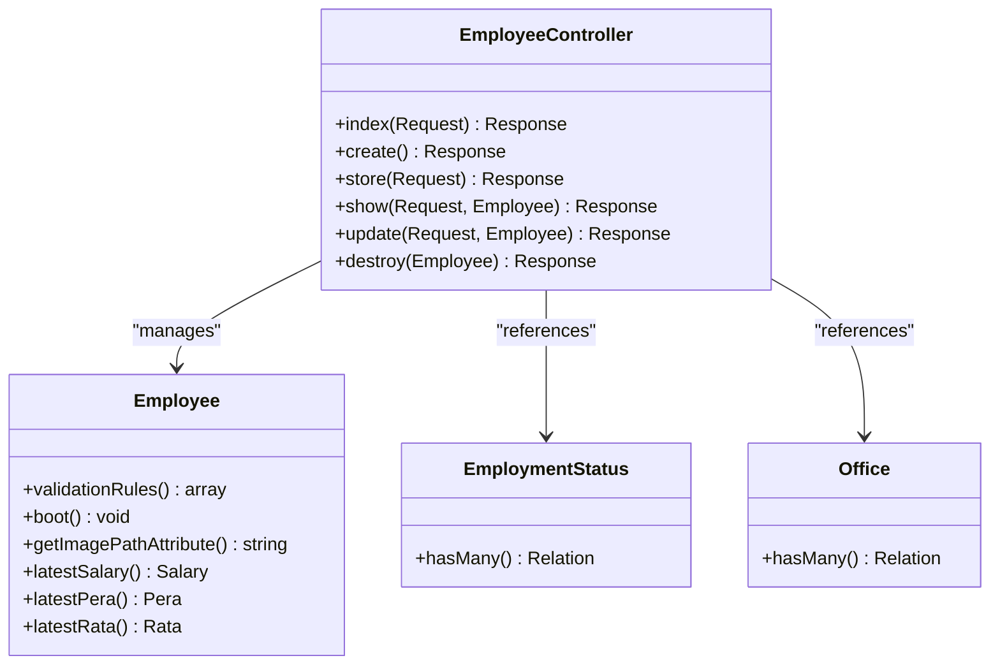

**Diagram sources**
- [EmployeeController.php:14-147](file://app/Http/Controllers/EmployeeController.php#L14-L147)
- [Employee.php:31-104](file://app/Models/Employee.php#L31-L104)

### Deduction Tracking System
The deduction tracking system manages employee deductions with period-specific filtering, duplicate prevention, and comprehensive reporting capabilities.

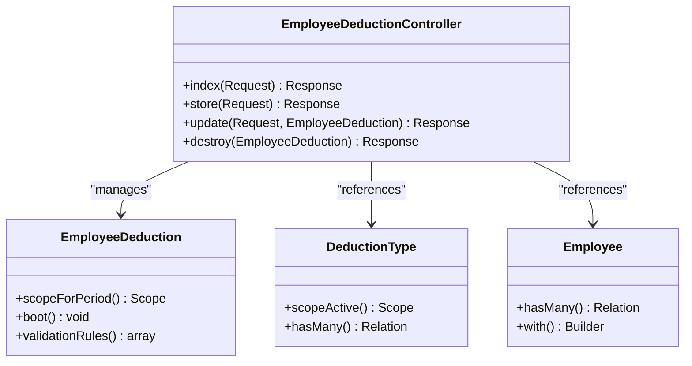

**Diagram sources**
- [EmployeeDeductionController.php:16-119](file://app/Http/Controllers/EmployeeDeductionController.php#L16-L119)
- [EmployeeDeduction.php:53-58](file://app/Models/EmployeeDeduction.php#L53-L58)

**Section sources**
- [DashboardController.php:14-87](file://app/Http/Controllers/DashboardController.php#L14-L87)
- [EmployeeController.php:14-147](file://app/Http/Controllers/EmployeeController.php#L14-L147)
- [EmployeeDeductionController.php:16-119](file://app/Http/Controllers/EmployeeDeductionController.php#L16-L119)

## Architecture Overview

The Employee Reports Dashboard employs a modern full-stack architecture combining Laravel's robust backend capabilities with React's dynamic frontend presentation layer.

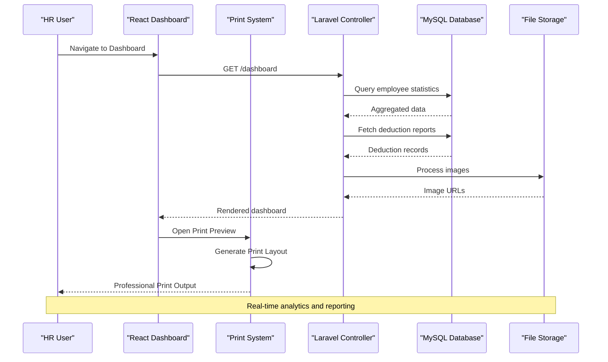

**Diagram sources**
- [DashboardController.php:14-87](file://app/Http/Controllers/DashboardController.php#L14-L87)
- [dashboard.tsx:49-284](file://resources/js/pages/dashboard.tsx#L49-L284)

The architecture implements several key design patterns:

- **MVC Pattern**: Clear separation between models, views, and controllers
- **Repository Pattern**: Eloquent models handle data access logic
- **Observer Pattern**: Automatic audit trail through model boot methods
- **Strategy Pattern**: Flexible deduction type management
- **Template Method Pattern**: Dedicated print layout generation

**Section sources**
- [dashboard.tsx:1-284](file://resources/js/pages/dashboard.tsx#L1-L284)
- [web.php:27-134](file://routes/web.php#L27-L134)

## Detailed Component Analysis

### Dashboard Analytics Implementation

The dashboard analytics system provides comprehensive insights through sophisticated data aggregation and filtering mechanisms.

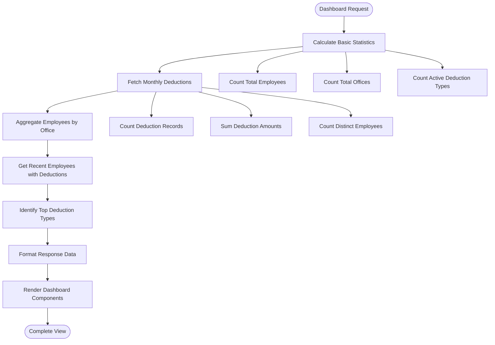

**Diagram sources**
- [DashboardController.php:16-67](file://app/Http/Controllers/DashboardController.php#L16-L67)

The analytics engine performs the following key operations:

1. **Real-time Statistics Calculation**: Instant aggregation of employee counts, office distribution, and active deduction types
2. **Monthly Period Filtering**: Dynamic filtering based on current month and year for accurate reporting
3. **Hierarchical Data Aggregation**: Multi-level grouping by office location and deduction type categories
4. **Performance Optimization**: Efficient database queries with appropriate indexing and eager loading

**Section sources**
- [DashboardController.php:14-87](file://app/Http/Controllers/DashboardController.php#L14-L87)

### Employee Reporting System

The employee reporting system provides detailed historical analysis of individual employee compensation and benefit records.

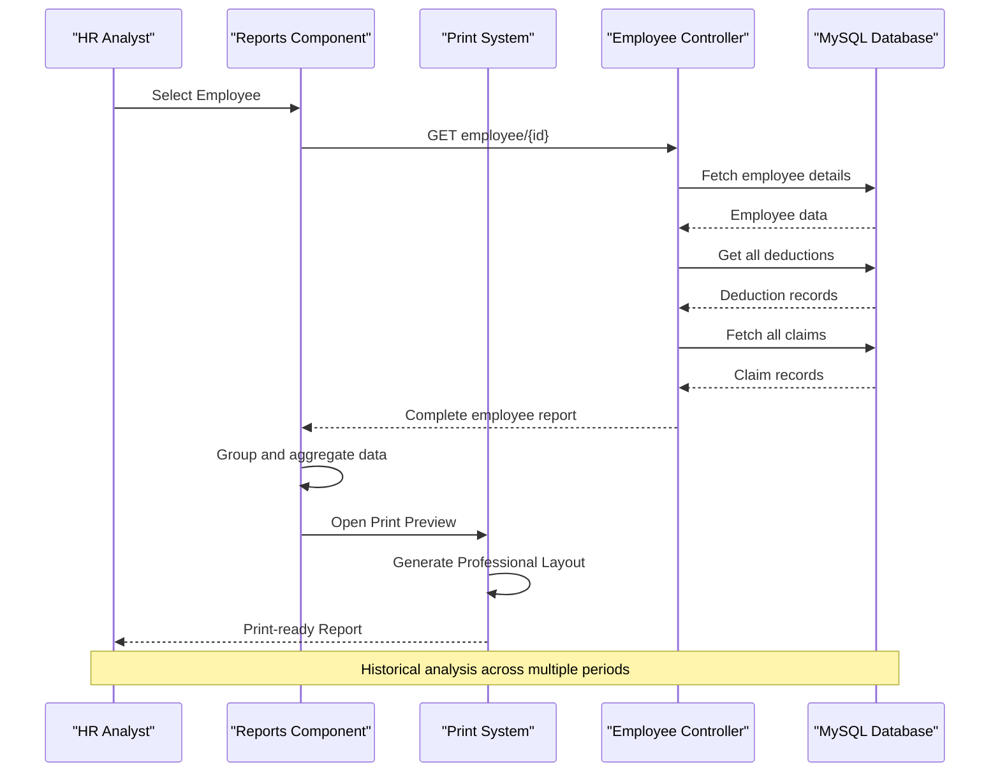

**Diagram sources**
- [Reports.tsx:35-248](file://resources/js/pages/Employees/Manage/Reports.tsx#L35-L248)

The reporting system implements advanced data processing algorithms:

- **Multi-dimensional Grouping**: Deductions grouped by pay period and year for trend analysis
- **Cumulative Calculations**: Running totals and yearly summaries for comprehensive financial analysis
- **Dynamic Currency Formatting**: Philippine Peso formatting with proper localization
- **Responsive Data Structures**: Optimized data shapes for efficient frontend rendering
- **Print Optimization**: Specialized layout generation for professional printing

**Section sources**
- [Reports.tsx:1-291](file://resources/js/pages/Employees/Manage/Reports.tsx#L1-L291)

### Data Model Relationships

The system's data model establishes comprehensive relationships between employees, deductions, and organizational units.

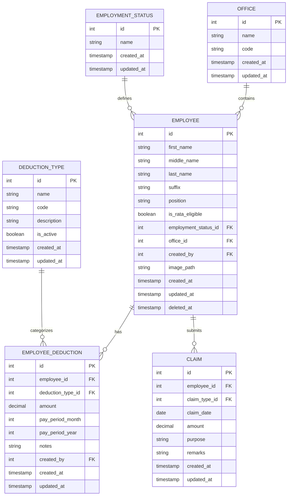

**Diagram sources**
- [Employee.php:14-104](file://app/Models/Employee.php#L14-L104)
- [EmployeeDeduction.php:10-59](file://app/Models/EmployeeDeduction.php#L10-L59)
- [DeductionType.php:9-33](file://app/Models/DeductionType.php#L9-L33)
- [Claim.php:12-36](file://app/Models/Claim.php#L12-L36)

**Section sources**
- [Employee.php:14-104](file://app/Models/Employee.php#L14-L104)
- [EmployeeDeduction.php:10-59](file://app/Models/EmployeeDeduction.php#L10-L59)
- [DeductionType.php:9-33](file://app/Models/DeductionType.php#L9-L33)
- [Claim.php:12-36](file://app/Models/Claim.php#L12-L36)

## Print System Enhancement

**New Section** The enhanced reporting system now includes a comprehensive print functionality designed for generating official employee compensation and claims reports.

### PrintReport Component Architecture

The PrintReport component provides a specialized print-friendly layout optimized for professional document generation.

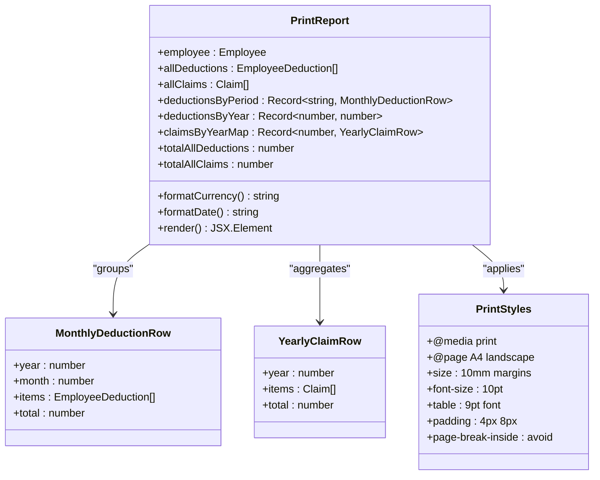

**Diagram sources**
- [PrintReport.tsx:37-302](file://resources/js/pages/Employees/Manage/PrintReport.tsx#L37-L302)

### Print Preview Dialog System

The enhanced Reports component now features an improved print preview dialog system that provides users with professional print-ready previews before generating documents.

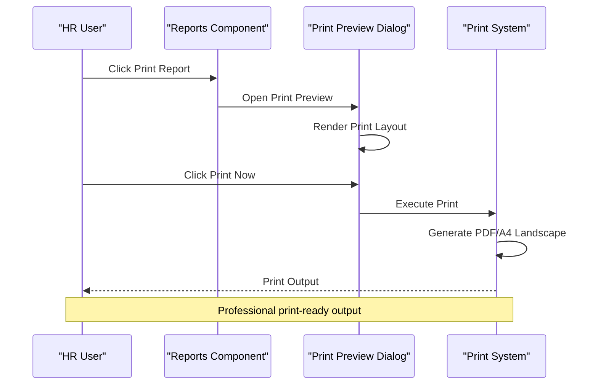

**Diagram sources**
- [Reports.tsx:77-88](file://resources/js/pages/Employees/Manage/Reports.tsx#L77-L88)
- [Reports.tsx:109-123](file://resources/js/pages/Employees/Manage/Reports.tsx#L109-L123)

### Print Layout Features

The print system implements several professional formatting features:

- **A4 Landscape Orientation**: Optimized for standard paper size and horizontal layout
- **Professional Typography**: 10pt font size with 9pt table fonts for readability
- **Compact Data Presentation**: Efficient use of space with minimal white areas
- **Color-accurate Printing**: Proper color adjustment for print media
- **Page Break Control**: Prevents content fragmentation across pages
- **Header and Footer**: Official report branding and date stamps

**Section sources**
- [PrintReport.tsx:1-305](file://resources/js/pages/Employees/Manage/PrintReport.tsx#L1-L305)
- [Reports.tsx:1-291](file://resources/js/pages/Employees/Manage/Reports.tsx#L1-L291)

## Dependency Analysis

The system maintains clean dependency relationships through well-defined interfaces and service boundaries.

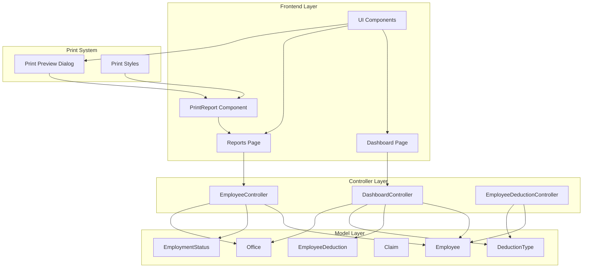

**Diagram sources**
- [DashboardController.php:5-10](file://app/Http/Controllers/DashboardController.php#L5-L10)
- [EmployeeController.php:5-10](file://app/Http/Controllers/EmployeeController.php#L5-L10)
- [EmployeeDeductionController.php:5-12](file://app/Http/Controllers/EmployeeDeductionController.php#L5-L12)

Key dependency characteristics:

- **Low Coupling**: Controllers depend on abstractions rather than concrete implementations
- **High Cohesion**: Related functionality is grouped within single controllers
- **Clear Interfaces**: Well-defined method signatures and return types
- **Type Safety**: Comprehensive TypeScript definitions for frontend components
- **Print System Integration**: Seamless integration between reporting and print functionality

**Section sources**
- [DashboardController.php:1-89](file://app/Http/Controllers/DashboardController.php#L1-L89)
- [EmployeeController.php:1-147](file://app/Http/Controllers/EmployeeController.php#L1-L147)
- [EmployeeDeductionController.php:1-119](file://app/Http/Controllers/EmployeeDeductionController.php#L1-L119)

## Performance Considerations

The system implements several performance optimization strategies:

### Database Optimization
- **Eager Loading**: Strategic use of `with()` and `withCount()` to prevent N+1 query problems
- **Indexing Strategy**: Proper indexing on frequently queried columns (pay_period_month, pay_period_year, employee_id)
- **Aggregation Queries**: Efficient use of `selectRaw()` and `groupBy()` for complex calculations
- **Pagination**: Implemented at database level to limit memory usage

### Frontend Performance
- **Component Memoization**: React.memo usage for expensive components
- **Virtual Scrolling**: For large datasets in employee lists
- **Code Splitting**: Dynamic imports for route-based lazy loading
- **Optimized Rendering**: Conditional rendering and efficient state updates
- **Print Component Optimization**: Specialized print layout generation with minimal overhead

### Print System Performance
- **Lazy Loading**: Print components loaded only when needed
- **Memory Management**: Proper cleanup of print content after printing
- **State Management**: Efficient handling of print preview state
- **Browser Compatibility**: Optimized print functionality across different browsers

### Caching Strategy
- **Query Results**: Caching of frequently accessed statistical data
- **Static Assets**: CDN optimization for images and UI components
- **Browser Caching**: Appropriate cache headers for static resources
- **Print Content**: Temporary caching of print layouts for quick reprints

## Troubleshooting Guide

### Common Issues and Solutions

**Dashboard Data Not Loading**
- Verify database connectivity and migration completion
- Check timezone configuration for accurate month/year calculations
- Ensure proper authentication middleware is applied

**Employee Images Not Displaying**
- Verify file permissions for storage/public/employees directory
- Check image upload validation rules and file size limits
- Confirm proper URL generation using Storage facade

**Deduction Duplicate Prevention**
- Review unique constraint logic in EmployeeDeductionController
- Verify pay period validation rules
- Check for concurrent submission conflicts

**Print Functionality Issues**
- Verify browser print dialog permissions
- Check CSS print styles compatibility
- Ensure proper print preview dialog initialization
- Validate print content rendering before printing

**Performance Issues**
- Monitor slow query logs for optimization opportunities
- Implement database indexing for filtered queries
- Consider query result caching for frequently accessed data
- Optimize print layout generation for large datasets

**Section sources**
- [EmployeeController.php:136-145](file://app/Http/Controllers/EmployeeController.php#L136-L145)
- [EmployeeDeductionController.php:76-85](file://app/Http/Controllers/EmployeeDeductionController.php#L76-L85)

## Conclusion

The Employee Reports Dashboard represents a sophisticated solution for comprehensive employee management and payroll analysis. The system successfully combines modern frontend development practices with robust backend architecture to deliver real-time insights and efficient operational workflows.

**Updated** The recent enhancement with dedicated print functionality significantly improves the system's professional capabilities, enabling the generation of official employee compensation and claims reports with optimal print formatting and layout optimization.

Key strengths of the implementation include:

- **Comprehensive Analytics**: Multi-dimensional reporting with drill-down capabilities
- **Scalable Architecture**: Well-designed MVC pattern supporting future enhancements
- **User Experience**: Intuitive interface with responsive design and smooth interactions
- **Data Integrity**: Robust validation, duplicate prevention, and audit trails
- **Performance Optimization**: Efficient queries, caching strategies, and frontend optimizations
- **Professional Print System**: Dedicated print functionality with A4 landscape formatting and professional styling
- **Print Preview Dialog**: Enhanced user experience with interactive print preview before document generation

The system provides a solid foundation for HR and financial operations, with clear extension points for additional features such as advanced reporting, integration with external systems, and enhanced mobile capabilities. The modular design ensures maintainability and facilitates team collaboration on feature development.

Future enhancement opportunities include implementing real-time notifications, advanced export capabilities, integration with payroll processing systems, expanded analytical dashboards with predictive modeling features, and enhanced print functionality for different document formats and templates.