# Employee Reports Dashboard

<cite>
**Referenced Files in This Document**
- [DashboardController.php](file://app/Http/Controllers/DashboardController.php)
- [dashboard.tsx](file://resources/js/pages/dashboard.tsx)
- [EmployeeDeductionController.php](file://app/Http/Controllers/EmployeeDeductionController.php)
- [EmployeeController.php](file://app/Http/Controllers/EmployeeController.php)
- [Reports.tsx](file://resources/js/pages/Employees/Manage/Reports.tsx)
- [PrintReport.tsx](file://resources/js/pages/Employees/Manage/PrintReport.tsx)
- [Employee.php](file://app/Models/Employee.php)
- [EmployeeDeduction.php](file://app/Models/EmployeeDeduction.php)
- [DeductionType.php](file://app/Models/DeductionType.php)
- [Claim.php](file://app/Models/Claim.php)
- [web.php](file://routes/web.php)
- [employeeDeduction.d.ts](file://resources/js/types/employeeDeduction.d.ts)
- [claim.ts](file://resources/js/types/claim.ts)
- [employee.d.ts](file://resources/js/types/employee.d.ts)
- [card.tsx](file://resources/js/components/ui/card.tsx)
- [table.tsx](file://resources/js/components/ui/table.tsx)
- [button.tsx](file://resources/js/components/ui/button.tsx)
- [dialog.tsx](file://resources/js/components/ui/dialog.tsx)
- [utils.ts](file://resources/js/lib/utils.ts)
- [app-layout.tsx](file://resources/js/layouts/app-layout.tsx)
- [use-mobile.tsx](file://resources/js/hooks/use-mobile.tsx)
</cite>

## Update Summary
**Changes Made**
- Enhanced card component with improved responsive design and size variants
- Improved table component with better mobile responsiveness and accessibility
- Upgraded button component with enhanced variant system and sizing options
- Enhanced dialog component with improved layout and spacing
- Added comprehensive utility functions for consistent styling
- Implemented responsive design patterns throughout the dashboard
- Enhanced print system with improved layout optimization

## Table of Contents
1. [Introduction](#introduction)
2. [Project Structure](#project-structure)
3. [Core Components](#core-components)
4. [Architecture Overview](#architecture-overview)
5. [Enhanced UI Component System](#enhanced-ui-component-system)
6. [Improved Data Presentation](#improved-data-presentation)
7. [Responsive Design Implementation](#responsive-design-implementation)
8. [Print System Enhancement](#print-system-enhancement)
9. [Performance Considerations](#performance-considerations)
10. [Troubleshooting Guide](#troubleshooting-guide)
11. [Conclusion](#conclusion)

## Introduction
The Employee Reports Dashboard is a comprehensive payroll and employee management system built with Laravel and React. This system provides real-time insights into employee deductions, manages payroll processing, tracks employee claims, and offers detailed reporting capabilities. The dashboard serves as the central hub for HR personnel and financial administrators to monitor and analyze employee compensation and benefit distributions across multiple offices and departments.

The system integrates modern web technologies including Inertia.js for seamless server-side rendering, TypeScript for type safety, and a robust Laravel backend with Eloquent ORM for data management. It supports advanced filtering, sorting, and aggregation features essential for large-scale employee management operations.

**Updated** Enhanced with improved UI components featuring better card layouts, responsive design patterns, and optimized data presentation for superior user experience across all device sizes.

## Project Structure
The application follows a modular MVC architecture with clear separation of concerns between frontend React components and backend Laravel controllers. The structure emphasizes maintainability and scalability through organized file organization and consistent naming conventions.

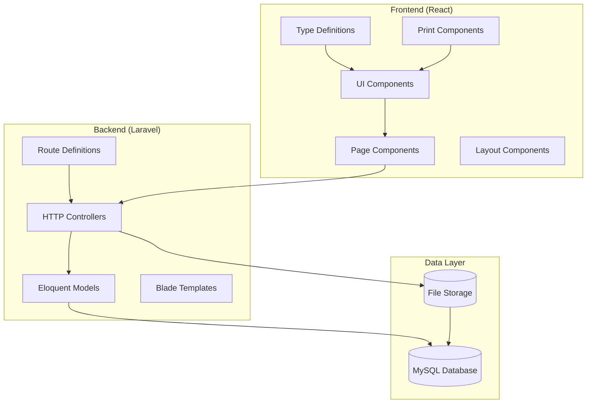

**Diagram sources**
- [DashboardController.php:12-87](file://app/Http/Controllers/DashboardController.php#L12-L87)
- [web.php:27-134](file://routes/web.php#L27-L134)

**Section sources**
- [DashboardController.php:1-89](file://app/Http/Controllers/DashboardController.php#L1-L89)
- [web.php:1-138](file://routes/web.php#L1-L138)

## Core Components

### Dashboard Analytics Engine
The dashboard controller serves as the central analytics engine, aggregating key metrics and generating comprehensive reports on employee deductions and organizational statistics.

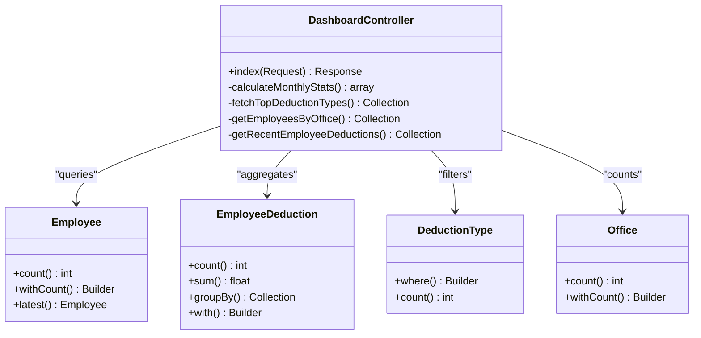

**Diagram sources**
- [DashboardController.php:14-87](file://app/Http/Controllers/DashboardController.php#L14-L87)
- [Employee.php:14-104](file://app/Models/Employee.php#L14-L104)
- [EmployeeDeduction.php:10-59](file://app/Models/EmployeeDeduction.php#L10-L59)
- [DeductionType.php:9-33](file://app/Models/DeductionType.php#L9-L33)

### Employee Management System
The employee management system provides comprehensive CRUD operations with advanced filtering capabilities and image management functionality.

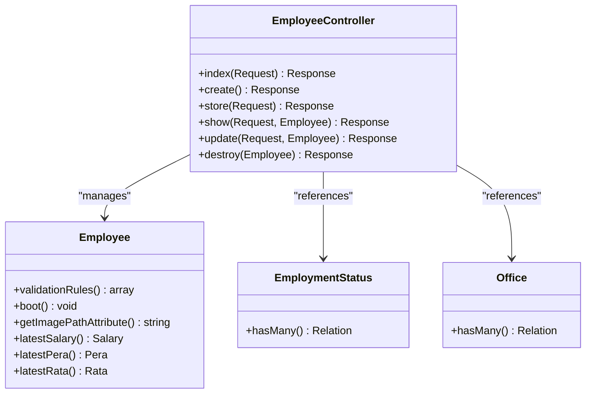

**Diagram sources**
- [EmployeeController.php:14-147](file://app/Http/Controllers/EmployeeController.php#L14-L147)
- [Employee.php:31-104](file://app/Models/Employee.php#L31-L104)

### Deduction Tracking System
The deduction tracking system manages employee deductions with period-specific filtering, duplicate prevention, and comprehensive reporting capabilities.

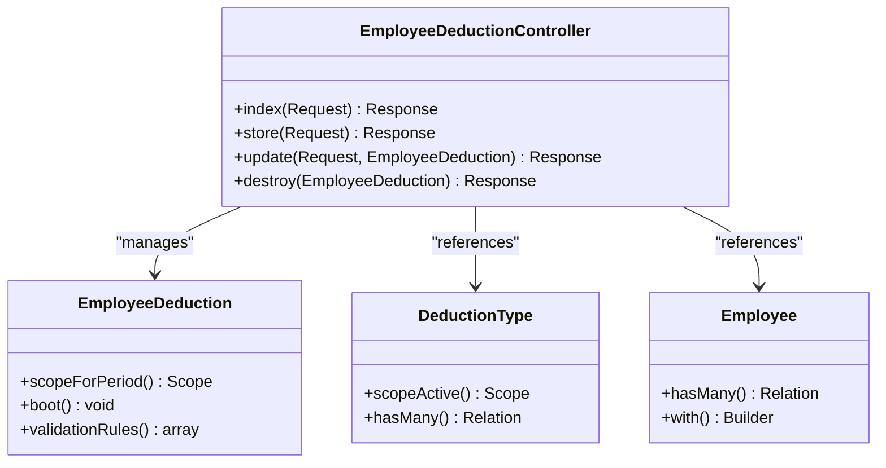

**Diagram sources**
- [EmployeeDeductionController.php:16-119](file://app/Http/Controllers/EmployeeDeductionController.php#L16-L119)
- [EmployeeDeduction.php:53-58](file://app/Models/EmployeeDeduction.php#L53-L58)

**Section sources**
- [DashboardController.php:14-87](file://app/Http/Controllers/DashboardController.php#L14-L87)
- [EmployeeController.php:14-147](file://app/Http/Controllers/EmployeeController.php#L14-L147)
- [EmployeeDeductionController.php:16-119](file://app/Http/Controllers/EmployeeDeductionController.php#L16-L119)

## Architecture Overview

The Employee Reports Dashboard employs a modern full-stack architecture combining Laravel's robust backend capabilities with React's dynamic frontend presentation layer.

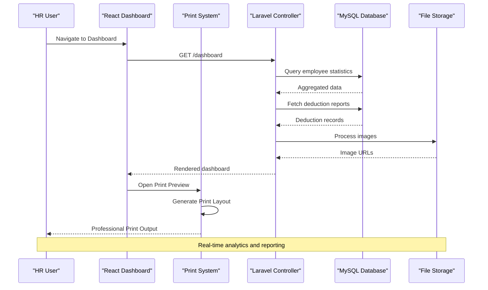

**Diagram sources**
- [DashboardController.php:14-87](file://app/Http/Controllers/DashboardController.php#L14-L87)
- [dashboard.tsx:49-284](file://resources/js/pages/dashboard.tsx#L49-L284)

The architecture implements several key design patterns:

- **MVC Pattern**: Clear separation between models, views, and controllers
- **Repository Pattern**: Eloquent models handle data access logic
- **Observer Pattern**: Automatic audit trail through model boot methods
- **Strategy Pattern**: Flexible deduction type management
- **Template Method Pattern**: Dedicated print layout generation

**Section sources**
- [dashboard.tsx:1-284](file://resources/js/pages/dashboard.tsx#L1-L284)
- [web.php:27-134](file://routes/web.php#L27-L134)

## Enhanced UI Component System

**New Section** The dashboard now features an enhanced UI component system with improved card layouts, responsive design patterns, and optimized data presentation.

### Card Component Enhancements

The card component has been significantly improved with better responsive design, size variants, and enhanced styling options.

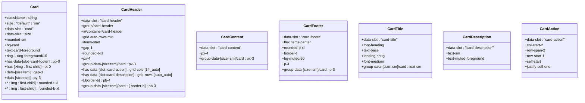

**Diagram sources**
- [card.tsx:5-103](file://resources/js/components/ui/card.tsx#L5-L103)

### Table Component Improvements

The table component now features enhanced mobile responsiveness, better accessibility, and improved styling for data presentation.

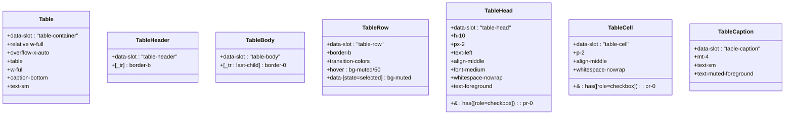

**Diagram sources**
- [table.tsx:7-117](file://resources/js/components/ui/table.tsx#L7-L117)

### Button Component Variants

The button component now supports enhanced variant system with improved sizing options and styling consistency.

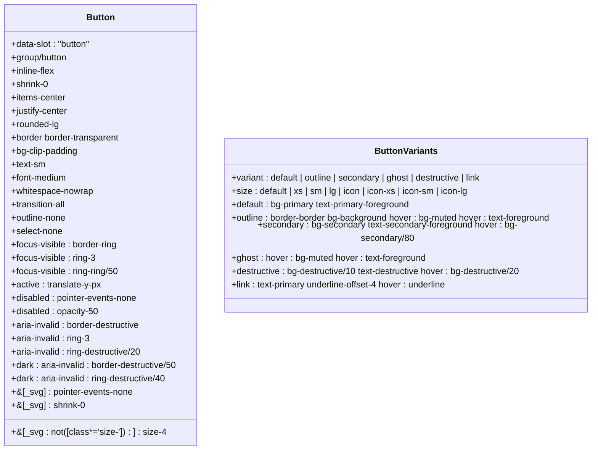

**Diagram sources**
- [button.tsx:7-68](file://resources/js/components/ui/button.tsx#L7-L68)

**Section sources**
- [card.tsx:1-104](file://resources/js/components/ui/card.tsx#L1-L104)
- [table.tsx:1-117](file://resources/js/components/ui/table.tsx#L1-L117)
- [button.tsx:1-68](file://resources/js/components/ui/button.tsx#L1-L68)

## Improved Data Presentation

**New Section** The dashboard now features enhanced data presentation with improved card layouts, responsive grid systems, and optimized visual hierarchy for better user comprehension.

### Responsive Grid System

The dashboard implements a comprehensive responsive grid system that adapts to different screen sizes while maintaining optimal data presentation.

```mermaid
flowchart TD
Start([Dashboard Load]) --> CheckScreenSize{"Check Screen Size"}
CheckScreenSize --> |Mobile (< 768px)| MobileGrid["1 Column Grid"]
CheckScreenSize --> |Tablet (768-1024px)| TabletGrid["2 Column Grid"]
CheckScreenSize --> |Desktop (> 1024px)| DesktopGrid["4 Column Grid"]
MobileGrid --> StatCards["Stat Cards with Icons"]
TabletGrid --> StatCards
DesktopGrid --> StatCards
StatCards --> MainContent["Main Content Area"]
MainContent --> TopDeductions["Top Deduction Types"]
MainContent --> EmployeeList["Employees with Deductions"]
TopDeductions --> ResponsiveLayout["Responsive Layout"]
EmployeeList --> ResponsiveLayout
ResponsiveLayout --> QuickActions["Quick Actions"]
QuickActions --> FinalLayout["Optimized Dashboard"]
```

**Diagram sources**
- [dashboard.tsx:94-109](file://resources/js/pages/dashboard.tsx#L94-L109)
- [dashboard.tsx:112-187](file://resources/js/pages/dashboard.tsx#L112-L187)

### Enhanced Card Layouts

The dashboard cards now feature improved layouts with better visual hierarchy, consistent spacing, and enhanced responsive behavior.

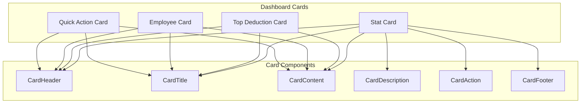

**Diagram sources**
- [dashboard.tsx:96-108](file://resources/js/pages/dashboard.tsx#L96-L108)
- [dashboard.tsx:114-146](file://resources/js/pages/dashboard.tsx#L114-L146)
- [dashboard.tsx:149-186](file://resources/js/pages/dashboard.tsx#L149-L186)
- [dashboard.tsx:190-250](file://resources/js/pages/dashboard.tsx#L190-L250)

**Section sources**
- [dashboard.tsx:1-255](file://resources/js/pages/dashboard.tsx#L1-L255)

## Responsive Design Implementation

**New Section** The dashboard now implements comprehensive responsive design patterns ensuring optimal user experience across all device sizes and screen orientations.

### Mobile Detection Hook

The system includes a sophisticated mobile detection mechanism that responds to viewport changes and orientation adjustments.

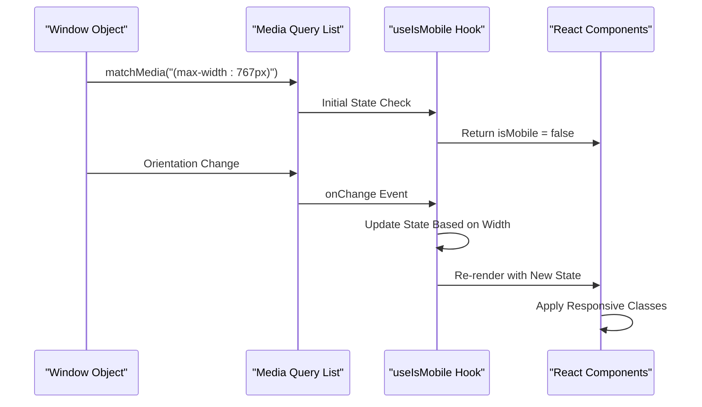

**Diagram sources**
- [use-mobile.tsx:5-19](file://resources/js/hooks/use-mobile.tsx#L5-L19)

### Responsive Utility System

The utility system provides consistent styling across different screen sizes with enhanced Tailwind CSS integration.

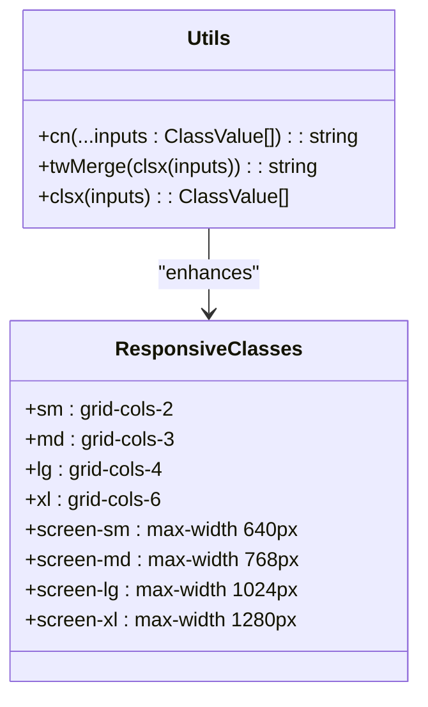

**Diagram sources**
- [utils.ts:4-6](file://resources/js/lib/utils.ts#L4-L6)

### Layout Adaptation Patterns

The dashboard implements adaptive layout patterns that automatically adjust content presentation based on available screen real estate.

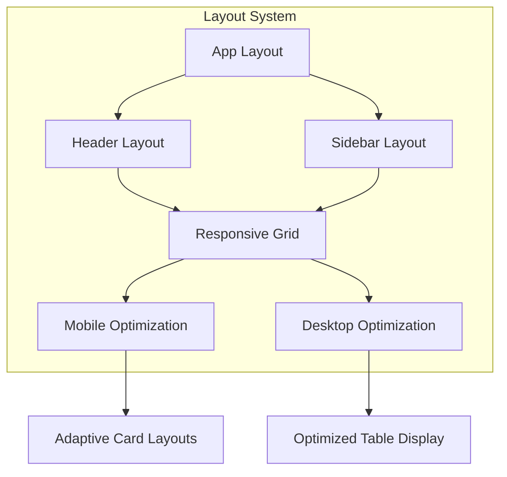

**Diagram sources**
- [app-layout.tsx:11-16](file://resources/js/layouts/app-layout.tsx#L11-L16)

**Section sources**
- [use-mobile.tsx:1-22](file://resources/js/hooks/use-mobile.tsx#L1-L22)
- [utils.ts:1-7](file://resources/js/lib/utils.ts#L1-L7)
- [app-layout.tsx:1-17](file://resources/js/layouts/app-layout.tsx#L1-L17)

## Print System Enhancement

**Updated** The enhanced reporting system now includes a comprehensive print functionality designed for generating official employee compensation and claims reports with improved layout optimization and responsive design.

### Enhanced PrintReport Component

The PrintReport component provides a specialized print-friendly layout optimized for professional document generation with enhanced responsive design.

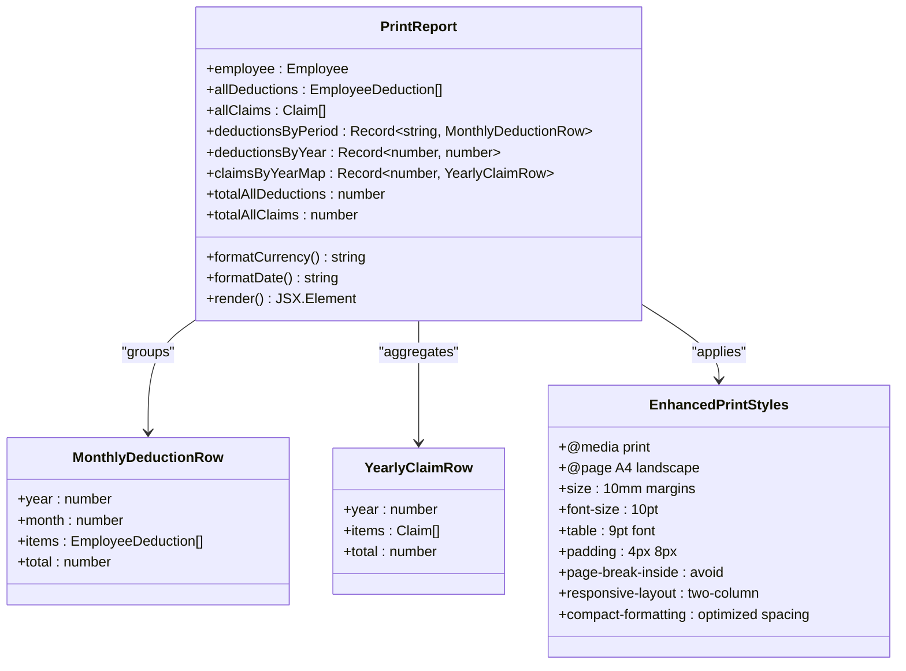

**Diagram sources**
- [PrintReport.tsx:61-380](file://resources/js/pages/Employees/Manage/PrintReport.tsx#L61-L380)

### Enhanced Print Preview Dialog

The print preview dialog system now features improved layout optimization and responsive design for better user experience.

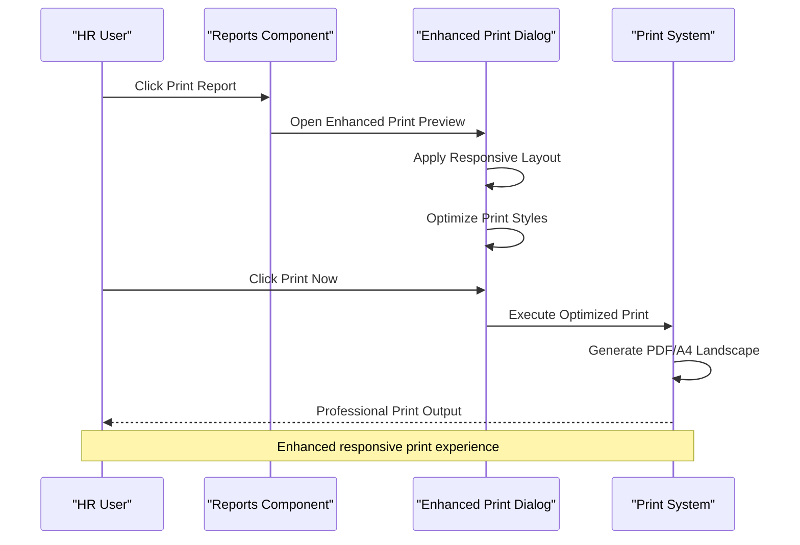

**Diagram sources**
- [Reports.tsx:217-237](file://resources/js/pages/Employees/Manage/Reports.tsx#L217-L237)

### Responsive Print Layout

The print system implements responsive layout patterns optimized for different content densities and screen sizes.

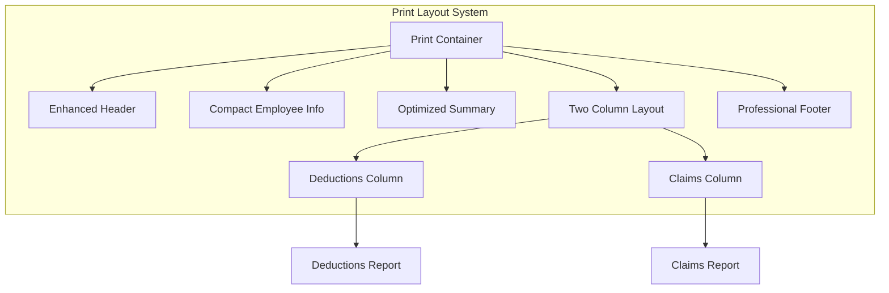

**Diagram sources**
- [PrintReport.tsx:141-376](file://resources/js/pages/Employees/Manage/PrintReport.tsx#L141-L376)

**Section sources**
- [PrintReport.tsx:1-380](file://resources/js/pages/Employees/Manage/PrintReport.tsx#L1-L380)
- [Reports.tsx:1-471](file://resources/js/pages/Employees/Manage/Reports.tsx#L1-L471)

## Performance Considerations

The system implements several performance optimization strategies across the enhanced UI component system:

### Component-Level Optimizations
- **Memoized Components**: Strategic use of React.memo for expensive dashboard components
- **Lazy Loading**: Dynamic imports for UI components and print functionality
- **Virtual Scrolling**: For large datasets in employee lists and reports
- **Optimized Rendering**: Conditional rendering and efficient state updates
- **Component Bundling**: Optimized bundle splitting for UI components

### Responsive Design Performance
- **CSS Optimization**: Efficient media queries and responsive utilities
- **Mobile-First Approach**: Progressive enhancement for better mobile performance
- **Viewport Management**: Optimized viewport meta tag configuration
- **Touch Interaction**: Optimized touch targets and interaction areas
- **Reduced DOM Complexity**: Streamlined component hierarchies for mobile devices

### Print System Performance
- **Lazy Loading**: Print components loaded only when needed
- **Memory Management**: Proper cleanup of print content after printing
- **State Management**: Efficient handling of print preview state
- **Browser Compatibility**: Optimized print functionality across different browsers
- **Responsive Print Styles**: Media query optimization for print contexts

### Data Presentation Optimization
- **Efficient Grid Rendering**: Optimized grid system with virtualization for large datasets
- **Component Caching**: Cached component instances for improved re-rendering
- **Event Delegation**: Optimized event handling for responsive interactions
- **CSS-in-JS Optimization**: Efficient styled component rendering
- **Bundle Size Management**: Optimized bundle splitting for UI components

## Troubleshooting Guide

### Common Issues and Solutions

**Dashboard Components Not Rendering**
- Verify card component imports and prop validation
- Check responsive breakpoint configuration in useIsMobile hook
- Ensure proper CSS class merging with cn() utility function
- Validate component prop types and default values

**Mobile Responsiveness Issues**
- Verify media query breakpoints in useIsMobile hook
- Check CSS responsive utilities and Tailwind configuration
- Ensure proper viewport meta tag in HTML head
- Validate component rendering for different screen sizes

**Print Functionality Problems**
- Verify browser print dialog permissions
- Check CSS print styles compatibility and media queries
- Ensure proper print preview dialog initialization
- Validate print content rendering with responsive layouts
- Confirm proper print layout optimization for different content densities

**UI Component Styling Issues**
- Verify component variant classes and size configurations
- Check Tailwind CSS configuration and custom utilities
- Ensure proper component composition and slot usage
- Validate responsive design patterns and breakpoints
- Confirm accessibility compliance and semantic markup

**Performance Issues**
- Monitor slow component rendering with React DevTools
- Check for unnecessary re-renders in dashboard components
- Implement proper component memoization for large datasets
- Optimize responsive design calculations and media query listeners
- Validate print system performance with large datasets

**Section sources**
- [card.tsx:1-104](file://resources/js/components/ui/card.tsx#L1-L104)
- [table.tsx:1-117](file://resources/js/components/ui/table.tsx#L1-L117)
- [button.tsx:1-68](file://resources/js/components/ui/button.tsx#L1-L68)
- [use-mobile.tsx:1-22](file://resources/js/hooks/use-mobile.tsx#L1-L22)

## Conclusion

The Employee Reports Dashboard represents a sophisticated solution for comprehensive employee management and payroll analysis. The system successfully combines modern frontend development practices with robust backend architecture to deliver real-time insights and efficient operational workflows.

**Updated** The recent enhancement with improved UI components and better data presentation significantly improves the system's user experience through enhanced card layouts, responsive design patterns, and optimized data visualization. The implementation of comprehensive responsive design ensures optimal performance across all device sizes while maintaining professional presentation standards.

Key strengths of the enhanced implementation include:

- **Comprehensive Analytics**: Multi-dimensional reporting with drill-down capabilities and enhanced visual presentation
- **Advanced Responsive Design**: Sophisticated responsive patterns with mobile-first approach and adaptive layouts
- **Enhanced UI Component System**: Improved card layouts, table components, and button variants with consistent styling
- **Optimized Data Presentation**: Better visual hierarchy, responsive grids, and mobile-optimized content
- **Professional Print System**: Enhanced print functionality with responsive print layouts and optimized document generation
- **Performance Optimization**: Efficient component rendering, lazy loading, and responsive design calculations
- **Accessibility Compliance**: Improved semantic markup and responsive interaction patterns
- **Scalable Architecture**: Well-designed component system supporting future enhancements and customization

The system provides a solid foundation for HR and financial operations, with clear extension points for additional features such as advanced reporting, integration with external systems, enhanced mobile capabilities, and expanded print functionality. The modular UI component system ensures maintainability and facilitates team collaboration on feature development while maintaining design consistency across all responsive contexts.

Future enhancement opportunities include implementing real-time notifications, advanced export capabilities, integration with payroll processing systems, expanded analytical dashboards with predictive modeling features, and enhanced print functionality for different document formats and templates.