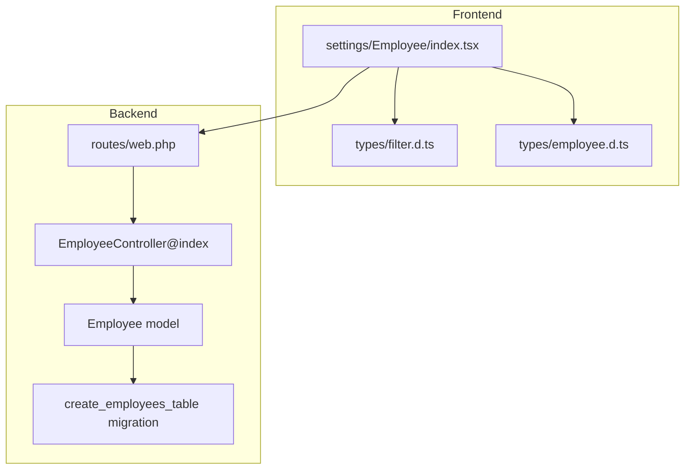
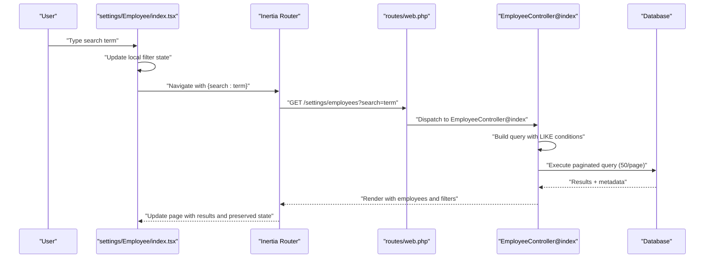
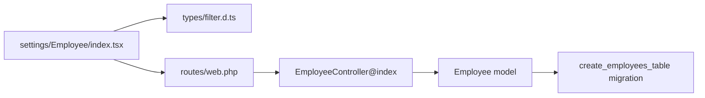

# Employee Search and Filtering

<cite>
**Referenced Files in This Document**
- [EmployeeController.php](file://app/Http/Controllers/EmployeeController.php)
- [Employee.php](file://app/Models/Employee.php)
- [create_employees_table.php](file://database/migrations/2026_03_19_022838_create_employees_table.php)
- [web.php](file://routes/web.php)
- [index.tsx](file://resources/js/pages/settings/Employee/index.tsx)
- [filter.d.ts](file://resources/js/types/filter.d.ts)
- [employee.d.ts](file://resources/js/types/employee.d.ts)
</cite>

## Table of Contents
1. [Introduction](#introduction)
2. [Project Structure](#project-structure)
3. [Core Components](#core-components)
4. [Architecture Overview](#architecture-overview)
5. [Detailed Component Analysis](#detailed-component-analysis)
6. [Dependency Analysis](#dependency-analysis)
7. [Performance Considerations](#performance-considerations)
8. [Troubleshooting Guide](#troubleshooting-guide)
9. [Conclusion](#conclusion)

## Introduction
This document provides comprehensive documentation for the employee search and filtering capabilities within the application. It explains how users can search employees by first name, middle name, last name, and suffix, how the backend processes these queries, and how the frontend preserves query strings during pagination. It also covers the current filtering system for employment status and office assignments, pagination behavior, and practical guidance for extending the system with advanced filtering and performance optimizations.

## Project Structure
The employee search and filtering functionality spans three primary layers:
- Backend controller and model: responsible for receiving search parameters, constructing database queries, applying filters, paginating results, and returning data to the frontend.
- Frontend page component: manages local filter state, constructs query strings, and preserves state during pagination.
- Type definitions: define the shape of employee data and filter props passed between backend and frontend.

**Diagram sources**
- [web.php:85-91](file://routes/web.php#L85-L91)
- [EmployeeController.php:14-41](file://app/Http/Controllers/EmployeeController.php#L14-L41)
- [Employee.php:10-104](file://app/Models/Employee.php#L10-L104)
- [create_employees_table.php:14-27](file://database/migrations/2026_03_19_022838_create_employees_table.php#L14-L27)
- [index.tsx:41-44](file://resources/js/pages/settings/Employee/index.tsx#L41-L44)
- [filter.d.ts:3-11](file://resources/js/types/filter.d.ts#L3-L11)
- [employee.d.ts:8-29](file://resources/js/types/employee.d.ts#L8-L29)

**Section sources**
- [web.php:85-91](file://routes/web.php#L85-L91)
- [EmployeeController.php:14-41](file://app/Http/Controllers/EmployeeController.php#L14-L41)
- [Employee.php:10-104](file://app/Models/Employee.php#L10-L104)
- [create_employees_table.php:14-27](file://database/migrations/2026_03_19_022838_create_employees_table.php#L14-L27)
- [index.tsx:41-44](file://resources/js/pages/settings/Employee/index.tsx#L41-L44)
- [filter.d.ts:3-11](file://resources/js/types/filter.d.ts#L3-L11)
- [employee.d.ts:8-29](file://resources/js/types/employee.d.ts#L8-L29)

## Core Components
- Employee search endpoint: The backend route `/settings/employees` delegates to the EmployeeController@index method, which builds a query that optionally filters by search terms across first_name, middle_name, last_name, and suffix. Results are paginated with 50 items per page and query string preservation is enabled.
- Frontend search UI: The settings/Employee/index.tsx component initializes filter state from server-provided filters, binds an input field to the search term, and triggers navigation with the current search query while preserving state and scroll.
- Data models: The Employee model defines relationships to EmploymentStatus and Office, and exposes attributes for image paths. The migration creates the employees table with the relevant columns.

Key implementation references:
- Backend search and pagination: [EmployeeController.php:14-41](file://app/Http/Controllers/EmployeeController.php#L14-L41)
- Frontend filter binding and navigation: [index.tsx:41-44](file://resources/js/pages/settings/Employee/index.tsx#L41-L44)
- Employment status and office relationships: [Employee.php:31-39](file://app/Models/Employee.php#L31-L39)
- Employees table schema: [create_employees_table.php:14-27](file://database/migrations/2026_03_19_022838_create_employees_table.php#L14-L27)

**Section sources**
- [EmployeeController.php:14-41](file://app/Http/Controllers/EmployeeController.php#L14-L41)
- [index.tsx:41-44](file://resources/js/pages/settings/Employee/index.tsx#L41-L44)
- [Employee.php:31-39](file://app/Models/Employee.php#L31-L39)
- [create_employees_table.php:14-27](file://database/migrations/2026_03_19_022838_create_employees_table.php#L14-L27)

## Architecture Overview
The search and filtering flow connects frontend UI to backend controllers and models, then to the database, and finally back to the frontend with paginated results and preserved query parameters.

**Diagram sources**
- [index.tsx:41-44](file://resources/js/pages/settings/Employee/index.tsx#L41-L44)
- [web.php:85-91](file://routes/web.php#L85-L91)
- [EmployeeController.php:14-41](file://app/Http/Controllers/EmployeeController.php#L14-L41)

## Detailed Component Analysis

### Backend: EmployeeController@index
- Search logic: Applies a conditional where clause when a search parameter exists, checking first_name, middle_name, last_name, and suffix using pattern matching.
- Sorting: Results are ordered by last_name in ascending order.
- Eager loading: Employment status and office relationships are loaded via with() to prevent N+1 queries.
- Pagination: Uses paginate(50) with withQueryString() to preserve existing query parameters across pages.
- Data preparation: Fetches all employment statuses and offices for filter UI and passes filters.search to the frontend.

Implementation references:
- Search and ordering: [EmployeeController.php:18-27](file://app/Http/Controllers/EmployeeController.php#L18-L27)
- Query string preservation: [EmployeeController.php:28](file://app/Http/Controllers/EmployeeController.php#L28)
- Relationship eager loading: [EmployeeController.php:26](file://app/Http/Controllers/EmployeeController.php#L26)
- Filters exposure: [EmployeeController.php:37-40](file://app/Http/Controllers/EmployeeController.php#L37-L40)

**Section sources**
- [EmployeeController.php:14-41](file://app/Http/Controllers/EmployeeController.php#L14-L41)

### Frontend: settings/Employee/index.tsx
- State initialization: Initializes filter state from props.filters.search to reflect current query parameters.
- Input binding: Two-way binding of the search input to the filter state.
- Navigation: On change, navigates to the same route with the current search term while preserving state and scroll.
- Props typing: Uses FilterProps and PaginatedDataResponse<Employee> to strongly type received data.

Implementation references:
- State initialization: [index.tsx:41-44](file://resources/js/pages/settings/Employee/index.tsx#L41-L44)
- Input binding and navigation: [index.tsx:41-44](file://resources/js/pages/settings/Employee/index.tsx#L41-L44)
- Props typing: [index.tsx:36-39](file://resources/js/pages/settings/Employee/index.tsx#L36-L39)

**Section sources**
- [index.tsx:36-44](file://resources/js/pages/settings/Employee/index.tsx#L36-L44)

### Data Models and Schema
- Employee model: Defines fillable attributes, boolean casting, and relationships to EmploymentStatus and Office. Provides accessors for image paths.
- EmploymentStatus and Office models: Base models with soft deletes and created_by relationships.
- Employees table: Contains first_name, middle_name, last_name, suffix, position, image_path, foreign keys to employment_statuses and offices, and timestamps.

Implementation references:
- Employee relationships: [Employee.php:31-39](file://app/Models/Employee.php#L31-L39)
- Employee fillable and casts: [Employee.php:14-29](file://app/Models/Employee.php#L14-L29)
- EmploymentStatus model: [EmploymentStatus.php:9-31](file://app/Models/EmploymentStatus.php#L9-L31)
- Office model: [Office.php:9-32](file://app/Models/Office.php#L9-L32)
- Employees table schema: [create_employees_table.php:14-27](file://database/migrations/2026_03_19_022838_create_employees_table.php#L14-L27)

**Section sources**
- [Employee.php:14-39](file://app/Models/Employee.php#L14-L39)
- [EmploymentStatus.php:9-31](file://app/Models/EmploymentStatus.php#L9-L31)
- [Office.php:9-32](file://app/Models/Office.php#L9-L32)
- [create_employees_table.php:14-27](file://database/migrations/2026_03_19_022838_create_employees_table.php#L14-L27)

### Current Filtering Capabilities
- Search: Implemented across four name fields with pattern matching.
- Employment status and office: Exposed for UI via EmploymentStatus and Office collections; however, the current EmployeeController@index does not apply filters for employment_status_id or office_id. These can be added by extending the conditional query logic similarly to the search parameter.

References:
- Search query construction: [EmployeeController.php:18-24](file://app/Http/Controllers/EmployeeController.php#L18-L24)
- Employment status collection: [EmployeeController.php:30](file://app/Http/Controllers/EmployeeController.php#L30)
- Office collection: [EmployeeController.php:31](file://app/Http/Controllers/EmployeeController.php#L31)

**Section sources**
- [EmployeeController.php:18-31](file://app/Http/Controllers/EmployeeController.php#L18-L31)

### Pagination and Query String Preservation
- Backend: paginate(50) with withQueryString() ensures 50 records per page and preserves existing query parameters across pagination links.
- Frontend: Navigation preserves state and scroll, ensuring a seamless user experience when navigating between pages.

References:
- Pagination and query string: [EmployeeController.php:27-28](file://app/Http/Controllers/EmployeeController.php#L27-L28)
- Frontend preservation: [index.tsx:41-44](file://resources/js/pages/settings/Employee/index.tsx#L41-L44)

**Section sources**
- [EmployeeController.php:27-28](file://app/Http/Controllers/EmployeeController.php#L27-L28)
- [index.tsx:41-44](file://resources/js/pages/settings/Employee/index.tsx#L41-L44)

### Search Algorithm Details
- Pattern matching: Uses LIKE with wildcards around the search term for each applicable column.
- Logical OR: Combines conditions across multiple fields so any match triggers inclusion in results.
- Ordering: Sorts by last_name ascending to provide consistent presentation.

References:
- Search conditions: [EmployeeController.php:19-23](file://app/Http/Controllers/EmployeeController.php#L19-L23)
- Ordering: [EmployeeController.php:25](file://app/Http/Controllers/EmployeeController.php#L25)

**Section sources**
- [EmployeeController.php:19-25](file://app/Http/Controllers/EmployeeController.php#L19-L25)

### Indexing Considerations
- Current implementation: Relies on pattern matching with leading wildcards, which prevents efficient index usage and can degrade performance on large datasets.
- Recommended improvements:
  - Add composite indexes on (last_name, first_name, middle_name, suffix) to support prefix-like searches.
  - Consider full-text search capabilities for improved relevance and performance.
  - Normalize name fields and enforce consistent casing to improve search quality.

Note: These are recommendations for future enhancements and are not part of the current implementation.

**Section sources**
- [EmployeeController.php:19-23](file://app/Http/Controllers/EmployeeController.php#L19-L23)

### Performance Optimization Techniques
- Eager loading: The with(['employmentStatus', 'office']) call reduces N+1 queries for related data.
- Pagination: Fixed page size with query string preservation minimizes redundant computations.
- Recommendations:
  - Add database indexes for frequently filtered columns.
  - Consider caching strategies for static filter lists (employment statuses, offices).
  - Implement server-side debouncing for live search to reduce request frequency.

References:
- Eager loading: [EmployeeController.php:26](file://app/Http/Controllers/EmployeeController.php#L26)

**Section sources**
- [EmployeeController.php:26](file://app/Http/Controllers/EmployeeController.php#L26)

### Filter Combinations and Empty States
- Filter combinations: The current implementation supports search term filtering. Employment status and office filters are exposed for UI but not yet applied in the backend query. They can be combined by extending the conditional query builder.
- Empty states: The frontend component renders a paginated list; empty results are handled by the pagination component. No explicit empty-state UI is shown in the referenced code.

References:
- Employment status and office exposure: [EmployeeController.php:30-31](file://app/Http/Controllers/EmployeeController.php#L30-L31)
- Pagination rendering: [EmployeeController.php:27](file://app/Http/Controllers/EmployeeController.php#L27)

**Section sources**
- [EmployeeController.php:27-31](file://app/Http/Controllers/EmployeeController.php#L27-L31)

### Examples of Search Queries and Filter Configurations
- Basic search: Navigate to /settings/employees?search=john to find employees whose first, middle, last, or suffix contain "john".
- Combined filters: Extend the backend query to include employment_status_id and office_id conditions alongside the search term.
- Query string preservation: Changing the search term updates the URL and maintains pagination state.

References:
- Route definition: [web.php:85-91](file://routes/web.php#L85-L91)
- Search handling: [EmployeeController.php:16-24](file://app/Http/Controllers/EmployeeController.php#L16-L24)
- Frontend navigation: [index.tsx:41-44](file://resources/js/pages/settings/Employee/index.tsx#L41-L44)

**Section sources**
- [web.php:85-91](file://routes/web.php#L85-L91)
- [EmployeeController.php:16-24](file://app/Http/Controllers/EmployeeController.php#L16-L24)
- [index.tsx:41-44](file://resources/js/pages/settings/Employee/index.tsx#L41-L44)

## Dependency Analysis
The following diagram shows the key dependencies among components involved in the search and filtering flow.

**Diagram sources**
- [index.tsx:41-44](file://resources/js/pages/settings/Employee/index.tsx#L41-L44)
- [filter.d.ts:3-11](file://resources/js/types/filter.d.ts#L3-L11)
- [web.php:85-91](file://routes/web.php#L85-L91)
- [EmployeeController.php:14-41](file://app/Http/Controllers/EmployeeController.php#L14-L41)
- [Employee.php:10-104](file://app/Models/Employee.php#L10-L104)
- [create_employees_table.php:14-27](file://database/migrations/2026_03_19_022838_create_employees_table.php#L14-L27)

**Section sources**
- [index.tsx:41-44](file://resources/js/pages/settings/Employee/index.tsx#L41-L44)
- [filter.d.ts:3-11](file://resources/js/types/filter.d.ts#L3-L11)
- [web.php:85-91](file://routes/web.php#L85-L91)
- [EmployeeController.php:14-41](file://app/Http/Controllers/EmployeeController.php#L14-L41)
- [Employee.php:10-104](file://app/Models/Employee.php#L10-L104)
- [create_employees_table.php:14-27](file://database/migrations/2026_03_19_022838_create_employees_table.php#L14-L27)

## Performance Considerations
- Current state: The LIKE with leading wildcards can cause full table scans. For large datasets, consider adding database indexes on name fields and exploring full-text search.
- Backend efficiency: Eager loading relationships and fixed pagination help minimize overhead.
- Frontend UX: Query string preservation and state preservation reduce unnecessary reloads and improve responsiveness.

[No sources needed since this section provides general guidance]

## Troubleshooting Guide
- Search yields unexpected results: Verify that the search term is not inadvertently truncated or sanitized by client-side logic. Ensure the backend LIKE pattern is applied consistently across all targeted fields.
- Pagination resets state: Confirm that withQueryString() is used on the backend and preserveState/preserveScroll are configured on the frontend navigation.
- Empty results: Check that the search term is not empty and that the database contains matching records. Validate that the eager loading of relationships does not introduce filtering side effects.

**Section sources**
- [EmployeeController.php:27-28](file://app/Http/Controllers/EmployeeController.php#L27-L28)
- [index.tsx:41-44](file://resources/js/pages/settings/Employee/index.tsx#L41-L44)

## Conclusion
The employee search and filtering system currently supports searching across four name fields with pattern matching, pagination with 50 records per page, and query string preservation. Employment status and office data are available for UI, though not yet applied as filters in the backend query. Extending the backend to incorporate employment status and office filters, combined with database indexing and full-text search capabilities, would significantly improve performance and user experience. The frontend’s state management and navigation behavior ensure a smooth, persistent search experience across pages.