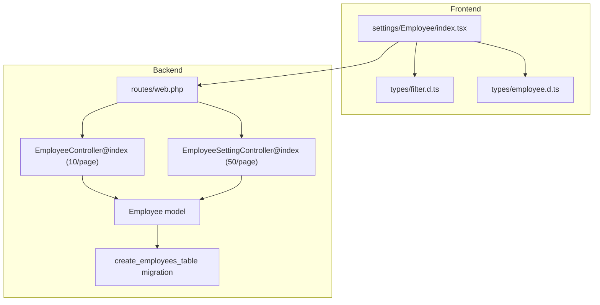
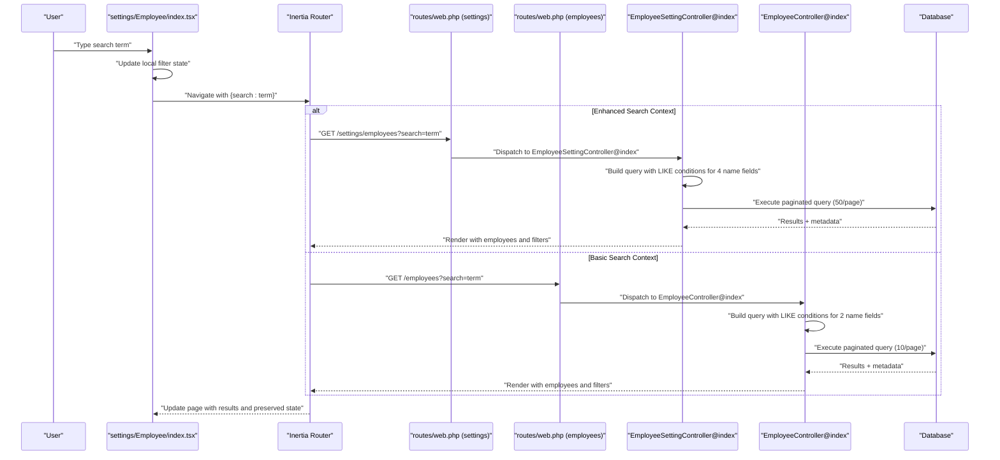
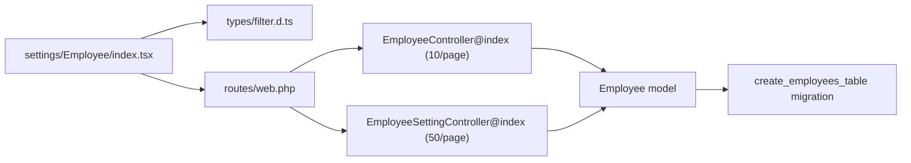

# Employee Search and Filtering

<cite>
**Referenced Files in This Document**
- [EmployeeController.php](file://app/Http/Controllers/EmployeeController.php)
- [EmployeeSettingController.php](file://app/Http/Controllers/EmployeeSettingController.php)
- [Employee.php](file://app/Models/Employee.php)
- [create_employees_table.php](file://database/migrations/2026_03_19_022838_create_employees_table.php)
- [web.php](file://routes/web.php)
- [index.tsx](file://resources/js/pages/settings/Employee/index.tsx)
- [filter.d.ts](file://resources/js/types/filter.d.ts)
- [employee.d.ts](file://resources/js/types/employee.d.ts)
</cite>

## Update Summary
**Changes Made**
- Updated search functionality documentation to reflect dual controller architecture
- Added distinction between EmployeeController (simple search) and EmployeeSettingController (enhanced search)
- Updated pagination details to reflect different page sizes (10 vs 50 records)
- Revised search algorithm details to show the difference in search scope between controllers
- Updated route mappings and frontend integration examples

## Table of Contents
1. [Introduction](#introduction)
2. [Project Structure](#project-structure)
3. [Core Components](#core-components)
4. [Architecture Overview](#architecture-overview)
5. [Detailed Component Analysis](#detailed-component-analysis)
6. [Dependency Analysis](#dependency-analysis)
7. [Performance Considerations](#performance-considerations)
8. [Troubleshooting Guide](#troubleshooting-guide)
9. [Conclusion](#conclusion)

## Introduction
This document provides comprehensive documentation for the employee search and filtering capabilities within the application. The system now features a dual-controller architecture where EmployeeController provides simplified search functionality focusing on first_name and last_name, while EmployeeSettingController offers enhanced search capabilities supporting first_name, middle_name, last_name, and suffix. Both controllers maintain separate pagination strategies and route endpoints, with the frontend managing query string preservation across different search contexts.

## Project Structure
The employee search and filtering functionality spans three primary layers with a dual-controller architecture:
- **Backend controllers**: Two specialized controllers handle different search scopes - EmployeeController for basic search and EmployeeSettingController for enhanced search
- **Frontend page component**: Manages filter state and navigation for the settings employee index page
- **Type definitions**: Define data structures for employee records and filter properties

**Diagram sources**
- [web.php:72-80](file://routes/web.php#L72-L80)
- [web.php:97-107](file://routes/web.php#L97-L107)
- [EmployeeController.php:14-34](file://app/Http/Controllers/EmployeeController.php#L14-L34)
- [EmployeeSettingController.php:14-41](file://app/Http/Controllers/EmployeeSettingController.php#L14-L41)
- [Employee.php:10-104](file://app/Models/Employee.php#L10-L104)
- [create_employees_table.php:14-27](file://database/migrations/2026_03_19_022838_create_employees_table.php#L14-L27)
- [index.tsx:41-44](file://resources/js/pages/settings/Employee/index.tsx#L41-L44)
- [filter.d.ts:3-11](file://resources/js/types/filter.d.ts#L3-L11)
- [employee.d.ts:8-29](file://resources/js/types/employee.d.ts#L8-L29)

**Section sources**
- [web.php:72-80](file://routes/web.php#L72-L80)
- [web.php:97-107](file://routes/web.php#L97-L107)
- [EmployeeController.php:14-34](file://app/Http/Controllers/EmployeeController.php#L14-L34)
- [EmployeeSettingController.php:14-41](file://app/Http/Controllers/EmployeeSettingController.php#L14-L41)
- [Employee.php:10-104](file://app/Models/Employee.php#L10-L104)
- [create_employees_table.php:14-27](file://database/migrations/2026_03_19_022838_create_employees_table.php#L14-L27)
- [index.tsx:41-44](file://resources/js/pages/settings/Employee/index.tsx#L41-L44)
- [filter.d.ts:3-11](file://resources/js/types/filter.d.ts#L3-L11)
- [employee.d.ts:8-29](file://resources/js/types/employee.d.ts#L8-L29)

## Core Components
The system now features two distinct search controllers with different capabilities:

### EmployeeController (Basic Search)
- **Search scope**: First name and last name only
- **Pagination**: 10 records per page with query string preservation
- **Route**: `/employees` (frontend route: `employees.index`)
- **Purpose**: Simplified employee listing for general users

### EmployeeSettingController (Enhanced Search)
- **Search scope**: First name, middle name, last name, and suffix
- **Pagination**: 50 records per page with query string preservation
- **Route**: `/settings/employees` (frontend route: `employees.settings.index`)
- **Purpose**: Comprehensive employee management for administrators

### Frontend Integration
The settings employee index page manages filter state and navigation, preserving query parameters across pagination for the enhanced search functionality.

**Section sources**
- [EmployeeController.php:14-34](file://app/Http/Controllers/EmployeeController.php#L14-L34)
- [EmployeeSettingController.php:14-41](file://app/Http/Controllers/EmployeeSettingController.php#L14-L41)
- [web.php:72-80](file://routes/web.php#L72-L80)
- [web.php:97-107](file://routes/web.php#L97-L107)
- [index.tsx:41-44](file://resources/js/pages/settings/Employee/index.tsx#L41-L44)

## Architecture Overview
The dual-controller architecture separates concerns between basic employee listing and comprehensive employee management, each with optimized search capabilities and pagination strategies.

**Diagram sources**
- [index.tsx:80-90](file://resources/js/pages/settings/Employee/index.tsx#L80-L90)
- [web.php:72-80](file://routes/web.php#L72-L80)
- [web.php:97-107](file://routes/web.php#L97-L107)
- [EmployeeController.php:14-34](file://app/Http/Controllers/EmployeeController.php#L14-L34)
- [EmployeeSettingController.php:14-41](file://app/Http/Controllers/EmployeeSettingController.php#L14-L41)

## Detailed Component Analysis

### EmployeeController (Basic Search)
**Updated** Enhanced to focus on simplified search functionality for general employee listing.

- **Search logic**: Applies conditional where clause for first_name and last_name only, using pattern matching with logical OR
- **Sorting**: Results ordered by last_name ascending for consistent presentation
- **Eager loading**: Loads employment status and office relationships via with() to prevent N+1 queries
- **Pagination**: Uses paginate(10) with withQueryString() for 10 records per page with query string preservation
- **Data preparation**: Exposes employmentStatuses and offices for filter UI

Implementation references:
- Search and ordering: [EmployeeController.php:19-25](file://app/Http/Controllers/EmployeeController.php#L19-L25)
- Query string preservation: [EmployeeController.php:25](file://app/Http/Controllers/EmployeeController.php#L25)
- Relationship eager loading: [EmployeeController.php:24](file://app/Http/Controllers/EmployeeController.php#L24)

**Section sources**
- [EmployeeController.php:14-34](file://app/Http/Controllers/EmployeeController.php#L14-L34)

### EmployeeSettingController (Enhanced Search)
**Updated** Now supports comprehensive search across all four name fields.

- **Search logic**: Applies conditional where clause when search parameter exists, checking first_name, middle_name, last_name, and suffix using pattern matching with logical OR
- **Sorting**: Results ordered by last_name ascending for consistent presentation
- **Eager loading**: Loads employment status and office relationships via with() to prevent N+1 queries
- **Pagination**: Uses paginate(50) with withQueryString() for 50 records per page with query string preservation
- **Data preparation**: Fetches all employment statuses and offices for filter UI and passes filters.search to the frontend

Implementation references:
- Enhanced search across 4 fields: [EmployeeSettingController.php:18-24](file://app/Http/Controllers/EmployeeSettingController.php#L18-L24)
- Ordering and pagination: [EmployeeSettingController.php:25-28](file://app/Http/Controllers/EmployeeSettingController.php#L25-L28)
- Relationship eager loading: [EmployeeSettingController.php:26](file://app/Http/Controllers/EmployeeSettingController.php#L26)

**Section sources**
- [EmployeeSettingController.php:14-41](file://app/Http/Controllers/EmployeeSettingController.php#L14-L41)

### Frontend: settings/Employee/index.tsx
The frontend component manages filter state and navigation for the enhanced search functionality, with query string preservation across pagination.

- **State initialization**: Initializes filter state from props.filters.search to reflect current query parameters
- **Input binding**: Two-way binding of the search input to the filter state
- **Navigation**: On Enter key press, navigates to the settings employee index route with the current search term while preserving state and scroll
- **Props typing**: Uses FilterProps and PaginatedDataResponse<Employee> to strongly type received data

Implementation references:
- State initialization: [index.tsx:41-44](file://resources/js/pages/settings/Employee/index.tsx#L41-L44)
- Input binding and navigation: [index.tsx:80-90](file://resources/js/pages/settings/Employee/index.tsx#L80-L90)
- Props typing: [index.tsx:36-39](file://resources/js/pages/settings/Employee/index.tsx#L36-L39)

**Section sources**
- [index.tsx:36-44](file://resources/js/pages/settings/Employee/index.tsx#L36-L44)
- [index.tsx:80-90](file://resources/js/pages/settings/Employee/index.tsx#L80-L90)

### Data Models and Schema
The Employee model and database schema support both search controllers with comprehensive name field storage.

- **Employee model**: Defines fillable attributes, boolean casting, and relationships to EmploymentStatus and Office
- **EmploymentStatus and Office models**: Base models with soft deletes and created_by relationships
- **Employees table**: Contains first_name, middle_name, last_name, suffix, position, image_path, foreign keys to employment_statuses and offices, and timestamps

Implementation references:
- Employee relationships: [Employee.php:31-39](file://app/Models/Employee.php#L31-L39)
- Employee fillable and casts: [Employee.php:14-29](file://app/Models/Employee.php#L14-L29)
- Employees table schema: [create_employees_table.php:14-27](file://database/migrations/2026_03_19_022838_create_employees_table.php#L14-L27)

**Section sources**
- [Employee.php:14-39](file://app/Models/Employee.php#L14-L39)
- [create_employees_table.php:14-27](file://database/migrations/2026_03_19_022838_create_employees_table.php#L14-L27)

### Current Filtering Capabilities
**Updated** Two-tier filtering system with different search scopes:

#### Basic Search (EmployeeController)
- **Search**: Implemented across first_name and last_name with pattern matching
- **Pagination**: 10 records per page
- **Route**: `/employees`

#### Enhanced Search (EmployeeSettingController)
- **Search**: Implemented across four name fields (first_name, middle_name, last_name, suffix) with pattern matching
- **Pagination**: 50 records per page
- **Route**: `/settings/employees`
- **Additional filters**: Employment status and office data exposed for UI via EmploymentStatus and Office collections

References:
- Basic search query construction: [EmployeeController.php:19-23](file://app/Http/Controllers/EmployeeController.php#L19-L23)
- Enhanced search query construction: [EmployeeSettingController.php:18-24](file://app/Http/Controllers/EmployeeSettingController.php#L18-L24)
- Basic pagination: [EmployeeController.php:25](file://app/Http/Controllers/EmployeeController.php#L25)
- Enhanced pagination: [EmployeeSettingController.php:27](file://app/Http/Controllers/EmployeeSettingController.php#L27)

**Section sources**
- [EmployeeController.php:19-25](file://app/Http/Controllers/EmployeeController.php#L19-L25)
- [EmployeeSettingController.php:18-27](file://app/Http/Controllers/EmployeeSettingController.php#L18-L27)

### Pagination and Query String Preservation
**Updated** Dual pagination strategies for different use cases.

#### Basic Search (10 records per page)
- **Backend**: paginate(10) with withQueryString() ensures 10 records per page and preserves existing query parameters across pagination links
- **Frontend**: Navigation preserves state and scroll for seamless user experience

#### Enhanced Search (50 records per page)
- **Backend**: paginate(50) with withQueryString() ensures 50 records per page and preserves existing query parameters across pagination links
- **Frontend**: Same preservation behavior as basic search

References:
- Basic pagination: [EmployeeController.php:25](file://app/Http/Controllers/EmployeeController.php#L25)
- Enhanced pagination: [EmployeeSettingController.php:27](file://app/Http/Controllers/EmployeeSettingController.php#L27)
- Frontend preservation: [index.tsx:85-88](file://resources/js/pages/settings/Employee/index.tsx#L85-L88)

**Section sources**
- [EmployeeController.php:25](file://app/Http/Controllers/EmployeeController.php#L25)
- [EmployeeSettingController.php:27](file://app/Http/Controllers/EmployeeSettingController.php#L27)
- [index.tsx:85-88](file://resources/js/pages/settings/Employee/index.tsx#L85-L88)

### Search Algorithm Details
**Updated** Two distinct search algorithms based on controller purpose.

#### Basic Search Algorithm (EmployeeController)
- **Pattern matching**: Uses LIKE with wildcards around the search term for first_name and last_name
- **Logical OR**: Combines conditions across two fields so either match triggers inclusion
- **Ordering**: Sorts by last_name ascending for consistent presentation

#### Enhanced Search Algorithm (EmployeeSettingController)
- **Pattern matching**: Uses LIKE with wildcards around the search term for all four name fields
- **Logical OR**: Combines conditions across four fields so any match triggers inclusion
- **Ordering**: Sorts by last_name ascending for consistent presentation

References:
- Basic search conditions: [EmployeeController.php:20-22](file://app/Http/Controllers/EmployeeController.php#L20-L22)
- Enhanced search conditions: [EmployeeSettingController.php:20-23](file://app/Http/Controllers/EmployeeSettingController.php#L20-L23)
- Ordering: [EmployeeController.php:24](file://app/Http/Controllers/EmployeeController.php#L24)
- Enhanced ordering: [EmployeeSettingController.php:25](file://app/Http/Controllers/EmployeeSettingController.php#L25)

**Section sources**
- [EmployeeController.php:20-24](file://app/Http/Controllers/EmployeeController.php#L20-L24)
- [EmployeeSettingController.php:20-25](file://app/Http/Controllers/EmployeeSettingController.php#L20-L25)

### Indexing Considerations
**Updated** Different indexing strategies for different search scopes.

#### Basic Search Indexing
- Current implementation: Relies on pattern matching with leading wildcards for first_name and last_name
- Performance impact: Moderate due to smaller search scope and fewer records per page

#### Enhanced Search Indexing
- Current implementation: Relies on pattern matching with leading wildcards across four name fields
- Performance impact: Higher due to expanded search scope and larger result sets
- Recommended improvements:
  - Add composite indexes on (last_name, first_name, middle_name, suffix) to support prefix-like searches
  - Consider full-text search capabilities for improved relevance and performance
  - Normalize name fields and enforce consistent casing to improve search quality

Note: These are recommendations for future enhancements and are not part of the current implementation.

**Section sources**
- [EmployeeController.php:20-22](file://app/Http/Controllers/EmployeeController.php#L20-L22)
- [EmployeeSettingController.php:20-23](file://app/Http/Controllers/EmployeeSettingController.php#L20-L23)

### Performance Optimization Techniques
**Updated** Dual optimization strategies for different use cases.

#### Basic Search Optimizations
- Eager loading: The with(['employmentStatus', 'office']) call reduces N+1 queries for related data
- Pagination: Fixed page size (10) with query string preservation minimizes redundant computations
- Scope limitation: Narrow search fields reduce database load

#### Enhanced Search Optimizations
- Eager loading: Same relationship loading strategy as basic search
- Pagination: Larger page size (50) with query string preservation for comprehensive management
- Recommendations:
  - Add database indexes for frequently searched name combinations
  - Consider caching strategies for static filter lists (employment statuses, offices)
  - Implement server-side debouncing for live search to reduce request frequency

References:
- Basic eager loading: [EmployeeController.php:24](file://app/Http/Controllers/EmployeeController.php#L24)
- Enhanced eager loading: [EmployeeSettingController.php:26](file://app/Http/Controllers/EmployeeSettingController.php#L26)

**Section sources**
- [EmployeeController.php:24](file://app/Http/Controllers/EmployeeController.php#L24)
- [EmployeeSettingController.php:26](file://app/Http/Controllers/EmployeeSettingController.php#L26)

### Filter Combinations and Empty States
**Updated** Different filter combination capabilities based on controller.

#### Basic Search (EmployeeController)
- **Filter combinations**: Supports search term filtering only (first_name and last_name)
- **Empty states**: Handles empty results gracefully through pagination component

#### Enhanced Search (EmployeeSettingController)
- **Filter combinations**: Supports search term filtering across four name fields plus employment status and office filters
- **Empty states**: Enhanced empty state handling with comprehensive filter options
- **UI integration**: Employment status and office collections exposed for filter UI

References:
- Basic search exposure: [EmployeeController.php:24](file://app/Http/Controllers/EmployeeController.php#L24)
- Enhanced search exposure: [EmployeeSettingController.php:30-31](file://app/Http/Controllers/EmployeeSettingController.php#L30-L31)
- Enhanced pagination: [EmployeeSettingController.php:27](file://app/Http/Controllers/EmployeeSettingController.php#L27)

**Section sources**
- [EmployeeController.php:24](file://app/Http/Controllers/EmployeeController.php#L24)
- [EmployeeSettingController.php:30-31](file://app/Http/Controllers/EmployeeSettingController.php#L30-L31)
- [EmployeeSettingController.php:27](file://app/Http/Controllers/EmployeeSettingController.php#L27)

### Examples of Search Queries and Filter Configurations
**Updated** Two distinct usage patterns based on controller context.

#### Basic Search Usage
- **Route**: `/employees?search=john` to find employees whose first_name or last_name contains "john"
- **Context**: General employee listing for non-admin users
- **Pagination**: 10 records per page

#### Enhanced Search Usage
- **Route**: `/settings/employees?search=john` to find employees whose first_name, middle_name, last_name, or suffix contains "john"
- **Context**: Administrator employee management with comprehensive search
- **Pagination**: 50 records per page
- **Combined filters**: Can be extended to include employment_status_id and office_id conditions

References:
- Basic route definition: [web.php:72-80](file://routes/web.php#L72-L80)
- Enhanced route definition: [web.php:97-107](file://routes/web.php#L97-L107)
- Basic search handling: [EmployeeController.php:19-23](file://app/Http/Controllers/EmployeeController.php#L19-L23)
- Enhanced search handling: [EmployeeSettingController.php:18-24](file://app/Http/Controllers/EmployeeSettingController.php#L18-L24)
- Frontend navigation: [index.tsx:80-90](file://resources/js/pages/settings/Employee/index.tsx#L80-L90)

**Section sources**
- [web.php:72-80](file://routes/web.php#L72-L80)
- [web.php:97-107](file://routes/web.php#L97-L107)
- [EmployeeController.php:19-23](file://app/Http/Controllers/EmployeeController.php#L19-L23)
- [EmployeeSettingController.php:18-24](file://app/Http/Controllers/EmployeeSettingController.php#L18-L24)
- [index.tsx:80-90](file://resources/js/pages/settings/Employee/index.tsx#L80-L90)

## Dependency Analysis
The dual-controller architecture creates clear separation of concerns with distinct dependencies for different search scopes.

**Diagram sources**
- [index.tsx:41-44](file://resources/js/pages/settings/Employee/index.tsx#L41-L44)
- [filter.d.ts:3-11](file://resources/js/types/filter.d.ts#L3-L11)
- [web.php:72-80](file://routes/web.php#L72-L80)
- [web.php:97-107](file://routes/web.php#L97-L107)
- [EmployeeController.php:14-34](file://app/Http/Controllers/EmployeeController.php#L14-L34)
- [EmployeeSettingController.php:14-41](file://app/Http/Controllers/EmployeeSettingController.php#L14-L41)
- [Employee.php:10-104](file://app/Models/Employee.php#L10-L104)
- [create_employees_table.php:14-27](file://database/migrations/2026_03_19_022838_create_employees_table.php#L14-L27)

**Section sources**
- [index.tsx:41-44](file://resources/js/pages/settings/Employee/index.tsx#L41-L44)
- [filter.d.ts:3-11](file://resources/js/types/filter.d.ts#L3-L11)
- [web.php:72-80](file://routes/web.php#L72-L80)
- [web.php:97-107](file://routes/web.php#L97-L107)
- [EmployeeController.php:14-34](file://app/Http/Controllers/EmployeeController.php#L14-L34)
- [EmployeeSettingController.php:14-41](file://app/Http/Controllers/EmployeeSettingController.php#L14-L41)
- [Employee.php:10-104](file://app/Models/Employee.php#L10-L104)
- [create_employees_table.php:14-27](file://database/migrations/2026_03_19_022838_create_employees_table.php#L14-L27)

## Performance Considerations
**Updated** Dual performance considerations based on search scope and pagination strategy.

### Basic Search Performance
- **Current state**: Efficient due to limited search scope (first_name, last_name only) and smaller page size (10 records)
- **Backend efficiency**: Eager loading relationships and fixed pagination help minimize overhead
- **Frontend UX**: Smaller page size reduces initial load time and improves responsiveness

### Enhanced Search Performance
- **Current state**: More demanding due to expanded search scope (four name fields) and larger page size (50 records)
- **Backend efficiency**: Same eager loading and pagination strategies as basic search
- **Frontend UX**: Larger page size improves management efficiency but increases initial load time
- **Recommendations**:
  - Add database indexes for frequently searched name combinations
  - Consider caching strategies for static filter lists (employment statuses, offices)
  - Implement server-side debouncing for live search to reduce request frequency

## Troubleshooting Guide
**Updated** Dual troubleshooting approach for different search contexts.

### Basic Search Issues
- **Search yields unexpected results**: Verify that the search term is not inadvertently truncated or sanitized by client-side logic. Ensure the backend LIKE pattern is applied consistently across first_name and last_name fields.
- **Pagination resets state**: Confirm that withQueryString() is used on the backend and preserveState/preserveScroll are configured on the frontend navigation.
- **Empty results**: Check that the search term is not empty and that the database contains matching records.

### Enhanced Search Issues
- **Search scope appears limited**: Verify that the correct route (`/settings/employees`) is being used for enhanced search functionality.
- **Performance degradation**: Monitor query execution time as search scope expands across four name fields.
- **Pagination differences**: Note that enhanced search uses 50 records per page compared to 10 for basic search.

**Section sources**
- [EmployeeController.php:25](file://app/Http/Controllers/EmployeeController.php#L25)
- [EmployeeSettingController.php:27](file://app/Http/Controllers/EmployeeSettingController.php#L27)
- [index.tsx:85-88](file://resources/js/pages/settings/Employee/index.tsx#L85-L88)

## Conclusion
The employee search and filtering system now features a sophisticated dual-controller architecture that separates concerns between basic employee listing and comprehensive employee management. EmployeeController provides efficient, focused search across first_name and last_name with 10 records per page, while EmployeeSettingController offers comprehensive search across all four name fields with 50 records per page. Both controllers maintain query string preservation and optimized pagination strategies, with the frontend component seamlessly managing state across different search contexts. This architecture provides optimal user experience for both general users and administrators, with clear separation of functionality and performance characteristics tailored to each use case.