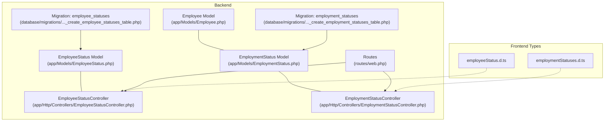
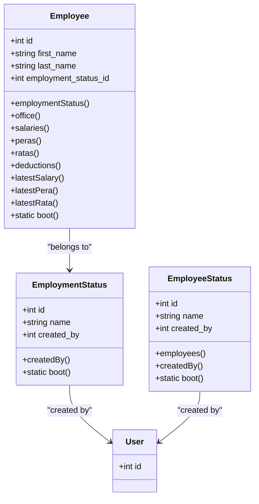
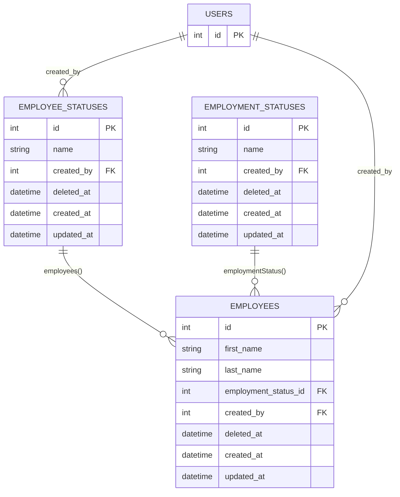
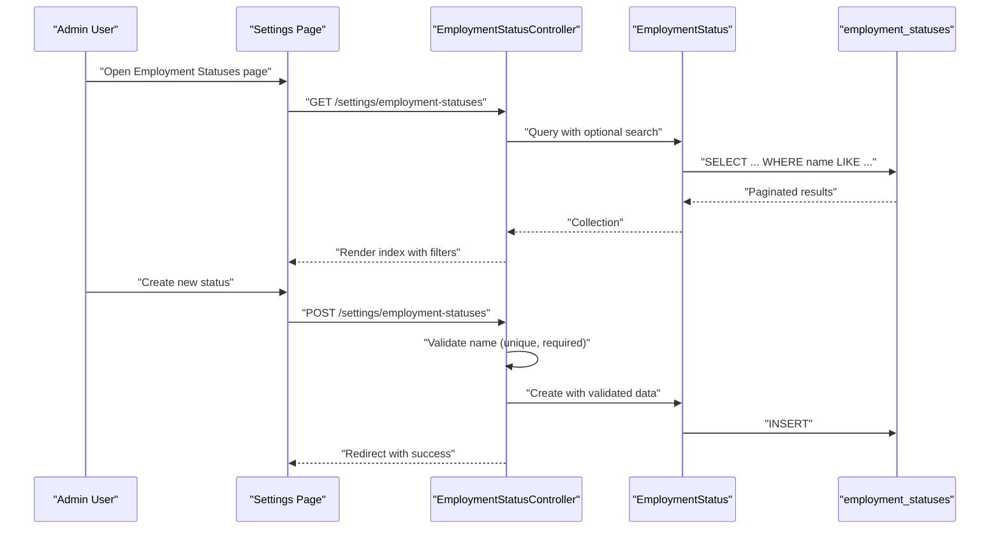
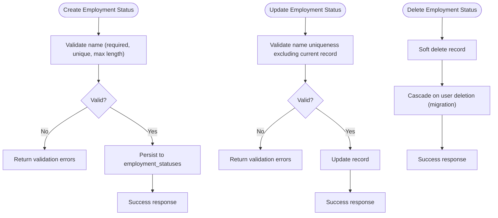
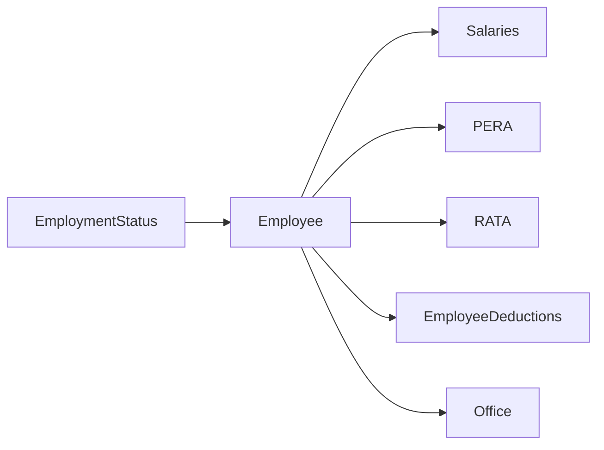
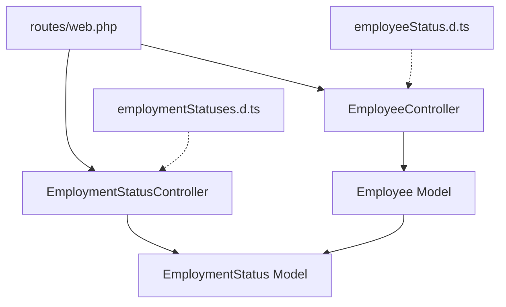

# Employee Status Management

<cite>
**Referenced Files in This Document**
- [EmployeeStatus.php](file://app/Models/EmployeeStatus.php)
- [EmploymentStatus.php](file://app/Models/EmploymentStatus.php)
- [Employee.php](file://app/Models/Employee.php)
- [EmployeeStatusController.php](file://app/Http/Controllers/EmployeeStatusController.php)
- [EmploymentStatusController.php](file://app/Http/Controllers/EmploymentStatusController.php)
- [2026_03_19_014107_create_employee_statuses_table.php](file://database/migrations/2026_03_19_014107_create_employee_statuses_table.php)
- [2026_03_19_014108_create_employment_statuses_table.php](file://database/migrations/2026_03_19_014108_create_employment_statuses_table.php)
- [web.php](file://routes/web.php)
- [employeeStatus.d.ts](file://resources/js/types/employeeStatus.d.ts)
- [employmentStatuses.d.ts](file://resources/js/types/employmentStatuses.d.ts)
</cite>

## Table of Contents
1. [Introduction](#introduction)
2. [Project Structure](#project-structure)
3. [Core Components](#core-components)
4. [Architecture Overview](#architecture-overview)
5. [Detailed Component Analysis](#detailed-component-analysis)
6. [Dependency Analysis](#dependency-analysis)
7. [Performance Considerations](#performance-considerations)
8. [Troubleshooting Guide](#troubleshooting-guide)
9. [Conclusion](#conclusion)

## Introduction
This document explains the employee status management system, focusing on two distinct but related concepts:
- Employee status: A categorical classification of employees (e.g., Active, Inactive, Suspended), managed via dedicated models and controllers.
- Employment status: A separate categorical classification tied to employment categories (e.g., Permanent, Contractual, Probationary), also managed via models and controllers.

The documentation covers the distinction between these two status types, their business meanings, data models, relationships, validation constraints, administrative interfaces, and impacts on payroll, benefits, and permissions. It also outlines workflows and their effects on employee records.

## Project Structure
The system is organized around Eloquent models, controllers, migrations, routes, and TypeScript types that define the data contracts for frontend consumption.

**Diagram sources**
- [EmployeeStatus.php:1-37](file://app/Models/EmployeeStatus.php#L1-L37)
- [EmploymentStatus.php:1-32](file://app/Models/EmploymentStatus.php#L1-L32)
- [Employee.php:1-104](file://app/Models/Employee.php#L1-L104)
- [EmployeeStatusController.php:1-11](file://app/Http/Controllers/EmployeeStatusController.php#L1-L11)
- [EmploymentStatusController.php:1-58](file://app/Http/Controllers/EmploymentStatusController.php#L1-L58)
- [2026_03_19_014107_create_employee_statuses_table.php:1-31](file://database/migrations/2026_03_19_014107_create_employee_statuses_table.php#L1-L31)
- [2026_03_19_014108_create_employment_statuses_table.php:1-31](file://database/migrations/2026_03_19_014108_create_employment_statuses_table.php#L1-L31)
- [web.php:1-100](file://routes/web.php#L1-L100)
- [employeeStatus.d.ts:1-5](file://resources/js/types/employeeStatus.d.ts#L1-L5)
- [employmentStatuses.d.ts:1-7](file://resources/js/types/employmentStatuses.d.ts#L1-L7)

**Section sources**
- [web.php:70-95](file://routes/web.php#L70-L95)
- [EmployeeStatus.php:1-37](file://app/Models/EmployeeStatus.php#L1-L37)
- [EmploymentStatus.php:1-32](file://app/Models/EmploymentStatus.php#L1-L32)
- [Employee.php:1-104](file://app/Models/Employee.php#L1-L104)

## Core Components
- EmployeeStatus model: Represents employee status categories with soft deletes and creator tracking. It defines a relationship to employees and a belongs-to relationship to the user who created it.
- EmploymentStatus model: Represents employment category classifications with soft deletes and creator tracking. It defines a belongs-to relationship to the user who created it.
- Employee model: Links employees to their employment status via a foreign key and exposes relationships to salaries, PERA, RATA, and deductions.
- Controllers:
  - EmploymentStatusController: Provides listing, creation, update, and deletion endpoints for employment statuses.
  - EmployeeStatusController: Currently empty; intended for future employee status CRUD operations.
- Routes: Define the administrative endpoints under the settings namespace for employment statuses and employees.

Key validation constraints:
- Employment status names are required, unique, and limited in length.
- Both status models track the creator via a foreign key to the users table.

**Section sources**
- [EmployeeStatus.php:13-26](file://app/Models/EmployeeStatus.php#L13-L26)
- [EmploymentStatus.php:13-21](file://app/Models/EmploymentStatus.php#L13-L21)
- [Employee.php:21-34](file://app/Models/Employee.php#L21-L34)
- [EmploymentStatusController.php:29-56](file://app/Http/Controllers/EmploymentStatusController.php#L29-L56)
- [web.php:72-95](file://routes/web.php#L72-L95)

## Architecture Overview
The system follows a layered architecture:
- Presentation: Inertia-driven pages consume typed data contracts.
- Application: Controllers handle requests and orchestrate domain logic.
- Domain: Eloquent models encapsulate persistence and relationships.
- Infrastructure: Migrations define schema and constraints.

**Diagram sources**
- [EmployeeStatus.php:9-36](file://app/Models/EmployeeStatus.php#L9-L36)
- [EmploymentStatus.php:9-31](file://app/Models/EmploymentStatus.php#L9-L31)
- [Employee.php:10-103](file://app/Models/Employee.php#L10-L103)

## Detailed Component Analysis

### Employee Status vs Employment Status
- Employee status: A categorical label for an employee’s current status (e.g., Active, Inactive, Suspended). Managed by the EmployeeStatus model and controller.
- Employment status: A categorical classification of the employment relationship (e.g., Permanent, Contractual, Probationary). Managed by the EmploymentStatus model and controller.

Business meaning:
- Employee status focuses on the operational state of the individual record.
- Employment status focuses on the nature of the employment relationship.

Administrative interfaces:
- Employment statuses are fully supported via the EmploymentStatusController and routes.
- Employee statuses are defined in the model and types but lack a dedicated controller; the EmployeeStatusController exists but is unimplemented.

Validation constraints:
- Employment status name is required, unique, and limited in length.
- Creator tracking is enforced via model boot hooks.

Impact on payroll, benefits, and permissions:
- Employees are linked to employment status via a foreign key, enabling downstream logic for eligibility and calculations.
- Benefits eligibility flags exist at the employee level (e.g., RATA eligibility), which can be combined with employment status for policy enforcement.

**Section sources**
- [EmployeeStatus.php:13-26](file://app/Models/EmployeeStatus.php#L13-L26)
- [EmploymentStatus.php:13-21](file://app/Models/EmploymentStatus.php#L13-L21)
- [Employee.php:21-34](file://app/Models/Employee.php#L21-L34)
- [EmploymentStatusController.php:29-56](file://app/Http/Controllers/EmploymentStatusController.php#L29-L56)
- [Employee.php:27-29](file://app/Models/Employee.php#L27-L29)

### Data Models and Relationships
- EmployeeStatus: Tracks name and created_by; supports soft deletes; belongs to User; employees() relationship.
- EmploymentStatus: Tracks name and created_by; supports soft deletes; belongs to User.
- Employee: Belongs to EmploymentStatus; has multiple relationships to compensation and benefit records.

**Diagram sources**
- [2026_03_19_014107_create_employee_statuses_table.php:14-20](file://database/migrations/2026_03_19_014107_create_employee_statuses_table.php#L14-L20)
- [2026_03_19_014108_create_employment_statuses_table.php:14-20](file://database/migrations/2026_03_19_014108_create_employment_statuses_table.php#L14-L20)
- [Employee.php:21-44](file://app/Models/Employee.php#L21-L44)
- [EmployeeStatus.php:18-26](file://app/Models/EmployeeStatus.php#L18-L26)
- [EmploymentStatus.php:18-21](file://app/Models/EmploymentStatus.php#L18-L21)

**Section sources**
- [2026_03_19_014107_create_employee_statuses_table.php:14-20](file://database/migrations/2026_03_19_014107_create_employee_statuses_table.php#L14-L20)
- [2026_03_19_014108_create_employment_statuses_table.php:14-20](file://database/migrations/2026_03_19_014108_create_employment_statuses_table.php#L14-L20)
- [Employee.php:21-44](file://app/Models/Employee.php#L21-L44)
- [EmployeeStatus.php:18-26](file://app/Models/EmployeeStatus.php#L18-L26)
- [EmploymentStatus.php:18-21](file://app/Models/EmploymentStatus.php#L18-L21)

### Administrative Interfaces
- Employment status administration:
  - List, search, create, update, and delete endpoints under the settings namespace.
  - Validation ensures uniqueness and length constraints.
- Employee status administration:
  - Model and types exist; controller is currently unimplemented.

**Diagram sources**
- [EmploymentStatusController.php:11-56](file://app/Http/Controllers/EmploymentStatusController.php#L11-L56)
- [web.php:72-77](file://routes/web.php#L72-L77)

**Section sources**
- [EmploymentStatusController.php:11-56](file://app/Http/Controllers/EmploymentStatusController.php#L11-L56)
- [web.php:72-77](file://routes/web.php#L72-L77)

### Transition Rules and Workflows
- Creation: On creation, both status models automatically set the creator ID via model boot hooks.
- Updates: Employment status names must remain unique; validation prevents duplicates.
- Deletion: Employment status records support soft deletes; the migration defines cascade-on-delete for the created_by relationship.
- Employee linking: Employees belong to an employment status; this linkage influences downstream calculations and benefits eligibility.

**Diagram sources**
- [EmploymentStatusController.php:29-56](file://app/Http/Controllers/EmploymentStatusController.php#L29-L56)
- [2026_03_19_014108_create_employment_statuses_table.php:17](file://database/migrations/2026_03_19_014108_create_employment_statuses_table.php#L17)
- [EmploymentStatus.php:23-30](file://app/Models/EmploymentStatus.php#L23-L30)

**Section sources**
- [EmploymentStatusController.php:29-56](file://app/Http/Controllers/EmploymentStatusController.php#L29-L56)
- [2026_03_19_014108_create_employment_statuses_table.php:17](file://database/migrations/2026_03_19_014108_create_employment_statuses_table.php#L17)
- [EmploymentStatus.php:23-30](file://app/Models/EmploymentStatus.php#L23-L30)

### Impact on Payroll, Benefits, and Permissions
- Payroll: Employees’ relationships to employment status and compensation records (salaries, PERA, RATA) enable calculation logic. Latest records are accessed via helper methods.
- Benefits: Eligibility flags exist at the employee level (e.g., RATA eligibility), which can be combined with employment status for benefit determination.
- Permissions: Creator tracking via created_by enables auditability and potential permission checks.

**Diagram sources**
- [Employee.php:31-64](file://app/Models/Employee.php#L31-L64)

**Section sources**
- [Employee.php:27-29](file://app/Models/Employee.php#L27-L29)
- [Employee.php:31-64](file://app/Models/Employee.php#L31-L64)

## Dependency Analysis
- Controllers depend on their respective models and Inertia for rendering.
- Models depend on Eloquent relationships and soft deletes.
- Routes bind UI actions to controllers.
- Frontend types define contracts for client-side consumption.

**Diagram sources**
- [web.php:72-95](file://routes/web.php#L72-L95)
- [EmploymentStatusController.php:1-58](file://app/Http/Controllers/EmploymentStatusController.php#L1-L58)
- [Employee.php:1-104](file://app/Models/Employee.php#L1-L104)
- [employmentStatuses.d.ts:1-7](file://resources/js/types/employmentStatuses.d.ts#L1-L7)
- [employeeStatus.d.ts:1-5](file://resources/js/types/employeeStatus.d.ts#L1-L5)

**Section sources**
- [web.php:72-95](file://routes/web.php#L72-L95)
- [EmploymentStatusController.php:1-58](file://app/Http/Controllers/EmploymentStatusController.php#L1-L58)
- [Employee.php:1-104](file://app/Models/Employee.php#L1-L104)

## Performance Considerations
- Indexing: Consider adding indexes on frequently filtered columns (e.g., name) in both status tables to improve search performance.
- Pagination: Controllers already paginate results; maintain reasonable page sizes to balance responsiveness and memory usage.
- Relationships: Use eager loading when displaying lists that include related data to avoid N+1 queries.

## Troubleshooting Guide
- Duplicate employment status names: Validation enforces uniqueness; ensure updates exclude the current record’s ID.
- Soft deletes: Deletion removes records from active lists but retains history; confirm whether restoration is needed.
- Creator tracking: If created_by is missing, verify authentication context and model boot hooks.

**Section sources**
- [EmploymentStatusController.php:40-49](file://app/Http/Controllers/EmploymentStatusController.php#L40-L49)
- [EmploymentStatus.php:23-30](file://app/Models/EmploymentStatus.php#L23-L30)

## Conclusion
The system provides a clear separation between employee status and employment status, with robust models, controllers, and routes supporting administrative management of employment statuses. While employee status models and types exist, the corresponding controller remains unimplemented. Integrating employment status into payroll and benefits logic requires leveraging the Employee model’s relationships and eligibility flags. Future enhancements should include implementing the EmployeeStatusController and establishing explicit transition rules and business policies for both status types.