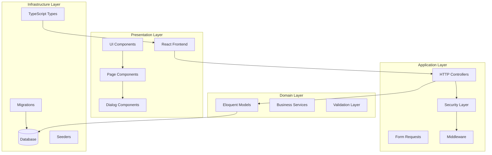
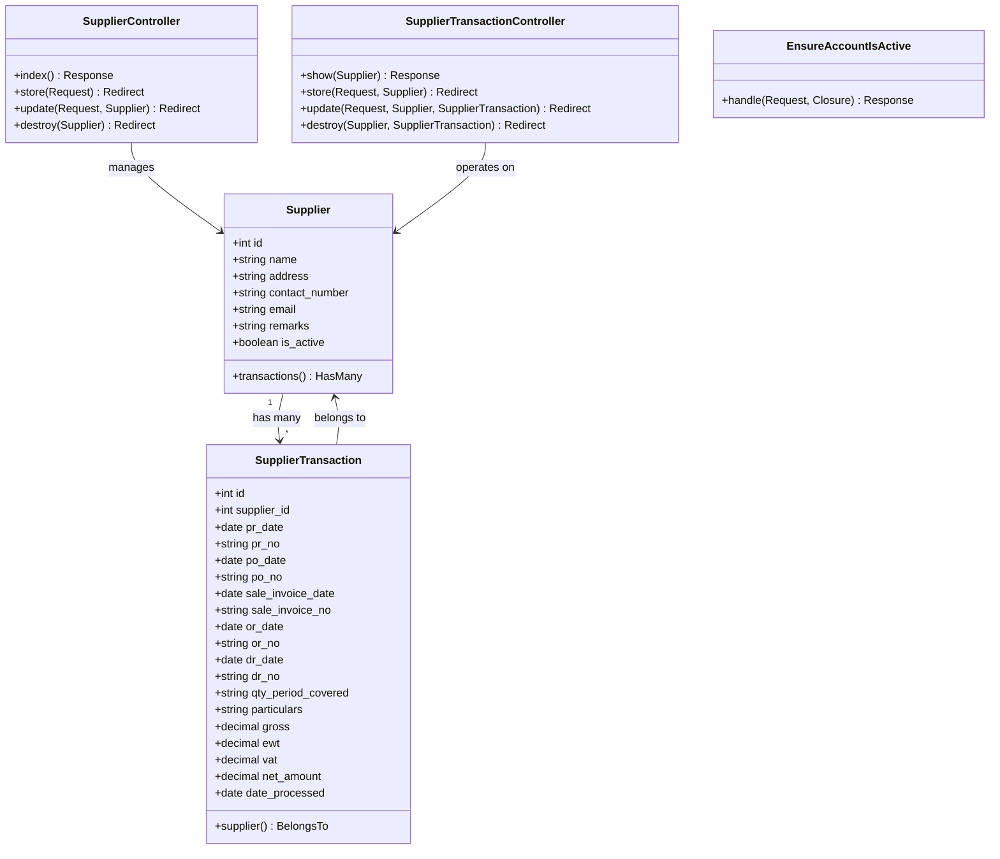
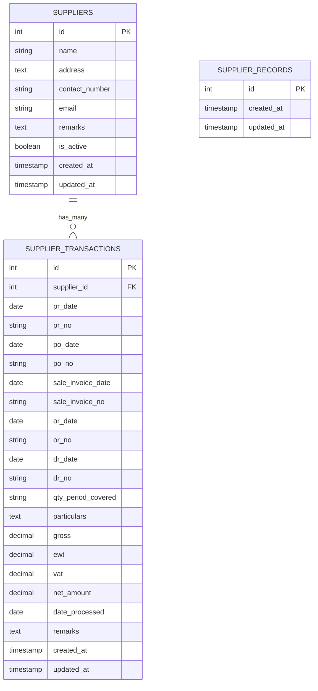
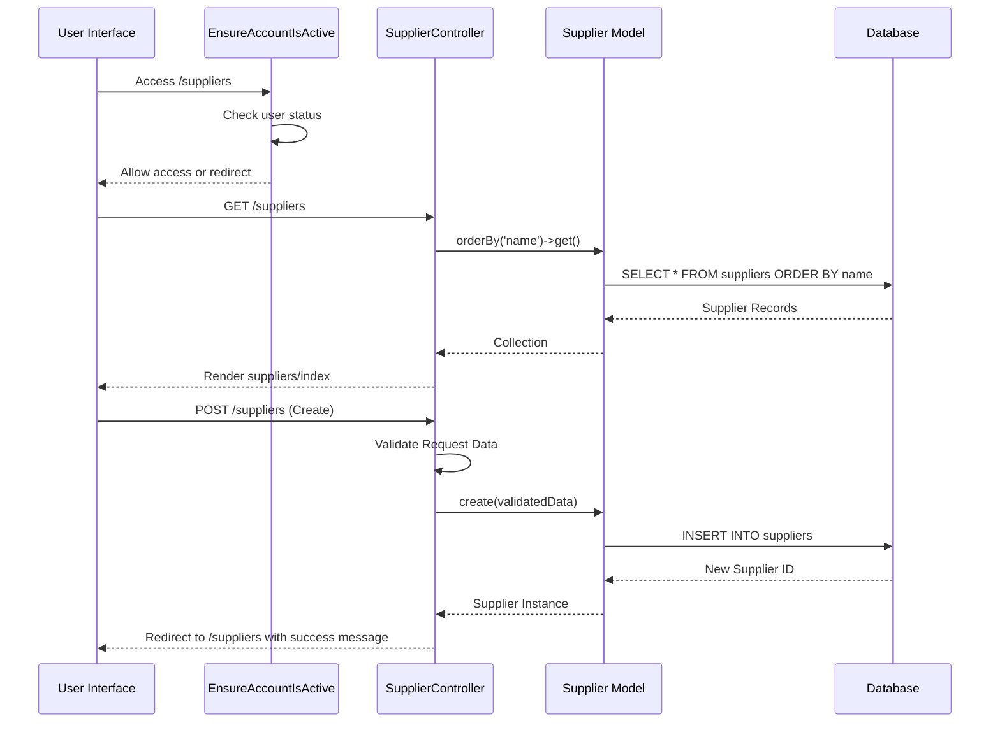
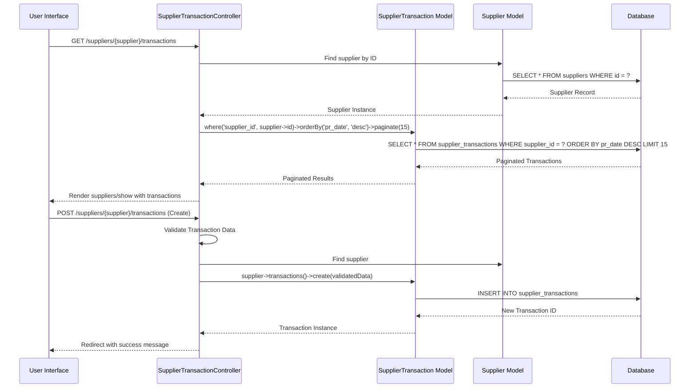
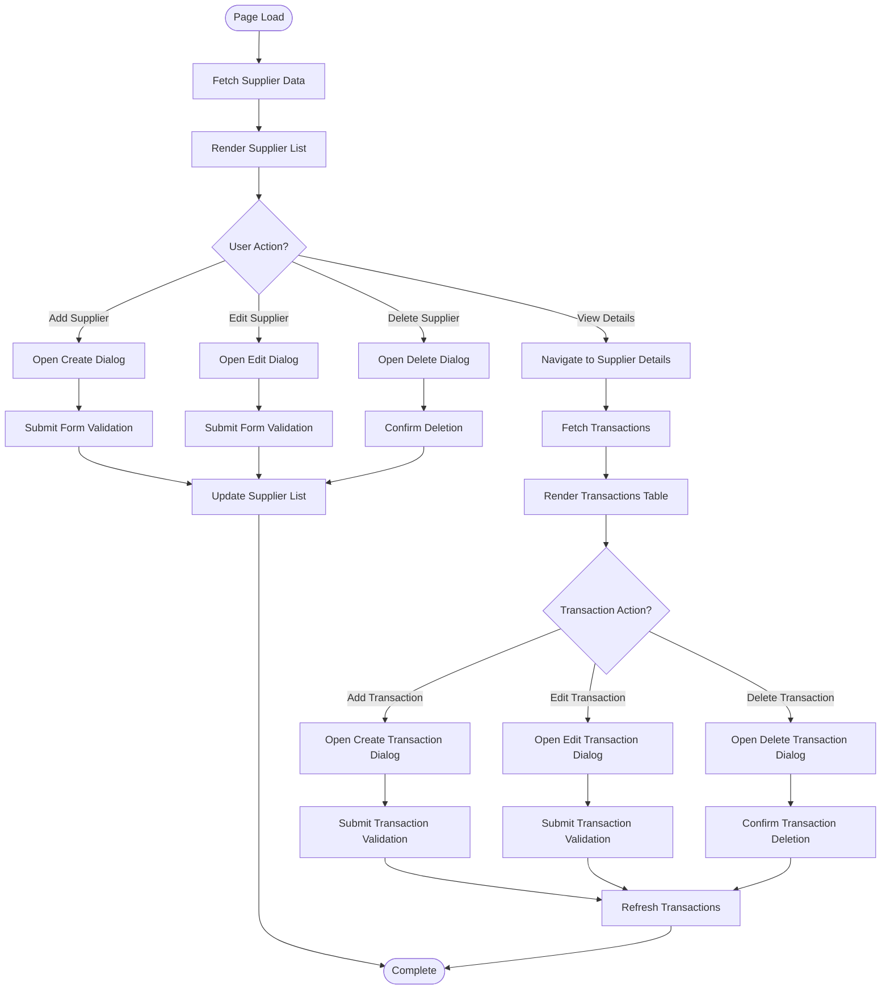
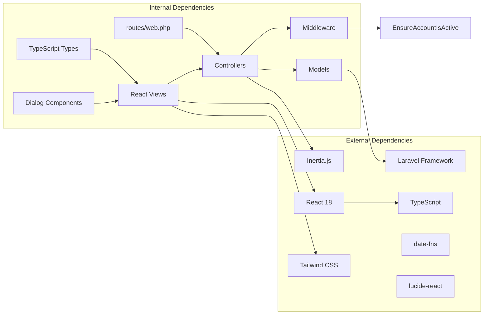

# Supplier Management System

<cite>
**Referenced Files in This Document**
- [Supplier.php](file://app/Models/Supplier.php)
- [SupplierTransaction.php](file://app/Models/SupplierTransaction.php)
- [SupplierRecord.php](file://app/Models/SupplierRecord.php)
- [SupplierController.php](file://app/Http/Controllers/SupplierController.php)
- [SupplierTransactionController.php](file://app/Http/Controllers/SupplierTransactionController.php)
- [SupplierRecordController.php](file://app/Http/Controllers/SupplierRecordController.php)
- [EnsureAccountIsActive.php](file://app/Http/Middleware/EnsureAccountIsActive.php)
- [2026_03_23_071621_create_suppliers_table.php](file://database/migrations/2026_03_23_071621_create_suppliers_table.php)
- [2026_03_23_075731_create_supplier_records_table.php](file://database/migrations/2026_03_23_075731_create_supplier_records_table.php)
- [2026_03_23_080214_create_supplier_transactions_table.php](file://database/migrations/2026_03_23_080214_create_supplier_transactions_table.php)
- [index.tsx](file://resources/js/pages/suppliers/index.tsx)
- [show.tsx](file://resources/js/pages/suppliers/show.tsx)
- [supplier.ts](file://resources/js/types/supplier.ts)
- [web.php](file://routes/web.php)
</cite>

## Update Summary
**Changes Made**
- Enhanced middleware integration with EnsureAccountIsActive for improved security
- Expanded frontend component ecosystem with comprehensive dialog-based UI
- Strengthened TypeScript integration with detailed type definitions
- Improved transaction processing with enhanced validation and formatting
- Added comprehensive CRUD operation support across all supplier management features

## Table of Contents
1. [Introduction](#introduction)
2. [Project Structure](#project-structure)
3. [Core Components](#core-components)
4. [Architecture Overview](#architecture-overview)
5. [Detailed Component Analysis](#detailed-component-analysis)
6. [Enhanced Security and Middleware](#enhanced-security-and-middleware)
7. [Frontend Component Architecture](#frontend-component-architecture)
8. [Dependency Analysis](#dependency-analysis)
9. [Performance Considerations](#performance-considerations)
10. [Troubleshooting Guide](#troubleshooting-guide)
11. [Conclusion](#conclusion)

## Introduction
The Supplier Management System is a comprehensive Laravel-based application designed to manage supplier information and their financial transactions. The system provides functionality for maintaining supplier records, tracking purchase orders, sales invoices, official receipts, and delivery receipts while managing supplier status and financial details including gross amounts, Withholding Tax (EWT), Value Added Tax (VAT), and net amounts.

The application follows a modern architecture using Laravel's MVC pattern with Inertia.js for seamless single-page application experiences, TypeScript for type safety, and a responsive React-based frontend with Tailwind CSS styling. The system now includes enhanced security middleware, comprehensive CRUD operations, and extensive frontend components with TypeScript integration.

## Project Structure
The Supplier Management System is organized into several key architectural layers with enhanced security and component integration:

**Diagram sources**
- [web.php:28-43](file://routes/web.php#L28-L43)
- [SupplierController.php:10-72](file://app/Http/Controllers/SupplierController.php#L10-L72)
- [SupplierTransactionController.php:11-103](file://app/Http/Controllers/SupplierTransactionController.php#L11-L103)
- [EnsureAccountIsActive.php:10-31](file://app/Http/Middleware/EnsureAccountIsActive.php#L10-L31)

**Section sources**
- [web.php:1-145](file://routes/web.php#L1-L145)
- [index.tsx:1-112](file://resources/js/pages/suppliers/index.tsx#L1-L112)
- [show.tsx:1-208](file://resources/js/pages/suppliers/show.tsx#L1-L208)

## Core Components

### Database Models
The system consists of three primary Eloquent models that form the core data structure with enhanced type casting and relationships:

**Supplier Model**: Manages supplier information including contact details, status, and maintains a one-to-many relationship with supplier transactions with boolean casting for active status.

**SupplierTransaction Model**: Handles detailed transaction records with comprehensive field support for procurement documents (PR, PO), sales documentation (Invoice), receipt tracking (OR), and delivery documentation (DR) with precise decimal casting for financial calculations.

**SupplierRecord Model**: Provides a foundation for future supplier record management capabilities with extensible structure.

### HTTP Controllers
The controller layer implements comprehensive RESTful operations with specialized routing for supplier management and transaction processing:

**SupplierController**: Handles full CRUD operations for supplier records with comprehensive validation, status management, and proper HTTP response handling.

**SupplierTransactionController**: Manages complete transaction lifecycle including creation, updates, and deletion with extensive validation rules, proper relationship handling, and pagination support.

**SupplierRecordController**: Serves as a placeholder for future record management functionality with extensible structure.

### Enhanced Middleware Security
**EnsureAccountIsActive**: Implements account status validation middleware that automatically logs out inactive users and redirects them to login with appropriate error messaging.

### Frontend Components
The React-based frontend provides comprehensive user interfaces with sophisticated dialog-based interactions:

**Supplier List Page**: Displays all suppliers with filtering, sorting, and action controls using modern React patterns and TypeScript interfaces.

**Supplier Detail Page**: Shows transaction history with pagination, advanced formatting, and sophisticated action dialogs for CRUD operations.

**TypeScript Interfaces**: Define strict data contracts for type safety across the application with comprehensive field definitions for both suppliers and transactions.

**Section sources**
- [Supplier.php:8-28](file://app/Models/Supplier.php#L8-L28)
- [SupplierTransaction.php:7-49](file://app/Models/SupplierTransaction.php#L7-L49)
- [SupplierController.php:10-72](file://app/Http/Controllers/SupplierController.php#L10-L72)
- [SupplierTransactionController.php:11-103](file://app/Http/Controllers/SupplierTransactionController.php#L11-L103)
- [EnsureAccountIsActive.php:10-31](file://app/Http/Middleware/EnsureAccountIsActive.php#L10-L31)

## Architecture Overview

**Diagram sources**
- [Supplier.php:8-28](file://app/Models/Supplier.php#L8-L28)
- [SupplierTransaction.php:7-49](file://app/Models/SupplierTransaction.php#L7-L49)
- [SupplierController.php:10-72](file://app/Http/Controllers/SupplierController.php#L10-L72)
- [SupplierTransactionController.php:11-103](file://app/Http/Controllers/SupplierTransactionController.php#L11-L103)
- [EnsureAccountIsActive.php:10-31](file://app/Http/Middleware/EnsureAccountIsActive.php#L10-L31)

The architecture follows clean separation of concerns with clear boundaries between presentation, application, domain, and infrastructure layers. The system utilizes Laravel's built-in features including Eloquent ORM, validation, middleware, and Inertia.js for seamless frontend-backend communication with enhanced security measures.

**Section sources**
- [web.php:31-43](file://routes/web.php#L31-L43)
- [2026_03_23_071621_create_suppliers_table.php:14-23](file://database/migrations/2026_03_23_071621_create_suppliers_table.php#L14-L23)
- [2026_03_23_080214_create_supplier_transactions_table.php:14-36](file://database/migrations/2026_03_23_080214_create_supplier_transactions_table.php#L14-L36)

## Detailed Component Analysis

### Database Schema Design

The system employs a normalized relational design optimized for supplier transaction tracking with enhanced data integrity:

**Diagram sources**
- [2026_03_23_071621_create_suppliers_table.php:14-23](file://database/migrations/2026_03_23_071621_create_suppliers_table.php#L14-L23)
- [2026_03_23_080214_create_supplier_transactions_table.php:14-36](file://database/migrations/2026_03_23_080214_create_supplier_transactions_table.php#L14-L36)
- [2026_03_23_075731_create_supplier_records_table.php:14-17](file://database/migrations/2026_03_23_075731_create_supplier_records_table.php#L14-L17)

### Enhanced Supplier Management Workflow

**Diagram sources**
- [SupplierController.php:15-41](file://app/Http/Controllers/SupplierController.php#L15-L41)
- [EnsureAccountIsActive.php:15-29](file://app/Http/Middleware/EnsureAccountIsActive.php#L15-L29)
- [2026_03_23_071621_create_suppliers_table.php:14-23](file://database/migrations/2026_03_23_071621_create_suppliers_table.php#L14-L23)

### Advanced Transaction Processing Flow

**Diagram sources**
- [SupplierTransactionController.php:16-58](file://app/Http/Controllers/SupplierTransactionController.php#L16-L58)
- [2026_03_23_080214_create_supplier_transactions_table.php:14-36](file://database/migrations/2026_03_23_080214_create_supplier_transactions_table.php#L14-L36)

### Enhanced Frontend Component Architecture

The React-based frontend components provide a responsive and interactive user experience with sophisticated dialog-based interactions:

**Diagram sources**
- [index.tsx:18-112](file://resources/js/pages/suppliers/index.tsx#L18-L112)
- [show.tsx:26-208](file://resources/js/pages/suppliers/show.tsx#L26-L208)

**Section sources**
- [index.tsx:18-112](file://resources/js/pages/suppliers/index.tsx#L18-L112)
- [show.tsx:26-208](file://resources/js/pages/suppliers/show.tsx#L26-L208)
- [supplier.ts:1-37](file://resources/js/types/supplier.ts#L1-L37)

## Enhanced Security and Middleware

### Account Status Management
The EnsureAccountIsActive middleware provides critical security functionality:

**Automatic Logout Mechanism**: When an authenticated user's account becomes inactive, the middleware automatically logs them out and invalidates their session.

**Session Management**: Proper session cleanup including token regeneration to prevent session fixation attacks.

**User Feedback**: Clear error messaging directing users to contact administrators for account restoration.

**Integration Points**: Applied as middleware in the authentication group, ensuring all supplier-related operations require active accounts.

**Section sources**
- [EnsureAccountIsActive.php:10-31](file://app/Http/Middleware/EnsureAccountIsActive.php#L10-L31)
- [web.php:28-28](file://routes/web.php#L28-L28)

## Frontend Component Architecture

### Dialog-Based Interaction System
The frontend implements a sophisticated dialog-based approach for all CRUD operations:

**Create Dialog Components**: Specialized dialogs for supplier and transaction creation with form validation and submission handling.

**Edit Dialog Components**: Modal interfaces for editing existing records with pre-populated data and real-time validation.

**Delete Confirmation Components**: Standardized confirmation dialogs with destructive action warnings.

**Form Integration**: All dialogs integrate seamlessly with Inertia.js for server-side validation and response handling.

**Responsive Design**: Dialog components adapt to different screen sizes and mobile devices.

**Accessibility**: Full keyboard navigation support and screen reader compatibility.

**Section sources**
- [index.tsx:106-112](file://resources/js/pages/suppliers/index.tsx#L106-L112)
- [show.tsx:197-208](file://resources/js/pages/suppliers/show.tsx#L197-L208)

### TypeScript Integration
Comprehensive type safety implementation:

**Supplier Interface**: Complete type definition for supplier data with optional fields and proper typing.

**SupplierTransaction Interface**: Detailed transaction type with nullable fields and decimal precision.

**Pagination Integration**: Strongly typed pagination responses for transaction data.

**Component Props**: All React components use TypeScript interfaces for props and state management.

**Build-Time Validation**: Compile-time type checking prevents runtime errors and improves developer experience.

**Section sources**
- [supplier.ts:1-37](file://resources/js/types/supplier.ts#L1-L37)

## Dependency Analysis

The system exhibits excellent modularity with clear dependency relationships and enhanced security:

**Diagram sources**
- [web.php:19-43](file://routes/web.php#L19-L43)
- [SupplierController.php:5-8](file://app/Http/Controllers/SupplierController.php#L5-L8)
- [SupplierTransactionController.php:5-9](file://app/Http/Controllers/SupplierTransactionController.php#L5-L9)
- [EnsureAccountIsActive.php:10-31](file://app/Http/Middleware/EnsureAccountIsActive.php#L10-L31)

### Data Flow Patterns

The system implements several key data flow patterns with enhanced security:

**RESTful Resource Pattern**: Standard CRUD operations with proper HTTP methods, status codes, and security middleware.

**Nested Resource Pattern**: Transactions are nested under suppliers with appropriate routing and relationship validation.

**Form Validation Pattern**: Comprehensive validation using Laravel's validation system with custom rules and TypeScript type checking.

**Pagination Pattern**: Efficient data loading with server-side pagination for large datasets and enhanced user experience.

**Dialog-Based Interaction Pattern**: Seamless modal interactions for CRUD operations with proper state management.

**Section sources**
- [web.php:31-43](file://routes/web.php#L31-L43)
- [SupplierController.php:27-70](file://app/Http/Controllers/SupplierController.php#L27-L70)
- [SupplierTransactionController.php:31-101](file://app/Http/Controllers/SupplierTransactionController.php#L31-L101)

## Performance Considerations

### Database Optimization
- **Indexing Strategy**: Foreign key relationships automatically create indexes; consider adding composite indexes for frequently queried combinations like `(supplier_id, pr_date)` for optimal transaction queries.
- **Query Optimization**: Eager loading through relationships prevents N+1 query problems; the current implementation leverages Eloquent's relationship methods effectively.
- **Pagination**: Built-in pagination limits result sets to 15 items per page, reducing memory usage and improving response times.
- **Type Casting**: Proper decimal casting ensures accurate financial calculations without precision loss.

### Frontend Performance
- **Component Caching**: React components leverage efficient re-rendering through proper state management and memoization.
- **Lazy Loading**: Large datasets are loaded progressively through pagination rather than monolithic requests.
- **Type Safety**: TypeScript compilation ensures runtime efficiency through compile-time type checking.
- **Dialog Optimization**: Modal components are conditionally rendered to minimize DOM overhead.

### Security Performance
- **Middleware Efficiency**: EnsureAccountIsActive middleware adds minimal overhead while providing critical security checks.
- **Session Management**: Efficient session handling with automatic cleanup for inactive users.
- **Input Validation**: Server-side validation prevents malicious data entry and reduces database load.

### Scalability Considerations
- **Horizontal Scaling**: Stateless controllers and database-driven architecture support load balancing.
- **Connection Pooling**: Laravel's database connection management handles concurrent requests efficiently.
- **Caching Strategy**: Consider implementing Redis caching for frequently accessed supplier lists and transaction summaries.
- **Middleware Caching**: Security middleware results can be cached for improved performance.

## Troubleshooting Guide

### Common Issues and Solutions

**Supplier Creation Failures**
- **Symptoms**: Validation errors when creating suppliers
- **Causes**: Missing required fields or invalid data types
- **Solutions**: Verify form validation rules match database constraints; check for proper field mapping in the frontend; ensure TypeScript interfaces align with backend validation rules

**Transaction Management Issues**
- **Symptoms**: Unable to add or edit transactions
- **Causes**: Supplier relationship not properly established or validation failures
- **Solutions**: Ensure supplier exists before creating transactions; verify all required transaction fields are provided; check foreign key constraints in database

**Account Status Issues**
- **Symptoms**: Automatic logout or access denied errors
- **Causes**: User account marked as inactive
- **Solutions**: Contact administrator to reactivate account; verify EnsureAccountIsActive middleware configuration

**Display Problems**
- **Symptoms**: Incorrect formatting of dates or currency values
- **Causes**: Type mismatches between backend and frontend
- **Solutions**: Check TypeScript interfaces match model casts; verify date formatting functions; ensure proper decimal precision handling

**Navigation Issues**
- **Symptoms**: 404 errors when accessing supplier pages
- **Causes**: Missing route definitions or incorrect URL generation
- **Solutions**: Verify route registration in web.php; ensure proper route naming conventions; check middleware group assignments

**Dialog Component Issues**
- **Symptoms**: Dialogs not opening or closing properly
- **Causes**: State management problems or component mounting issues
- **Solutions**: Verify dialog state variables are properly initialized; check Inertia.js integration; ensure proper event handling

### Debugging Strategies

**Backend Debugging**
- Enable Laravel debug mode for development
- Use `dd()` statements for variable inspection
- Check database logs for query performance issues
- Monitor application logs for error tracking
- Verify middleware execution order and effectiveness

**Frontend Debugging**
- Use browser developer tools for network inspection
- Check React DevTools for component state issues
- Verify TypeScript compilation errors
- Test form validation messages
- Inspect dialog component lifecycle and state management

**Database Troubleshooting**
- Verify migration completion status
- Check foreign key constraint violations
- Review data type compatibility between models and database
- Ensure proper indexing for query optimization
- Validate decimal precision and scale for financial calculations

**Middleware Debugging**
- Test EnsureAccountIsActive functionality independently
- Verify session management during middleware execution
- Check user authentication state before middleware processing
- Validate error handling and redirection logic

**Section sources**
- [SupplierController.php:29-36](file://app/Http/Controllers/SupplierController.php#L29-L36)
- [SupplierTransactionController.php:33-52](file://app/Http/Controllers/SupplierTransactionController.php#L33-L52)
- [EnsureAccountIsActive.php:15-29](file://app/Http/Middleware/EnsureAccountIsActive.php#L15-L29)
- [2026_03_23_080214_create_supplier_transactions_table.php:29-32](file://database/migrations/2026_03_23_080214_create_supplier_transactions_table.php#L29-L32)

## Conclusion

The Supplier Management System represents a well-architected, scalable solution for supplier and transaction management with enhanced security and modern development practices. The system successfully combines Laravel's robust backend capabilities with a modern React-based frontend to deliver a comprehensive supplier management experience.

Key strengths of the implementation include:

**Enhanced Security Architecture**: Implementation of EnsureAccountIsActive middleware provides critical account status validation and automatic security enforcement.

**Comprehensive CRUD Operations**: Full support for create, read, update, and delete operations across all supplier management features with proper validation and error handling.

**Modern Frontend Architecture**: Sophisticated dialog-based interactions, comprehensive TypeScript integration, and responsive design create an excellent user experience.

**Robust Data Management**: Enhanced database schema design with proper type casting, foreign key relationships, and pagination support ensures data integrity and performance.

**Architectural Excellence**: Clean separation of concerns with proper MVC implementation, clear dependency management, and comprehensive middleware integration.

**Extensibility and Maintainability**: Modular design that allows for easy addition of new features and functionality while maintaining code quality and type safety.

The system provides a solid foundation for supplier management operations while maintaining flexibility for future enhancements. The combination of Laravel's powerful features, React's component architecture, TypeScript's type safety, and enhanced security middleware creates a maintainable and scalable codebase suitable for enterprise-level applications.

Future enhancements could include advanced reporting capabilities, supplier rating systems, automated reconciliation features, integration with external accounting systems, and enhanced analytics dashboards. The current architecture supports these extensions through its modular design, comprehensive middleware layer, and strong TypeScript integration.

The system's emphasis on security, type safety, and modern development practices positions it well for long-term maintenance and evolution while providing immediate value for supplier management operations.