# Form Components

<cite>
**Referenced Files in This Document**
- [field.tsx](file://resources/js/components/ui/field.tsx)
- [input.tsx](file://resources/js/components/ui/input.tsx)
- [textarea.tsx](file://resources/js/components/ui/textarea.tsx)
- [select.tsx](file://resources/js/components/ui/select.tsx)
- [combobox.tsx](file://resources/js/components/ui/combobox.tsx)
- [calendar.tsx](file://resources/js/components/ui/calendar.tsx)
- [checkbox.tsx](file://resources/js/components/ui/checkbox.tsx)
- [switch.tsx](file://resources/js/components/ui/switch.tsx)
- [label.tsx](file://resources/js/components/ui/label.tsx)
- [custom-date-picker.tsx](file://resources/js/components/custom-date-picker.tsx)
- [CustomComboBox.tsx](file://resources/js/components/CustomComboBox.tsx)
- [input-error.tsx](file://resources/js/components/input-error.tsx)
- [utils.ts](file://resources/js/lib/utils.ts)
- [create.tsx](file://resources/js/pages/settings/Employee/create.tsx)
- [index.tsx](file://resources/js/pages/employee-deductions/index.tsx)
</cite>

## Table of Contents
1. [Introduction](#introduction)
2. [Project Structure](#project-structure)
3. [Core Components](#core-components)
4. [Architecture Overview](#architecture-overview)
5. [Detailed Component Analysis](#detailed-component-analysis)
6. [Dependency Analysis](#dependency-analysis)
7. [Performance Considerations](#performance-considerations)
8. [Troubleshooting Guide](#troubleshooting-guide)
9. [Conclusion](#conclusion)
10. [Appendices](#appendices)

## Introduction
This document explains the form components and input handling patterns used across the application. It covers the form wrapper and field components, specialized inputs (date picker, combo box), validation and error handling, form state management with Inertia’s useForm, and accessibility features. It also includes examples of complex layouts, conditional fields, dynamic forms, and user feedback strategies.

## Project Structure
The form system is composed of:
- Reusable UI primitives for inputs, labels, selects, checkboxes, switches, and calendars
- A field wrapper system that standardizes layout, labeling, descriptions, and error rendering
- Specialized composite components for date picking and combobox selection
- Pages that demonstrate controlled form state, submission, and validation feedback

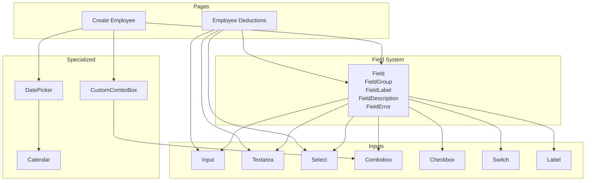

**Diagram sources**
- [field.tsx:70-236](file://resources/js/components/ui/field.tsx#L70-L236)
- [input.tsx:5-19](file://resources/js/components/ui/input.tsx#L5-L19)
- [textarea.tsx:5-18](file://resources/js/components/ui/textarea.tsx#L5-L18)
- [select.tsx:9-192](file://resources/js/components/ui/select.tsx#L9-L192)
- [combobox.tsx:16-299](file://resources/js/components/ui/combobox.tsx#L16-L299)
- [checkbox.tsx:9-33](file://resources/js/components/ui/checkbox.tsx#L9-L33)
- [switch.tsx:6-31](file://resources/js/components/ui/switch.tsx#L6-L31)
- [label.tsx:6-22](file://resources/js/components/ui/label.tsx#L6-L22)
- [calendar.tsx:13-220](file://resources/js/components/ui/calendar.tsx#L13-L220)
- [custom-date-picker.tsx:13-44](file://resources/js/components/custom-date-picker.tsx#L13-L44)
- [CustomComboBox.tsx:21-59](file://resources/js/components/CustomComboBox.tsx#L21-L59)
- [create.tsx:33-282](file://resources/js/pages/settings/Employee/create.tsx#L33-L282)
- [index.tsx:54-399](file://resources/js/pages/employee-deductions/index.tsx#L54-L399)

**Section sources**
- [field.tsx:1-237](file://resources/js/components/ui/field.tsx#L1-L237)
- [input.tsx:1-20](file://resources/js/components/ui/input.tsx#L1-L20)
- [textarea.tsx:1-19](file://resources/js/components/ui/textarea.tsx#L1-L19)
- [select.tsx:1-193](file://resources/js/components/ui/select.tsx#L1-L193)
- [combobox.tsx:1-300](file://resources/js/components/ui/combobox.tsx#L1-L300)
- [calendar.tsx:1-221](file://resources/js/components/ui/calendar.tsx#L1-L221)
- [checkbox.tsx:1-34](file://resources/js/components/ui/checkbox.tsx#L1-L34)
- [switch.tsx:1-32](file://resources/js/components/ui/switch.tsx#L1-L32)
- [label.tsx:1-23](file://resources/js/components/ui/label.tsx#L1-L23)
- [custom-date-picker.tsx:1-45](file://resources/js/components/custom-date-picker.tsx#L1-L45)
- [CustomComboBox.tsx:1-60](file://resources/js/components/CustomComboBox.tsx#L1-L60)
- [input-error.tsx:1-11](file://resources/js/components/input-error.tsx#L1-L11)
- [utils.ts:1-7](file://resources/js/lib/utils.ts#L1-L7)
- [create.tsx:1-283](file://resources/js/pages/settings/Employee/create.tsx#L1-L283)
- [index.tsx:1-401](file://resources/js/pages/employee-deductions/index.tsx#L1-L401)

## Core Components
- Field system: Provides standardized wrappers for grouping inputs with labels, descriptions, and error messages. Supports vertical, horizontal, and responsive orientations.
- Inputs: Styled base Input and Textarea with consistent focus states, invalid states, and responsive sizing.
- Selection controls: Select with dropdown content and Combobox with chips and filtering.
- Date handling: Calendar and DatePicker for single-date selection with popover integration.
- Controls: Checkbox and Switch for binary toggles.
- Utilities: cn helper for Tailwind merging.

Key capabilities:
- Controlled components via Inertia useForm in pages
- Error rendering with FieldError and ad hoc InputError
- Accessibility: aria-invalid, focus management, and semantic labeling

**Section sources**
- [field.tsx:52-84](file://resources/js/components/ui/field.tsx#L52-L84)
- [input.tsx:5-19](file://resources/js/components/ui/input.tsx#L5-L19)
- [textarea.tsx:5-18](file://resources/js/components/ui/textarea.tsx#L5-L18)
- [select.tsx:9-192](file://resources/js/components/ui/select.tsx#L9-L192)
- [combobox.tsx:16-299](file://resources/js/components/ui/combobox.tsx#L16-L299)
- [calendar.tsx:13-220](file://resources/js/components/ui/calendar.tsx#L13-L220)
- [checkbox.tsx:9-33](file://resources/js/components/ui/checkbox.tsx#L9-L33)
- [switch.tsx:6-31](file://resources/js/components/ui/switch.tsx#L6-L31)
- [label.tsx:6-22](file://resources/js/components/ui/label.tsx#L6-L22)
- [custom-date-picker.tsx:13-44](file://resources/js/components/custom-date-picker.tsx#L13-L44)
- [CustomComboBox.tsx:21-59](file://resources/js/components/CustomComboBox.tsx#L21-L59)
- [input-error.tsx:4-10](file://resources/js/components/input-error.tsx#L4-L10)
- [utils.ts:4-6](file://resources/js/lib/utils.ts#L4-L6)

## Architecture Overview
The form architecture centers on:
- Field wrappers to enforce consistent spacing, labeling, and error presentation
- Primitive inputs styled uniformly and made accessible
- Composite components (DatePicker, CustomComboBox) that encapsulate complex behaviors
- Pages orchestrating state with useForm and driving submission

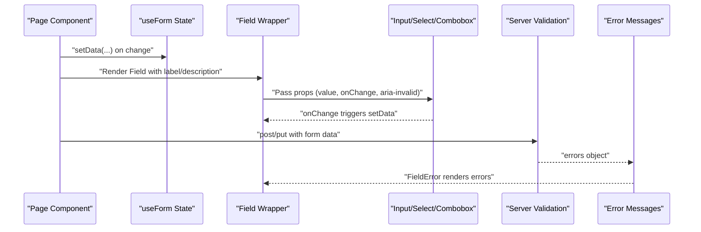

**Diagram sources**
- [create.tsx:37-99](file://resources/js/pages/settings/Employee/create.tsx#L37-L99)
- [field.tsx:174-223](file://resources/js/components/ui/field.tsx#L174-L223)
- [input.tsx:5-19](file://resources/js/components/ui/input.tsx#L5-L19)
- [select.tsx:9-192](file://resources/js/components/ui/select.tsx#L9-L192)
- [combobox.tsx:16-299](file://resources/js/components/ui/combobox.tsx#L16-L299)

## Detailed Component Analysis

### Field System
The Field family standardizes form layout and semantics:
- Field: Container with orientation variants (vertical, horizontal, responsive)
- FieldGroup: Higher-order container for related fields
- FieldLabel: Accessible label integrated with field groups
- FieldDescription: Help text with responsive balance
- FieldError: Renders either children or normalized unique error messages
- FieldSet/Legend: Grouping with optional legend
- FieldContent/Title/Separator: Compositional helpers

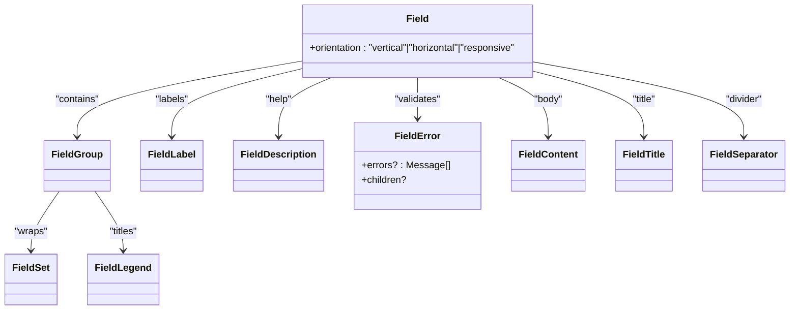

**Diagram sources**
- [field.tsx:70-236](file://resources/js/components/ui/field.tsx#L70-L236)

**Section sources**
- [field.tsx:70-236](file://resources/js/components/ui/field.tsx#L70-L236)

### Input Primitives
- Input: Base text input with focus/invalid states and responsive typography
- Textarea: Multi-line input with focus/invalid states
- Label: Accessible label with disabled state handling
- Checkbox: Styled checkbox with indicator
- Switch: Toggle control with sizes

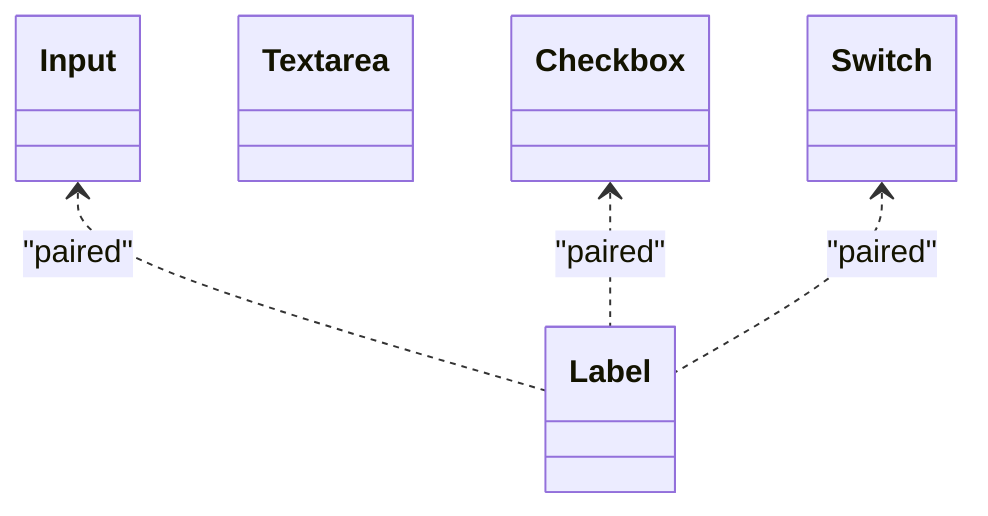

**Diagram sources**
- [input.tsx:5-19](file://resources/js/components/ui/input.tsx#L5-L19)
- [textarea.tsx:5-18](file://resources/js/components/ui/textarea.tsx#L5-L18)
- [label.tsx:6-22](file://resources/js/components/ui/label.tsx#L6-L22)
- [checkbox.tsx:9-33](file://resources/js/components/ui/checkbox.tsx#L9-L33)
- [switch.tsx:6-31](file://resources/js/components/ui/switch.tsx#L6-L31)

**Section sources**
- [input.tsx:5-19](file://resources/js/components/ui/input.tsx#L5-L19)
- [textarea.tsx:5-18](file://resources/js/components/ui/textarea.tsx#L5-L18)
- [label.tsx:6-22](file://resources/js/components/ui/label.tsx#L6-L22)
- [checkbox.tsx:9-33](file://resources/js/components/ui/checkbox.tsx#L9-L33)
- [switch.tsx:6-31](file://resources/js/components/ui/switch.tsx#L6-L31)

### Select and Combobox
- Select: Dropdown with trigger, content, items, and scroll buttons
- Combobox: Advanced input with filtering, chips, and item selection

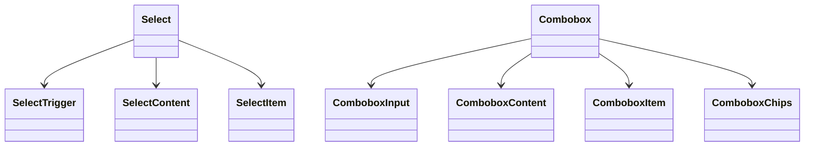

**Diagram sources**
- [select.tsx:9-192](file://resources/js/components/ui/select.tsx#L9-L192)
- [combobox.tsx:16-299](file://resources/js/components/ui/combobox.tsx#L16-L299)

**Section sources**
- [select.tsx:9-192](file://resources/js/components/ui/select.tsx#L9-L192)
- [combobox.tsx:16-299](file://resources/js/components/ui/combobox.tsx#L16-L299)

### Calendar and DatePicker
- Calendar: Styled date picker with localized captions and keyboard focus
- DatePicker: Popover-bound single-date selector using Calendar

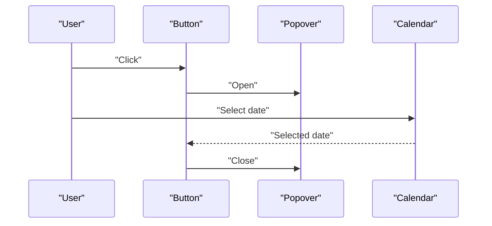

**Diagram sources**
- [custom-date-picker.tsx:13-44](file://resources/js/components/custom-date-picker.tsx#L13-L44)
- [calendar.tsx:13-220](file://resources/js/components/ui/calendar.tsx#L13-L220)

**Section sources**
- [custom-date-picker.tsx:13-44](file://resources/js/components/custom-date-picker.tsx#L13-L44)
- [calendar.tsx:13-220](file://resources/js/components/ui/calendar.tsx#L13-L220)

### CustomComboBox
A thin wrapper around Combobox that:
- Accepts items as value/label pairs
- Normalizes value/defaultValue
- Exposes onSelect callback returning string|null

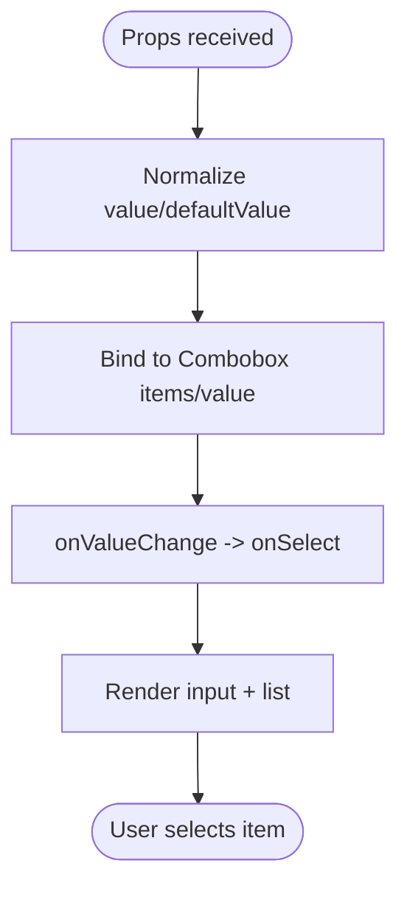

**Diagram sources**
- [CustomComboBox.tsx:21-59](file://resources/js/components/CustomComboBox.tsx#L21-L59)
- [combobox.tsx:16-299](file://resources/js/components/ui/combobox.tsx#L16-L299)

**Section sources**
- [CustomComboBox.tsx:21-59](file://resources/js/components/CustomComboBox.tsx#L21-L59)

### Validation and Error Handling
- FieldError: Deduplicates and renders either children or a list of unique messages
- InputError: Lightweight paragraph for inline error text
- Pages demonstrate server-side validation feedback via useForm.errors

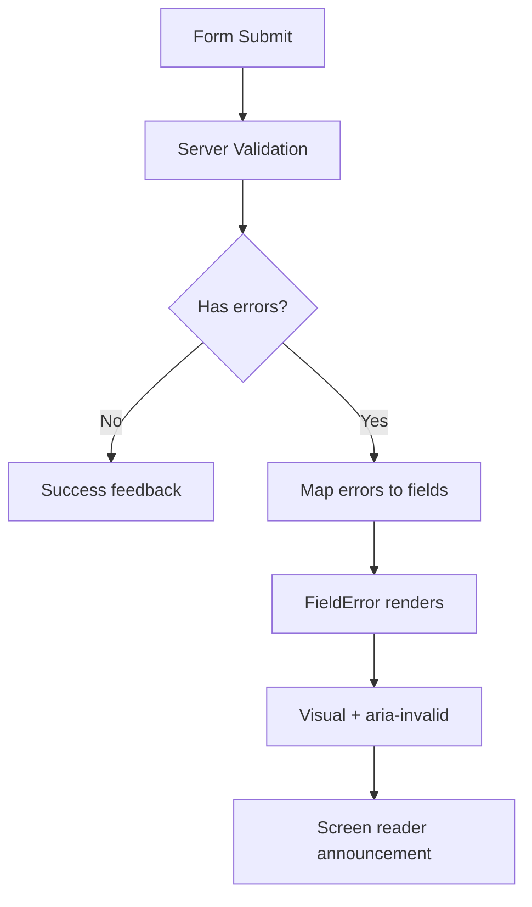

**Diagram sources**
- [field.tsx:174-223](file://resources/js/components/ui/field.tsx#L174-L223)
- [input-error.tsx:4-10](file://resources/js/components/input-error.tsx#L4-L10)
- [create.tsx:37-99](file://resources/js/pages/settings/Employee/create.tsx#L37-L99)

**Section sources**
- [field.tsx:174-223](file://resources/js/components/ui/field.tsx#L174-L223)
- [input-error.tsx:4-10](file://resources/js/components/input-error.tsx#L4-L10)
- [create.tsx:37-99](file://resources/js/pages/settings/Employee/create.tsx#L37-L99)

### Form State Management and Submission
- Controlled components: All inputs are controlled via useForm
- onChange handlers update data in state
- Submission uses router.post/put with options like forceFormData and onSuccess callbacks

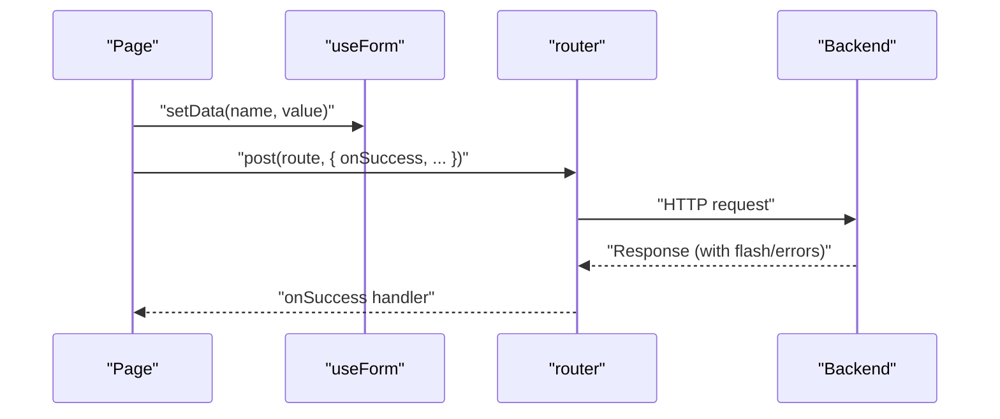

**Diagram sources**
- [create.tsx:37-99](file://resources/js/pages/settings/Employee/create.tsx#L37-L99)
- [index.tsx:66-139](file://resources/js/pages/employee-deductions/index.tsx#L66-L139)

**Section sources**
- [create.tsx:37-99](file://resources/js/pages/settings/Employee/create.tsx#L37-L99)
- [index.tsx:66-139](file://resources/js/pages/employee-deductions/index.tsx#L66-L139)

### Examples: Complex Layouts, Conditional Fields, Dynamic Forms
- Create Employee page demonstrates:
  - Grid-based layout with image upload preview
  - Conditional actions (remove photo)
  - Mixed inputs: Input, Select, Switch, CustomComboBox
  - Inline error rendering per field
- Employee Deductions page demonstrates:
  - Modal dialogs for add/edit
  - Dynamic pay period display
  - Controlled inputs inside dialogs
  - Filtering and pagination

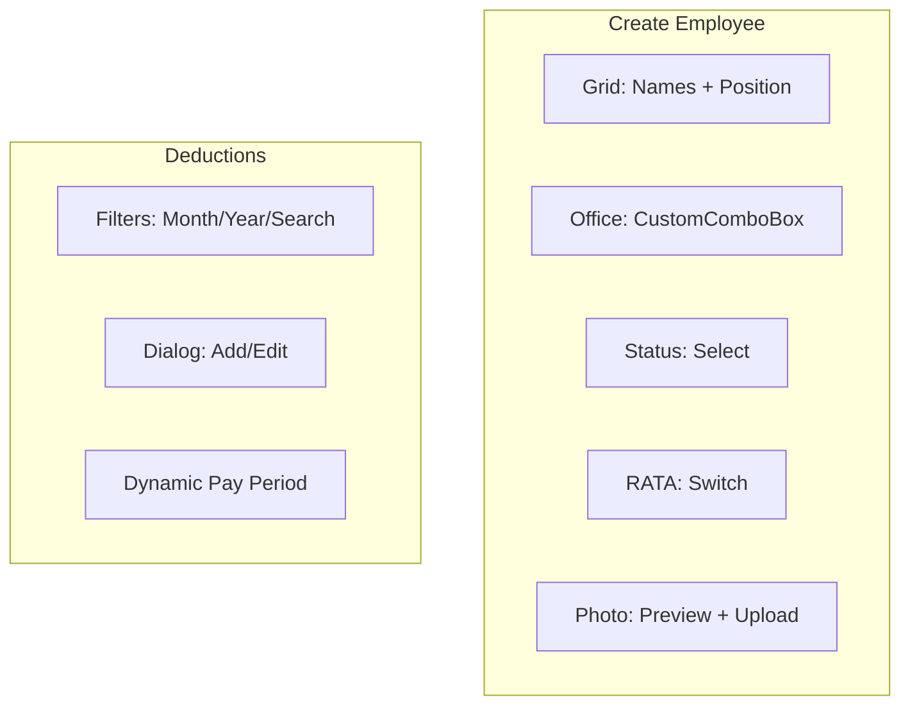

**Diagram sources**
- [create.tsx:106-281](file://resources/js/pages/settings/Employee/create.tsx#L106-L281)
- [index.tsx:154-399](file://resources/js/pages/employee-deductions/index.tsx#L154-L399)

**Section sources**
- [create.tsx:106-281](file://resources/js/pages/settings/Employee/create.tsx#L106-L281)
- [index.tsx:154-399](file://resources/js/pages/employee-deductions/index.tsx#L154-L399)

## Dependency Analysis
- Field system depends on cn utility for class merging
- Composite components depend on primitive inputs and Radix/DayPicker
- Pages depend on useForm and router for state and submission
- DatePicker composes Calendar and Popover
- CustomComboBox composes Combobox primitives

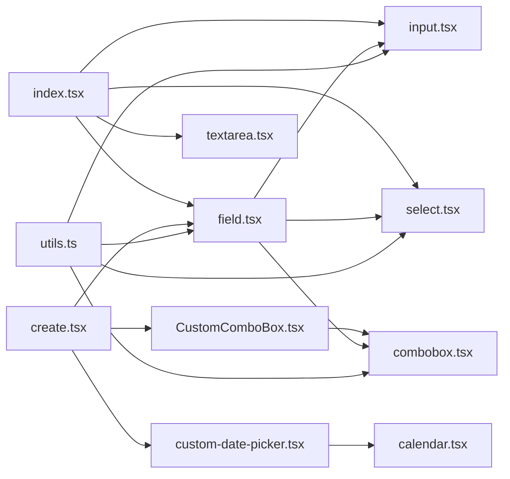

**Diagram sources**
- [utils.ts:4-6](file://resources/js/lib/utils.ts#L4-L6)
- [field.tsx:4-4](file://resources/js/components/ui/field.tsx#L4-L4)
- [input.tsx:3-3](file://resources/js/components/ui/input.tsx#L3-L3)
- [select.tsx:6-6](file://resources/js/components/ui/select.tsx#L6-L6)
- [combobox.tsx:6-6](file://resources/js/components/ui/combobox.tsx#L6-L6)
- [custom-date-picker.tsx:4-11](file://resources/js/components/custom-date-picker.tsx#L4-L11)
- [calendar.tsx:9-11](file://resources/js/components/ui/calendar.tsx#L9-L11)
- [CustomComboBox.tsx:3-10](file://resources/js/components/CustomComboBox.tsx#L3-L10)
- [create.tsx:12-15](file://resources/js/pages/settings/Employee/create.tsx#L12-L15)
- [index.tsx:18-10](file://resources/js/pages/employee-deductions/index.tsx#L18-L10)

**Section sources**
- [utils.ts:4-6](file://resources/js/lib/utils.ts#L4-L6)
- [field.tsx:4-4](file://resources/js/components/ui/field.tsx#L4-L4)
- [input.tsx:3-3](file://resources/js/components/ui/input.tsx#L3-L3)
- [select.tsx:6-6](file://resources/js/components/ui/select.tsx#L6-L6)
- [combobox.tsx:6-6](file://resources/js/components/ui/combobox.tsx#L6-L6)
- [custom-date-picker.tsx:4-11](file://resources/js/components/custom-date-picker.tsx#L4-L11)
- [calendar.tsx:9-11](file://resources/js/components/ui/calendar.tsx#L9-L11)
- [CustomComboBox.tsx:3-10](file://resources/js/components/CustomComboBox.tsx#L3-L10)
- [create.tsx:12-15](file://resources/js/pages/settings/Employee/create.tsx#L12-L15)
- [index.tsx:18-10](file://resources/js/pages/employee-deductions/index.tsx#L18-L10)

## Performance Considerations
- Prefer controlled components to avoid unnecessary re-renders
- Memoize derived options (e.g., officeOptions) to prevent recomputation
- Use minimal state updates; batch related changes when possible
- Defer expensive computations until after user input stabilizes (e.g., debounced search)
- Keep FieldError memoization to reduce DOM churn during rapid edits

## Troubleshooting Guide
Common issues and resolutions:
- Duplicate or repeated error messages: Use FieldError to deduplicate messages
- Inline errors not visible: Ensure aria-invalid is applied to inputs and FieldError wraps the field
- Keyboard focus lost after selection: Calendar focuses the selected day; ensure Popover remains open until user closes
- Combobox does not reflect initial value: Pass value/defaultValue consistently and normalize to item reference
- Switch/Checkbox not updating: Ensure onCheckedChange/onValueChange is wired to setData

**Section sources**
- [field.tsx:174-223](file://resources/js/components/ui/field.tsx#L174-L223)
- [calendar.tsx:181-218](file://resources/js/components/ui/calendar.tsx#L181-L218)
- [CustomComboBox.tsx:21-59](file://resources/js/components/CustomComboBox.tsx#L21-L59)
- [switch.tsx:6-31](file://resources/js/components/ui/switch.tsx#L6-L31)
- [checkbox.tsx:9-33](file://resources/js/components/ui/checkbox.tsx#L9-L33)

## Conclusion
The form system provides a cohesive, accessible, and extensible foundation for building complex forms. The Field wrapper ensures consistent UX, while specialized inputs and composites simplify common patterns. Controlled components, robust error handling, and clear accessibility attributes deliver a reliable user experience across diverse scenarios.

## Appendices

### Accessibility Features
- aria-invalid applied to inputs on invalid state
- Focus management in Calendar and Combobox
- Semantic labels paired with inputs
- Screen reader-friendly error announcements via role="alert"

**Section sources**
- [input.tsx:11-11](file://resources/js/components/ui/input.tsx#L11-L11)
- [textarea.tsx:10-10](file://resources/js/components/ui/textarea.tsx#L10-L10)
- [calendar.tsx:196-217](file://resources/js/components/ui/calendar.tsx#L196-L217)
- [label.tsx:14-14](file://resources/js/components/ui/label.tsx#L14-L14)
- [field.tsx:214-214](file://resources/js/components/ui/field.tsx#L214-L214)