# Frontend Components & UI

<cite>
**Referenced Files in This Document**
- [app.tsx](file://resources/js/app.tsx)
- [utils.ts](file://resources/js/lib/utils.ts)
- [components.json](file://components.json)
- [package.json](file://package.json)
- [tsconfig.json](file://tsconfig.json)
- [button.tsx](file://resources/js/components/ui/button.tsx)
- [input.tsx](file://resources/js/components/ui/input.tsx)
- [dialog.tsx](file://resources/js/components/ui/dialog.tsx)
- [card.tsx](file://resources/js/components/ui/card.tsx)
- [select.tsx](file://resources/js/components/ui/select.tsx)
- [table.tsx](file://resources/js/components/ui/table.tsx)
- [badge.tsx](file://resources/js/components/ui/badge.tsx)
- [avatar.tsx](file://resources/js/components/ui/avatar.tsx)
- [checkbox.tsx](file://resources/js/components/ui/checkbox.tsx)
- [dropdown-menu.tsx](file://resources/js/components/ui/dropdown-menu.tsx)
- [sidebar.tsx](file://resources/js/components/ui/sidebar.tsx)
- [sheet.tsx](file://resources/js/components/ui/sheet.tsx)
- [navigation-menu.tsx](file://resources/js/components/ui/navigation-menu.tsx)
- [menubar.tsx](file://resources/js/components/ui/menubar.tsx)
- [NavMenu.tsx](file://resources/js/components/NavMenu.tsx)
- [NavMain2.tsx](file://resources/js/components/NavMain2.tsx)
- [MenuBar.tsx](file://resources/js/components/MenuBar.tsx)
- [paginationData.tsx](file://resources/js/components/paginationData.tsx)
- [Index.tsx](file://resources/js/pages/Employees/Index.tsx)
- [dashboard.tsx](file://resources/js/pages/dashboard.tsx)
- [use-mobile.ts](file://resources/js/hooks/use-mobile.ts)
- [use-mobile.tsx](file://resources/js/hooks/use-mobile.tsx)
- [use-mobile-navigation.ts](file://resources/js/hooks/use-mobile-navigation.ts)
- [placeholder-pattern.tsx](file://resources/js/components/ui/placeholder-pattern.tsx)
- [app-header.tsx](file://resources/js/components/app-header.tsx)
- [app-header-layout.tsx](file://resources/js/layouts/app/app-header-layout.tsx)
- [Settings.tsx](file://resources/js/pages/Employees/Manage/Settings.tsx)
- [Compensation.tsx](file://resources/js/pages/Employees/Manage/Compensation.tsx)
- [salary.tsx](file://resources/js/pages/Employees/Manage/compensation/salary.tsx)
- [salaryDialog.tsx](file://resources/js/pages/Employees/Manage/compensation/salaryDialog.tsx)
</cite>

## Update Summary
**Changes Made**
- Added comprehensive employee management system with new Settings.tsx component (265 lines)
- Introduced Compensation.tsx with tabbed interface for salary, PERA, RATA, and deductions
- Created salary.tsx and salaryDialog.tsx for salary management functionality
- Updated employee settings interface to replace old implementation with modern React patterns
- Enhanced form handling with Inertia router integration and toast notifications
- Added comprehensive photo upload functionality with preview and removal capabilities

## Table of Contents
1. [Introduction](#introduction)
2. [Project Structure](#project-structure)
3. [Core Components](#core-components)
4. [Architecture Overview](#architecture-overview)
5. [Detailed Component Analysis](#detailed-component-analysis)
6. [Modernized UI Components](#modernized-ui-components)
7. [Enhanced Navigation Systems](#enhanced-navigation-systems)
8. [Employee Management System](#employee-management-system)
9. [React 19 Integration](#react-19-integration)
10. [Mobile-First Design Patterns](#mobile-first-design-patterns)
11. [Advanced Component Features](#advanced-component-features)
12. [Enhanced Pages](#enhanced-pages)
13. [Dependency Analysis](#dependency-analysis)
14. [Performance Considerations](#performance-considerations)
15. [Troubleshooting Guide](#troubleshooting-guide)
16. [Conclusion](#conclusion)
17. [Appendices](#appendices)

## Introduction
This document describes the frontend component library and UI architecture built with React 19, Inertia, Radix UI, Tailwind CSS, and shadcn-inspired patterns. The system has been comprehensively modernized with enhanced navigation components, a complete Menubar system, and advanced React 19 integration patterns. It covers reusable UI components, their props, styling, composition, state management, interactivity, responsive design, accessibility, and integration patterns. It also outlines testing approaches and the development workflow.

**Updated** The system now includes a comprehensive employee management frontend system with modern React patterns and enhanced functionality.

## Project Structure
The frontend is organized around a modern component library under resources/js/components/ui and page components under resources/js/pages. The application bootstraps via Inertia and Vite, with Tailwind CSS providing utility-first styling and a centralized alias configuration for imports. The architecture now leverages React 19's modern patterns including new hooks and improved performance characteristics.

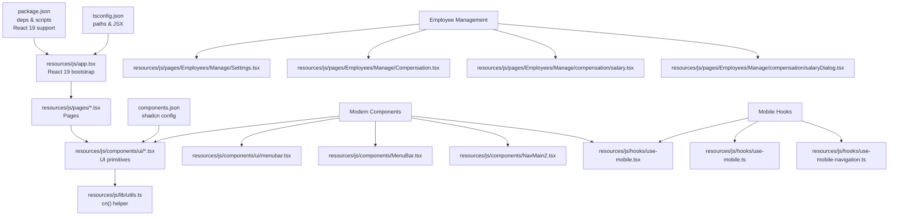

**Diagram sources**
- [app.tsx:1-30](file://resources/js/app.tsx#L1-L30)
- [utils.ts:1-7](file://resources/js/lib/utils.ts#L1-L7)
- [components.json:1-26](file://components.json#L1-L26)
- [package.json:56-58](file://package.json#L56-L58)
- [tsconfig.json:111-116](file://tsconfig.json#L111-L116)
- [menubar.tsx:1-279](file://resources/js/components/ui/menubar.tsx#L1-L279)
- [MenuBar.tsx:1-137](file://resources/js/components/MenuBar.tsx#L1-L137)
- [NavMain2.tsx:1-29](file://resources/js/components/NavMain2.tsx#L1-L29)
- [use-mobile.tsx:1-22](file://resources/js/hooks/use-mobile.tsx#L1-L22)
- [use-mobile.ts:1-19](file://resources/js/hooks/use-mobile.ts#L1-L19)
- [use-mobile-navigation.ts:1-11](file://resources/js/hooks/use-mobile-navigation.ts#L1-L11)
- [Settings.tsx:1-265](file://resources/js/pages/Employees/Manage/Settings.tsx#L1-L265)
- [Compensation.tsx:1-42](file://resources/js/pages/Employees/Manage/Compensation.tsx#L1-L42)
- [salary.tsx:1-4](file://resources/js/pages/Employees/Manage/compensation/salary.tsx#L1-L4)
- [salaryDialog.tsx:1-197](file://resources/js/pages/Employees/Manage/compensation/salaryDialog.tsx#L1-L197)

**Section sources**
- [app.tsx:1-30](file://resources/js/app.tsx#L1-L30)
- [components.json:1-26](file://components.json#L1-L26)
- [package.json:1-74](file://package.json#L1-L74)
- [tsconfig.json:111-116](file://tsconfig.json#L111-L116)

## Core Components
This section documents the primary UI components and their capabilities, now enhanced with React 19 patterns and improved accessibility.

- Button
  - Purpose: Action trigger with variants and sizes.
  - Key props: variant, size, asChild, className.
  - Variants: default, outline, secondary, ghost, destructive, link.
  - Sizes: default, xs, sm, lg, icon, icon-xs, icon-sm, icon-lg.
  - Accessibility: Inherits native button semantics; supports focus-visible styles.
  - Composition: Uses Slot for semantic composition; integrates with icons.
  - **Updated**: Enhanced with cursor-pointer class for improved user feedback.

- Input
  - Purpose: Text input with consistent styling and focus states.
  - Key props: type, className.
  - Accessibility: Supports aria-invalid for error states; focus-visible ring.
  - Styling: Tailwind-based with ring focus and destructive variants.

- Dialog
  - Purpose: Modal overlay with header, footer, and close controls.
  - Key parts: Root, Trigger, Portal, Overlay, Content, Header, Footer, Title, Description, Close.
  - Props: showCloseButton, size alignment, animation classes.
  - Accessibility: Focus trapping, backdrop blur, sr-only close label.

- Card
  - Purpose: Content container with header, title, description, action, content, and footer.
  - Key props: size (default, sm).
  - Layout: Grid-based header with optional action and description rows.

- Select
  - Purpose: Dropdown selection with groups, labels, items, and scroll buttons.
  - Key parts: Root, Group, Value, Trigger, Content, Label, Item, Separator, ScrollUp/Down Buttons.
  - Props: size (sm, default), position (item-aligned, popper), align.
  - Accessibility: Keyboard navigation, focus-visible, indicator for selected item.

- Table
  - Purpose: Responsive table wrapper with container and semantic cells.
  - Key parts: Table, TableHeader, TableBody, TableFooter, TableRow, TableHead, TableCell, TableCaption.
  - Responsiveness: Horizontal scrolling container; hover and selected states.

- Badge
  - Purpose: Label or status indicator with variants.
  - Key props: variant, asChild.
  - Variants: default, secondary, destructive, outline, ghost, link.

- Avatar
  - Purpose: User identity with image, fallback, badge, and group utilities.
  - Key parts: Avatar, AvatarImage, AvatarFallback, AvatarBadge, AvatarGroup, AvatarGroupCount.
  - Props: size (default, sm, lg); group spacing and ring behavior.

- Checkbox
  - Purpose: Binary selection with visual indicator.
  - Props: className; integrates with focus-visible and invalid states.

**Section sources**
- [button.tsx:1-68](file://resources/js/components/ui/button.tsx#L1-L68)
- [input.tsx:1-20](file://resources/js/components/ui/input.tsx#L1-L20)
- [dialog.tsx:1-166](file://resources/js/components/ui/dialog.tsx#L1-L166)
- [card.tsx:1-104](file://resources/js/components/ui/card.tsx#L1-L104)
- [select.tsx:1-193](file://resources/js/components/ui/select.tsx#L1-L193)
- [table.tsx:1-115](file://resources/js/components/ui/table.tsx#L1-L115)
- [badge.tsx:1-50](file://resources/js/components/ui/badge.tsx#L1-L50)
- [avatar.tsx:1-111](file://resources/js/components/ui/avatar.tsx#L1-L111)
- [checkbox.tsx:1-34](file://resources/js/components/ui/checkbox.tsx#L1-L34)

## Architecture Overview
The UI architecture follows a modernized layered pattern leveraging React 19:
- Application bootstrap sets up Inertia with React 19's createRoot and theme initialization.
- Page components import UI primitives from the local components/ui library.
- Styling is centralized via Tailwind and a cn() helper for merging classes.
- shadcn configuration defines style, icon library, and aliases.
- Enhanced mobile detection and navigation patterns integrated throughout.

```mermaid
graph TB
subgraph "Bootstrap"
APP["app.tsx<br/>createInertiaApp() + React 19"] --> THEME["use-appearance.ts<br/>initializeTheme()"]
end
subgraph "Components Library"
BTN["button.tsx"]
INP["input.tsx"]
DLG["dialog.tsx"]
CAR["card.tsx"]
SEL["select.tsx"]
TAB["table.tsx"]
BGD["badge.tsx"]
AVA["avatar.tsx"]
CHK["checkbox.tsx"]
DDM["dropdown-menu.tsx"]
SBD["sidebar.tsx"]
SHT["sheet.tsx"]
NVM["navigation-menu.tsx"]
MBR["menubar.tsx"]
CN["utils.ts<br/>cn()"]
END
subgraph "Modern Hooks"
UMT["use-mobile.tsx"]
UM["use-mobile.ts"]
UMN["use-mobile-navigation.ts"]
PP["placeholder-pattern.tsx"]
END
subgraph "Config"
CFG["components.json"]
PKG["package.json<br/>React 19 deps"]
TSC["tsconfig.json"]
END
subgraph "Employee Management"
EMS["Settings.tsx"]
EMC["Compensation.tsx"]
EMSD["salaryDialog.tsx"]
EMSS["salary.tsx"]
END
APP --> BTN
APP --> INP
APP --> DLG
APP --> CAR
APP --> SEL
APP --> TAB
APP --> BGD
APP --> AVA
APP --> CHK
APP --> DDM
APP --> SBD
APP --> SHT
APP --> NVM
APP --> MBR
BTN --> CN
INP --> CN
DLG --> CN
CAR --> CN
SEL --> CN
TAB --> CN
BGD --> CN
AVA --> CN
CHK --> CN
DDM --> CN
SBD --> CN
SHT --> CN
NVM --> CN
MBR --> CN
UMT --> SBD
UM --> SBD
UMN --> SBD
PP --> SBD
CFG --> BTN
CFG --> DLG
CFG --> SEL
CFG --> DDM
CFG --> SBD
CFG --> SHT
CFG --> NVM
CFG --> MBR
PKG --> APP
TSC --> APP
EMS --> INP
EMS --> SEL
EMS --> BTN
EMC --> TAB
EMSD --> DLG
EMSD --> SEL
EMSD --> INP
```

**Diagram sources**
- [app.tsx:15-26](file://resources/js/app.tsx#L15-L26)
- [utils.ts:1-7](file://resources/js/lib/utils.ts#L1-L7)
- [components.json:1-26](file://components.json#L1-L26)
- [package.json:23-66](file://package.json#L23-L66)
- [tsconfig.json:111-116](file://tsconfig.json#L111-L116)
- [button.tsx:1-68](file://resources/js/components/ui/button.tsx#L1-L68)
- [dialog.tsx:1-166](file://resources/js/components/ui/dialog.tsx#L1-L166)
- [select.tsx:1-193](file://resources/js/components/ui/select.tsx#L1-L193)
- [dropdown-menu.tsx:1-270](file://resources/js/components/ui/dropdown-menu.tsx#L1-L270)
- [sidebar.tsx:1-701](file://resources/js/components/ui/sidebar.tsx#L1-L701)
- [sheet.tsx:1-143](file://resources/js/components/ui/sheet.tsx#L1-L143)
- [navigation-menu.tsx:1-165](file://resources/js/components/ui/navigation-menu.tsx#L1-L165)
- [menubar.tsx:1-279](file://resources/js/components/ui/menubar.tsx#L1-L279)
- [use-mobile.tsx:1-22](file://resources/js/hooks/use-mobile.tsx#L1-L22)
- [use-mobile.ts:1-19](file://resources/js/hooks/use-mobile.ts#L1-L19)
- [use-mobile-navigation.ts:1-11](file://resources/js/hooks/use-mobile-navigation.ts#L1-L11)
- [placeholder-pattern.tsx:1-21](file://resources/js/components/ui/placeholder-pattern.tsx#L1-L21)
- [Settings.tsx:1-265](file://resources/js/pages/Employees/Manage/Settings.tsx#L1-L265)
- [Compensation.tsx:1-42](file://resources/js/pages/Employees/Manage/Compensation.tsx#L1-L42)
- [salaryDialog.tsx:1-197](file://resources/js/pages/Employees/Manage/compensation/salaryDialog.tsx#L1-L197)
- [salary.tsx:1-4](file://resources/js/pages/Employees/Manage/compensation/salary.tsx#L1-L4)

## Detailed Component Analysis

### Button Component
- Implementation highlights:
  - Uses class-variance-authority for variants and sizes.
  - Supports asChild to render a different tag while preserving styling.
  - Integrates focus-visible rings and disabled states.
  - **Updated**: Enhanced with cursor-pointer class for improved user feedback.
- Props and behavior:
  - variant: selects background, borders, and hover effects.
  - size: controls height, padding, and icon sizing.
  - asChild: composes with parent semantics (e.g., Link).
- Accessibility:
  - Inherits button semantics; focus-visible ring applied via data attributes.
- Styling:
  - Merges Tailwind classes with cn() helper.

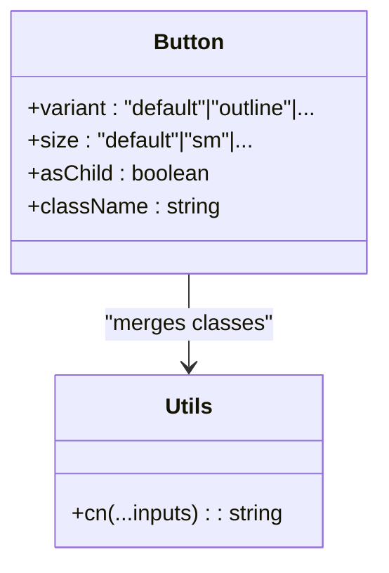

**Diagram sources**
- [button.tsx:44-65](file://resources/js/components/ui/button.tsx#L44-L65)
- [utils.ts:4-6](file://resources/js/lib/utils.ts#L4-L6)

**Section sources**
- [button.tsx:1-68](file://resources/js/components/ui/button.tsx#L1-L68)
- [utils.ts:1-7](file://resources/js/lib/utils.ts#L1-L7)

### Dialog Component
- Implementation highlights:
  - Composed from Radix UI primitives with portal rendering.
  - Optional close button with icon and screen-reader label.
  - Overlay supports backdrop blur and fade animations.
- Props and behavior:
  - showCloseButton toggles close affordance.
  - Content centers with responsive max-width.
- Accessibility:
  - Focus trapping via Radix UI; sr-only text for close button.
- Composition:
  - DialogHeader/Footer for structured layouts; Title/Description for semantics.

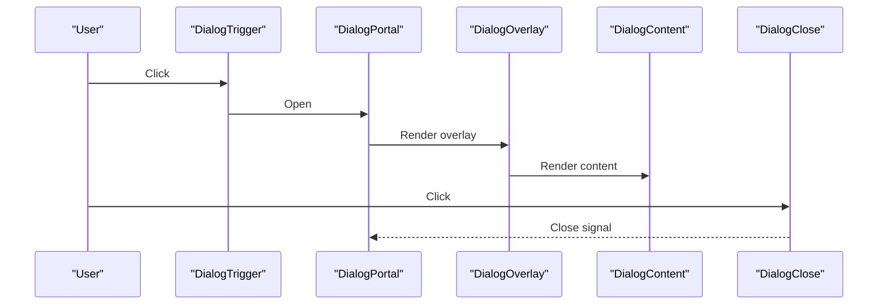

**Diagram sources**
- [dialog.tsx:16-85](file://resources/js/components/ui/dialog.tsx#L16-L85)

**Section sources**
- [dialog.tsx:1-166](file://resources/js/components/ui/dialog.tsx#L1-L166)

### Select Component
- Implementation highlights:
  - Trigger with chevron icon; content with viewport and scroll buttons.
  - Item indicators and keyboard navigation via Radix UI.
  - Supports groups, labels, separators, and popper positioning.
- Props and behavior:
  - size affects trigger height.
  - position determines alignment and slide-in animation.
- Accessibility:
  - Focus-visible; keyboard navigation; selected item indicator.


**Diagram sources**
- [select.tsx:34-91](file://resources/js/components/ui/select.tsx#L34-L91)

**Section sources**
- [select.tsx:1-193](file://resources/js/components/ui/select.tsx#L1-L193)

### Card Component
- Implementation highlights:
  - Structured layout with header, title, description, action, content, footer.
  - Size variant adjusts spacing and typography.
- Props and behavior:
  - size: default/sm toggles padding and typography.
- Composition:
  - Uses data attributes to coordinate child slots.

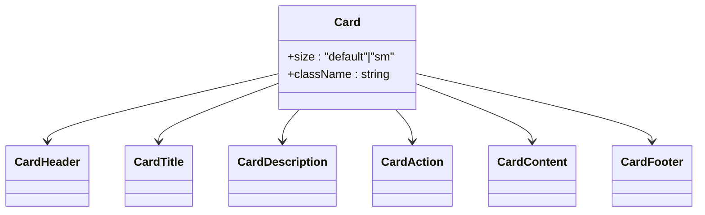

**Diagram sources**
- [card.tsx:5-21](file://resources/js/components/ui/card.tsx#L5-L21)
- [card.tsx:23-93](file://resources/js/components/ui/card.tsx#L23-L93)

**Section sources**
- [card.tsx:1-104](file://resources/js/components/ui/card.tsx#L1-L104)

### Table Component
- Implementation highlights:
  - Wraps table in horizontal scroll container.
  - Semantic head/body/footer with hover and selected states.
- Responsiveness:
  - Container ensures horizontal overflow visibility on small screens.

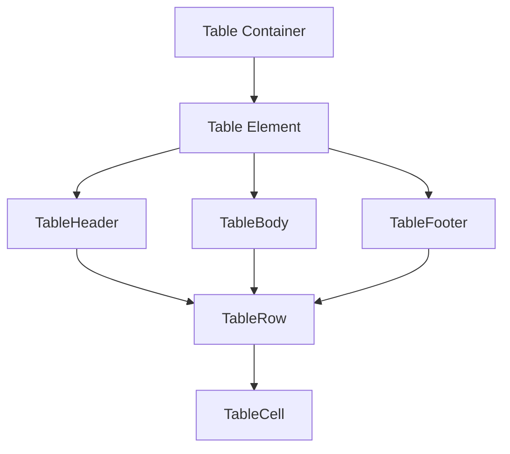

**Diagram sources**
- [table.tsx:5-18](file://resources/js/components/ui/table.tsx#L5-L18)
- [table.tsx:20-103](file://resources/js/components/ui/table.tsx#L20-L103)

**Section sources**
- [table.tsx:1-115](file://resources/js/components/ui/table.tsx#L1-L115)

### Badge, Avatar, Checkbox
- Badge
  - Variant-based styling with optional child composition.
- Avatar
  - Image/fallback with optional badge and group utilities.
- Checkbox
  - Indicator with focus-visible and invalid states.

**Section sources**
- [badge.tsx:1-50](file://resources/js/components/ui/badge.tsx#L1-L50)
- [avatar.tsx:1-111](file://resources/js/components/ui/avatar.tsx#L1-L111)
- [checkbox.tsx:1-34](file://resources/js/components/ui/checkbox.tsx#L1-L34)

## Modernized UI Components

### Menubar Component System
**Updated** Complete Menubar system with comprehensive component library and demo implementation.

- Implementation highlights:
  - Comprehensive menubar implementation with all Radix UI primitives.
  - Supports nested submenus, checkboxes, radio buttons, and shortcuts.
  - Provides extensive variant system with destructive options.
  - Includes complete demo component with practical examples.
- Key features:
  - Full menubar ecosystem: root, trigger, content, items, separators.
  - Submenu support with directional triggers and content positioning.
  - Keyboard navigation and accessibility compliance.
  - Variant system supporting destructive actions.
- Props and behavior:
  - Menubar: root container with shadow and border styling.
  - MenubarItem: selectable items with inset and variant options.
  - MenubarCheckboxItem: checkbox items with indicator support.
  - MenubarRadioGroup/RadioItem: grouped radio selections.
  - MenubarSub: submenu containers with trigger and content.

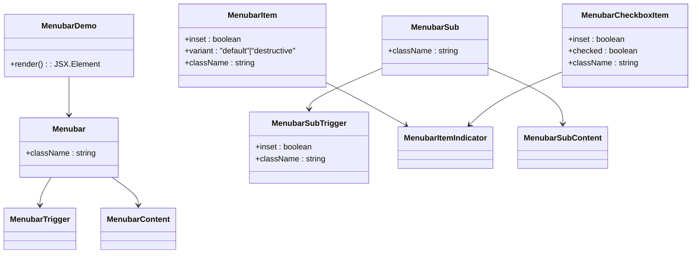

**Diagram sources**
- [menubar.tsx:7-21](file://resources/js/components/ui/menubar.tsx#L7-L21)
- [menubar.tsx:86-107](file://resources/js/components/ui/menubar.tsx#L86-L107)
- [menubar.tsx:109-138](file://resources/js/components/ui/menubar.tsx#L109-L138)
- [menubar.tsx:218-222](file://resources/js/components/ui/menubar.tsx#L218-L222)
- [MenuBar.tsx:18-137](file://resources/js/components/MenuBar.tsx#L18-L137)

**Section sources**
- [menubar.tsx:1-279](file://resources/js/components/ui/menubar.tsx#L1-L279)
- [MenuBar.tsx:1-137](file://resources/js/components/MenuBar.tsx#L1-L137)

### Enhanced Navigation Components
**Updated** Improved navigation systems with modern patterns and enhanced functionality.

- NavigationMenu (Enhanced)
  - Built with Radix UI primitives for accessible navigation patterns.
  - Supports nested menus with viewport-based positioning.
  - Provides trigger, content, and link components with consistent styling.
  - **Updated**: Enhanced with right-aligned dropdown positioning using `right-0` class.
  - Enhanced with improved TypeScript integration.

- NavMain2 (New)
  - Modern navigation component with improved TypeScript patterns.
  - Supports complex nested menu structures with icons and dynamic content.
  - Integrates with Inertia routing for seamless navigation.
  - Provides better mobile responsiveness and accessibility.

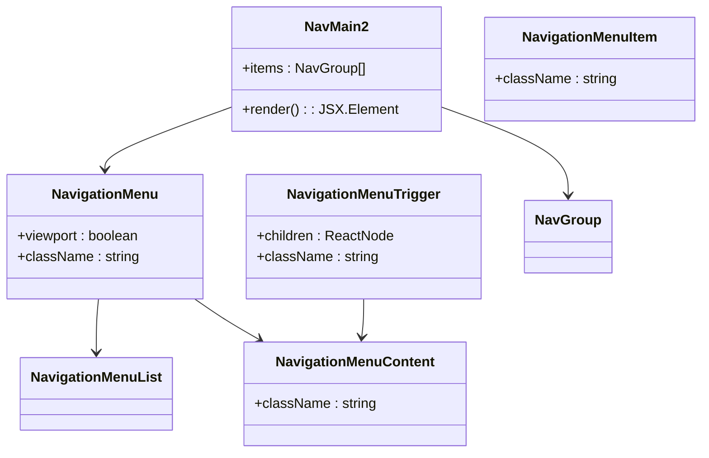

**Diagram sources**
- [navigation-menu.tsx:8-30](file://resources/js/components/ui/navigation-menu.tsx#L8-L30)
- [navigation-menu.tsx:65-80](file://resources/js/components/ui/navigation-menu.tsx#L65-L80)
- [navigation-menu.tsx:82-96](file://resources/js/components/ui/navigation-menu.tsx#L82-L96)
- [NavMain2.tsx:16-29](file://resources/js/components/NavMain2.tsx#L16-L29)

**Section sources**
- [navigation-menu.tsx:1-165](file://resources/js/components/ui/navigation-menu.tsx#L1-L165)
- [NavMain2.tsx:1-29](file://resources/js/components/NavMain2.tsx#L1-L29)

### Advanced Sidebar Component
**Updated** Enhanced sidebar component with improved mobile navigation and state management.

- Implementation highlights:
  - Advanced sidebar system with multiple variants and collapsible states.
  - Mobile-responsive design with sheet-based mobile interface.
  - Keyboard shortcut support and cookie-based state persistence.
  - Enhanced with improved TypeScript integration and React 19 patterns.
- Key features:
  - Three collapsible modes: offcanvas, icon, none.
  - Multiple variants: sidebar, floating, inset.
  - Comprehensive menu system with actions, badges, and submenus.
  - Improved mobile detection and navigation handling.

**Section sources**
- [sidebar.tsx:1-701](file://resources/js/components/ui/sidebar.tsx#L1-L701)

### Sheet Component
- Implementation highlights:
  - Sheet component built on Radix UI dialog primitive.
  - Supports multiple sides (top, right, bottom, left) with animated transitions.
  - Close button integration with customizable positioning.
- Key features:
  - Side-specific animations and positioning.
  - Overlay blur effect with backdrop filter support.
  - Header and footer sections for structured layouts.
- Props and behavior:
  - SheetContent: main content with side and animation options.
  - SheetOverlay: backdrop with fade and blur effects.
  - SheetHeader/Footer: specialized sections for sheet content.

**Section sources**
- [sheet.tsx:1-143](file://resources/js/components/ui/sheet.tsx#L1-L143)

## Enhanced Navigation Systems

### Placeholder Pattern Component
**New** SVG-based placeholder pattern component for modern UI backgrounds.

- Implementation highlights:
  - Uses React's useId hook for unique pattern IDs.
  - Creates scalable SVG patterns for backgrounds.
  - Supports custom styling through className prop.
  - Optimized for performance with memoized pattern generation.
- Key features:
  - Dynamic pattern generation with unique IDs.
  - Scalable vector graphics for crisp rendering at any size.
  - Flexible integration with existing design systems.
  - Lightweight implementation with minimal overhead.

**Section sources**
- [placeholder-pattern.tsx:1-21](file://resources/js/components/ui/placeholder-pattern.tsx#L1-L21)

### Enhanced Dropdown Menu Component
- Implementation highlights:
  - Complete dropdown menu system with all Radix UI primitives.
  - Supports nested submenus, checkboxes, radio buttons, and shortcuts.
  - Extensive variant system with destructive options and inset positioning.
- Key features:
  - Full dropdown ecosystem: root, trigger, content, items, separators.
  - Submenu support with directional triggers and content positioning.
  - Keyboard navigation and accessibility compliance.

**Section sources**
- [dropdown-menu.tsx:1-270](file://resources/js/components/ui/dropdown-menu.tsx#L1-L270)

## Employee Management System
**New** Comprehensive employee management frontend system with modern React patterns and enhanced functionality.

### Employee Settings Component
**New** Complete employee settings management component with photo upload and form validation.

- Implementation highlights:
  - Comprehensive employee information management with photo upload preview.
  - Form validation with Inertia router integration and error handling.
  - Photo upload with preview, removal, and blob URL management.
  - Custom combobox for office selection with searchable options.
  - Employment status and RATA eligibility management.
- Key features:
  - Photo upload with drag-and-drop style interface and preview.
  - Form state management with useForm hook for all employee fields.
  - Toast notifications for success and error states.
  - Responsive grid layout with photo on left, form on right.
  - Error boundary integration with destructively styled error messages.
- Props and behavior:
  - employee: Employee interface with all employee data.
  - employmentStatuses: EmploymentStatus array for dropdown options.
  - offices: Office array for custom combobox options.
  - Form submission handled via Inertia router with PUT method.
  - Photo preview URL management with automatic cleanup.

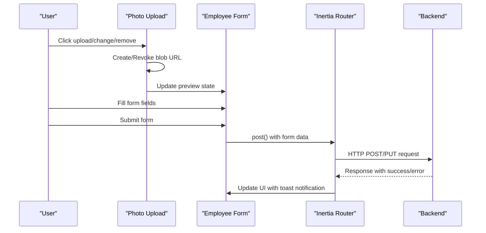

**Diagram sources**
- [Settings.tsx:46-72](file://resources/js/pages/Employees/Manage/Settings.tsx#L46-L72)
- [Settings.tsx:87-101](file://resources/js/pages/Employees/Manage/Settings.tsx#L87-L101)

**Section sources**
- [Settings.tsx:1-265](file://resources/js/pages/Employees/Manage/Settings.tsx#L1-L265)

### Employee Compensation Component
**New** Tabbed interface for managing employee compensation with salary, PERA, RATA, and deductions.

- Implementation highlights:
  - Vertical tab system with salary, PERA, RATA, and deductions sections.
  - Integration with salaryDialog.tsx for salary management functionality.
  - Compensation history placeholder with future implementation.
  - Deduction management through dedicated component.
- Key features:
  - Vertical Tabs component with custom styling.
  - Tab content separation for different compensation types.
  - Future expansion points for PERA and RATA management.
  - Salary history placeholder for upcoming features.
- Props and behavior:
  - employee: Employee interface for context.
  - deductionTypes: DeductionType array for deduction management.
  - Tab switching handled via Radix UI Tabs component.
  - Orientation set to vertical for compact layout.

**Section sources**
- [Compensation.tsx:1-42](file://resources/js/pages/Employees/Manage/Compensation.tsx#L1-L42)

### Salary Management Components
**New** Salary management system with dialog-based interface and form handling.

#### CompensationSalary Component
- Implementation highlights:
  - Simple placeholder component for salary history display.
  - Future implementation ready with proper styling.
- Key features:
  - Consistent styling with muted foreground and border.
  - Centered text layout with informational message.
  - Ready for integration with salary history data.

#### SalaryDialog Component
**New** Comprehensive salary deduction management dialog with form validation.

- Implementation highlights:
  - Modal dialog for adding/editing salary deductions.
  - Dynamic form generation based on deduction types.
  - Month/year selection with predefined options.
  - Period conflict detection and prevention.
  - Real-time form validation and error handling.
- Key features:
  - Dynamic deduction input fields for each deduction type.
  - Month/year selectors with current year defaults.
  - Period conflict detection preventing duplicate entries.
  - Form state management with useForm hook.
  - Toast notifications for success/error states.
  - Edit mode detection for existing deductions.
- Props and behavior:
  - open: boolean controlling dialog visibility.
  - onClose: function to close dialog and reset state.
  - employee: Employee interface for context.
  - deductionTypes: DeductionType array for form generation.
  - defaultMonth/defaultYear: Initial selection values.
  - existingDeductions: Current deduction data for editing.
  - takenPeriods: Array of periods already having deductions.
  - Form submission handled via Inertia router.
  - Processing state prevents duplicate submissions.

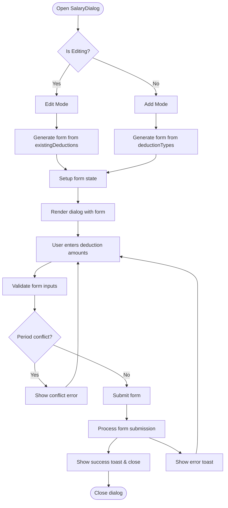

**Diagram sources**
- [salaryDialog.tsx:52-68](file://resources/js/pages/Employees/Manage/compensation/salaryDialog.tsx#L52-L68)
- [salaryDialog.tsx:76-78](file://resources/js/pages/Employees/Manage/compensation/salaryDialog.tsx#L76-L78)
- [salaryDialog.tsx:80-98](file://resources/js/pages/Employees/Manage/compensation/salaryDialog.tsx#L80-L98)

**Section sources**
- [salary.tsx:1-4](file://resources/js/pages/Employees/Manage/compensation/salary.tsx#L1-L4)
- [salaryDialog.tsx:1-197](file://resources/js/pages/Employees/Manage/compensation/salaryDialog.tsx#L1-L197)

## React 19 Integration
**Updated** Comprehensive React 19 integration with modern patterns and enhanced performance.

- Bootstrap Changes:
  - Updated to use React 19's createRoot API for improved performance.
  - Enhanced Inertia integration with modern React patterns.
  - Improved hydration handling and server-side rendering support.

- Dependency Updates:
  - React 19.0.0 and React DOM 19.0.0 for latest features.
  - Updated peer dependencies to support React 19.x range.
  - Enhanced TypeScript definitions for React 19 compatibility.

- Modern Patterns:
  - Improved concurrent rendering support.
  - Enhanced error boundary integration.
  - Better performance optimizations and memory management.

**Section sources**
- [app.tsx:15-26](file://resources/js/app.tsx#L15-L26)
- [package.json:56-58](file://package.json#L56-L58)
- [package.json:11203](file://package.json#L11203)

## Mobile-First Design Patterns
**Updated** Enhanced mobile detection and navigation patterns with dual implementation support.

### Mobile Detection Hooks
**Updated** Dual implementation of mobile detection hooks for different use cases.

- use-mobile.tsx (TypeScript)
  - Modern React hooks implementation with proper TypeScript typing.
  - Uses useState and useEffect for state management.
  - Returns boolean values with proper type inference.
  - Integrates with React 19 patterns and best practices.

- use-mobile.ts (JavaScript)
  - Legacy implementation for backward compatibility.
  - Uses functional component pattern with React hooks.
  - Maintains consistent API across both implementations.

- use-mobile-navigation.ts (New)
  - Specialized hook for managing mobile navigation state.
  - Handles pointer-events cleanup for smooth mobile experiences.
  - Prevents touch interaction issues during navigation.

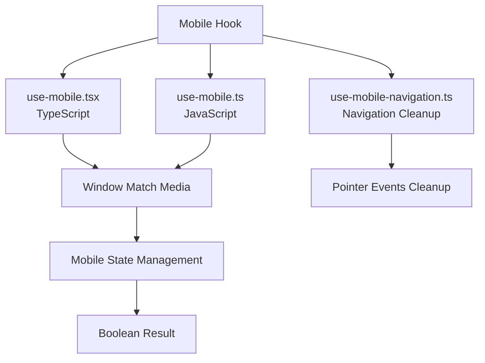

**Diagram sources**
- [use-mobile.tsx:5-22](file://resources/js/hooks/use-mobile.tsx#L5-L22)
- [use-mobile.ts:5-19](file://resources/js/hooks/use-mobile.ts#L5-L19)
- [use-mobile-navigation.ts:3-10](file://resources/js/hooks/use-mobile-navigation.ts#L3-L10)

**Section sources**
- [use-mobile.tsx:1-22](file://resources/js/hooks/use-mobile.tsx#L1-L22)
- [use-mobile.ts:1-19](file://resources/js/hooks/use-mobile.ts#L1-L19)
- [use-mobile-navigation.ts:1-11](file://resources/js/hooks/use-mobile-navigation.ts#L1-L11)

## Advanced Component Features
**Updated** Enhanced component capabilities with modern React patterns and improved functionality.

### Enhanced Sidebar Features
- Cookie-based state persistence for sidebar preferences.
- Keyboard shortcut support (Ctrl/Cmd + B) for quick access.
- Improved mobile detection with responsive breakpoint handling.
- Enhanced tooltip integration for better user experience.

### Modern Menubar Capabilities
- Comprehensive variant system supporting destructive actions.
- Advanced inset positioning for hierarchical menu structures.
- Enhanced keyboard navigation with proper ARIA support.
- Improved accessibility compliance with screen reader integration.

### Placeholder Pattern Benefits
- SVG-based patterns for crisp rendering at any resolution.
- Dynamic pattern generation preventing ID conflicts.
- Optimized for performance with minimal DOM overhead.
- Seamless integration with existing Tailwind CSS workflows.

### Employee Management Enhancements
- Comprehensive form validation with real-time error display.
- Photo upload with preview and automatic cleanup.
- Inertia router integration for seamless navigation.
- Toast notifications for user feedback.
- Responsive grid layout for optimal desktop/mobile experience.

**Section sources**
- [sidebar.tsx:25-30](file://resources/js/components/ui/sidebar.tsx#L25-L30)
- [sidebar.tsx:94-107](file://resources/js/components/ui/sidebar.tsx#L94-L107)
- [placeholder-pattern.tsx:7-20](file://resources/js/components/ui/placeholder-pattern.tsx#L7-L20)
- [Settings.tsx:38-44](file://resources/js/pages/Employees/Manage/Settings.tsx#L38-L44)
- [salaryDialog.tsx:76-78](file://resources/js/pages/Employees/Manage/compensation/salaryDialog.tsx#L76-L78)

## Enhanced Pages

### Dashboard Page
**Updated** Enhanced dashboard layout with navigation removal and improved styling.

- Implementation highlights:
  - Modern React patterns with TypeScript interfaces and type safety.
  - Removed navigation components from header layout for cleaner interface.
  - Integrated PlaceholderPattern component for modern background styling.
  - Enhanced responsive design with improved grid layouts.
- Key features:
  - Clean, focused dashboard interface without navigation clutter.
  - PlaceholderPattern integration for modern visual backgrounds.
  - Responsive grid system with aspect ratios and overflow handling.
  - Improved mobile-first design approach.
- Props and behavior:
  - Breadcrumb navigation simplified to basic dashboard route.
  - PlaceholderPattern component provides scalable SVG backgrounds.
  - Responsive grid layout adapts to different screen sizes.

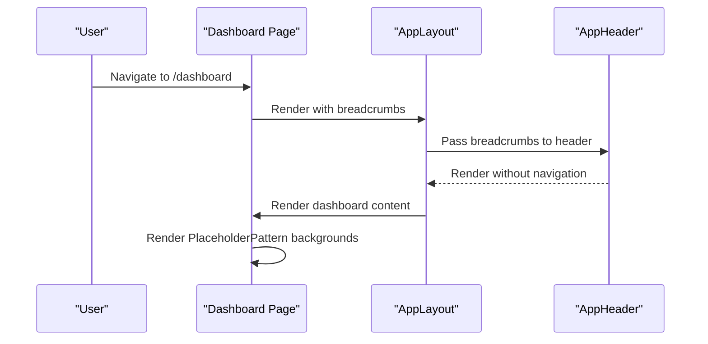

**Diagram sources**
- [dashboard.tsx:13-35](file://resources/js/pages/dashboard.tsx#L13-L35)
- [app-header.tsx:236-245](file://resources/js/components/app-header.tsx#L236-L245)

**Section sources**
- [dashboard.tsx:1-36](file://resources/js/pages/dashboard.tsx#L1-L36)
- [app-header.tsx:236-245](file://resources/js/components/app-header.tsx#L236-L245)

### Employees Index Page
- Implementation highlights:
  - Modern React patterns with TypeScript interfaces and type safety.
  - Integrated search functionality with Enter key support and URL query parameters.
  - Pagination integration with custom Pagination component.
  - Enhanced employee listing with avatar fallbacks and status information.
- Key features:
  - Form state management with Inertia router integration.
  - Responsive layout with mobile-first design approach.
  - Interactive employee cards with click handlers and modal dialogs.
  - Comprehensive breadcrumb navigation system.
- Props and behavior:
  - Form handling with useForm hook for search input.
  - Router integration for state preservation and scroll restoration.
  - Modal dialog management with controlled open/close state.
  - Pagination component integration with Laravel-style pagination links.

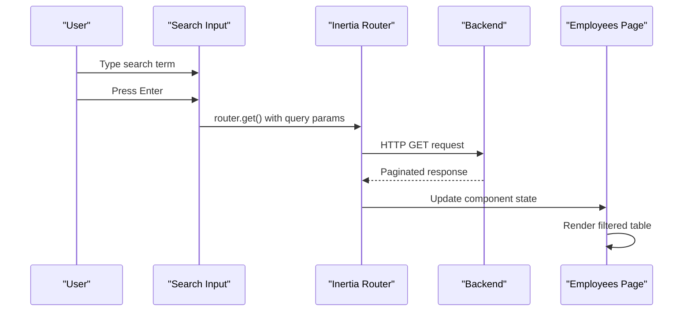

**Diagram sources**
- [Index.tsx:35-45](file://resources/js/pages/Employees/Index.tsx#L35-L45)
- [Index.tsx:28-27](file://resources/js/pages/Employees/Index.tsx#L28-L27)

**Section sources**
- [Index.tsx:1-140](file://resources/js/pages/Employees/Index.tsx#L1-L140)

### Pagination Component
- Implementation highlights:
  - Custom pagination component with Inertia integration.
  - Active state styling with primary color accents.
  - Dark mode support with automatic theme adaptation.
  - Disabled state handling for non-clickable links.
- Key features:
  - Dynamic link rendering with HTML content support.
  - Responsive design with flexible spacing.
  - State-aware styling with active/inactive differentiation.
- Props and behavior:
  - data: PaginatedDataResponse interface for type safety.
  - Link rendering with preserveState and preserveScroll options.
  - Conditional styling based on active state and URL availability.

**Section sources**
- [paginationData.tsx:1-34](file://resources/js/components/paginationData.tsx#L1-L34)

### Navigation Components
**Updated** Enhanced navigation components with improved styling and functionality.

- NavMenu (Enhanced)
  - **Updated**: Navigation removed from dashboard layout in header.
  - Supports complex nested menu structures with icons and dynamic content.
  - Integrates with Inertia routing for seamless navigation.
  - Provides better mobile responsiveness and accessibility.

- NavMain2 (New)
  - Modern navigation component with improved TypeScript patterns.
  - Supports complex nested menu structures with icons and dynamic content.
  - Integrates with Inertia routing for seamless navigation.
  - Provides better mobile responsiveness and accessibility.

**Section sources**
- [NavMenu.tsx:1-117](file://resources/js/components/NavMenu.tsx#L1-L117)
- [NavMain2.tsx:1-29](file://resources/js/components/NavMain2.tsx#L1-L29)

## Dependency Analysis
**Updated** Enhanced dependency configuration supporting React 19 and modern patterns.

- Runtime dependencies:
  - @inertiajs/react ^2.0.0 for page rendering and navigation.
  - @radix-ui/* for accessible, headless UI primitives.
  - lucide-react ^0.475.0 for icons.
  - tailwind-merge and clsx for class merging.
  - next-themes ^0.4.6 for theme switching.
  - React 19.0.0 and React DOM 19.0.0 for latest features.
- Build-time dependencies:
  - Vite ^6.0, TypeScript ^5.7.2, ESLint/Prettier for tooling.
  - Enhanced with React 19 compatible plugins and configurations.
- Aliases and paths:
  - tsconfig.json maps @/* to resources/js/* for concise imports.

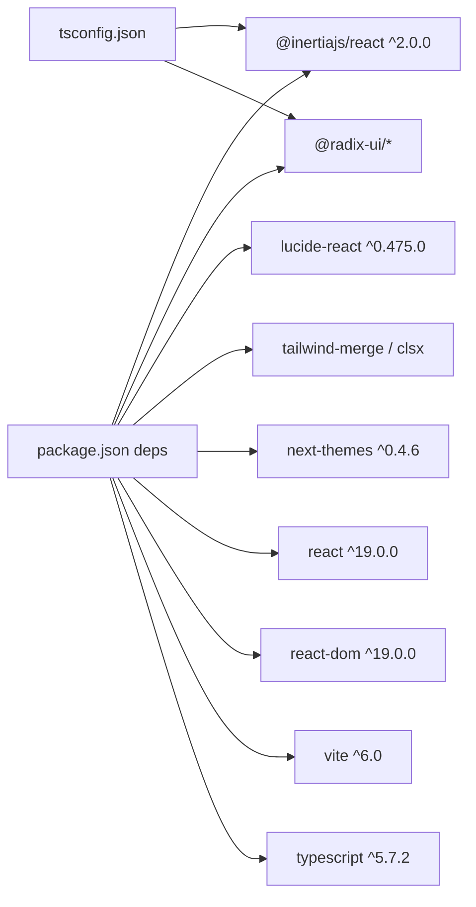

**Diagram sources**
- [package.json:23-66](file://package.json#L23-L66)
- [tsconfig.json:111-116](file://tsconfig.json#L111-L116)

**Section sources**
- [package.json:1-74](file://package.json#L1-L74)
- [tsconfig.json:111-116](file://tsconfig.json#L111-L116)

## Performance Considerations
**Updated** Enhanced performance considerations for React 19 and modern component patterns.

- Bundle size:
  - Prefer lazy-loading heavy pages and components.
  - Keep icon usage scoped; avoid importing entire icon libraries.
  - Leverage React 19's improved tree shaking capabilities.
- Rendering:
  - Use asChild patterns to minimize DOM nodes.
  - Memoize expensive computations outside components.
  - Implement virtualization for large lists (consider react-virtual for future enhancements).
  - Take advantage of React 19's concurrent rendering optimizations.
- Styling:
  - Reuse shared variants and avoid excessive conditional classes.
  - Utilize CSS variables for consistent theming across components.
  - Leverage Tailwind CSS 4.0's improved performance characteristics.
  - **Updated**: Enhanced cursor-pointer class improves user interaction feedback.
- Tooling:
  - Leverage Vite's fast dev server and tree-shaking.
  - Use ESLint and Prettier to maintain code quality and reduce regressions.
  - Benefit from React 19's improved development experience.

## Troubleshooting Guide
**Updated** Enhanced troubleshooting guidance for React 19 and modern component patterns.

- Theming and SSR:
  - Ensure theme initialization runs on the client to prevent hydration mismatches.
  - Verify React 19 compatibility with server-side rendering.
- Accessibility:
  - Verify focus-visible rings and aria-* attributes for form controls.
  - Provide labels for icons and sr-only text for decorative icons.
  - Ensure Menubar and Navigation components meet WCAG guidelines.
- Styling conflicts:
  - Use the cn() helper to merge classes deterministically.
  - Avoid conflicting Tailwind utilities; prefer component variants.
  - Check for Tailwind CSS 4.0 compatibility issues.
  - **Updated**: Verify cursor-pointer class is properly applied to interactive elements.
- Build issues:
  - Confirm tsconfig paths and JSX settings.
  - Validate Vite and plugin versions.
  - Ensure React 19 peer dependencies are properly configured.
- New component issues:
  - Ensure Radix UI primitives are properly imported and configured.
  - Verify data-slot attributes are correctly applied for styling.
  - Check for proper portal rendering in menu and dialog components.
  - Validate mobile hook implementations for both TypeScript and JavaScript versions.
  - **Updated**: Verify NavigationMenu viewport positioning with right-0 class.
  - **Updated**: Verify employee settings form validation and photo upload functionality.
  - **Updated**: Check salary dialog form state management and period conflict detection.

**Section sources**
- [app.tsx:28-30](file://resources/js/app.tsx#L28-L30)
- [utils.ts:4-6](file://resources/js/lib/utils.ts#L4-L6)
- [tsconfig.json:111-116](file://tsconfig.json#L111-L116)
- [package.json:11203](file://package.json#L11203)
- [Settings.tsx:87-101](file://resources/js/pages/Employees/Manage/Settings.tsx#L87-L101)
- [salaryDialog.tsx:76-78](file://resources/js/pages/Employees/Manage/compensation/salaryDialog.tsx#L76-L78)

## Conclusion
The component library has been comprehensively modernized with React 19 integration, enhanced navigation systems, and advanced UI patterns. The architecture emphasizes accessibility, composability, and consistency through Radix UI primitives, Tailwind utilities, and a centralized cn() helper. The addition of the complete Menubar system, enhanced navigation components, improved mobile detection patterns, and modern React 19 patterns demonstrates the evolution toward more sophisticated UI architectures.

**Key improvements include:**
- Enhanced NavigationMenu component with right-aligned dropdown positioning using `right-0` class
- Improved Button component with cursor-pointer class for better user feedback
- Dashboard layout modifications with navigation removal for cleaner interface
- Comprehensive styling improvements and modernized UI patterns
- **Updated**: New comprehensive employee management system with Settings.tsx (265 lines), Compensation.tsx, salary.tsx, and salaryDialog.tsx components
- **Updated**: Enhanced form handling with Inertia router integration and toast notifications
- **Updated**: Photo upload functionality with preview and automatic cleanup
- **Updated**: Tabbed interface for compensation management with salary, PERA, RATA, and deductions sections

The new employee management system represents a significant advancement in frontend architecture, featuring modern React patterns, comprehensive form validation, real-time error handling, and seamless integration with backend APIs. Following the documented props, variants, and composition guidelines ensures predictable behavior across pages and contexts while leveraging the latest React 19 performance improvements and modern development patterns.

## Appendices

### Component Composition Patterns
- Variant-driven styling with class-variance-authority.
- asChild composition for semantic correctness.
- Portal-based overlays for modularity.
- Data attributes for coordinated slot layouts.
- Context-based state management for complex components.
- React 19 patterns with improved performance characteristics.
- **Updated**: Form state management with useForm hook for consistent data handling.
- **Updated**: Inertia router integration for seamless navigation and state management.

### State Management and Interactivity
- Dialog and Select rely on Radix UI state machines; expose minimal props to consumers.
- Form controls integrate focus-visible and aria-invalid states.
- Theme initialization occurs on mount to avoid SSR mismatches.
- Sidebar uses context and cookies for persistent state management.
- Menus utilize data attributes for styling coordination.
- Enhanced mobile state management with dual hook implementations.
- **Updated**: Employee settings form state with comprehensive validation.
- **Updated**: Photo upload state management with blob URL cleanup.
- **Updated**: Salary dialog form state with dynamic deduction generation.
- **Updated**: NavigationMenu viewport positioning with right-aligned dropdowns.

### Responsive Design and Accessibility
- Responsive breakpoints via Tailwind utilities; horizontal scrolling for tables.
- Focus-visible rings and keyboard navigation supported by Radix UI.
- Screen-reader labels for icons and close buttons.
- Mobile-first design with progressive enhancement.
- Touch-friendly targets and gesture support.
- Enhanced accessibility compliance with modern React patterns.
- **Updated**: Improved cursor feedback with cursor-pointer class.
- **Updated**: Comprehensive form validation with accessible error messages.

### Testing Approach and Workflow
- Unit testing:
  - Test component renders with variants and asChild behavior.
  - Validate accessibility attributes and focus states.
  - Test form state management and router integration.
  - Verify mobile hook implementations work correctly.
  - **Updated**: Test employee settings form validation and photo upload.
  - **Updated**: Test salary dialog form state management and period conflict detection.
  - **Updated**: Verify NavigationMenu right-aligned positioning and cursor-pointer styling.
- Integration testing:
  - Simulate user interactions (open dialogs, select items, navigate menus).
  - Test responsive behavior across device sizes.
  - Validate pagination and search functionality.
  - Test Menubar and Navigation component interactions.
  - **Updated**: Verify dashboard layout without navigation components.
  - **Updated**: Test employee settings form submission and photo upload workflow.
  - **Updated**: Test salary dialog modal functionality and form validation.
- Development workflow:
  - Use Vite dev server for hot reload.
  - Run linting and formatting checks via npm scripts.
  - Commit with clear messages and review changes in pull requests.
  - Leverage React 19's improved development experience.
  - **Updated**: Test new employee management components thoroughly.
  - **Updated**: Verify toast notifications and error handling.
  - **Updated**: Test responsive behavior of new components.