# Frontend Components & UI

<cite>
**Referenced Files in This Document**
- [app.tsx](file://resources/js/app.tsx)
- [utils.ts](file://resources/js/lib/utils.ts)
- [components.json](file://components.json)
- [package.json](file://package.json)
- [tsconfig.json](file://tsconfig.json)
- [button.tsx](file://resources/js/components/ui/button.tsx)
- [input.tsx](file://resources/js/components/ui/input.tsx)
- [dialog.tsx](file://resources/js/components/ui/dialog.tsx)
- [card.tsx](file://resources/js/components/ui/card.tsx)
- [select.tsx](file://resources/js/components/ui/select.tsx)
- [table.tsx](file://resources/js/components/ui/table.tsx)
- [badge.tsx](file://resources/js/components/ui/badge.tsx)
- [avatar.tsx](file://resources/js/components/ui/avatar.tsx)
- [checkbox.tsx](file://resources/js/components/ui/checkbox.tsx)
- [dropdown-menu.tsx](file://resources/js/components/ui/dropdown-menu.tsx)
- [sidebar.tsx](file://resources/js/components/ui/sidebar.tsx)
- [sheet.tsx](file://resources/js/components/ui/sheet.tsx)
- [navigation-menu.tsx](file://resources/js/components/ui/navigation-menu.tsx)
- [menubar.tsx](file://resources/js/components/ui/menubar.tsx)
- [NavMenu.tsx](file://resources/js/components/NavMenu.tsx)
- [paginationData.tsx](file://resources/js/components/paginationData.tsx)
- [Index.tsx](file://resources/js/pages/Employees/Index.tsx)
</cite>

## Update Summary
**Changes Made**
- Added new Navigation Menu component with enhanced menu structure
- Integrated Menubar component using Radix UI primitives
- Enhanced Employees Index page with modern React patterns including search functionality and pagination
- Added Sidebar component with advanced state management and responsive design
- Updated component composition patterns to include new UI primitives

## Table of Contents
1. [Introduction](#introduction)
2. [Project Structure](#project-structure)
3. [Core Components](#core-components)
4. [Architecture Overview](#architecture-overview)
5. [Detailed Component Analysis](#detailed-component-analysis)
6. [New UI Components](#new-ui-components)
7. [Enhanced Pages](#enhanced-pages)
8. [Dependency Analysis](#dependency-analysis)
9. [Performance Considerations](#performance-considerations)
10. [Troubleshooting Guide](#troubleshooting-guide)
11. [Conclusion](#conclusion)
12. [Appendices](#appendices)

## Introduction
This document describes the frontend component library and UI architecture built with React, Inertia, Radix UI, Tailwind CSS, and shadcn-inspired patterns. It covers reusable UI components, their props, styling, composition, state management, interactivity, responsive design, accessibility, and integration patterns. It also outlines testing approaches and the development workflow.

## Project Structure
The frontend is organized around a component library under resources/js/components/ui and page components under resources/js/pages. The application bootstraps via Inertia and Vite, with Tailwind CSS providing utility-first styling and a centralized alias configuration for imports.

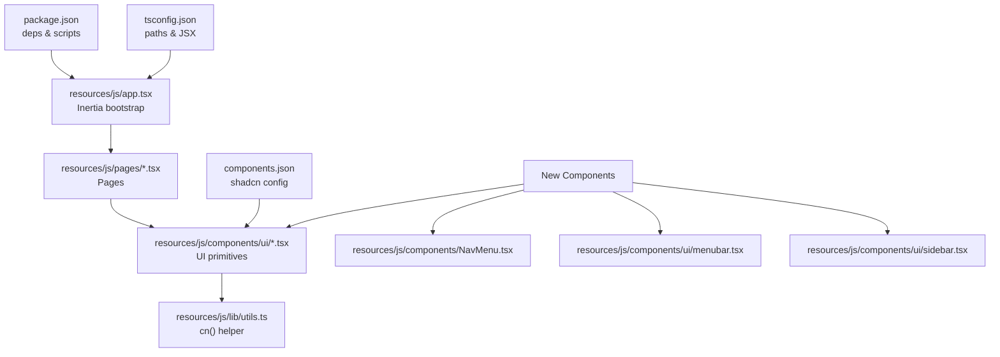

**Diagram sources**
- [app.tsx:1-30](file://resources/js/app.tsx#L1-L30)
- [utils.ts:1-7](file://resources/js/lib/utils.ts#L1-L7)
- [components.json:1-26](file://components.json#L1-L26)
- [package.json:1-73](file://package.json#L1-L73)
- [tsconfig.json:111-116](file://tsconfig.json#L111-L116)
- [NavMenu.tsx:1-105](file://resources/js/components/NavMenu.tsx#L1-L105)
- [menubar.tsx:1-279](file://resources/js/components/ui/menubar.tsx#L1-L279)
- [sidebar.tsx:1-701](file://resources/js/components/ui/sidebar.tsx#L1-L701)

**Section sources**
- [app.tsx:1-30](file://resources/js/app.tsx#L1-L30)
- [components.json:1-26](file://components.json#L1-L26)
- [package.json:1-73](file://package.json#L1-L73)
- [tsconfig.json:111-116](file://tsconfig.json#L111-L116)

## Core Components
This section documents the primary UI components and their capabilities.

- Button
  - Purpose: Action trigger with variants and sizes.
  - Key props: variant, size, asChild, className.
  - Variants: default, outline, secondary, ghost, destructive, link.
  - Sizes: default, xs, sm, lg, icon, icon-xs, icon-sm, icon-lg.
  - Accessibility: Inherits native button semantics; supports focus-visible styles.
  - Composition: Uses Slot for semantic composition; integrates with icons.

- Input
  - Purpose: Text input with consistent styling and focus states.
  - Key props: type, className.
  - Accessibility: Supports aria-invalid for error states; focus-visible ring.
  - Styling: Tailwind-based with ring focus and destructive variants.

- Dialog
  - Purpose: Modal overlay with header, footer, and close controls.
  - Key parts: Root, Trigger, Portal, Overlay, Content, Header, Footer, Title, Description, Close.
  - Props: showCloseButton, size alignment, animation classes.
  - Accessibility: Focus trapping, backdrop blur, sr-only close label.

- Card
  - Purpose: Content container with header, title, description, action, content, and footer.
  - Key props: size (default, sm).
  - Layout: Grid-based header with optional action and description rows.

- Select
  - Purpose: Dropdown selection with groups, labels, items, and scroll buttons.
  - Key parts: Root, Group, Value, Trigger, Content, Label, Item, Separator, ScrollUp/Down Buttons.
  - Props: size (sm, default), position (item-aligned, popper), align.
  - Accessibility: Keyboard navigation, focus-visible, indicator for selected item.

- Table
  - Purpose: Responsive table wrapper with container and semantic cells.
  - Key parts: Table, TableHeader, TableBody, TableFooter, TableRow, TableHead, TableCell, TableCaption.
  - Responsiveness: Horizontal scrolling container; hover and selected states.

- Badge
  - Purpose: Label or status indicator with variants.
  - Key props: variant, asChild.
  - Variants: default, secondary, destructive, outline, ghost, link.

- Avatar
  - Purpose: User identity with image, fallback, badge, and group utilities.
  - Key parts: Avatar, AvatarImage, AvatarFallback, AvatarBadge, AvatarGroup, AvatarGroupCount.
  - Props: size (default, sm, lg); group spacing and ring behavior.

- Checkbox
  - Purpose: Binary selection with visual indicator.
  - Props: className; integrates with focus-visible and invalid states.

**Section sources**
- [button.tsx:1-68](file://resources/js/components/ui/button.tsx#L1-L68)
- [input.tsx:1-20](file://resources/js/components/ui/input.tsx#L1-L20)
- [dialog.tsx:1-166](file://resources/js/components/ui/dialog.tsx#L1-L166)
- [card.tsx:1-104](file://resources/js/components/ui/card.tsx#L1-L104)
- [select.tsx:1-193](file://resources/js/components/ui/select.tsx#L1-L193)
- [table.tsx:1-115](file://resources/js/components/ui/table.tsx#L1-L115)
- [badge.tsx:1-50](file://resources/js/components/ui/badge.tsx#L1-L50)
- [avatar.tsx:1-111](file://resources/js/components/ui/avatar.tsx#L1-L111)
- [checkbox.tsx:1-34](file://resources/js/components/ui/checkbox.tsx#L1-L34)

## Architecture Overview
The UI architecture follows a layered pattern:
- Application bootstrap sets up Inertia and theme initialization.
- Page components import UI primitives from the local components/ui library.
- Styling is centralized via Tailwind and a cn() helper for merging classes.
- shadcn configuration defines style, icon library, and aliases.

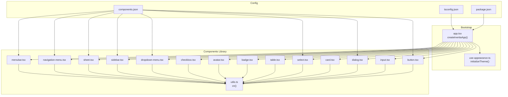

**Diagram sources**
- [app.tsx:1-30](file://resources/js/app.tsx#L1-L30)
- [utils.ts:1-7](file://resources/js/lib/utils.ts#L1-L7)
- [components.json:1-26](file://components.json#L1-L26)
- [package.json:1-73](file://package.json#L1-L73)
- [tsconfig.json:111-116](file://tsconfig.json#L111-L116)
- [button.tsx:1-68](file://resources/js/components/ui/button.tsx#L1-L68)
- [dialog.tsx:1-166](file://resources/js/components/ui/dialog.tsx#L1-L166)
- [select.tsx:1-193](file://resources/js/components/ui/select.tsx#L1-L193)
- [dropdown-menu.tsx:1-270](file://resources/js/components/ui/dropdown-menu.tsx#L1-L270)
- [sidebar.tsx:1-701](file://resources/js/components/ui/sidebar.tsx#L1-L701)
- [sheet.tsx:1-143](file://resources/js/components/ui/sheet.tsx#L1-L143)
- [navigation-menu.tsx:1-165](file://resources/js/components/ui/navigation-menu.tsx#L1-L165)
- [menubar.tsx:1-279](file://resources/js/components/ui/menubar.tsx#L1-L279)

## Detailed Component Analysis

### Button Component
- Implementation highlights:
  - Uses class-variance-authority for variants and sizes.
  - Supports asChild to render a different tag while preserving styling.
  - Integrates focus-visible rings and disabled states.
- Props and behavior:
  - variant: selects background, borders, and hover effects.
  - size: controls height, padding, and icon sizing.
  - asChild: composes with parent semantics (e.g., Link).
- Accessibility:
  - Inherits button semantics; focus-visible ring applied via data attributes.
- Styling:
  - Merges Tailwind classes with cn() helper.

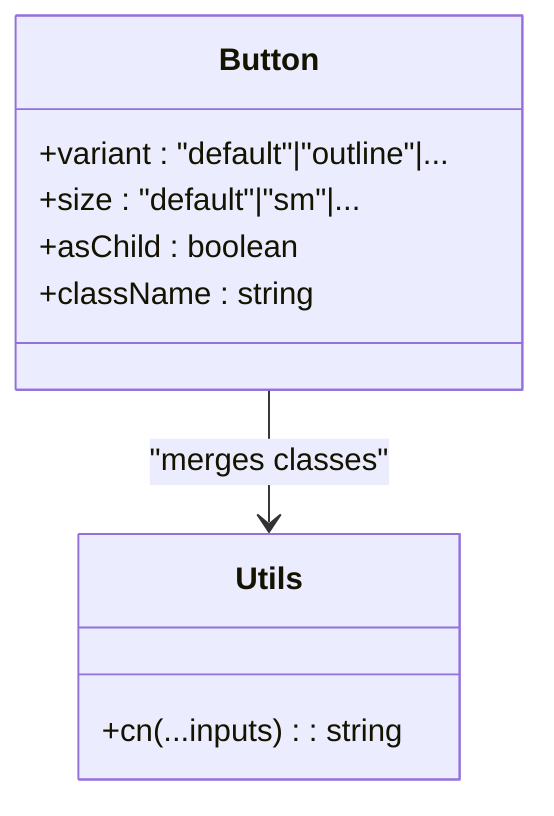

**Diagram sources**
- [button.tsx:44-65](file://resources/js/components/ui/button.tsx#L44-L65)
- [utils.ts:4-6](file://resources/js/lib/utils.ts#L4-L6)

**Section sources**
- [button.tsx:1-68](file://resources/js/components/ui/button.tsx#L1-L68)
- [utils.ts:1-7](file://resources/js/lib/utils.ts#L1-L7)

### Dialog Component
- Implementation highlights:
  - Composed from Radix UI primitives with portal rendering.
  - Optional close button with icon and screen-reader label.
  - Overlay supports backdrop blur and fade animations.
- Props and behavior:
  - showCloseButton toggles close affordance.
  - Content centers with responsive max-width.
- Accessibility:
  - Focus trapping via Radix UI; sr-only text for close button.
- Composition:
  - DialogHeader/Footer for structured layouts; Title/Description for semantics.

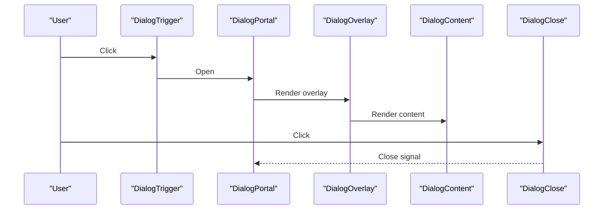

**Diagram sources**
- [dialog.tsx:16-85](file://resources/js/components/ui/dialog.tsx#L16-L85)

**Section sources**
- [dialog.tsx:1-166](file://resources/js/components/ui/dialog.tsx#L1-L166)

### Select Component
- Implementation highlights:
  - Trigger with chevron icon; content with viewport and scroll buttons.
  - Item indicators and keyboard navigation via Radix UI.
  - Supports groups, labels, separators, and popper positioning.
- Props and behavior:
  - size affects trigger height.
  - position determines alignment and slide-in animation.
- Accessibility:
  - Focus-visible; keyboard navigation; selected item indicator.

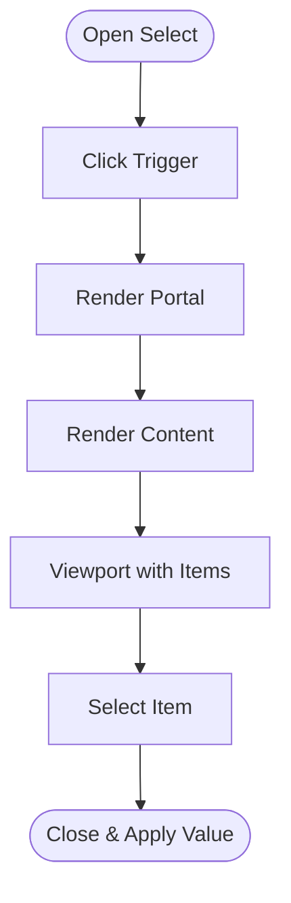

**Diagram sources**
- [select.tsx:34-91](file://resources/js/components/ui/select.tsx#L34-L91)

**Section sources**
- [select.tsx:1-193](file://resources/js/components/ui/select.tsx#L1-L193)

### Card Component
- Implementation highlights:
  - Structured layout with header, title, description, action, content, footer.
  - Size variant adjusts spacing and typography.
- Props and behavior:
  - size: default/sm toggles padding and typography.
- Composition:
  - Uses data attributes to coordinate child slots.

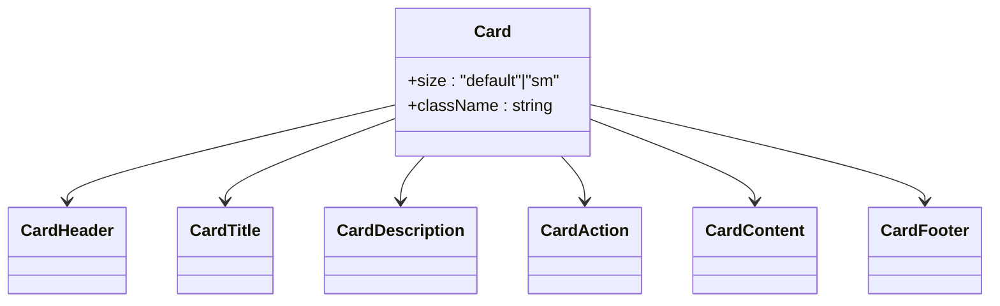

**Diagram sources**
- [card.tsx:5-21](file://resources/js/components/ui/card.tsx#L5-L21)
- [card.tsx:23-93](file://resources/js/components/ui/card.tsx#L23-L93)

**Section sources**
- [card.tsx:1-104](file://resources/js/components/ui/card.tsx#L1-L104)

### Table Component
- Implementation highlights:
  - Wraps table in horizontal scroll container.
  - Semantic head/body/footer with hover and selected states.
- Responsiveness:
  - Container ensures horizontal overflow visibility on small screens.

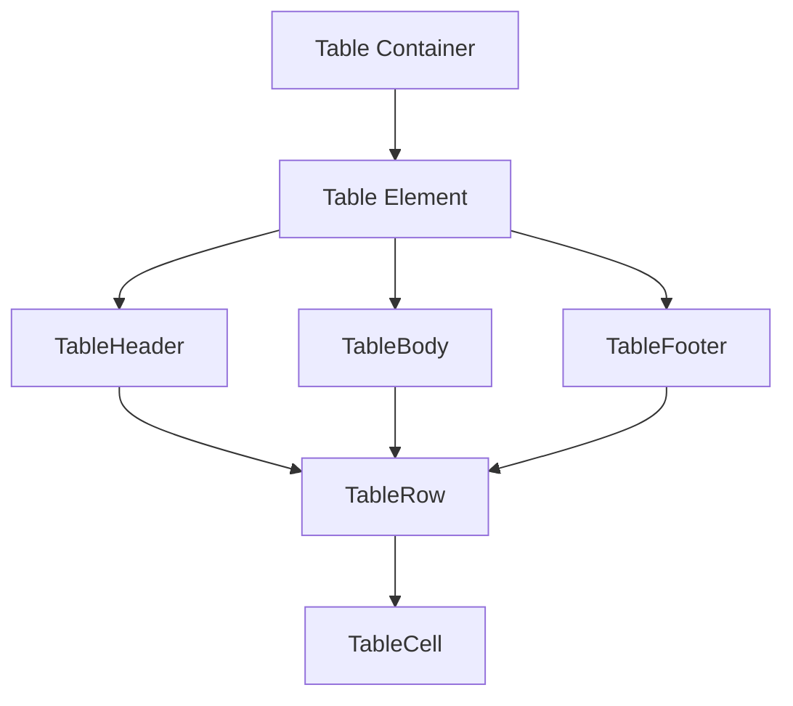

**Diagram sources**
- [table.tsx:5-18](file://resources/js/components/ui/table.tsx#L5-L18)
- [table.tsx:20-103](file://resources/js/components/ui/table.tsx#L20-L103)

**Section sources**
- [table.tsx:1-115](file://resources/js/components/ui/table.tsx#L1-L115)

### Badge, Avatar, Checkbox
- Badge
  - Variant-based styling with optional child composition.
- Avatar
  - Image/fallback with optional badge and group utilities.
- Checkbox
  - Indicator with focus-visible and invalid states.

**Section sources**
- [badge.tsx:1-50](file://resources/js/components/ui/badge.tsx#L1-L50)
- [avatar.tsx:1-111](file://resources/js/components/ui/avatar.tsx#L1-L111)
- [checkbox.tsx:1-34](file://resources/js/components/ui/checkbox.tsx#L1-L34)

## New UI Components

### Navigation Menu Component
- Implementation highlights:
  - Built with Radix UI primitives for accessible navigation patterns.
  - Supports nested menus with viewport-based positioning.
  - Provides trigger, content, and link components with consistent styling.
- Key features:
  - Dynamic menu items with descriptions and links.
  - Responsive grid layout for component listings.
  - Smooth animations and transitions using motion data attributes.
- Props and behavior:
  - NavigationMenu: root container with viewport option.
  - NavigationMenuTrigger: interactive trigger with chevron indicator.
  - NavigationMenuContent: positioned content with animation support.
  - ListItem: individual menu items with link composition.

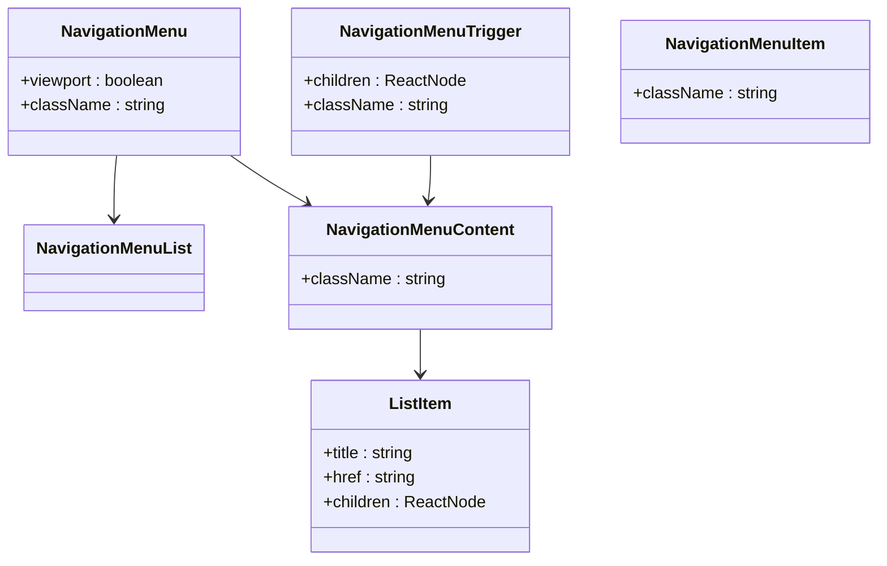

**Diagram sources**
- [navigation-menu.tsx:8-30](file://resources/js/components/ui/navigation-menu.tsx#L8-L30)
- [navigation-menu.tsx:65-80](file://resources/js/components/ui/navigation-menu.tsx#L65-L80)
- [navigation-menu.tsx:82-96](file://resources/js/components/ui/navigation-menu.tsx#L82-L96)
- [NavMenu.tsx:91-104](file://resources/js/components/NavMenu.tsx#L91-L104)

**Section sources**
- [navigation-menu.tsx:1-165](file://resources/js/components/ui/navigation-menu.tsx#L1-L165)
- [NavMenu.tsx:1-105](file://resources/js/components/NavMenu.tsx#L1-L105)

### Menubar Component
- Implementation highlights:
  - Comprehensive menubar implementation with all Radix UI primitives.
  - Supports nested submenus, checkboxes, radio buttons, and shortcuts.
  - Provides extensive variant system with destructive options.
- Key features:
  - Full menubar ecosystem: root, trigger, content, items, separators.
  - Submenu support with directional triggers and content positioning.
  - Keyboard navigation and accessibility compliance.
- Props and behavior:
  - Menubar: root container with shadow and border styling.
  - MenubarItem: selectable items with inset and variant options.
  - MenubarCheckboxItem: checkbox items with indicator support.
  - MenubarSub: submenu containers with trigger and content.

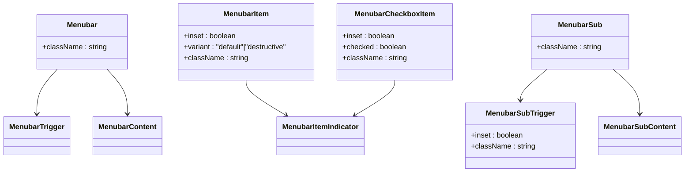

**Diagram sources**
- [menubar.tsx:7-21](file://resources/js/components/ui/menubar.tsx#L7-L21)
- [menubar.tsx:86-107](file://resources/js/components/ui/menubar.tsx#L86-L107)
- [menubar.tsx:109-138](file://resources/js/components/ui/menubar.tsx#L109-L138)
- [menubar.tsx:218-222](file://resources/js/components/ui/menubar.tsx#L218-L222)

**Section sources**
- [menubar.tsx:1-279](file://resources/js/components/ui/menubar.tsx#L1-L279)

### Sidebar Component
- Implementation highlights:
  - Advanced sidebar system with multiple variants and collapsible states.
  - Mobile-responsive design with sheet-based mobile interface.
  - Keyboard shortcut support and cookie-based state persistence.
- Key features:
  - Three collapsible modes: offcanvas, icon, none.
  - Multiple variants: sidebar, floating, inset.
  - Comprehensive menu system with actions, badges, and submenus.
- Props and behavior:
  - SidebarProvider: manages global sidebar state and context.
  - Sidebar: main container with side and variant options.
  - SidebarMenuButton: styled menu buttons with tooltip support.
  - useSidebar: hook for accessing sidebar context and state.

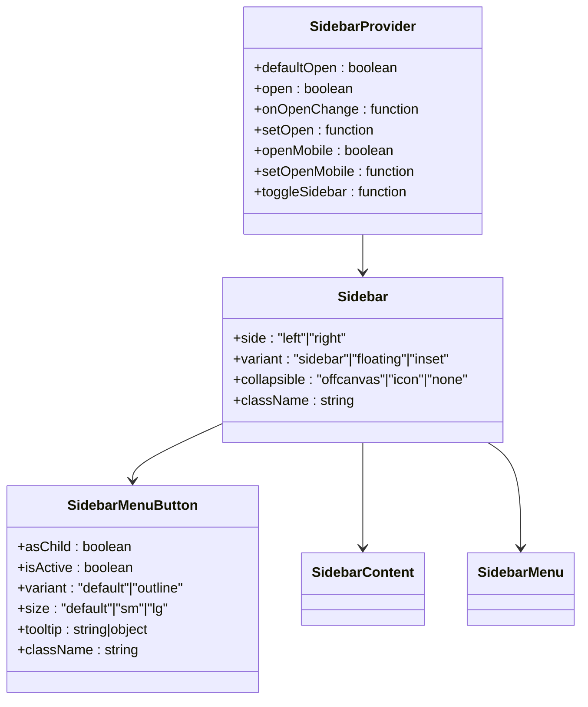

**Diagram sources**
- [sidebar.tsx:53-86](file://resources/js/components/ui/sidebar.tsx#L53-L86)
- [sidebar.tsx:149-249](file://resources/js/components/ui/sidebar.tsx#L149-L249)
- [sidebar.tsx:488-536](file://resources/js/components/ui/sidebar.tsx#L488-L536)

**Section sources**
- [sidebar.tsx:1-701](file://resources/js/components/ui/sidebar.tsx#L1-L701)

### Dropdown Menu Component
- Implementation highlights:
  - Complete dropdown menu system with all Radix UI primitives.
  - Supports nested submenus, checkboxes, radio buttons, and shortcuts.
  - Extensive variant system with destructive options and inset positioning.
- Key features:
  - Full dropdown ecosystem: root, trigger, content, items, separators.
  - Submenu support with directional triggers and content positioning.
  - Keyboard navigation and accessibility compliance.
- Props and behavior:
  - DropdownMenu: root container with portal support.
  - DropdownMenuItem: selectable items with inset and variant options.
  - DropdownMenuCheckboxItem: checkbox items with indicator support.
  - DropdownMenuSub: submenu containers with trigger and content.

**Section sources**
- [dropdown-menu.tsx:1-270](file://resources/js/components/ui/dropdown-menu.tsx#L1-L270)

### Sheet Component
- Implementation highlights:
  - Sheet component built on Radix UI dialog primitive.
  - Supports multiple sides (top, right, bottom, left) with animated transitions.
  - Close button integration with customizable positioning.
- Key features:
  - Side-specific animations and positioning.
  - Overlay blur effect with backdrop filter support.
  - Header and footer sections for structured layouts.
- Props and behavior:
  - SheetContent: main content with side and animation options.
  - SheetOverlay: backdrop with fade and blur effects.
  - SheetHeader/Footer: specialized sections for sheet content.

**Section sources**
- [sheet.tsx:1-143](file://resources/js/components/ui/sheet.tsx#L1-L143)

## Enhanced Pages

### Employees Index Page
- Implementation highlights:
  - Modern React patterns with TypeScript interfaces and type safety.
  - Integrated search functionality with Enter key support and URL query parameters.
  - Pagination integration with custom Pagination component.
  - Enhanced employee listing with avatar fallbacks and status information.
- Key features:
  - Form state management with Inertia router integration.
  - Responsive layout with mobile-first design approach.
  - Interactive employee cards with click handlers and modal dialogs.
  - Comprehensive breadcrumb navigation system.
- Props and behavior:
  - Form handling with useForm hook for search input.
  - Router integration for state preservation and scroll restoration.
  - Modal dialog management with controlled open/close state.
  - Pagination component integration with Laravel-style pagination links.

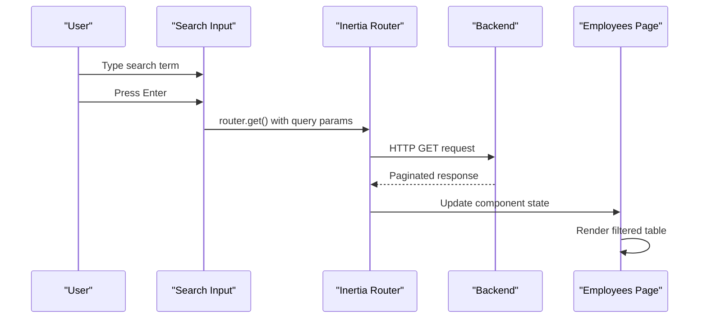

**Diagram sources**
- [Index.tsx:35-45](file://resources/js/pages/Employees/Index.tsx#L35-L45)
- [Index.tsx:28-27](file://resources/js/pages/Employees/Index.tsx#L28-L27)

**Section sources**
- [Index.tsx:1-140](file://resources/js/pages/Employees/Index.tsx#L1-L140)

### Pagination Component
- Implementation highlights:
  - Custom pagination component with Inertia integration.
  - Active state styling with primary color accents.
  - Dark mode support with automatic theme adaptation.
  - Disabled state handling for non-clickable links.
- Key features:
  - Dynamic link rendering with HTML content support.
  - Responsive design with flexible spacing.
  - State-aware styling with active/inactive differentiation.
- Props and behavior:
  - data: PaginatedDataResponse interface for type safety.
  - Link rendering with preserveState and preserveScroll options.
  - Conditional styling based on active state and URL availability.

**Section sources**
- [paginationData.tsx:1-34](file://resources/js/components/paginationData.tsx#L1-L34)

## Dependency Analysis
- Runtime dependencies:
  - @inertiajs/react for page rendering and navigation.
  - @radix-ui/* for accessible, headless UI primitives.
  - lucide-react for icons.
  - tailwind-merge and clsx for class merging.
  - next-themes for theme switching.
- Build-time dependencies:
  - Vite, TypeScript, ESLint/Prettier for tooling.
- Aliases and paths:
  - tsconfig.json maps @/* to resources/js/* for concise imports.

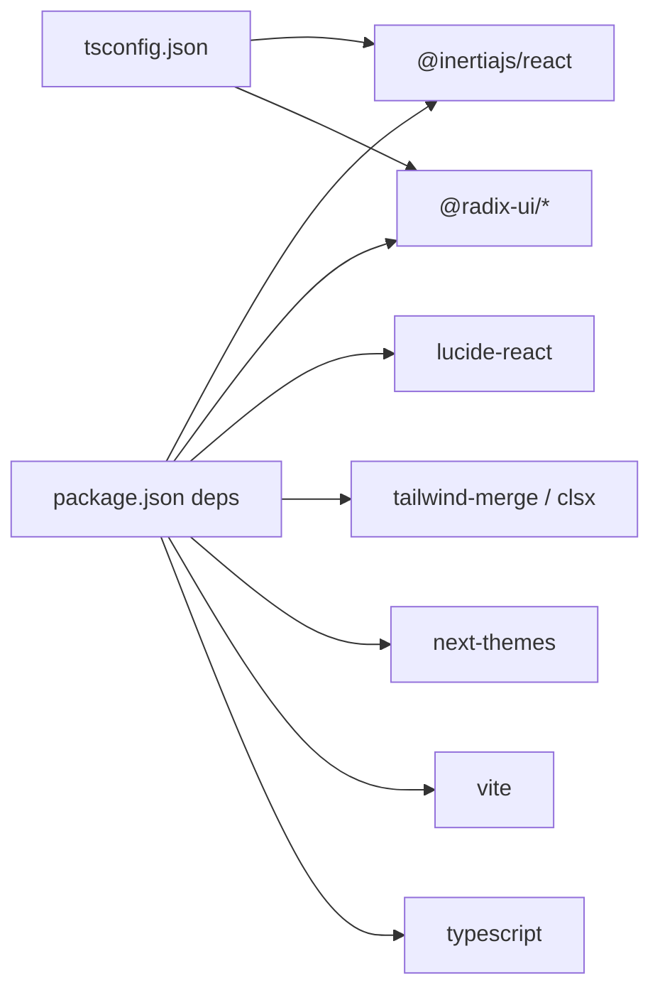

**Diagram sources**
- [package.json:23-65](file://package.json#L23-L65)
- [tsconfig.json:111-116](file://tsconfig.json#L111-L116)

**Section sources**
- [package.json:1-73](file://package.json#L1-L73)
- [tsconfig.json:111-116](file://tsconfig.json#L111-L116)

## Performance Considerations
- Bundle size:
  - Prefer lazy-loading heavy pages and components.
  - Keep icon usage scoped; avoid importing entire icon libraries.
- Rendering:
  - Use asChild patterns to minimize DOM nodes.
  - Memoize expensive computations outside components.
  - Implement virtualization for large lists (consider react-virtual for future enhancements).
- Styling:
  - Reuse shared variants and avoid excessive conditional classes.
  - Utilize CSS variables for consistent theming across components.
- Tooling:
  - Leverage Vite's fast dev server and tree-shaking.
  - Use ESLint and Prettier to maintain code quality and reduce regressions.

## Troubleshooting Guide
- Theming and SSR:
  - Ensure theme initialization runs on the client to prevent hydration mismatches.
- Accessibility:
  - Verify focus-visible rings and aria-* attributes for form controls.
  - Provide labels for icons and sr-only text for decorative icons.
- Styling conflicts:
  - Use the cn() helper to merge classes deterministically.
  - Avoid conflicting Tailwind utilities; prefer component variants.
- Build issues:
  - Confirm tsconfig paths and JSX settings.
  - Validate Vite and plugin versions.
- New component issues:
  - Ensure Radix UI primitives are properly imported and configured.
  - Verify data-slot attributes are correctly applied for styling.
  - Check for proper portal rendering in menu and dialog components.

**Section sources**
- [app.tsx:28-30](file://resources/js/app.tsx#L28-L30)
- [utils.ts:4-6](file://resources/js/lib/utils.ts#L4-L6)
- [tsconfig.json:111-116](file://tsconfig.json#L111-L116)

## Conclusion
The component library emphasizes accessibility, composability, and consistency through Radix UI primitives, Tailwind utilities, and a centralized cn() helper. The architecture supports rapid iteration, strong typing, and maintainable UI patterns. The addition of new components like Navigation Menu, Menubar, Sidebar, and enhanced page patterns demonstrates the evolution toward more sophisticated UI patterns. Following the documented props, variants, and composition guidelines ensures predictable behavior across pages and contexts.

## Appendices

### Component Composition Patterns
- Variant-driven styling with class-variance-authority.
- asChild composition for semantic correctness.
- Portal-based overlays for modularity.
- Data attributes for coordinated slot layouts.
- Context-based state management for complex components.

### State Management and Interactivity
- Dialog and Select rely on Radix UI state machines; expose minimal props to consumers.
- Form controls integrate focus-visible and aria-invalid states.
- Theme initialization occurs on mount to avoid SSR mismatches.
- Sidebar uses context and cookies for persistent state management.
- Menus utilize data attributes for styling coordination.

### Responsive Design and Accessibility
- Responsive breakpoints via Tailwind utilities; horizontal scrolling for tables.
- Focus-visible rings and keyboard navigation supported by Radix UI.
- Screen-reader labels for icons and close buttons.
- Mobile-first design with progressive enhancement.
- Touch-friendly targets and gesture support.

### Testing Approach and Workflow
- Unit testing:
  - Test component renders with variants and asChild behavior.
  - Validate accessibility attributes and focus states.
  - Test form state management and router integration.
- Integration testing:
  - Simulate user interactions (open dialogs, select items, navigate menus).
  - Test responsive behavior across device sizes.
  - Validate pagination and search functionality.
- Development workflow:
  - Use Vite dev server for hot reload.
  - Run linting and formatting checks via npm scripts.
  - Commit with clear messages and review changes in pull requests.