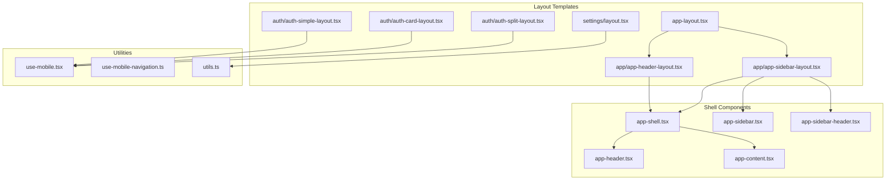
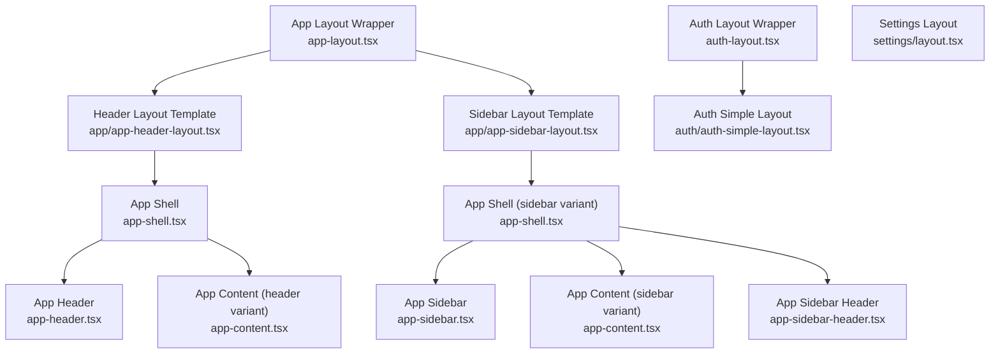
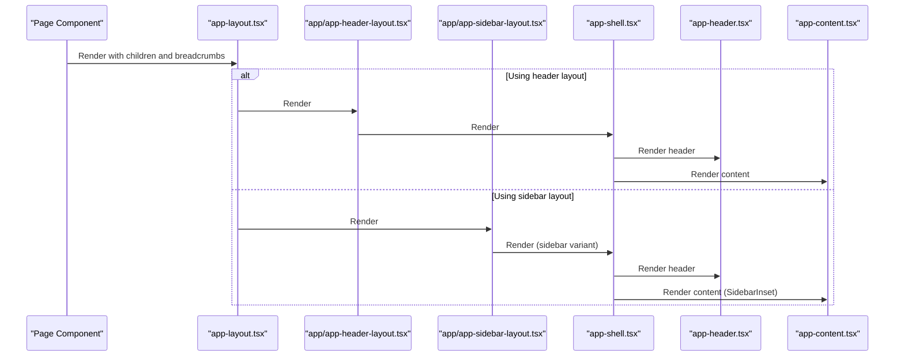
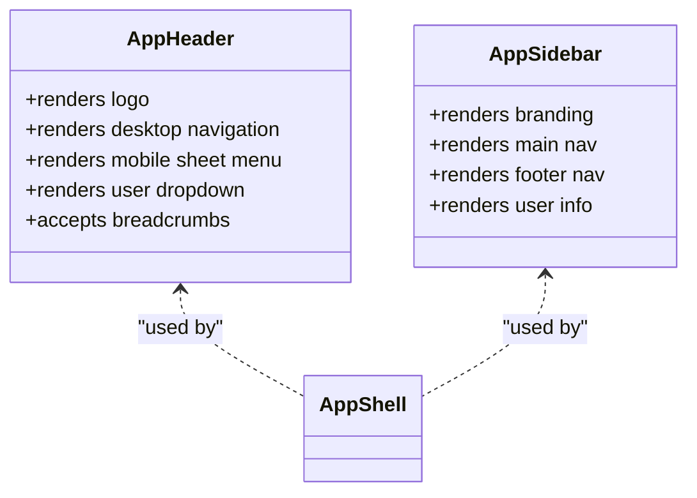
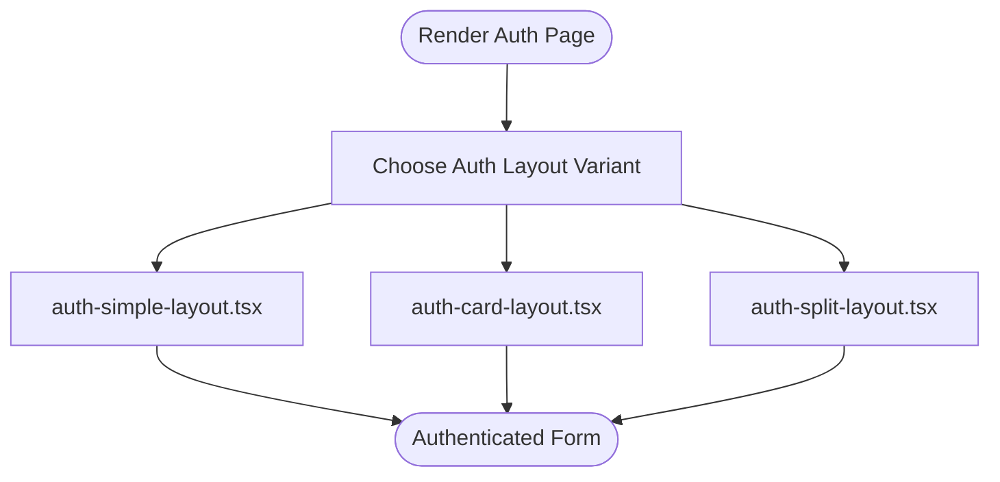
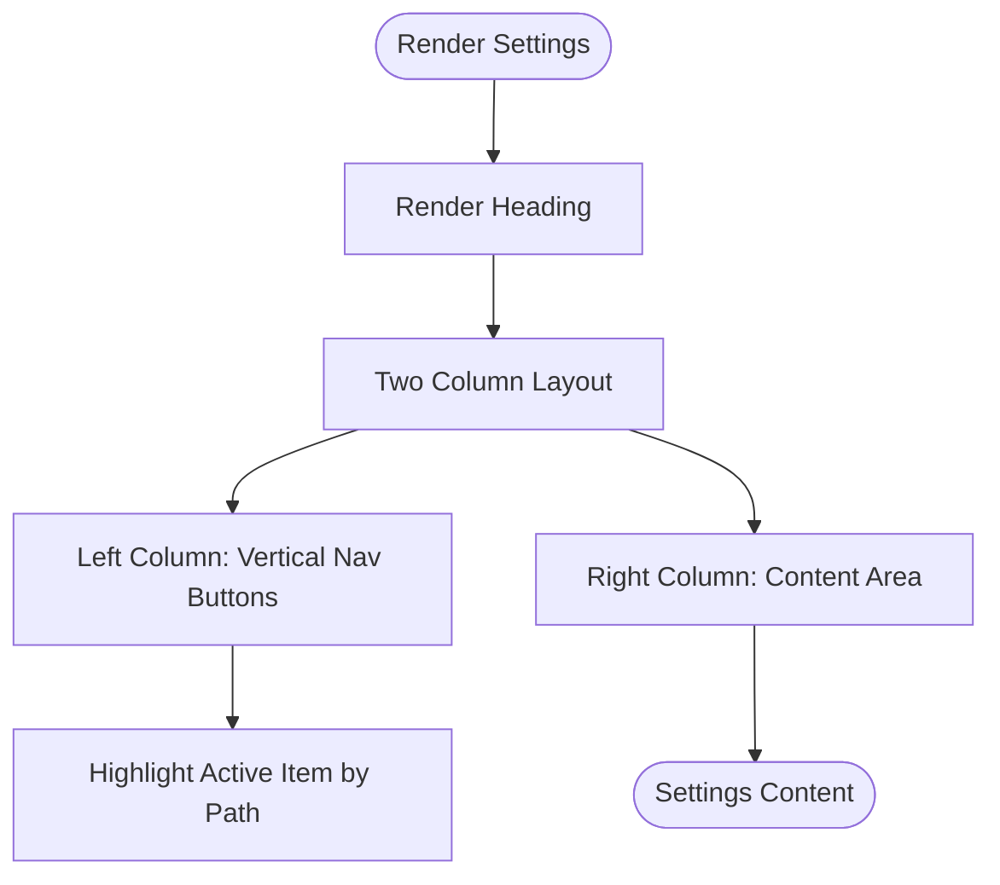
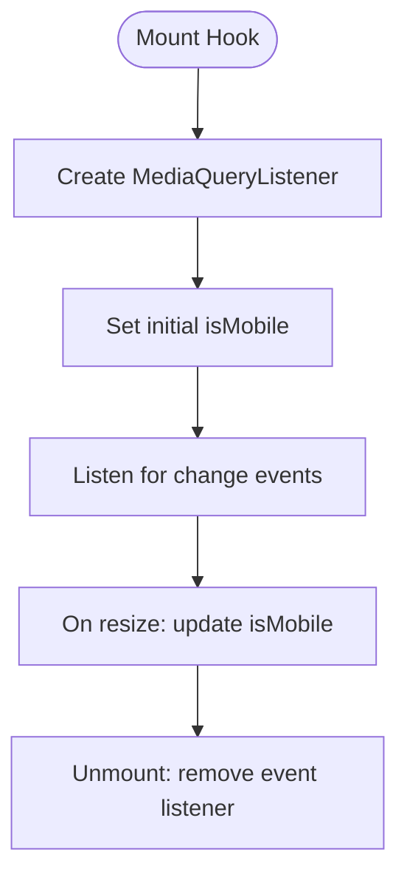
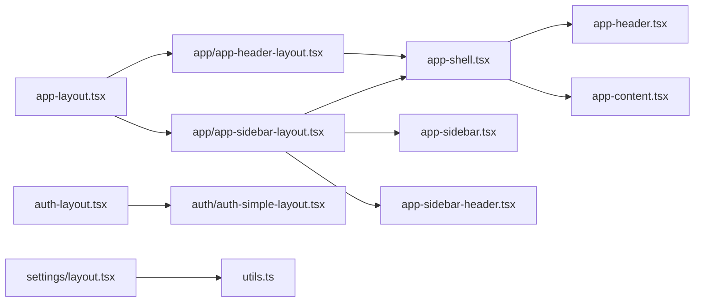

# Layout Systems

<cite>
**Referenced Files in This Document**
- [app-layout.tsx](file://resources/js/layouts/app-layout.tsx)
- [auth-layout.tsx](file://resources/js/layouts/auth-layout.tsx)
- [settings/layout.tsx](file://resources/js/layouts/settings/layout.tsx)
- [app/app-header-layout.tsx](file://resources/js/layouts/app/app-header-layout.tsx)
- [app/app-sidebar-layout.tsx](file://resources/js/layouts/app/app-sidebar-layout.tsx)
- [auth/auth-card-layout.tsx](file://resources/js/layouts/auth/auth-card-layout.tsx)
- [auth/auth-simple-layout.tsx](file://resources/js/layouts/auth/auth-simple-layout.tsx)
- [auth/auth-split-layout.tsx](file://resources/js/layouts/auth/auth-split-layout.tsx)
- [app-shell.tsx](file://resources/js/components/app-shell.tsx)
- [app-header.tsx](file://resources/js/components/app-header.tsx)
- [app-sidebar.tsx](file://resources/js/components/app-sidebar.tsx)
- [app-content.tsx](file://resources/js/components/app-content.tsx)
- [app-sidebar-header.tsx](file://resources/js/components/app-sidebar-header.tsx)
- [use-mobile.tsx](file://resources/js/hooks/use-mobile.tsx)
- [use-mobile-navigation.ts](file://resources/js/hooks/use-mobile-navigation.ts)
- [utils.ts](file://resources/js/lib/utils.ts)
</cite>

## Table of Contents
1. [Introduction](#introduction)
2. [Project Structure](#project-structure)
3. [Core Components](#core-components)
4. [Architecture Overview](#architecture-overview)
5. [Detailed Component Analysis](#detailed-component-analysis)
6. [Dependency Analysis](#dependency-analysis)
7. [Performance Considerations](#performance-considerations)
8. [Troubleshooting Guide](#troubleshooting-guide)
9. [Conclusion](#conclusion)
10. [Appendices](#appendices)

## Introduction
This document explains the layout system architecture for a Laravel + React application using Inertia.js. It covers the main layout families: application layouts, authentication layouts, and settings layouts. It details responsive design patterns, sidebar navigation, header components, and content areas. It also documents layout composition, breakpoint handling, mobile-first design, customization, nested layouts, conditional rendering, state management, navigation integration, accessibility, performance optimization, and SSR considerations.

## Project Structure
The layout system is organized by domain:
- Application layouts: app-layout.tsx and app/* layouts wrap page content with header or sidebar shells.
- Authentication layouts: auth/* layouts provide card, simple, and split variants for auth pages.
- Settings layouts: settings/layout.tsx defines a two-column settings interface with a left navigation and content area.
- Core layout components: app-shell.tsx, app-header.tsx, app-sidebar.tsx, app-content.tsx, app-sidebar-header.tsx compose the shell and regions.
- Hooks and utilities: use-mobile.tsx and use-mobile-navigation.ts enable responsive behavior and mobile navigation cleanup; utils.ts provides Tailwind class merging.

**Diagram sources**
- [app-layout.tsx:1-17](file://resources/js/layouts/app-layout.tsx#L1-L17)
- [app/app-header-layout.tsx:1-19](file://resources/js/layouts/app/app-header-layout.tsx#L1-L19)
- [app/app-sidebar-layout.tsx:1-18](file://resources/js/layouts/app/app-sidebar-layout.tsx#L1-L18)
- [auth/auth-simple-layout.tsx:1-35](file://resources/js/layouts/auth/auth-simple-layout.tsx#L1-L35)
- [auth/auth-card-layout.tsx:1-37](file://resources/js/layouts/auth/auth-card-layout.tsx#L1-L37)
- [auth/auth-split-layout.tsx:1-46](file://resources/js/layouts/auth/auth-split-layout.tsx#L1-L46)
- [app-shell.tsx:1-30](file://resources/js/components/app-shell.tsx#L1-L30)
- [app-header.tsx:1-243](file://resources/js/components/app-header.tsx#L1-L243)
- [app-sidebar.tsx:1-57](file://resources/js/components/app-sidebar.tsx#L1-L57)
- [app-content.tsx:1-19](file://resources/js/components/app-content.tsx#L1-L19)
- [app-sidebar-header.tsx:1-15](file://resources/js/components/app-sidebar-header.tsx#L1-L15)
- [use-mobile.tsx:1-23](file://resources/js/hooks/use-mobile.tsx#L1-L23)
- [use-mobile-navigation.ts:1-11](file://resources/js/hooks/use-mobile-navigation.ts#L1-L11)
- [utils.ts:1-7](file://resources/js/lib/utils.ts#L1-L7)

**Section sources**
- [app-layout.tsx:1-17](file://resources/js/layouts/app-layout.tsx#L1-L17)
- [auth-layout.tsx:1-10](file://resources/js/layouts/auth-layout.tsx#L1-L10)
- [settings/layout.tsx:1-63](file://resources/js/layouts/settings/layout.tsx#L1-L63)
- [app-shell.tsx:1-30](file://resources/js/components/app-shell.tsx#L1-L30)

## Core Components
- App layout wrapper: app-layout.tsx selects either header or sidebar layout template and injects notifications.
- App header layout: app/app-header-layout.tsx composes AppShell, AppHeader, and AppContent.
- App sidebar layout: app/app-sidebar-layout.tsx composes AppShell with variant "sidebar", AppSidebar, AppContent with variant "sidebar", and AppSidebarHeader.
- App shell: app-shell.tsx manages layout variant and sidebar persistence via local storage.
- App header: app-header.tsx renders logo, desktop navigation, mobile sheet menu, and user dropdown; integrates breadcrumbs and navigation groups.
- App sidebar: app-sidebar.tsx renders main and footer navigation, user info, and branding.
- App content: app-content.tsx switches between centered content region and SidebarInset depending on variant.
- App sidebar header: app-sidebar-header.tsx renders breadcrumbs and the SidebarTrigger for toggling the sidebar.
- Auth layouts: auth/auth-simple-layout.tsx, auth/auth-card-layout.tsx, and auth/auth-split-layout.tsx provide three auth presentation styles.
- Settings layout: settings/layout.tsx renders a two-column layout with a left navigation and content area, highlighting the active item based on current path.
- Responsive hooks: use-mobile.tsx detects mobile viewport; use-mobile-navigation.ts provides cleanup for mobile overlays.
- Utilities: utils.ts provides a class merging utility used across components.

**Section sources**
- [app-layout.tsx:6-16](file://resources/js/layouts/app-layout.tsx#L6-L16)
- [app/app-header-layout.tsx:6-18](file://resources/js/layouts/app/app-header-layout.tsx#L6-L18)
- [app/app-sidebar-layout.tsx:7-17](file://resources/js/layouts/app/app-sidebar-layout.tsx#L7-L17)
- [app-shell.tsx:9-29](file://resources/js/components/app-shell.tsx#L9-L29)
- [app-header.tsx:92-242](file://resources/js/components/app-header.tsx#L92-L242)
- [app-sidebar.tsx:31-56](file://resources/js/components/app-sidebar.tsx#L31-L56)
- [app-content.tsx:8-18](file://resources/js/components/app-content.tsx#L8-L18)
- [app-sidebar-header.tsx:5-14](file://resources/js/components/app-sidebar-header.tsx#L5-L14)
- [auth/auth-simple-layout.tsx:11-34](file://resources/js/layouts/auth/auth-simple-layout.tsx#L11-L34)
- [auth/auth-card-layout.tsx:5-36](file://resources/js/layouts/auth/auth-card-layout.tsx#L5-L36)
- [auth/auth-split-layout.tsx:11-45](file://resources/js/layouts/auth/auth-split-layout.tsx#L11-L45)
- [settings/layout.tsx:26-62](file://resources/js/layouts/settings/layout.tsx#L26-L62)
- [use-mobile.tsx:5-22](file://resources/js/hooks/use-mobile.tsx#L5-L22)
- [use-mobile-navigation.ts:3-10](file://resources/js/hooks/use-mobile-navigation.ts#L3-L10)
- [utils.ts:4-6](file://resources/js/lib/utils.ts#L4-L6)

## Architecture Overview
The layout system is composed of thin wrapper layouts and reusable shell components. App layouts choose between header-based and sidebar-based shells. Shell components coordinate regions and state, while auth and settings layouts provide specialized containers for their domains.

**Diagram sources**
- [app-layout.tsx:3-16](file://resources/js/layouts/app-layout.tsx#L3-L16)
- [app/app-header-layout.tsx:11-17](file://resources/js/layouts/app/app-header-layout.tsx#L11-L17)
- [app/app-sidebar-layout.tsx:7-15](file://resources/js/layouts/app/app-sidebar-layout.tsx#L7-L15)
- [app-shell.tsx:9-28](file://resources/js/components/app-shell.tsx#L9-L28)
- [app-header.tsx:92-100](file://resources/js/components/app-header.tsx#L92-L100)
- [app-content.tsx:8-17](file://resources/js/components/app-content.tsx#L8-L17)
- [app-sidebar.tsx:31-54](file://resources/js/components/app-sidebar.tsx#L31-L54)
- [app-sidebar-header.tsx:5-12](file://resources/js/components/app-sidebar-header.tsx#L5-L12)
- [auth-layout.tsx:3-9](file://resources/js/layouts/auth-layout.tsx#L3-L9)
- [auth/auth-simple-layout.tsx:11-34](file://resources/js/layouts/auth/auth-simple-layout.tsx#L11-L34)
- [settings/layout.tsx:26-62](file://resources/js/layouts/settings/layout.tsx#L26-L62)

## Detailed Component Analysis

### App Layout Family
- app-layout.tsx: Selects a header-based template and adds a notification component. Accepts optional breadcrumbs and forwards props.
- app/app-header-layout.tsx: Composes AppShell, AppHeader, and AppContent; supports breadcrumbs.
- app/app-sidebar-layout.tsx: Composes AppShell with variant "sidebar", AppSidebar, AppContent with variant "sidebar", and AppSidebarHeader; supports breadcrumbs.
- app-shell.tsx: Provides a variant-aware container. For "sidebar" variant, wraps children in a provider that manages sidebar open state and persists it to local storage. For "header" variant, renders a simple columnar layout.
- app-content.tsx: Renders main content area; switches between centered content and SidebarInset depending on variant.
- app-sidebar-header.tsx: Renders breadcrumbs and the SidebarTrigger for toggling the sidebar.

**Diagram sources**
- [app-layout.tsx:11-16](file://resources/js/layouts/app-layout.tsx#L11-L16)
- [app/app-header-layout.tsx:11-17](file://resources/js/layouts/app/app-header-layout.tsx#L11-L17)
- [app/app-sidebar-layout.tsx:7-15](file://resources/js/layouts/app/app-sidebar-layout.tsx#L7-L15)
- [app-shell.tsx:9-28](file://resources/js/components/app-shell.tsx#L9-L28)
- [app-header.tsx:92-100](file://resources/js/components/app-header.tsx#L92-L100)
- [app-content.tsx:8-17](file://resources/js/components/app-content.tsx#L8-L17)

**Section sources**
- [app-layout.tsx:6-16](file://resources/js/layouts/app-layout.tsx#L6-L16)
- [app/app-header-layout.tsx:6-18](file://resources/js/layouts/app/app-header-layout.tsx#L6-L18)
- [app/app-sidebar-layout.tsx:7-17](file://resources/js/layouts/app/app-sidebar-layout.tsx#L7-L17)
- [app-shell.tsx:9-29](file://resources/js/components/app-shell.tsx#L9-L29)
- [app-content.tsx:8-18](file://resources/js/components/app-content.tsx#L8-L18)
- [app-sidebar-header.tsx:5-14](file://resources/js/components/app-sidebar-header.tsx#L5-L14)

### App Header and Navigation
- app-header.tsx: Implements a responsive header with:
  - Mobile sheet menu for navigation groups.
  - Desktop navigation menu using a shared navigation component.
  - User avatar dropdown with user actions.
  - Breadcrumbs support integrated into the header.
- app-sidebar.tsx: Provides a persistent sidebar with:
  - Branding in the header.
  - Main navigation items.
  - Footer links and user info in the footer.

**Diagram sources**
- [app-header.tsx:92-242](file://resources/js/components/app-header.tsx#L92-L242)
- [app-sidebar.tsx:31-56](file://resources/js/components/app-sidebar.tsx#L31-L56)

**Section sources**
- [app-header.tsx:17-86](file://resources/js/components/app-header.tsx#L17-L86)
- [app-header.tsx:92-242](file://resources/js/components/app-header.tsx#L92-L242)
- [app-sidebar.tsx:10-29](file://resources/js/components/app-sidebar.tsx#L10-L29)
- [app-sidebar.tsx:31-56](file://resources/js/components/app-sidebar.tsx#L31-L56)

### Authentication Layouts
- auth-layout.tsx: Thin wrapper around auth-simple-layout.tsx, forwarding title and description.
- auth-simple-layout.tsx: Minimal centered layout with logo, title, description, and children.
- auth-card-layout.tsx: Card-based layout with header and content padding.
- auth-split-layout.tsx: Two-column layout with a decorative sidebar and centered form content; reads shared page props for branding.

**Diagram sources**
- [auth-layout.tsx:3-9](file://resources/js/layouts/auth-layout.tsx#L3-L9)
- [auth/auth-simple-layout.tsx:11-34](file://resources/js/layouts/auth/auth-simple-layout.tsx#L11-L34)
- [auth/auth-card-layout.tsx:5-36](file://resources/js/layouts/auth/auth-card-layout.tsx#L5-L36)
- [auth/auth-split-layout.tsx:11-45](file://resources/js/layouts/auth/auth-split-layout.tsx#L11-L45)

**Section sources**
- [auth-layout.tsx:3-9](file://resources/js/layouts/auth-layout.tsx#L3-L9)
- [auth/auth-simple-layout.tsx:11-34](file://resources/js/layouts/auth/auth-simple-layout.tsx#L11-L34)
- [auth/auth-card-layout.tsx:5-36](file://resources/js/layouts/auth/auth-card-layout.tsx#L5-L36)
- [auth/auth-split-layout.tsx:11-45](file://resources/js/layouts/auth/auth-split-layout.tsx#L11-L45)

### Settings Layout
- settings/layout.tsx: Renders a heading and a responsive two-column layout:
  - Left column: vertical navigation buttons for settings sections.
  - Right column: content area with max widths.
  - Active item highlighting based on current path.
  - Uses a separator between columns on small screens and a flex row on larger screens.

**Diagram sources**
- [settings/layout.tsx:26-62](file://resources/js/layouts/settings/layout.tsx#L26-L62)

**Section sources**
- [settings/layout.tsx:8-24](file://resources/js/layouts/settings/layout.tsx#L8-L24)
- [settings/layout.tsx:26-62](file://resources/js/layouts/settings/layout.tsx#L26-L62)

### Responsive Design Patterns and Breakpoints
- Mobile-first approach: Components adapt using Tailwind breakpoints (e.g., md, lg) and a mobile detection hook.
- use-mobile.tsx: Detects mobile viewport using a media query listener and exposes a boolean flag.
- use-mobile-navigation.ts: Provides a cleanup callback to remove pointer-events from the body after mobile navigation interactions.
- app-header.tsx: Uses a mobile sheet for navigation and hides desktop navigation on small screens.
- settings/layout.tsx: Uses lg and md utilities to switch between stacked and side-by-side layouts.

**Diagram sources**
- [use-mobile.tsx:5-22](file://resources/js/hooks/use-mobile.tsx#L5-L22)

**Section sources**
- [use-mobile.tsx:5-22](file://resources/js/hooks/use-mobile.tsx#L5-L22)
- [use-mobile-navigation.ts:3-10](file://resources/js/hooks/use-mobile-navigation.ts#L3-L10)
- [app-header.tsx:101-202](file://resources/js/components/app-header.tsx#L101-L202)
- [settings/layout.tsx:33-59](file://resources/js/layouts/settings/layout.tsx#L33-L59)

### Layout Composition, Nested Layouts, and Conditional Rendering
- app-layout.tsx conditionally selects a header or sidebar template and forwards breadcrumbs.
- app/app-sidebar-layout.tsx nests AppSidebar, AppContent (variant "sidebar"), and AppSidebarHeader.
- app-shell.tsx conditionally renders a SidebarProvider for sidebar variant or a simple div for header variant.
- app-header.tsx conditionally renders mobile sheet vs desktop navigation based on viewport.
- settings/layout.tsx conditionally renders separators and columns based on screen size.

**Section sources**
- [app-layout.tsx:11-16](file://resources/js/layouts/app-layout.tsx#L11-L16)
- [app/app-sidebar-layout.tsx:7-15](file://resources/js/layouts/app/app-sidebar-layout.tsx#L7-L15)
- [app-shell.tsx:20-28](file://resources/js/components/app-shell.tsx#L20-L28)
- [app-header.tsx:213-219](file://resources/js/components/app-header.tsx#L213-L219)
- [settings/layout.tsx:54-59](file://resources/js/layouts/settings/layout.tsx#L54-L59)

### Layout State Management and Persistence
- app-shell.tsx manages sidebar open state:
  - Initializes from localStorage if available; otherwise defaults to open.
  - Updates localStorage on toggle and propagates state to children via a provider.
- This enables persistence across page reloads and maintains user preference.

**Section sources**
- [app-shell.tsx:10-18](file://resources/js/components/app-shell.tsx#L10-L18)

### Navigation Integration
- app-header.tsx integrates with shared navigation groups and renders nested menus for payroll, compensation, and settings.
- app-sidebar.tsx renders main and footer navigation items.
- settings/layout.tsx provides a set of predefined navigation items for settings sections.

**Section sources**
- [app-header.tsx:17-86](file://resources/js/components/app-header.tsx#L17-L86)
- [app-sidebar.tsx:10-29](file://resources/js/components/app-sidebar.tsx#L10-L29)
- [settings/layout.tsx:8-24](file://resources/js/layouts/settings/layout.tsx#L8-L24)

### Accessibility Considerations
- Semantic markup: Sheet components include screen-reader-friendly titles and roles.
- Focus management: Dropdowns and sheets are keyboard accessible.
- Icons: Descriptive icons accompany navigation items; ensure sufficient contrast and labeling.
- Landmark regions: Header and navigation are structured to improve screen reader navigation.

**Section sources**
- [app-header.tsx:108-200](file://resources/js/components/app-header.tsx#L108-L200)
- [app-header.tsx:223-235](file://resources/js/components/app-header.tsx#L223-L235)

## Dependency Analysis
The layout system exhibits low coupling and high cohesion:
- Wrapper layouts depend on template layouts.
- Template layouts depend on shell components.
- Shell components depend on UI primitives and hooks.
- Settings layout depends on shared utilities for class merging.

**Diagram sources**
- [app-layout.tsx:3-16](file://resources/js/layouts/app-layout.tsx#L3-L16)
- [app/app-header-layout.tsx:11-17](file://resources/js/layouts/app/app-header-layout.tsx#L11-L17)
- [app/app-sidebar-layout.tsx:7-15](file://resources/js/layouts/app/app-sidebar-layout.tsx#L7-L15)
- [app-shell.tsx:9-28](file://resources/js/components/app-shell.tsx#L9-L28)
- [app-header.tsx:92-100](file://resources/js/components/app-header.tsx#L92-L100)
- [app-content.tsx:8-17](file://resources/js/components/app-content.tsx#L8-L17)
- [app-sidebar.tsx:31-54](file://resources/js/components/app-sidebar.tsx#L31-L54)
- [app-sidebar-header.tsx:5-12](file://resources/js/components/app-sidebar-header.tsx#L5-L12)
- [auth-layout.tsx:3-9](file://resources/js/layouts/auth-layout.tsx#L3-L9)
- [auth/auth-simple-layout.tsx:11-34](file://resources/js/layouts/auth/auth-simple-layout.tsx#L11-L34)
- [settings/layout.tsx:26-62](file://resources/js/layouts/settings/layout.tsx#L26-L62)
- [utils.ts:4-6](file://resources/js/lib/utils.ts#L4-L6)

**Section sources**
- [app-layout.tsx:3-16](file://resources/js/layouts/app-layout.tsx#L3-L16)
- [app/app-header-layout.tsx:11-17](file://resources/js/layouts/app/app-header-layout.tsx#L11-L17)
- [app/app-sidebar-layout.tsx:7-15](file://resources/js/layouts/app/app-sidebar-layout.tsx#L7-L15)
- [app-shell.tsx:9-28](file://resources/js/components/app-shell.tsx#L9-L28)
- [auth-layout.tsx:3-9](file://resources/js/layouts/auth-layout.tsx#L3-L9)
- [settings/layout.tsx:26-62](file://resources/js/layouts/settings/layout.tsx#L26-L62)
- [utils.ts:4-6](file://resources/js/lib/utils.ts#L4-L6)

## Performance Considerations
- Minimize re-renders: Keep layout wrappers pure and avoid unnecessary prop drilling. The shell’s state is scoped to sidebar visibility.
- Lazy loading: Defer heavy content inside AppContent until needed.
- CSS utilities: Prefer Tailwind utilities for fast rendering; avoid dynamic class generation in hot paths.
- Local storage: Persist sidebar state efficiently; guard against SSR mismatches by checking for window availability.
- SSR: Ensure server-rendered HTML matches client hydration expectations. Avoid relying on browser APIs during SSR.

[No sources needed since this section provides general guidance]

## Troubleshooting Guide
- Sidebar not persisting: Verify local storage availability and that the shell initializes from stored values.
- Mobile navigation overlay blocking interactions: Use the provided cleanup hook to restore pointer-events after closing mobile sheets.
- Auth layout not rendering correctly: Confirm the chosen auth layout variant matches the page’s intent and that title/description are passed properly.
- Settings navigation not highlighting: Ensure current path matches the intended URL and that the comparison logic is consistent.

**Section sources**
- [app-shell.tsx:10-18](file://resources/js/components/app-shell.tsx#L10-L18)
- [use-mobile-navigation.ts:3-10](file://resources/js/hooks/use-mobile-navigation.ts#L3-L10)
- [auth-layout.tsx:3-9](file://resources/js/layouts/auth-layout.tsx#L3-L9)
- [settings/layout.tsx:27-44](file://resources/js/layouts/settings/layout.tsx#L27-L44)

## Conclusion
The layout system is modular, responsive, and extensible. It separates concerns between wrapper layouts, shell components, and region-specific components. With mobile-first patterns, persistent state, and accessible UI, it supports a wide range of pages while maintaining consistency and performance.

[No sources needed since this section summarizes without analyzing specific files]

## Appendices
- Customization examples:
  - Add a new app layout variant by creating a new template and importing it in the app layout wrapper.
  - Extend settings navigation by adding new items to the settings layout array.
  - Customize auth layouts by adjusting spacing, colors, and content areas.
- Nested layouts:
  - Combine app layouts with settings layout by wrapping a settings page with the app layout and passing breadcrumbs.
- Conditional rendering:
  - Use the mobile hook to conditionally render mobile or desktop navigation.
- SSR considerations:
  - Guard window-dependent logic behind checks for globalThis and ensure hydration compatibility.

[No sources needed since this section provides general guidance]