# Navigation Components

<cite>
**Referenced Files in This Document**
- [app-header.tsx](file://resources/js/components/app-header.tsx)
- [nav-main.tsx](file://resources/js/components/nav-main.tsx)
- [nav-footer.tsx](file://resources/js/components/nav-footer.tsx)
- [nav-user.tsx](file://resources/js/components/nav-user.tsx)
- [breadcrumbs.tsx](file://resources/js/components/breadcrumbs.tsx)
- [navigation-menu.tsx](file://resources/js/components/ui/navigation-menu.tsx)
- [app-sidebar.tsx](file://resources/js/components/app-sidebar.tsx)
- [user-menu-content.tsx](file://resources/js/components/user-menu-content.tsx)
- [appearance-dropdown.tsx](file://resources/js/components/appearance-dropdown.tsx)
- [appearance-tabs.tsx](file://resources/js/components/appearance-tabs.tsx)
- [use-appearance.tsx](file://resources/js/hooks/use-appearance.tsx)
- [sidebar.tsx](file://resources/js/components/ui/sidebar.tsx)
- [NavMain2.tsx](file://resources/js/components/NavMain2.tsx)
- [NavMenu.tsx](file://resources/js/components/NavMenu.tsx)
- [app-shell.tsx](file://resources/js/components/app-shell.tsx)
- [use-mobile-navigation.ts](file://resources/js/hooks/use-mobile-navigation.ts)
- [index.ts](file://resources/js/types/index.ts)
- [employees/index.tsx](file://resources/js/pages/employees/index.tsx)
- [web.php](file://routes/web.php)
- [utils.ts](file://resources/js/lib/utils.ts)
</cite>

## Update Summary
**Changes Made**
- Updated documentation to reflect the enhanced NavMenu component with dynamic icon support and improved active state detection
- Added comprehensive documentation for the new dynamic icon rendering capabilities using LucideIcon types
- Updated component analysis to include the usePage() hook integration for better active state tracking
- Revised navigation structure documentation to reflect the current implementation using NavMenu with cn utility function
- Enhanced styling consistency documentation for NavMenu component with proper class merging
- Added details about the cn utility function and its role in the enhanced styling system

## Table of Contents
1. [Introduction](#introduction)
2. [Project Structure](#project-structure)
3. [Core Components](#core-components)
4. [Architecture Overview](#architecture-overview)
5. [Detailed Component Analysis](#detailed-component-analysis)
6. [Dependency Analysis](#dependency-analysis)
7. [Performance Considerations](#performance-considerations)
8. [Troubleshooting Guide](#troubleshooting-guide)
9. [Conclusion](#conclusion)
10. [Appendices](#appendices)

## Introduction
This document explains the navigation components and user interface elements used across the application's header and sidebar. It covers:
- Main navigation menu and nested menu structures including the new Employees section
- Footer navigation
- User profile menu and logout flow
- Breadcrumb component
- Navigation state management and active item tracking
- Theme switching and appearance settings
- Dynamic menu generation and responsive navigation patterns
- Accessibility features and integration with the routing system

## Project Structure
The navigation system is composed of reusable UI components and layout shells:
- Header navigation with a desktop horizontal menu and a mobile sheet drawer
- Sidebar with main and footer navigation, plus a user menu
- Breadcrumb component for page hierarchy
- Appearance controls for light/dark/system themes
- Type definitions for navigation items and groups with enhanced icon support

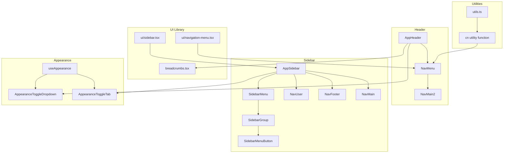

**Diagram sources**
- [app-header.tsx:92-242](file://resources/js/components/app-header.tsx#L92-L242)
- [NavMenu.tsx:50-83](file://resources/js/components/NavMenu.tsx#L50-L83)
- [NavMain2.tsx:16-69](file://resources/js/components/NavMain2.tsx#L16-L69)
- [app-sidebar.tsx:31-56](file://resources/js/components/app-sidebar.tsx#L31-L56)
- [sidebar.tsx:149-249](file://resources/js/components/ui/sidebar.tsx#L149-L249)
- [navigation-menu.tsx:8-30](file://resources/js/components/ui/navigation-menu.tsx#L8-L30)
- [breadcrumbs.tsx:5-31](file://resources/js/components/breadcrumbs.tsx#L5-L31)
- [appearance-dropdown.tsx:7-53](file://resources/js/components/appearance-dropdown.tsx#L7-L53)
- [appearance-tabs.tsx:6-34](file://resources/js/components/appearance-tabs.tsx#L6-L34)
- [use-appearance.tsx:29-46](file://resources/js/hooks/use-appearance.tsx#L29-L46)
- [utils.ts:4-6](file://resources/js/lib/utils.ts#L4-L6)

**Section sources**
- [app-header.tsx:92-242](file://resources/js/components/app-header.tsx#L92-L242)
- [app-sidebar.tsx:31-56](file://resources/js/components/app-sidebar.tsx#L31-L56)
- [sidebar.tsx:149-249](file://resources/js/components/ui/sidebar.tsx#L149-L249)
- [navigation-menu.tsx:8-30](file://resources/js/components/ui/navigation-menu.tsx#L8-L30)
- [breadcrumbs.tsx:5-31](file://resources/js/components/breadcrumbs.tsx#L5-L31)
- [appearance-dropdown.tsx:7-53](file://resources/js/components/appearance-dropdown.tsx#L7-L53)
- [appearance-tabs.tsx:6-34](file://resources/js/components/appearance-tabs.tsx#L6-L34)
- [use-appearance.tsx:29-46](file://resources/js/hooks/use-appearance.tsx#L29-L46)
- [utils.ts:4-6](file://resources/js/lib/utils.ts#L4-L6)

## Core Components
- Main navigation (sidebar): renders top-level items with active state tracking via the current page URL, including the new Employees section.
- Enhanced nested navigation (header): horizontal menu with dropdowns for grouped items using the enhanced NavMenu component, featuring dynamic items prop acceptance, improved active state detection with usePage() hook, and enhanced conditional rendering for icons.
- Footer navigation: external links styled consistently with the sidebar.
- User menu: dropdown with user info and logout action; placement adapts to mobile and collapsed sidebar states.
- Breadcrumb: renders a navigable trail with the last item as non-clickable.
- Appearance controls: dropdown and tabbed toggles to switch theme modes and persist preferences.
- Sidebar shell: manages open/collapsed state, persistence, and keyboard shortcut.

**Section sources**
- [nav-main.tsx:5-24](file://resources/js/components/nav-main.tsx#L5-L24)
- [NavMenu.tsx:50-83](file://resources/js/components/NavMenu.tsx#L50-L83)
- [NavMain2.tsx:16-69](file://resources/js/components/NavMain2.tsx#L16-L69)
- [nav-footer.tsx:5-33](file://resources/js/components/nav-footer.tsx#L5-L33)
- [nav-user.tsx:10-36](file://resources/js/components/nav-user.tsx#L10-L36)
- [breadcrumbs.tsx:5-31](file://resources/js/components/breadcrumbs.tsx#L5-L31)
- [appearance-dropdown.tsx:7-53](file://resources/js/components/appearance-dropdown.tsx#L7-L53)
- [appearance-tabs.tsx:6-34](file://resources/js/components/appearance-tabs.tsx#L6-L34)
- [app-shell.tsx:9-29](file://resources/js/components/app-shell.tsx#L9-L29)

## Architecture Overview
The navigation stack integrates React components, UI primitives, and state hooks:
- Active item tracking uses the current page URL from the routing context with improved precision using the usePage() hook.
- Enhanced nested menus utilize the NavMenu component with dynamic icon support, improved styling consistency using the cn utility function, and enhanced conditional rendering for icons.
- Sidebar state is managed centrally and persisted across sessions.
- Appearance state is stored locally and synchronized with system preference observers.

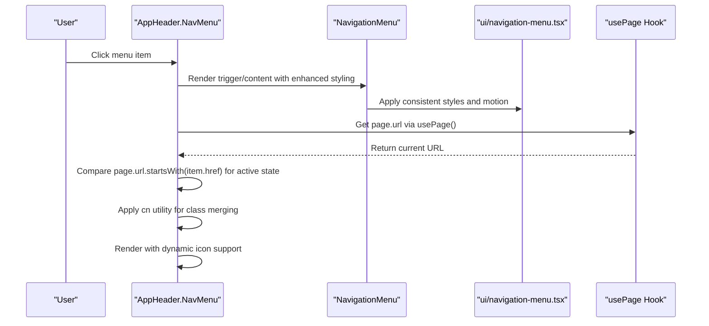

**Diagram sources**
- [NavMenu.tsx:50-83](file://resources/js/components/NavMenu.tsx#L50-L83)
- [navigation-menu.tsx:65-80](file://resources/js/components/ui/navigation-menu.tsx#L65-L80)
- [app-header.tsx:92-242](file://resources/js/components/app-header.tsx#L92-L242)
- [utils.ts:4-6](file://resources/js/lib/utils.ts#L4-L6)

**Section sources**
- [app-header.tsx:92-242](file://resources/js/components/app-header.tsx#L92-L242)
- [NavMenu.tsx:50-83](file://resources/js/components/NavMenu.tsx#L50-L83)
- [NavMain2.tsx:16-69](file://resources/js/components/NavMain2.tsx#L16-L69)
- [navigation-menu.tsx:65-80](file://resources/js/components/ui/navigation-menu.tsx#L65-L80)
- [utils.ts:4-6](file://resources/js/lib/utils.ts#L4-L6)

## Detailed Component Analysis

### Main Navigation Menu (Sidebar)
- Purpose: Renders primary navigation items inside a sidebar group, including the new Employees section.
- Active tracking: Uses the current page URL to mark the active item.
- Icons: Optional icon rendering per item, including UserRoundPen for the Employees section.
- Integration: Consumed by the sidebar layout.

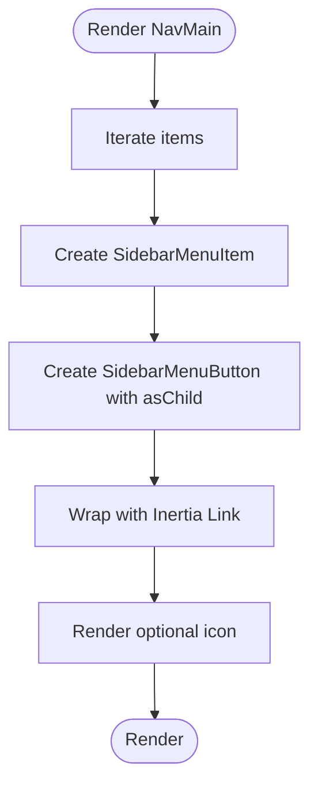

**Diagram sources**
- [nav-main.tsx:5-24](file://resources/js/components/nav-main.tsx#L5-L24)

**Section sources**
- [nav-main.tsx:5-24](file://resources/js/components/nav-main.tsx#L5-L24)
- [app-sidebar.tsx:47-47](file://resources/js/components/app-sidebar.tsx#L47-L47)

### Enhanced Main Navigation Structure
The main navigation now includes a dedicated 'Employees' section with proper routing integration:

- **Dashboard**: Primary landing page with LayoutGrid icon
- **Employees**: New section with UserRoundPen icon, routing to `/employees` URL
- **Payroll**: Grouped submenu with Payroll Summary, Employee Deductions, and Deduction Types
- **Compensation**: Grouped submenu with Salaries, PERA, and RATA
- **Settings**: Grouped submenu with Offices, Employment Statuses, and Employees

**Updated** Added the new 'Employees' menu item with UserRoundPen icon and proper routing configuration.

**Section sources**
- [app-header.tsx:17-91](file://resources/js/components/app-header.tsx#L17-L91)

### Enhanced NavMenu Component
The NavMenu component has been significantly enhanced with dynamic icon support, improved active state detection, and enhanced conditional rendering:

- **Dynamic Icon Support**: Accepts LucideIcon types via the NavGroup interface, enabling dynamic icon rendering with proper TypeScript support
- **Improved Active State Detection**: Uses `usePage()` hook with `page.url.startsWith()` for precise active state tracking
- **Enhanced Conditional Rendering**: Supports both grouped items with children and direct link items with proper icon handling
- **Proper Styling with cn Utility**: Utilizes the cn utility function for intelligent class merging and Tailwind CSS optimization
- **Responsive Design**: Adapts to different screen sizes with proper spacing and alignment
- **Accessibility**: Maintains proper ARIA attributes and keyboard navigation support

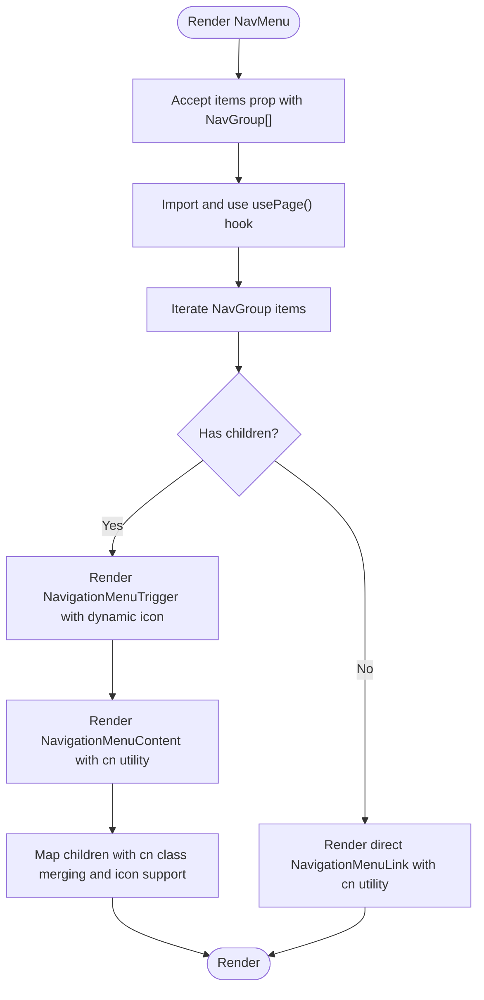

**Diagram sources**
- [NavMenu.tsx:50-83](file://resources/js/components/NavMenu.tsx#L50-L83)
- [utils.ts:4-6](file://resources/js/lib/utils.ts#L4-L6)

**Section sources**
- [NavMenu.tsx:50-83](file://resources/js/components/NavMenu.tsx#L50-L83)
- [utils.ts:4-6](file://resources/js/lib/utils.ts#L4-L6)

### Enhanced NavMain2 Component
The NavMain2 component has been enhanced with improved styling consistency and architectural improvements:

- **Improved Styling Consistency**: Enhanced CSS classes for consistent hover states, active states, and spacing
- **Dynamic Items Prop**: Accepts NavGroup[] items array via props for flexible menu configuration
- **Enhanced Active State Tracking**: Improved active state detection using page.url.startsWith()
- **Better Icon Handling**: Consistent icon sizing and positioning with proper className application
- **Architectural Improvements**: Better separation of concerns and cleaner component structure

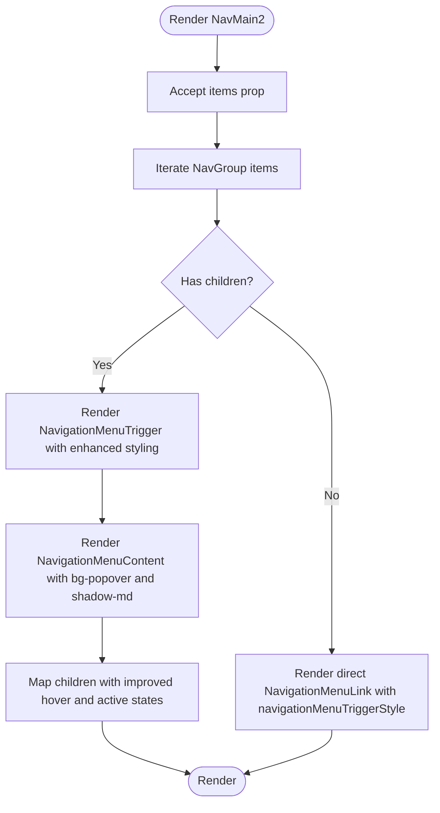

**Diagram sources**
- [NavMain2.tsx:16-69](file://resources/js/components/NavMain2.tsx#L16-L69)

**Section sources**
- [NavMain2.tsx:16-69](file://resources/js/components/NavMain2.tsx#L16-L69)

### Footer Navigation
- Purpose: Provides external links in the sidebar footer area.
- Styling: Consistent text and hover styles for links.
- Accessibility: Uses anchor tags with appropriate attributes for external targets.

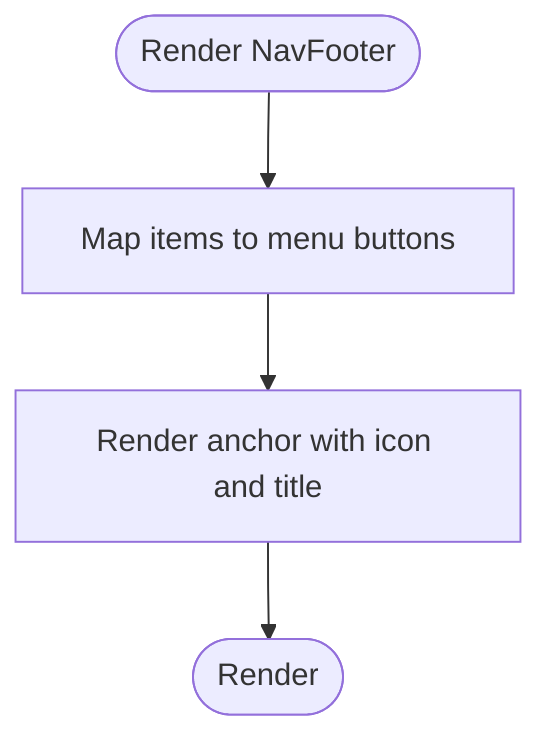

**Diagram sources**
- [nav-footer.tsx:5-33](file://resources/js/components/nav-footer.tsx#L5-L33)

**Section sources**
- [nav-footer.tsx:5-33](file://resources/js/components/nav-footer.tsx#L5-L33)

### User Profile Menu
- Purpose: Displays user avatar and triggers a dropdown menu.
- Behavior: Dropdown alignment adapts to mobile and collapsed sidebar states.
- Logout: Includes a logout action that clears mobile-specific styles upon close.

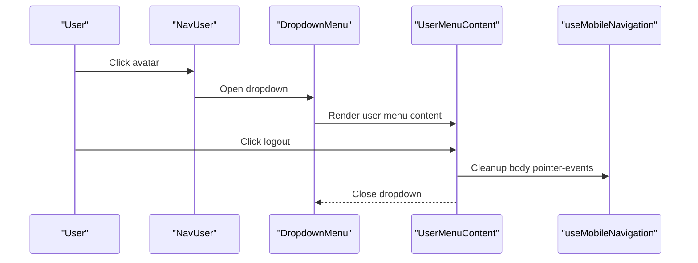

**Diagram sources**
- [nav-user.tsx:10-36](file://resources/js/components/nav-user.tsx#L10-L36)
- [user-menu-content.tsx:12-31](file://resources/js/components/user-menu-content.tsx#L12-L31)
- [use-mobile-navigation.ts:3-10](file://resources/js/hooks/use-mobile-navigation.ts#L3-L10)

**Section sources**
- [nav-user.tsx:10-36](file://resources/js/components/nav-user.tsx#L10-L36)
- [user-menu-content.tsx:12-31](file://resources/js/components/user-menu-content.tsx#L12-L31)
- [use-mobile-navigation.ts:3-10](file://resources/js/hooks/use-mobile-navigation.ts#L3-L10)

### Breadcrumb Component
- Purpose: Renders a navigable breadcrumb trail.
- Logic: Last item is non-clickable; separators are inserted between items.

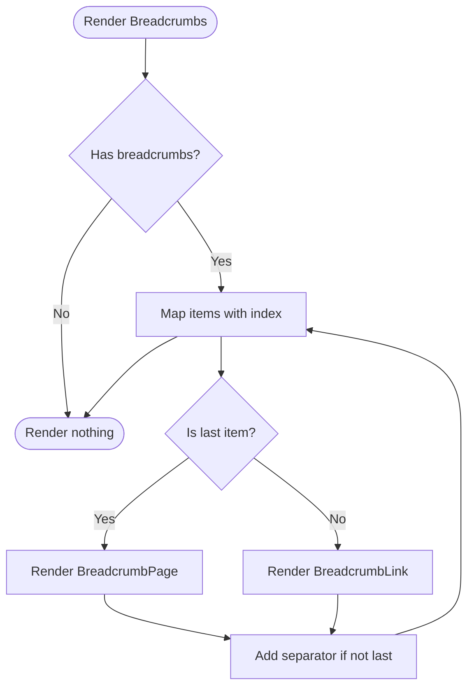

**Diagram sources**
- [breadcrumbs.tsx:5-31](file://resources/js/components/breadcrumbs.tsx#L5-L31)

**Section sources**
- [breadcrumbs.tsx:5-31](file://resources/js/components/breadcrumbs.tsx#L5-L31)

### Enhanced Nested Menu Structures (Header)
- Purpose: Horizontal navigation with dropdowns for grouped items using the enhanced NavMenu component.
- Active tracking: Highlights items whose URL matches the current route prefix using the usePage() hook.
- Rendering: Conditional rendering for items with children vs direct links with dynamic icon support.
- Styling consistency: Improved styling consistency across all menu items and dropdowns using the cn utility function.

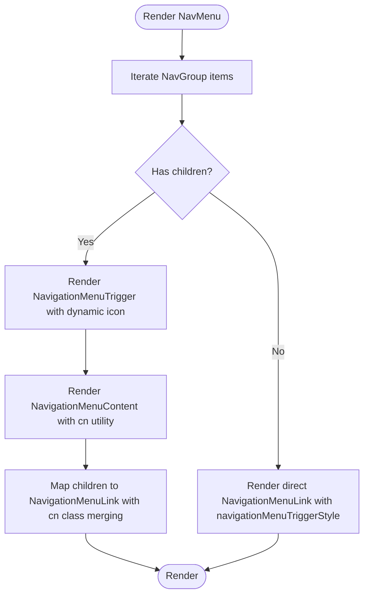

**Diagram sources**
- [NavMenu.tsx:50-83](file://resources/js/components/NavMenu.tsx#L50-L83)
- [navigation-menu.tsx:65-80](file://resources/js/components/ui/navigation-menu.tsx#L65-L80)
- [utils.ts:4-6](file://resources/js/lib/utils.ts#L4-L6)

**Section sources**
- [NavMenu.tsx:50-83](file://resources/js/components/NavMenu.tsx#L50-L83)
- [app-header.tsx:17-86](file://resources/js/components/app-header.tsx#L17-L86)
- [utils.ts:4-6](file://resources/js/lib/utils.ts#L4-L6)

### Appearance Settings and Theme Switching
- Purpose: Allow users to switch between light, dark, and system themes.
- Persistence: Uses local storage to remember user preference.
- System integration: Observes system theme changes and updates accordingly.

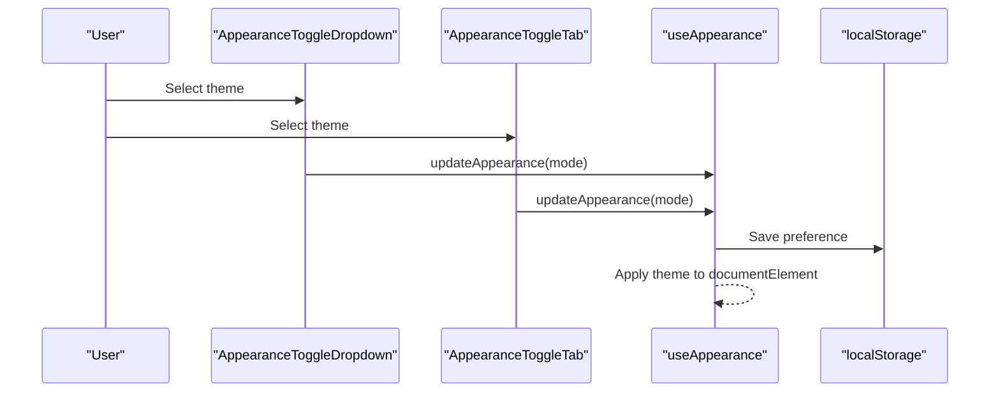

**Diagram sources**
- [appearance-dropdown.tsx:7-53](file://resources/js/components/appearance-dropdown.tsx#L7-L53)
- [appearance-tabs.tsx:6-34](file://resources/js/components/appearance-tabs.tsx#L6-L34)
- [use-appearance.tsx:29-46](file://resources/js/hooks/use-appearance.tsx#L29-L46)

**Section sources**
- [appearance-dropdown.tsx:7-53](file://resources/js/components/appearance-dropdown.tsx#L7-L53)
- [appearance-tabs.tsx:6-34](file://resources/js/components/appearance-tabs.tsx#L6-L34)
- [use-appearance.tsx:29-46](file://resources/js/hooks/use-appearance.tsx#L29-L46)

### Responsive Navigation Patterns
- Sidebar provider: Manages open/collapsed state, cookie persistence, and keyboard shortcut.
- Mobile drawer: Sheet-based navigation for small screens.
- Adaptive dropdowns: User menu position adjusts based on device and sidebar state.

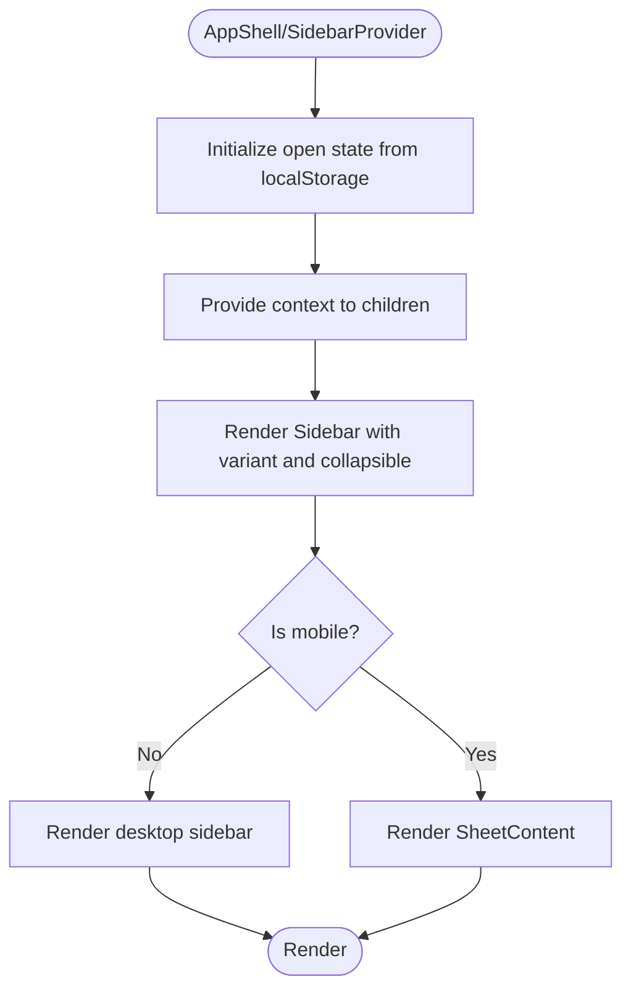

**Diagram sources**
- [app-shell.tsx:9-29](file://resources/js/components/app-shell.tsx#L9-L29)
- [sidebar.tsx:53-147](file://resources/js/components/ui/sidebar.tsx#L53-L147)
- [app-header.tsx:100-202](file://resources/js/components/app-header.tsx#L100-L202)

**Section sources**
- [app-shell.tsx:9-29](file://resources/js/components/app-shell.tsx#L9-L29)
- [sidebar.tsx:53-147](file://resources/js/components/ui/sidebar.tsx#L53-L147)
- [app-header.tsx:100-202](file://resources/js/components/app-header.tsx#L100-L202)

## Dependency Analysis
- Data structures: Navigation items and groups are defined in shared types with enhanced LucideIcon support.
- Active state: Both NavMenu and NavMain2 components rely on the current page URL to compute active items, with NavMenu using the more precise usePage() hook.
- UI primitives: Navigation menus and sidebar components depend on UI library primitives.
- State management: Sidebar state and appearance state are isolated but influence UI rendering.
- Utility functions: The cn utility function provides intelligent class merging for enhanced styling consistency.

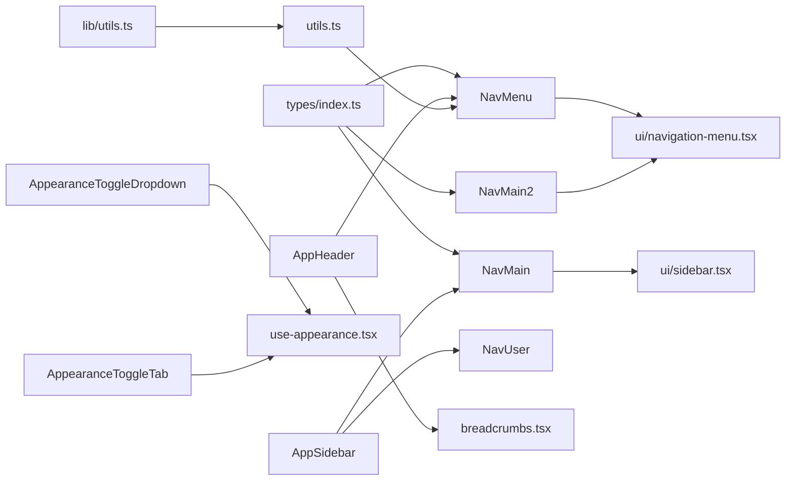

**Diagram sources**
- [index.ts:17-30](file://resources/js/types/index.ts#L17-L30)
- [NavMenu.tsx:50-83](file://resources/js/components/NavMenu.tsx#L50-L83)
- [NavMain2.tsx:16-69](file://resources/js/components/NavMain2.tsx#L16-L69)
- [nav-main.tsx:5-24](file://resources/js/components/nav-main.tsx#L5-L24)
- [navigation-menu.tsx:8-30](file://resources/js/components/ui/navigation-menu.tsx#L8-L30)
- [sidebar.tsx:149-249](file://resources/js/components/ui/sidebar.tsx#L149-L249)
- [app-header.tsx:92-242](file://resources/js/components/app-header.tsx#L92-L242)
- [app-sidebar.tsx:31-56](file://resources/js/components/app-sidebar.tsx#L31-L56)
- [nav-user.tsx:10-36](file://resources/js/components/nav-user.tsx#L10-L36)
- [breadcrumbs.tsx:5-31](file://resources/js/components/breadcrumbs.tsx#L5-L31)
- [appearance-dropdown.tsx:7-53](file://resources/js/components/appearance-dropdown.tsx#L7-L53)
- [appearance-tabs.tsx:6-34](file://resources/js/components/appearance-tabs.tsx#L6-L34)
- [use-appearance.tsx:29-46](file://resources/js/hooks/use-appearance.tsx#L29-L46)
- [utils.ts:4-6](file://resources/js/lib/utils.ts#L4-L6)

**Section sources**
- [index.ts:17-30](file://resources/js/types/index.ts#L17-L30)
- [app-header.tsx:92-242](file://resources/js/components/app-header.tsx#L92-L242)
- [app-sidebar.tsx:31-56](file://resources/js/components/app-sidebar.tsx#L31-L56)
- [nav-user.tsx:10-36](file://resources/js/components/nav-user.tsx#L10-L36)
- [breadcrumbs.tsx:5-31](file://resources/js/components/breadcrumbs.tsx#L5-L31)
- [appearance-dropdown.tsx:7-53](file://resources/js/components/appearance-dropdown.tsx#L7-L53)
- [appearance-tabs.tsx:6-34](file://resources/js/components/appearance-tabs.tsx#L6-L34)
- [use-appearance.tsx:29-46](file://resources/js/hooks/use-appearance.tsx#L29-L46)
- [utils.ts:4-6](file://resources/js/lib/utils.ts#L4-L6)

## Performance Considerations
- Prefer lazy loading icons and avoid unnecessary re-renders by keeping item lists static or memoized.
- Minimize DOM nodes in nested menus; collapse inactive branches when possible.
- Use CSS transitions sparingly; leverage UI library animations rather than custom ones.
- Persist and hydrate state efficiently to avoid layout shifts during initial render.
- The enhanced NavMenu component provides better performance through improved styling consistency, cn utility function optimization, and precise active state detection using the usePage() hook.
- Dynamic icon rendering is optimized through proper TypeScript typing and conditional rendering logic.

## Troubleshooting Guide
- Active item not highlighted:
  - Verify the current page URL matches the item's href or URL prefix using `page.url.startsWith()`.
  - Ensure the active comparison logic uses the correct property (full URL vs prefix).
  - Check that NavMenu and NavMain2 components are receiving the correct items prop.
  - Confirm the usePage() hook is properly imported and functioning.
- Dropdowns misaligned on mobile:
  - Confirm the user menu's side calculation accounts for collapsed state and device type.
- Theme not applying:
  - Check local storage persistence and system preference observer registration.
- Sidebar not remembering state:
  - Confirm cookie and localStorage keys are present and not blocked by browser settings.
- New Employees menu item not appearing:
  - Verify the Employees route exists in the routing configuration.
  - Check that the UserRoundPen icon is properly imported from lucide-react.
  - Ensure the navigation item has the correct href property set to '/employees'.
- NavMenu component not rendering:
  - Verify that the NavMenu component is properly imported in AppHeader.
  - Check that the items prop is being passed correctly to NavMenu.
  - Ensure NavGroup type definition matches the expected structure.
  - Confirm LucideIcon types are properly imported and typed.
- Dynamic icons not displaying:
  - Verify that the icon property in NavGroup is properly typed as LucideIcon.
  - Check that icons are imported from lucide-react correctly.
  - Ensure conditional rendering logic `{item.icon && <item.icon className="h-4 w-4" />}` is functioning.
- cn utility function errors:
  - Verify that the cn function is properly imported from lib/utils.ts.
  - Check that Tailwind CSS and clsx dependencies are installed correctly.

**Section sources**
- [nav-main.tsx:13-13](file://resources/js/components/nav-main.tsx#L13-L13)
- [NavMenu.tsx:50-50](file://resources/js/components/NavMenu.tsx#L50-L50)
- [NavMain2.tsx:70-72](file://resources/js/components/NavMain2.tsx#L70-L72)
- [nav-user.tsx:28-28](file://resources/js/components/nav-user.tsx#L28-L28)
- [use-appearance.tsx:32-36](file://resources/js/hooks/use-appearance.tsx#L32-L36)
- [app-shell.tsx:10-18](file://resources/js/components/app-shell.tsx#L10-L18)
- [app-header.tsx:24-27](file://resources/js/components/app-header.tsx#L24-L27)
- [utils.ts:4-6](file://resources/js/lib/utils.ts#L4-L6)

## Conclusion
The navigation system combines a responsive sidebar and a desktop header menu with robust active state tracking, nested structures, and theme-aware UI. The enhanced NavMenu component provides improved styling consistency, dynamic icon support with LucideIcon types, precise active state detection using the usePage() hook, and architectural improvements with cn utility function integration. The addition of the new Employees section with UserRoundPen icon enhances the navigation capabilities while maintaining seamless integration with the existing structure. Appearance settings are persisted and synchronized with system preferences, while user actions integrate seamlessly with the routing context. The modular design enables easy customization and extension with the latest architectural improvements, including intelligent class merging and dynamic icon rendering.

## Appendices

### Accessibility Features
- Keyboard navigation: Sidebar toggle supports a global keyboard shortcut.
- Focus management: Dropdowns and sheets manage focus appropriately.
- Screen readers: Hidden labels and aria attributes are used for assistive technologies.
- Contrast and color: Theme switching respects system preferences and maintains readability.

**Section sources**
- [sidebar.tsx:94-107](file://resources/js/components/ui/sidebar.tsx#L94-L107)
- [app-header.tsx:100-202](file://resources/js/components/app-header.tsx#L100-L202)
- [nav-user.tsx:28-28](file://resources/js/components/nav-user.tsx#L28-L28)

### Integration with Routing Systems
- Active item detection uses the current page URL from the routing context via the usePage() hook for improved precision.
- Links are wrapped with the application's router to enable client-side navigation.
- The new Employees menu item routes to '/employees' URL with proper icon integration.
- NavMenu component accepts dynamic items prop for flexible routing configuration with enhanced icon support.

**Section sources**
- [nav-main.tsx:6-6](file://resources/js/components/nav-main.tsx#L6-L6)
- [NavMenu.tsx:50-50](file://resources/js/components/NavMenu.tsx#L50-L50)
- [NavMain2.tsx:16-16](file://resources/js/components/NavMain2.tsx#L16-L16)
- [app-header.tsx:24-27](file://resources/js/components/app-header.tsx#L24-L27)

### Permission-Based Visibility
- The provided components do not enforce permission checks. To gate visibility, wrap navigation items with conditional rendering logic based on user roles or permissions.

### Enhanced NavMenu Component Details
The NavMenu component has been significantly enhanced with the following characteristics:
- **Dynamic Icon Support**: Accepts LucideIcon types via NavGroup interface for proper TypeScript support and dynamic icon rendering
- **Improved Active State Detection**: Uses `usePage()` hook with `page.url.startsWith()` for precise URL matching
- **Enhanced Styling**: Improved styling consistency with cn utility function for intelligent class merging
- **Conditional Rendering**: Supports both grouped items with children and direct link items with proper icon handling
- **Responsive Design**: Adapts to different screen sizes with proper spacing and alignment
- **Accessibility**: Maintains proper ARIA attributes and keyboard navigation support

**Section sources**
- [NavMenu.tsx:50-83](file://resources/js/components/NavMenu.tsx#L50-L83)
- [app-header.tsx:221-223](file://resources/js/components/app-header.tsx#L221-L223)
- [utils.ts:4-6](file://resources/js/lib/utils.ts#L4-L6)

### New Employees Menu Item Details
The navigation system now includes a dedicated 'Employees' section with the following characteristics:
- **Icon**: UserRoundPen from lucide-react with proper TypeScript typing
- **Route**: '/employees'
- **URL**: Direct navigation to the employees page
- **Integration**: Seamlessly integrated into the main navigation structure alongside other primary sections

**Section sources**
- [app-header.tsx:24-27](file://resources/js/components/app-header.tsx#L24-L27)
- [employees/index.tsx:1-36](file://resources/js/pages/employees/index.tsx#L1-L36)
- [web.php:85-95](file://routes/web.php#L85-L95)

### cn Utility Function Details
The cn utility function provides intelligent class merging and Tailwind CSS optimization:
- **Purpose**: Combines multiple class names and merges conflicting Tailwind CSS classes intelligently
- **Implementation**: Uses clsx for class concatenation and twMerge for conflict resolution
- **Benefits**: Prevents duplicate classes, resolves specificity conflicts, and optimizes final class string
- **Usage**: Applied throughout NavMenu component for consistent styling and active state management

**Section sources**
- [utils.ts:4-6](file://resources/js/lib/utils.ts#L4-L6)
- [NavMenu.tsx:70-73](file://resources/js/components/NavMenu.tsx#L70-L73)
- [NavMenu.tsx:87-89](file://resources/js/components/NavMenu.tsx#L87-L89)