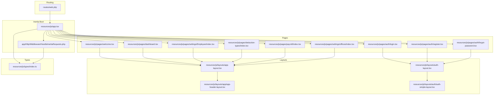
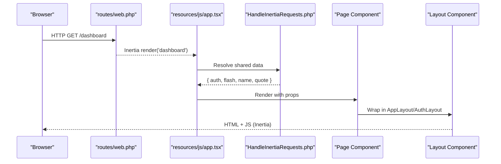
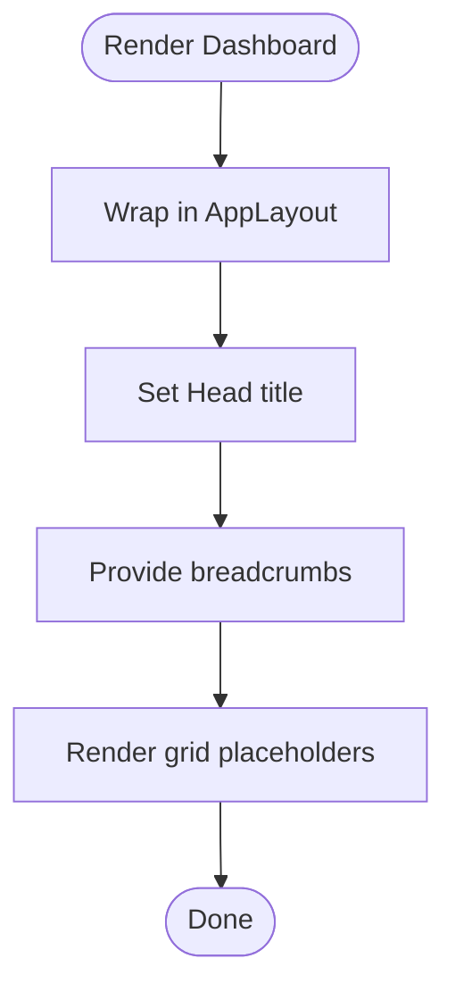
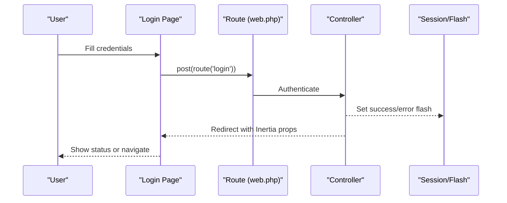
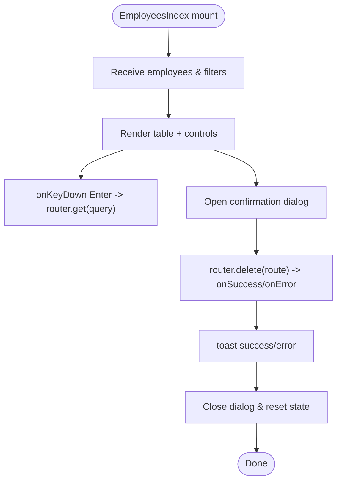
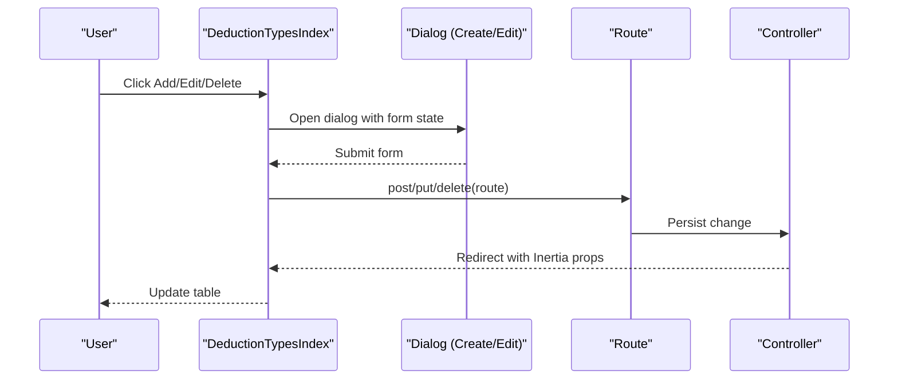
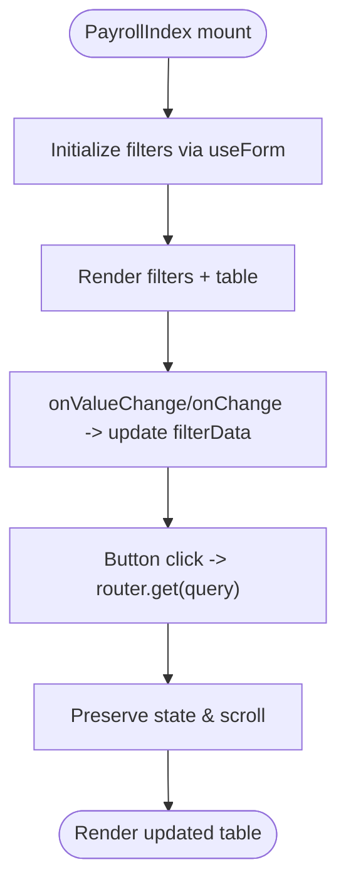
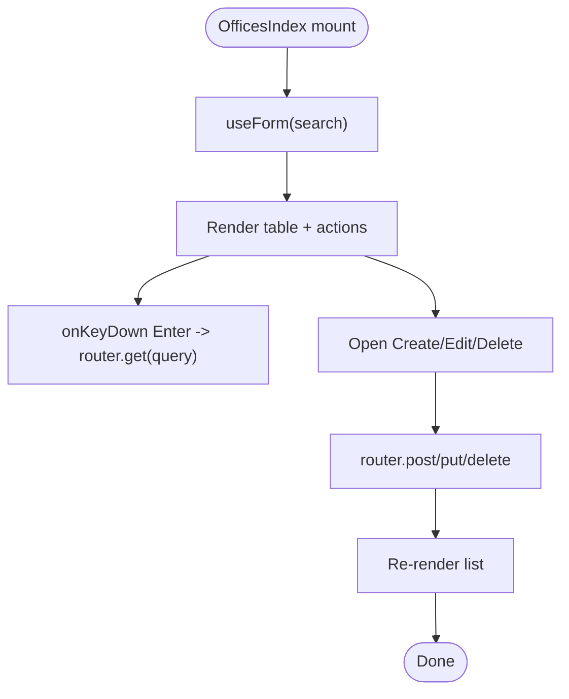
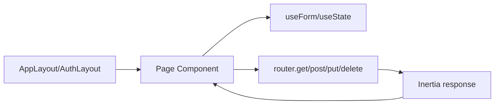
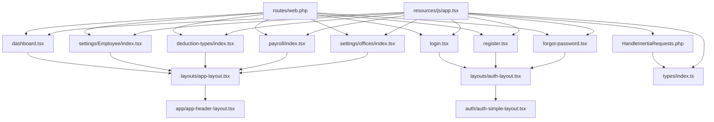

# Page Components

<cite>
**Referenced Files in This Document**
- [app.tsx](file://resources/js/app.tsx)
- [HandleInertiaRequests.php](file://app/Http/Middleware/HandleInertiaRequests.php)
- [web.php](file://routes/web.php)
- [dashboard.tsx](file://resources/js/pages/dashboard.tsx)
- [welcome.tsx](file://resources/js/pages/welcome.tsx)
- [login.tsx](file://resources/js/pages/auth/login.tsx)
- [register.tsx](file://resources/js/pages/auth/register.tsx)
- [forgot-password.tsx](file://resources/js/pages/auth/forgot-password.tsx)
- [app-layout.tsx](file://resources/js/layouts/app-layout.tsx)
- [auth-layout.tsx](file://resources/js/layouts/auth-layout.tsx)
- [app-header-layout.tsx](file://resources/js/layouts/app/app-header-layout.tsx)
- [auth-simple-layout.tsx](file://resources/js/layouts/auth/auth-simple-layout.tsx)
- [EmployeesIndex.tsx](file://resources/js/pages/settings/Employee/index.tsx)
- [DeductionTypesIndex.tsx](file://resources/js/pages/deduction-types/index.tsx)
- [PayrollIndex.tsx](file://resources/js/pages/payroll/index.tsx)
- [OfficesIndex.tsx](file://resources/js/pages/settings/offices/index.tsx)
- [index.ts](file://resources/js/types/index.ts)
</cite>

## Table of Contents
1. [Introduction](#introduction)
2. [Project Structure](#project-structure)
3. [Core Components](#core-components)
4. [Architecture Overview](#architecture-overview)
5. [Detailed Component Analysis](#detailed-component-analysis)
6. [Dependency Analysis](#dependency-analysis)
7. [Performance Considerations](#performance-considerations)
8. [Troubleshooting Guide](#troubleshooting-guide)
9. [Conclusion](#conclusion)
10. [Appendices](#appendices)

## Introduction
This document explains the page-level components and application views used in the frontend. It covers the main application pages (dashboard, authentication, settings, and feature-specific pages), page composition patterns, data fetching strategies, state management at the page level, integration with layout systems, navigation, routing, error handling, loading states, performance optimization, and SEO considerations.

## Project Structure
The frontend uses Inertia.js with React to render pages server-side via Blade while maintaining client-side interactivity. Pages live under resources/js/pages, layouts under resources/js/layouts, and shared types under resources/js/types. Routing is configured in routes/web.php, and Inertia shared data is prepared in app/Http/Middleware/HandleInertiaRequests.php.

**Diagram sources**
- [app.tsx:15-26](file://resources/js/app.tsx#L15-L26)
- [HandleInertiaRequests.php:37-52](file://app/Http/Middleware/HandleInertiaRequests.php#L37-L52)
- [web.php:16-99](file://routes/web.php#L16-L99)
- [app-header-layout.tsx:11-18](file://resources/js/layouts/app/app-header-layout.tsx#L11-L18)
- [auth-simple-layout.tsx:11-34](file://resources/js/layouts/auth/auth-simple-layout.tsx#L11-L34)
- [index.ts:32-48](file://resources/js/types/index.ts#L32-L48)

**Section sources**
- [app.tsx:15-26](file://resources/js/app.tsx#L15-L26)
- [HandleInertiaRequests.php:37-52](file://app/Http/Middleware/HandleInertiaRequests.php#L37-L52)
- [web.php:16-99](file://routes/web.php#L16-L99)

## Core Components
- Page composition: Pages wrap content in layout components. App pages use AppLayout which delegates to AppHeaderLayout; auth pages use AuthLayout which delegates to AuthSimpleLayout.
- Data fetching: Pages receive initial props from the backend via Inertia. Filtering and navigation use Inertia router methods to preserve state and scroll.
- State management: Pages use local state for UI interactions (dialogs, forms) and Inertia form helpers for submission. Flash messages and auth context are provided globally via middleware.
- Layout integration: Layouts encapsulate shell, header, and content areas. AppLayout adds a global toast sink.
- Navigation: Links use the route helper to build URLs for named routes defined in web.php.
- SEO: Pages set Head metadata (titles and links) via @inertiajs/react Head.

**Section sources**
- [app-layout.tsx:11-16](file://resources/js/layouts/app-layout.tsx#L11-L16)
- [auth-layout.tsx:3-9](file://resources/js/layouts/auth-layout.tsx#L3-L9)
- [app-header-layout.tsx:11-18](file://resources/js/layouts/app/app-header-layout.tsx#L11-L18)
- [auth-simple-layout.tsx:11-34](file://resources/js/layouts/auth/auth-simple-layout.tsx#L11-L34)
- [login.tsx:26-37](file://resources/js/pages/auth/login.tsx#L26-L37)
- [register.tsx:21-33](file://resources/js/pages/auth/register.tsx#L21-L33)
- [forgot-password.tsx:14-22](file://resources/js/pages/auth/forgot-password.tsx#L14-L22)
- [EmployeesIndex.tsx:42-78](file://resources/js/pages/settings/Employee/index.tsx#L42-L78)
- [DeductionTypesIndex.tsx:32-87](file://resources/js/pages/deduction-types/index.tsx#L32-L87)
- [PayrollIndex.tsx:50-68](file://resources/js/pages/payroll/index.tsx#L50-L68)
- [OfficesIndex.tsx:38-67](file://resources/js/pages/settings/offices/index.tsx#L38-L67)
- [HandleInertiaRequests.php:45-51](file://app/Http/Middleware/HandleInertiaRequests.php#L45-L51)

## Architecture Overview
The runtime flow connects routing to page rendering and layout composition. The Inertia bootstrapper resolves page components, applies progress indicators, and renders into the root element. Middleware shares global data to all pages.

**Diagram sources**
- [web.php:20-23](file://routes/web.php#L20-L23)
- [app.tsx:15-26](file://resources/js/app.tsx#L15-L26)
- [HandleInertiaRequests.php:37-52](file://app/Http/Middleware/HandleInertiaRequests.php#L37-L52)
- [app-layout.tsx:11-16](file://resources/js/layouts/app-layout.tsx#L11-L16)
- [auth-layout.tsx:3-9](file://resources/js/layouts/auth-layout.tsx#L3-L9)

## Detailed Component Analysis

### Dashboard Page
- Composition: Uses AppLayout with breadcrumbs and Head for metadata.
- Content: Placeholder grid for cards and a large content area.
- Patterns: Minimal logic; relies on layout for shell and header.

**Diagram sources**
- [dashboard.tsx:14-36](file://resources/js/pages/dashboard.tsx#L14-L36)
- [app-layout.tsx:11-16](file://resources/js/layouts/app-layout.tsx#L11-L16)

**Section sources**
- [dashboard.tsx:7-12](file://resources/js/pages/dashboard.tsx#L7-L12)
- [dashboard.tsx:14-36](file://resources/js/pages/dashboard.tsx#L14-L36)

### Authentication Pages
- Login: Form with email, password, remember; submits via Inertia post; supports reset link and status feedback.
- Register: Multi-field form with validation; submits via Inertia post; redirects to login.
- Forgot Password: Email-only form; sends reset link.

**Diagram sources**
- [login.tsx:26-37](file://resources/js/pages/auth/login.tsx#L26-L37)
- [web.php:96-99](file://routes/web.php#L96-L99)

**Section sources**
- [login.tsx:25-105](file://resources/js/pages/auth/login.tsx#L25-L105)
- [register.tsx:20-120](file://resources/js/pages/auth/register.tsx#L20-L120)
- [forgot-password.tsx:13-63](file://resources/js/pages/auth/forgot-password.tsx#L13-L63)
- [auth-layout.tsx:3-9](file://resources/js/layouts/auth-layout.tsx#L3-L9)
- [auth-simple-layout.tsx:11-34](file://resources/js/layouts/auth/auth-simple-layout.tsx#L11-L34)

### Settings: Employees Index
- Composition: AppLayout with breadcrumbs and Head.
- Data: Receives paginated employees and filters.
- Interactions: Search via Enter key; delete with confirmation dialog; view details via modal.
- State: Local state for dialogs, selected employee, and delete lifecycle.

**Diagram sources**
- [EmployeesIndex.tsx:41-78](file://resources/js/pages/settings/Employee/index.tsx#L41-L78)
- [EmployeesIndex.tsx:80-90](file://resources/js/pages/settings/Employee/index.tsx#L80-L90)

**Section sources**
- [EmployeesIndex.tsx:29-34](file://resources/js/pages/settings/Employee/index.tsx#L29-L34)
- [EmployeesIndex.tsx:41-78](file://resources/js/pages/settings/Employee/index.tsx#L41-L78)
- [EmployeesIndex.tsx:80-90](file://resources/js/pages/settings/Employee/index.tsx#L80-L90)

### Deduction Types Index
- Composition: AppLayout with breadcrumbs and Head.
- Data: Receives deduction types list.
- Interactions: Create/Edit/Delete via dialogs; form state managed via useForm; updates via post/put/delete.

**Diagram sources**
- [DeductionTypesIndex.tsx:27-87](file://resources/js/pages/deduction-types/index.tsx#L27-L87)
- [DeductionTypesIndex.tsx:159-253](file://resources/js/pages/deduction-types/index.tsx#L159-L253)

**Section sources**
- [DeductionTypesIndex.tsx:27-87](file://resources/js/pages/deduction-types/index.tsx#L27-L87)
- [DeductionTypesIndex.tsx:159-253](file://resources/js/pages/deduction-types/index.tsx#L159-L253)

### Payroll Index
- Composition: AppLayout with breadcrumbs and Head.
- Filters: Month/year/office/search; applied via router.get with preserveState/preserveScroll.
- Presentation: Currency formatting; eligibility badges; action buttons.

**Diagram sources**
- [PayrollIndex.tsx:49-68](file://resources/js/pages/payroll/index.tsx#L49-L68)
- [PayrollIndex.tsx:70-79](file://resources/js/pages/payroll/index.tsx#L70-L79)

**Section sources**
- [PayrollIndex.tsx:16-21](file://resources/js/pages/payroll/index.tsx#L16-L21)
- [PayrollIndex.tsx:49-68](file://resources/js/pages/payroll/index.tsx#L49-L68)
- [PayrollIndex.tsx:70-79](file://resources/js/pages/payroll/index.tsx#L70-L79)

### Settings: Offices Index
- Composition: AppLayout with breadcrumbs and Head.
- Features: Create/Edit/Delete dialogs; search via Enter key; pagination.

**Diagram sources**
- [OfficesIndex.tsx:37-67](file://resources/js/pages/settings/offices/index.tsx#L37-L67)
- [OfficesIndex.tsx:168-189](file://resources/js/pages/settings/offices/index.tsx#L168-L189)

**Section sources**
- [OfficesIndex.tsx:37-67](file://resources/js/pages/settings/offices/index.tsx#L37-L67)
- [OfficesIndex.tsx:168-189](file://resources/js/pages/settings/offices/index.tsx#L168-L189)

### Conceptual Overview
- Page composition patterns:
  - App pages: AppLayout → AppHeaderLayout → Page content.
  - Auth pages: AuthLayout → AuthSimpleLayout → Form content.
- Data fetching strategies:
  - Initial props via Inertia render.
  - Subsequent filtering/navigation via router.get with preserveState/preserveScroll.
  - Mutations via router.post/put/delete with onSuccess/onError callbacks.
- State management:
  - useForm for controlled forms.
  - useState for UI-only state (dialogs, selections).
  - Global auth and flash via middleware.

[No sources needed since this diagram shows conceptual workflow, not actual code structure]

[No sources needed since this section doesn't analyze specific files]

## Dependency Analysis
- Routing depends on named routes in web.php.
- Pages depend on layout components and UI primitives.
- Inertia bootstrapper depends on middleware for shared data.
- Types define shared interfaces for props and navigation.

**Diagram sources**
- [web.php:20-99](file://routes/web.php#L20-L99)
- [app.tsx:15-26](file://resources/js/app.tsx#L15-L26)
- [HandleInertiaRequests.php:37-52](file://app/Http/Middleware/HandleInertiaRequests.php#L37-L52)
- [app-layout.tsx:11-16](file://resources/js/layouts/app-layout.tsx#L11-L16)
- [auth-layout.tsx:3-9](file://resources/js/layouts/auth-layout.tsx#L3-L9)
- [index.ts:32-48](file://resources/js/types/index.ts#L32-L48)

**Section sources**
- [web.php:20-99](file://routes/web.php#L20-L99)
- [app.tsx:15-26](file://resources/js/app.tsx#L15-L26)
- [HandleInertiaRequests.php:37-52](file://app/Http/Middleware/HandleInertiaRequests.php#L37-L52)
- [index.ts:32-48](file://resources/js/types/index.ts#L32-L48)

## Performance Considerations
- Preserve state and scroll during navigation to avoid re-fetching data and losing viewport position.
- Use controlled inputs with useForm to minimize unnecessary re-renders.
- Debounce or throttle heavy filters if needed; currently Enter-key submission is used.
- Keep layout wrappers lightweight; avoid deep nesting of heavy components inside AppLayout.
- Use Head to set canonical and meta tags where appropriate for SEO.

[No sources needed since this section provides general guidance]

## Troubleshooting Guide
- Authentication failures: Check route names and controller actions in web.php; verify form submission and redirect behavior.
- Missing props: Ensure middleware shares required data (auth, flash, name) and that pages consume them safely.
- Navigation issues: Confirm route names match those defined in web.php; verify router.get usage with preserveState/preserveScroll.
- UI state not updating: Verify onSuccess/onError handlers and that state resets after successful mutations.

**Section sources**
- [web.php:96-99](file://routes/web.php#L96-L99)
- [HandleInertiaRequests.php:45-51](file://app/Http/Middleware/HandleInertiaRequests.php#L45-L51)
- [login.tsx:34-36](file://resources/js/pages/auth/login.tsx#L34-L36)
- [EmployeesIndex.tsx:65-77](file://resources/js/pages/settings/Employee/index.tsx#L65-L77)

## Conclusion
The application’s pages follow consistent composition patterns: each page selects an appropriate layout, receives shared props via middleware, and manages state locally or via Inertia helpers. Routing is centralized in web.php with named routes enabling predictable navigation. SEO is handled per-page via Head metadata, and performance is aided by preserving state and scroll during navigation.

## Appendices
- SEO and metadata: Use Head to set page titles and meta tags in each page component.
- Global data: auth, flash, name, and quote are shared via middleware and typed in index.ts.

**Section sources**
- [welcome.tsx:9-12](file://resources/js/pages/welcome.tsx#L9-L12)
- [index.ts:32-48](file://resources/js/types/index.ts#L32-L48)