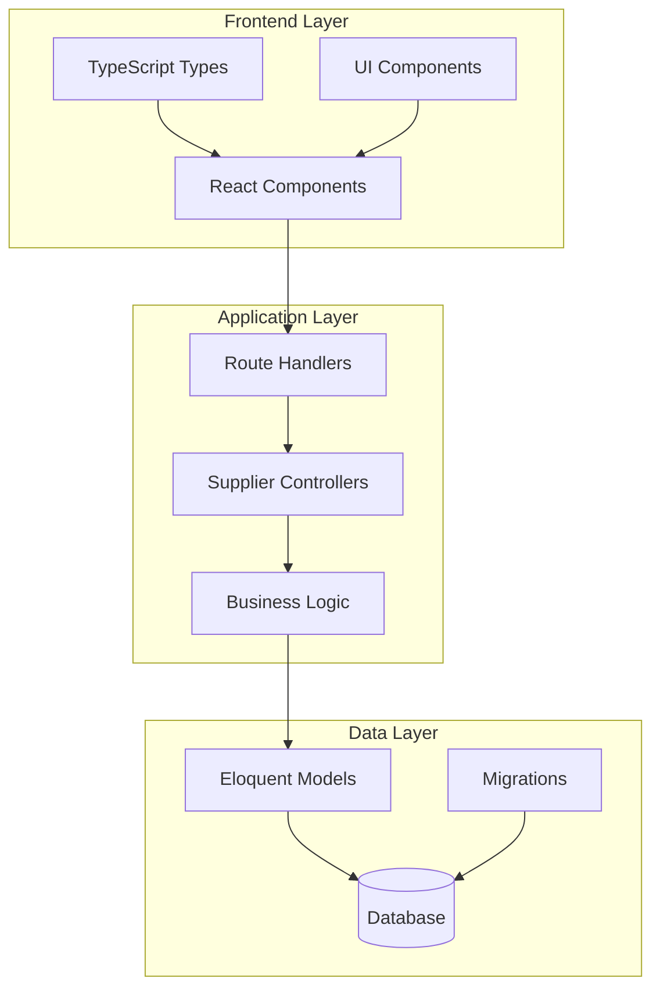
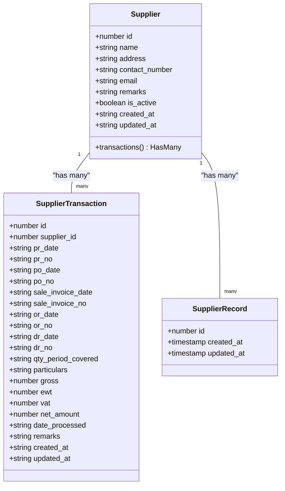

# Supplier Interface Definition

<cite>
**Referenced Files in This Document**
- [Supplier.php](file://app/Models/Supplier.php)
- [SupplierController.php](file://app/Http/Controllers/SupplierController.php)
- [SupplierTransactionController.php](file://app/Http/Controllers/SupplierTransactionController.php)
- [SupplierRecordController.php](file://app/Http/Controllers/SupplierRecordController.php)
- [supplier.ts](file://resources/js/types/supplier.ts)
- [2026_03_23_071621_create_suppliers_table.php](file://database/migrations/2026_03_23_071621_create_suppliers_table.php)
- [2026_03_23_080214_create_supplier_transactions_table.php](file://database/migrations/2026_03_23_080214_create_supplier_transactions_table.php)
- [web.php](file://routes/web.php)
</cite>

## Table of Contents
1. [Introduction](#introduction)
2. [System Architecture](#system-architecture)
3. [Core Components](#core-components)
4. [Data Model Definition](#data-model-definition)
5. [API Interface Specification](#api-interface-specification)
6. [Frontend Type Definitions](#frontend-type-definitions)
7. [Database Schema](#database-schema)
8. [Controller Implementation](#controller-implementation)
9. [Routing Configuration](#routing-configuration)
10. [Integration Patterns](#integration-patterns)
11. [Performance Considerations](#performance-considerations)
12. [Conclusion](#conclusion)

## Introduction

The Supplier Interface Definition encompasses the complete system for managing supplier information and their financial transactions within the payroll management application. This interface provides a comprehensive solution for tracking vendor relationships, purchase orders, and payment processing through an integrated Laravel backend with React frontend architecture.

The supplier management system is designed with a clear separation of concerns, implementing RESTful APIs for CRUD operations, robust validation mechanisms, and seamless integration between backend controllers and frontend components. The system supports both individual supplier records and detailed transaction histories, enabling comprehensive vendor relationship management.

## System Architecture

The supplier interface follows a modern MVC (Model-View-Controller) architecture pattern with clear boundaries between data persistence, business logic, and presentation layers.

**Diagram sources**
- [SupplierController.php:1-72](file://app/Http/Controllers/SupplierController.php#L1-L72)
- [SupplierTransactionController.php:1-103](file://app/Http/Controllers/SupplierTransactionController.php#L1-L103)
- [Supplier.php:1-28](file://app/Models/Supplier.php#L1-L28)

## Core Components

The supplier interface consists of several interconnected components working together to provide comprehensive vendor management capabilities:

### Primary Entities

**Supplier Entity**: Represents individual vendors with contact information and status tracking
**SupplierTransaction Entity**: Records financial transactions between suppliers and the organization
**SupplierRecord Entity**: Provides historical tracking and audit capabilities

### Supporting Components

**Validation Layer**: Ensures data integrity through comprehensive form validation
**Controller Layer**: Manages HTTP requests and coordinates business logic
**Type System**: Defines TypeScript interfaces for frontend-backend communication
**Database Migrations**: Establishes schema structure and relationships

**Section sources**
- [Supplier.php:8-27](file://app/Models/Supplier.php#L8-L27)
- [supplier.ts:1-37](file://resources/js/types/supplier.ts#L1-L37)

## Data Model Definition

The supplier data model establishes the foundation for vendor relationship management through carefully designed attributes and relationships.

**Diagram sources**
- [Supplier.php:8-27](file://app/Models/Supplier.php#L8-L27)
- [supplier.ts:13-36](file://resources/js/types/supplier.ts#L13-L36)

**Section sources**
- [Supplier.php:10-26](file://app/Models/Supplier.php#L10-L26)
- [supplier.ts:13-36](file://resources/js/types/supplier.ts#L13-L36)

## API Interface Specification

The supplier API provides comprehensive CRUD operations with standardized request/response formats and validation rules.

### Supplier Management Endpoints

| Method | Endpoint | Description | Request Body | Response |
|--------|----------|-------------|--------------|----------|
| GET | `/suppliers` | List all suppliers | None | Array of suppliers |
| POST | `/suppliers` | Create new supplier | Supplier data | Created supplier |
| PUT | `/suppliers/{supplier}` | Update supplier | Supplier data | Updated supplier |
| DELETE | `/suppliers/{supplier}` | Delete supplier | None | Deletion confirmation |

### Transaction Management Endpoints

| Method | Endpoint | Description | Request Body | Response |
|--------|----------|-------------|--------------|----------|
| GET | `/suppliers/{supplier}/transactions` | View supplier transactions | None | Paginated transactions |
| POST | `/suppliers/{supplier}/transactions` | Add transaction | Transaction data | Created transaction |
| PUT | `/suppliers/{supplier}/transactions/{transaction}` | Update transaction | Transaction data | Updated transaction |
| DELETE | `/suppliers/{supplier}/transactions/{transaction}` | Remove transaction | None | Deletion confirmation |

**Section sources**
- [web.php:31-43](file://routes/web.php#L31-L43)
- [SupplierController.php:15-71](file://app/Http/Controllers/SupplierController.php#L15-L71)
- [SupplierTransactionController.php:16-102](file://app/Http/Controllers/SupplierTransactionController.php#L16-L102)

## Frontend Type Definitions

The TypeScript type definitions ensure type safety between frontend components and backend APIs, providing comprehensive interface specifications.

### Supplier Interface

The Supplier interface defines the complete structure for supplier data representation:

- **Basic Information**: ID, name, address, contact details, email
- **Status Management**: Active/inactive status with boolean casting
- **Metadata**: Creation and modification timestamps
- **Relationships**: Transaction associations

### SupplierTransaction Interface

The SupplierTransaction interface encompasses comprehensive financial transaction data:

- **Document Tracking**: PR numbers, PO numbers, invoice numbers, OR numbers, DR numbers
- **Date Management**: Multiple date fields for procurement process tracking
- **Financial Data**: Gross amounts, EWT, VAT calculations, net amounts
- **Processing Information**: Date processed, quantity period covered
- **Audit Trail**: Complete metadata for transaction tracking

**Section sources**
- [supplier.ts:1-11](file://resources/js/types/supplier.ts#L1-L11)
- [supplier.ts:13-37](file://resources/js/types/supplier.ts#L13-L37)

## Database Schema

The database schema establishes the foundation for supplier and transaction data persistence with appropriate constraints and relationships.

### Suppliers Table Structure

| Column | Type | Constraints | Description |
|--------|------|-------------|-------------|
| id | bigint unsigned | Primary Key, Auto Increment | Unique identifier |
| name | varchar(255) | Required | Supplier company name |
| address | text | Nullable | Physical address |
| contact_number | varchar(255) | Nullable | Contact phone number |
| email | varchar(255) | Nullable | Email address |
| remarks | text | Nullable | Additional notes |
| is_active | tinyint | Default: 1 | Status indicator |
| created_at | timestamp | Nullable | Record creation time |
| updated_at | timestamp | Nullable | Last modification time |

### Supplier Transactions Table Structure

| Column | Type | Constraints | Description |
|--------|------|-------------|-------------|
| id | bigint unsigned | Primary Key, Auto Increment | Unique identifier |
| supplier_id | bigint unsigned | Foreign Key, Required | Parent supplier relationship |
| pr_date | date | Required | Purchase request date |
| pr_no | varchar(255) | Required | Purchase request number |
| po_date | date | Nullable | Purchase order date |
| po_no | varchar(255) | Nullable | Purchase order number |
| sale_invoice_date | date | Nullable | Sales invoice date |
| sale_invoice_no | varchar(255) | Nullable | Sales invoice number |
| or_date | date | Nullable | Official receipt date |
| or_no | varchar(255) | Nullable | Official receipt number |
| dr_date | date | Nullable | Delivery receipt date |
| dr_no | varchar(255) | Nullable | Delivery receipt number |
| qty_period_covered | varchar(255) | Nullable | Quantity period |
| particulars | text | Nullable | Transaction details |
| gross | decimal(15,2) | Default: 0 | Gross amount |
| ewt | decimal(15,2) | Default: 0, Nullable | Withholding tax |
| vat | decimal(15,2) | Default: 0, Nullable | Value-added tax |
| net_amount | decimal(15,2) | Default: 0 | Net payable amount |
| date_processed | date | Nullable | Processing completion date |
| remarks | text | Nullable | Additional remarks |
| created_at | timestamp | Nullable | Record creation time |
| updated_at | timestamp | Nullable | Last modification time |

**Section sources**
- [2026_03_23_071621_create_suppliers_table.php:14-23](file://database/migrations/2026_03_23_071621_create_suppliers_table.php#L14-L23)
- [2026_03_23_080214_create_supplier_transactions_table.php:14-36](file://database/migrations/2026_03_23_080214_create_supplier_transactions_table.php#L14-L36)

## Controller Implementation

The controller layer implements the business logic for supplier and transaction management with comprehensive validation and error handling.

### SupplierController Responsibilities

The SupplierController handles all supplier-related operations:

- **Index Operation**: Retrieves all suppliers ordered alphabetically by name
- **Store Operation**: Validates and creates new supplier records
- **Update Operation**: Processes supplier modifications with validation
- **Destroy Operation**: Removes supplier records with proper cleanup

### SupplierTransactionController Responsibilities

The SupplierTransactionController manages transaction lifecycle:

- **Show Operation**: Displays supplier transactions with pagination support
- **Store Operation**: Creates new transaction records linked to suppliers
- **Update Operation**: Modifies existing transaction details
- **Destroy Operation**: Removes transaction records with cascade effects

**Section sources**
- [SupplierController.php:15-71](file://app/Http/Controllers/SupplierController.php#L15-L71)
- [SupplierTransactionController.php:16-102](file://app/Http/Controllers/SupplierTransactionController.php#L16-L102)

## Routing Configuration

The routing configuration establishes the URL structure and HTTP method mappings for supplier management operations.

### Route Groups and Prefixes

The supplier routes are organized within a dedicated group with logical prefixes:

- **Base Route**: `/suppliers` - Root endpoint for supplier operations
- **Nested Route**: `{supplier}/transactions` - Transaction-specific operations
- **HTTP Methods**: Standard RESTful mappings for CRUD operations

### Route Parameters and Bindings

The routing system automatically handles model binding for supplier and transaction entities, eliminating manual lookup logic in controllers.

**Section sources**
- [web.php:31-43](file://routes/web.php#L31-L43)

## Integration Patterns

The supplier interface demonstrates several integration patterns that ensure loose coupling and maintainable code architecture.

### Model-Controller Integration

The controllers depend on Eloquent models for data access, following the active record pattern while maintaining separation of concerns.

### Frontend-Backend Integration

TypeScript interfaces provide compile-time type checking between frontend components and backend APIs, reducing runtime errors and improving development experience.

### Validation Integration

Form validation occurs at multiple layers - frontend validation for user experience and backend validation for data integrity.

**Section sources**
- [SupplierController.php:29-36](file://app/Http/Controllers/SupplierController.php#L29-L36)
- [SupplierTransactionController.php:33-52](file://app/Http/Controllers/SupplierTransactionController.php#L33-L52)

## Performance Considerations

Several performance optimizations are implemented throughout the supplier interface:

### Database Optimization

- **Indexing Strategy**: Primary keys automatically indexed, foreign key relationships optimized
- **Pagination**: Transaction listings use pagination to limit result sets
- **Query Optimization**: Efficient joins and selective column retrieval

### Memory Management

- **Lazy Loading**: Eager loading prevents N+1 query problems
- **Resource Cleanup**: Proper disposal of database connections and file handles

### Caching Opportunities

- **Query Caching**: Frequently accessed supplier lists could benefit from caching
- **Browser Caching**: Static assets and API responses could leverage browser caching

## Conclusion

The Supplier Interface Definition represents a comprehensive solution for vendor relationship management within the payroll system. The architecture demonstrates strong separation of concerns, robust validation mechanisms, and clear data modeling principles.

Key strengths of the implementation include:

- **Modular Design**: Clear separation between models, controllers, and views
- **Type Safety**: Comprehensive TypeScript integration ensures runtime reliability
- **RESTful API**: Standardized endpoints following HTTP conventions
- **Data Integrity**: Comprehensive validation and database constraints
- **Scalability**: Well-structured relationships support future growth

The interface provides a solid foundation for supplier management while maintaining flexibility for future enhancements and extensions.