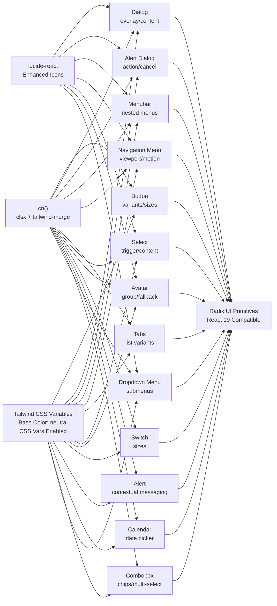
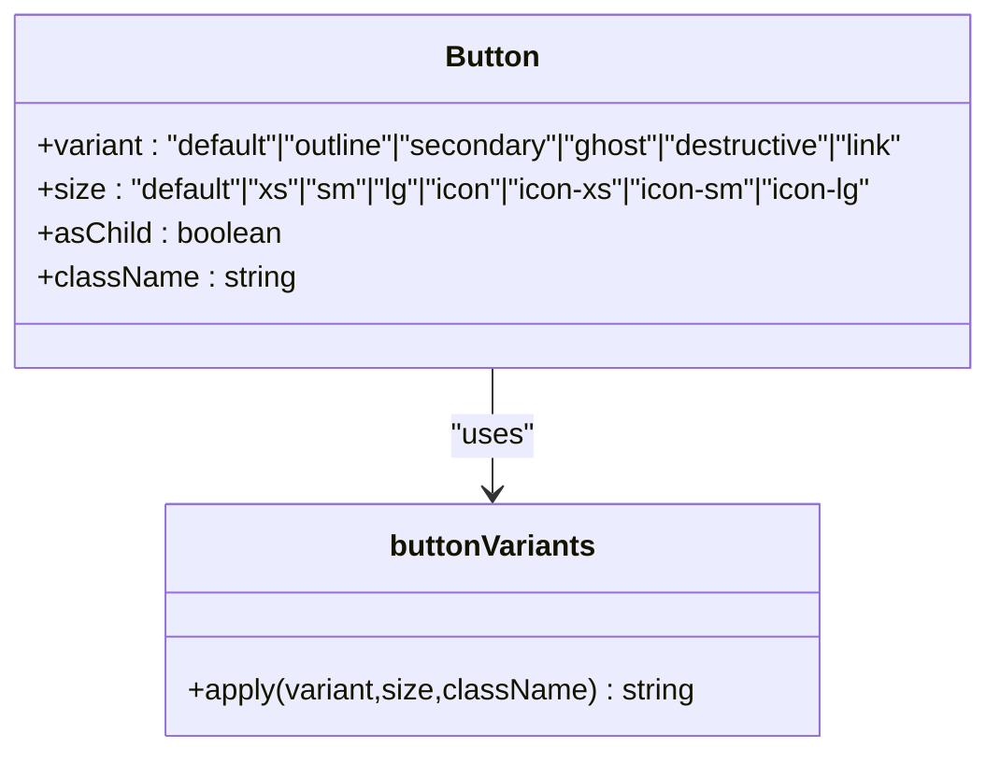
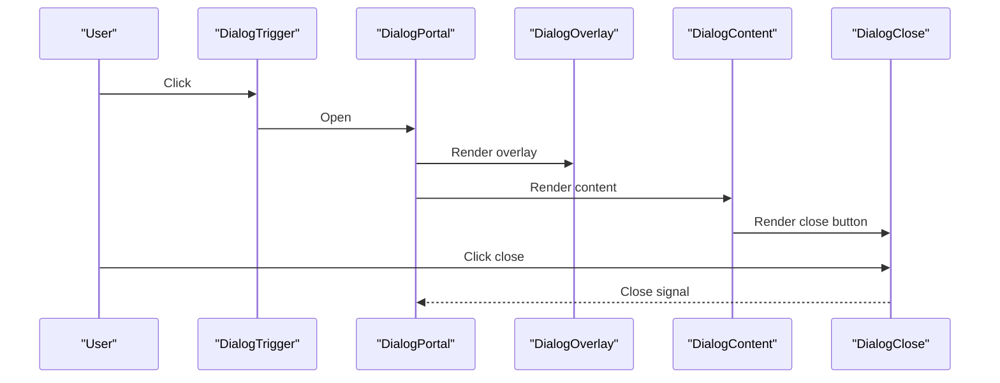
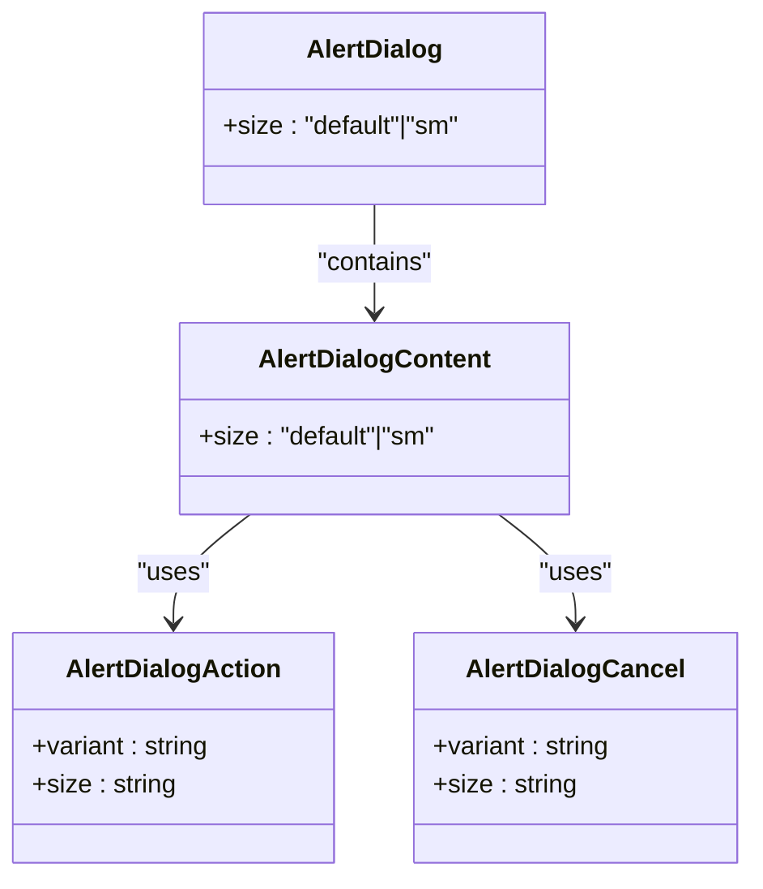
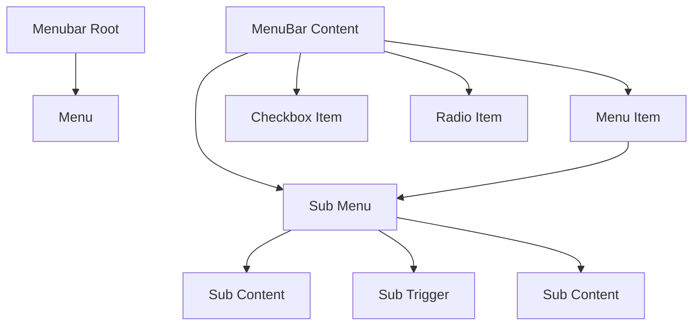
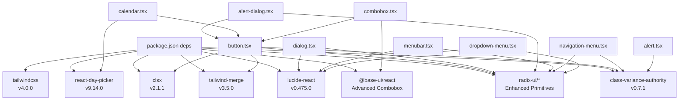

# UI Component Library

<cite>
**Referenced Files in This Document**
- [package.json](file://package.json)
- [components.json](file://components.json)
- [utils.ts](file://resources/js/lib/utils.ts)
- [button.tsx](file://resources/js/components/ui/button.tsx)
- [input.tsx](file://resources/js/components/ui/input.tsx)
- [dialog.tsx](file://resources/js/components/ui/dialog.tsx)
- [alert-dialog.tsx](file://resources/js/components/ui/alert-dialog.tsx)
- [menubar.tsx](file://resources/js/components/ui/menubar.tsx)
- [navigation-menu.tsx](file://resources/js/components/ui/navigation-menu.tsx)
- [card.tsx](file://resources/js/components/ui/card.tsx)
- [badge.tsx](file://resources/js/components/ui/badge.tsx)
- [avatar.tsx](file://resources/js/components/ui/avatar.tsx)
- [checkbox.tsx](file://resources/js/components/ui/checkbox.tsx)
- [select.tsx](file://resources/js/components/ui/select.tsx)
- [table.tsx](file://resources/js/components/ui/table.tsx)
- [tabs.tsx](file://resources/js/components/ui/tabs.tsx)
- [textarea.tsx](file://resources/js/components/ui/textarea.tsx)
- [switch.tsx](file://resources/js/components/ui/switch.tsx)
- [alert.tsx](file://resources/js/components/ui/alert.tsx)
- [calendar.tsx](file://resources/js/components/ui/calendar.tsx)
- [combobox.tsx](file://resources/js/components/ui/combobox.tsx)
- [dropdown-menu.tsx](file://resources/js/components/ui/dropdown-menu.tsx)
</cite>

## Update Summary
**Changes Made**
- Added comprehensive documentation for the new Menubar component with its complete slot system
- Updated Dialog and Alert Dialog components with enhanced styling and size variants
- Documented Navigation Menu component with improved motion and responsive behavior
- Added Calendar component with advanced date picker integration
- Documented Combobox component with chips and multi-selection support
- Enhanced Dropdown Menu component with improved accessibility and styling
- Updated core Button component with refined variant and size system
- Added Alert component for contextual messaging
- Modernized component architecture with React 19 compatibility

## Table of Contents
1. [Introduction](#introduction)
2. [Project Structure](#project-structure)
3. [Core Components](#core-components)
4. [Architecture Overview](#architecture-overview)
5. [Detailed Component Analysis](#detailed-component-analysis)
6. [Dependency Analysis](#dependency-analysis)
7. [Performance Considerations](#performance-considerations)
8. [Troubleshooting Guide](#troubleshooting-guide)
9. [Conclusion](#conclusion)
10. [Appendices](#appendices)

## Introduction
This document describes the React UI component library used in the project, representing a comprehensive modernization that includes React 19 migration, shadcn/ui library upgrade to 4.1.0, and extensive styling improvements. The library now features a complete suite of accessible components built with Radix UI primitives, class-variance-authority for variant systems, and Tailwind CSS v4 with CSS variables for theming.

## Project Structure
The UI components live under resources/js/components/ui and are built with:
- Radix UI primitives for accessible base behaviors
- class-variance-authority for variant and size systems
- Tailwind CSS v4 with CSS variables for theming
- lucide-react for icons
- radix-ui slots for flexible composition
- React 19 compatibility with modern hooks and patterns

```mermaid
graph TB
subgraph "UI Library"
BTN["button.tsx"]
INP["input.tsx"]
DLG["dialog.tsx"]
ADLG["alert-dialog.tsx"]
MBAR["menubar.tsx"]
NVMENU["navigation-menu.tsx"]
CARD["card.tsx"]
BADGE["badge.tsx"]
AVA["avatar.tsx"]
CHK["checkbox.tsx"]
SEL["select.tsx"]
TABS["tabs.tsx"]
TBL["table.tsx"]
TXT["textarea.tsx"]
SW["switch.tsx"]
ALERT["alert.tsx"]
CAL["calendar.tsx"]
COMBO["combobox.tsx"]
DROP["dropdown-menu.tsx"]
end
UTILS["utils.ts"]
PKG["package.json"]
CFG["components.json"]
PKG --> BTN
PKG --> DLG
PKG --> ADLG
PKG --> MBAR
PKG --> NVMENU
PKG --> CARD
PKG --> CAL
PKG --> COMBO
PKG --> DROP
CFG --> BTN
CFG --> DLG
CFG --> ADLG
CFG --> MBAR
CFG --> NVMENU
CFG --> CARD
CFG --> CAL
CFG --> COMBO
CFG --> DROP
UTILS --> BTN
UTILS --> DLG
UTILS --> ADLG
UTILS --> MBAR
UTILS --> NVMENU
UTILS --> CARD
UTILS --> CAL
UTILS --> COMBO
UTILS --> DROP
```

**Diagram sources**
- [button.tsx:1-68](file://resources/js/components/ui/button.tsx#L1-L68)
- [dialog.tsx:1-169](file://resources/js/components/ui/dialog.tsx#L1-L169)
- [alert-dialog.tsx:1-200](file://resources/js/components/ui/alert-dialog.tsx#L1-L200)
- [menubar.tsx:1-279](file://resources/js/components/ui/menubar.tsx#L1-L279)
- [navigation-menu.tsx:1-165](file://resources/js/components/ui/navigation-menu.tsx#L1-L165)
- [calendar.tsx:1-221](file://resources/js/components/ui/calendar.tsx#L1-L221)
- [combobox.tsx:1-300](file://resources/js/components/ui/combobox.tsx#L1-L300)
- [dropdown-menu.tsx:1-268](file://resources/js/components/ui/dropdown-menu.tsx#L1-L268)
- [alert.tsx:1-77](file://resources/js/components/ui/alert.tsx#L1-L77)
- [utils.ts:1-7](file://resources/js/lib/utils.ts#L1-L7)
- [package.json:23-66](file://package.json#L23-L66)
- [components.json:1-26](file://components.json#L1-L26)

**Section sources**
- [components.json:1-26](file://components.json#L1-L26)
- [package.json:23-66](file://package.json#L23-L66)
- [utils.ts:1-7](file://resources/js/lib/utils.ts#L1-L7)

## Core Components
This section summarizes the component families and their primary capabilities, reflecting the comprehensive modernization.

- **Buttons**: Variants (default, outline, secondary, ghost, destructive, link) and sizes (default, xs, sm, lg, icon, icon-xs, icon-sm, icon-lg). Uses class-variance-authority and slot-based rendering via radix-ui Slot.
- **Inputs and Textareas**: Base form controls with focus states, invalid states, and responsive typography.
- **Dialog**: Full-screen overlay with header, footer, close button, and animated transitions. Enhanced with improved styling and size variants.
- **Alert Dialog**: Confirmation dialog with action and cancel buttons, integrated with the Button component system.
- **Menubar**: Complete menu system with nested submenus, checkboxes, radio items, and keyboard navigation.
- **Navigation Menu**: Advanced navigation with viewport support, motion effects, and responsive behavior.
- **Cards**: Composite container with optional sizes and action area support.
- **Badges**: Lightweight indicators with variants similar to buttons.
- **Avatars**: User image with fallback, badges, and group/count helpers.
- **Checkbox**: Accessible primitive with indicator and icons.
- **Select**: Composite control with trigger, content, items, separators, and scroll buttons.
- **Tabs**: Horizontal or vertical tabs with list variants (default, line).
- **Table**: Scrollable wrapper plus semantic table parts.
- **Switch**: Toggle with size variants.
- **Alert**: Contextual messaging with default and destructive variants.
- **Calendar**: Advanced date picker with range selection and custom styling.
- **Combobox**: Enhanced dropdown with chips, multi-selection, and clear functionality.
- **Dropdown Menu**: Comprehensive menu system with submenus and keyboard navigation.

**Section sources**
- [button.tsx:1-68](file://resources/js/components/ui/button.tsx#L1-L68)
- [input.tsx:1-20](file://resources/js/components/ui/input.tsx#L1-L20)
- [dialog.tsx:1-169](file://resources/js/components/ui/dialog.tsx#L1-L169)
- [alert-dialog.tsx:1-200](file://resources/js/components/ui/alert-dialog.tsx#L1-L200)
- [menubar.tsx:1-279](file://resources/js/components/ui/menubar.tsx#L1-L279)
- [navigation-menu.tsx:1-165](file://resources/js/components/ui/navigation-menu.tsx#L1-L165)
- [card.tsx:1-104](file://resources/js/components/ui/card.tsx#L1-L104)
- [badge.tsx:1-50](file://resources/js/components/ui/badge.tsx#L1-L50)
- [avatar.tsx:1-111](file://resources/js/components/ui/avatar.tsx#L1-L111)
- [checkbox.tsx:1-34](file://resources/js/components/ui/checkbox.tsx#L1-L34)
- [select.tsx:1-193](file://resources/js/components/ui/select.tsx#L1-L193)
- [tabs.tsx:1-89](file://resources/js/components/ui/tabs.tsx#L1-L89)
- [table.tsx:1-115](file://resources/js/components/ui/table.tsx#L1-L115)
- [textarea.tsx:1-19](file://resources/js/components/ui/textarea.tsx#L1-L19)
- [switch.tsx:1-32](file://resources/js/components/ui/switch.tsx#L1-L32)
- [alert.tsx:1-77](file://resources/js/components/ui/alert.tsx#L1-L77)
- [calendar.tsx:1-221](file://resources/js/components/ui/calendar.tsx#L1-L221)
- [combobox.tsx:1-300](file://resources/js/components/ui/combobox.tsx#L1-L300)
- [dropdown-menu.tsx:1-268](file://resources/js/components/ui/dropdown-menu.tsx#L1-L268)

## Architecture Overview
The component library follows a modernized layered pattern with React 19 compatibility:
- **Utilities**: Shared cn() function merges clsx and tailwind-merge for deterministic class merging.
- **Variants**: class-variance-authority defines variant and size scales per component.
- **Composition**: radix-ui Slot enables asChild patterns for semantic and accessible markup.
- **Theming**: Tailwind CSS variables and color tokens from the configured base palette.
- **Icons**: lucide-react provides consistent iconography.
- **Enhanced Accessibility**: Improved ARIA attributes and keyboard navigation support.
- **Modern Hooks**: React 19 compatible patterns with optimized performance.

**Diagram sources**
- [utils.ts:1-7](file://resources/js/lib/utils.ts#L1-L7)
- [button.tsx:1-68](file://resources/js/components/ui/button.tsx#L1-L68)
- [dialog.tsx:1-169](file://resources/js/components/ui/dialog.tsx#L1-L169)
- [alert-dialog.tsx:1-200](file://resources/js/components/ui/alert-dialog.tsx#L1-L200)
- [menubar.tsx:1-279](file://resources/js/components/ui/menubar.tsx#L1-L279)
- [navigation-menu.tsx:1-165](file://resources/js/components/ui/navigation-menu.tsx#L1-L165)
- [alert.tsx:1-77](file://resources/js/components/ui/alert.tsx#L1-L77)
- [calendar.tsx:1-221](file://resources/js/components/ui/calendar.tsx#L1-L221)
- [combobox.tsx:1-300](file://resources/js/components/ui/combobox.tsx#L1-L300)
- [dropdown-menu.tsx:1-268](file://resources/js/components/ui/dropdown-menu.tsx#L1-L268)
- [components.json:6-12](file://components.json#L6-L12)

## Detailed Component Analysis

### Button
- **Purpose**: Primary action element with strong affordance and enhanced variant system.
- **Variants**: default, outline, secondary, ghost, destructive, link with improved styling.
- **Sizes**: default, xs, sm, lg, icon, icon-xs, icon-sm, icon-lg with refined dimensions.
- **Props**:
  - variant: selects variant class set
  - size: selects size class set
  - asChild: renders using radix-ui Slot for composition
  - className: additional classes merged via cn()
  - Inherits all button HTML attributes
- **Accessibility**: Enhanced focus-visible styles, disabled states, aria-invalid integration.
- **Composition**: Uses data-slot, data-variant, data-size for test selectors and styling hooks.

**Diagram sources**
- [button.tsx:7-42](file://resources/js/components/ui/button.tsx#L7-L42)

**Section sources**
- [button.tsx:1-68](file://resources/js/components/ui/button.tsx#L1-L68)

### Dialog
- **Purpose**: Modal overlay with enhanced styling, header, content, footer, and close button.
- **Enhancements**: Improved animation system, better responsive behavior, and enhanced close button integration.
- **Slots**:
  - Root, Trigger, Portal, Overlay, Content, Header, Footer, Title, Description, Close
- **Props**:
  - showCloseButton: toggles presence of close button
  - Content and Footer accept showCloseButton to render a close action
  - Enhanced styling with improved backdrop blur and animations
- **Accessibility**: Uses radix-ui Dialog primitives; includes sr-only label for close button.

**Diagram sources**
- [dialog.tsx:10-86](file://resources/js/components/ui/dialog.tsx#L10-L86)

**Section sources**
- [dialog.tsx:1-169](file://resources/js/components/ui/dialog.tsx#L1-L169)

### Alert Dialog
- **Purpose**: Confirmation dialog with integrated Button component system for actions.
- **Enhancements**: New size variants (default, sm), improved layout system, and enhanced responsive behavior.
- **Slots**:
  - Root, Trigger, Portal, Overlay, Content, Header, Footer, Title, Description, Action, Cancel
- **Props**:
  - size: default or sm for responsive sizing
  - Action and Cancel accept variant and size props from Button component
  - Enhanced styling with improved spacing and typography
- **Integration**: Uses Button component for consistent styling across actions.

**Diagram sources**
- [alert-dialog.tsx:47-184](file://resources/js/components/ui/alert-dialog.tsx#L47-L184)

**Section sources**
- [alert-dialog.tsx:1-200](file://resources/js/components/ui/alert-dialog.tsx#L1-L200)

### Menubar
- **Purpose**: Complete menu system with nested submenus, keyboard navigation, and enhanced accessibility.
- **Complete Slot System**: Root, Menu, Group, Portal, RadioGroup, Trigger, Content, Item, CheckboxItem, RadioItem, Label, Separator, Shortcut, Sub, SubTrigger, SubContent.
- **Features**:
  - Nested submenu support with proper positioning
  - Checkbox and radio item variants
  - Keyboard navigation and ARIA support
  - Enhanced styling with improved focus states
  - Variant system for destructive items
- **Props**:
  - Content accepts align, alignOffset, and sideOffset for positioning
  - Items support inset and variant props
  - Submenus have proper transform origins and animations

**Diagram sources**
- [menubar.tsx:7-279](file://resources/js/components/ui/menubar.tsx#L7-L279)

**Section sources**
- [menubar.tsx:1-279](file://resources/js/components/ui/menubar.tsx#L1-L279)

### Navigation Menu
- **Purpose**: Advanced navigation component with viewport support, motion effects, and responsive behavior.
- **Enhancements**: Improved motion system with slide-in animations, viewport positioning, and enhanced trigger styling.
- **Features**:
  - Viewport support with automatic height/width calculation
  - Motion effects (slide-in, fade-in, zoom-in) with configurable easing
  - Enhanced trigger styling with rotation indicators
  - Improved indicator component for active states
- **Props**:
  - viewport: enable/disable viewport support
  - Enhanced styling with group-data-* selectors for complex states
  - Motion variants (from-start, from-end, to-start, to-end)

**Section sources**
- [navigation-menu.tsx:1-165](file://resources/js/components/ui/navigation-menu.tsx#L1-L165)

### Calendar
- **Purpose**: Advanced date picker with range selection, custom styling, and enhanced accessibility.
- **Features**:
  - Range selection support with visual indicators
  - Custom button styling integration with Button component system
  - Locale-specific formatting and RTL support
  - Enhanced focus management and keyboard navigation
  - Custom component rendering for chevrons and day buttons
- **Props**:
  - buttonVariant: integrate with Button component variant system
  - showOutsideDays: control visibility of adjacent month days
  - captionLayout: label or dropdown layout options
  - Customizable formatters and components

**Section sources**
- [calendar.tsx:1-221](file://resources/js/components/ui/calendar.tsx#L1-L221)

### Combobox
- **Purpose**: Enhanced dropdown component with chips, multi-selection, and clear functionality.
- **Features**:
  - Chip-based multi-selection with remove functionality
  - Clear button for resetting selections
  - Enhanced input integration with InputGroup system
  - Custom positioning with anchor support
  - Empty state handling and scrollable lists
- **Props**:
  - showTrigger: control visibility of trigger button
  - showClear: control visibility of clear button
  - anchor: positioning anchor for popup
  - Chips support with remove functionality

**Section sources**
- [combobox.tsx:1-300](file://resources/js/components/ui/combobox.tsx#L1-L300)

### Dropdown Menu
- **Purpose**: Comprehensive menu system with submenus, keyboard navigation, and enhanced styling.
- **Enhancements**: Improved accessibility, better positioning system, and enhanced variant support.
- **Features**:
  - Submenu support with proper positioning and animations
  - Checkbox and radio item variants
  - Keyboard navigation and ARIA support
  - Enhanced styling with improved focus states
  - Variant system for destructive items
- **Props**:
  - Content accepts align and sideOffset for positioning
  - Items support inset and variant props
  - Submenus have proper transform origins and animations

**Section sources**
- [dropdown-menu.tsx:1-268](file://resources/js/components/ui/dropdown-menu.tsx#L1-L268)

### Alert
- **Purpose**: Contextual messaging component for displaying important information.
- **Variants**: default, destructive with appropriate styling and color schemes.
- **Features**:
  - Grid-based layout with optional action button area
  - SVG icon support with proper sizing
  - Enhanced typography with balance and pretty text utilities
  - Accessible role attribute for screen readers
- **Props**:
  - variant: selects styling scheme
  - Action area for optional action buttons

**Section sources**
- [alert.tsx:1-77](file://resources/js/components/ui/alert.tsx#L1-L77)

### Additional Components
The library includes all previously documented components with enhanced styling and improved accessibility:
- **Input**: Single-line text input with consistent focus and invalid states.
- **Card**: Container for grouped content with optional smaller size.
- **Badge**: Lightweight status or tag indicator with expanded variants.
- **Avatar**: User identity with image, fallback, badge, and group utilities.
- **Checkbox**: Binary selection with accessible indicator.
- **Select**: Dropdown selection with groups, items, labels, and scroll buttons.
- **Tabs**: Organize content into selectable sections with enhanced styling.
- **Table**: Scrollable table container with semantic parts.
- **Textarea**: Multi-line text input with consistent focus and invalid states.
- **Switch**: Toggle control with size variants.

**Section sources**
- [input.tsx:1-20](file://resources/js/components/ui/input.tsx#L1-L20)
- [card.tsx:1-104](file://resources/js/components/ui/card.tsx#L1-L104)
- [badge.tsx:1-50](file://resources/js/components/ui/badge.tsx#L1-L50)
- [avatar.tsx:1-111](file://resources/js/components/ui/avatar.tsx#L1-L111)
- [checkbox.tsx:1-34](file://resources/js/components/ui/checkbox.tsx#L1-L34)
- [select.tsx:1-193](file://resources/js/components/ui/select.tsx#L1-L193)
- [tabs.tsx:1-89](file://resources/js/components/ui/tabs.tsx#L1-L89)
- [table.tsx:1-115](file://resources/js/components/ui/table.tsx#L1-L115)
- [textarea.tsx:1-19](file://resources/js/components/ui/textarea.tsx#L1-L19)
- [switch.tsx:1-32](file://resources/js/components/ui/switch.tsx#L1-L32)

## Dependency Analysis
Key runtime dependencies and their roles in the modernized library:
- **class-variance-authority**: Defines variant and size scales for components with Button, Badge, Tabs, Alert.
- **radix-ui**: Provides accessible primitives and slots for Button, Dialog, Select, Tabs, Checkbox, Switch, Avatar, Menubar, Navigation Menu, Dropdown Menu.
- **lucide-react**: Icons used in Dialog close button, Select icons, Avatar badge, Menubar triggers, and Navigation Menu indicators.
- **tailwind-merge and clsx**: Deterministic class merging via cn() for improved performance.
- **Tailwind CSS v4**: Utility-first styling with CSS variables for theming and enhanced customization.
- **@base-ui/react**: Provides advanced combobox functionality with chips and multi-selection.
- **react-day-picker**: Advanced date picker integration with custom styling and range selection.

**Diagram sources**
- [package.json:23-66](file://package.json#L23-L66)
- [button.tsx:1-68](file://resources/js/components/ui/button.tsx#L1-L68)
- [dialog.tsx:1-169](file://resources/js/components/ui/dialog.tsx#L1-L169)
- [alert-dialog.tsx:1-200](file://resources/js/components/ui/alert-dialog.tsx#L1-L200)
- [menubar.tsx:1-279](file://resources/js/components/ui/menubar.tsx#L1-L279)
- [navigation-menu.tsx:1-165](file://resources/js/components/ui/navigation-menu.tsx#L1-L165)
- [calendar.tsx:1-221](file://resources/js/components/ui/calendar.tsx#L1-L221)
- [combobox.tsx:1-300](file://resources/js/components/ui/combobox.tsx#L1-L300)
- [dropdown-menu.tsx:1-268](file://resources/js/components/ui/dropdown-menu.tsx#L1-L268)
- [alert.tsx:1-77](file://resources/js/components/ui/alert.tsx#L1-L77)

**Section sources**
- [package.json:23-66](file://package.json#L23-L66)

## Performance Considerations
- **Enhanced Class Merging**: Use cn() to avoid redundant classes and ensure deterministic order with improved performance.
- **Optimized Animations**: Leverage radix-ui's built-in animate-in/out classes with Tailwind CSS v4 for smooth transitions.
- **Component Architecture**: Prefer variant and size props over ad-hoc className overrides to keep the class set predictable.
- **Virtualization**: Keep Select viewport items virtualized if lists are large; apply similar patterns to Combobox and Dropdown Menu.
- **Theme Optimization**: Use responsive units and CSS variables to minimize reflows during theme switches with CSS variables enabled.
- **React 19 Compatibility**: Take advantage of React 19's performance improvements with modern hooks and patterns.

## Troubleshooting Guide
- **Variant or size not applying**:
  - Ensure variant and size values match the defined scales in the component's variant definition.
  - Verify data-slot attributes are present for styling hooks.
  - Check for CSS variable conflicts in Tailwind CSS v4 configuration.
- **Focus or keyboard navigation issues**:
  - Confirm radix-ui primitives are used and not bypassed unintentionally.
  - Check that asChild is used correctly when composing with other components.
  - Verify proper ARIA attributes are maintained for enhanced accessibility.
- **Theme inconsistencies**:
  - Verify Tailwind CSS variables are enabled and base color is set as configured.
  - Ensure cn() merges classes consistently to avoid conflicting utilities.
  - Check for proper CSS variable fallbacks in components.
- **Icon sizing mismatches**:
  - Use explicit size classes on icons or rely on the component's default icon sizing rules.
  - Verify lucide-react version compatibility with component expectations.
- **Menubar and Navigation Menu issues**:
  - Ensure proper portal usage for nested menus and viewports.
  - Check transform-origin calculations for proper positioning.
  - Verify motion effect configurations are compatible with Tailwind CSS v4.

## Conclusion
The UI component library has undergone comprehensive modernization, representing a significant upgrade to React 19, shadcn/ui library version 4.1.0, and extensive styling improvements. The library now features a complete suite of accessible components with enhanced variant systems, improved accessibility, and modern React patterns. The addition of Menubar, enhanced Dialog and Alert Dialog components, advanced Calendar integration, and comprehensive Combobox functionality demonstrates the library's evolution toward a mature, enterprise-ready component system. With Tailwind CSS variables, class-variance-authority, and radix-ui primitives, the library remains maintainable, testable, and extensible while leveraging the latest React ecosystem improvements.

## Appendices

### Design Tokens and Theme Integration
- **Tailwind CSS variables**: Enabled and configured in the project settings with CSS variables support.
- **Base color palette**: Configured as neutral with enhanced color token system.
- **Component integration**: Components consume color tokens (primary, secondary, muted, destructive, ring, foreground, background) through CSS variables.
- **Enhanced theming**: Improved color scheme integration with better dark mode support and accessibility considerations.

**Section sources**
- [components.json:6-12](file://components.json#L6-L12)

### Responsive Behavior
- **Enhanced responsiveness**: Components use responsive typography and spacing utilities with improved breakpoint handling.
- **Navigation Menu**: Adaptive viewport positioning and motion effects based on screen size.
- **Dialog and Alert Dialog**: Responsive sizing with default and sm variants for different screen contexts.
- **Calendar**: Flexible layout with responsive caption and navigation controls.

**Section sources**
- [navigation-menu.tsx:82-118](file://resources/js/components/ui/navigation-menu.tsx#L82-L118)
- [dialog.tsx:50-86](file://resources/js/components/ui/dialog.tsx#L50-L86)
- [alert-dialog.tsx:47-68](file://resources/js/components/ui/alert-dialog.tsx#L47-L68)
- [calendar.tsx:13-36](file://resources/js/components/ui/calendar.tsx#L13-L36)

### Accessibility Features
- **Enhanced focus management**: Focus-visible rings and outlines are applied consistently across interactive components.
- **Improved ARIA support**: Disabled states and aria-invalid states are supported and styled with better accessibility.
- **Keyboard navigation**: Comprehensive keyboard support for Menubar, Navigation Menu, Dropdown Menu, and Combobox components.
- **Screen reader compatibility**: Proper role attributes, aria-labels, and semantic markup throughout the component library.
- **Primitive roots**: radix-ui ensures ARIA attributes and keyboard navigation are handled automatically with enhanced accessibility.

**Section sources**
- [button.tsx:8-42](file://resources/js/components/ui/button.tsx#L8-L42)
- [menubar.tsx:49-63](file://resources/js/components/ui/menubar.tsx#L49-L63)
- [navigation-menu.tsx:65-80](file://resources/js/components/ui/navigation-menu.tsx#L65-L80)
- [dropdown-menu.tsx:21-30](file://resources/js/components/ui/dropdown-menu.tsx#L21-L30)
- [combobox.tsx:22-37](file://resources/js/components/ui/combobox.tsx#L22-L37)

### Testing Approaches and Development Guidelines
- **Enhanced test selectors**: Use data-slot attributes to target elements in tests with improved specificity.
- **Comprehensive variant coverage**: Write tests for each variant and size combination across all components.
- **Composition testing**: Validate asChild behavior and slot-based rendering with enhanced component composition.
- **Accessibility testing**: Use screen readers and keyboard-only navigation checks with improved accessibility validation.
- **Development best practices**:
  - Keep variant definitions in a single place per component with enhanced organization.
  - Prefer radix-ui Slot for composition to preserve semantics and accessibility.
  - Use cn() for all className merging to prevent class conflicts and improve performance.
  - Leverage React 19 patterns for optimal performance and compatibility.
  - Test with both light and dark themes for comprehensive coverage.

**Section sources**
- [button.tsx:54-64](file://resources/js/components/ui/button.tsx#L54-L64)
- [menubar.tsx:261-279](file://resources/js/components/ui/menubar.tsx#L261-L279)
- [navigation-menu.tsx:154-165](file://resources/js/components/ui/navigation-menu.tsx#L154-L165)
- [utils.ts:4-6](file://resources/js/lib/utils.ts#L4-L6)