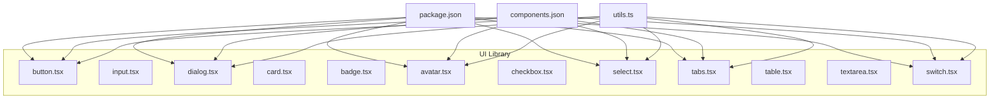
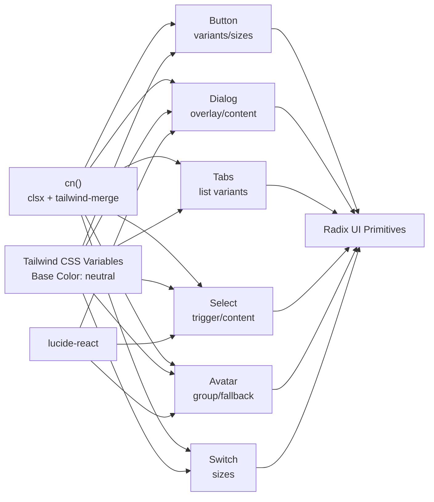
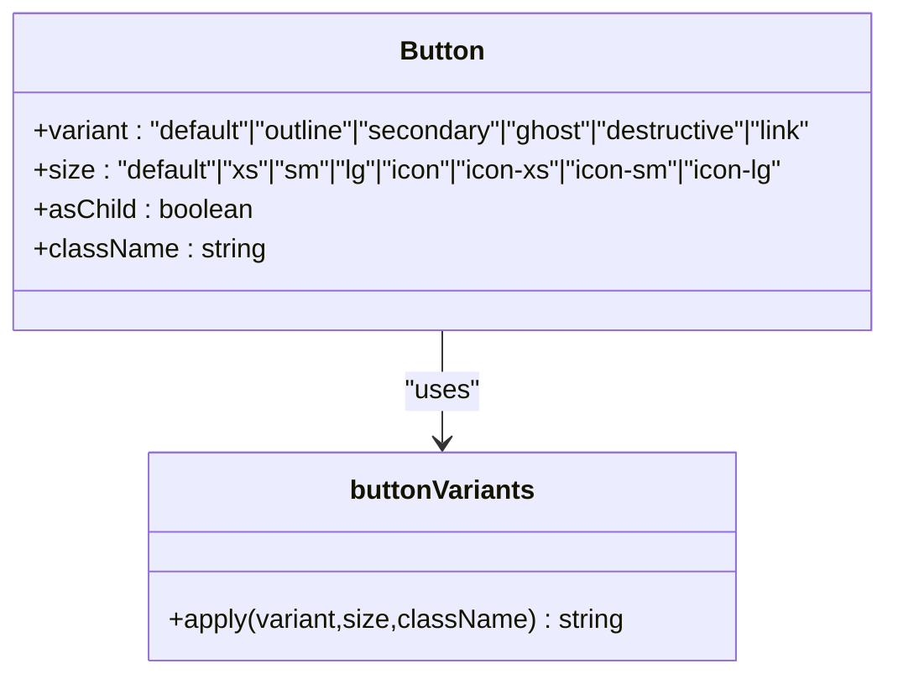
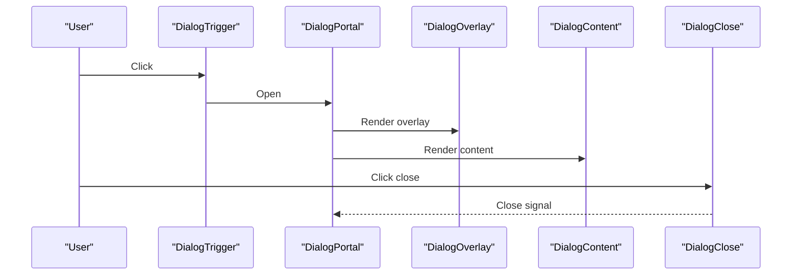
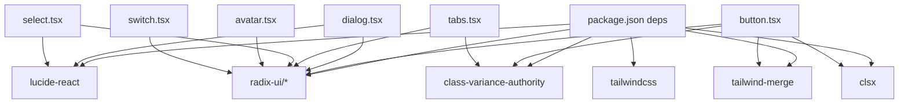

# UI Component Library

<cite>
**Referenced Files in This Document**
- [components.json](file://components.json)
- [package.json](file://package.json)
- [utils.ts](file://resources/js/lib/utils.ts)
- [button.tsx](file://resources/js/components/ui/button.tsx)
- [input.tsx](file://resources/js/components/ui/input.tsx)
- [dialog.tsx](file://resources/js/components/ui/dialog.tsx)
- [card.tsx](file://resources/js/components/ui/card.tsx)
- [badge.tsx](file://resources/js/components/ui/badge.tsx)
- [avatar.tsx](file://resources/js/components/ui/avatar.tsx)
- [checkbox.tsx](file://resources/js/components/ui/checkbox.tsx)
- [select.tsx](file://resources/js/components/ui/select.tsx)
- [table.tsx](file://resources/js/components/ui/table.tsx)
- [tabs.tsx](file://resources/js/components/ui/tabs.tsx)
- [textarea.tsx](file://resources/js/components/ui/textarea.tsx)
- [switch.tsx](file://resources/js/components/ui/switch.tsx)
</cite>

## Table of Contents
1. [Introduction](#introduction)
2. [Project Structure](#project-structure)
3. [Core Components](#core-components)
4. [Architecture Overview](#architecture-overview)
5. [Detailed Component Analysis](#detailed-component-analysis)
6. [Dependency Analysis](#dependency-analysis)
7. [Performance Considerations](#performance-considerations)
8. [Troubleshooting Guide](#troubleshooting-guide)
9. [Conclusion](#conclusion)
10. [Appendices](#appendices)

## Introduction
This document describes the React UI component library used in the project. It explains how components are structured, how variants and sizes are defined using class-variance-authority, and how Tailwind CSS utilities are combined with design tokens for consistent styling. It also covers composition patterns (slots), accessibility attributes, responsive behavior, and recommended testing and development practices.

## Project Structure
The UI components live under resources/js/components/ui and are built with:
- Radix UI primitives for accessible base behaviors
- class-variance-authority for variant and size systems
- Tailwind CSS v4 with CSS variables for theming
- lucide-react for icons
- radix-ui slots for flexible composition

**Diagram sources**
- [button.tsx:1-68](file://resources/js/components/ui/button.tsx#L1-L68)
- [dialog.tsx:1-166](file://resources/js/components/ui/dialog.tsx#L1-L166)
- [tabs.tsx:1-89](file://resources/js/components/ui/tabs.tsx#L1-L89)
- [select.tsx:1-193](file://resources/js/components/ui/select.tsx#L1-L193)
- [avatar.tsx:1-111](file://resources/js/components/ui/avatar.tsx#L1-L111)
- [utils.ts:1-7](file://resources/js/lib/utils.ts#L1-L7)
- [package.json:23-65](file://package.json#L23-L65)
- [components.json:1-26](file://components.json#L1-L26)

**Section sources**
- [components.json:1-26](file://components.json#L1-L26)
- [package.json:23-65](file://package.json#L23-L65)
- [utils.ts:1-7](file://resources/js/lib/utils.ts#L1-L7)

## Core Components
This section summarizes the component families and their primary capabilities.

- Buttons: Variants (default, outline, secondary, ghost, destructive, link) and sizes (default, xs, sm, lg, icon, icon-xs, icon-sm, icon-lg). Uses class-variance-authority and slot-based rendering via radix-ui Slot.
- Inputs and Textareas: Base form controls with focus states, invalid states, and responsive typography.
- Dialog: Full-screen overlay with header, footer, close button, and animated transitions.
- Cards: Composite container with optional sizes and action area support.
- Badges: Lightweight indicators with variants similar to buttons.
- Avatars: User image with fallback, badges, and group/count helpers.
- Checkbox: Accessible primitive with indicator and icons.
- Select: Composite control with trigger, content, items, separators, and scroll buttons.
- Tabs: Horizontal or vertical tabs with list variants (default, line).
- Table: Scrollable wrapper plus semantic table parts.
- Switch: Toggle with size variants.

**Section sources**
- [button.tsx:1-68](file://resources/js/components/ui/button.tsx#L1-L68)
- [input.tsx:1-20](file://resources/js/components/ui/input.tsx#L1-L20)
- [dialog.tsx:1-166](file://resources/js/components/ui/dialog.tsx#L1-L166)
- [card.tsx:1-104](file://resources/js/components/ui/card.tsx#L1-L104)
- [badge.tsx:1-50](file://resources/js/components/ui/badge.tsx#L1-L50)
- [avatar.tsx:1-111](file://resources/js/components/ui/avatar.tsx#L1-L111)
- [checkbox.tsx:1-34](file://resources/js/components/ui/checkbox.tsx#L1-L34)
- [select.tsx:1-193](file://resources/js/components/ui/select.tsx#L1-L193)
- [tabs.tsx:1-89](file://resources/js/components/ui/tabs.tsx#L1-L89)
- [table.tsx:1-115](file://resources/js/components/ui/table.tsx#L1-L115)
- [textarea.tsx:1-19](file://resources/js/components/ui/textarea.tsx#L1-L19)
- [switch.tsx:1-32](file://resources/js/components/ui/switch.tsx#L1-L32)

## Architecture Overview
The component library follows a layered pattern:
- Utilities: Shared cn() function merges clsx and tailwind-merge for deterministic class merging.
- Variants: class-variance-authority defines variant and size scales per component.
- Composition: radix-ui Slot enables asChild patterns for semantic and accessible markup.
- Theming: Tailwind CSS variables and color tokens from the configured base palette.
- Icons: lucide-react provides consistent iconography.

**Diagram sources**
- [utils.ts:1-7](file://resources/js/lib/utils.ts#L1-L7)
- [button.tsx:1-68](file://resources/js/components/ui/button.tsx#L1-L68)
- [dialog.tsx:1-166](file://resources/js/components/ui/dialog.tsx#L1-L166)
- [tabs.tsx:1-89](file://resources/js/components/ui/tabs.tsx#L1-L89)
- [select.tsx:1-193](file://resources/js/components/ui/select.tsx#L1-L193)
- [avatar.tsx:1-111](file://resources/js/components/ui/avatar.tsx#L1-L111)
- [switch.tsx:1-32](file://resources/js/components/ui/switch.tsx#L1-L32)
- [components.json:6-12](file://components.json#L6-L12)

## Detailed Component Analysis

### Button
- Purpose: Primary action element with strong affordance.
- Variants: default, outline, secondary, ghost, destructive, link.
- Sizes: default, xs, sm, lg, icon, icon-xs, icon-sm, icon-lg.
- Props:
  - variant: selects variant class set
  - size: selects size class set
  - asChild: renders using radix-ui Slot for composition
  - className: additional classes merged via cn()
  - Inherits all button HTML attributes
- Accessibility: Focus-visible styles, disabled states, aria-invalid integration.
- Composition: Uses data-slot, data-variant, data-size for test selectors and styling hooks.

**Diagram sources**
- [button.tsx:7-42](file://resources/js/components/ui/button.tsx#L7-L42)

**Section sources**
- [button.tsx:1-68](file://resources/js/components/ui/button.tsx#L1-L68)

### Input
- Purpose: Single-line text input with consistent focus and invalid states.
- Props:
  - type: input type
  - className: additional classes
  - Inherits all input HTML attributes
- Accessibility: Focus-visible ring, disabled states, aria-invalid integration.

**Section sources**
- [input.tsx:1-20](file://resources/js/components/ui/input.tsx#L1-L20)

### Dialog
- Purpose: Modal overlay with header, content, footer, and optional close button.
- Slots:
  - Root, Trigger, Portal, Overlay, Content, Header, Footer, Title, Description, Close
- Props:
  - showCloseButton: toggles presence of close button
  - Content and Footer accept showCloseButton to render a close action
- Accessibility: Uses radix-ui Dialog primitives; includes sr-only label for close button.

**Diagram sources**
- [dialog.tsx:10-86](file://resources/js/components/ui/dialog.tsx#L10-L86)

**Section sources**
- [dialog.tsx:1-166](file://resources/js/components/ui/dialog.tsx#L1-L166)

### Card
- Purpose: Container for grouped content with optional smaller size.
- Props:
  - size: default or sm
- Slots:
  - CardHeader, CardTitle, CardDescription, CardAction, CardContent, CardFooter
- Responsive: Uses data-size and group-data-* selectors for variant styling.

**Section sources**
- [card.tsx:1-104](file://resources/js/components/ui/card.tsx#L1-L104)

### Badge
- Purpose: Small status or tag indicator.
- Variants: default, secondary, destructive, outline, ghost, link.
- Props:
  - variant: selects variant class set
  - asChild: renders using radix-ui Slot
  - className: additional classes

**Section sources**
- [badge.tsx:1-50](file://resources/js/components/ui/badge.tsx#L1-L50)

### Avatar
- Purpose: User identity with image, fallback, badge, and group utilities.
- Props:
  - size: default, sm, lg
- Slots:
  - AvatarImage, AvatarFallback, AvatarBadge, AvatarGroup, AvatarGroupCount
- Composition: Uses data-size and group-data-* for scalable sizing.

**Section sources**
- [avatar.tsx:1-111](file://resources/js/components/ui/avatar.tsx#L1-L111)

### Checkbox
- Purpose: Binary selection with accessible indicator.
- Props: Inherits all Checkbox primitive props
- Accessibility: Focus-visible ring, checked states, disabled states, aria-invalid integration.

**Section sources**
- [checkbox.tsx:1-34](file://resources/js/components/ui/checkbox.tsx#L1-L34)

### Select
- Purpose: Dropdown selection with groups, items, labels, and scroll buttons.
- Props:
  - Trigger: size (sm, default)
  - Content: position (item-aligned, popper), align
  - Item: selectable item with indicator
- Accessibility: Uses radix-ui Select primitives; supports keyboard navigation and focus management.

**Section sources**
- [select.tsx:1-193](file://resources/js/components/ui/select.tsx#L1-L193)

### Tabs
- Purpose: Organize content into selectable sections.
- Variants:
  - List: default, line
- Props:
  - orientation: horizontal or vertical
  - List: variant (default, line)
  - Trigger: active state styling and focus-visible ring
  - Content: focusable panel

**Section sources**
- [tabs.tsx:1-89](file://resources/js/components/ui/tabs.tsx#L1-L89)

### Table
- Purpose: Scrollable table container with semantic parts.
- Slots:
  - Table, TableHeader, TableBody, TableFooter, TableRow, TableHead, TableCell, TableCaption

**Section sources**
- [table.tsx:1-115](file://resources/js/components/ui/table.tsx#L1-L115)

### Textarea
- Purpose: Multi-line text input with consistent focus and invalid states.
- Props: Inherits all textarea HTML attributes

**Section sources**
- [textarea.tsx:1-19](file://resources/js/components/ui/textarea.tsx#L1-L19)

### Switch
- Purpose: Toggle control with size variants.
- Props:
  - size: sm or default

**Section sources**
- [switch.tsx:1-32](file://resources/js/components/ui/switch.tsx#L1-L32)

## Dependency Analysis
Key runtime dependencies and their roles:
- class-variance-authority: Defines variant and size scales for components with Button, Badge, Tabs.
- radix-ui: Provides accessible primitives and slots for Button, Dialog, Select, Tabs, Checkbox, Switch, Avatar.
- lucide-react: Icons used in Dialog close button, Select icons, and Avatar badge.
- tailwind-merge and clsx: Deterministic class merging via cn().
- Tailwind CSS v4: Utility-first styling with CSS variables for theming.

**Diagram sources**
- [package.json:23-65](file://package.json#L23-L65)
- [button.tsx:1-68](file://resources/js/components/ui/button.tsx#L1-L68)
- [dialog.tsx:1-166](file://resources/js/components/ui/dialog.tsx#L1-L166)
- [tabs.tsx:1-89](file://resources/js/components/ui/tabs.tsx#L1-L89)
- [select.tsx:1-193](file://resources/js/components/ui/select.tsx#L1-L193)
- [avatar.tsx:1-111](file://resources/js/components/ui/avatar.tsx#L1-L111)
- [switch.tsx:1-32](file://resources/js/components/ui/switch.tsx#L1-L32)

**Section sources**
- [package.json:23-65](file://package.json#L23-L65)

## Performance Considerations
- Prefer variant and size props over ad-hoc className overrides to keep the class set predictable and merge efficiently.
- Use cn() to avoid redundant classes and ensure deterministic order.
- Limit heavy animations inside overlays and dialogs; leverage radix-ui’s built-in animate-in/out classes.
- Keep Select viewport items virtualized if lists are large.
- Use responsive units and CSS variables to minimize reflows during theme switches.

## Troubleshooting Guide
- Variant or size not applying:
  - Ensure variant and size values match the defined scales in the component’s variant definition.
  - Verify data-slot attributes are present for styling hooks.
- Focus or keyboard navigation issues:
  - Confirm radix-ui primitives are used and not bypassed unintentionally.
  - Check that asChild is used correctly when composing with other components.
- Theming inconsistencies:
  - Verify Tailwind CSS variables are enabled and base color is set as configured.
  - Ensure cn() merges classes consistently to avoid conflicting utilities.
- Icon sizing mismatches:
  - Use explicit size classes on icons or rely on the component’s default icon sizing rules.

## Conclusion
The UI component library leverages modern React patterns and accessible primitives to deliver a cohesive, theme-aware interface. Variants and sizes are centralized via class-variance-authority, while composition and accessibility are handled by radix-ui. With Tailwind CSS variables and a shared cn() utility, the library remains maintainable, testable, and extensible.

## Appendices

### Design Tokens and Theme Integration
- Tailwind CSS variables are enabled and configured in the project settings.
- Base color palette is configured as neutral.
- Components consume color tokens (e.g., primary, secondary, muted, destructive, ring, foreground, background) through CSS variables.

**Section sources**
- [components.json:6-12](file://components.json#L6-L12)

### Responsive Behavior
- Components use responsive typography and spacing utilities.
- Some components adapt layout direction (e.g., Tabs vertical orientation) and adjust padding/margins at small breakpoints.

**Section sources**
- [tabs.tsx:8-23](file://resources/js/components/ui/tabs.tsx#L8-L23)
- [dialog.tsx:106-122](file://resources/js/components/ui/dialog.tsx#L106-L122)

### Accessibility Features
- Focus-visible rings and outlines are applied consistently across interactive components.
- Disabled states and aria-invalid states are supported and styled.
- Primitive roots from radix-ui ensure ARIA attributes and keyboard navigation are handled automatically.

**Section sources**
- [button.tsx:8-42](file://resources/js/components/ui/button.tsx#L8-L42)
- [input.tsx:10-13](file://resources/js/components/ui/input.tsx#L10-L13)
- [checkbox.tsx:16-19](file://resources/js/components/ui/checkbox.tsx#L16-L19)
- [select.tsx:46-50](file://resources/js/components/ui/select.tsx#L46-L50)
- [switch.tsx:17-20](file://resources/js/components/ui/switch.tsx#L17-L20)

### Testing Approaches and Development Guidelines
- Test selectors: Use data-slot attributes to target elements in tests.
- Variant coverage: Write tests for each variant and size combination.
- Composition tests: Validate asChild behavior and slot-based rendering.
- Accessibility tests: Use screen readers and keyboard-only navigation checks.
- Development:
  - Keep variant definitions in a single place per component.
  - Prefer radix-ui Slot for composition to preserve semantics.
  - Use cn() for all className merging to prevent class conflicts.

**Section sources**
- [button.tsx:54-64](file://resources/js/components/ui/button.tsx#L54-L64)
- [dialog.tsx:57-85](file://resources/js/components/ui/dialog.tsx#L57-L85)
- [tabs.tsx:40-53](file://resources/js/components/ui/tabs.tsx#L40-L53)
- [select.tsx:34-58](file://resources/js/components/ui/select.tsx#L34-L58)
- [utils.ts:4-6](file://resources/js/lib/utils.ts#L4-L6)