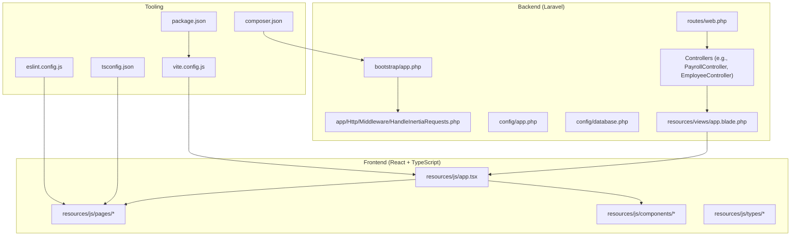
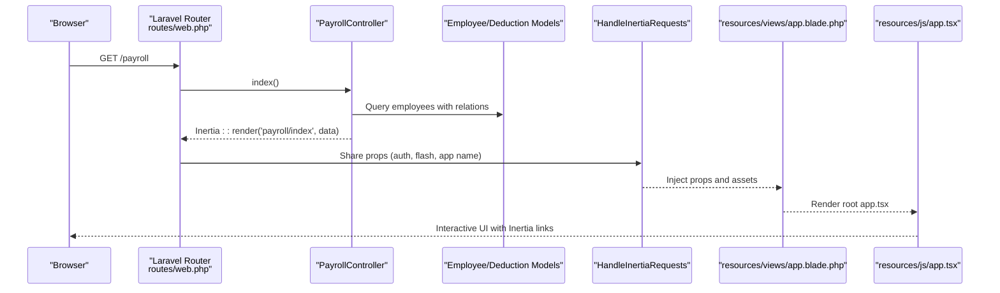
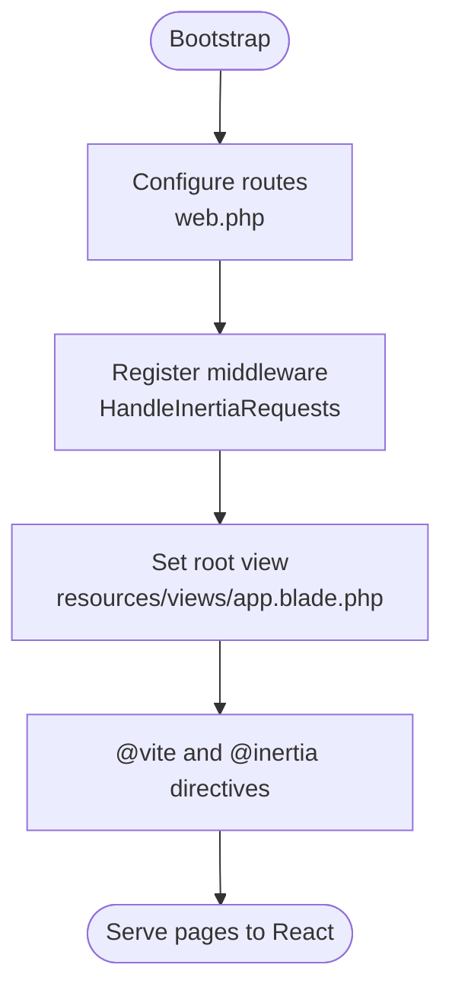
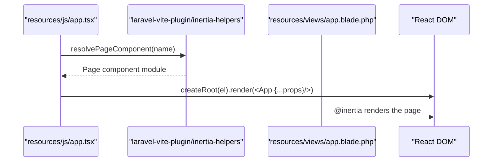
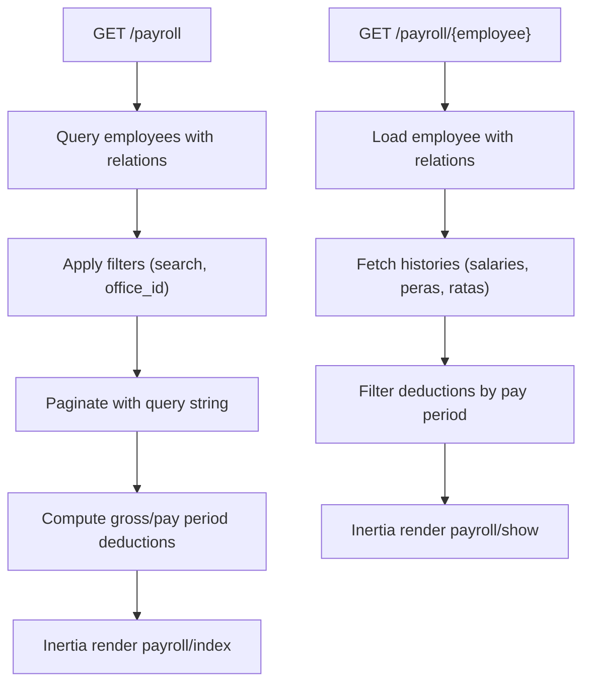
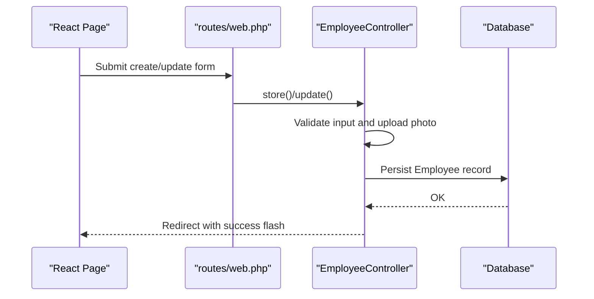
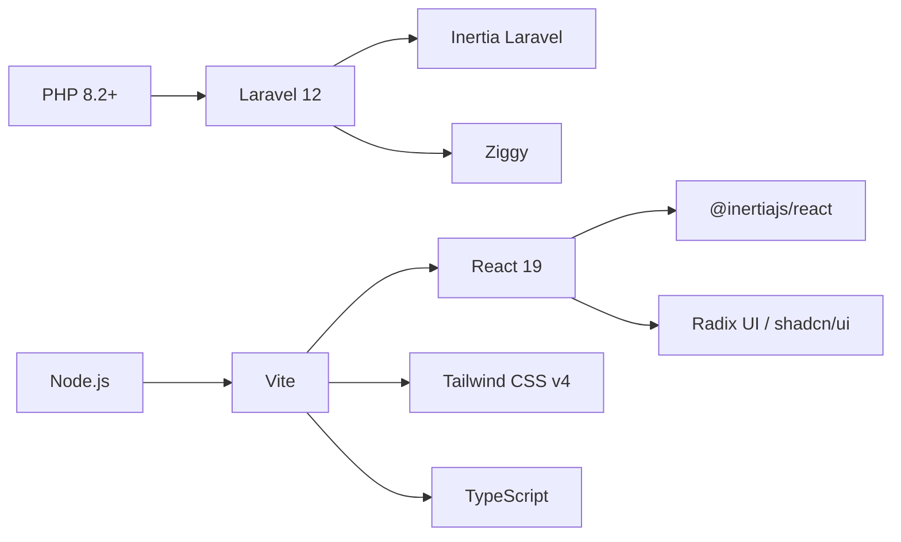

# Getting Started

<cite>
**Referenced Files in This Document**
- [composer.json](file://composer.json)
- [package.json](file://package.json)
- [vite.config.js](file://vite.config.js)
- [config/app.php](file://config/app.php)
- [config/database.php](file://config/database.php)
- [resources/js/app.tsx](file://resources/js/app.tsx)
- [resources/views/app.blade.php](file://resources/views/app.blade.php)
- [bootstrap/app.php](file://bootstrap/app.php)
- [routes/web.php](file://routes/web.php)
- [app/Http/Middleware/HandleInertiaRequests.php](file://app/Http/Middleware/HandleInertiaRequests.php)
- [tsconfig.json](file://tsconfig.json)
- [eslint.config.js](file://eslint.config.js)
- [app/Http/Controllers/PayrollController.php](file://app/Http/Controllers/PayrollController.php)
- [app/Http/Controllers/EmployeeController.php](file://app/Http/Controllers/EmployeeController.php)
- [database/migrations/2026_03_19_022838_create_employees_table.php](file://database/migrations/2026_03_19_022838_create_employees_table.php)
- [database/migrations/2026_03_22_115109_create_peras_table.php](file://database/migrations/2026_03_22_115109_create_peras_table.php)
</cite>

## Table of Contents
1. [Introduction](#introduction)
2. [Project Structure](#project-structure)
3. [Core Components](#core-components)
4. [Architecture Overview](#architecture-overview)
5. [Detailed Component Analysis](#detailed-component-analysis)
6. [Dependency Analysis](#dependency-analysis)
7. [Performance Considerations](#performance-considerations)
8. [Troubleshooting Guide](#troubleshooting-guide)
9. [Conclusion](#conclusion)
10. [Appendices](#appendices)

## Introduction
This guide helps you install, configure, and run the Laravel + React payroll management system. It targets developers new to the stack while providing sufficient technical depth for experienced developers. The application uses Laravel 12, React with TypeScript, Inertia.js for full-stack React integration, and Vite for fast asset builds.

Key capabilities demonstrated by the codebase:
- Payroll listing and per-employee details with filters and computed pay values
- Employee management (CRUD) with photo uploads and status/office associations
- Modular routing under authenticated sections for payroll, salaries, PERA, RATA, and settings

## Project Structure
At a high level, the project is organized into:
- Backend: Laravel application with controllers, models, middleware, routes, and configuration
- Frontend: React with TypeScript pages and shared UI components, integrated via Inertia.js
- Asset pipeline: Vite with Laravel Vite Plugin, Tailwind CSS, and React Fast Refresh
- Database: Migrations and seeders for payroll-related entities

**Diagram sources**
- [routes/web.php:1-99](file://routes/web.php#L1-L99)
- [app/Http/Middleware/HandleInertiaRequests.php:1-55](file://app/Http/Middleware/HandleInertiaRequests.php#L1-L55)
- [bootstrap/app.php:1-24](file://bootstrap/app.php#L1-L24)
- [config/app.php:1-127](file://config/app.php#L1-L127)
- [config/database.php:1-175](file://config/database.php#L1-L175)
- [resources/views/app.blade.php:1-21](file://resources/views/app.blade.php#L1-L21)
- [resources/js/app.tsx:1-30](file://resources/js/app.tsx#L1-L30)
- [vite.config.js:1-21](file://vite.config.js#L1-L21)
- [tsconfig.json:1-119](file://tsconfig.json#L1-L119)
- [eslint.config.js:1-45](file://eslint.config.js#L1-L45)
- [composer.json:1-77](file://composer.json#L1-L77)
- [package.json:1-73](file://package.json#L1-L73)

**Section sources**
- [routes/web.php:1-99](file://routes/web.php#L1-L99)
- [bootstrap/app.php:1-24](file://bootstrap/app.php#L1-L24)
- [resources/views/app.blade.php:1-21](file://resources/views/app.blade.php#L1-L21)
- [resources/js/app.tsx:1-30](file://resources/js/app.tsx#L1-L30)
- [vite.config.js:1-21](file://vite.config.js#L1-L21)
- [tsconfig.json:1-119](file://tsconfig.json#L1-L119)
- [eslint.config.js:1-45](file://eslint.config.js#L1-L45)
- [composer.json:1-77](file://composer.json#L1-L77)
- [package.json:1-73](file://package.json#L1-L73)

## Core Components
- Laravel application bootstrap and middleware pipeline
- Inertia.js integration for server-rendered React pages
- Vite-powered asset pipeline with React and Tailwind
- TypeScript configuration for strictness and modern JSX
- Controllers implementing payroll and employee features
- Database configuration supporting SQLite by default

What you will need installed:
- PHP 8.2+ (as required by the Laravel framework)
- Node.js and npm/yarn/pnpm
- A web server (Apache/Nginx) or use Laravel’s built-in server
- Optional: MySQL/MariaDB/PostgreSQL/SQL Server for production

Initial setup steps:
1. Install PHP dependencies via Composer
2. Install Node.js dependencies via npm
3. Configure environment variables (.env)
4. Run database migrations and seeders
5. Start the development server using the provided script

**Section sources**
- [composer.json:11-26](file://composer.json#L11-L26)
- [package.json:23-66](file://package.json#L23-L66)
- [config/app.php:16](file://config/app.php#L16)
- [config/database.php:19](file://config/database.php#L19)
- [tsconfig.json:14,28,77,86:14-86](file://tsconfig.json#L14-L86)

## Architecture Overview
The system follows a classic Laravel MVC pattern with Inertia.js replacing traditional Blade templates with React pages. The frontend is a single-page React application served by Laravel, with shared data passed through Inertia props.

**Diagram sources**
- [routes/web.php:25-29](file://routes/web.php#L25-L29)
- [app/Http/Controllers/PayrollController.php:13-81](file://app/Http/Controllers/PayrollController.php#L13-L81)
- [app/Http/Middleware/HandleInertiaRequests.php:37-53](file://app/Http/Middleware/HandleInertiaRequests.php#L37-L53)
- [resources/views/app.blade.php:12-19](file://resources/views/app.blade.php#L12-L19)
- [resources/js/app.tsx:15-26](file://resources/js/app.tsx#L15-L26)

## Detailed Component Analysis

### Laravel Bootstrap and Middleware
- The application is bootstrapped with routing, middleware, and exception handling.
- The Inertia middleware sets the root view and shares global data (app name, auth, flash messages).

**Diagram sources**
- [bootstrap/app.php:9-23](file://bootstrap/app.php#L9-L23)
- [app/Http/Middleware/HandleInertiaRequests.php:18](file://app/Http/Middleware/HandleInertiaRequests.php#L18)
- [resources/views/app.blade.php:12-19](file://resources/views/app.blade.php#L12-L19)

**Section sources**
- [bootstrap/app.php:1-24](file://bootstrap/app.php#L1-L24)
- [app/Http/Middleware/HandleInertiaRequests.php:1-55](file://app/Http/Middleware/HandleInertiaRequests.php#L1-L55)
- [resources/views/app.blade.php:1-21](file://resources/views/app.blade.php#L1-L21)

### Inertia.js Integration
- The Inertia app is initialized in the React entrypoint, resolving page components and rendering them under the root view.
- Ziggy is used for client-side routing helpers.

**Diagram sources**
- [resources/js/app.tsx:3-26](file://resources/js/app.tsx#L3-L26)
- [resources/views/app.blade.php:12-19](file://resources/views/app.blade.php#L12-L19)

**Section sources**
- [resources/js/app.tsx:1-30](file://resources/js/app.tsx#L1-L30)
- [resources/views/app.blade.php:1-21](file://resources/views/app.blade.php#L1-L21)

### Payroll Feature (Controller and Routes)
- The payroll index lists employees with computed gross/net pay and filters by month/year/office/search.
- The payroll show page displays per-employee details and histories for salary, PERA, and RATA, plus period-specific deductions.

**Diagram sources**
- [routes/web.php:25-29](file://routes/web.php#L25-L29)
- [app/Http/Controllers/PayrollController.php:13-81](file://app/Http/Controllers/PayrollController.php#L13-L81)
- [app/Http/Controllers/PayrollController.php:83-123](file://app/Http/Controllers/PayrollController.php#L83-L123)

**Section sources**
- [routes/web.php:25-29](file://routes/web.php#L25-L29)
- [app/Http/Controllers/PayrollController.php:1-125](file://app/Http/Controllers/PayrollController.php#L1-L125)

### Employee Management (Controller and Routes)
- The employees index supports search and paginated listing with employment status and office joins.
- Store and update actions validate input, handle image uploads, and persist records.

**Diagram sources**
- [routes/web.php:85-94](file://routes/web.php#L85-L94)
- [app/Http/Controllers/EmployeeController.php:45-80](file://app/Http/Controllers/EmployeeController.php#L45-L80)
- [app/Http/Controllers/EmployeeController.php:94-124](file://app/Http/Controllers/EmployeeController.php#L94-L124)

**Section sources**
- [routes/web.php:85-94](file://routes/web.php#L85-L94)
- [app/Http/Controllers/EmployeeController.php:1-125](file://app/Http/Controllers/EmployeeController.php#L1-L125)

### Database Schema Notes
- Employees table includes personal info, position, image path, and foreign keys to employment statuses and offices.
- PERAs table stores employee-specific amounts with effective dates.

These migrations define the foundational tables for payroll features.

**Section sources**
- [database/migrations/2026_03_19_022838_create_employees_table.php:14-27](file://database/migrations/2026_03_19_022838_create_employees_table.php#L14-L27)
- [database/migrations/2026_03_22_115109_create_peras_table.php:14-21](file://database/migrations/2026_03_22_115109_create_peras_table.php#L14-L21)

## Dependency Analysis
- Backend dependencies: Laravel 12, Inertia for Laravel, Ziggy for routing helpers
- Frontend dependencies: React 19, Inertia for React, Radix UI, shadcn/ui components, Tailwind CSS v4, TypeScript
- Tooling: Vite, ESLint, Prettier, Laravel Vite Plugin

**Diagram sources**
- [composer.json:11-16](file://composer.json#L11-L16)
- [package.json:23-66](file://package.json#L23-L66)

**Section sources**
- [composer.json:1-77](file://composer.json#L1-L77)
- [package.json:1-73](file://package.json#L1-L73)

## Performance Considerations
- Use database indexing on frequently filtered columns (e.g., employment_status_id, office_id) to improve query performance.
- Apply eager loading (already used via with()) to avoid N+1 queries in controllers.
- Keep asset builds optimized; Vite’s dev server is configured for fast refresh; production builds minimize bundle sizes.
- Consider pagination limits and query string preservation for large datasets.

[No sources needed since this section provides general guidance]

## Troubleshooting Guide
Common setup issues and resolutions:
- Missing APP_KEY: Generate an application key during project creation or manually.
- Database connection failures: Ensure DB_CONNECTION matches your setup (SQLite by default) and credentials are correct.
- React build errors: Verify Node.js version compatibility and reinstall dependencies.
- Inertia asset injection: Confirm @viteReactRefresh and @vite directives are present in the root Blade view.
- TypeScript diagnostics: Ensure tsconfig.json is respected and noEmit is configured for type checking only.

Environment configuration highlights:
- Default database is SQLite; migrations will create the database file automatically during setup scripts.
- APP_DEBUG and APP_ENV control error visibility and environment behavior.
- APP_URL defines base URL generation for assets and routes.

**Section sources**
- [composer.json:50-54](file://composer.json#L50-L54)
- [config/database.php:19,34-43](file://config/database.php#L19,L34-L43)
- [config/app.php:42,55](file://config/app.php#L42,L55)
- [resources/views/app.blade.php:12-14](file://resources/views/app.blade.php#L12-L14)
- [tsconfig.json:59,77,86](file://tsconfig.json#L59,L77,L86)

## Conclusion
You now have the essentials to install, configure, and run the Laravel + React payroll management system. Use the provided scripts to start the development server, navigate the payroll and employee features, and extend the application with additional controllers and pages. For production, switch to a supported relational database, configure environment variables, and optimize asset builds.

[No sources needed since this section summarizes without analyzing specific files]

## Appendices

### Step-by-Step Installation
1. Install PHP dependencies
   - Run: composer install
2. Install Node.js dependencies
   - Run: npm install
3. Create and configure .env
   - Copy .env.example to .env and set APP_KEY, DB_CONNECTION, and database credentials
4. Run migrations and seeders
   - Run: php artisan migrate
5. Start development servers
   - Run: composer dev (starts Laravel, queue listener, and Vite dev server concurrently)

**Section sources**
- [composer.json:49-58](file://composer.json#L49-L58)
- [composer.json:50-54](file://composer.json#L50-L54)

### Development Server Startup
- Use the dev script to run Laravel, queue listener, and Vite in parallel.
- Access the application at the configured APP_URL (default http://localhost).

**Section sources**
- [composer.json:55-58](file://composer.json#L55-L58)
- [config/app.php:55](file://config/app.php#L55)

### Technology Stack Summary
- Backend: Laravel 12, Inertia.js (Laravel), Ziggy
- Frontend: React 19, TypeScript, Inertia for React, Tailwind CSS v4
- Build tooling: Vite, ESLint, Prettier
- Database: SQLite by default; supports MySQL/MariaDB/PostgreSQL/SQL Server

**Section sources**
- [composer.json:11-16](file://composer.json#L11-L16)
- [package.json:23-66](file://package.json#L23-L66)
- [vite.config.js:1-21](file://vite.config.js#L1-L21)
- [config/database.php:32-113](file://config/database.php#L32-L113)