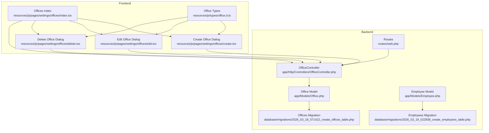
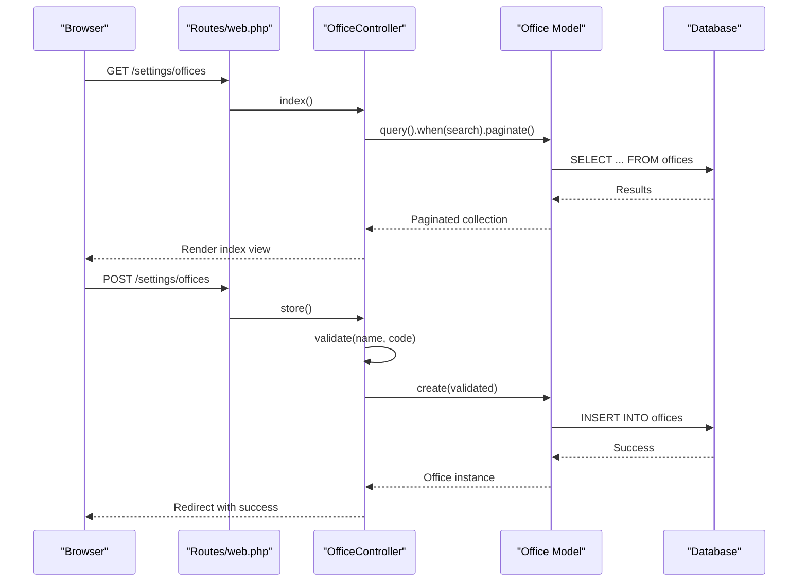
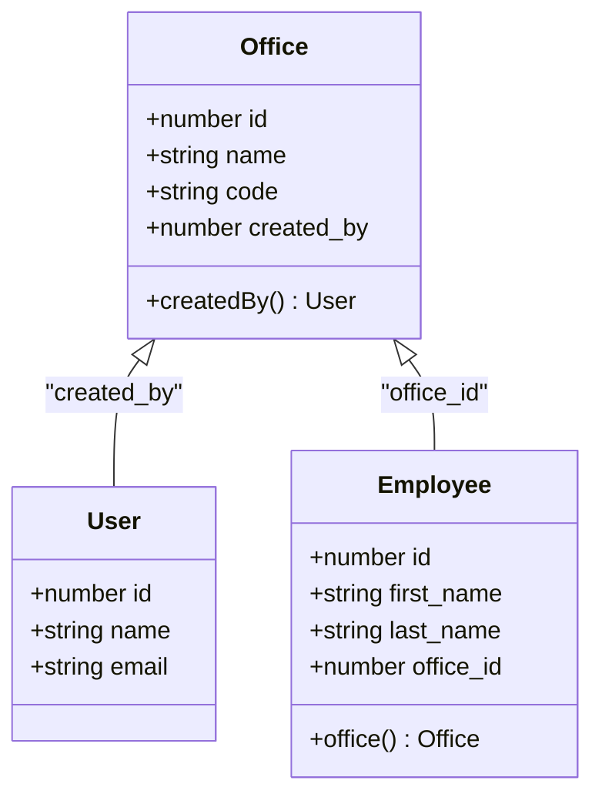
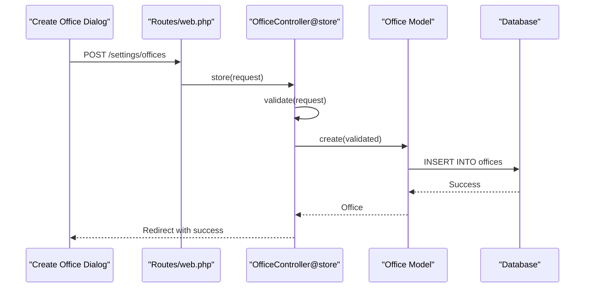
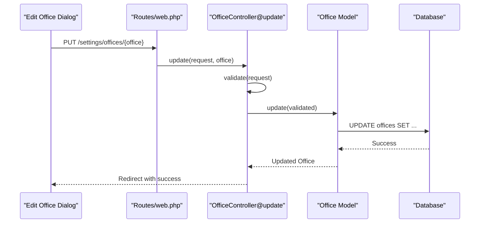
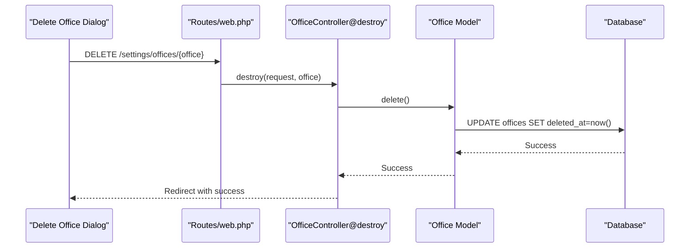
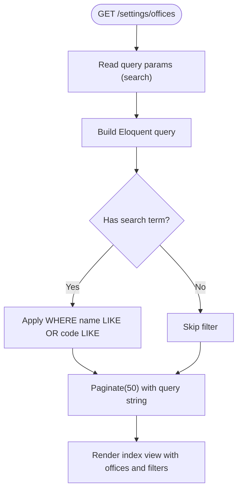
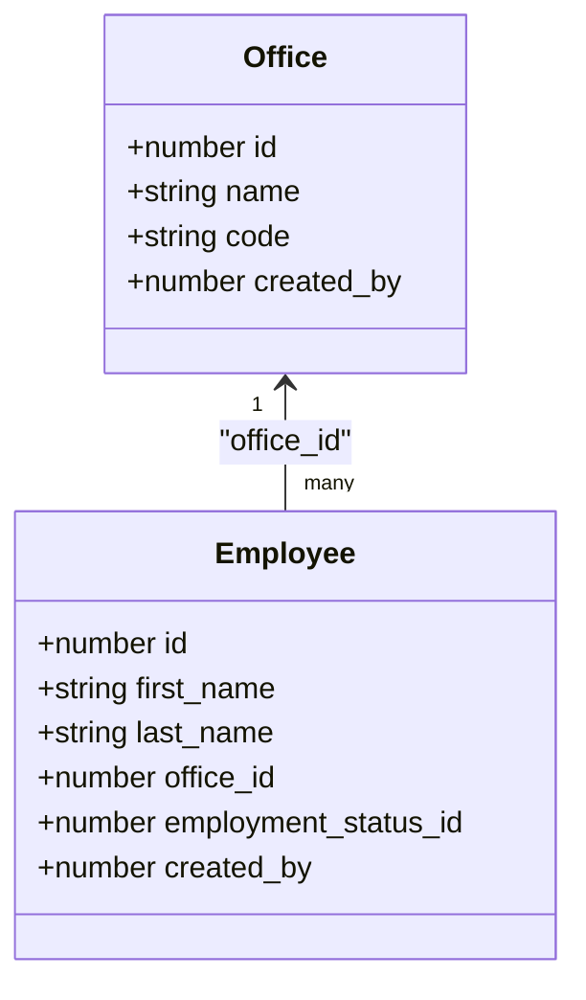
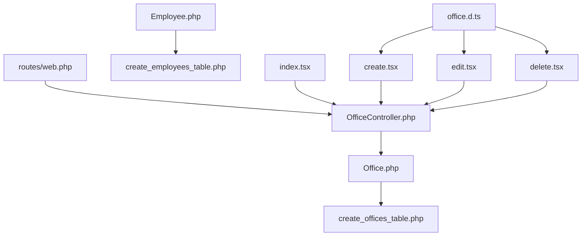

# Office Organization

<cite>
**Referenced Files in This Document**
- [Office.php](file://app/Models/Office.php)
- [OfficeController.php](file://app/Http/Controllers/OfficeController.php)
- [2026_03_18_071422_create_offices_table.php](file://database/migrations/2026_03_18_071422_create_offices_table.php)
- [2026_03_19_022838_create_employees_table.php](file://database/migrations/2026_03_19_022838_create_employees_table.php)
- [Employee.php](file://app/Models/Employee.php)
- [office.d.ts](file://resources/js/types/office.d.ts)
- [create.tsx](file://resources/js/pages/settings/offices/create.tsx)
- [edit.tsx](file://resources/js/pages/settings/offices/edit.tsx)
- [delete.tsx](file://resources/js/pages/settings/offices/delete.tsx)
- [index.tsx](file://resources/js/pages/settings/offices/index.tsx)
- [web.php](file://routes/web.php)
</cite>

## Table of Contents
1. [Introduction](#introduction)
2. [Project Structure](#project-structure)
3. [Core Components](#core-components)
4. [Architecture Overview](#architecture-overview)
5. [Detailed Component Analysis](#detailed-component-analysis)
6. [Dependency Analysis](#dependency-analysis)
7. [Performance Considerations](#performance-considerations)
8. [Troubleshooting Guide](#troubleshooting-guide)
9. [Conclusion](#conclusion)

## Introduction
This document provides comprehensive documentation for the Office Organization module, covering office management, location tracking, and organizational hierarchy. It explains how offices are created, edited, and deleted, how they relate to employees and departments, and how to search, filter, and report office data. It also documents capacity management, resource allocation, administrative controls, user interface components, form validation, and data persistence for office management operations.

## Project Structure
The Office Organization feature spans backend Laravel models and controllers, frontend React components with TypeScript, and database migrations. The routes define the REST endpoints for office CRUD operations under the settings namespace.



**Diagram sources**
- [OfficeController.php:1-61](file://app/Http/Controllers/OfficeController.php#L1-L61)
- [Office.php:1-33](file://app/Models/Office.php#L1-L33)
- [Employee.php:1-104](file://app/Models/Employee.php#L1-L104)
- [2026_03_18_071422_create_offices_table.php:1-32](file://database/migrations/2026_03_18_071422_create_offices_table.php#L1-L32)
- [2026_03_19_022838_create_employees_table.php:1-38](file://database/migrations/2026_03_19_022838_create_employees_table.php#L1-L38)
- [web.php:71-84](file://routes/web.php#L71-L84)
- [index.tsx:1-194](file://resources/js/pages/settings/offices/index.tsx#L1-L194)
- [create.tsx:1-77](file://resources/js/pages/settings/offices/create.tsx#L1-L77)
- [edit.tsx:1-78](file://resources/js/pages/settings/offices/edit.tsx#L1-L78)
- [delete.tsx:1-47](file://resources/js/pages/settings/offices/delete.tsx#L1-L47)
- [office.d.ts:1-8](file://resources/js/types/office.d.ts#L1-L8)

**Section sources**
- [web.php:71-84](file://routes/web.php#L71-L84)
- [OfficeController.php:11-28](file://app/Http/Controllers/OfficeController.php#L11-L28)
- [index.tsx:37-67](file://resources/js/pages/settings/offices/index.tsx#L37-L67)

## Core Components
- Office Model: Defines the office entity with fillable attributes, soft deletes, and automatic creator tracking. It establishes a belongs-to relationship with the User who created the office.
- Office Controller: Implements index, store, update, and destroy actions with search/filtering, validation, and pagination.
- Frontend Office Pages: Provide UI for listing, creating, editing, and deleting offices with form validation and feedback.
- Database Migrations: Define the offices and employees tables, including foreign keys linking employees to offices.
- Types: TypeScript interfaces define the shape of office data for frontend components.

Key responsibilities:
- Data model: Office entity with name, code, created_by, and timestamps.
- Relationships: Employees belong to an Office; Offices are created by a User.
- Operations: CRUD with validation, search by name/code, pagination, and soft-deleted records.

**Section sources**
- [Office.php:13-22](file://app/Models/Office.php#L13-L22)
- [OfficeController.php:30-59](file://app/Http/Controllers/OfficeController.php#L30-L59)
- [office.d.ts:1-8](file://resources/js/types/office.d.ts#L1-L8)
- [2026_03_18_071422_create_offices_table.php:14-21](file://database/migrations/2026_03_18_071422_create_offices_table.php#L14-L21)
- [2026_03_19_022838_create_employees_table.php:22-24](file://database/migrations/2026_03_19_022838_create_employees_table.php#L22-L24)

## Architecture Overview
The system follows a layered architecture:
- Routes define endpoints under the settings namespace.
- Controller handles HTTP requests, applies validation, and delegates to the model.
- Model encapsulates business logic and relationships.
- Frontend components communicate via Inertia with route-driven actions.
- Database migrations define schema and relationships.



**Diagram sources**
- [web.php:80-83](file://routes/web.php#L80-L83)
- [OfficeController.php:11-28](file://app/Http/Controllers/OfficeController.php#L11-L28)
- [OfficeController.php:30-59](file://app/Http/Controllers/OfficeController.php#L30-L59)
- [Office.php:13-17](file://app/Models/Office.php#L13-L17)

## Detailed Component Analysis

### Office Data Model and Relationships
The Office model defines the core attributes and relationships:
- Fillable fields include name, code, and created_by.
- Automatic creator tracking sets created_by during creation.
- Relationship to User via created_by foreign key.
- Soft deletes enabled for recoverability.



**Diagram sources**
- [Office.php:19-22](file://app/Models/Office.php#L19-L22)
- [Employee.php:36-39](file://app/Models/Employee.php#L36-L39)
- [2026_03_18_071422_create_offices_table.php:19](file://database/migrations/2026_03_18_071422_create_offices_table.php#L19)
- [2026_03_19_022838_create_employees_table.php:23](file://database/migrations/2026_03_19_022838_create_employees_table.php#L23)

**Section sources**
- [Office.php:13-31](file://app/Models/Office.php#L13-L31)
- [Employee.php:36-39](file://app/Models/Employee.php#L36-L39)

### Office Management Operations

#### Office Creation
- Endpoint: POST /settings/offices
- Validation: name and code are required, unique, and have maximum length constraints.
- Persistence: Creates a new office record and automatically sets the current user as created_by.
- Feedback: Redirects back with a success message.



**Diagram sources**
- [web.php:82](file://routes/web.php#L82)
- [OfficeController.php:30-40](file://app/Http/Controllers/OfficeController.php#L30-L40)
- [Office.php:24-31](file://app/Models/Office.php#L24-L31)

**Section sources**
- [OfficeController.php:30-40](file://app/Http/Controllers/OfficeController.php#L30-L40)
- [create.tsx:25-43](file://resources/js/pages/settings/offices/create.tsx#L25-L43)

#### Office Editing
- Endpoint: PUT /settings/offices/{office}
- Validation: name and code remain required and unique (excluding current office).
- Persistence: Updates the existing office record.
- Feedback: Redirects back with a success message.



**Diagram sources**
- [web.php:82](file://routes/web.php#L82)
- [OfficeController.php:42-52](file://app/Http/Controllers/OfficeController.php#L42-L52)

**Section sources**
- [OfficeController.php:42-52](file://app/Http/Controllers/OfficeController.php#L42-L52)
- [edit.tsx:25-44](file://resources/js/pages/settings/offices/edit.tsx#L25-L44)

#### Office Deletion
- Endpoint: DELETE /settings/offices/{office}
- Persistence: Deletes the office record (soft delete).
- Feedback: Redirects back with a success message.



**Diagram sources**
- [web.php:83](file://routes/web.php#L83)
- [OfficeController.php:54-59](file://app/Http/Controllers/OfficeController.php#L54-L59)

**Section sources**
- [OfficeController.php:54-59](file://app/Http/Controllers/OfficeController.php#L54-L59)
- [delete.tsx:21-29](file://resources/js/pages/settings/offices/delete.tsx#L21-L29)

### Office Listing, Search, and Filtering
- Endpoint: GET /settings/offices
- Search: Filters by name or code using "like" pattern matching.
- Pagination: Paginates results with a page size of 50 and preserves query strings.
- UI: Provides a searchable table with edit and delete actions.



**Diagram sources**
- [OfficeController.php:11-28](file://app/Http/Controllers/OfficeController.php#L11-L28)
- [index.tsx:37-67](file://resources/js/pages/settings/offices/index.tsx#L37-L67)

**Section sources**
- [OfficeController.php:11-28](file://app/Http/Controllers/OfficeController.php#L11-L28)
- [index.tsx:118-167](file://resources/js/pages/settings/offices/index.tsx#L118-L167)

### User Interface Components and Form Validation
- Create Office Dialog: Collects name and code, validates locally, submits via POST, and shows success feedback.
- Edit Office Dialog: Pre-populates form with current values, validates, submits via PUT, and shows success feedback.
- Delete Office Dialog: Confirms deletion and performs DELETE request with success feedback.
- Index Page: Displays paginated table, search input, and action buttons; integrates dialogs via state management.

```mermaid
sequenceDiagram
participant User as "User"
participant Create as "Create Office Dialog"
participant Edit as "Edit Office Dialog"
participant Delete as "Delete Office Dialog"
participant Controller as "OfficeController"
participant Router as "Routes/web.php"
User->>Create : Open Create Dialog
Create->>Controller : POST /settings/offices
Controller-->>Create : Success
User->>Edit : Open Edit Dialog
Edit->>Controller : PUT /settings/offices/{office}
Controller-->>Edit : Success
User->>Delete : Open Delete Dialog
Delete->>Controller : DELETE /settings/offices/{office}
Controller-->>Delete : Success
```

**Diagram sources**
- [create.tsx:24-43](file://resources/js/pages/settings/offices/create.tsx#L24-L43)
- [edit.tsx:25-44](file://resources/js/pages/settings/offices/edit.tsx#L25-L44)
- [delete.tsx:21-29](file://resources/js/pages/settings/offices/delete.tsx#L21-L29)
- [web.php:80-83](file://routes/web.php#L80-L83)

**Section sources**
- [create.tsx:1-77](file://resources/js/pages/settings/offices/create.tsx#L1-L77)
- [edit.tsx:1-78](file://resources/js/pages/settings/offices/edit.tsx#L1-L78)
- [delete.tsx:1-47](file://resources/js/pages/settings/offices/delete.tsx#L1-L47)
- [index.tsx:168-193](file://resources/js/pages/settings/offices/index.tsx#L168-L193)

### Organizational Hierarchy and Department Structures
- Office to Employee: Employees belong to an Office via office_id, enabling hierarchical tracking of where staff are located.
- Department Context: While departments are not modeled in the provided files, the office_id on employees supports department-like grouping within the organizational hierarchy.
- Reporting Relationships: The Employee model includes employment_status_id and created_by, supporting reporting and audit trails.



**Diagram sources**
- [Employee.php:21-24](file://app/Models/Employee.php#L21-L24)
- [2026_03_19_022838_create_employees_table.php:22-24](file://database/migrations/2026_03_19_022838_create_employees_table.php#L22-L24)

**Section sources**
- [Employee.php:36-39](file://app/Models/Employee.php#L36-L39)
- [2026_03_19_022838_create_employees_table.php:22-24](file://database/migrations/2026_03_19_022838_create_employees_table.php#L22-L24)

### Office Capacity Management and Resource Allocation
- Current Implementation: The office model does not include explicit capacity or resource fields. Capacity management would require extending the model and migration to add fields such as max_capacity, available_resources, or allocation_status.
- Administrative Controls: Soft deletes enable recovery; created_by ensures auditability. Future enhancements could include admin roles and approval workflows.

[No sources needed since this section provides general guidance]

### Office Search, Filtering, and Reporting Capabilities
- Search: Implemented via LIKE queries on name and code.
- Filtering: Controlled by query string parameters; preserved across pagination.
- Reporting: The index view displays summarized office data; future reporting could leverage aggregated queries or dedicated reporting endpoints.

**Section sources**
- [OfficeController.php:13-19](file://app/Http/Controllers/OfficeController.php#L13-L19)
- [index.tsx:56-67](file://resources/js/pages/settings/offices/index.tsx#L56-L67)

### Data Persistence and Relationships
- Offices table: Includes id, name, code, soft_deletes, created_by (foreign key to users), and timestamps.
- Employees table: Includes office_id (foreign key to offices) and employment_status_id (foreign key to employment_statuses).
- Cascading: Foreign keys configured with cascade-on-delete behavior.

**Section sources**
- [2026_03_18_071422_create_offices_table.php:14-21](file://database/migrations/2026_03_18_071422_create_offices_table.php#L14-L21)
- [2026_03_19_022838_create_employees_table.php:14-27](file://database/migrations/2026_03_19_022838_create_employees_table.php#L14-L27)

## Dependency Analysis
The following diagram shows the primary dependencies among components involved in office management:



**Diagram sources**
- [web.php:80-83](file://routes/web.php#L80-L83)
- [OfficeController.php:1-61](file://app/Http/Controllers/OfficeController.php#L1-L61)
- [Office.php:1-33](file://app/Models/Office.php#L1-L33)
- [2026_03_18_071422_create_offices_table.php:1-32](file://database/migrations/2026_03_18_071422_create_offices_table.php#L1-L32)
- [Employee.php:1-104](file://app/Models/Employee.php#L1-L104)
- [2026_03_19_022838_create_employees_table.php:1-38](file://database/migrations/2026_03_19_022838_create_employees_table.php#L1-L38)
- [index.tsx:1-194](file://resources/js/pages/settings/offices/index.tsx#L1-L194)
- [create.tsx:1-77](file://resources/js/pages/settings/offices/create.tsx#L1-L77)
- [edit.tsx:1-78](file://resources/js/pages/settings/offices/edit.tsx#L1-L78)
- [delete.tsx:1-47](file://resources/js/pages/settings/offices/delete.tsx#L1-L47)
- [office.d.ts:1-8](file://resources/js/types/office.d.ts#L1-L8)

**Section sources**
- [web.php:71-84](file://routes/web.php#L71-L84)
- [OfficeController.php:11-28](file://app/Http/Controllers/OfficeController.php#L11-L28)

## Performance Considerations
- Pagination: The index action paginates results with a fixed page size, reducing memory usage and improving response times.
- Search Efficiency: LIKE queries with wildcards can be slow on large datasets; consider indexing name and code or implementing full-text search for improved performance.
- Soft Deletes: Enabling soft deletes adds a deleted_at column; ensure appropriate indexing and consider cleanup policies for deleted records.
- Frontend Rendering: Large tables can impact rendering performance; consider virtualized lists or server-side filtering to optimize UX.

[No sources needed since this section provides general guidance]

## Troubleshooting Guide
- Validation Failures: If name or code validation fails, check uniqueness constraints and maximum length limits. Ensure the request payload matches the expected fields.
- Authorization: All settings routes are protected by the auth middleware; ensure the user is authenticated before performing operations.
- Soft Delete Behavior: Deleted offices are still present in the database with a deleted_at timestamp; adjust queries to exclude soft-deleted records when necessary.
- Foreign Key Constraints: Deleting an office while employees are assigned requires handling dependent records (e.g., reassign employees or cascade delete).

**Section sources**
- [OfficeController.php:32-47](file://app/Http/Controllers/OfficeController.php#L32-L47)
- [web.php:20](file://routes/web.php#L20)
- [2026_03_19_022838_create_employees_table.php:23](file://database/migrations/2026_03_19_022838_create_employees_table.php#L23)

## Conclusion
The Office Organization module provides a robust foundation for managing office entries, integrating seamlessly with employee records and supporting search, filtering, and pagination. The current implementation focuses on basic CRUD operations, data validation, and auditability through created_by and soft deletes. Future enhancements can include explicit capacity management, department modeling, advanced reporting, and administrative controls to further strengthen organizational hierarchy support.