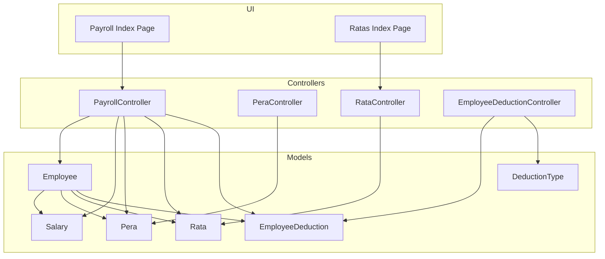
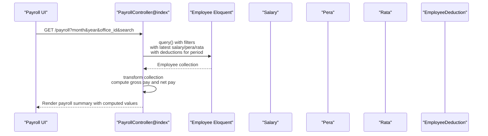
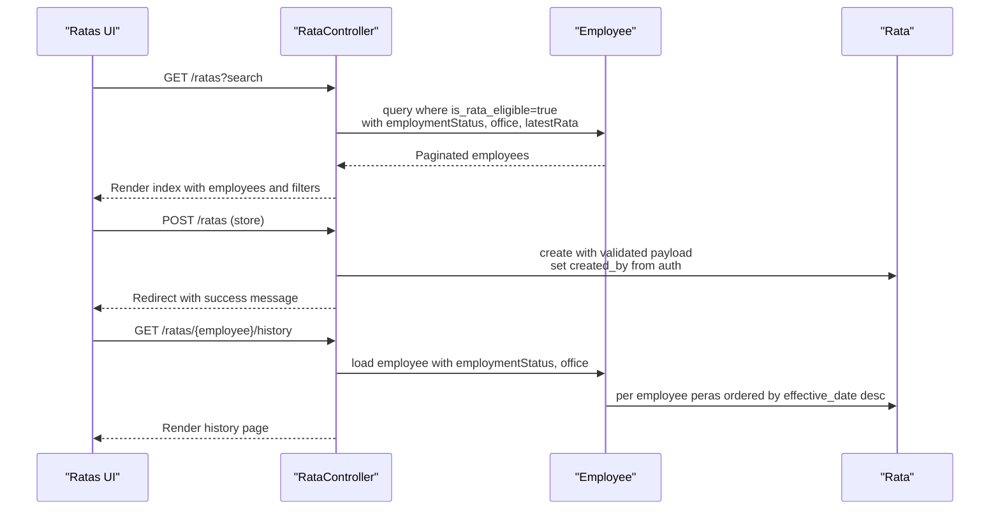
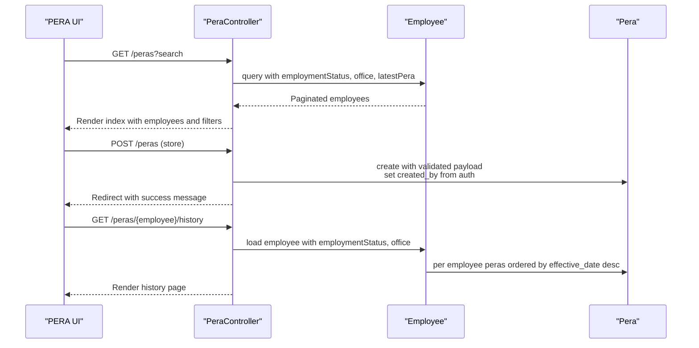
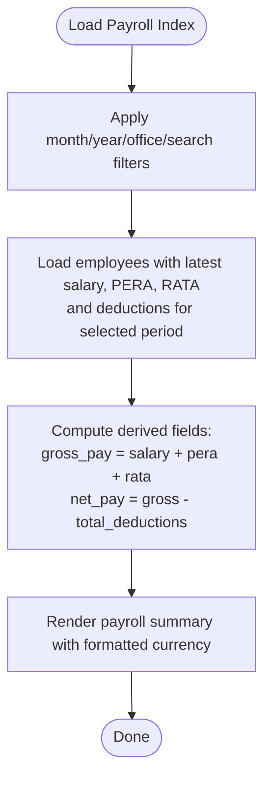
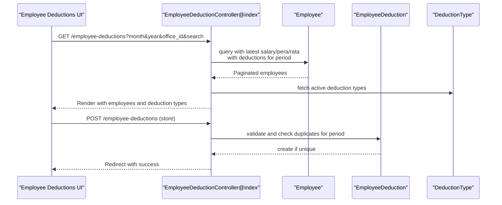
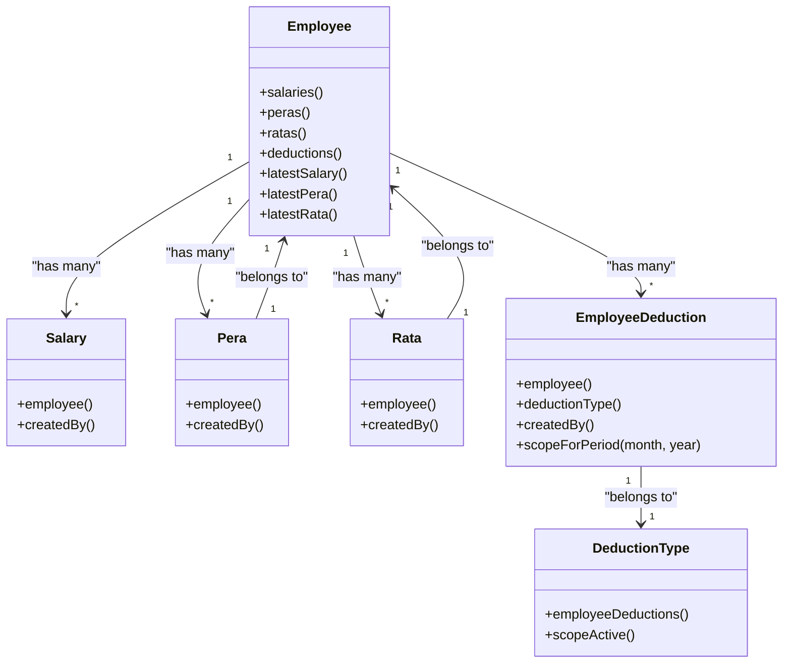
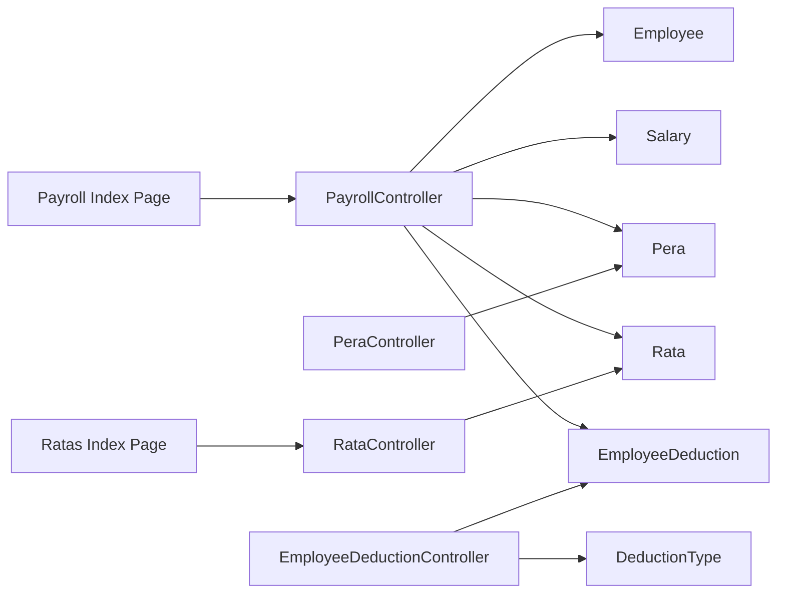

# Payment Processing

<cite>
**Referenced Files in This Document**
- [RataController.php](file://app/Http/Controllers/RataController.php)
- [PeraController.php](file://app/Http/Controllers/PeraController.php)
- [PayrollController.php](file://app/Http/Controllers/PayrollController.php)
- [EmployeeDeductionController.php](file://app/Http/Controllers/EmployeeDeductionController.php)
- [Rata.php](file://app/Models/Rata.php)
- [Pera.php](file://app/Models/Pera.php)
- [Employee.php](file://app/Models/Employee.php)
- [Salary.php](file://app/Models/Salary.php)
- [EmployeeDeduction.php](file://app/Models/EmployeeDeduction.php)
- [DeductionType.php](file://app/Models/DeductionType.php)
- [2026_03_22_115109_create_peras_table.php](file://database/migrations/2026_03_22_115109_create_peras_table.php)
- [2026_03_22_115111_create_ratas_table.php](file://database/migrations/2026_03_22_115111_create_ratas_table.php)
- [payroll.d.ts](file://resources/js/types/payroll.d.ts)
- [index.tsx (Payroll)](file://resources/js/pages/payroll/index.tsx)
- [index.tsx (Ratas)](file://resources/js/pages/ratas/index.tsx)
</cite>

## Table of Contents
1. [Introduction](#introduction)
2. [Project Structure](#project-structure)
3. [Core Components](#core-components)
4. [Architecture Overview](#architecture-overview)
5. [Detailed Component Analysis](#detailed-component-analysis)
6. [Dependency Analysis](#dependency-analysis)
7. [Performance Considerations](#performance-considerations)
8. [Troubleshooting Guide](#troubleshooting-guide)
9. [Conclusion](#conclusion)
10. [Appendices](#appendices)

## Introduction
This document explains the payment processing system for Regular Allowance and Tax Allowance (RATA) and Provident and Employees' Relief Allowance (PERA) within the payroll module. It covers payroll calculation algorithms for gross pay and net pay, payment period management via month and year filters, payment history tracking, and integration between salary, PERA, and RATA allowances. It also documents deduction management, compliance-relevant fields, and the user interface for payment processing, verification, and reporting.

## Project Structure
The payment processing feature spans backend controllers and models, frontend pages, and database migrations. Key areas:
- Controllers: RATA, PERA, Payroll, Employee Deduction
- Models: Employee, Salary, Pera, Rata, EmployeeDeduction, DeductionType
- Frontend: Payroll summary page and RATA management page
- Migrations: PERA and RATA tables

**Diagram sources**
- [RataController.php:11-75](file://app/Http/Controllers/RataController.php#L11-L75)
- [PeraController.php:11-74](file://app/Http/Controllers/PeraController.php#L11-L74)
- [PayrollController.php:11-125](file://app/Http/Controllers/PayrollController.php#L11-L125)
- [EmployeeDeductionController.php:12-108](file://app/Http/Controllers/EmployeeDeductionController.php#L12-L108)
- [Employee.php:10-104](file://app/Models/Employee.php#L10-L104)
- [Salary.php:8-36](file://app/Models/Salary.php#L8-L36)
- [Pera.php:8-41](file://app/Models/Pera.php#L8-L41)
- [Rata.php:8-41](file://app/Models/Rata.php#L8-L41)
- [EmployeeDeduction.php:8-59](file://app/Models/EmployeeDeduction.php#L8-L59)
- [DeductionType.php:7-33](file://app/Models/DeductionType.php#L7-L33)
- [index.tsx (Payroll):49-221](file://resources/js/pages/payroll/index.tsx#L49-L221)
- [index.tsx (Ratas):30-224](file://resources/js/pages/ratas/index.tsx#L30-L224)

**Section sources**
- [RataController.php:11-75](file://app/Http/Controllers/RataController.php#L11-L75)
- [PeraController.php:11-74](file://app/Http/Controllers/PeraController.php#L11-L74)
- [PayrollController.php:11-125](file://app/Http/Controllers/PayrollController.php#L11-L125)
- [EmployeeDeductionController.php:12-108](file://app/Http/Controllers/EmployeeDeductionController.php#L12-L108)
- [Employee.php:10-104](file://app/Models/Employee.php#L10-L104)
- [Salary.php:8-36](file://app/Models/Salary.php#L8-L36)
- [Pera.php:8-41](file://app/Models/Pera.php#L8-L41)
- [Rata.php:8-41](file://app/Models/Rata.php#L8-L41)
- [EmployeeDeduction.php:8-59](file://app/Models/EmployeeDeduction.php#L8-L59)
- [DeductionType.php:7-33](file://app/Models/DeductionType.php#L7-L33)
- [index.tsx (Payroll):49-221](file://resources/js/pages/payroll/index.tsx#L49-L221)
- [index.tsx (Ratas):30-224](file://resources/js/pages/ratas/index.tsx#L30-L224)

## Core Components
- RATA and PERA management controllers handle creation, listing, and history retrieval for allowances.
- Payroll controller computes gross pay and net pay by combining salary, PERA, and RATA amounts and subtracting period-specific deductions.
- Employee deduction controller manages deduction entries per employee and per pay period.
- Models define relationships, casts, and scopes for accurate calculations and filtering.
- Frontend pages provide filtering, currency formatting, and action links for payroll and allowance management.

Key calculations:
- Gross pay = current salary + current PERA + current RATA
- Net pay = gross pay − total deductions for the selected month/year

**Section sources**
- [PayrollController.php:48-67](file://app/Http/Controllers/PayrollController.php#L48-L67)
- [payroll.d.ts:7-15](file://resources/js/types/payroll.d.ts#L7-L15)
- [index.tsx (Payroll):182-191](file://resources/js/pages/payroll/index.tsx#L182-L191)

## Architecture Overview
The system integrates allowance and deduction data to compute pay for a given month/year. The Payroll controller orchestrates queries, applies filters, and computes derived fields. Controllers for RATA and PERA provide CRUD operations and history views. Employee deduction entries are scoped to pay periods and aggregated for net pay computation.

**Diagram sources**
- [PayrollController.php:13-81](file://app/Http/Controllers/PayrollController.php#L13-L81)
- [Employee.php:46-88](file://app/Models/Employee.php#L46-L88)
- [Salary.php:12-24](file://app/Models/Salary.php#L12-L24)
- [Pera.php:10-20](file://app/Models/Pera.php#L10-L20)
- [Rata.php:10-20](file://app/Models/Rata.php#L10-L20)
- [EmployeeDeduction.php:10-24](file://app/Models/EmployeeDeduction.php#L10-L24)

## Detailed Component Analysis

### RATA Management
- Eligibility: Only employees marked as RATA-eligible are shown in the RATA index.
- Filtering: Full-name search across first, middle, and last names.
- CRUD: Create, list, and delete RATA records; view history per employee.
- Effective date and amount are stored with user attribution.

**Diagram sources**
- [RataController.php:13-48](file://app/Http/Controllers/RataController.php#L13-L48)
- [RataController.php:50-73](file://app/Http/Controllers/RataController.php#L50-L73)
- [Employee.php:56-88](file://app/Models/Employee.php#L56-L88)
- [Rata.php:22-39](file://app/Models/Rata.php#L22-L39)

**Section sources**
- [RataController.php:13-48](file://app/Http/Controllers/RataController.php#L13-L48)
- [RataController.php:50-73](file://app/Http/Controllers/RataController.php#L50-L73)
- [Employee.php:19-29](file://app/Models/Employee.php#L19-L29)
- [Employee.php:56-88](file://app/Models/Employee.php#L56-L88)
- [Rata.php:10-20](file://app/Models/Rata.php#L10-L20)
- [Rata.php:22-39](file://app/Models/Rata.php#L22-L39)
- [index.tsx (Ratas):30-224](file://resources/js/pages/ratas/index.tsx#L30-L224)

### PERA Management
- Filtering: Search by full name; paginated listing with office and employment status.
- CRUD: Create, list, and delete PERA records; view history per employee.
- Effective date and amount are stored with user attribution.

**Diagram sources**
- [PeraController.php:13-47](file://app/Http/Controllers/PeraController.php#L13-L47)
- [PeraController.php:49-72](file://app/Http/Controllers/PeraController.php#L49-L72)
- [Employee.php:31-44](file://app/Models/Employee.php#L31-L44)
- [Pera.php:22-39](file://app/Models/Pera.php#L22-L39)

**Section sources**
- [PeraController.php:13-47](file://app/Http/Controllers/PeraController.php#L13-L47)
- [PeraController.php:49-72](file://app/Http/Controllers/PeraController.php#L49-L72)
- [Employee.php:31-44](file://app/Models/Employee.php#L31-L44)
- [Pera.php:10-20](file://app/Models/Pera.php#L10-L20)
- [Pera.php:22-39](file://app/Models/Pera.php#L22-L39)

### Payroll Calculation and Period Management
- Filters: Month, year, office, and search term.
- Data loading: Latest salary, PERA, and RATA per employee; deductions filtered by pay period.
- Computation: Gross pay equals sum of current salary, PERA, and RATA; net pay equals gross minus total deductions for the period.
- UI rendering: Currency formatting and action links to per-employee payroll view.

**Diagram sources**
- [PayrollController.php:13-81](file://app/Http/Controllers/PayrollController.php#L13-L81)
- [PayrollController.php:48-67](file://app/Http/Controllers/PayrollController.php#L48-L67)
- [index.tsx (Payroll):49-221](file://resources/js/pages/payroll/index.tsx#L49-L221)

**Section sources**
- [PayrollController.php:13-81](file://app/Http/Controllers/PayrollController.php#L13-L81)
- [PayrollController.php:48-67](file://app/Http/Controllers/PayrollController.php#L48-L67)
- [payroll.d.ts:7-15](file://resources/js/types/payroll.d.ts#L7-L15)
- [index.tsx (Payroll):49-221](file://resources/js/pages/payroll/index.tsx#L49-L221)

### Employee Deduction Management
- Filtering: Month, year, office, and search term.
- Deduction types: Active deduction types are presented for selection.
- Validation: Prevents duplicate deduction entries for the same employee and period.
- Scopes: Period-scoped queries and per-record created-by attribution.

**Diagram sources**
- [EmployeeDeductionController.php:14-52](file://app/Http/Controllers/EmployeeDeductionController.php#L14-L52)
- [EmployeeDeductionController.php:54-87](file://app/Http/Controllers/EmployeeDeductionController.php#L54-L87)
- [DeductionType.php:25-31](file://app/Models/DeductionType.php#L25-L31)
- [EmployeeDeduction.php:50-58](file://app/Models/EmployeeDeduction.php#L50-L58)

**Section sources**
- [EmployeeDeductionController.php:14-52](file://app/Http/Controllers/EmployeeDeductionController.php#L14-L52)
- [EmployeeDeductionController.php:54-87](file://app/Http/Controllers/EmployeeDeductionController.php#L54-L87)
- [DeductionType.php:25-31](file://app/Models/DeductionType.php#L25-L31)
- [EmployeeDeduction.php:10-24](file://app/Models/EmployeeDeduction.php#L10-L24)
- [EmployeeDeduction.php:50-58](file://app/Models/EmployeeDeduction.php#L50-L58)

### Data Models and Relationships

**Diagram sources**
- [Employee.php:46-88](file://app/Models/Employee.php#L46-L88)
- [Salary.php:26-34](file://app/Models/Salary.php#L26-L34)
- [Pera.php:22-39](file://app/Models/Pera.php#L22-L39)
- [Rata.php:22-39](file://app/Models/Rata.php#L22-L39)
- [EmployeeDeduction.php:26-39](file://app/Models/EmployeeDeduction.php#L26-L39)
- [DeductionType.php:20-31](file://app/Models/DeductionType.php#L20-L31)

**Section sources**
- [Employee.php:46-88](file://app/Models/Employee.php#L46-L88)
- [Salary.php:26-34](file://app/Models/Salary.php#L26-L34)
- [Pera.php:22-39](file://app/Models/Pera.php#L22-L39)
- [Rata.php:22-39](file://app/Models/Rata.php#L22-L39)
- [EmployeeDeduction.php:26-39](file://app/Models/EmployeeDeduction.php#L26-L39)
- [DeductionType.php:20-31](file://app/Models/DeductionType.php#L20-L31)

## Dependency Analysis
- Controllers depend on models for data access and relationships.
- Payroll controller aggregates multiple allowance and deduction models to compute totals.
- Frontend pages depend on typed interfaces for safe rendering and currency formatting.
- Deduction types are scoped to active ones for selection.

**Diagram sources**
- [PayrollController.php:11-125](file://app/Http/Controllers/PayrollController.php#L11-L125)
- [RataController.php:11-75](file://app/Http/Controllers/RataController.php#L11-L75)
- [PeraController.php:11-74](file://app/Http/Controllers/PeraController.php#L11-L74)
- [EmployeeDeductionController.php:12-108](file://app/Http/Controllers/EmployeeDeductionController.php#L12-L108)
- [index.tsx (Payroll):49-221](file://resources/js/pages/payroll/index.tsx#L49-L221)
- [index.tsx (Ratas):30-224](file://resources/js/pages/ratas/index.tsx#L30-L224)

**Section sources**
- [PayrollController.php:11-125](file://app/Http/Controllers/PayrollController.php#L11-L125)
- [RataController.php:11-75](file://app/Http/Controllers/RataController.php#L11-L75)
- [PeraController.php:11-74](file://app/Http/Controllers/PeraController.php#L11-L74)
- [EmployeeDeductionController.php:12-108](file://app/Http/Controllers/EmployeeDeductionController.php#L12-L108)
- [index.tsx (Payroll):49-221](file://resources/js/pages/payroll/index.tsx#L49-L221)
- [index.tsx (Ratas):30-224](file://resources/js/pages/ratas/index.tsx#L30-L224)

## Performance Considerations
- Eager loading: Controllers use with() to avoid N+1 queries for related records.
- Latest record scoping: Using latest ordering with limit reduces unnecessary rows.
- Aggregation in memory: Payroll controller transforms the collection to compute derived fields efficiently.
- Filtering: Early filtering by month/year and optional office reduces dataset size.
- UI formatting: Currency formatting is client-side for responsiveness.

[No sources needed since this section provides general guidance]

## Troubleshooting Guide
Common issues and resolutions:
- Duplicate deduction entry: The employee deduction controller checks for existing entries in the same pay period and prevents duplication.
- Missing eligibility flag: RATA index only lists employees flagged as RATA-eligible; ensure the flag is set.
- Incorrect period totals: Verify the selected month and year; payroll computations are period-scoped.
- Formatting inconsistencies: Currency formatting is handled in the UI; ensure locale settings align with expectations.

**Section sources**
- [EmployeeDeductionController.php:65-74](file://app/Http/Controllers/EmployeeDeductionController.php#L65-L74)
- [RataController.php:17-26](file://app/Http/Controllers/RataController.php#L17-L26)
- [PayrollController.php:15-16](file://app/Http/Controllers/PayrollController.php#L15-L16)
- [index.tsx (Payroll):70-75](file://resources/js/pages/payroll/index.tsx#L70-L75)

## Conclusion
The payment processing system integrates salary, PERA, and RATA allowances with period-specific deductions to compute gross and net pay. Controllers provide robust filtering, history views, and CRUD operations for allowances and deductions. The UI offers intuitive controls for month/year selection, search, and currency formatting. Adhering to period-scoped queries and eager loading ensures efficient computation and responsive user experience.

[No sources needed since this section summarizes without analyzing specific files]

## Appendices

### Database Schemas
- PERA table: employee_id, amount, effective_date, created_by, timestamps
- RATA table: employee_id, amount, effective_date, created_by, timestamps

**Section sources**
- [2026_03_22_115109_create_peras_table.php:14-21](file://database/migrations/2026_03_22_115109_create_peras_table.php#L14-L21)
- [2026_03_22_115111_create_ratas_table.php:14-21](file://database/migrations/2026_03_22_115111_create_ratas_table.php#L14-L21)

### Payroll Types
- PayrollEmployee: Includes current_salary, current_pera, current_rata, total_deductions, gross_pay, net_pay, and optional deductions array.
- PayrollFilters: month, year, office_id, search.
- PayrollShowData: Employee, histories for salary, PERA, RATA, and deductions for a period.

**Section sources**
- [payroll.d.ts:7-35](file://resources/js/types/payroll.d.ts#L7-L35)