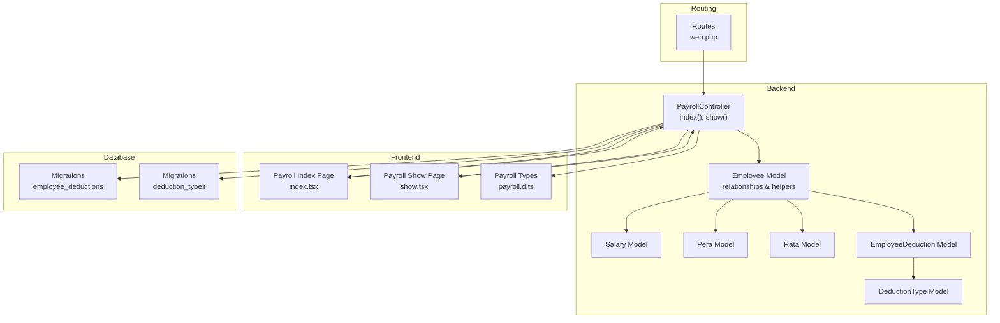
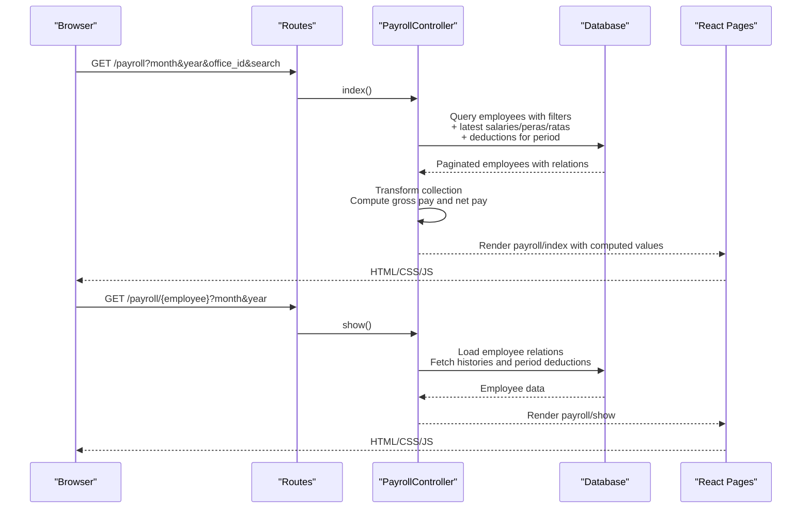
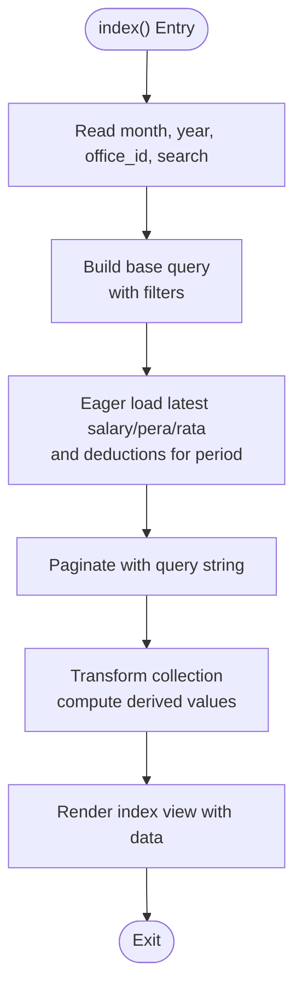
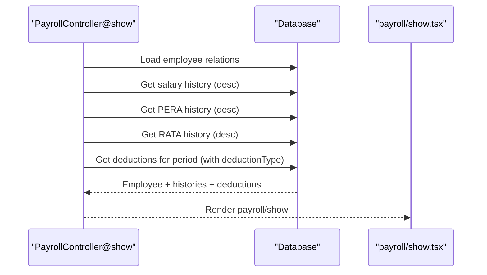
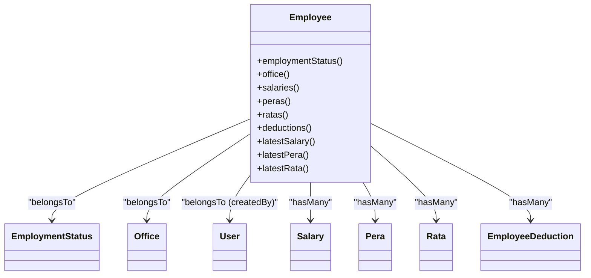
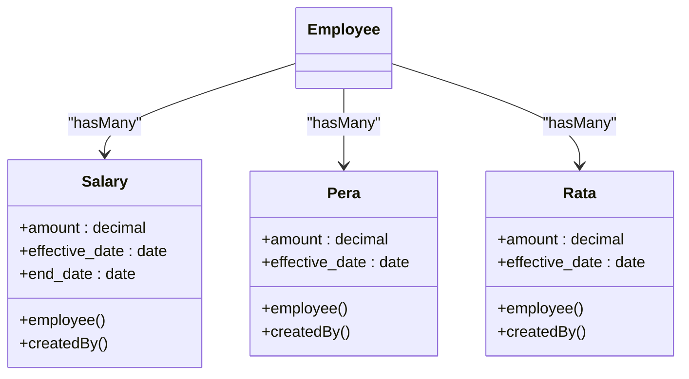
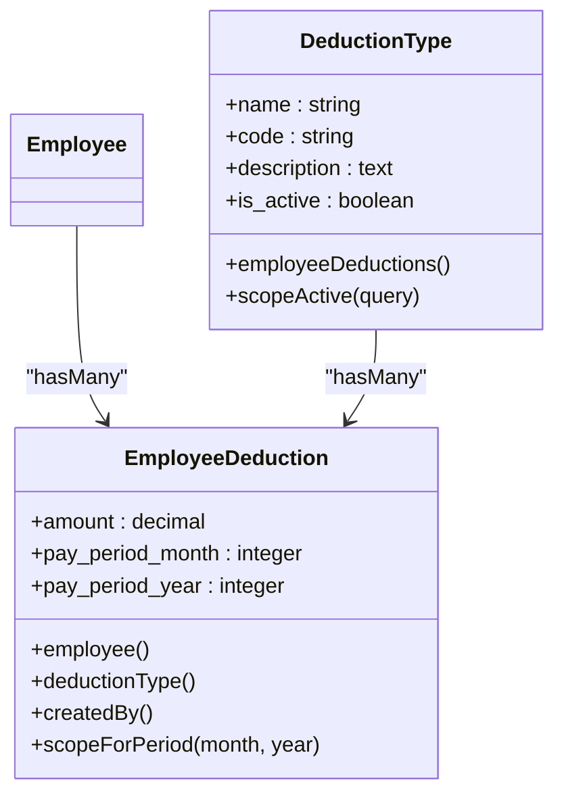
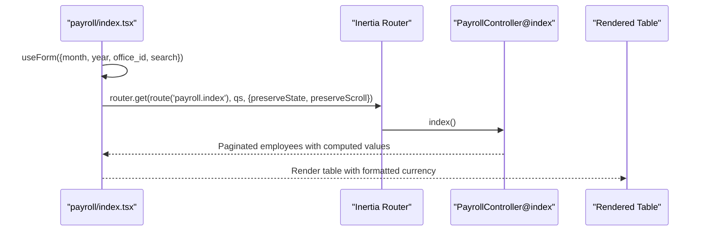
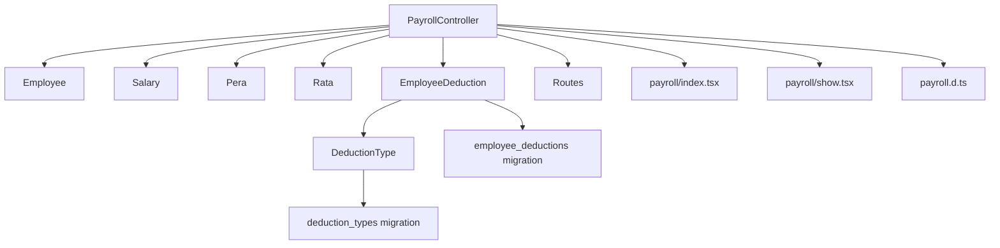

# Payroll Computation Engine

<cite>
**Referenced Files in This Document**
- [PayrollController.php](file://app/Http/Controllers/PayrollController.php)
- [Employee.php](file://app/Models/Employee.php)
- [Salary.php](file://app/Models/Salary.php)
- [Pera.php](file://app/Models/Pera.php)
- [Rata.php](file://app/Models/Rata.php)
- [DeductionType.php](file://app/Models/DeductionType.php)
- [EmployeeDeduction.php](file://app/Models/EmployeeDeduction.php)
- [2026_03_22_115112_create_employee_deductions_table.php](file://database/migrations/2026_03_22_115112_create_employee_deductions_table.php)
- [2026_03_22_115110_create_deduction_types_table.php](file://database/migrations/2026_03_22_115110_create_deduction_types_table.php)
- [web.php](file://routes/web.php)
- [index.tsx](file://resources/js/pages/payroll/index.tsx)
- [show.tsx](file://resources/js/pages/payroll/show.tsx)
- [payroll.d.ts](file://resources/js/types/payroll.d.ts)
</cite>

## Table of Contents
1. [Introduction](#introduction)
2. [Project Structure](#project-structure)
3. [Core Components](#core-components)
4. [Architecture Overview](#architecture-overview)
5. [Detailed Component Analysis](#detailed-component-analysis)
6. [Dependency Analysis](#dependency-analysis)
7. [Performance Considerations](#performance-considerations)
8. [Troubleshooting Guide](#troubleshooting-guide)
9. [Conclusion](#conclusion)

## Introduction
This document describes the payroll computation engine that calculates employee compensation, applies deductions, and presents summarized payroll data. It covers the end-to-end pipeline from data aggregation to transformation and rendering, including filters for month-year periods, office-based filtering, and search functionality. The system integrates salary, PERA, and RATA components with deduction types and employee compensation tracking.

## Project Structure
The payroll computation engine spans backend controllers and models, frontend pages for listing and detail views, TypeScript types for type safety, and database migrations defining the schema.

**Diagram sources**
- [PayrollController.php:11-124](file://app/Http/Controllers/PayrollController.php#L11-L124)
- [Employee.php:10-103](file://app/Models/Employee.php#L10-L103)
- [Salary.php:8-35](file://app/Models/Salary.php#L8-L35)
- [Pera.php:8-40](file://app/Models/Pera.php#L8-L40)
- [Rata.php:8-40](file://app/Models/Rata.php#L8-L40)
- [DeductionType.php:7-32](file://app/Models/DeductionType.php#L7-L32)
- [EmployeeDeduction.php:8-58](file://app/Models/EmployeeDeduction.php#L8-L58)
- [index.tsx:49-220](file://resources/js/pages/payroll/index.tsx#L49-L220)
- [show.tsx:55-247](file://resources/js/pages/payroll/show.tsx#L55-L247)
- [payroll.d.ts:7-34](file://resources/js/types/payroll.d.ts#L7-L34)
- [web.php:25-29](file://routes/web.php#L25-L29)
- [2026_03_22_115112_create_employee_deductions_table.php:14-27](file://database/migrations/2026_03_22_115112_create_employee_deductions_table.php#L14-L27)
- [2026_03_22_115110_create_deduction_types_table.php:14-21](file://database/migrations/2026_03_22_115110_create_deduction_types_table.php#L14-L21)

**Section sources**
- [PayrollController.php:11-124](file://app/Http/Controllers/PayrollController.php#L11-L124)
- [Employee.php:10-103](file://app/Models/Employee.php#L10-L103)
- [index.tsx:49-220](file://resources/js/pages/payroll/index.tsx#L49-L220)
- [show.tsx:55-247](file://resources/js/pages/payroll/show.tsx#L55-L247)
- [web.php:25-29](file://routes/web.php#L25-L29)

## Core Components
- PayrollController: Orchestrates payroll listing and detail views, applies filters, aggregates employee data, computes gross and net pay, and paginates results.
- Employee model: Defines relationships to salaries, PERA, RATA, and employee deductions; provides helpers for latest records.
- Compensation models: Salary, Pera, and Rata define amounts, effective dates, and ownership relationships.
- Deduction models: EmployeeDeduction links employees to deduction types and stores pay period and amount; DeductionType defines deduction categories.
- Frontend pages: Payroll index page renders filtered summaries with computed values; Payroll show page displays detailed breakdowns and history.
- Types: TypeScript interfaces define payroll-specific shapes for type safety.

**Section sources**
- [PayrollController.php:13-81](file://app/Http/Controllers/PayrollController.php#L13-L81)
- [Employee.php:46-88](file://app/Models/Employee.php#L46-L88)
- [Salary.php:12-24](file://app/Models/Salary.php#L12-L24)
- [Pera.php:10-20](file://app/Models/Pera.php#L10-L20)
- [Rata.php:10-20](file://app/Models/Rata.php#L10-L20)
- [DeductionType.php:20-31](file://app/Models/DeductionType.php#L20-L31)
- [EmployeeDeduction.php:10-24](file://app/Models/EmployeeDeduction.php#L10-L24)
- [index.tsx:38-79](file://resources/js/pages/payroll/index.tsx#L38-L79)
- [show.tsx:43-98](file://resources/js/pages/payroll/show.tsx#L43-L98)
- [payroll.d.ts:7-34](file://resources/js/types/payroll.d.ts#L7-L34)

## Architecture Overview
The payroll computation pipeline follows a request-driven flow:
- Request enters PayrollController via routes.
- Controller builds queries with filters, eager loads latest compensation and deductions, paginates, and transforms collections to compute derived values.
- Frontend pages render summaries and details, applying currency formatting and month-year selection.

**Diagram sources**
- [web.php:25-29](file://routes/web.php#L25-L29)
- [PayrollController.php:13-81](file://app/Http/Controllers/PayrollController.php#L13-L81)
- [index.tsx:57-68](file://resources/js/pages/payroll/index.tsx#L57-L68)
- [show.tsx:61-72](file://resources/js/pages/payroll/show.tsx#L61-L72)

## Detailed Component Analysis

### PayrollController: Listing Pipeline
- Filters: Reads month, year, office_id, and search query parameters.
- Query building: Applies conditional scopes for search and office filtering; eager loads latest salary, PERA, RATA, and deductions for the selected pay period; orders by last name; paginates with query string preservation.
- Transformation: Iterates the collection to compute:
  - Latest salary, PERA, and RATA amounts.
  - Total deductions by summing amounts.
  - Gross pay as the sum of salary, PERA, and RATA.
  - Net pay as gross pay minus total deductions.
- Rendering: Passes employees, offices, and filters to the index view.

**Diagram sources**
- [PayrollController.php:15-46](file://app/Http/Controllers/PayrollController.php#L15-L46)
- [PayrollController.php:48-67](file://app/Http/Controllers/PayrollController.php#L48-L67)

**Section sources**
- [PayrollController.php:13-81](file://app/Http/Controllers/PayrollController.php#L13-L81)

### PayrollController: Detail Pipeline
- Loads employee relations (employment status, office).
- Fetches descending histories for salary, PERA, and RATA.
- Retrieves deductions matching the selected pay period and eager-loads deduction types.
- Renders the show view with computed totals and histories.

**Diagram sources**
- [PayrollController.php:83-123](file://app/Http/Controllers/PayrollController.php#L83-L123)
- [show.tsx:93-98](file://resources/js/pages/payroll/show.tsx#L93-L98)

**Section sources**
- [PayrollController.php:83-123](file://app/Http/Controllers/PayrollController.php#L83-L123)

### Employee Model: Relationships and Helpers
- Relationships: Belongs to employment status and office; belongs to user who created; has many salaries, PERAs, RATAs, and employee deductions.
- Helpers: Provides latest salary, PERA, and RATA queries ordered by effective date.

**Diagram sources**
- [Employee.php:31-88](file://app/Models/Employee.php#L31-L88)

**Section sources**
- [Employee.php:31-88](file://app/Models/Employee.php#L31-L88)

### Compensation Models: Salary, Pera, Rata
- Salary: Stores amount, effective_date, end_date, and foreign keys to employee and creator.
- Pera: Stores amount and effective_date with foreign keys.
- Rata: Stores amount and effective_date with foreign keys and eligibility flag on Employee.

**Diagram sources**
- [Salary.php:12-24](file://app/Models/Salary.php#L12-L24)
- [Pera.php:17-20](file://app/Models/Pera.php#L17-L20)
- [Rata.php:17-20](file://app/Models/Rata.php#L17-L20)
- [Employee.php:46-59](file://app/Models/Employee.php#L46-L59)

**Section sources**
- [Salary.php:12-24](file://app/Models/Salary.php#L12-L24)
- [Pera.php:17-20](file://app/Models/Pera.php#L17-L20)
- [Rata.php:17-20](file://app/Models/Rata.php#L17-L20)

### Deduction Models: EmployeeDeduction and DeductionType
- EmployeeDeduction: Links employee and deduction type, stores amount, pay period (month/year), notes, and creator. Includes a scope to filter by pay period.
- DeductionType: Defines name, code, description, and activity status; includes a scope to fetch only active deduction types.

**Diagram sources**
- [EmployeeDeduction.php:10-24](file://app/Models/EmployeeDeduction.php#L10-L24)
- [EmployeeDeduction.php:53-57](file://app/Models/EmployeeDeduction.php#L53-L57)
- [DeductionType.php:16-18](file://app/Models/DeductionType.php#L16-L18)
- [DeductionType.php:28-31](file://app/Models/DeductionType.php#L28-L31)

**Section sources**
- [EmployeeDeduction.php:10-24](file://app/Models/EmployeeDeduction.php#L10-L24)
- [EmployeeDeduction.php:53-57](file://app/Models/EmployeeDeduction.php#L53-L57)
- [DeductionType.php:16-18](file://app/Models/DeductionType.php#L16-L18)
- [DeductionType.php:28-31](file://app/Models/DeductionType.php#L28-L31)

### Frontend Pages: Payroll Index and Show
- Payroll Index: Renders a paginated table with computed salary, PERA, RATA, gross pay, total deductions, and net pay. Supports month/year filters, office dropdown, and search input. Uses currency formatting and preserves state and scroll during filtering.
- Payroll Show: Displays detailed compensation breakdown, total deductions, and net pay for a selected employee. Shows deduction rows with type names and notes, and recent salary history.

**Diagram sources**
- [index.tsx:50-68](file://resources/js/pages/payroll/index.tsx#L50-L68)
- [PayrollController.php:13-81](file://app/Http/Controllers/PayrollController.php#L13-L81)

**Section sources**
- [index.tsx:38-79](file://resources/js/pages/payroll/index.tsx#L38-L79)
- [index.tsx:141-216](file://resources/js/pages/payroll/index.tsx#L141-L216)
- [show.tsx:43-98](file://resources/js/pages/payroll/show.tsx#L43-L98)
- [show.tsx:185-214](file://resources/js/pages/payroll/show.tsx#L185-L214)

### TypeScript Types: PayrollEmployee and PayrollShowData
- PayrollEmployee extends Employee with computed fields: current_salary, current_pera, current_rata, total_deductions, gross_pay, net_pay, and optional deductions array.
- PayrollFilters defines month, year, office_id, and search parameters.
- PayrollShowData defines the shape for the show view including histories and period filters.

**Section sources**
- [payroll.d.ts:7-34](file://resources/js/types/payroll.d.ts#L7-L34)

## Dependency Analysis
The controller depends on models and migrations to construct queries, eager-load relationships, and enforce uniqueness constraints. The frontend pages depend on controller-provided props and types.

**Diagram sources**
- [PayrollController.php:5-8](file://app/Http/Controllers/PayrollController.php#L5-L8)
- [EmployeeDeduction.php:16-22](file://app/Models/EmployeeDeduction.php#L16-L22)
- [DeductionType.php:9-14](file://app/Models/DeductionType.php#L9-L14)
- [web.php:25-29](file://routes/web.php#L25-L29)
- [index.tsx:12-13](file://resources/js/pages/payroll/index.tsx#L12-L13)
- [show.tsx:9-14](file://resources/js/pages/payroll/show.tsx#L9-L14)
- [payroll.d.ts:1-5](file://resources/js/types/payroll.d.ts#L1-L5)
- [2026_03_22_115112_create_employee_deductions_table.php:26](file://database/migrations/2026_03_22_115112_create_employee_deductions_table.php#L26)
- [2026_03_22_115110_create_deduction_types_table.php:17](file://database/migrations/2026_03_22_115110_create_deduction_types_table.php#L17)

**Section sources**
- [PayrollController.php:5-8](file://app/Http/Controllers/PayrollController.php#L5-L8)
- [EmployeeDeduction.php:16-22](file://app/Models/EmployeeDeduction.php#L16-L22)
- [DeductionType.php:9-14](file://app/Models/DeductionType.php#L9-L14)
- [2026_03_22_115112_create_employee_deductions_table.php:26](file://database/migrations/2026_03_22_115112_create_employee_deductions_table.php#L26)
- [2026_03_22_115110_create_deduction_types_table.php:17](file://database/migrations/2026_03_22_115110_create_deduction_types_table.php#L17)

## Performance Considerations
- Query optimization strategies:
  - Eager loading: Latest compensation and deductions are loaded via with() to avoid N+1 queries.
  - Conditional scopes: where() clauses for pay period and office reduce result sets early.
  - Latest record selection: Subqueries limit latest records per employee to minimize joins.
- Pagination: The controller paginates results with query string preservation to maintain filter state across pages.
- Casting and indexing:
  - Decimal casting ensures precise monetary storage and avoids string arithmetic overhead.
  - Unique composite index on employee_deductions prevents duplicate entries for the same employee/type/month/year, supporting efficient lookups.
- Frontend rendering:
  - Currency formatting is delegated to the client to reduce server-side formatting overhead.
  - Filtering preserves state and scroll to minimize re-fetching data unnecessarily.

[No sources needed since this section provides general guidance]

## Troubleshooting Guide
- Missing computed fields: Ensure the collection transform in the controller populates current_salary, current_pera, current_rata, total_deductions, gross_pay, and net_pay.
- Incorrect gross pay or net pay: Verify that the transformation sums salary, PERA, and RATA amounts and subtracts total deductions correctly.
- Empty deductions: Confirm that pay period filters match the requested month and year and that deduction types are active.
- Pagination issues: Check that pagination preserves query string parameters and that page size remains appropriate for performance.
- Duplicate deductions: The unique constraint on employee_deductions prevents duplicates; if duplicates appear, investigate data entry flows.

**Section sources**
- [PayrollController.php:48-67](file://app/Http/Controllers/PayrollController.php#L48-L67)
- [2026_03_22_115112_create_employee_deductions_table.php:25-26](file://database/migrations/2026_03_22_115112_create_employee_deductions_table.php#L25-L26)

## Conclusion
The payroll computation engine integrates employee compensation data with deduction management to produce accurate payroll summaries. Its design emphasizes efficient querying, eager loading, and clear separation of concerns between backend computation and frontend presentation. The system supports robust filtering, pagination, and type-safe data contracts, enabling reliable payroll reporting and detailed compensation analysis.