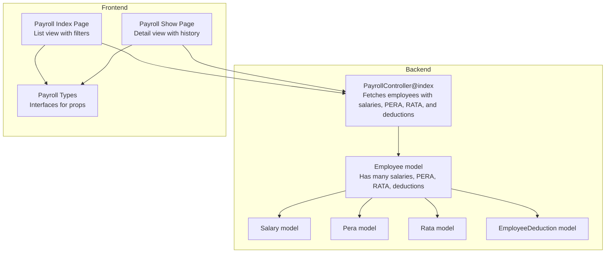
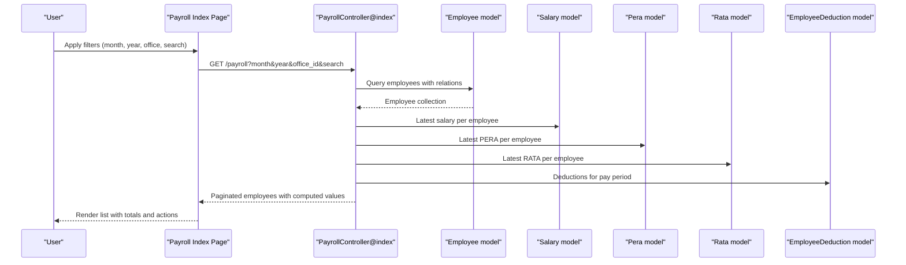
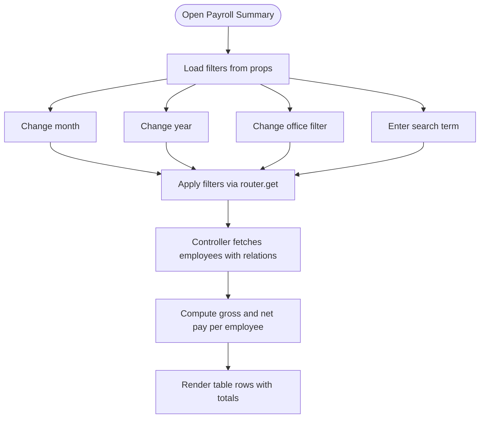
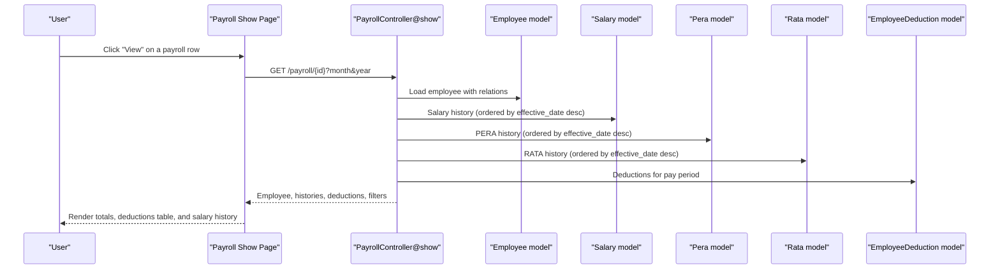
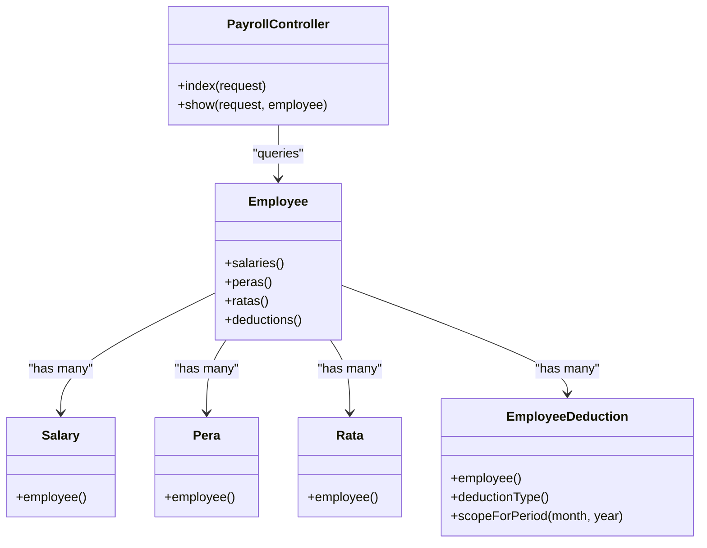
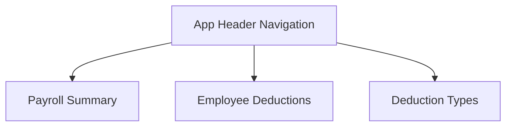
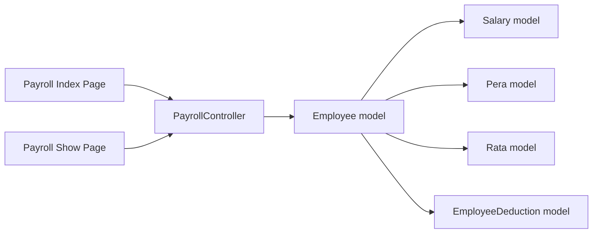

# Payroll Reports & Analytics

<cite>
**Referenced Files in This Document**
- [PayrollController.php](file://app/Http/Controllers/PayrollController.php)
- [index.tsx](file://resources/js/pages/payroll/index.tsx)
- [show.tsx](file://resources/js/pages/payroll/show.tsx)
- [payroll.d.ts](file://resources/js/types/payroll.d.ts)
- [Employee.php](file://app/Models/Employee.php)
- [Salary.php](file://app/Models/Salary.php)
- [Pera.php](file://app/Models/Pera.php)
- [Rata.php](file://app/Models/Rata.php)
- [EmployeeDeduction.php](file://app/Models/EmployeeDeduction.php)
- [app-header.tsx](file://resources/js/components/app-header.tsx)
</cite>

## Table of Contents
1. [Introduction](#introduction)
2. [Project Structure](#project-structure)
3. [Core Components](#core-components)
4. [Architecture Overview](#architecture-overview)
5. [Detailed Component Analysis](#detailed-component-analysis)
6. [Dependency Analysis](#dependency-analysis)
7. [Performance Considerations](#performance-considerations)
8. [Troubleshooting Guide](#troubleshooting-guide)
9. [Conclusion](#conclusion)
10. [Appendices](#appendices)

## Introduction
This document describes the payroll reporting and analytics capabilities implemented in the application. It covers the payroll dashboard interface, employee payroll summaries, and payment history views. It explains report generation processes, filtering options, and export capabilities. It also details payroll analytics features such as payment trends, department-wise analysis, and compensation comparisons. Report customization options, saved filters, and recurring report scheduling are addressed. Finally, it documents payroll audit trails, compliance reporting, and regulatory requirement fulfillment, along with the user interface for payroll analysis, interactive charts, and data export formats.

## Project Structure
The payroll reporting and analytics functionality spans backend controllers and models, and frontend pages and types. The backend aggregates employee compensation and deductions for a selected pay period, while the frontend renders filtered lists and detailed views with currency formatting and date localization.



**Diagram sources**
- [PayrollController.php:13-81](file://app/Http/Controllers/PayrollController.php#L13-L81)
- [Employee.php:46-64](file://app/Models/Employee.php#L46-L64)
- [index.tsx:38-80](file://resources/js/pages/payroll/index.tsx#L38-L80)
- [show.tsx:43-53](file://resources/js/pages/payroll/show.tsx#L43-L53)
- [payroll.d.ts:7-34](file://resources/js/types/payroll.d.ts#L7-L34)

**Section sources**
- [PayrollController.php:13-81](file://app/Http/Controllers/PayrollController.php#L13-L81)
- [index.tsx:38-80](file://resources/js/pages/payroll/index.tsx#L38-L80)
- [show.tsx:43-53](file://resources/js/pages/payroll/show.tsx#L43-L53)
- [payroll.d.ts:7-34](file://resources/js/types/payroll.d.ts#L7-L34)

## Core Components
- Payroll dashboard list view: Presents a paginated table of employees with computed gross and net pay for a selected month/year, filtered by office and search term.
- Employee payroll detail view: Shows current compensation components (salary, PERA, RATA), total deductions, gross pay, net pay, and history of salary changes.
- Backend aggregation: Computes derived metrics per employee and applies filters for pay period, office, and search.
- Frontend filters and formatting: Provides month/year selectors, office filter, and search input; formats currency and dates.

Key capabilities:
- Filter by month, year, office, and employee name.
- View employee detail with deductions and recent salary history.
- Computed totals for gross pay and net pay.
- Currency formatting and localized date display.

**Section sources**
- [PayrollController.php:13-81](file://app/Http/Controllers/PayrollController.php#L13-L81)
- [index.tsx:38-80](file://resources/js/pages/payroll/index.tsx#L38-L80)
- [show.tsx:43-53](file://resources/js/pages/payroll/show.tsx#L43-L53)
- [payroll.d.ts:7-34](file://resources/js/types/payroll.d.ts#L7-L34)

## Architecture Overview
The payroll reporting pipeline connects frontend pages to backend controllers and models. The controller queries employees with related compensation and deduction records for the selected pay period, computes derived values, and passes typed data to the frontend.



**Diagram sources**
- [index.tsx:57-68](file://resources/js/pages/payroll/index.tsx#L57-L68)
- [PayrollController.php:20-67](file://app/Http/Controllers/PayrollController.php#L20-L67)
- [Employee.php:46-64](file://app/Models/Employee.php#L46-L64)

## Detailed Component Analysis

### Payroll Dashboard List View
The list view displays a filtered and paginated table of employees with compensation and deduction totals for the selected pay period. Users can change the month and year, filter by office, and search by employee name. The view computes and shows gross pay and net pay per row.



**Diagram sources**
- [index.tsx:57-68](file://resources/js/pages/payroll/index.tsx#L57-L68)
- [PayrollController.php:20-67](file://app/Http/Controllers/PayrollController.php#L20-L67)

**Section sources**
- [index.tsx:38-80](file://resources/js/pages/payroll/index.tsx#L38-L80)
- [index.tsx:141-216](file://resources/js/pages/payroll/index.tsx#L141-L216)
- [PayrollController.php:13-81](file://app/Http/Controllers/PayrollController.php#L13-L81)

### Employee Payroll Detail View
The detail view shows current compensation components, total deductions, gross pay, and net pay for the selected month/year. It also lists deductions applied during that period and recent salary history.



**Diagram sources**
- [show.tsx:61-72](file://resources/js/pages/payroll/show.tsx#L61-L72)
- [PayrollController.php:83-123](file://app/Http/Controllers/PayrollController.php#L83-L123)
- [Employee.php:46-64](file://app/Models/Employee.php#L46-L64)

**Section sources**
- [show.tsx:43-53](file://resources/js/pages/payroll/show.tsx#L43-L53)
- [show.tsx:93-98](file://resources/js/pages/payroll/show.tsx#L93-L98)
- [show.tsx:185-214](file://resources/js/pages/payroll/show.tsx#L185-L214)
- [show.tsx:216-243](file://resources/js/pages/payroll/show.tsx#L216-L243)

### Backend Aggregation and Filtering
The backend controller builds queries that:
- Filter employees by optional search term across names.
- Optionally filter by office.
- Load latest salary, PERA, and RATA records per employee.
- Load deductions matching the selected pay period month and year.
- Compute derived values (gross pay, net pay, total deductions) and pass them to the frontend.



**Diagram sources**
- [PayrollController.php:13-123](file://app/Http/Controllers/PayrollController.php#L13-L123)
- [Employee.php:46-64](file://app/Models/Employee.php#L46-L64)
- [Salary.php:26-29](file://app/Models/Salary.php#L26-L29)
- [Pera.php:22-25](file://app/Models/Pera.php#L22-L25)
- [Rata.php:22-25](file://app/Models/Rata.php#L22-L25)
- [EmployeeDeduction.php:26-34](file://app/Models/EmployeeDeduction.php#L26-L34)

**Section sources**
- [PayrollController.php:20-67](file://app/Http/Controllers/PayrollController.php#L20-L67)
- [Employee.php:46-64](file://app/Models/Employee.php#L46-L64)
- [EmployeeDeduction.php:53-57](file://app/Models/EmployeeDeduction.php#L53-L57)

### Data Types and Interfaces
Typed interfaces define the shape of payroll data passed from backend to frontend, ensuring consistent handling of employee payroll summaries and detail views.

```mermaid
classDiagram
class PayrollEmployee {
+current_salary : number
+current_pera : number
+current_rata : number
+total_deductions : number
+gross_pay : number
+net_pay : number
+deductions? : EmployeeDeduction[]
}
class PayrollFilters {
+month : number
+year : number
+office_id? : number
+search? : string
}
class PayrollShowData {
+employee : Employee
+salaryHistory : Salary[]
+peraHistory : Pera[]
+rataHistory : Rata[]
+deductions : EmployeeDeduction[]
+filters : { month : number; year : number }
}
```

**Diagram sources**
- [payroll.d.ts:7-34](file://resources/js/types/payroll.d.ts#L7-L34)

**Section sources**
- [payroll.d.ts:7-34](file://resources/js/types/payroll.d.ts#L7-L34)

### Navigation and Access
The navigation menu exposes the Payroll module with links to the payroll summary page and related sections.



**Diagram sources**
- [app-header.tsx:24-42](file://resources/js/components/app-header.tsx#L24-L42)

**Section sources**
- [app-header.tsx:24-42](file://resources/js/components/app-header.tsx#L24-L42)

## Dependency Analysis
- The frontend pages depend on the backend controller for data and typed interfaces.
- The controller depends on the Employee model and related models for aggregations.
- The Employee model encapsulates relationships to Salary, Pera, Rata, and EmployeeDeduction.
- The EmployeeDeduction model includes a scope for filtering by pay period.



**Diagram sources**
- [index.tsx:38-80](file://resources/js/pages/payroll/index.tsx#L38-L80)
- [show.tsx:43-53](file://resources/js/pages/payroll/show.tsx#L43-L53)
- [PayrollController.php:13-123](file://app/Http/Controllers/PayrollController.php#L13-L123)
- [Employee.php:46-64](file://app/Models/Employee.php#L46-L64)

**Section sources**
- [PayrollController.php:13-123](file://app/Http/Controllers/PayrollController.php#L13-L123)
- [Employee.php:46-64](file://app/Models/Employee.php#L46-L64)

## Performance Considerations
- Efficient eager loading: The controller uses with() to load related records (latest salary, PERA, RATA, and deductions for the selected period) to avoid N+1 queries.
- Pagination: Employees are paginated to limit payload size.
- Filtering: Query-time filtering reduces server-side computation and client rendering overhead.
- Derived computations: Totals are computed server-side and sent to the frontend to minimize client-side work.

Recommendations:
- Add database indexes on frequently filtered columns (e.g., office_id, effective_date).
- Consider caching aggregated totals for repeated queries.
- Optimize frontend rendering for large datasets by virtualizing long lists.

**Section sources**
- [PayrollController.php:20-46](file://app/Http/Controllers/PayrollController.php#L20-L46)
- [Employee.php:69-88](file://app/Models/Employee.php#L69-L88)

## Troubleshooting Guide
Common issues and resolutions:
- No employees found: Verify filters (month, year, office, search) and ensure data exists for the selected pay period.
- Net pay shows zero: Confirm that deductions exist for the selected month/year and that salary/PERA/RATA amounts are present.
- Incorrect totals: Check that the latest records for salary, PERA, and RATA are correctly loaded and that deductions match the pay period.
- Formatting issues: Ensure currency and date formatting functions are applied consistently across views.

Audit trail and compliance:
- Creation metadata: Models capture created_by for auditability. Use this to track who created records.
- Effective dates: Salary, PERA, and RATA records include effective_date to support compliance timelines.
- Deduction period: EmployeeDeduction includes pay_period_month and pay_period_year to align with regulatory reporting periods.

Export capabilities:
- Current state: The UI presents data in tables and cards. There is no built-in export endpoint in the referenced controller.
- Recommended approach: Add CSV/XLSX export endpoints in the controller that accept the same filters and return formatted data for download.

Saved filters and recurring scheduling:
- Current state: Filters are maintained in the frontend form state and appended to the URL query string.
- Recommended approach: Persist filters to user preferences and schedule recurring reports via a background job system.

**Section sources**
- [Employee.php:41-44](file://app/Models/Employee.php#L41-L44)
- [Salary.php:31-34](file://app/Models/Salary.php#L31-L34)
- [Pera.php:27-30](file://app/Models/Pera.php#L27-L30)
- [Rata.php:27-30](file://app/Models/Rata.php#L27-L30)
- [EmployeeDeduction.php:36-39](file://app/Models/EmployeeDeduction.php#L36-L39)
- [PayrollController.php:13-81](file://app/Http/Controllers/PayrollController.php#L13-L81)

## Conclusion
The payroll reporting and analytics implementation provides a robust foundation for viewing and analyzing employee compensation and deductions. The backend efficiently aggregates data for a selected pay period, while the frontend offers intuitive filtering, computed totals, and detailed views. To enhance the system, consider adding export capabilities, saved filters, and recurring report scheduling. The existing audit trail and effective-date fields support compliance reporting and regulatory requirements.

## Appendices

### UI Components and Interactions
- Payroll Summary list view: Month/year selectors, office filter, search input, and a paginated table with computed totals.
- Employee detail view: Period selector, summary cards for compensation and totals, deductions table, and recent salary history.
- Currency and date formatting: Consistent formatting for Philippine Peso and localized date display.

**Section sources**
- [index.tsx:87-139](file://resources/js/pages/payroll/index.tsx#L87-L139)
- [index.tsx:141-216](file://resources/js/pages/payroll/index.tsx#L141-L216)
- [show.tsx:131-153](file://resources/js/pages/payroll/show.tsx#L131-L153)
- [show.tsx:155-183](file://resources/js/pages/payroll/show.tsx#L155-L183)
- [show.tsx:185-214](file://resources/js/pages/payroll/show.tsx#L185-L214)
- [show.tsx:216-243](file://resources/js/pages/payroll/show.tsx#L216-L243)