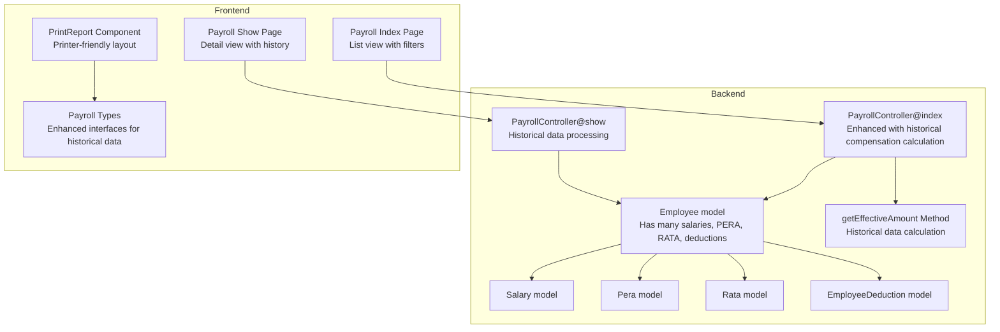
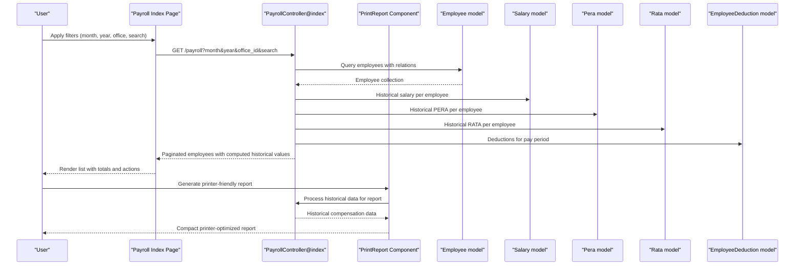
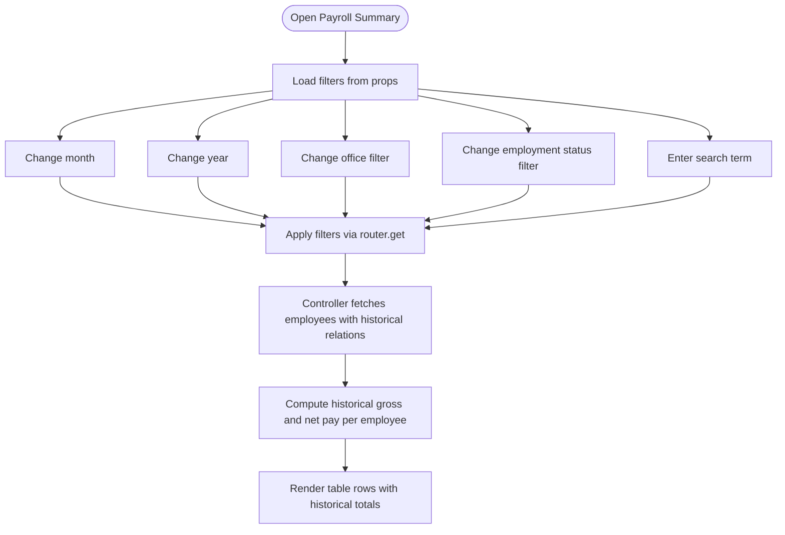
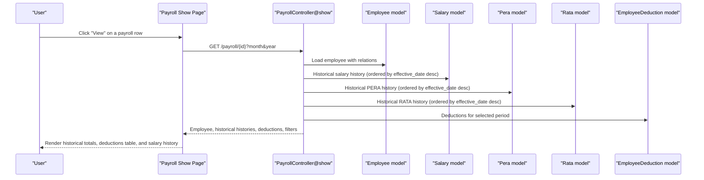
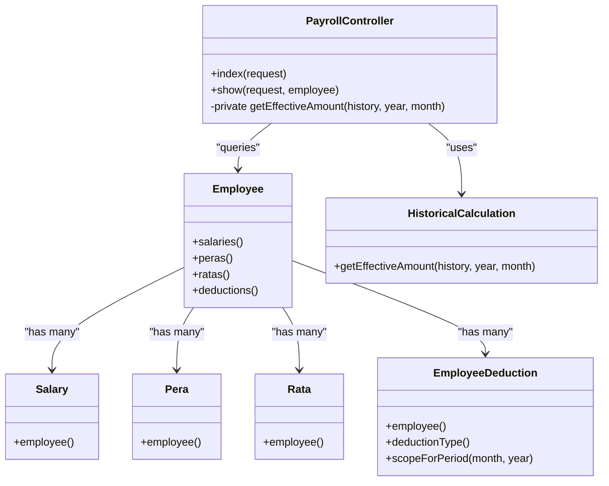
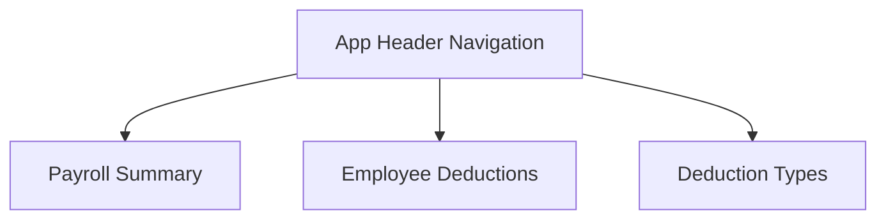
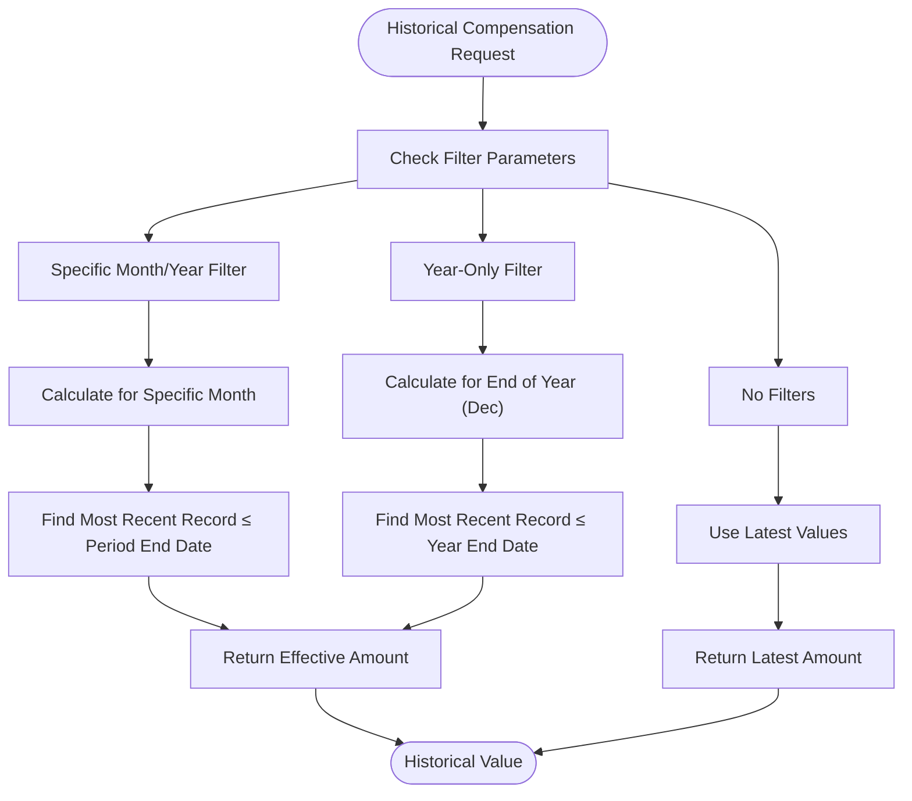
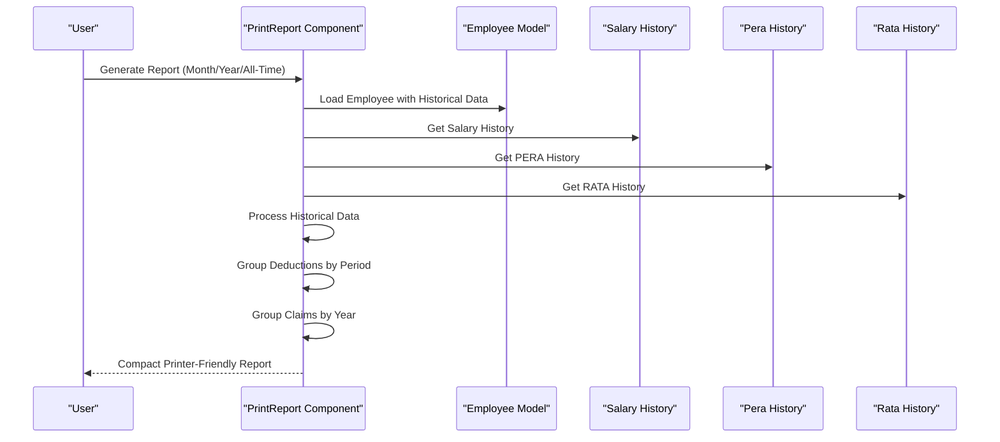
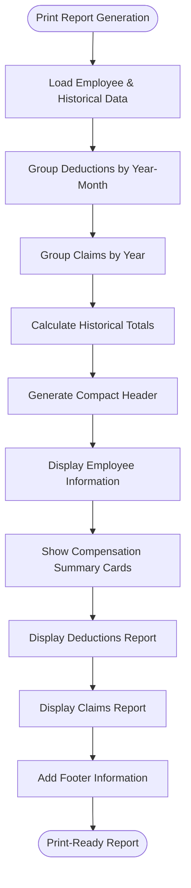
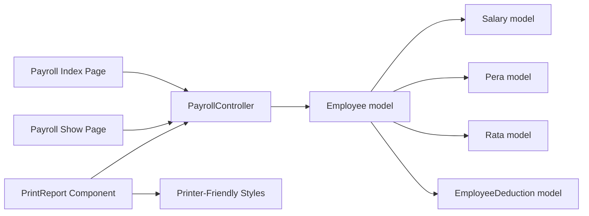

# Payroll Reports & Analytics

<cite>
**Referenced Files in This Document**
- [PayrollController.php](file://app/Http/Controllers/PayrollController.php)
- [index.tsx](file://resources/js/pages/payroll/index.tsx)
- [show.tsx](file://resources/js/pages/payroll/show.tsx)
- [PrintReport.tsx](file://resources/js/pages/Employees/Manage/PrintReport.tsx)
- [payroll.d.ts](file://resources/js/types/payroll.d.ts)
- [employee.d.ts](file://resources/js/types/employee.d.ts)
- [salary.d.ts](file://resources/js/types/salary.d.ts)
- [pera.d.ts](file://resources/js/types/pera.d.ts)
- [Employee.php](file://app/Models/Employee.php)
- [Salary.php](file://app/Models/Salary.php)
- [Pera.php](file://app/Models/Pera.php)
- [Rata.php](file://app/Models/Rata.php)
- [EmployeeDeduction.php](file://app/Models/EmployeeDeduction.php)
- [app-header.tsx](file://resources/js/components/app-header.tsx)
</cite>

## Update Summary
**Changes Made**
- Added comprehensive documentation for the enhanced PrintReport.tsx component with sophisticated historical data handling
- Updated payroll reporting architecture to include historical compensation calculation capabilities
- Enhanced backend controller with improved historical data processing methods
- Added documentation for printer-friendly layout and compact report generation
- Updated data types to support historical compensation calculations

## Table of Contents
1. [Introduction](#introduction)
2. [Project Structure](#project-structure)
3. [Core Components](#core-components)
4. [Architecture Overview](#architecture-overview)
5. [Detailed Component Analysis](#detailed-component-analysis)
6. [Enhanced Historical Compensation Calculation](#enhanced-historical-compensation-calculation)
7. [Printer-Friendly Report Generation](#printer-friendly-report-generation)
8. [Dependency Analysis](#dependency-analysis)
9. [Performance Considerations](#performance-considerations)
10. [Troubleshooting Guide](#troubleshooting-guide)
11. [Conclusion](#conclusion)
12. [Appendices](#appendices)

## Introduction
This document describes the payroll reporting and analytics capabilities implemented in the application, with enhanced historical compensation calculation features and sophisticated printer-friendly report generation. The system now provides comprehensive payroll reporting with historical data handling, allowing users to generate detailed financial statements for specific periods, years, or all-time views. The enhanced PrintReport.tsx component delivers compact, printer-optimized layouts with advanced historical data processing capabilities.

## Project Structure
The payroll reporting and analytics functionality spans backend controllers and models, and frontend pages and types. The backend aggregates employee compensation and deductions for selected pay periods with historical calculation capabilities, while the frontend renders filtered lists, detailed views, and printer-friendly reports with currency formatting and date localization.



**Diagram sources**
- [PayrollController.php:15-171](file://app/Http/Controllers/PayrollController.php#L15-L171)
- [index.tsx:38-80](file://resources/js/pages/payroll/index.tsx#L38-L80)
- [show.tsx:43-53](file://resources/js/pages/payroll/show.tsx#L43-L53)
- [PrintReport.tsx:1-380](file://resources/js/pages/Employees/Manage/PrintReport.tsx#L1-L380)
- [payroll.d.ts:7-34](file://resources/js/types/payroll.d.ts#L7-L34)

**Section sources**
- [PayrollController.php:15-171](file://app/Http/Controllers/PayrollController.php#L15-L171)
- [index.tsx:38-80](file://resources/js/pages/payroll/index.tsx#L38-L80)
- [show.tsx:43-53](file://resources/js/pages/payroll/show.tsx#L43-L53)
- [PrintReport.tsx:1-380](file://resources/js/pages/Employees/Manage/PrintReport.tsx#L1-L380)
- [payroll.d.ts:7-34](file://resources/js/types/payroll.d.ts#L7-L34)

## Core Components
- **Enhanced Payroll dashboard list view**: Presents a paginated table of employees with computed gross and net pay for selected months/years, filtered by office and search term, with historical compensation calculation capabilities.
- **Advanced Employee payroll detail view**: Shows current and historical compensation components (salary, PERA, RATA), total deductions, gross pay, net pay, and comprehensive salary change history.
- **Sophisticated Printer-friendly Report Generator**: Generates compact, printer-optimized financial statements with historical data processing for specific periods, years, or all-time views.
- **Backend historical aggregation**: Computes derived metrics per employee using historical compensation data, applies filters for pay period, office, and search, with advanced date-based calculations.
- **Frontend filters and formatting**: Provides month/year selectors, office filter, and search input; formats currency and dates with enhanced historical data handling.

Key capabilities:
- **Historical compensation calculation**: Calculate effective compensation amounts for specific periods, years, or current values based on effective dates.
- **Printer-friendly report generation**: Compact layout optimized for printing with A4 landscape orientation and reduced styling.
- **Flexible filtering**: Filter by month, year, office, employment status, and employee name with historical data support.
- **Comprehensive historical analysis**: View employee detail with deductions and recent salary history with historical calculations.
- **Computed totals**: Historical gross pay and net pay calculations based on effective compensation data.
- **Advanced report grouping**: Deductions grouped by year-month periods and claims grouped by year for comprehensive financial statements.

**Section sources**
- [PayrollController.php:15-171](file://app/Http/Controllers/PayrollController.php#L15-L171)
- [index.tsx:38-80](file://resources/js/pages/payroll/index.tsx#L38-L80)
- [show.tsx:43-53](file://resources/js/pages/payroll/show.tsx#L43-L53)
- [PrintReport.tsx:1-380](file://resources/js/pages/Employees/Manage/PrintReport.tsx#L1-L380)
- [payroll.d.ts:7-34](file://resources/js/types/payroll.d.ts#L7-L34)

## Architecture Overview
The payroll reporting pipeline connects frontend pages to backend controllers and models with enhanced historical data processing capabilities. The controller queries employees with related compensation and deduction records for selected periods, computes derived values using historical calculations, and passes typed data to the frontend with printer-friendly report generation.



**Diagram sources**
- [index.tsx:57-68](file://resources/js/pages/payroll/index.tsx#L57-L68)
- [PayrollController.php:44-127](file://app/Http/Controllers/PayrollController.php#L44-L127)
- [PrintReport.tsx:61-138](file://resources/js/pages/Employees/Manage/PrintReport.tsx#L61-L138)
- [Employee.php:46-64](file://app/Models/Employee.php#L46-L64)

## Detailed Component Analysis

### Enhanced Payroll Dashboard List View
The list view displays a filtered and paginated table of employees with compensation and deduction totals for selected pay periods. Users can change the month and year, filter by office and employment status, and search by employee name. The view computes and shows historical gross pay and net pay per row based on effective compensation data.



**Diagram sources**
- [index.tsx:57-68](file://resources/js/pages/payroll/index.tsx#L57-L68)
- [PayrollController.php:44-127](file://app/Http/Controllers/PayrollController.php#L44-L127)

**Section sources**
- [index.tsx:38-80](file://resources/js/pages/payroll/index.tsx#L38-L80)
- [index.tsx:141-216](file://resources/js/pages/payroll/index.tsx#L141-L216)
- [PayrollController.php:44-127](file://app/Http/Controllers/PayrollController.php#L44-L127)

### Advanced Employee Payroll Detail View
The detail view shows current and historical compensation components, total deductions, gross pay, and net pay for selected months/years. It also lists deductions applied during that period and comprehensive salary history with effective date tracking.



**Diagram sources**
- [show.tsx:61-72](file://resources/js/pages/payroll/show.tsx#L61-L72)
- [PayrollController.php:129-169](file://app/Http/Controllers/PayrollController.php#L129-L169)
- [Employee.php:46-64](file://app/Models/Employee.php#L46-L64)

**Section sources**
- [show.tsx:43-53](file://resources/js/pages/payroll/show.tsx#L43-L53)
- [show.tsx:93-98](file://resources/js/pages/payroll/show.tsx#L93-L98)
- [show.tsx:185-214](file://resources/js/pages/payroll/show.tsx#L185-L214)
- [show.tsx:216-243](file://resources/js/pages/payroll/show.tsx#L216-L243)

### Enhanced Backend Historical Aggregation and Filtering
The backend controller builds queries that:
- Filter employees by optional search term across names and employment status.
- Optionally filter by office and employment status.
- Load historical salary, PERA, and RATA records per employee using effective date calculations.
- Load deductions matching the selected pay period month and year.
- Compute derived values using historical compensation data and pass them to the frontend.



**Diagram sources**
- [PayrollController.php:15-171](file://app/Http/Controllers/PayrollController.php#L15-L171)
- [Employee.php:46-64](file://app/Models/Employee.php#L46-L64)
- [Salary.php:26-29](file://app/Models/Salary.php#L26-L29)
- [Pera.php:22-25](file://app/Models/Pera.php#L22-L25)
- [Rata.php:22-25](file://app/Models/Rata.php#L22-L25)
- [EmployeeDeduction.php:26-34](file://app/Models/EmployeeDeduction.php#L26-L34)

**Section sources**
- [PayrollController.php:44-127](file://app/Http/Controllers/PayrollController.php#L44-L127)
- [Employee.php:46-64](file://app/Models/Employee.php#L46-L64)
- [EmployeeDeduction.php:53-57](file://app/Models/EmployeeDeduction.php#L53-L57)

### Enhanced Data Types and Interfaces
Typed interfaces define the shape of payroll data passed from backend to frontend, ensuring consistent handling of employee payroll summaries and detail views with historical data support.

```mermaid
classDiagram
class PayrollEmployee {
+current_salary : number
+current_pera : number
+current_rata : number
+total_deductions : number
+gross_pay : number
+net_pay : number
+deductions? : EmployeeDeduction[]
}
class PayrollFilters {
+month : number
+year : number
+office_id? : number
+employment_status_id? : number
+search? : string
}
class PayrollShowData {
+employee : Employee
+salaryHistory : Salary[]
+peraHistory : Pera[]
+rataHistory : Rata[]
+deductions : EmployeeDeduction[]
+filters : { month : number; year : number }
}
class HistoricalReportData {
+employee : Employee
+allDeductions : EmployeeDeduction[]
+allClaims : Claim[]
+filterMonth? : string
+filterYear? : string
}
```

**Diagram sources**
- [payroll.d.ts:7-34](file://resources/js/types/payroll.d.ts#L7-L34)
- [employee.d.ts:8-29](file://resources/js/types/employee.d.ts#L8-L29)

**Section sources**
- [payroll.d.ts:7-34](file://resources/js/types/payroll.d.ts#L7-L34)
- [employee.d.ts:8-29](file://resources/js/types/employee.d.ts#L8-L29)

### Navigation and Access
The navigation menu exposes the Payroll module with links to the payroll summary page and related sections.



**Diagram sources**
- [app-header.tsx:24-42](file://resources/js/components/app-header.tsx#L24-L42)

**Section sources**
- [app-header.tsx:24-42](file://resources/js/components/app-header.tsx#L24-L42)

## Enhanced Historical Compensation Calculation

### Historical Data Processing Engine
The system now includes sophisticated historical compensation calculation capabilities through the `getEffectiveAmount` method, which determines the appropriate compensation amount for a given period based on effective dates.



**Diagram sources**
- [PayrollController.php:18-43](file://app/Http/Controllers/PayrollController.php#L18-L43)
- [PrintReport.tsx:26-46](file://resources/js/pages/Employees/Manage/PrintReport.tsx#L26-L46)

### Historical Data Handling in Print Reports
The PrintReport component extends historical calculation capabilities to generate comprehensive financial statements with printer-friendly layouts.



**Diagram sources**
- [PrintReport.tsx:61-138](file://resources/js/pages/Employees/Manage/PrintReport.tsx#L61-L138)
- [PayrollController.php:18-43](file://app/Http/Controllers/PayrollController.php#L18-L43)

**Section sources**
- [PayrollController.php:18-43](file://app/Http/Controllers/PayrollController.php#L18-L43)
- [PrintReport.tsx:26-46](file://resources/js/pages/Employees/Manage/PrintReport.tsx#L26-L46)
- [PrintReport.tsx:61-138](file://resources/js/pages/Employees/Manage/PrintReport.tsx#L61-L138)

## Printer-Friendly Report Generation

### Compact Report Layout Design
The PrintReport component generates printer-optimized financial statements with a compact, two-column layout designed for A4 landscape printing.



**Diagram sources**
- [PrintReport.tsx:140-376](file://resources/js/pages/Employees/Manage/PrintReport.tsx#L140-L376)

### Historical Data Processing for Reports
The component processes historical compensation data to ensure accurate financial statements for specific periods or years.


**Diagram sources**
- [PrintReport.tsx:95-117](file://resources/js/pages/Employees/Manage/PrintReport.tsx#L95-L117)

**Section sources**
- [PrintReport.tsx:140-376](file://resources/js/pages/Employees/Manage/PrintReport.tsx#L140-L376)
- [PrintReport.tsx:95-117](file://resources/js/pages/Employees/Manage/PrintReport.tsx#L95-L117)

## Dependency Analysis
- The frontend pages depend on the backend controller for data and typed interfaces with historical data support.
- The controller depends on the Employee model and related models for aggregations with historical calculations.
- The Employee model encapsulates relationships to Salary, Pera, Rata, and EmployeeDeduction with historical data support.
- The EmployeeDeduction model includes a scope for filtering by pay period.
- The PrintReport component depends on enhanced historical calculation methods and printer-friendly styling.



**Diagram sources**
- [index.tsx:38-80](file://resources/js/pages/payroll/index.tsx#L38-L80)
- [show.tsx:43-53](file://resources/js/pages/payroll/show.tsx#L43-L53)
- [PrintReport.tsx:140-170](file://resources/js/pages/Employees/Manage/PrintReport.tsx#L140-L170)
- [PayrollController.php:15-171](file://app/Http/Controllers/PayrollController.php#L15-L171)
- [Employee.php:46-64](file://app/Models/Employee.php#L46-L64)

**Section sources**
- [PayrollController.php:15-171](file://app/Http/Controllers/PayrollController.php#L15-L171)
- [Employee.php:46-64](file://app/Models/Employee.php#L46-L64)

## Performance Considerations
- **Efficient historical querying**: The controller uses with() to load related records with historical date filtering to avoid N+1 queries.
- **Pagination**: Employees are paginated to limit payload size even with historical data processing.
- **Filtering**: Query-time filtering reduces server-side computation and client rendering overhead.
- **Derived computations**: Totals are computed server-side using historical data and sent to the frontend to minimize client-side work.
- **Printer optimization**: The PrintReport component uses efficient grouping algorithms for deductions and claims data.
- **Memory management**: Historical data processing uses optimized sorting and filtering for large datasets.

Recommendations:
- Add database indexes on frequently filtered columns (e.g., office_id, effective_date, pay_period_month, pay_period_year).
- Consider caching historical compensation calculations for frequently accessed periods.
- Optimize frontend rendering for large datasets by virtualizing long lists.
- Implement lazy loading for historical data in the PrintReport component.

**Section sources**
- [PayrollController.php:44-127](file://app/Http/Controllers/PayrollController.php#L44-L127)
- [Employee.php:69-88](file://app/Models/Employee.php#L69-L88)
- [PrintReport.tsx:61-94](file://resources/js/pages/Employees/Manage/PrintReport.tsx#L61-L94)

## Troubleshooting Guide
Common issues and resolutions:
- **No employees found**: Verify filters (month, year, office, employment status, search) and ensure data exists for the selected pay period.
- **Net pay shows zero**: Confirm that deductions exist for the selected month/year and that historical salary/PERA/RATA amounts are present.
- **Incorrect historical totals**: Check that the `getEffectiveAmount` method correctly identifies the most recent record effective before or during the selected period.
- **Formatting issues**: Ensure currency and date formatting functions are applied consistently across views and printer-friendly reports.
- **Print layout problems**: Verify that printer styles are properly applied and that the A4 landscape orientation is correctly configured.

Audit trail and compliance:
- **Creation metadata**: Models capture created_by for auditability. Use this to track who created records.
- **Effective dates**: Salary, PERA, and RATA records include effective_date to support compliance timelines and historical calculations.
- **Deduction period**: EmployeeDeduction includes pay_period_month and pay_period_year to align with regulatory reporting periods.
- **Historical accuracy**: The `getEffectiveAmount` method ensures compliance with effective date-based calculations for historical reporting.

Export capabilities:
- **Current state**: The UI presents data in tables and cards with printer-friendly report generation.
- **Recommended approach**: The PrintReport component provides a foundation for export functionality. Extend it to support CSV/XLSX export with historical data processing.

Saved filters and recurring scheduling:
- **Current state**: Filters are maintained in the frontend form state and appended to the URL query string.
- **Recommended approach**: Persist filters to user preferences and schedule recurring reports via a background job system.

**Section sources**
- [Employee.php:41-44](file://app/Models/Employee.php#L41-L44)
- [Salary.php:31-34](file://app/Models/Salary.php#L31-L34)
- [Pera.php:27-30](file://app/Models/Pera.php#L27-L30)
- [Rata.php:27-30](file://app/Models/Rata.php#L27-L30)
- [EmployeeDeduction.php:36-39](file://app/Models/EmployeeDeduction.php#L36-L39)
- [PayrollController.php:18-43](file://app/Http/Controllers/PayrollController.php#L18-L43)

## Conclusion
The enhanced payroll reporting and analytics implementation provides a robust foundation for viewing and analyzing employee compensation and deductions with sophisticated historical calculation capabilities. The backend efficiently aggregates historical data for selected pay periods, while the frontend offers intuitive filtering, computed totals, and detailed views. The new PrintReport component delivers printer-friendly financial statements with advanced historical data processing. The system now supports comprehensive historical analysis, flexible reporting options, and compliance-ready financial statements. To further enhance the system, consider adding export capabilities for historical reports, saved filters, and recurring report scheduling with historical data support.

## Appendices

### Enhanced UI Components and Interactions
- **Payroll Summary list view**: Month/year selectors, office filter, employment status filter, search input, and a paginated table with computed historical totals.
- **Employee detail view**: Period selector, summary cards for historical compensation and totals, deductions table, and comprehensive salary history.
- **Printer-friendly report generator**: Compact layout optimized for A4 landscape printing with historical data processing for specific periods, years, or all-time views.
- **Currency and date formatting**: Consistent formatting for Philippine Peso and localized date display across all views and reports.

**Section sources**
- [index.tsx:87-139](file://resources/js/pages/payroll/index.tsx#L87-L139)
- [index.tsx:141-216](file://resources/js/pages/payroll/index.tsx#L141-L216)
- [show.tsx:131-153](file://resources/js/pages/payroll/show.tsx#L131-L153)
- [show.tsx:155-183](file://resources/js/pages/payroll/show.tsx#L155-L183)
- [show.tsx:185-214](file://resources/js/pages/payroll/show.tsx#L185-L214)
- [show.tsx:216-243](file://resources/js/pages/payroll/show.tsx#L216-L243)
- [PrintReport.tsx:140-376](file://resources/js/pages/Employees/Manage/PrintReport.tsx#L140-L376)

### Historical Data Processing Methods
- **getEffectiveAmount**: Determines the appropriate compensation amount for a given period based on effective dates.
- **Historical grouping**: Groups deductions by year-month periods and claims by year for comprehensive financial statements.
- **Printer-friendly formatting**: Optimizes report layout for printing with reduced styling and compact data presentation.

**Section sources**
- [PayrollController.php:18-43](file://app/Http/Controllers/PayrollController.php#L18-L43)
- [PrintReport.tsx:26-46](file://resources/js/pages/Employees/Manage/PrintReport.tsx#L26-L46)
- [PrintReport.tsx:61-94](file://resources/js/pages/Employees/Manage/PrintReport.tsx#L61-L94)