# Payroll Reports & Analytics

<cite>
**Referenced Files in This Document**
- [PayrollController.php](file://app/Http/Controllers/PayrollController.php)
- [index.tsx](file://resources/js/pages/payroll/index.tsx)
- [show.tsx](file://resources/js/pages/payroll/show.tsx)
- [comparison.tsx](file://resources/js/pages/payroll/comparison.tsx)
- [year-to-date.tsx](file://resources/js/pages/payroll/year-to-date.tsx)
- [web.php](file://routes/web.php)
- [payroll.d.ts](file://resources/js/types/payroll.d.ts)
- [employee.d.ts](file://resources/js/types/employee.d.ts)
- [salary.d.ts](file://resources/js/types/salary.d.ts)
- [pera.d.ts](file://resources/js/types/pera.d.ts)
- [Employee.php](file://app/Models/Employee.php)
- [Salary.php](file://app/Models/Salary.php)
- [Pera.php](file://app/Models/Pera.php)
- [Rata.php](file://app/Models/Rata.php)
- [EmployeeDeduction.php](file://app/Models/EmployeeDeduction.php)
- [app-header.tsx](file://resources/js/components/app-header.tsx)
</cite>

## Update Summary
**Changes Made**
- Added comprehensive documentation for three new payroll report types: CSV export functionality, year-to-date analysis, and period comparison reports
- Updated PayrollController with export(), yearToDate(), and comparison() methods featuring sophisticated filtering and historical data processing
- Enhanced frontend components with dedicated pages for comparison and year-to-date reports
- Added new route definitions for the three report types
- Updated historical compensation calculation capabilities with advanced filtering options

## Table of Contents
1. [Introduction](#introduction)
2. [Project Structure](#project-structure)
3. [Core Components](#core-components)
4. [Architecture Overview](#architecture-overview)
5. [Detailed Component Analysis](#detailed-component-analysis)
6. [Enhanced Historical Compensation Calculation](#enhanced-historical-compensation-calculation)
7. [CSV Export Functionality](#csv-export-functionality)
8. [Year-to-Date Analysis Reports](#year-to-date-analysis-reports)
9. [Period Comparison Reports](#period-comparison-reports)
10. [Printer-Friendly Report Generation](#printer-friendly-report-generation)
11. [Enhanced UI Components and Interactions](#enhanced-ui-components-and-interactions)
12. [Dependency Analysis](#dependency-analysis)
13. [Performance Considerations](#performance-considerations)
14. [Troubleshooting Guide](#troubleshooting-guide)
15. [Conclusion](#conclusion)
16. [Appendices](#appendices)

## Introduction
This document describes the comprehensive payroll reporting and analytics capabilities implemented in the application, featuring three distinct report types: CSV export functionality, year-to-date analysis, and period comparison reports. The system now provides sophisticated payroll reporting with historical data handling, allowing users to generate detailed financial statements for specific periods, annual views, or comparative analyses between different timeframes. The enhanced PayrollController includes export(), yearToDate(), and comparison() methods with advanced filtering, historical data processing, and enhanced UI components for comprehensive payroll analytics.

## Project Structure
The payroll reporting and analytics functionality spans backend controllers and models, and frontend pages and types. The backend aggregates employee compensation and deductions for selected pay periods with historical calculation capabilities, while the frontend renders filtered lists, detailed views, and specialized report pages with currency formatting and date localization.

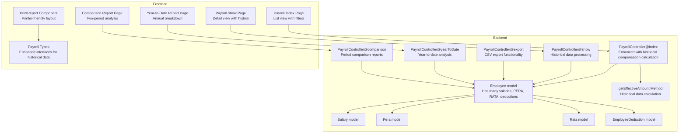

**Diagram sources**
- [PayrollController.php:15-570](file://app/Http/Controllers/PayrollController.php#L15-L570)
- [index.tsx:38-275](file://resources/js/pages/payroll/index.tsx#L38-L275)
- [show.tsx:43-248](file://resources/js/pages/payroll/show.tsx#L43-L248)
- [comparison.tsx:88-490](file://resources/js/pages/payroll/comparison.tsx#L88-L490)
- [year-to-date.tsx:67-325](file://resources/js/pages/payroll/year-to-date.tsx#L67-L325)
- [payroll.d.ts:7-35](file://resources/js/types/payroll.d.ts#L7-L35)

**Section sources**
- [PayrollController.php:15-570](file://app/Http/Controllers/PayrollController.php#L15-L570)
- [index.tsx:38-275](file://resources/js/pages/payroll/index.tsx#L38-L275)
- [show.tsx:43-248](file://resources/js/pages/payroll/show.tsx#L43-L248)
- [comparison.tsx:88-490](file://resources/js/pages/payroll/comparison.tsx#L88-L490)
- [year-to-date.tsx:67-325](file://resources/js/pages/payroll/year-to-date.tsx#L67-L325)
- [payroll.d.ts:7-35](file://resources/js/types/payroll.d.ts#L7-L35)

## Core Components
- **Enhanced Payroll dashboard list view**: Presents a paginated table of employees with computed gross and net pay for selected months/years, filtered by office and search term, with historical compensation calculation capabilities and integrated report generation buttons.
- **Advanced Employee payroll detail view**: Shows current and historical compensation components (salary, PERA, RATA), total deductions, gross pay, net pay, and comprehensive salary change history.
- **CSV Export functionality**: Generates downloadable payroll summaries in CSV format with comprehensive compensation data and totals for selected periods.
- **Year-to-Date analysis reports**: Provides annual breakdown of payroll data with monthly aggregation and cumulative totals for comprehensive yearly analysis.
- **Period comparison reports**: Enables side-by-side comparison of payroll data between two different periods with difference calculations and trend analysis.
- **Sophisticated Printer-friendly Report Generator**: Generates compact, printer-optimized financial statements with historical data processing for specific periods, years, or all-time views.
- **Backend historical aggregation**: Computes derived metrics per employee using historical compensation data, applies filters for pay period, office, and search, with advanced date-based calculations.
- **Frontend filters and formatting**: Provides month/year selectors, office filter, and search input; formats currency and dates with enhanced historical data handling.

Key capabilities:
- **Historical compensation calculation**: Calculate effective compensation amounts for specific periods, years, or current values based on effective dates.
- **CSV export generation**: Comprehensive payroll data export with totals and formatted currency values.
- **Year-to-date analysis**: Monthly breakdown with cumulative totals for annual payroll analysis.
- **Period comparison**: Side-by-side comparison with difference calculations and trend visualization.
- **Printer-friendly report generation**: Compact layout optimized for printing with A4 landscape orientation and reduced styling.
- **Flexible filtering**: Filter by month, year, office, employment status, and employee name with historical data support.
- **Comprehensive historical analysis**: View employee detail with deductions and recent salary history with historical calculations.
- **Computed totals**: Historical gross pay and net pay calculations based on effective compensation data.
- **Advanced report grouping**: Deductions grouped by year-month periods and claims grouped by year for comprehensive financial statements.

**Section sources**
- [PayrollController.php:15-570](file://app/Http/Controllers/PayrollController.php#L15-L570)
- [index.tsx:38-275](file://resources/js/pages/payroll/index.tsx#L38-L275)
- [show.tsx:43-248](file://resources/js/pages/payroll/show.tsx#L43-L248)
- [comparison.tsx:88-490](file://resources/js/pages/payroll/comparison.tsx#L88-L490)
- [year-to-date.tsx:67-325](file://resources/js/pages/payroll/year-to-date.tsx#L67-L325)
- [payroll.d.ts:7-35](file://resources/js/types/payroll.d.ts#L7-L35)

## Architecture Overview
The payroll reporting pipeline connects frontend pages to backend controllers and models with enhanced historical data processing capabilities. The controller queries employees with related compensation and deduction records for selected periods, computes derived values using historical calculations, and passes typed data to the frontend with specialized report generation capabilities.

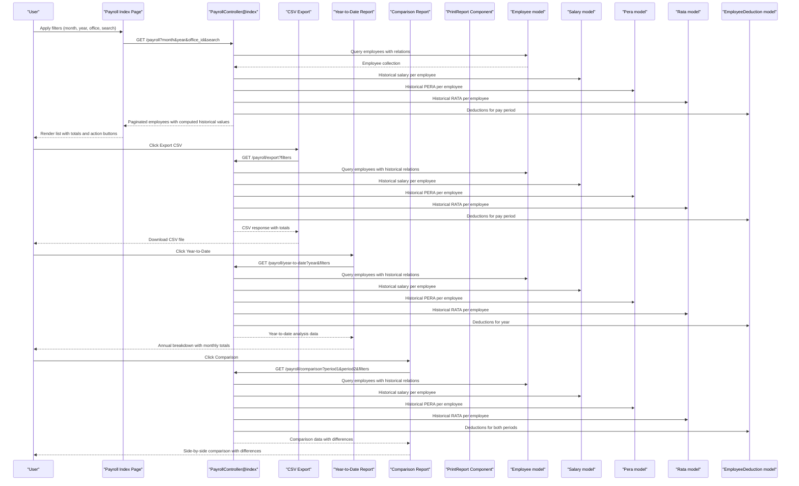

**Diagram sources**
- [index.tsx:162-193](file://resources/js/pages/payroll/index.tsx#L162-L193)
- [PayrollController.php:175-302](file://app/Http/Controllers/PayrollController.php#L175-L302)
- [PayrollController.php:307-424](file://app/Http/Controllers/PayrollController.php#L307-L424)
- [PayrollController.php:429-568](file://app/Http/Controllers/PayrollController.php#L429-L568)
- [Employee.php:46-64](file://app/Models/Employee.php#L46-L64)

## Detailed Component Analysis

### Enhanced Payroll Dashboard List View
The list view displays a filtered and paginated table of employees with compensation and deduction totals for selected pay periods. Users can change the month and year, filter by office and employment status, and search by employee name. The view computes and shows historical gross pay and net pay per row based on effective compensation data, and provides integrated access to all three report types.

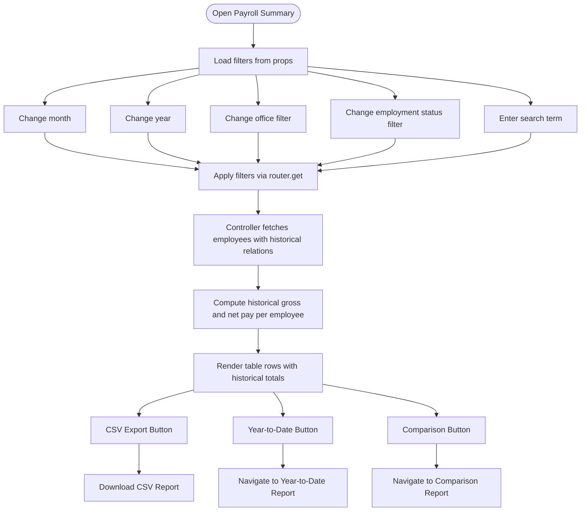

**Diagram sources**
- [index.tsx:72-84](file://resources/js/pages/payroll/index.tsx#L72-L84)
- [PayrollController.php:45-128](file://app/Http/Controllers/PayrollController.php#L45-L128)

**Section sources**
- [index.tsx:38-275](file://resources/js/pages/payroll/index.tsx#L38-L275)
- [index.tsx:162-193](file://resources/js/pages/payroll/index.tsx#L162-L193)
- [PayrollController.php:45-128](file://app/Http/Controllers/PayrollController.php#L45-L128)

### Advanced Employee Payroll Detail View
The detail view shows current and historical compensation components, total deductions, gross pay, and net pay for selected months/years. It also lists deductions applied during that period and comprehensive salary history with effective date tracking.

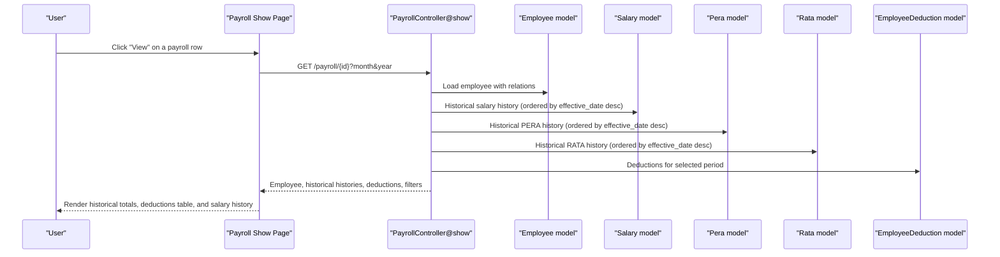

**Diagram sources**
- [show.tsx:61-72](file://resources/js/pages/payroll/show.tsx#L61-L72)
- [PayrollController.php:130-170](file://app/Http/Controllers/PayrollController.php#L130-L170)
- [Employee.php:46-64](file://app/Models/Employee.php#L46-L64)

**Section sources**
- [show.tsx:43-248](file://resources/js/pages/payroll/show.tsx#L43-L248)
- [show.tsx:55-72](file://resources/js/pages/payroll/show.tsx#L55-L72)
- [show.tsx:155-183](file://resources/js/pages/payroll/show.tsx#L155-L183)
- [show.tsx:216-243](file://resources/js/pages/payroll/show.tsx#L216-L243)

### Enhanced Backend Historical Aggregation and Filtering
The backend controller builds queries that:
- Filter employees by optional search term across names and employment status.
- Optionally filter by office and employment status.
- Load historical salary, PERA, and RATA records per employee using effective date calculations.
- Load deductions matching the selected pay period month and year.
- Compute derived values using historical compensation data and pass them to the frontend.
- Support three new report types: CSV export, year-to-date analysis, and period comparison.

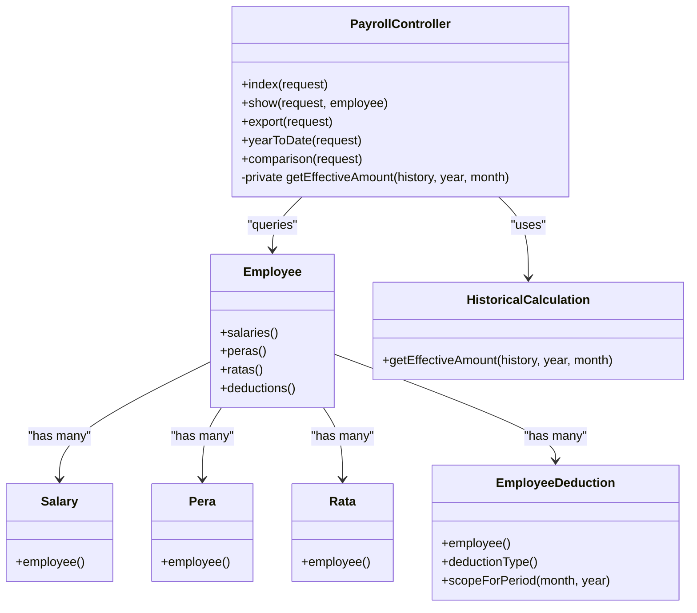

**Diagram sources**
- [PayrollController.php:15-570](file://app/Http/Controllers/PayrollController.php#L15-L570)
- [Employee.php:46-64](file://app/Models/Employee.php#L46-L64)
- [Salary.php:26-29](file://app/Models/Salary.php#L26-L29)
- [Pera.php:22-25](file://app/Models/Pera.php#L22-L25)
- [Rata.php:22-25](file://app/Models/Rata.php#L22-L25)
- [EmployeeDeduction.php:26-34](file://app/Models/EmployeeDeduction.php#L26-L34)

**Section sources**
- [PayrollController.php:45-568](file://app/Http/Controllers/PayrollController.php#L45-L568)
- [Employee.php:46-64](file://app/Models/Employee.php#L46-L64)
- [EmployeeDeduction.php:53-57](file://app/Models/EmployeeDeduction.php#L53-L57)

### Enhanced Data Types and Interfaces
Typed interfaces define the shape of payroll data passed from backend to frontend, ensuring consistent handling of employee payroll summaries and detail views with historical data support.

```mermaid
classDiagram
class PayrollEmployee {
+current_salary : number
+current_pera : number
+current_rata : number
+total_deductions : number
+gross_pay : number
+net_pay : number
+deductions? : EmployeeDeduction[]
}
class PayrollFilters {
+month : number
+year : number
+office_id? : number
+employment_status_id? : number
+search? : string
}
class PayrollShowData {
+employee : Employee
+salaryHistory : Salary[]
+peraHistory : Pera[]
+rataHistory : Rata[]
+deductions : EmployeeDeduction[]
+filters : { month : number; year : number }
}
class ComparisonReportData {
+id : number
+name : string
+position : string
+office : string
+employment_status : string
+is_rata_eligible : boolean
+period1 : PeriodData
+period2 : PeriodData
+differences : Differences
}
class YearToDateData {
+id : number
+name : string
+position : string
+office : string
+employment_status : string
+is_rata_eligible : boolean
+monthly_data : MonthlyData[]
+totals : Totals
}
class PeriodData {
+month : number
+year : number
+salary : number
+pera : number
+rata : number
+gross_pay : number
+deductions : number
+net_pay : number
}
class MonthlyData {
+month : number
+salary : number
+pera : number
+rata : number
+gross_pay : number
+deductions : number
+net_pay : number
}
```

**Diagram sources**
- [payroll.d.ts:7-35](file://resources/js/types/payroll.d.ts#L7-L35)
- [employee.d.ts:8-29](file://resources/js/types/employee.d.ts#L8-L29)

**Section sources**
- [payroll.d.ts:7-35](file://resources/js/types/payroll.d.ts#L7-L35)
- [employee.d.ts:8-29](file://resources/js/types/employee.d.ts#L8-L29)

### Navigation and Access
The navigation menu exposes the Payroll module with links to the payroll summary page and related report sections.

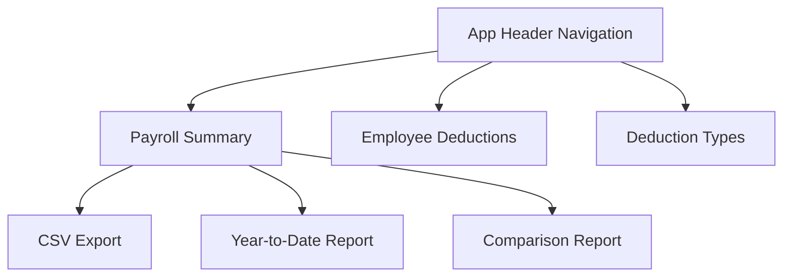

**Diagram sources**
- [app-header.tsx:24-42](file://resources/js/components/app-header.tsx#L24-L42)

**Section sources**
- [app-header.tsx:24-42](file://resources/js/components/app-header.tsx#L24-L42)

## Enhanced Historical Compensation Calculation

### Historical Data Processing Engine
The system now includes sophisticated historical compensation calculation capabilities through the `getEffectiveAmount` method, which determines the appropriate compensation amount for a given period based on effective dates.


**Diagram sources**
- [PayrollController.php:18-44](file://app/Http/Controllers/PayrollController.php#L18-L44)

### Historical Data Handling in Reports
The report components extend historical calculation capabilities to generate comprehensive financial statements with printer-friendly layouts.

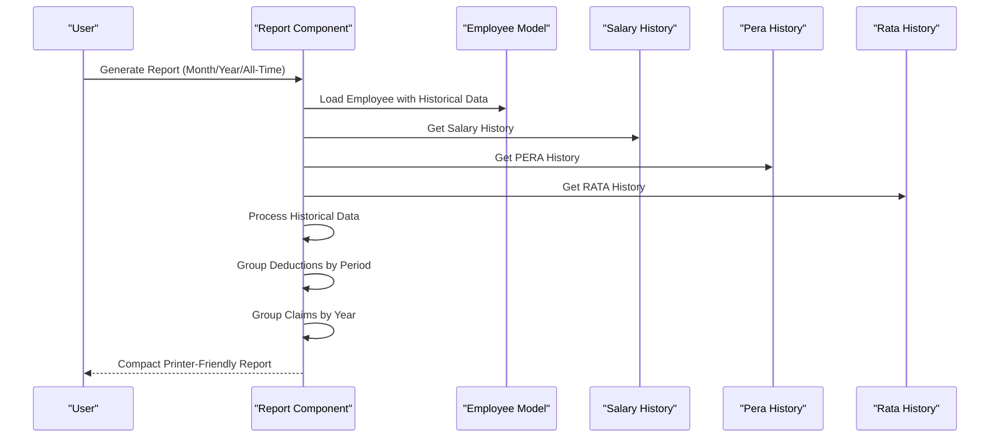

**Diagram sources**
- [comparison.tsx:125-144](file://resources/js/pages/payroll/comparison.tsx#L125-L144)
- [year-to-date.tsx:98-103](file://resources/js/pages/payroll/year-to-date.tsx#L98-L103)
- [PayrollController.php:18-44](file://app/Http/Controllers/PayrollController.php#L18-L44)

**Section sources**
- [PayrollController.php:18-44](file://app/Http/Controllers/PayrollController.php#L18-L44)
- [comparison.tsx:125-144](file://resources/js/pages/payroll/comparison.tsx#L125-L144)
- [year-to-date.tsx:98-103](file://resources/js/pages/payroll/year-to-date.tsx#L98-L103)

## CSV Export Functionality

### Comprehensive CSV Generation
The CSV export functionality provides downloadable payroll summaries with comprehensive compensation data and totals for selected periods.

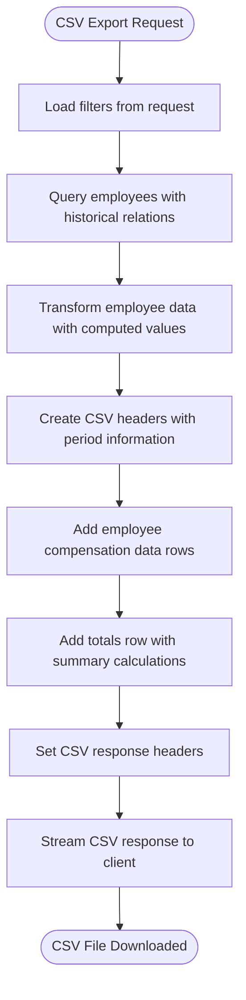

**Diagram sources**
- [PayrollController.php:175-302](file://app/Http/Controllers/PayrollController.php#L175-L302)

### CSV Data Structure and Formatting
The CSV export includes comprehensive payroll data with proper formatting and totals calculation.

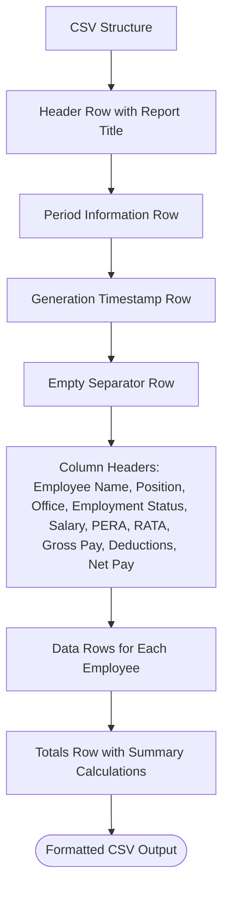

**Diagram sources**
- [PayrollController.php:246-301](file://app/Http/Controllers/PayrollController.php#L246-L301)

**Section sources**
- [PayrollController.php:175-302](file://app/Http/Controllers/PayrollController.php#L175-L302)
- [index.tsx:162-178](file://resources/js/pages/payroll/index.tsx#L162-L178)

## Year-to-Date Analysis Reports

### Annual Payroll Analysis
The year-to-date report provides comprehensive annual breakdown of payroll data with monthly aggregation and cumulative totals for detailed yearly analysis.

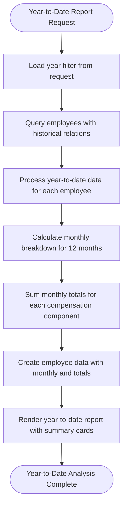

**Diagram sources**
- [PayrollController.php:307-424](file://app/Http/Controllers/PayrollController.php#L307-L424)

### Monthly Breakdown and Totals
The year-to-date report calculates monthly payroll data with comprehensive totals for each employee and the organization.

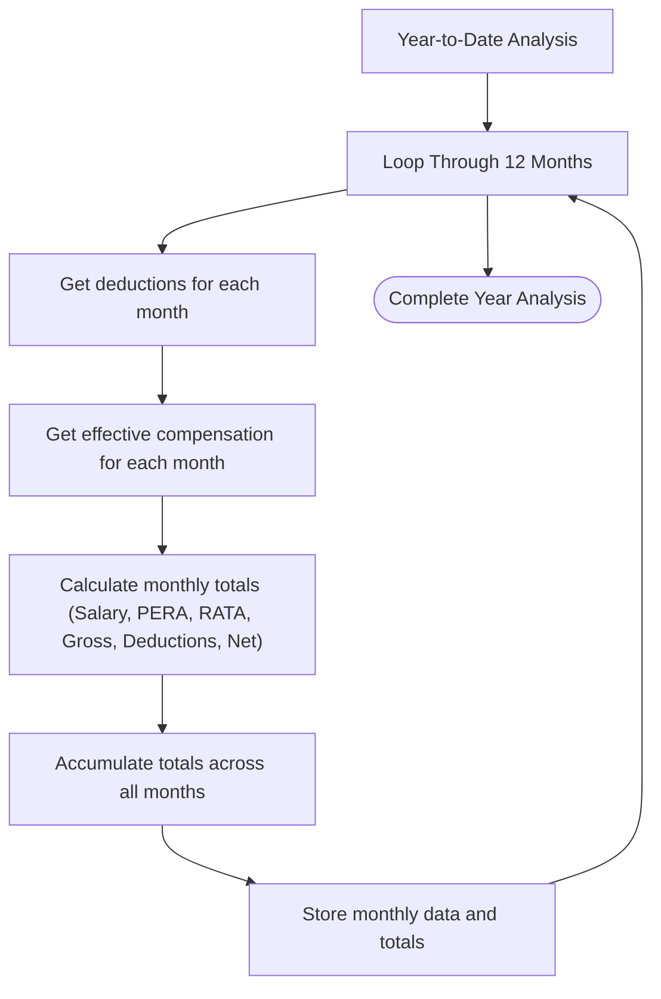

**Diagram sources**
- [PayrollController.php:362-408](file://app/Http/Controllers/PayrollController.php#L362-L408)

**Section sources**
- [PayrollController.php:307-424](file://app/Http/Controllers/PayrollController.php#L307-L424)
- [year-to-date.tsx:67-325](file://resources/js/pages/payroll/year-to-date.tsx#L67-L325)

## Period Comparison Reports

### Two-Period Analysis
The comparison report enables side-by-side comparison of payroll data between two different periods with difference calculations and trend analysis.

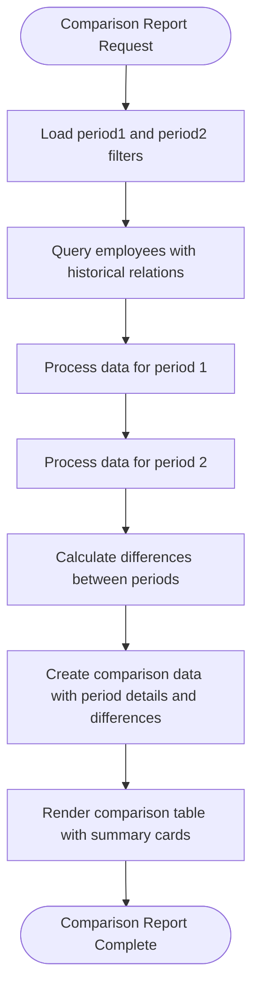

**Diagram sources**
- [PayrollController.php:429-568](file://app/Http/Controllers/PayrollController.php#L429-L568)

### Comparative Analysis and Visualization
The comparison report provides comprehensive side-by-side analysis with difference calculations and trend indicators.

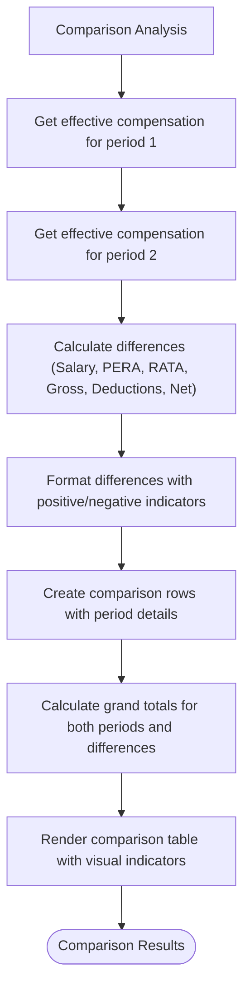

**Diagram sources**
- [PayrollController.php:456-549](file://app/Http/Controllers/PayrollController.php#L456-L549)

**Section sources**
- [PayrollController.php:429-568](file://app/Http/Controllers/PayrollController.php#L429-L568)
- [comparison.tsx:88-490](file://resources/js/pages/payroll/comparison.tsx#L88-L490)

## Printer-Friendly Report Generation

### Compact Report Layout Design
The PrintReport component generates printer-optimized financial statements with a compact, two-column layout designed for A4 landscape printing.


**Diagram sources**
- [PrintReport.tsx:140-376](file://resources/js/pages/Employees/Manage/PrintReport.tsx#L140-L376)

### Historical Data Processing for Reports
The component processes historical compensation data to ensure accurate financial statements for specific periods or years.

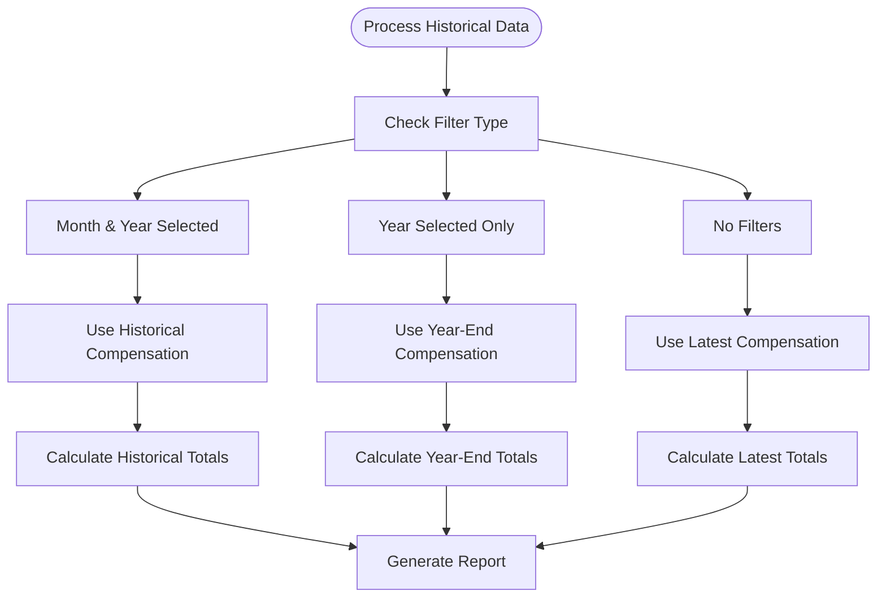

**Diagram sources**
- [PrintReport.tsx:95-117](file://resources/js/pages/Employees/Manage/PrintReport.tsx#L95-L117)

**Section sources**
- [PrintReport.tsx:140-376](file://resources/js/pages/Employees/Manage/PrintReport.tsx#L140-L376)
- [PrintReport.tsx:95-117](file://resources/js/pages/Employees/Manage/PrintReport.tsx#L95-L117)

## Enhanced UI Components and Interactions

### Integrated Report Generation Buttons
The payroll index page now includes integrated buttons for accessing all three report types directly from the main dashboard.

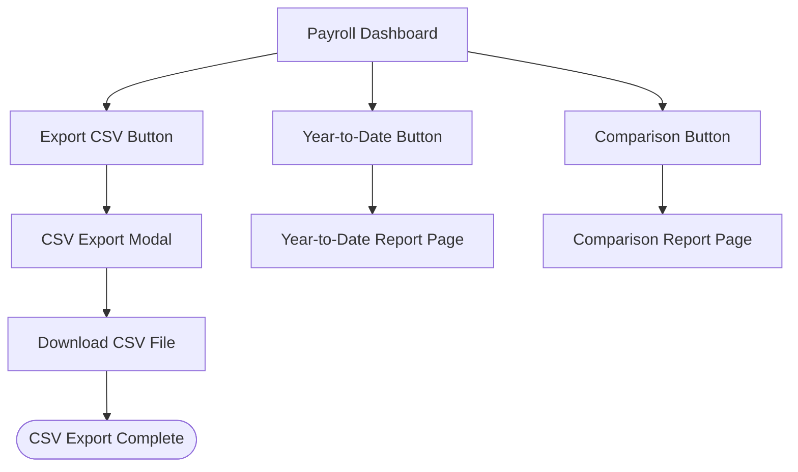

**Diagram sources**
- [index.tsx:162-193](file://resources/js/pages/payroll/index.tsx#L162-L193)

### Comparison Report Interface
The comparison report provides a comprehensive side-by-side analysis with visual indicators for differences and summary cards for quick insights.

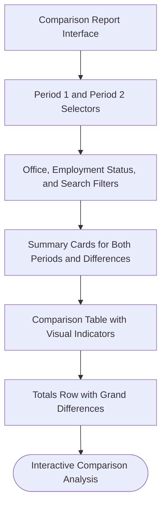

**Diagram sources**
- [comparison.tsx:183-240](file://resources/js/pages/payroll/comparison.tsx#L183-L240)

### Year-to-Date Report Interface
The year-to-date report provides annual breakdown with monthly aggregation and comprehensive summary cards.

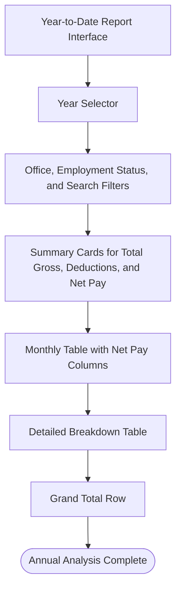

**Diagram sources**
- [year-to-date.tsx:118-159](file://resources/js/pages/payroll/year-to-date.tsx#L118-L159)

**Section sources**
- [index.tsx:162-193](file://resources/js/pages/payroll/index.tsx#L162-L193)
- [comparison.tsx:88-490](file://resources/js/pages/payroll/comparison.tsx#L88-L490)
- [year-to-date.tsx:67-325](file://resources/js/pages/payroll/year-to-date.tsx#L67-L325)

## Dependency Analysis
- The frontend pages depend on the backend controller for data and typed interfaces with historical data support.
- The controller depends on the Employee model and related models for aggregations with historical calculations.
- The Employee model encapsulates relationships to Salary, Pera, Rata, and EmployeeDeduction with historical data support.
- The EmployeeDeduction model includes a scope for filtering by pay period.
- The PrintReport component depends on enhanced historical calculation methods and printer-friendly styling.
- The new report components (comparison.tsx, year-to-date.tsx) depend on the enhanced PayrollController methods.

```mermaid
graph LR
IDX["Payroll Index Page"] --> CTRL["PayrollController"]
SHW["Payroll Show Page"] --> CTRL
CMP["Comparison Report Page"] --> CTRL
YTD["Year-to-Date Report Page"] --> CTRL
EXP["CSV Export"] --> CTRL
CTRL --> EMP["Employee model"]
EMP --> SAL["Salary model"]
EMP --> PER["Pera model"]
EMP --> RAT["Rata model"]
EMP --> EMD["EmployeeDeduction model"]
CMP --> COMPARISON_TYPES["Comparison Data Types"]
YTD --> YTD_TYPES["Year-to-Date Data Types"]
EXP --> CSV_RESPONSE["CSV Response"]
```

**Diagram sources**
- [index.tsx:38-275](file://resources/js/pages/payroll/index.tsx#L38-L275)
- [show.tsx:43-248](file://resources/js/pages/payroll/show.tsx#L43-L248)
- [comparison.tsx:88-490](file://resources/js/pages/payroll/comparison.tsx#L88-L490)
- [year-to-date.tsx:67-325](file://resources/js/pages/payroll/year-to-date.tsx#L67-L325)
- [PayrollController.php:15-570](file://app/Http/Controllers/PayrollController.php#L15-L570)
- [Employee.php:46-64](file://app/Models/Employee.php#L46-L64)

**Section sources**
- [PayrollController.php:15-570](file://app/Http/Controllers/PayrollController.php#L15-L570)
- [Employee.php:46-64](file://app/Models/Employee.php#L46-L64)

## Performance Considerations
- **Efficient historical querying**: The controller uses with() to load related records with historical date filtering to avoid N+1 queries.
- **Pagination**: Employees are paginated to limit payload size even with historical data processing.
- **Filtering**: Query-time filtering reduces server-side computation and client rendering overhead.
- **Derived computations**: Totals are computed server-side using historical data and sent to the frontend to minimize client-side work.
- **CSV streaming**: The export functionality uses streamed responses to handle large datasets efficiently.
- **Printer optimization**: The PrintReport component uses efficient grouping algorithms for deductions and claims data.
- **Memory management**: Historical data processing uses optimized sorting and filtering for large datasets.
- **Report-specific optimizations**: Each report type optimizes data processing for its specific use case.

Recommendations:
- Add database indexes on frequently filtered columns (e.g., office_id, effective_date, pay_period_month, pay_period_year).
- Consider caching historical compensation calculations for frequently accessed periods.
- Optimize frontend rendering for large datasets by virtualizing long lists.
- Implement lazy loading for historical data in the PrintReport component.
- Add pagination support for the comparison and year-to-date reports for large organizations.
- Consider implementing background jobs for CSV exports of large datasets.

**Section sources**
- [PayrollController.php:45-568](file://app/Http/Controllers/PayrollController.php#L45-L568)
- [Employee.php:69-88](file://app/Models/Employee.php#L69-L88)
- [PayrollController.php:175-302](file://app/Http/Controllers/PayrollController.php#L175-L302)

## Troubleshooting Guide
Common issues and resolutions:
- **No employees found**: Verify filters (month, year, office, employment status, search) and ensure data exists for the selected pay period.
- **Net pay shows zero**: Confirm that deductions exist for the selected month/year and that historical salary/PERA/RATA amounts are present.
- **Incorrect historical totals**: Check that the `getEffectiveAmount` method correctly identifies the most recent record effective before or during the selected period.
- **CSV export fails**: Verify that the export endpoint is accessible and that the dataset is not too large for memory constraints.
- **Comparison report empty**: Ensure both comparison periods have valid data and that employees have historical records for both periods.
- **Year-to-date report incomplete**: Check that historical data exists for the selected year and that employees have compensation records.
- **Formatting issues**: Ensure currency and date formatting functions are applied consistently across views and reports.
- **Print layout problems**: Verify that printer styles are properly applied and that the A4 landscape orientation is correctly configured.

Audit trail and compliance:
- **Creation metadata**: Models capture created_by for auditability. Use this to track who created records.
- **Effective dates**: Salary, PERA, and RATA records include effective_date to support compliance timelines and historical calculations.
- **Deduction period**: EmployeeDeduction includes pay_period_month and pay_period_year to align with regulatory reporting periods.
- **Historical accuracy**: The `getEffectiveAmount` method ensures compliance with effective date-based calculations for historical reporting.
- **Report integrity**: CSV exports maintain data integrity with proper formatting and totals calculation.

Export capabilities:
- **CSV export**: Comprehensive payroll data export with totals and formatted currency values.
- **Future enhancements**: Consider adding XLSX export format and PDF report generation.
- **Report scheduling**: Implement recurring report generation with configurable intervals.
- **Saved filters**: Allow users to save commonly used filter combinations for report generation.

Saved filters and recurring scheduling:
- **Current state**: Filters are maintained in the frontend form state and appended to the URL query string.
- **Recommended approach**: Persist filters to user preferences and schedule recurring reports via a background job system.
- **Report templates**: Allow users to create and save report templates with predefined filters and formatting options.

**Section sources**
- [Employee.php:41-44](file://app/Models/Employee.php#L41-L44)
- [Salary.php:31-34](file://app/Models/Salary.php#L31-L34)
- [Pera.php:27-30](file://app/Models/Pera.php#L27-L30)
- [Rata.php:27-30](file://app/Models/Rata.php#L27-L30)
- [EmployeeDeduction.php:36-39](file://app/Models/EmployeeDeduction.php#L36-L39)
- [PayrollController.php:18-44](file://app/Http/Controllers/PayrollController.php#L18-L44)

## Conclusion
The enhanced payroll reporting and analytics implementation provides a comprehensive foundation for viewing and analyzing employee compensation and deductions with sophisticated historical calculation capabilities. The backend efficiently aggregates historical data for selected pay periods, while the frontend offers intuitive filtering, computed totals, and detailed views. The addition of three new report types - CSV export functionality, year-to-date analysis, and period comparison reports - significantly expands the system's analytical capabilities. The new PayrollController methods provide advanced filtering, historical data processing, and specialized report generation. The system now supports comprehensive historical analysis, flexible reporting options, and compliance-ready financial statements. Future enhancements could include additional export formats, saved filters, recurring report scheduling, and advanced analytics dashboards with interactive visualizations.

## Appendices

### Enhanced UI Components and Interactions
- **Payroll Summary list view**: Month/year selectors, office filter, employment status filter, search input, and a paginated table with computed historical totals and integrated report generation buttons.
- **Employee detail view**: Period selector, summary cards for historical compensation and totals, deductions table, and comprehensive salary history.
- **Comparison report page**: Dual period selectors, comprehensive filtering, summary cards, and detailed comparison table with visual indicators.
- **Year-to-date report page**: Year selector, filtering controls, summary cards, monthly breakdown table, and detailed breakdown with totals.
- **CSV export functionality**: Integrated export button with comprehensive data download capability.
- **Printer-friendly report generator**: Compact layout optimized for A4 landscape printing with historical data processing for specific periods, years, or all-time views.
- **Currency and date formatting**: Consistent formatting for Philippine Peso and localized date display across all views and reports.

**Section sources**
- [index.tsx:87-139](file://resources/js/pages/payroll/index.tsx#L87-L139)
- [index.tsx:141-216](file://resources/js/pages/payroll/index.tsx#L141-L216)
- [show.tsx:131-153](file://resources/js/pages/payroll/show.tsx#L131-L153)
- [show.tsx:155-183](file://resources/js/pages/payroll/show.tsx#L155-L183)
- [show.tsx:185-214](file://resources/js/pages/payroll/show.tsx#L185-L214)
- [show.tsx:216-243](file://resources/js/pages/payroll/show.tsx#L216-L243)
- [comparison.tsx:183-240](file://resources/js/pages/payroll/comparison.tsx#L183-L240)
- [year-to-date.tsx:118-159](file://resources/js/pages/payroll/year-to-date.tsx#L118-L159)
- [PayrollController.php:175-302](file://app/Http/Controllers/PayrollController.php#L175-L302)

### Historical Data Processing Methods
- **getEffectiveAmount**: Determines the appropriate compensation amount for a given period based on effective dates.
- **Historical grouping**: Groups deductions by year-month periods and claims by year for comprehensive financial statements.
- **Printer-friendly formatting**: Optimizes report layout for printing with reduced styling and compact data presentation.
- **CSV data transformation**: Converts historical payroll data to CSV format with proper headers and totals.
- **Year-to-date aggregation**: Processes historical data for annual analysis with monthly breakdown and cumulative totals.
- **Period comparison calculation**: Calculates differences between two periods with comprehensive compensation analysis.

**Section sources**
- [PayrollController.php:18-44](file://app/Http/Controllers/PayrollController.php#L18-L44)
- [PayrollController.php:175-302](file://app/Http/Controllers/PayrollController.php#L175-L302)
- [PayrollController.php:307-424](file://app/Http/Controllers/PayrollController.php#L307-L424)
- [PayrollController.php:429-568](file://app/Http/Controllers/PayrollController.php#L429-L568)

### Route Definitions and Report Access
- **Payroll routes**: `/payroll` (summary), `/payroll/export` (CSV), `/payroll/year-to-date` (annual analysis), `/payroll/comparison` (period comparison)
- **Report access points**: Direct buttons from payroll dashboard leading to specialized report pages
- **Filter persistence**: Report filters maintain state across different report types
- **Integration points**: Reports share common filtering mechanisms and data sources

**Section sources**
- [web.php:45-52](file://routes/web.php#L45-L52)
- [index.tsx:162-193](file://resources/js/pages/payroll/index.tsx#L162-L193)