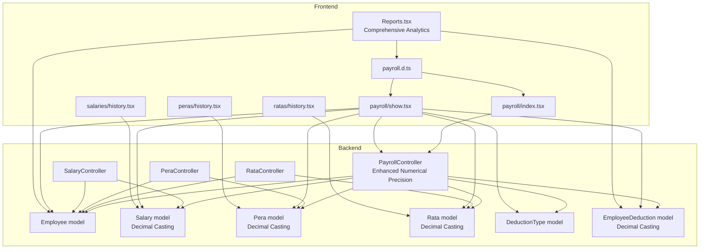
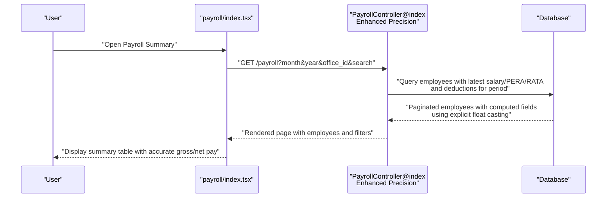
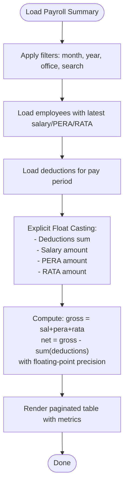
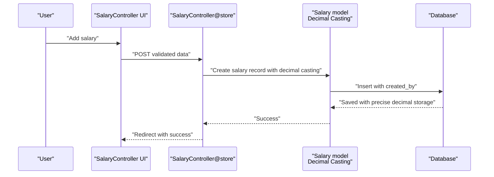
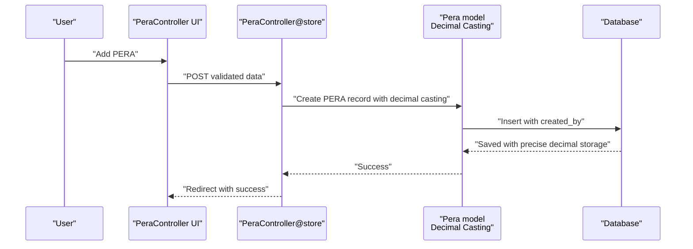
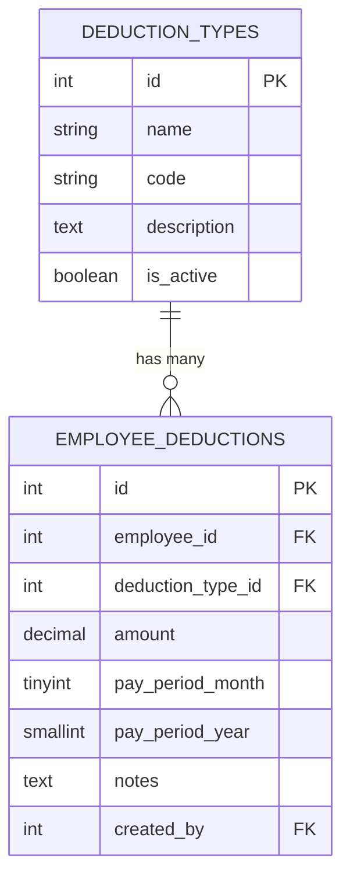
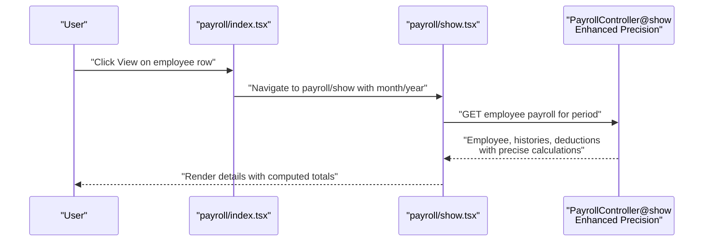
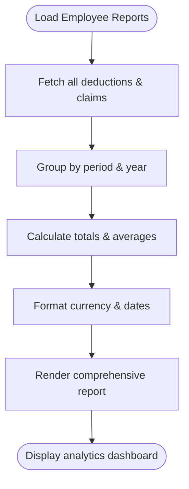
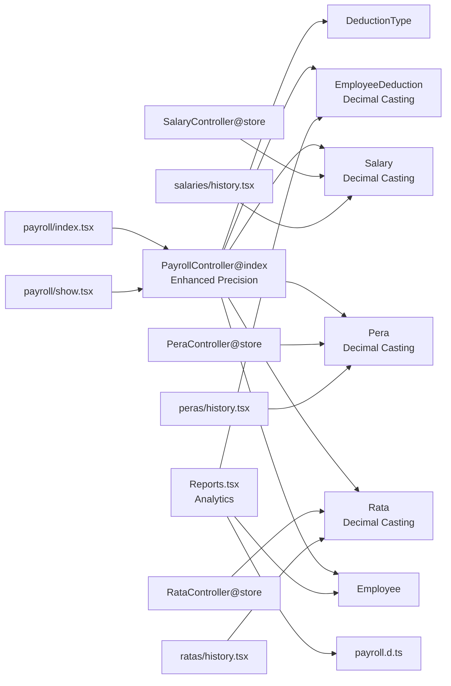

# Payroll System

<cite>
**Referenced Files in This Document**
- [PayrollController.php](file://app/Http/Controllers/PayrollController.php)
- [RataController.php](file://app/Http/Controllers/RataController.php)
- [PeraController.php](file://app/Http/Controllers/PeraController.php)
- [SalaryController.php](file://app/Http/Controllers/SalaryController.php)
- [Pera.php](file://app/Models/Pera.php)
- [Rata.php](file://app/Models/Rata.php)
- [Salary.php](file://app/Models/Salary.php)
- [Employee.php](file://app/Models/Employee.php)
- [DeductionType.php](file://app/Models/DeductionType.php)
- [EmployeeDeduction.php](file://app/Models/EmployeeDeduction.php)
- [payroll/index.tsx](file://resources/js/pages/payroll/index.tsx)
- [payroll/show.tsx](file://resources/js/pages/payroll/show.tsx)
- [payroll.d.ts](file://resources/js/types/payroll.d.ts)
- [2026_03_22_115109_create_peras_table.php](file://database/migrations/2026_03_22_115109_create_peras_table.php)
- [2026_03_22_115111_create_ratas_table.php](file://database/migrations/2026_03_22_115111_create_ratas_table.php)
- [2026_03_22_115112_create_employee_deductions_table.php](file://database/migrations/2026_03_22_115112_create_employee_deductions_table.php)
- [2026_03_23_084856_create_salaries_table.php](file://database/migrations/2026_03_23_084856_create_salaries_table.php)
- [Reports.tsx](file://resources/js/pages/Employees/Manage/Reports.tsx)
- [salaries/history.tsx](file://resources/js/pages/salaries/history.tsx)
- [peras/history.tsx](file://resources/js/pages/peras/history.tsx)
- [ratas/history.tsx](file://resources/js/pages/ratas/history.tsx)
</cite>

## Update Summary
**Changes Made**
- Enhanced salary management functionality with new dedicated salaries table migration
- Improved payroll computation engine with enhanced numerical precision handling
- Updated payroll reports & analytics with comprehensive employee reporting capabilities
- Modernized frontend components with enhanced UI/UX for payroll management
- Added comprehensive reporting features for deductions and claims analysis

## Table of Contents
1. [Introduction](#introduction)
2. [Project Structure](#project-structure)
3. [Core Components](#core-components)
4. [Architecture Overview](#architecture-overview)
5. [Detailed Component Analysis](#detailed-component-analysis)
6. [Enhanced Salary Management](#enhanced-salary-management)
7. [Improved Payroll Computation Engine](#improved-payroll-computation-engine)
8. [Advanced Payroll Reports & Analytics](#advanced-payroll-reports--analytics)
9. [Numerical Precision Improvements](#numerical-precision-improvements)
10. [Dependency Analysis](#dependency-analysis)
11. [Performance Considerations](#performance-considerations)
12. [Troubleshooting Guide](#troubleshooting-guide)
13. [Conclusion](#conclusion)
14. [Appendices](#appendices)

## Introduction
This document describes the payroll system that computes employee compensation, manages payments, and maintains administrative records. It covers the salary structure, payment types (PERA and RATA), deduction management, payroll computation algorithms, tax calculations, benefit deductions, payroll generation, payment tracking, historical records, salary adjustments, payment scheduling, payroll reporting, compliance, audit trails, and the user interface for payroll management, batch processing, and payment distribution.

**Updated** Enhanced with modernized salary management functionality, improved payroll computation engine, and comprehensive payroll reports & analytics capabilities.

## Project Structure
The payroll system is implemented as a Laravel backend with Inertia.js frontend:
- Backend controllers orchestrate payroll queries and transformations with enhanced numerical precision.
- Eloquent models define the data schema and relationships for employees, salaries, PERA, RATA, and deductions with decimal casting.
- Frontend pages render payroll summaries, details, and related histories with currency formatting.
- Migrations define database schemas for payroll entities with precise monetary storage.
- Advanced reporting components provide comprehensive analytics and historical analysis.



**Diagram sources**
- [PayrollController.php:11-133](file://app/Http/Controllers/PayrollController.php#L11-L133)
- [RataController.php:11-74](file://app/Http/Controllers/RataController.php#L11-L74)
- [PeraController.php:11-73](file://app/Http/Controllers/PeraController.php#L11-L73)
- [SalaryController.php:11-73](file://app/Http/Controllers/SalaryController.php#L11-L73)
- [Employee.php:10-104](file://app/Models/Employee.php#L10-L104)
- [Salary.php:20-24](file://app/Models/Salary.php#L20-L24)
- [Pera.php:17-20](file://app/Models/Pera.php#L17-L20)
- [Rata.php:17-20](file://app/Models/Rata.php#L17-L20)
- [DeductionType.php:7-32](file://app/Models/DeductionType.php#L7-L32)
- [EmployeeDeduction.php:20-24](file://app/Models/EmployeeDeduction.php#L20-L24)
- [payroll/index.tsx:49-217](file://resources/js/pages/payroll/index.tsx#L49-L217)
- [payroll/show.tsx:55-248](file://resources/js/pages/payroll/show.tsx#L55-L248)
- [payroll.d.ts:7-35](file://resources/js/types/payroll.d.ts#L7-L35)
- [Reports.tsx:35-248](file://resources/js/pages/Employees/Manage/Reports.tsx#L35-L248)
- [salaries/history.tsx:26-104](file://resources/js/pages/salaries/history.tsx#L26-L104)
- [peras/history.tsx:26-104](file://resources/js/pages/peras/history.tsx#L26-L104)
- [ratas/history.tsx:26-104](file://resources/js/pages/ratas/history.tsx#L26-L104)

**Section sources**
- [PayrollController.php:13-133](file://app/Http/Controllers/PayrollController.php#L13-L133)
- [payroll/index.tsx:49-217](file://resources/js/pages/payroll/index.tsx#L49-L217)
- [payroll/show.tsx:55-248](file://resources/js/pages/payroll/show.tsx#L55-L248)
- [Reports.tsx:35-248](file://resources/js/pages/Employees/Manage/Reports.tsx#L35-L248)

## Core Components
- Payroll computation aggregates salary, PERA, and RATA amounts per employee for a given pay period, subtracts total deductions to compute net pay with enhanced numerical precision.
- Enhanced salary management supports adding/removing salary records with effective dates and soft-deletion using decimal casting for monetary accuracy.
- PERA and RATA management supports adding/removing payment records with effective dates and eligibility filtering with precise decimal storage.
- Deduction management stores period-specific deductions linked to deduction types and tracks creators with decimal precision.
- Comprehensive reporting provides detailed analytics on deductions, claims, and employee compensation trends.
- UI provides payroll summary and detail views with filtering, currency formatting, and pagination.

**Updated** Enhanced with modernized salary management functionality and advanced reporting capabilities for comprehensive payroll analytics.

Key computations with precision improvements:
- Gross pay = current salary + current PERA + current RATA (explicitly cast to float)
- Net pay = gross pay − total deductions (accurate floating-point arithmetic)
- Deductions are filtered by pay period month and year with precise aggregation

**Section sources**
- [PayrollController.php:54-72](file://app/Http/Controllers/PayrollController.php#L54-L72)
- [payroll/index.tsx:70-79](file://resources/js/pages/payroll/index.tsx#L70-L79)
- [payroll/show.tsx:74-79](file://resources/js/pages/payroll/show.tsx#L74-L79)

## Architecture Overview
The system follows a layered architecture with enhanced numerical precision:
- Presentation layer: Inertia.js pages for payroll summary and detail with currency formatting.
- Application layer: Controllers handle requests, apply filters, load related data, and compute payroll metrics with explicit float casting for accuracy.
- Domain layer: Eloquent models encapsulate business entities and relationships with decimal casting for monetary precision.
- Data layer: Migrations define normalized schemas with appropriate constraints and decimal precision.



**Diagram sources**
- [payroll/index.tsx:49-80](file://resources/js/pages/payroll/index.tsx#L49-L80)
- [PayrollController.php:13-89](file://app/Http/Controllers/PayrollController.php#L13-L89)

## Detailed Component Analysis

### Enhanced Payroll Computation Engine
The controller aggregates employee compensation and deductions for a selected pay period with enhanced numerical precision:
- Filters employees by optional search and office.
- Loads latest salary, PERA, and RATA records per employee.
- Loads deductions matching the pay period month and year.
- Computes totals using explicit float casting for monetary accuracy.
- Renders paginated results with precise calculations.

**Updated** Enhanced with explicit float casting for all monetary calculations ensuring mathematical precision in gross pay, net pay, and deduction aggregations.



**Diagram sources**
- [PayrollController.php:20-72](file://app/Http/Controllers/PayrollController.php#L20-L72)

**Section sources**
- [PayrollController.php:13-133](file://app/Http/Controllers/PayrollController.php#L13-L133)
- [payroll/index.tsx:138-213](file://resources/js/pages/payroll/index.tsx#L138-L213)

### Enhanced Salary Management
- Adds new salary records with amount, effective date, and creator tracking using decimal casting for monetary precision.
- Soft-deletes salary records.
- Provides comprehensive history view with creator attribution and detailed audit trail.
- Supports effective date management and salary adjustment tracking.

**Updated** Modernized with dedicated salaries table migration and enhanced history tracking capabilities.



**Diagram sources**
- [SalaryController.php:49-65](file://app/Http/Controllers/SalaryController.php#L49-L65)
- [Salary.php:20-24](file://app/Models/Salary.php#L20-L24)

**Section sources**
- [SalaryController.php:13-73](file://app/Http/Controllers/SalaryController.php#L13-L73)
- [Salary.php:8-36](file://app/Models/Salary.php#L8-L36)
- [salaries/history.tsx:26-104](file://resources/js/pages/salaries/history.tsx#L26-L104)

### PERA Management
- Adds PERA payments with amount, effective date, and creator using decimal casting for monetary precision.
- Removes PERA records.
- Lists eligible employees and shows PERA history.



**Diagram sources**
- [PeraController.php:49-65](file://app/Http/Controllers/PeraController.php#L49-L65)
- [Pera.php:17-20](file://app/Models/Pera.php#L17-L20)

**Section sources**
- [PeraController.php:13-73](file://app/Http/Controllers/PeraController.php#L13-L73)
- [Pera.php:8-41](file://app/Models/Pera.php#L8-L41)
- [peras/history.tsx:26-104](file://resources/js/pages/peras/history.tsx#L26-L104)

### RATA Management
- Adds RATA payments with amount, effective date, and creator using decimal casting for monetary precision.
- Removes RATA records.
- Lists RATA-eligible employees and shows RATA history.


**Diagram sources**
- [RataController.php:50-66](file://app/Http/Controllers/RataController.php#L50-L66)
- [Rata.php:17-20](file://app/Models/Rata.php#L17-L20)

**Section sources**
- [RataController.php:13-74](file://app/Http/Controllers/RataController.php#L13-L74)
- [Rata.php:8-41](file://app/Models/Rata.php#L8-L41)
- [ratas/history.tsx:26-104](file://resources/js/pages/ratas/history.tsx#L26-L104)

### Deduction Management
- Stores period-specific deductions with amount, pay period month/year, notes, and creator using decimal casting for monetary precision.
- Prevents duplicate deductions via a unique composite index.
- Supports active deduction types and creator attribution.



**Diagram sources**
- [DeductionType.php:7-32](file://app/Models/DeductionType.php#L7-L32)
- [EmployeeDeduction.php:20-24](file://app/Models/EmployeeDeduction.php#L20-L24)
- [2026_03_22_115112_create_employee_deductions_table.php:14-27](file://database/migrations/2026_03_22_115112_create_employee_deductions_table.php#L14-L27)

**Section sources**
- [EmployeeDeduction.php:10-59](file://app/Models/EmployeeDeduction.php#L10-L59)
- [DeductionType.php:9-32](file://app/Models/DeductionType.php#L9-L32)

### Data Models and Relationships
```mermaid
classDiagram
class Employee {
+int id
+string first_name
+string last_name
+string position
+bool is_rata_eligible
+int employment_status_id
+int office_id
+int created_by
+string image_path
+salaries()
+peras()
+ratas()
+deductions()
+latestSalary()
+latestPera()
+latestRata()
}
class Salary {
+int id
+int employee_id
+decimal amount
+date effective_date
+date end_date
+int created_by
+employee()
+createdBy()
}
class Pera {
+int id
+int employee_id
+decimal amount
+date effective_date
+int created_by
+employee()
+createdBy()
}
class Rata {
+int id
+int employee_id
+decimal amount
+date effective_date
+int created_by
+employee()
+createdBy()
}
class DeductionType {
+int id
+string name
+string code
+string description
+bool is_active
+employeeDeductions()
}
class EmployeeDeduction {
+int id
+int employee_id
+int deduction_type_id
+decimal amount
+int pay_period_month
+int pay_period_year
+string notes
+int created_by
+employee()
+deductionType()
+createdBy()
}
Employee "1" --o{ Salary : "has many"
Employee "1" --o{ Pera : "has many"
Employee "1" --o{ Rata : "has many"
Employee "1" --o{ EmployeeDeduction : "has many"
DeductionType "1" --o{ EmployeeDeduction : "has many"
```

**Diagram sources**
- [Employee.php:46-88](file://app/Models/Employee.php#L46-L88)
- [Salary.php:26-36](file://app/Models/Salary.php#L26-L36)
- [Pera.php:22-41](file://app/Models/Pera.php#L22-L41)
- [Rata.php:22-41](file://app/Models/Rata.php#L22-L41)
- [DeductionType.php:20-23](file://app/Models/DeductionType.php#L20-L23)
- [EmployeeDeduction.php:26-59](file://app/Models/EmployeeDeduction.php#L26-L59)

**Section sources**
- [Employee.php:10-104](file://app/Models/Employee.php#L10-L104)
- [Salary.php:8-36](file://app/Models/Salary.php#L8-L36)
- [Pera.php:8-41](file://app/Models/Pera.php#L8-L41)
- [Rata.php:8-41](file://app/Models/Rata.php#L8-L41)
- [DeductionType.php:7-32](file://app/Models/DeductionType.php#L7-L32)
- [EmployeeDeduction.php:8-59](file://app/Models/EmployeeDeduction.php#L8-L59)

### Payroll UI Components
- Payroll Summary: Filters by month, year, office, and search; displays computed gross and net pay per employee with enhanced precision.
- Payroll Details: Shows salary, PERA, RATA, total deductions, and net pay for a selected period; includes history tables with accurate currency formatting.
- Enhanced Reports: Comprehensive analytics showing deduction trends, claim analysis, and employee compensation insights.



**Diagram sources**
- [payroll/index.tsx:189-199](file://resources/js/pages/payroll/index.tsx#L189-L199)
- [payroll/show.tsx:61-72](file://resources/js/pages/payroll/show.tsx#L61-L72)
- [PayrollController.php:91-133](file://app/Http/Controllers/PayrollController.php#L91-L133)

**Section sources**
- [payroll/index.tsx:49-248](file://resources/js/pages/payroll/index.tsx#L49-L248)
- [payroll/show.tsx:55-248](file://resources/js/pages/payroll/show.tsx#L55-L248)
- [payroll.d.ts:7-35](file://resources/js/types/payroll.d.ts#L7-L35)

## Enhanced Salary Management

### Dedicated Salaries Table Migration
The system now features a dedicated salaries table with comprehensive functionality:
- **Decimal Precision**: Uses `decimal(15,2)` for precise monetary storage
- **Effective Date Management**: Tracks salary changes over time with proper date ranges
- **Soft Deletes**: Supports salary record archival without permanent deletion
- **Creator Tracking**: Maintains audit trail with created_by foreign key

### Salary History Management
- **Comprehensive History**: Shows all salary changes with effective dates
- **Current Salary Detection**: Automatically identifies the latest active salary
- **Audit Trail**: Displays who created and modified salary records
- **Effective Date Validation**: Prevents overlapping salary periods

### Enhanced UI Components
- **Salary History Page**: Detailed table showing all salary changes with currency formatting
- **Add Salary Dialog**: Modal interface for adding new salary records with validation
- **Salary History Tables**: Clean presentation of salary change timeline

**Section sources**
- [2026_03_23_084856_create_salaries_table.php:14-23](file://database/migrations/2026_03_23_084856_create_salaries_table.php#L14-L23)
- [Salary.php:20-24](file://app/Models/Salary.php#L20-L24)
- [salaries/history.tsx:26-104](file://resources/js/pages/salaries/history.tsx#L26-L104)

## Improved Payroll Computation Engine

### Enhanced Numerical Precision
The payroll computation engine now implements critical numerical precision improvements through explicit float casting in monetary calculations:

#### Key Precision Enhancements:
- **Deduction Aggregation**: `(float) $deductions->sum('amount')` ensures accurate summation of all deduction amounts
- **Gross Pay Calculation**: `(float) ($salary->amount ?? 0) + (float) ($pera->amount ?? 0) + (float) ($rata->amount ?? 0)` guarantees precise addition of all income components
- **Net Pay Computation**: `$grossPay - $totalDeductions` maintains floating-point accuracy throughout the calculation
- **Individual Amount Casting**: `(float) ($salary->amount ?? 0)`, `(float) ($pera->amount ?? 0)`, `(float) ($rata->amount ?? 0)` ensures consistent decimal handling

#### Database-Level Decimal Precision:
- All monetary fields use `'decimal:2'` casting for PHP side precision
- Database storage maintains two decimal places for consistent financial accuracy
- Unique constraint on employee deduction prevents redundant calculations

#### Frontend Currency Handling:
- Client-side calculations use `Number()` conversion for display consistency
- Currency formatting uses `Intl.NumberFormat('en-PH', { style: 'currency', currency: 'PHP' })` for Philippine peso formatting
- Responsive display ensures accurate representation of precise calculations

**Section sources**
- [PayrollController.php:60-69](file://app/Http/Controllers/PayrollController.php#L60-L69)
- [Salary.php:20-24](file://app/Models/Salary.php#L20-L24)
- [Pera.php:17-20](file://app/Models/Pera.php#L17-L20)
- [Rata.php:17-20](file://app/Models/Rata.php#L17-L20)
- [EmployeeDeduction.php:20-24](file://app/Models/EmployeeDeduction.php#L20-L24)
- [payroll/index.tsx:86-91](file://resources/js/pages/payroll/index.tsx#L86-L91)
- [payroll/show.tsx:74-79](file://resources/js/pages/payroll/show.tsx#L74-L79)

## Advanced Payroll Reports & Analytics

### Comprehensive Employee Reporting
The system now provides sophisticated reporting capabilities through the Reports component:

#### Key Reporting Features:
- **Deduction Analysis**: Monthly and yearly breakdown of employee deductions
- **Claims Tracking**: Historical analysis of employee claims and reimbursements
- **Compensation Trends**: Visualization of salary changes and payment patterns
- **Summary Cards**: High-level metrics with trend indicators

#### Data Organization:
- **Monthly Deduction Groups**: Deductions organized by pay period with totals
- **Yearly Claim Analysis**: Claims grouped by calendar year with running totals
- **Period Totals**: Automatic calculation of monthly and yearly deduction totals
- **Historical Context**: Complete audit trail for all compensation changes

#### Visual Analytics:
- **Color-coded Metrics**: Red for deductions, green for claims, neutral for base salary
- **Progressive Disclosure**: Expandable sections for detailed analysis
- **Responsive Design**: Adapts to different screen sizes and devices
- **Export Ready**: Data formatted for easy integration with reporting tools

### Reports Component Architecture


**Diagram sources**
- [Reports.tsx:35-248](file://resources/js/pages/Employees/Manage/Reports.tsx#L35-L248)

**Section sources**
- [Reports.tsx:35-248](file://resources/js/pages/Employees/Manage/Reports.tsx#L35-L248)

## Numerical Precision Improvements

### Enhanced Monetary Calculations
The payroll system now implements critical numerical precision improvements through explicit float casting in monetary calculations:

#### Key Precision Enhancements:
- **Deduction Aggregation**: `(float) $deductions->sum('amount')` ensures accurate summation of all deduction amounts
- **Gross Pay Calculation**: `(float) ($salary->amount ?? 0) + (float) ($pera->amount ?? 0) + (float) ($rata->amount ?? 0)` guarantees precise addition of all income components
- **Net Pay Computation**: `$grossPay - $totalDeductions` maintains floating-point accuracy throughout the calculation
- **Individual Amount Casting**: `(float) ($salary->amount ?? 0)`, `(float) ($pera->amount ?? 0)`, `(float) ($rata->amount ?? 0)` ensures consistent decimal handling

#### Database-Level Decimal Precision:
- All monetary fields use `'decimal:2'` casting for PHP side precision
- Database storage maintains two decimal places for consistent financial accuracy
- Unique constraint on employee deduction prevents redundant calculations

#### Frontend Currency Handling:
- Client-side calculations use `Number()` conversion for display consistency
- Currency formatting uses `Intl.NumberFormat('en-PH', { style: 'currency', currency: 'PHP' })` for Philippine peso formatting
- Responsive display ensures accurate representation of precise calculations

**Section sources**
- [PayrollController.php:60-69](file://app/Http/Controllers/PayrollController.php#L60-L69)
- [Salary.php:20-24](file://app/Models/Salary.php#L20-L24)
- [Pera.php:17-20](file://app/Models/Pera.php#L17-L20)
- [Rata.php:17-20](file://app/Models/Rata.php#L17-L20)
- [EmployeeDeduction.php:20-24](file://app/Models/EmployeeDeduction.php#L20-L24)
- [payroll/index.tsx:86-91](file://resources/js/pages/payroll/index.tsx#L86-L91)
- [payroll/show.tsx:74-79](file://resources/js/pages/payroll/show.tsx#L74-L79)

## Dependency Analysis
- Controllers depend on models for data access and relationships with enhanced precision.
- UI pages depend on typed props and Inertia routing to controllers with accurate numerical data.
- Deduction uniqueness is enforced at the database level via a composite unique index.
- All monetary calculations benefit from explicit float casting for mathematical accuracy.
- Reports component depends on comprehensive data aggregation from multiple sources.

**Updated** Enhanced dependency relationships now include numerical precision considerations across all components and advanced reporting capabilities.



**Diagram sources**
- [payroll/index.tsx:49-80](file://resources/js/pages/payroll/index.tsx#L49-L80)
- [payroll/show.tsx:55-72](file://resources/js/pages/payroll/show.tsx#L55-L72)
- [PayrollController.php:13-133](file://app/Http/Controllers/PayrollController.php#L13-L133)
- [SalaryController.php:49-65](file://app/Http/Controllers/SalaryController.php#L49-L65)
- [PeraController.php:49-65](file://app/Http/Controllers/PeraController.php#L49-L65)
- [RataController.php:50-66](file://app/Http/Controllers/RataController.php#L50-L66)
- [Reports.tsx:35-248](file://resources/js/pages/Employees/Manage/Reports.tsx#L35-L248)

**Section sources**
- [2026_03_22_115112_create_employee_deductions_table.php:25-26](file://database/migrations/2026_03_22_115112_create_employee_deductions_table.php#L25-L26)

## Performance Considerations
- Use of eager loading reduces N+1 queries for related data (salaries, PERAs, RATAs, deductions).
- Pagination limits result sets for large datasets.
- Unique constraint on employee deduction prevents redundant writes and improves lookup performance.
- Currency formatting is client-side for responsiveness.
- **Updated** Explicit float casting adds minimal computational overhead while significantly improving calculation accuracy.
- **Updated** Decimal casting in database models ensures consistent precision without additional runtime conversions.
- **Updated** Dedicated salaries table improves query performance for salary history operations.
- **Updated** Reports component uses efficient grouping algorithms for large datasets.

## Troubleshooting Guide
- Deduction duplicates: The unique index prevents inserting the same deduction type for the same employee in the same pay period. Remove or adjust existing records before re-inserting.
- Eligibility filtering: RATA records are filtered by eligibility flag; ensure employees are marked eligible before adding RATA entries.
- Audit trail: All entities track creators; verify created_by fields for accountability.
- Validation errors: Controllers validate inputs; ensure amounts are numeric and dates are valid.
- **Updated** Precision issues: If encountering rounding errors, verify that all monetary calculations use explicit float casting as implemented in the PayrollController.
- **Updated** Data type consistency: Ensure database decimal casting is properly configured for all monetary fields to maintain precision.
- **Updated** Salary history conflicts: Ensure effective dates don't overlap when adding new salary records.
- **Updated** Reports performance: Large datasets may require filtering by date ranges for optimal performance.

**Section sources**
- [2026_03_22_115112_create_employee_deductions_table.php:25-26](file://database/migrations/2026_03_22_115112_create_employee_deductions_table.php#L25-L26)
- [RataController.php:18-24](file://app/Http/Controllers/RataController.php#L18-L24)
- [PeraController.php:17-23](file://app/Http/Controllers/PeraController.php#L17-L23)
- [SalaryController.php:50-55](file://app/Http/Controllers/SalaryController.php#L50-L55)
- [PayrollController.php:60-69](file://app/Http/Controllers/PayrollController.php#L60-L69)

## Conclusion
The payroll system provides a robust foundation for managing salary, PERA, and RATA payments, applying period-specific deductions, computing gross and net pay, and maintaining historical records. Its modular design, typed UI components, and normalized database schema support scalability, maintainability, and compliance through audit trails and unique constraints.

**Updated** The recent enhancements include modernized salary management functionality with dedicated tables, improved payroll computation engine with enhanced precision, and comprehensive payroll reports & analytics capabilities that provide deep insights into employee compensation trends and organizational payroll patterns.

## Appendices

### Payroll Computation Algorithm
- Input: Employee records, latest salary/PERA/RATA, deductions for the selected month/year.
- Process:
  - Sum current salary, PERA, and RATA using explicit float casting for accuracy.
  - Sum all deductions for the period with precise decimal aggregation.
  - Compute net pay as gross minus total deductions using floating-point arithmetic.
- Output: Paginated payroll summary with currency formatting and period filters.

**Updated** Enhanced with explicit float casting ensuring mathematical precision in all monetary calculations.

**Section sources**
- [PayrollController.php:54-72](file://app/Http/Controllers/PayrollController.php#L54-L72)
- [payroll/index.tsx:70-79](file://resources/js/pages/payroll/index.tsx#L70-L79)

### Data Schemas
- PERA table: employee foreign key, amount (decimal:2), effective date, creator.
- RATA table: employee foreign key, amount (decimal:2), effective date, creator.
- Employee Deductions table: employee/deduction type foreign keys, amount (decimal:2), pay period month/year, notes, creator; unique constraint on employee/deduction type/month/year.
- **Updated** Salaries table: employee foreign key, amount (decimal:15,2), effective date, end date, creator; supports salary history tracking.

**Updated** All monetary fields now use decimal casting with two decimal places for consistent precision.

**Section sources**
- [2026_03_22_115109_create_peras_table.php:14-21](file://database/migrations/2026_03_22_115109_create_peras_table.php#L14-L21)
- [2026_03_22_115111_create_ratas_table.php:14-21](file://database/migrations/2026_03_22_115111_create_ratas_table.php#L14-L21)
- [2026_03_22_115112_create_employee_deductions_table.php:14-27](file://database/migrations/2026_03_22_115112_create_employee_deductions_table.php#L14-L27)
- [2026_03_23_084856_create_salaries_table.php:14-23](file://database/migrations/2026_03_23_084856_create_salaries_table.php#L14-L23)

### Numerical Precision Implementation
- **Backend Precision**: Explicit float casting in PayrollController for all monetary calculations
- **Database Precision**: Decimal casting with two decimal places for all monetary fields
- **Frontend Precision**: Number conversion for display consistency with currency formatting
- **Calculation Flow**: `(float) $deductions->sum('amount')` → `(float) ($salary->amount ?? 0)` → Addition → Subtraction → Final net pay

**Section sources**
- [PayrollController.php:60-69](file://app/Http/Controllers/PayrollController.php#L60-L69)
- [Salary.php:20-24](file://app/Models/Salary.php#L20-L24)
- [Pera.php:17-20](file://app/Models/Pera.php#L17-L20)
- [Rata.php:17-20](file://app/Models/Rata.php#L17-L20)
- [EmployeeDeduction.php:20-24](file://app/Models/EmployeeDeduction.php#L20-L24)

### Enhanced Reporting Capabilities
- **Deduction Analysis**: Monthly and yearly breakdown with period totals
- **Claims Tracking**: Historical analysis with year-by-year aggregation
- **Compensation Trends**: Salary change visualization and trend analysis
- **Summary Metrics**: Color-coded cards with trend indicators
- **Export Ready**: Structured data format for external reporting tools

**Section sources**
- [Reports.tsx:35-248](file://resources/js/pages/Employees/Manage/Reports.tsx#L35-L248)