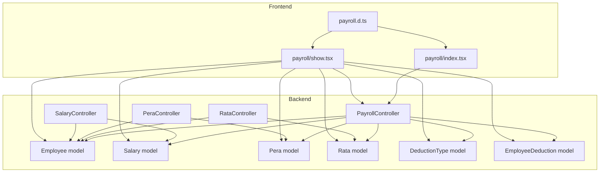
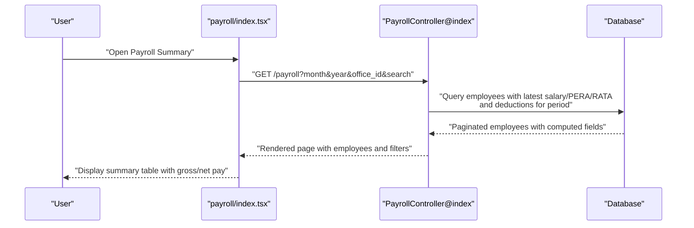
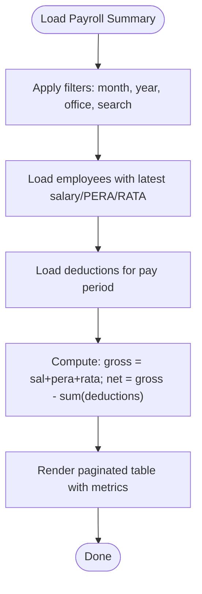
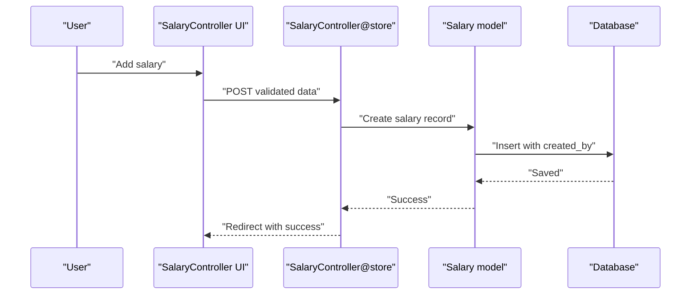
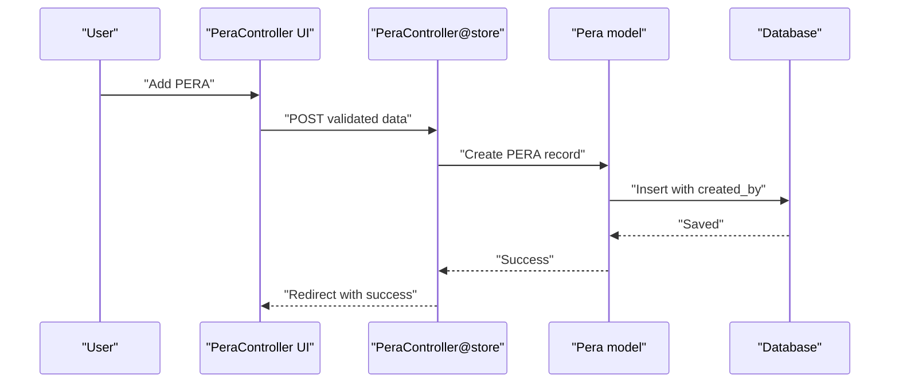
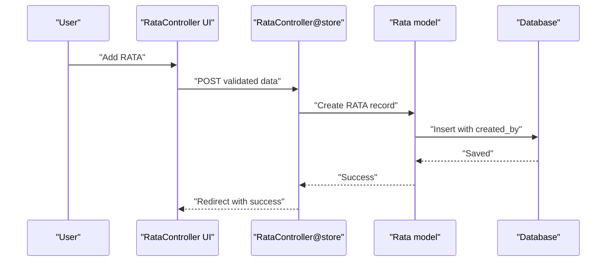
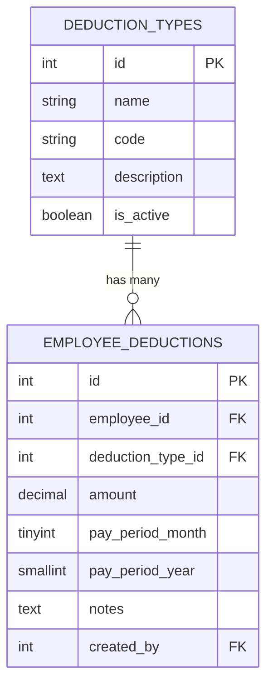
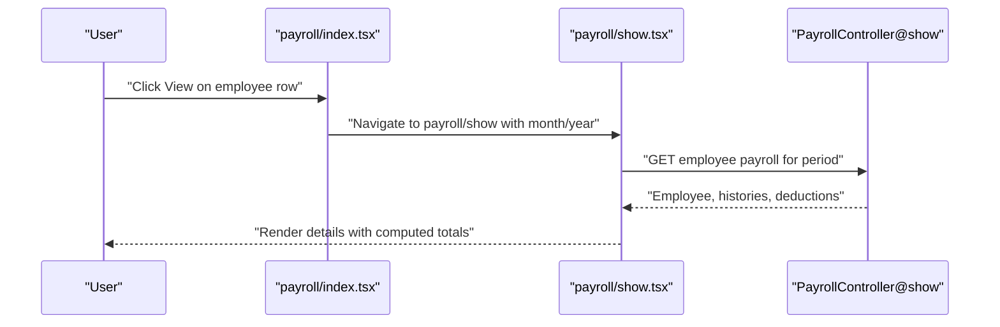
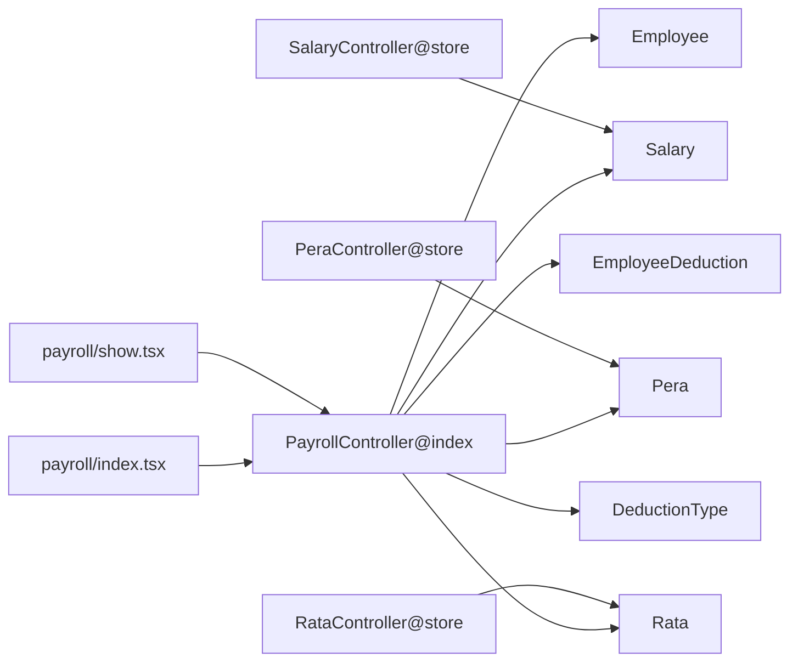

# Payroll System

<cite>
**Referenced Files in This Document**
- [PayrollController.php](file://app/Http/Controllers/PayrollController.php)
- [RataController.php](file://app/Http/Controllers/RataController.php)
- [PeraController.php](file://app/Http/Controllers/PeraController.php)
- [SalaryController.php](file://app/Http/Controllers/SalaryController.php)
- [Pera.php](file://app/Models/Pera.php)
- [Rata.php](file://app/Models/Rata.php)
- [Salary.php](file://app/Models/Salary.php)
- [Employee.php](file://app/Models/Employee.php)
- [DeductionType.php](file://app/Models/DeductionType.php)
- [EmployeeDeduction.php](file://app/Models/EmployeeDeduction.php)
- [payroll/index.tsx](file://resources/js/pages/payroll/index.tsx)
- [payroll/show.tsx](file://resources/js/pages/payroll/show.tsx)
- [payroll.d.ts](file://resources/js/types/payroll.d.ts)
- [2026_03_22_115109_create_peras_table.php](file://database/migrations/2026_03_22_115109_create_peras_table.php)
- [2026_03_22_115111_create_ratas_table.php](file://database/migrations/2026_03_22_115111_create_ratas_table.php)
- [2026_03_22_115112_create_employee_deductions_table.php](file://database/migrations/2026_03_22_115112_create_employee_deductions_table.php)
</cite>

## Table of Contents
1. [Introduction](#introduction)
2. [Project Structure](#project-structure)
3. [Core Components](#core-components)
4. [Architecture Overview](#architecture-overview)
5. [Detailed Component Analysis](#detailed-component-analysis)
6. [Dependency Analysis](#dependency-analysis)
7. [Performance Considerations](#performance-considerations)
8. [Troubleshooting Guide](#troubleshooting-guide)
9. [Conclusion](#conclusion)
10. [Appendices](#appendices)

## Introduction
This document describes the payroll system that computes employee compensation, manages payments, and maintains administrative records. It covers the salary structure, payment types (PERA and RATA), deduction management, payroll computation algorithms, tax calculations, benefit deductions, payroll generation, payment tracking, historical records, salary adjustments, payment scheduling, payroll reporting, compliance, audit trails, and the user interface for payroll management, batch processing, and payment distribution.

## Project Structure
The payroll system is implemented as a Laravel backend with Inertia.js frontend:
- Backend controllers orchestrate payroll queries and transformations.
- Eloquent models define the data schema and relationships for employees, salaries, PERA, RATA, and deductions.
- Frontend pages render payroll summaries, details, and related histories.
- Migrations define database schemas for payroll entities.



**Diagram sources**
- [PayrollController.php:11-124](file://app/Http/Controllers/PayrollController.php#L11-L124)
- [RataController.php:11-74](file://app/Http/Controllers/RataController.php#L11-L74)
- [PeraController.php:11-73](file://app/Http/Controllers/PeraController.php#L11-L73)
- [SalaryController.php:11-73](file://app/Http/Controllers/SalaryController.php#L11-L73)
- [Employee.php:10-103](file://app/Models/Employee.php#L10-L103)
- [Salary.php:8-35](file://app/Models/Salary.php#L8-L35)
- [Pera.php:8-40](file://app/Models/Pera.php#L8-L40)
- [Rata.php:8-40](file://app/Models/Rata.php#L8-L40)
- [DeductionType.php:7-32](file://app/Models/DeductionType.php#L7-L32)
- [EmployeeDeduction.php:8-58](file://app/Models/EmployeeDeduction.php#L8-L58)
- [payroll/index.tsx:49-217](file://resources/js/pages/payroll/index.tsx#L49-L217)
- [payroll/show.tsx:55-247](file://resources/js/pages/payroll/show.tsx#L55-L247)
- [payroll.d.ts:7-34](file://resources/js/types/payroll.d.ts#L7-L34)

**Section sources**
- [PayrollController.php:13-123](file://app/Http/Controllers/PayrollController.php#L13-L123)
- [payroll/index.tsx:49-217](file://resources/js/pages/payroll/index.tsx#L49-L217)
- [payroll/show.tsx:55-247](file://resources/js/pages/payroll/show.tsx#L55-L247)

## Core Components
- Payroll computation aggregates salary, PERA, and RATA amounts per employee for a given pay period, subtracts total deductions to compute net pay.
- Salary management supports adding/removing salary records with effective dates and soft-deletion.
- PERA and RATA management supports adding/removing payment records with effective dates and eligibility filtering.
- Deduction management stores period-specific deductions linked to deduction types and tracks creators.
- UI provides payroll summary and detail views with filtering, currency formatting, and pagination.

Key computations:
- Gross pay = current salary + current PERA + current RATA
- Net pay = gross pay − total deductions
- Deductions are filtered by pay period month and year.

**Section sources**
- [PayrollController.php:48-67](file://app/Http/Controllers/PayrollController.php#L48-L67)
- [payroll/index.tsx:70-79](file://resources/js/pages/payroll/index.tsx#L70-L79)
- [payroll/show.tsx:74-79](file://resources/js/pages/payroll/show.tsx#L74-L79)

## Architecture Overview
The system follows a layered architecture:
- Presentation layer: Inertia.js pages for payroll summary and detail.
- Application layer: Controllers handle requests, apply filters, load related data, and compute payroll metrics.
- Domain layer: Eloquent models encapsulate business entities and relationships.
- Data layer: Migrations define normalized schemas with appropriate constraints.



**Diagram sources**
- [payroll/index.tsx:49-80](file://resources/js/pages/payroll/index.tsx#L49-L80)
- [PayrollController.php:13-81](file://app/Http/Controllers/PayrollController.php#L13-L81)

## Detailed Component Analysis

### Payroll Computation Engine
The controller aggregates employee compensation and deductions for a selected pay period:
- Filters employees by optional search and office.
- Loads latest salary, PERA, and RATA records per employee.
- Loads deductions matching the pay period month and year.
- Computes totals and renders paginated results.



**Diagram sources**
- [PayrollController.php:20-67](file://app/Http/Controllers/PayrollController.php#L20-L67)

**Section sources**
- [PayrollController.php:13-81](file://app/Http/Controllers/PayrollController.php#L13-L81)
- [payroll/index.tsx:138-213](file://resources/js/pages/payroll/index.tsx#L138-L213)

### Salary Management
- Adds new salary records with amount, effective date, and creator tracking.
- Soft-deletes salary records.
- Provides history view with creator attribution.



**Diagram sources**
- [SalaryController.php:49-65](file://app/Http/Controllers/SalaryController.php#L49-L65)
- [Salary.php:8-35](file://app/Models/Salary.php#L8-L35)

**Section sources**
- [SalaryController.php:13-73](file://app/Http/Controllers/SalaryController.php#L13-L73)
- [Salary.php:8-35](file://app/Models/Salary.php#L8-L35)

### PERA Management
- Adds PERA payments with amount, effective date, and creator.
- Removes PERA records.
- Lists eligible employees and shows PERA history.



**Diagram sources**
- [PeraController.php:49-65](file://app/Http/Controllers/PeraController.php#L49-L65)
- [Pera.php:8-40](file://app/Models/Pera.php#L8-L40)

**Section sources**
- [PeraController.php:13-73](file://app/Http/Controllers/PeraController.php#L13-L73)
- [Pera.php:8-40](file://app/Models/Pera.php#L8-L40)

### RATA Management
- Adds RATA payments with amount, effective date, and creator.
- Removes RATA records.
- Lists RATA-eligible employees and shows RATA history.



**Diagram sources**
- [RataController.php:50-66](file://app/Http/Controllers/RataController.php#L50-L66)
- [Rata.php:8-40](file://app/Models/Rata.php#L8-L40)

**Section sources**
- [RataController.php:13-74](file://app/Http/Controllers/RataController.php#L13-L74)
- [Rata.php:8-40](file://app/Models/Rata.php#L8-L40)

### Deduction Management
- Stores period-specific deductions with amount, pay period month/year, notes, and creator.
- Prevents duplicate deductions via a unique composite index.
- Supports active deduction types and creator attribution.



**Diagram sources**
- [DeductionType.php:7-32](file://app/Models/DeductionType.php#L7-L32)
- [EmployeeDeduction.php:8-58](file://app/Models/EmployeeDeduction.php#L8-L58)
- [2026_03_22_115112_create_employee_deductions_table.php:14-27](file://database/migrations/2026_03_22_115112_create_employee_deductions_table.php#L14-L27)

**Section sources**
- [EmployeeDeduction.php:10-58](file://app/Models/EmployeeDeduction.php#L10-L58)
- [DeductionType.php:9-32](file://app/Models/DeductionType.php#L9-L32)

### Data Models and Relationships
```mermaid
classDiagram
class Employee {
+int id
+string first_name
+string last_name
+string position
+bool is_rata_eligible
+int employment_status_id
+int office_id
+int created_by
+string image_path
+salaries()
+peras()
+ratas()
+deductions()
+latestSalary()
+latestPera()
+latestRata()
}
class Salary {
+int id
+int employee_id
+decimal amount
+date effective_date
+date end_date
+int created_by
+employee()
+createdBy()
}
class Pera {
+int id
+int employee_id
+decimal amount
+date effective_date
+int created_by
+employee()
+createdBy()
}
class Rata {
+int id
+int employee_id
+decimal amount
+date effective_date
+int created_by
+employee()
+createdBy()
}
class DeductionType {
+int id
+string name
+string code
+string description
+bool is_active
+employeeDeductions()
}
class EmployeeDeduction {
+int id
+int employee_id
+int deduction_type_id
+decimal amount
+int pay_period_month
+int pay_period_year
+string notes
+int created_by
+employee()
+deductionType()
+createdBy()
}
Employee "1" --o{ Salary : "has many"
Employee "1" --o{ Pera : "has many"
Employee "1" --o{ Rata : "has many"
Employee "1" --o{ EmployeeDeduction : "has many"
DeductionType "1" --o{ EmployeeDeduction : "has many"
```

**Diagram sources**
- [Employee.php:46-88](file://app/Models/Employee.php#L46-L88)
- [Salary.php:26-34](file://app/Models/Salary.php#L26-L34)
- [Pera.php:22-30](file://app/Models/Pera.php#L22-L30)
- [Rata.php:22-30](file://app/Models/Rata.php#L22-L30)
- [DeductionType.php:20-23](file://app/Models/DeductionType.php#L20-L23)
- [EmployeeDeduction.php:26-39](file://app/Models/EmployeeDeduction.php#L26-L39)

**Section sources**
- [Employee.php:10-103](file://app/Models/Employee.php#L10-L103)
- [Salary.php:8-35](file://app/Models/Salary.php#L8-L35)
- [Pera.php:8-40](file://app/Models/Pera.php#L8-L40)
- [Rata.php:8-40](file://app/Models/Rata.php#L8-L40)
- [DeductionType.php:7-32](file://app/Models/DeductionType.php#L7-L32)
- [EmployeeDeduction.php:8-58](file://app/Models/EmployeeDeduction.php#L8-L58)

### Payroll UI Components
- Payroll Summary: Filters by month, year, office, and search; displays computed gross and net pay per employee.
- Payroll Details: Shows salary, PERA, RATA, total deductions, and net pay for a selected period; includes history tables.



**Diagram sources**
- [payroll/index.tsx:189-199](file://resources/js/pages/payroll/index.tsx#L189-L199)
- [payroll/show.tsx:61-72](file://resources/js/pages/payroll/show.tsx#L61-L72)
- [PayrollController.php:83-123](file://app/Http/Controllers/PayrollController.php#L83-L123)

**Section sources**
- [payroll/index.tsx:49-217](file://resources/js/pages/payroll/index.tsx#L49-L217)
- [payroll/show.tsx:55-247](file://resources/js/pages/payroll/show.tsx#L55-L247)
- [payroll.d.ts:7-34](file://resources/js/types/payroll.d.ts#L7-L34)

## Dependency Analysis
- Controllers depend on models for data access and relationships.
- UI pages depend on typed props and Inertia routing to controllers.
- Deduction uniqueness is enforced at the database level via a composite unique index.



**Diagram sources**
- [payroll/index.tsx:49-80](file://resources/js/pages/payroll/index.tsx#L49-L80)
- [payroll/show.tsx:55-72](file://resources/js/pages/payroll/show.tsx#L55-L72)
- [PayrollController.php:13-123](file://app/Http/Controllers/PayrollController.php#L13-L123)
- [SalaryController.php:49-65](file://app/Http/Controllers/SalaryController.php#L49-L65)
- [PeraController.php:49-65](file://app/Http/Controllers/PeraController.php#L49-L65)
- [RataController.php:50-66](file://app/Http/Controllers/RataController.php#L50-L66)

**Section sources**
- [2026_03_22_115112_create_employee_deductions_table.php:25-26](file://database/migrations/2026_03_22_115112_create_employee_deductions_table.php#L25-L26)

## Performance Considerations
- Use of eager loading reduces N+1 queries for related data (salaries, PERAs, RATAs, deductions).
- Pagination limits result sets for large datasets.
- Unique constraint on employee deduction prevents redundant writes and improves lookup performance.
- Currency formatting is client-side for responsiveness.

[No sources needed since this section provides general guidance]

## Troubleshooting Guide
- Deduction duplicates: The unique index prevents inserting the same deduction type for the same employee in the same pay period. Remove or adjust existing records before re-inserting.
- Eligibility filtering: RATA records are filtered by eligibility flag; ensure employees are marked eligible before adding RATA entries.
- Audit trail: All entities track creators; verify created_by fields for accountability.
- Validation errors: Controllers validate inputs; ensure amounts are numeric and dates are valid.

**Section sources**
- [2026_03_22_115112_create_employee_deductions_table.php:25-26](file://database/migrations/2026_03_22_115112_create_employee_deductions_table.php#L25-L26)
- [RataController.php:18-24](file://app/Http/Controllers/RataController.php#L18-L24)
- [PeraController.php:17-23](file://app/Http/Controllers/PeraController.php#L17-L23)
- [SalaryController.php:50-55](file://app/Http/Controllers/SalaryController.php#L50-L55)

## Conclusion
The payroll system provides a robust foundation for managing salary, PERA, and RATA payments, applying period-specific deductions, computing gross and net pay, and maintaining historical records. Its modular design, typed UI components, and normalized database schema support scalability, maintainability, and compliance through audit trails and unique constraints.

[No sources needed since this section summarizes without analyzing specific files]

## Appendices

### Payroll Computation Algorithm
- Input: Employee records, latest salary/PERA/RATA, deductions for the selected month/year.
- Process:
  - Sum current salary, PERA, and RATA.
  - Sum all deductions for the period.
  - Compute net pay as gross minus total deductions.
- Output: Paginated payroll summary with currency formatting and period filters.

**Section sources**
- [PayrollController.php:48-67](file://app/Http/Controllers/PayrollController.php#L48-L67)
- [payroll/index.tsx:70-79](file://resources/js/pages/payroll/index.tsx#L70-L79)

### Data Schemas
- PERA table: employee foreign key, amount, effective date, creator.
- RATA table: employee foreign key, amount, effective date, creator.
- Employee Deductions table: employee/deduction type foreign keys, amount, pay period month/year, notes, creator; unique constraint on employee/deduction type/month/year.

**Section sources**
- [2026_03_22_115109_create_peras_table.php:14-21](file://database/migrations/2026_03_22_115109_create_peras_table.php#L14-L21)
- [2026_03_22_115111_create_ratas_table.php:14-21](file://database/migrations/2026_03_22_115111_create_ratas_table.php#L14-L21)
- [2026_03_22_115112_create_employee_deductions_table.php:14-27](file://database/migrations/2026_03_22_115112_create_employee_deductions_table.php#L14-L27)