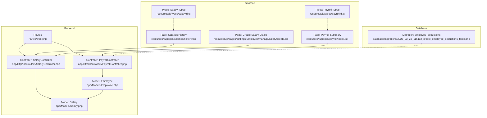
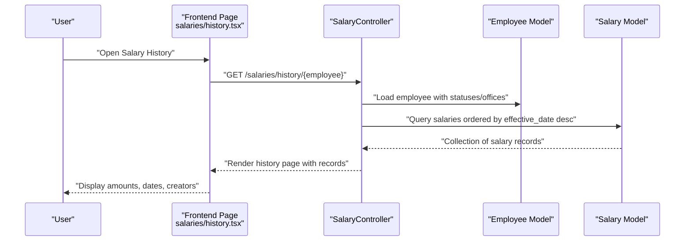
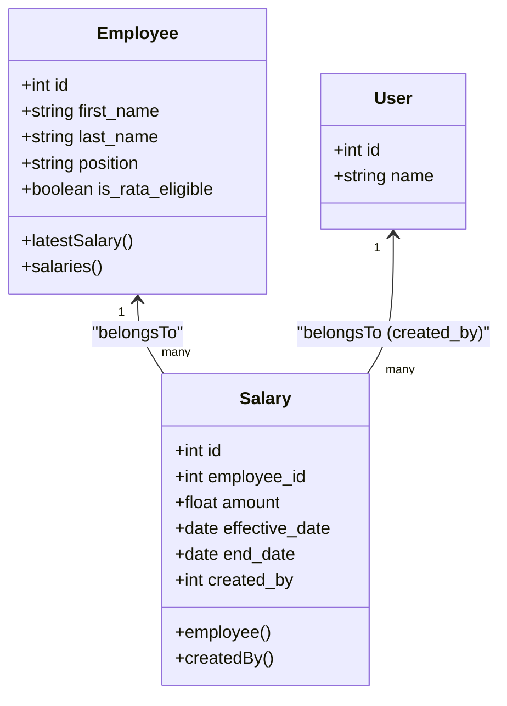
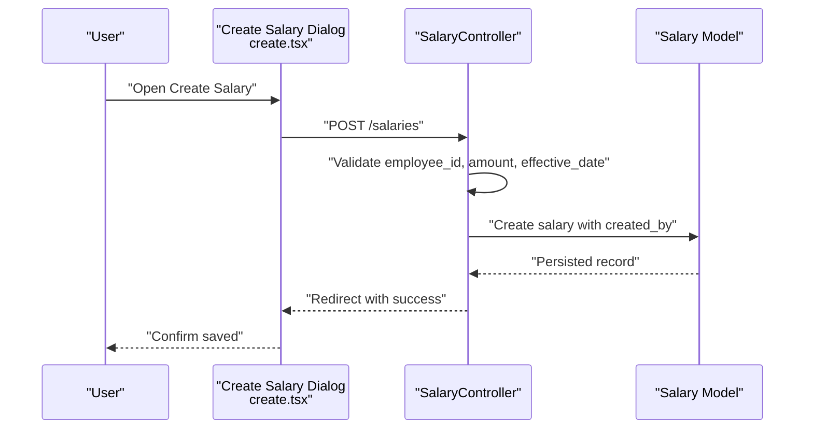
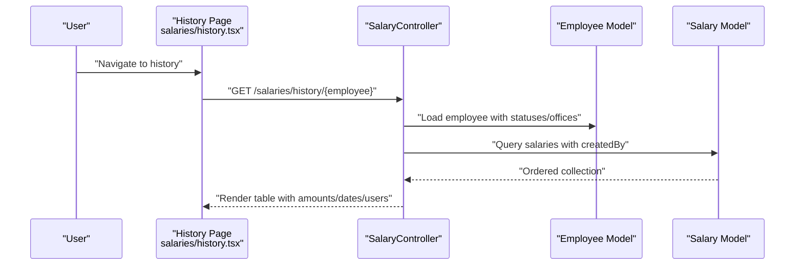
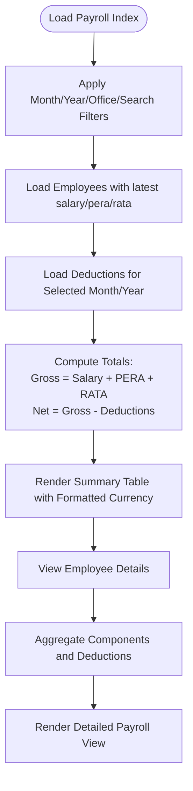
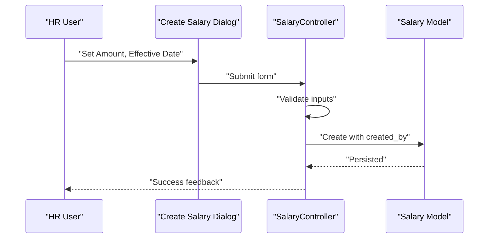
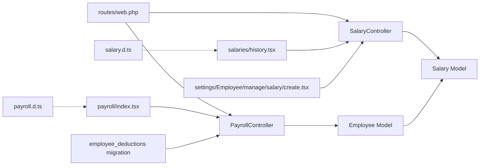

# Salary Management

<cite>
**Referenced Files in This Document**
- [Salary.php](file://app/Models/Salary.php)
- [Employee.php](file://app/Models/Employee.php)
- [SalaryController.php](file://app/Http/Controllers/SalaryController.php)
- [PayrollController.php](file://app/Http/Controllers/PayrollController.php)
- [web.php](file://routes/web.php)
- [salary.d.ts](file://resources/js/types/salary.d.ts)
- [payroll.d.ts](file://resources/js/types/payroll.d.ts)
- [history.tsx](file://resources/js/pages/salaries/history.tsx)
- [create.tsx](file://resources/js/pages/settings/Employee/manage/salary/create.tsx)
- [index.tsx](file://resources/js/pages/payroll/index.tsx)
- [2026_03_22_115112_create_employee_deductions_table.php](file://database/migrations/2026_03_22_115112_create_employee_deductions_table.php)
</cite>

## Table of Contents
1. [Introduction](#introduction)
2. [Project Structure](#project-structure)
3. [Core Components](#core-components)
4. [Architecture Overview](#architecture-overview)
5. [Detailed Component Analysis](#detailed-component-analysis)
6. [Dependency Analysis](#dependency-analysis)
7. [Performance Considerations](#performance-considerations)
8. [Troubleshooting Guide](#troubleshooting-guide)
9. [Conclusion](#conclusion)
10. [Appendices](#appendices)

## Introduction
This document describes the salary management subsystem within the application. It covers the salary model and its relationships with employees, effective date handling, and salary history tracking. It also explains salary creation and deletion workflows, payroll computation that aggregates salary with related benefits and deductions, and the user interfaces for administration and reporting. Compliance considerations such as minimum wage and pay scale configurations are discussed conceptually, along with best practices for maintaining accurate historical records.

## Project Structure
The salary management system spans backend Eloquent models and controllers, frontend TypeScript/React pages, and database migrations. Routes define the REST endpoints for salary administration, while payroll aggregation is handled in the PayrollController. Frontend pages provide filtering, viewing, and administrative actions.

**Diagram sources**
- [web.php:31-37](file://routes/web.php#L31-L37)
- [SalaryController.php:11-74](file://app/Http/Controllers/SalaryController.php#L11-L74)
- [PayrollController.php:11-125](file://app/Http/Controllers/PayrollController.php#L11-L125)
- [Salary.php:8-35](file://app/Models/Salary.php#L8-L35)
- [Employee.php:10-104](file://app/Models/Employee.php#L10-L104)
- [history.tsx:26-104](file://resources/js/pages/salaries/history.tsx#L26-L104)
- [create.tsx:23-100](file://resources/js/pages/settings/Employee/manage/salary/create.tsx#L23-L100)
- [index.tsx:49-221](file://resources/js/pages/payroll/index.tsx#L49-L221)
- [salary.d.ts:3-24](file://resources/js/types/salary.d.ts#L3-L24)
- [payroll.d.ts:7-35](file://resources/js/types/payroll.d.ts#L7-L35)
- [2026_03_22_115112_create_employee_deductions_table.php:14-27](file://database/migrations/2026_03_22_115112_create_employee_deductions_table.php#L14-L27)

**Section sources**
- [web.php:31-37](file://routes/web.php#L31-L37)
- [SalaryController.php:11-74](file://app/Http/Controllers/SalaryController.php#L11-L74)
- [PayrollController.php:11-125](file://app/Http/Controllers/PayrollController.php#L11-L125)
- [Salary.php:8-35](file://app/Models/Salary.php#L8-L35)
- [Employee.php:10-104](file://app/Models/Employee.php#L10-L104)
- [history.tsx:26-104](file://resources/js/pages/salaries/history.tsx#L26-L104)
- [create.tsx:23-100](file://resources/js/pages/settings/Employee/manage/salary/create.tsx#L23-L100)
- [index.tsx:49-221](file://resources/js/pages/payroll/index.tsx#L49-L221)
- [salary.d.ts:3-24](file://resources/js/types/salary.d.ts#L3-L24)
- [payroll.d.ts:7-35](file://resources/js/types/payroll.d.ts#L7-L35)
- [2026_03_22_115112_create_employee_deductions_table.php:14-27](file://database/migrations/2026_03_22_115112_create_employee_deductions_table.php#L14-L27)

## Core Components
- Salary model: Stores employee salary records with effective dates and maintains soft-deleted history.
- Employee model: Defines relationships to salaries and provides helpers to fetch the latest salary.
- SalaryController: Handles listing employees with latest salary, viewing salary history per employee, creating new salary records, and deleting salary records.
- PayrollController: Aggregates salary, PERA, RATA, and deductions for payroll computation and displays summaries and details.
- Frontend pages: Provide filtering, viewing, and administrative actions for salary records and payroll summaries.
- Types: TypeScript interfaces define the shape of salary and payroll data exchanged between frontend and backend.

Key implementation highlights:
- Effective date handling: Salary records are ordered by effective_date to determine the latest active record.
- History tracking: Soft deletes enable historical audit trails; queries load created_by user and sort by effective_date.
- Payroll computation: Gross pay equals salary + PERA + RATA; net pay equals gross minus total deductions for the pay period.

**Section sources**
- [Salary.php:8-35](file://app/Models/Salary.php#L8-L35)
- [Employee.php:46-72](file://app/Models/Employee.php#L46-L72)
- [SalaryController.php:13-73](file://app/Http/Controllers/SalaryController.php#L13-L73)
- [PayrollController.php:13-124](file://app/Http/Controllers/PayrollController.php#L13-L124)
- [salary.d.ts:3-24](file://resources/js/types/salary.d.ts#L3-L24)
- [payroll.d.ts:7-35](file://resources/js/types/payroll.d.ts#L7-L35)

## Architecture Overview
The salary management architecture follows a layered pattern:
- Routes define endpoints for salary administration and payroll.
- Controllers orchestrate data retrieval and transformations.
- Models encapsulate relationships and casting.
- Frontend pages render filtered lists, forms, and computed payroll summaries.

**Diagram sources**
- [web.php:34](file://routes/web.php#L34)
- [SalaryController.php:36-47](file://app/Http/Controllers/SalaryController.php#L36-L47)
- [Employee.php:46-49](file://app/Models/Employee.php#L46-L49)
- [Salary.php:26-29](file://app/Models/Salary.php#L26-L29)
- [history.tsx:48-99](file://resources/js/pages/salaries/history.tsx#L48-L99)

## Detailed Component Analysis

### Salary Model and Relationships
The Salary model defines the persisted attributes for salary records, including monetary amounts and effective/end dates. It belongs to an Employee and to the User who created the record. Casting ensures consistent decimal precision and date parsing.

**Diagram sources**
- [Salary.php:26-34](file://app/Models/Salary.php#L26-L34)
- [Employee.php:46-49](file://app/Models/Employee.php#L46-L49)
- [Employee.php:69-72](file://app/Models/Employee.php#L69-L72)

**Section sources**
- [Salary.php:8-35](file://app/Models/Salary.php#L8-L35)
- [Employee.php:46-72](file://app/Models/Employee.php#L46-L72)

### Salary Administration Workflow
Administrative actions include listing employees with latest salary, viewing history, creating new salary records, and deleting records. The controller validates inputs and associates the creator.

**Diagram sources**
- [web.php:35](file://routes/web.php#L35)
- [SalaryController.php:49-65](file://app/Http/Controllers/SalaryController.php#L49-L65)
- [Salary.php:12-18](file://app/Models/Salary.php#L12-L18)

**Section sources**
- [SalaryController.php:13-73](file://app/Http/Controllers/SalaryController.php#L13-L73)
- [create.tsx:23-100](file://resources/js/pages/settings/Employee/manage/salary/create.tsx#L23-L100)

### Salary History Tracking
The history view lists all salary records for an employee, sorted by effective_date descending, and shows who created each record. Soft deletes preserve historical context.

**Diagram sources**
- [web.php:34](file://routes/web.php#L34)
- [SalaryController.php:36-47](file://app/Http/Controllers/SalaryController.php#L36-L47)
- [history.tsx:48-99](file://resources/js/pages/salaries/history.tsx#L48-L99)

**Section sources**
- [SalaryController.php:36-47](file://app/Http/Controllers/SalaryController.php#L36-L47)
- [history.tsx:26-104](file://resources/js/pages/salaries/history.tsx#L26-L104)

### Payroll Computation and Reporting
Payroll summary aggregates salary, PERA, and RATA for a selected month/year and subtracts total deductions for that period. The frontend formats currency and renders computed totals.

**Diagram sources**
- [PayrollController.php:13-81](file://app/Http/Controllers/PayrollController.php#L13-L81)
- [index.tsx:49-221](file://resources/js/pages/payroll/index.tsx#L49-L221)
- [payroll.d.ts:7-35](file://resources/js/types/payroll.d.ts#L7-L35)

**Section sources**
- [PayrollController.php:13-124](file://app/Http/Controllers/PayrollController.php#L13-L124)
- [index.tsx:49-221](file://resources/js/pages/payroll/index.tsx#L49-L221)
- [payroll.d.ts:7-35](file://resources/js/types/payroll.d.ts#L7-L35)

### Effective Date Handling and Grade-Based Systems
- Effective date ordering: Queries order salary records by effective_date descending to determine the latest active record for display and payroll aggregation.
- Grade-based pay systems: While the current schema does not include explicit grade fields, the effective_date mechanism supports grade changes by creating new records with updated amounts at specific dates. This allows historical tracking of grade transitions.

Best practices:
- Always create a new salary record with a future effective_date when changing grades to maintain chronological accuracy.
- Use end_date to mark the last day of an old grade before transitioning to a new one.

**Section sources**
- [Salary.php:20-24](file://app/Models/Salary.php#L20-L24)
- [Employee.php:69-72](file://app/Models/Employee.php#L69-L72)
- [PayrollController.php:30-67](file://app/Http/Controllers/PayrollController.php#L30-L67)

### Salary Adjustment Procedures
Adjustments are performed via the create endpoint, validated, and associated with the current user. Deletion removes a record from history, preserving previous entries.

**Diagram sources**
- [web.php:35](file://routes/web.php#L35)
- [SalaryController.php:49-65](file://app/Http/Controllers/SalaryController.php#L49-L65)
- [create.tsx:23-100](file://resources/js/pages/settings/Employee/manage/salary/create.tsx#L23-L100)

**Section sources**
- [SalaryController.php:49-65](file://app/Http/Controllers/SalaryController.php#L49-L65)
- [create.tsx:23-100](file://resources/js/pages/settings/Employee/manage/salary/create.tsx#L23-L100)

### Approval Workflows
The current implementation does not include built-in approval steps. To add approvals:
- Extend the Salary model with status and approver fields.
- Add middleware or policies to enforce approval gating.
- Integrate with a workflow engine or status transitions.

[No sources needed since this section provides conceptual guidance]

### Salary Reporting and Historical Data Management
- Reporting: Payroll index and show pages compute and present gross and net pay, grouped by office and filtered by search criteria.
- Historical data: Soft-deleted salary records remain accessible for audit trails; history pages display all records ordered by effective_date.

**Section sources**
- [PayrollController.php:13-124](file://app/Http/Controllers/PayrollController.php#L13-L124)
- [history.tsx:26-104](file://resources/js/pages/salaries/history.tsx#L26-L104)

### Salary Comparison Features
- Per-employee comparison: The payroll show view presents historical salary, PERA, and RATA records for comparison across effective dates.
- Cross-employee comparison: The payroll index table shows current salary, PERA, RATA, gross, deductions, and net pay for quick comparisons.

**Section sources**
- [PayrollController.php:83-123](file://app/Http/Controllers/PayrollController.php#L83-L123)
- [index.tsx:155-214](file://resources/js/pages/payroll/index.tsx#L155-L214)

### Compliance and Pay Scale Configurations
- Minimum wage: Enforce minimum wage checks during salary creation by validating against a configured minimum wage table or policy.
- Pay scales: Introduce a PayScale model linked to job grades; validate new salary amounts against the applicable scale for the effective date.
- Regulatory reporting: Add fields for tax code, SSS, PHIC, HDMF identifiers, and export payroll data for statutory filings.

[No sources needed since this section provides conceptual guidance]

### User Interface for Salary Administration
- Create dialog: Provides fields for salary amount, effective date, optional end date, and remarks; displays current active salary.
- History page: Lists all salary records with formatted currency and dates, and allows deletion of individual records.
- Payroll summary: Offers month/year filters, office selection, and search; computes and displays gross and net pay.

**Section sources**
- [create.tsx:23-100](file://resources/js/pages/settings/Employee/manage/salary/create.tsx#L23-L100)
- [history.tsx:26-104](file://resources/js/pages/salaries/history.tsx#L26-L104)
- [index.tsx:49-221](file://resources/js/pages/payroll/index.tsx#L49-L221)

### Batch Updates and Salary Distribution
- Batch updates: Implement a bulk upload process to create multiple salary records for different employees with a single effective_date.
- Distribution: Integrate with payroll distribution by generating distribution records tied to the selected month/year and linking to salary history.

[No sources needed since this section provides conceptual guidance]

## Dependency Analysis
The following diagram shows key dependencies among components:

**Diagram sources**
- [web.php:31-37](file://routes/web.php#L31-L37)
- [SalaryController.php:11-74](file://app/Http/Controllers/SalaryController.php#L11-L74)
- [PayrollController.php:11-125](file://app/Http/Controllers/PayrollController.php#L11-L125)
- [Salary.php:8-35](file://app/Models/Salary.php#L8-L35)
- [Employee.php:10-104](file://app/Models/Employee.php#L10-L104)
- [history.tsx:26-104](file://resources/js/pages/salaries/history.tsx#L26-L104)
- [create.tsx:23-100](file://resources/js/pages/settings/Employee/manage/salary/create.tsx#L23-L100)
- [index.tsx:49-221](file://resources/js/pages/payroll/index.tsx#L49-L221)
- [salary.d.ts:3-24](file://resources/js/types/salary.d.ts#L3-L24)
- [payroll.d.ts:7-35](file://resources/js/types/payroll.d.ts#L7-L35)
- [2026_03_22_115112_create_employee_deductions_table.php:14-27](file://database/migrations/2026_03_22_115112_create_employee_deductions_table.php#L14-L27)

**Section sources**
- [web.php:31-37](file://routes/web.php#L31-L37)
- [SalaryController.php:11-74](file://app/Http/Controllers/SalaryController.php#L11-L74)
- [PayrollController.php:11-125](file://app/Http/Controllers/PayrollController.php#L11-L125)
- [Salary.php:8-35](file://app/Models/Salary.php#L8-L35)
- [Employee.php:10-104](file://app/Models/Employee.php#L10-L104)
- [history.tsx:26-104](file://resources/js/pages/salaries/history.tsx#L26-L104)
- [create.tsx:23-100](file://resources/js/pages/settings/Employee/manage/salary/create.tsx#L23-L100)
- [index.tsx:49-221](file://resources/js/pages/payroll/index.tsx#L49-L221)
- [salary.d.ts:3-24](file://resources/js/types/salary.d.ts#L3-L24)
- [payroll.d.ts:7-35](file://resources/js/types/payroll.d.ts#L7-L35)
- [2026_03_22_115112_create_employee_deductions_table.php:14-27](file://database/migrations/2026_03_22_115112_create_employee_deductions_table.php#L14-L27)

## Performance Considerations
- Indexing: Add database indexes on salary.employee_id, salary.effective_date, and employee_deductions.pay_period_month/year for efficient filtering and aggregation.
- Pagination: Controllers already use pagination; keep page sizes reasonable to avoid heavy payloads.
- Eager loading: Controllers use with() to reduce N+1 queries; ensure additional joins are scoped to required periods.
- Currency formatting: Frontend formatting avoids server-side overhead; keep computations minimal on the server.

[No sources needed since this section provides general guidance]

## Troubleshooting Guide
Common issues and resolutions:
- Validation errors on salary creation: Ensure employee_id exists, amount is numeric and non-negative, and effective_date is a valid date.
- Missing latest salary in payroll: Verify that the latest salary record exists and has a valid effective_date; check soft-deleted records if history appears truncated.
- Incorrect payroll totals: Confirm that PERA/RATA records exist for the selected month/year and that deductions match the pay period filters.

**Section sources**
- [SalaryController.php:51-55](file://app/Http/Controllers/SalaryController.php#L51-L55)
- [PayrollController.php:30-67](file://app/Http/Controllers/PayrollController.php#L30-L67)

## Conclusion
The salary management system provides robust support for recording salary changes, tracking history, and computing payroll. Its design leverages effective dates for chronological accuracy, soft deletes for auditability, and clear separation between administration and reporting. Extending the system with approvals, compliance checks, and batch operations would further strengthen operational controls and scalability.

## Appendices
- Data types used across the system:
  - Salary: id, employee_id, amount, effective_date, end_date, created_by, timestamps, and optional employee and creator user references.
  - PayrollEmployee: extended employee with computed fields for current_salary, current_pera, current_rata, total_deductions, gross_pay, and net_pay.

**Section sources**
- [salary.d.ts:3-24](file://resources/js/types/salary.d.ts#L3-L24)
- [payroll.d.ts:7-15](file://resources/js/types/payroll.d.ts#L7-L15)