# Routing Architecture

<cite>
**Referenced Files in This Document**
- [web.php](file://routes/web.php)
- [auth.php](file://routes/auth.php)
- [settings.php](file://routes/settings.php)
- [app.php](file://bootstrap/app.php)
- [HandleInertiaRequests.php](file://app/Http/Middleware/HandleInertiaRequests.php)
- [app.blade.php](file://resources/views/app.blade.php)
- [app.tsx](file://resources/js/app.tsx)
- [dashboard.tsx](file://resources/js/pages/dashboard.tsx)
- [welcome.tsx](file://resources/js/pages/welcome.tsx)
- [AuthenticatedSessionController.php](file://app/Http/Controllers/Auth/AuthenticatedSessionController.php)
- [PayrollController.php](file://app/Http/Controllers/PayrollController.php)
- [EmployeeController.php](file://app/Http/Controllers/EmployeeController.php)
- [ManageEmployeeController.php](file://app/Http/Controllers/ManageEmployeeController.php)
- [EmployeeManage.php](file://app/Http/Controllers/EmployeeManage.php)
- [DashboardController.php](file://app/Http/Controllers/DashboardController.php)
- [Manage.tsx](file://resources/js/pages/Employees/Manage/Manage.tsx)
- [Compensation.tsx](file://resources/js/pages/Employees/Manage/Compensation.tsx)
- [Settings.tsx](file://resources/js/pages/Employees/Manage/Settings.tsx)
</cite>

## Update Summary
**Changes Made**
- Updated dashboard routing section to reflect the new DashboardController implementation
- Added comprehensive documentation for the DashboardController and its dashboard page integration
- Updated routing configuration analysis to include the new controller-based approach
- Enhanced dashboard functionality documentation with detailed controller methods and data processing
- Updated dependency analysis to include DashboardController in the routing architecture

## Table of Contents
1. [Introduction](#introduction)
2. [Project Structure](#project-structure)
3. [Core Components](#core-components)
4. [Architecture Overview](#architecture-overview)
5. [Detailed Component Analysis](#detailed-component-analysis)
6. [Dependency Analysis](#dependency-analysis)
7. [Performance Considerations](#performance-considerations)
8. [Troubleshooting Guide](#troubleshooting-guide)
9. [Conclusion](#conclusion)

## Introduction
This document explains the routing architecture of a Laravel-based payroll management application using Inertia.js for seamless single-page application behavior. The system separates concerns between server-side routing and client-side navigation, leveraging Laravel routes to render React pages via Inertia middleware. Authentication routes are isolated under dedicated route groups, while feature-specific routes are grouped by domain areas such as payroll, employees, and settings. The architecture now includes a comprehensive dashboard system powered by the new DashboardController, which provides centralized analytics and reporting capabilities for the payroll management system.

## Project Structure
The routing architecture spans three primary layers:
- Server-side routing: Laravel routes define endpoints and attach controllers for rendering Inertia pages.
- Middleware layer: Inertia middleware manages the root template and shared data for React pages.
- Client-side routing: Inertia handles navigation between React pages without full page reloads.

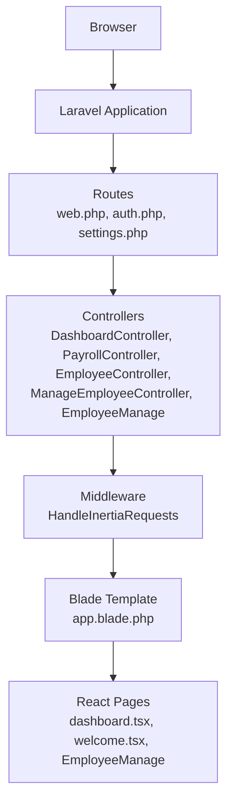

**Diagram sources**
- [web.php:1-115](file://routes/web.php#L1-L115)
- [auth.php:1-57](file://routes/auth.php#L1-L57)
- [settings.php:1-22](file://routes/settings.php#L1-L22)
- [HandleInertiaRequests.php:1-55](file://app/Http/Middleware/HandleInertiaRequests.php#L1-L55)
- [app.blade.php:1-21](file://resources/views/app.blade.php#L1-L21)
- [app.tsx:1-30](file://resources/js/app.tsx#L1-L30)

**Section sources**
- [web.php:1-115](file://routes/web.php#L1-L115)
- [auth.php:1-57](file://routes/auth.php#L1-L57)
- [settings.php:1-22](file://routes/settings.php#L1-L22)
- [app.php:1-24](file://bootstrap/app.php#L1-L24)
- [HandleInertiaRequests.php:1-55](file://app/Http/Middleware/HandleInertiaRequests.php#L1-L55)
- [app.blade.php:1-21](file://resources/views/app.blade.php#L1-L21)
- [app.tsx:1-30](file://resources/js/app.tsx#L1-L30)

## Core Components
- Route registration: Laravel registers routes in web.php, auth.php, and settings.php, grouping routes by domain and middleware.
- Inertia middleware: HandleInertiaRequests sets the root template and shares application-wide data (authentication, flash messages).
- Blade template: app.blade.php integrates Vite and Inertia to mount React pages.
- Frontend entry: app.tsx configures Inertia with page resolution and progress indicators.
- Controllers: Controllers handle request processing and render Inertia pages with appropriate data.

Key routing patterns:
- Authentication routes are guarded by guest middleware for registration/login and auth middleware for verification and logout.
- Feature routes are grouped under prefixes (e.g., payroll, employees, settings) and use controller actions to render React pages.
- Settings routes provide profile and password management under an authenticated context.
- **Updated** Dashboard routes now use the dedicated DashboardController for centralized analytics and reporting functionality.

**Section sources**
- [web.php:1-115](file://routes/web.php#L1-L115)
- [auth.php:1-57](file://routes/auth.php#L1-L57)
- [settings.php:1-22](file://routes/settings.php#L1-L22)
- [HandleInertiaRequests.php:1-55](file://app/Http/Middleware/HandleInertiaRequests.php#L1-L55)
- [app.blade.php:1-21](file://resources/views/app.blade.php#L1-L21)
- [app.tsx:1-30](file://resources/js/app.tsx#L1-L30)

## Architecture Overview
The routing architecture follows a layered pattern:
- HTTP requests enter Laravel via web routes.
- Controllers process requests and return Inertia responses.
- Inertia middleware prepares the root view and shared data.
- The Blade template renders the React application with resolved pages.

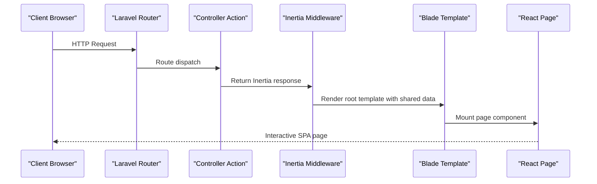

**Diagram sources**
- [web.php:1-115](file://routes/web.php#L1-L115)
- [HandleInertiaRequests.php:1-55](file://app/Http/Middleware/HandleInertiaRequests.php#L1-L55)
- [app.blade.php:1-21](file://resources/views/app.blade.php#L1-L21)
- [app.tsx:1-30](file://resources/js/app.tsx#L1-L30)

## Detailed Component Analysis

### Authentication Routing
Authentication routes are defined under guest middleware for registration and login, and under auth middleware for verification and logout. These routes render React pages via Inertia.

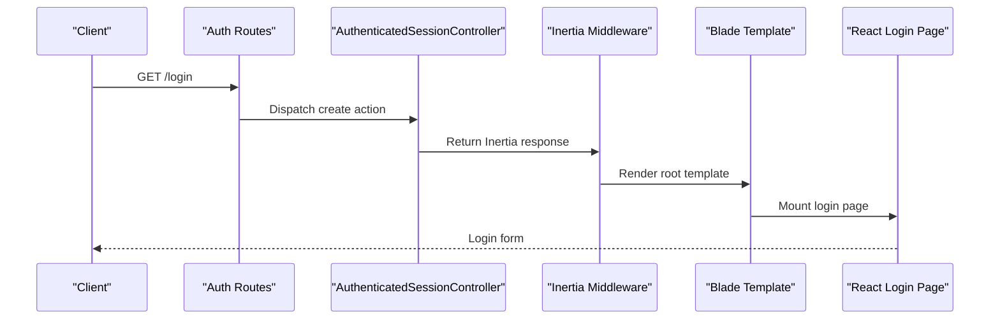

**Diagram sources**
- [auth.php:13-35](file://routes/auth.php#L13-L35)
- [AuthenticatedSessionController.php:19-25](file://app/Http/Controllers/Auth/AuthenticatedSessionController.php#L19-L25)
- [HandleInertiaRequests.php:18-53](file://app/Http/Middleware/HandleInertiaRequests.php#L18-L53)
- [app.blade.php:12-20](file://resources/views/app.blade.php#L12-L20)

**Section sources**
- [auth.php:1-57](file://routes/auth.php#L1-L57)
- [AuthenticatedSessionController.php:1-52](file://app/Http/Controllers/Auth/AuthenticatedSessionController.php#L1-L52)

### Dashboard Routing
**Updated** The dashboard routing now uses the dedicated DashboardController instead of inline closures, providing centralized analytics and reporting functionality.

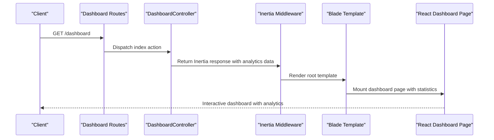

**Diagram sources**
- [web.php:24-25](file://routes/web.php#L24-L25)
- [DashboardController.php:14-87](file://app/Http/Controllers/DashboardController.php#L14-L87)
- [HandleInertiaRequests.php:18-53](file://app/Http/Middleware/HandleInertiaRequests.php#L18-L53)
- [app.blade.php:12-20](file://resources/views/app.blade.php#L12-L20)

**Section sources**
- [web.php:24-25](file://routes/web.php#L24-L25)
- [DashboardController.php:1-89](file://app/Http/Controllers/DashboardController.php#L1-L89)

### Dashboard Controller Implementation
The DashboardController provides comprehensive analytics and reporting functionality:

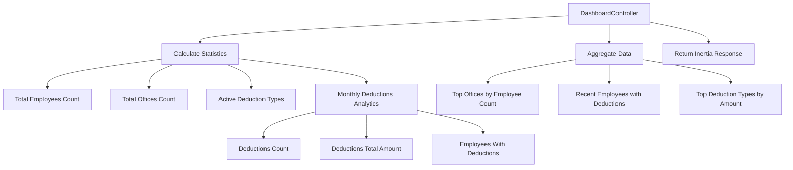

**Diagram sources**
- [DashboardController.php:14-87](file://app/Http/Controllers/DashboardController.php#L14-L87)

**Section sources**
- [DashboardController.php:1-89](file://app/Http/Controllers/DashboardController.php#L1-L89)

### Payroll Feature Routing
Payroll routes are grouped under the payroll prefix and handled by PayrollController. The controller queries related models and computes derived values for rendering.

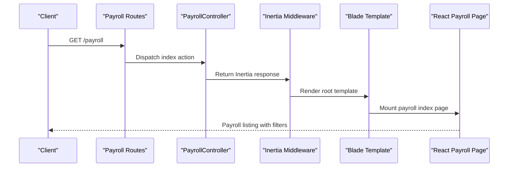

**Diagram sources**
- [web.php:27-30](file://routes/web.php#L27-L30)
- [PayrollController.php:13-81](file://app/Http/Controllers/PayrollController.php#L13-L81)
- [HandleInertiaRequests.php:18-53](file://app/Http/Middleware/HandleInertiaRequests.php#L18-L53)
- [app.blade.php:12-20](file://resources/views/app.blade.php#L12-L20)

**Section sources**
- [web.php:26-54](file://routes/web.php#L26-L54)
- [PayrollController.php:1-125](file://app/Http/Controllers/PayrollController.php#L1-L125)

### Employee Management Routing
Employee routes are now organized into two distinct management systems:
- Basic employee CRUD operations under employees prefix
- Comprehensive employee management under manage.employees prefix

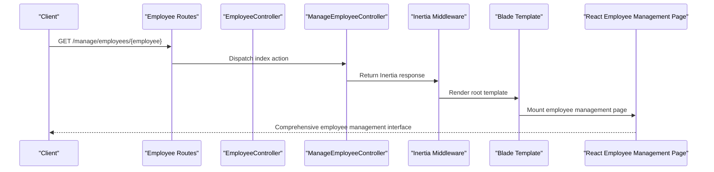

**Diagram sources**
- [web.php:79-83](file://routes/web.php#L79-L83)
- [ManageEmployeeController.php:16-50](file://app/Http/Controllers/ManageEmployeeController.php#L16-L50)
- [HandleInertiaRequests.php:18-53](file://app/Http/Middleware/HandleInertiaRequests.php#L18-L53)
- [app.blade.php:12-20](file://resources/views/app.blade.php#L12-L20)

**Section sources**
- [web.php:66-83](file://routes/web.php#L66-L83)
- [ManageEmployeeController.php:1-86](file://app/Http/Controllers/ManageEmployeeController.php#L1-L86)
- [EmployeeManage.php:1-42](file://app/Http/Controllers/EmployeeManage.php#L1-L42)

### Settings Routing
Settings routes provide profile and password management under authenticated context, redirecting to profile editing by default.

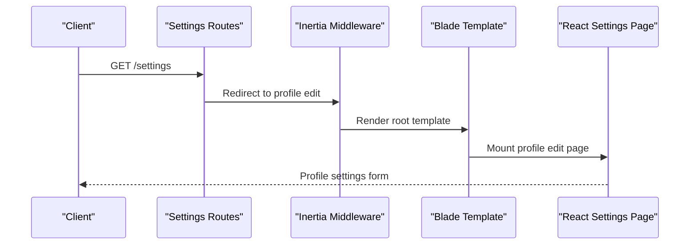

**Diagram sources**
- [settings.php:8-21](file://routes/settings.php#L8-L21)
- [HandleInertiaRequests.php:18-53](file://app/Http/Middleware/HandleInertiaRequests.php#L18-L53)
- [app.blade.php:12-20](file://resources/views/app.blade.php#L12-L20)

**Section sources**
- [settings.php:1-22](file://routes/settings.php#L1-L22)

### Frontend Integration
The frontend integrates with Laravel through Inertia:
- app.tsx configures Inertia with page resolution and progress indicators.
- React pages receive shared props from the Inertia middleware.
- The Blade template mounts the React application and injects assets.

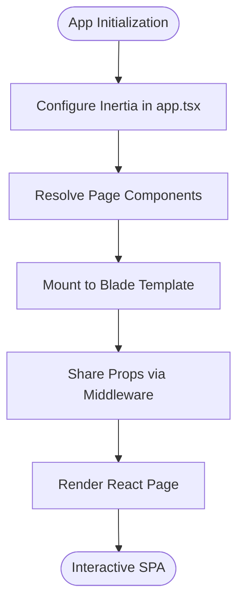

**Diagram sources**
- [app.tsx:15-26](file://resources/js/app.tsx#L15-L26)
- [HandleInertiaRequests.php:37-53](file://app/Http/Middleware/HandleInertiaRequests.php#L37-L53)
- [app.blade.php:12-20](file://resources/views/app.blade.php#L12-L20)

**Section sources**
- [app.tsx:1-30](file://resources/js/app.tsx#L1-L30)
- [app.blade.php:1-21](file://resources/views/app.blade.php#L1-L21)
- [HandleInertiaRequests.php:1-55](file://app/Http/Middleware/HandleInertiaRequests.php#L1-L55)

### Dashboard Page Integration
The dashboard page provides comprehensive analytics and reporting capabilities:

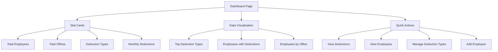

**Diagram sources**
- [dashboard.tsx:49-282](file://resources/js/pages/dashboard.tsx#L49-L282)

**Section sources**
- [dashboard.tsx:1-284](file://resources/js/pages/dashboard.tsx#L1-L284)

### Employee Management Interface
The employee management interface provides a comprehensive tabbed system for managing employee details:

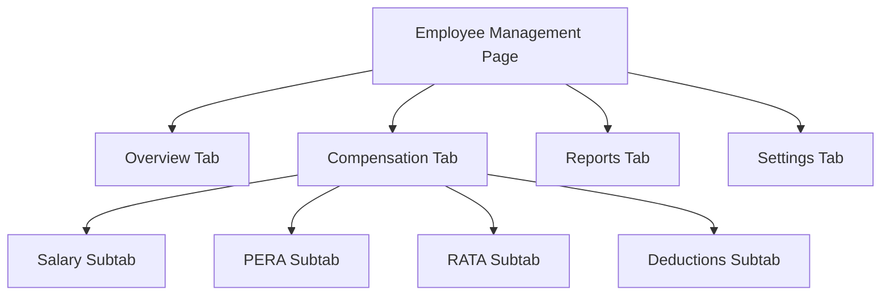

**Diagram sources**
- [Manage.tsx:88-115](file://resources/js/pages/Employees/Manage/Manage.tsx#L88-L115)
- [Compensation.tsx:17-40](file://resources/js/pages/Employees/Manage/Compensation.tsx#L17-L40)

**Section sources**
- [Manage.tsx:1-120](file://resources/js/pages/Employees/Manage/Manage.tsx#L1-L120)
- [Compensation.tsx:1-46](file://resources/js/pages/Employees/Manage/Compensation.tsx#L1-L46)
- [Settings.tsx:1-265](file://resources/js/pages/Employees/Manage/Settings.tsx#L1-L265)

## Dependency Analysis
The routing architecture exhibits clear separation of concerns:
- Routes depend on controllers for business logic.
- Controllers depend on middleware for shared data and root template rendering.
- Middleware depends on the Blade template for mounting React pages.
- Frontend pages depend on Inertia for navigation and data sharing.
- **Updated** Dashboard routes now depend on the dedicated DashboardController for centralized analytics functionality.

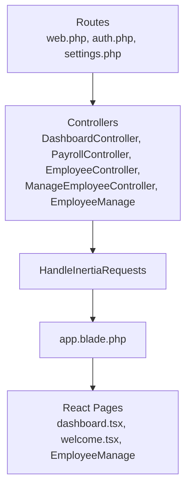

**Diagram sources**
- [web.php:1-115](file://routes/web.php#L1-L115)
- [auth.php:1-57](file://routes/auth.php#L1-L57)
- [settings.php:1-22](file://routes/settings.php#L1-L22)
- [HandleInertiaRequests.php:1-55](file://app/Http/Middleware/HandleInertiaRequests.php#L1-L55)
- [app.blade.php:1-21](file://resources/views/app.blade.php#L1-L21)

**Section sources**
- [web.php:1-115](file://routes/web.php#L1-L115)
- [auth.php:1-57](file://routes/auth.php#L1-L57)
- [settings.php:1-22](file://routes/settings.php#L1-L22)
- [HandleInertiaRequests.php:1-55](file://app/Http/Middleware/HandleInertiaRequests.php#L1-L55)
- [app.blade.php:1-21](file://resources/views/app.blade.php#L1-L21)

## Performance Considerations
- Route grouping reduces overhead by organizing related endpoints under shared prefixes.
- Inertia middleware shares minimal data to reduce payload sizes.
- Frontend page resolution leverages Vite for efficient asset loading.
- Pagination in controllers limits data transfer for large datasets.
- **Updated** DashboardController optimizes data loading by using efficient Eloquent queries and eager loading relationships to minimize database round trips.

## Troubleshooting Guide
Common issues and resolutions:
- Authentication redirects: Ensure guest/auth middleware groups are correctly applied to avoid login loops.
- Inertia rendering errors: Verify the root template path and shared data keys in middleware.
- Asset loading problems: Confirm Vite configuration and Blade @vite directives are present.
- Route not found: Check route group prefixes and controller method signatures.
- **Updated** Dashboard routing issues: Verify the DashboardController is properly imported and the route definition matches the controller method signature.

**Section sources**
- [auth.php:13-35](file://routes/auth.php#L13-L35)
- [HandleInertiaRequests.php:18-53](file://app/Http/Middleware/HandleInertiaRequests.php#L18-L53)
- [app.blade.php:12-20](file://resources/views/app.blade.php#L12-L20)
- [web.php:24-25](file://routes/web.php#L24-L25)

## Conclusion
The routing architecture combines Laravel's structured routing with Inertia.js to deliver a responsive, SPA-like experience. Routes are cleanly organized by domain, controllers encapsulate business logic, and middleware ensures consistent data sharing and template rendering. The recent major routing restructuring introduces comprehensive dashboard capabilities through the new DashboardController, replacing inline closures with a dedicated controller for centralized analytics and reporting. This enhanced architecture enables maintainable development and predictable navigation across authentication, payroll, employee management, and dashboard domains, providing a robust foundation for the payroll management application.