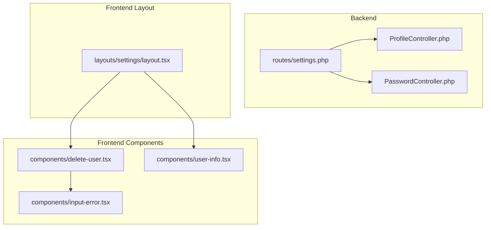
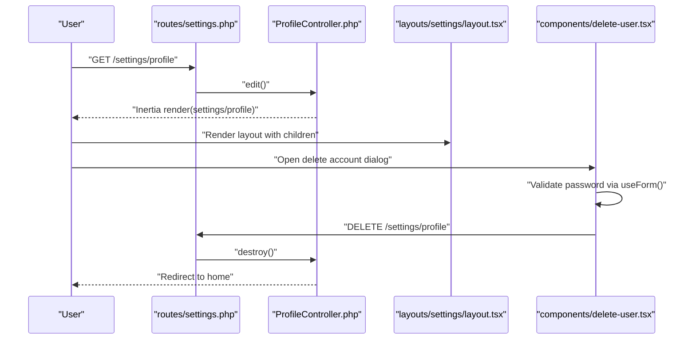
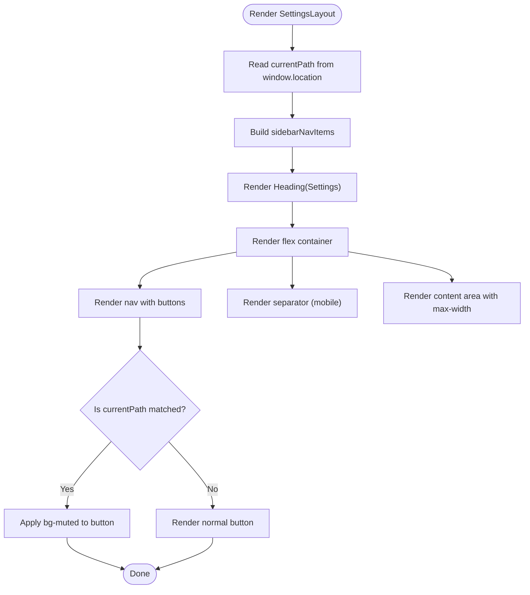
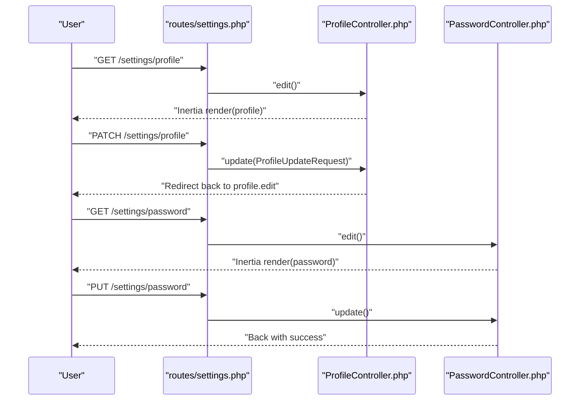
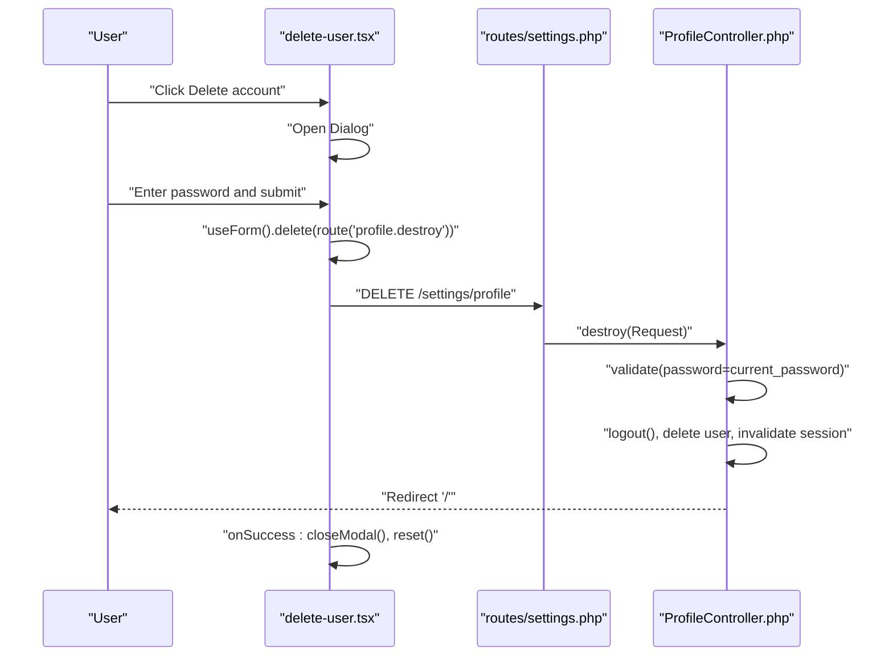
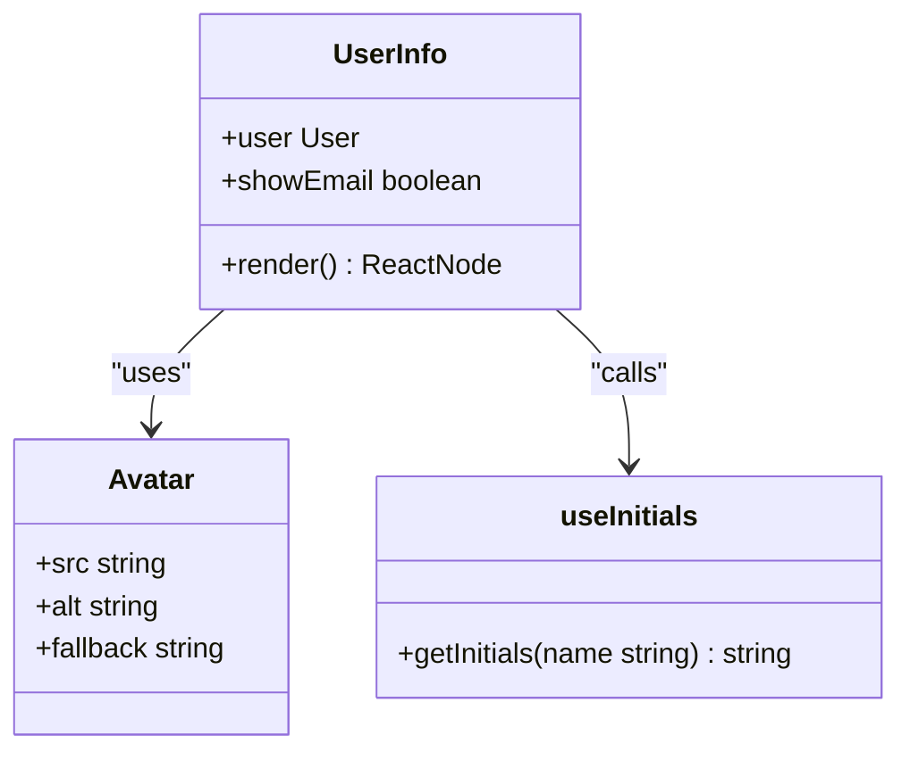
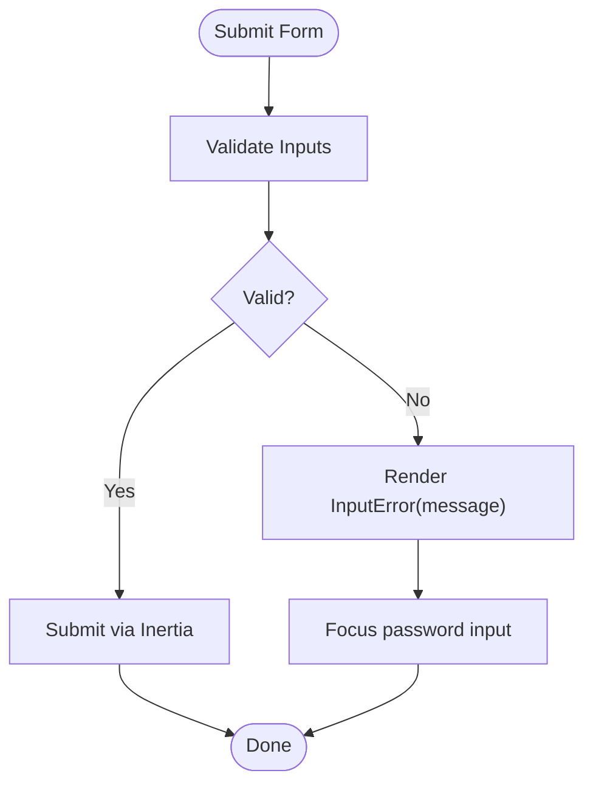
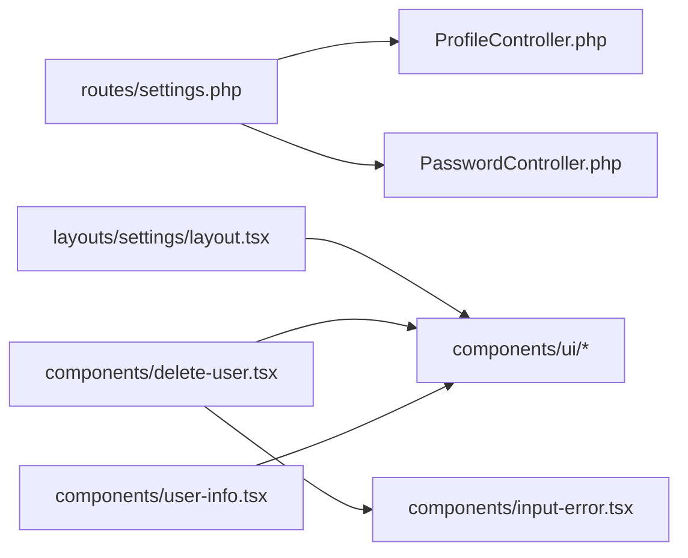

# Account Settings Interface

<cite>
**Referenced Files in This Document**
- [routes/settings.php](file://routes/settings.php)
- [app/Http/Controllers/Settings/ProfileController.php](file://app/Http/Controllers/Settings/ProfileController.php)
- [app/Http/Controllers/Settings/PasswordController.php](file://app/Http/Controllers/Settings/PasswordController.php)
- [resources/js/layouts/settings/layout.tsx](file://resources/js/layouts/settings/layout.tsx)
- [resources/js/components/delete-user.tsx](file://resources/js/components/delete-user.tsx)
- [resources/js/components/user-info.tsx](file://resources/js/components/user-info.tsx)
- [resources/js/components/input-error.tsx](file://resources/js/components/input-error.tsx)
</cite>

## Table of Contents
1. [Introduction](#introduction)
2. [Project Structure](#project-structure)
3. [Core Components](#core-components)
4. [Architecture Overview](#architecture-overview)
5. [Detailed Component Analysis](#detailed-component-analysis)
6. [Dependency Analysis](#dependency-analysis)
7. [Performance Considerations](#performance-considerations)
8. [Troubleshooting Guide](#troubleshooting-guide)
9. [Conclusion](#conclusion)

## Introduction
This document describes the account settings user interface components and layout structure. It explains the settings layout system, navigation patterns, and component organization. It covers user information display components, profile editing forms, and account management interfaces, including the delete user functionality with confirmation dialogs, security prompts, and account termination workflows. It also addresses responsive design considerations, accessibility features, and user experience patterns, along with component composition, prop handling, state management, form validation feedback, error handling, and user guidance.

## Project Structure
The settings feature spans backend routes and controllers, a shared settings layout, and frontend components for profile/password management and account deletion. The layout defines the navigation sidebar and content area, while dedicated components encapsulate form logic and validation feedback.

**Diagram sources**
- [routes/settings.php:1-22](file://routes/settings.php#L1-L22)
- [app/Http/Controllers/Settings/ProfileController.php:14-64](file://app/Http/Controllers/Settings/ProfileController.php#L14-L64)
- [app/Http/Controllers/Settings/PasswordController.php:14-44](file://app/Http/Controllers/Settings/PasswordController.php#L14-L44)
- [resources/js/layouts/settings/layout.tsx:26-62](file://resources/js/layouts/settings/layout.tsx#L26-L62)
- [resources/js/components/delete-user.tsx:14-91](file://resources/js/components/delete-user.tsx#L14-L91)
- [resources/js/components/user-info.tsx:5-23](file://resources/js/components/user-info.tsx#L5-L23)
- [resources/js/components/input-error.tsx:4-11](file://resources/js/components/input-error.tsx#L4-L11)

**Section sources**
- [routes/settings.php:8-21](file://routes/settings.php#L8-L21)
- [resources/js/layouts/settings/layout.tsx:8-24](file://resources/js/layouts/settings/layout.tsx#L8-L24)

## Core Components
- Settings layout: Provides a two-column responsive layout with a vertical navigation sidebar and content area. It highlights the active navigation item based on the current path and renders child content inside a constrained width container.
- Delete user component: Encapsulates the account deletion workflow with a confirmation dialog, password input, validation feedback, and destructive action handling via Inertia’s form state.
- User info component: Displays a user’s avatar and name, optionally with email, using initials fallback and responsive typography.
- Input error component: Renders inline validation error messages with consistent styling.

**Section sources**
- [resources/js/layouts/settings/layout.tsx:26-62](file://resources/js/layouts/settings/layout.tsx#L26-L62)
- [resources/js/components/delete-user.tsx:14-91](file://resources/js/components/delete-user.tsx#L14-L91)
- [resources/js/components/user-info.tsx:5-23](file://resources/js/components/user-info.tsx#L5-L23)
- [resources/js/components/input-error.tsx:4-11](file://resources/js/components/input-error.tsx#L4-L11)

## Architecture Overview
The settings feature follows an MVC-like pattern with Inertia rendering:
- Routes define the settings endpoints and middleware.
- Controllers handle requests, validate inputs, and return Inertia responses with appropriate props.
- The settings layout composes the sidebar navigation and content area.
- Components encapsulate UI logic, form state, and validation feedback.

**Diagram sources**
- [routes/settings.php:11-13](file://routes/settings.php#L11-L13)
- [app/Http/Controllers/Settings/ProfileController.php:19-41](file://app/Http/Controllers/Settings/ProfileController.php#L19-L41)
- [resources/js/layouts/settings/layout.tsx:26-62](file://resources/js/layouts/settings/layout.tsx#L26-L62)
- [resources/js/components/delete-user.tsx:18-27](file://resources/js/components/delete-user.tsx#L18-L27)

## Detailed Component Analysis

### Settings Layout System
- Navigation items: The layout defines three items: Profile, Password, and Appearance. Each item maps to a route and is visually highlighted when active.
- Responsive behavior: On small screens, the layout stacks vertically; on larger screens, it uses a horizontal split with a fixed-width sidebar and flexible content area.
- Content area: Children are wrapped in a constrained max-width container to maintain readability.

**Diagram sources**
- [resources/js/layouts/settings/layout.tsx:26-62](file://resources/js/layouts/settings/layout.tsx#L26-L62)
- [resources/js/layouts/settings/layout.tsx:8-24](file://resources/js/layouts/settings/layout.tsx#L8-L24)

**Section sources**
- [resources/js/layouts/settings/layout.tsx:26-62](file://resources/js/layouts/settings/layout.tsx#L26-L62)

### Profile Editing Forms and Account Management
- Profile edit page: The controller’s edit method renders the profile settings page and passes whether email verification is required and a status message from the session.
- Profile update: The controller validates and persists profile updates; if the email changed, the verification timestamp is cleared.
- Password edit page: The controller’s edit method renders the password settings page and passes the same props as the profile page.
- Password update: The controller validates the current password and new password (including confirmation), then hashes and updates the password.

**Diagram sources**
- [routes/settings.php:11-16](file://routes/settings.php#L11-L16)
- [app/Http/Controllers/Settings/ProfileController.php:19-41](file://app/Http/Controllers/Settings/ProfileController.php#L19-L41)
- [app/Http/Controllers/Settings/PasswordController.php:19-42](file://app/Http/Controllers/Settings/PasswordController.php#L19-L42)

**Section sources**
- [app/Http/Controllers/Settings/ProfileController.php:19-41](file://app/Http/Controllers/Settings/ProfileController.php#L19-L41)
- [app/Http/Controllers/Settings/PasswordController.php:19-42](file://app/Http/Controllers/Settings/PasswordController.php#L19-L42)

### Delete User Functionality
- Confirmation dialog: The component opens a modal dialog prompting for the user’s password to confirm deletion.
- Form state: Uses Inertia’s useForm hook to track the password input, submission state, and errors.
- Validation feedback: Displays inline error messages via the input-error component when validation fails.
- Security prompt: Requires the current password using a server-side validator before proceeding.
- Termination workflow: On success, the component closes the dialog and resets form state; the controller logs out the user, deletes the record, invalidates the session, regenerates the CSRF token, and redirects to the home page.

**Diagram sources**
- [resources/js/components/delete-user.tsx:18-27](file://resources/js/components/delete-user.tsx#L18-L27)
- [routes/settings.php:13](file://routes/settings.php#L13)
- [app/Http/Controllers/Settings/ProfileController.php:46-62](file://app/Http/Controllers/Settings/ProfileController.php#L46-L62)

**Section sources**
- [resources/js/components/delete-user.tsx:14-91](file://resources/js/components/delete-user.tsx#L14-L91)
- [app/Http/Controllers/Settings/ProfileController.php:46-62](file://app/Http/Controllers/Settings/ProfileController.php#L46-L62)

### User Information Display Components
- Avatar and initials: The component renders an avatar image with a fallback to initials generated from the user’s name.
- Optional email: When enabled, the component displays the user’s email below the name.
- Responsiveness: Typography adjusts for truncation and readability across screen sizes.

**Diagram sources**
- [resources/js/components/user-info.tsx:5-23](file://resources/js/components/user-info.tsx#L5-L23)

**Section sources**
- [resources/js/components/user-info.tsx:5-23](file://resources/js/components/user-info.tsx#L5-L23)

### Form Validation Feedback and Error Handling
- Inline error messages: The input-error component renders a styled paragraph when a message is provided.
- Component integration: The delete-user component passes errors to the input-error component to display validation failures.
- Focus management: On error, the component focuses the password input to improve accessibility and user guidance.

**Diagram sources**
- [resources/js/components/input-error.tsx:4-11](file://resources/js/components/input-error.tsx#L4-L11)
- [resources/js/components/delete-user.tsx:70](file://resources/js/components/delete-user.tsx#L70)
- [resources/js/components/delete-user.tsx:24](file://resources/js/components/delete-user.tsx#L24)

**Section sources**
- [resources/js/components/input-error.tsx:4-11](file://resources/js/components/input-error.tsx#L4-L11)
- [resources/js/components/delete-user.tsx:70-71](file://resources/js/components/delete-user.tsx#L70-L71)

## Dependency Analysis
- Routes depend on controllers to handle requests and return Inertia responses.
- The settings layout depends on UI primitives (buttons, separators) and navigation helpers.
- The delete-user component depends on form state utilities, dialog components, and input/error components.
- The user-info component depends on avatar UI and a hook for generating initials.

**Diagram sources**
- [routes/settings.php:11-16](file://routes/settings.php#L11-L16)
- [app/Http/Controllers/Settings/ProfileController.php:19-41](file://app/Http/Controllers/Settings/ProfileController.php#L19-L41)
- [app/Http/Controllers/Settings/PasswordController.php:19-42](file://app/Http/Controllers/Settings/PasswordController.php#L19-L42)
- [resources/js/layouts/settings/layout.tsx:26-62](file://resources/js/layouts/settings/layout.tsx#L26-L62)
- [resources/js/components/delete-user.tsx:14-91](file://resources/js/components/delete-user.tsx#L14-L91)
- [resources/js/components/user-info.tsx:5-23](file://resources/js/components/user-info.tsx#L5-L23)
- [resources/js/components/input-error.tsx:4-11](file://resources/js/components/input-error.tsx#L4-L11)

**Section sources**
- [routes/settings.php:8-21](file://routes/settings.php#L8-L21)
- [resources/js/layouts/settings/layout.tsx:26-62](file://resources/js/layouts/settings/layout.tsx#L26-L62)

## Performance Considerations
- Minimize re-renders: Keep form state scoped to components that need it (e.g., the delete-user component).
- Conditional rendering: Only mount heavy components when necessary (e.g., dialogs).
- CSS utilities: Use utility classes for responsive breakpoints to avoid runtime calculations.
- Accessibility: Ensure focus management and ARIA labels are present for interactive elements.

## Troubleshooting Guide
- Password confirmation errors: When updating the password, ensure the new password matches the confirmation field and meets server-side requirements.
- Email change verification: Changing the email triggers a re-verification requirement; verify the new address after saving.
- Session invalidation: After deleting an account, the session is invalidated and the CSRF token is regenerated; expect redirection to the home page.
- Focus on error: If validation fails during deletion, the password input receives focus automatically to aid correction.

**Section sources**
- [app/Http/Controllers/Settings/PasswordController.php:32-42](file://app/Http/Controllers/Settings/PasswordController.php#L32-L42)
- [app/Http/Controllers/Settings/ProfileController.php:34-38](file://app/Http/Controllers/Settings/ProfileController.php#L34-L38)
- [app/Http/Controllers/Settings/ProfileController.php:58-62](file://app/Http/Controllers/Settings/ProfileController.php#L58-L62)
- [resources/js/components/delete-user.tsx:24](file://resources/js/components/delete-user.tsx#L24)

## Conclusion
The settings interface combines a reusable layout with focused components for profile and password management, and a secure, accessible account deletion flow. The layout ensures consistent navigation and responsive presentation, while components encapsulate form state, validation, and error feedback. Backend controllers enforce security policies, including password confirmation for destructive actions and session cleanup upon account termination.