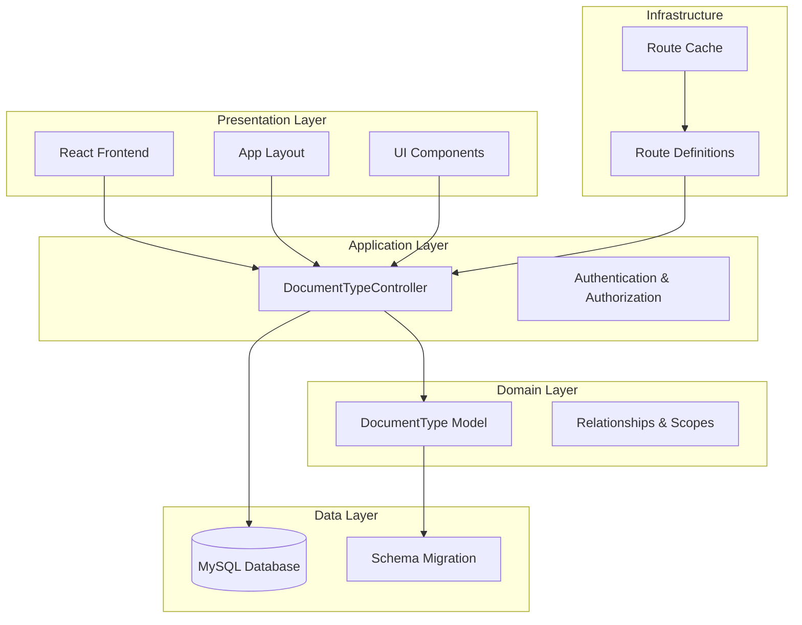
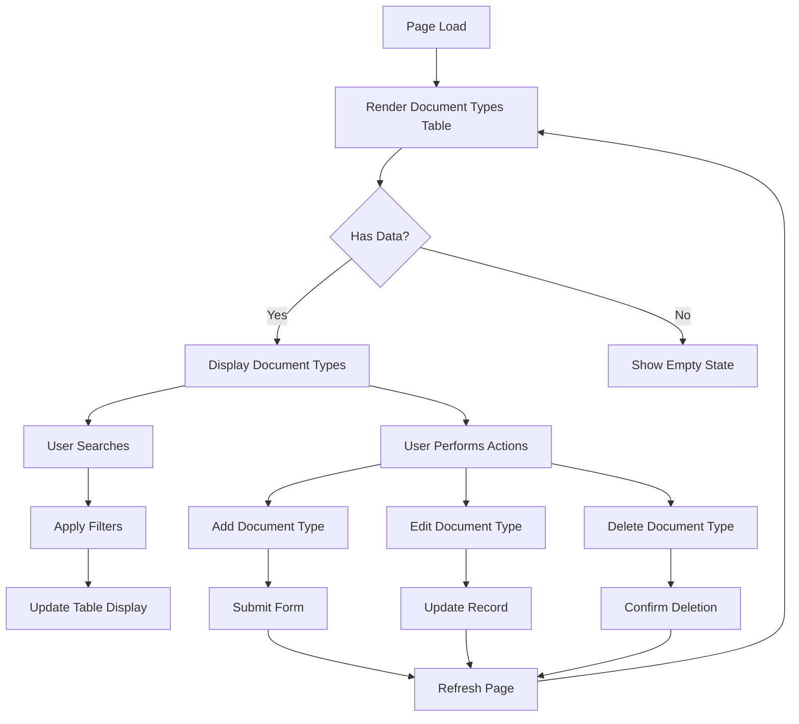
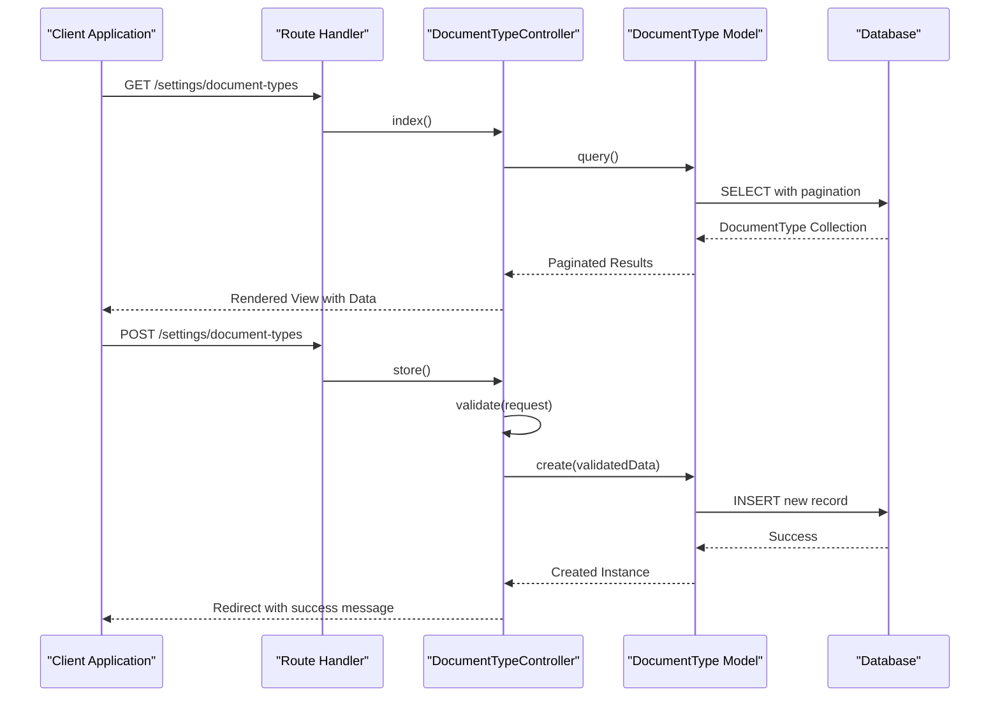
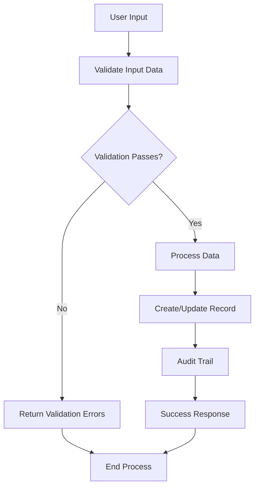

# Document Type Management

<cite>
**Referenced Files in This Document**
- [DocumentType.php](file://app/Models/DocumentType.php)
- [DocumentTypeController.php](file://app/Http/Controllers/DocumentTypeController.php)
- [2026_03_23_032641_create_document_types_table.php](file://database/migrations/2026_03_23_032641_create_document_types_table.php)
- [index.tsx](file://resources/js/pages/document-types/index.tsx)
- [documentType.ts](file://resources/js/types/documentType.ts)
- [web.php](file://routes/web.php)
- [routes-v7.php](file://bootstrap/cache/routes-v7.php)
</cite>

## Table of Contents
1. [Introduction](#introduction)
2. [System Architecture](#system-architecture)
3. [Core Components](#core-components)
4. [Data Model](#data-model)
5. [User Interface](#user-interface)
6. [API Endpoints](#api-endpoints)
7. [Business Logic](#business-logic)
8. [Search and Filtering](#search-and-filtering)
9. [User Experience Features](#user-experience-features)
10. [Security and Validation](#security-and-validation)
11. [Integration Points](#integration-points)
12. [Performance Considerations](#performance-considerations)
13. [Troubleshooting Guide](#troubleshooting-guide)
14. [Conclusion](#conclusion)

## Introduction

Document Type Management is a core administrative feature within the payroll and HR system that allows organizations to define and maintain standardized categories for employee-related documents. This system provides a centralized way to organize document classifications, ensuring consistency across payroll processing, employee records, and document tracking workflows.

The system supports CRUD operations for document types, includes search and filtering capabilities, maintains audit trails through created_by relationships, and provides user-friendly interfaces for managing document categories. It integrates seamlessly with the broader payroll management ecosystem and supports soft-deletion for data recovery scenarios.

## System Architecture

The Document Type Management system follows a clean MVC (Model-View-Controller) architecture pattern with clear separation of concerns:



**Diagram sources**
- [DocumentTypeController.php:1-68](file://app/Http/Controllers/DocumentTypeController.php#L1-L68)
- [DocumentType.php:1-39](file://app/Models/DocumentType.php#L1-L39)
- [web.php:105-110](file://routes/web.php#L105-L110)

## Core Components

### Backend Components

The backend consists of three primary components working together to provide document type management functionality:

**Model Layer**: The DocumentType model handles data persistence, validation, and relationships with the User model for audit trail functionality.

**Controller Layer**: The DocumentTypeController manages HTTP requests, implements CRUD operations, and coordinates between models and views.

**Route Layer**: Defines the RESTful endpoints for document type operations within the settings namespace.

### Frontend Components

The frontend implementation provides a comprehensive user interface with modern React patterns:

**Page Component**: Implements the main document types page with search, filtering, and CRUD operations.

**Form Components**: Provides modal dialogs for adding, editing, and deleting document types.

**UI Components**: Utilizes a component library for consistent user experience across the application.

**Type Safety**: Strongly typed TypeScript interfaces ensure data integrity and developer experience.

**Section sources**
- [DocumentType.php:1-39](file://app/Models/DocumentType.php#L1-L39)
- [DocumentTypeController.php:1-68](file://app/Http/Controllers/DocumentTypeController.php#L1-L68)
- [index.tsx:1-334](file://resources/js/pages/document-types/index.tsx#L1-L334)

## Data Model

The Document Type system utilizes a well-structured relational database design with comprehensive relationships and constraints:

```mermaid
erDiagram
DOCUMENT_TYPES {
bigint id PK
string name
string code UK
text description
boolean is_active
bigint created_by FK
timestamp created_at
timestamp updated_at
timestamp deleted_at
}
USERS {
bigint id PK
string name
string email
timestamp email_verified_at
string password
remember_token
timestamp created_at
timestamp updated_at
}
DOCUMENT_TYPES ||--|| USERS : "created_by"
```

**Diagram sources**
- [2026_03_23_032641_create_document_types_table.php:14-23](file://database/migrations/2026_03_23_032641_create_document_types_table.php#L14-L23)
- [DocumentType.php:25-28](file://app/Models/DocumentType.php#L25-L28)

### Field Specifications

| Field | Type | Constraints | Description |
|-------|------|-------------|-------------|
| id | bigint | PRIMARY KEY, AUTO_INCREMENT | Unique identifier for each document type |
| name | varchar(255) | NOT NULL | Human-readable name of the document type |
| code | varchar(50) | UNIQUE, NOT NULL | Short code identifier for the document type |
| description | text | NULLABLE | Optional detailed description |
| is_active | boolean | DEFAULT TRUE | Activation status for the document type |
| created_by | bigint | FOREIGN KEY(users.id) | Audit trail of who created the record |
| created_at | timestamp | NULLABLE | Timestamp of creation |
| updated_at | timestamp | NULLABLE | Timestamp of last modification |
| deleted_at | timestamp | NULLABLE | Timestamp for soft-deleted records |

### Model Relationships

The DocumentType model establishes important relationships within the system:

**Created By Relationship**: Links document types to the User who created them, enabling audit trails and accountability.

**Soft Delete Capability**: Implements Laravel's soft delete functionality for data recovery and historical tracking.

**Automatic Creation Tracking**: Uses model boot method to automatically capture the current authenticated user during creation.

**Section sources**
- [2026_03_23_032641_create_document_types_table.php:14-23](file://database/migrations/2026_03_23_032641_create_document_types_table.php#L14-L23)
- [DocumentType.php:25-38](file://app/Models/DocumentType.php#L25-L38)

## User Interface

The frontend implementation provides a modern, responsive interface designed for efficient document type management:



**Diagram sources**
- [index.tsx:123-334](file://resources/js/pages/document-types/index.tsx#L123-L334)

### Interface Features

**Responsive Design**: Adapts to various screen sizes and devices for optimal user experience.

**Search Functionality**: Real-time search capability with Enter key support and query string preservation.

**Modal Dialogs**: Non-intrusive forms for add, edit, and delete operations with proper validation feedback.

**Status Indicators**: Color-coded status badges for active/inactive document types.

**Pagination Support**: Efficient handling of large datasets with configurable page sizes.

**Form Validation**: Comprehensive client-side validation with user-friendly error messages.

**Section sources**
- [index.tsx:1-334](file://resources/js/pages/document-types/index.tsx#L1-L334)
- [documentType.ts:1-16](file://resources/js/types/documentType.ts#L1-L16)

## API Endpoints

The system exposes RESTful endpoints for comprehensive document type management:

| Method | Endpoint | Action | Description |
|--------|----------|--------|-------------|
| GET | `/settings/document-types` | index | Retrieve paginated document types with search and filtering |
| POST | `/settings/document-types` | store | Create a new document type |
| PUT | `/settings/document-types/{documentType}` | update | Update an existing document type |
| DELETE | `/settings/document-types/{documentType}` | destroy | Delete a document type (soft delete) |

### Route Configuration

The routes are organized within the settings namespace, following Laravel's resource controller conventions:



**Diagram sources**
- [web.php:105-110](file://routes/web.php#L105-L110)
- [DocumentTypeController.php:11-66](file://app/Http/Controllers/DocumentTypeController.php#L11-L66)

**Section sources**
- [web.php:105-110](file://routes/web.php#L105-L110)
- [routes-v7.php:2793-2926](file://bootstrap/cache/routes-v7.php#L2793-L2926)

## Business Logic

The system implements comprehensive business logic to ensure data integrity and provide meaningful functionality:

### Validation Rules

Each operation enforces strict validation rules:

**Create Operation**:
- Name: Required, string, maximum 255 characters
- Code: Required, unique across document_types table, maximum 50 characters
- Description: Optional, string
- Active Status: Boolean value

**Update Operation**:
- Same validation rules as create, with code uniqueness excluding the current document type

### Data Processing Flow



**Diagram sources**
- [DocumentTypeController.php:35-54](file://app/Http/Controllers/DocumentTypeController.php#L35-L54)

### Automatic Auditing

The system automatically captures creation metadata:

**Created By**: Automatically sets the current authenticated user ID during record creation
**Timestamps**: Maintains automatic created_at and updated_at timestamps
**Soft Deletes**: Supports recovery through soft deletion mechanism

**Section sources**
- [DocumentTypeController.php:33-66](file://app/Http/Controllers/DocumentTypeController.php#L33-L66)
- [DocumentType.php:30-38](file://app/Models/DocumentType.php#L30-L38)

## Search and Filtering

The system provides robust search and filtering capabilities for efficient document type discovery:

### Search Implementation

**Multi-field Search**: Searches across both name and code fields using LIKE operators
**Case-insensitive Matching**: Utilizes database-specific LIKE pattern matching
**Real-time Updates**: Search results update immediately as users type
**Query String Preservation**: Maintains search state across pagination

### Filtering Features

**Active/Inactive Toggle**: Visual indicators for document type status
**Pagination Control**: Configurable page sizes with 20 items per page
**Sort Ordering**: Alphabetical sorting by name field
**Empty State Handling**: Graceful display when no matching records are found

**Section sources**
- [DocumentTypeController.php:11-31](file://app/Http/Controllers/DocumentTypeController.php#L11-L31)
- [index.tsx:61-70](file://resources/js/pages/document-types/index.tsx#L61-L70)

## User Experience Features

The frontend implementation prioritizes user experience through thoughtful interface design:

### Interactive Elements

**Keyboard Navigation**: Enter key support for quick form submission
**Modal Dialogs**: Non-modal forms that don't navigate away from context
**Loading States**: Disabled states during processing to prevent duplicate submissions
**Success Feedback**: Clear success messages for user actions
**Confirmation Dialogs**: Prevent accidental deletions with confirmation prompts

### Accessibility Features

**Semantic HTML**: Proper use of HTML elements for screen readers
**Focus Management**: Logical tab order and focus indicators
**Color Contrast**: Sufficient contrast ratios for text and interactive elements
**Error Communication**: Clear, descriptive error messages

### Responsive Design

**Mobile-first Approach**: Optimized for mobile device usage
**Flexible Layouts**: Adapts to different screen sizes and orientations
**Touch-friendly Controls**: Appropriate sizing for touch interaction

**Section sources**
- [index.tsx:123-334](file://resources/js/pages/document-types/index.tsx#L123-L334)

## Security and Validation

The system implements comprehensive security measures and validation:

### Authentication and Authorization

**Middleware Protection**: All document type routes require authentication middleware
**Route Guards**: Ensures only authenticated users can access document type management
**CSRF Protection**: Built-in protection against cross-site request forgery attacks

### Data Validation

**Server-side Validation**: Comprehensive validation rules enforced on the server
**Client-side Validation**: Immediate feedback for user input errors
**Unique Constraints**: Database-level uniqueness enforcement for document codes
**Type Casting**: Automatic type conversion for boolean and numeric fields

### Security Measures

**SQL Injection Prevention**: Uses parameterized queries and Eloquent ORM
**XSS Protection**: Automatic HTML escaping in template rendering
**Audit Trails**: Complete tracking of who created, modified, or deleted records
**Soft Deletion**: Prevents permanent data loss while maintaining referential integrity

**Section sources**
- [web.php:24-111](file://routes/web.php#L24-L111)
- [DocumentTypeController.php:35-54](file://app/Http/Controllers/DocumentTypeController.php#L35-L54)

## Integration Points

The Document Type Management system integrates with several other components of the payroll and HR system:

### Related Models

While the current implementation focuses specifically on document types, the system is designed to integrate with:

**Employee Records**: Document types can be associated with employee documents and records
**Payroll Processing**: Document types support various payroll-related document categories
**Deduction Management**: Integration points with deduction type categorization

### Frontend Integration

**TypeScript Interfaces**: Strongly typed interfaces ensure type safety across the application
**Component Library**: Consistent UI components for uniform user experience
**State Management**: Integration with Inertia.js for seamless page transitions
**Breadcrumb Navigation**: Contextual navigation within the application structure

### Backend Integration

**Eloquent ORM**: Seamless integration with Laravel's database abstraction layer
**Validation System**: Leverages Laravel's comprehensive validation framework
**Middleware Pipeline**: Integrates with Laravel's middleware system for request processing
**Event System**: Can emit events for external system notifications

**Section sources**
- [documentType.ts:1-16](file://resources/js/types/documentType.ts#L1-L16)

## Performance Considerations

The system is designed with performance optimization in mind:

### Database Optimization

**Indexing Strategy**: Unique index on code field for fast lookups
**Pagination**: Efficient handling of large datasets with configurable page sizes
**Query Optimization**: Selective field retrieval and relationship loading
**Soft Delete Efficiency**: Minimal overhead for soft deletion operations

### Frontend Performance

**Component Reusability**: Shared components reduce bundle size and improve load times
**Lazy Loading**: Route-based lazy loading for optimal initial page load
**State Management**: Efficient state updates minimize re-renders
**Memory Management**: Proper cleanup of event listeners and subscriptions

### Caching Strategies

**Route Caching**: Laravel route caching improves route resolution performance
**Query Result Caching**: Potential for implementing query result caching for frequently accessed data
**Browser Caching**: Appropriate caching headers for static assets

## Troubleshooting Guide

Common issues and their solutions:

### Database Issues

**Migration Failures**: Ensure database connection is properly configured and run `php artisan migrate:fresh`
**Unique Constraint Errors**: Verify that document codes are unique before attempting to save
**Soft Delete Conflicts**: Check for existing soft-deleted records that might conflict with new entries

### Frontend Issues

**Form Validation Errors**: Review console for validation error messages and ensure all required fields are populated
**Route Not Found**: Verify that the settings namespace routes are properly registered
**Component Rendering Issues**: Check for missing dependencies or incorrect prop types

### Backend Issues

**Authentication Problems**: Ensure user is properly authenticated before accessing document type routes
**Permission Denied**: Verify that the authenticated user has appropriate permissions
**Memory Issues**: Monitor memory usage for large dataset operations

### Debugging Steps

1. **Check Laravel Logs**: Review `storage/logs/laravel.log` for detailed error information
2. **Database Queries**: Use Laravel Debugbar to inspect executed SQL queries
3. **Network Requests**: Monitor browser network tab for API response details
4. **Console Errors**: Check browser console for JavaScript runtime errors

**Section sources**
- [DocumentTypeController.php:11-66](file://app/Http/Controllers/DocumentTypeController.php#L11-L66)
- [DocumentType.php:30-38](file://app/Models/DocumentType.php#L30-L38)

## Conclusion

The Document Type Management system provides a comprehensive, secure, and user-friendly solution for organizing document categories within the payroll and HR ecosystem. Its well-architected design ensures scalability, maintainability, and optimal user experience.

Key strengths include:

**Technical Excellence**: Clean MVC architecture, comprehensive validation, and robust security measures
**User Experience**: Intuitive interface with responsive design and accessibility features
**Data Integrity**: Strong typing, validation, and audit trail capabilities
**Performance**: Optimized database queries and efficient frontend implementation
**Extensibility**: Designed architecture that supports future enhancements and integrations

The system successfully balances functionality with usability, providing administrators with powerful tools for document type management while maintaining the simplicity needed for day-to-day operations. Its integration with the broader payroll system ensures seamless workflow continuity and data consistency across the organization.