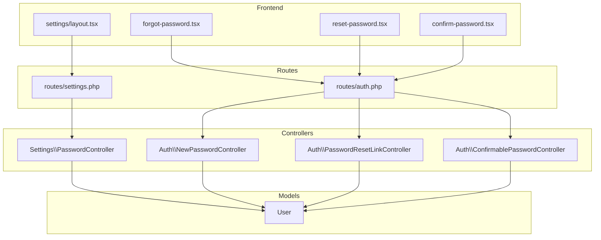
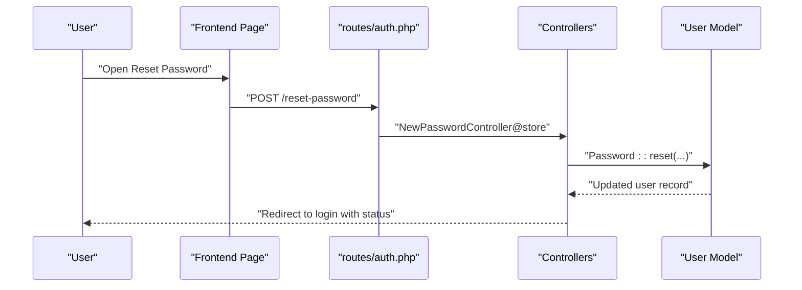
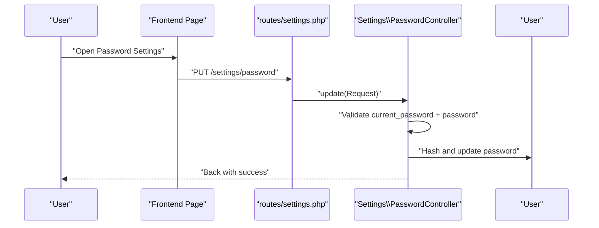
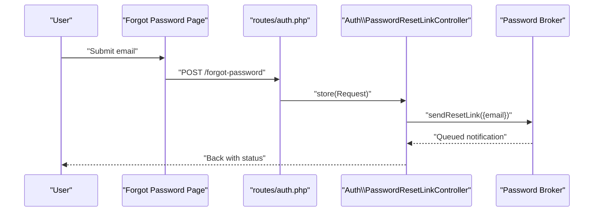
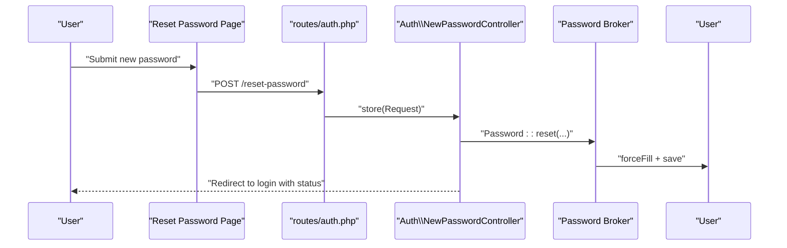
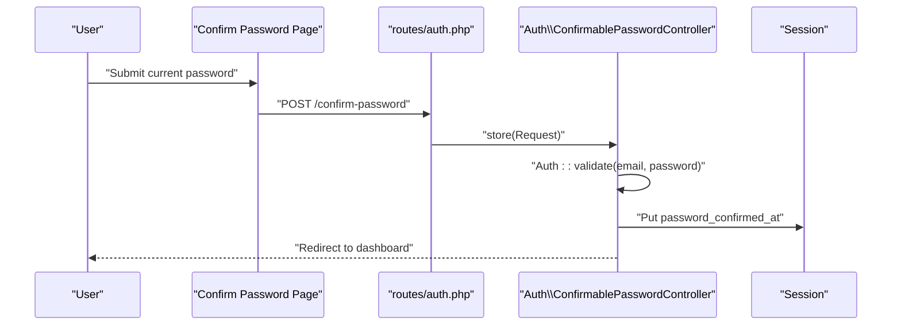
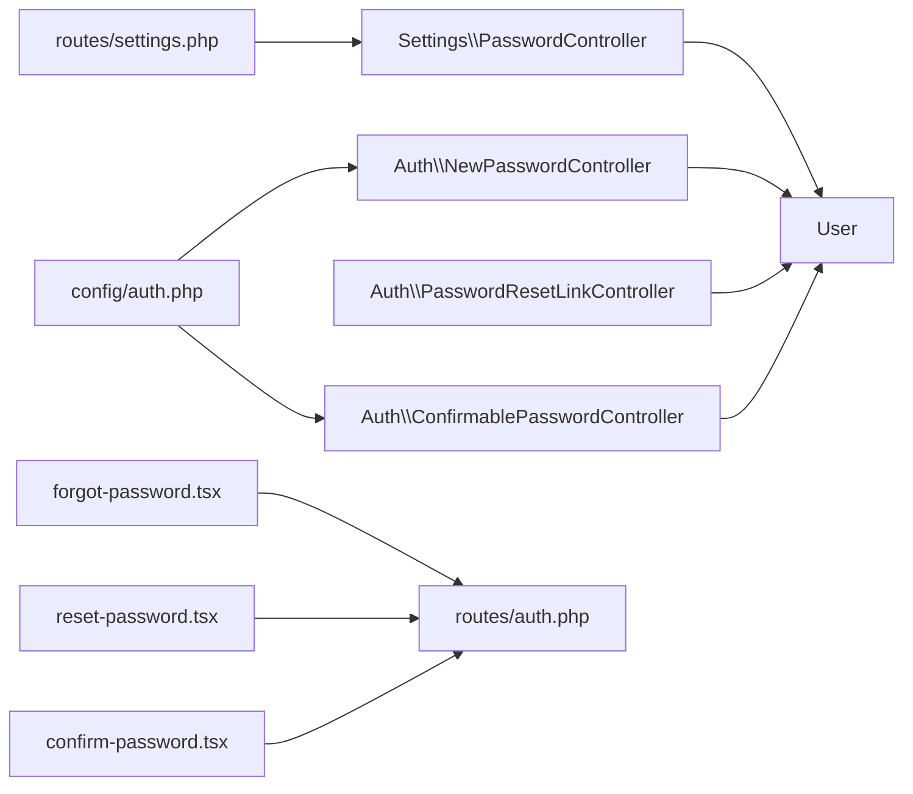

# Password Management

<cite>
**Referenced Files in This Document**
- [PasswordController.php](file://app/Http/Controllers/Settings/PasswordController.php)
- [NewPasswordController.php](file://app/Http/Controllers/Auth/NewPasswordController.php)
- [PasswordResetLinkController.php](file://app/Http/Controllers/Auth/PasswordResetLinkController.php)
- [ConfirmablePasswordController.php](file://app/Http/Controllers/Auth/ConfirmablePasswordController.php)
- [routes/auth.php](file://routes/auth.php)
- [routes/settings.php](file://routes/settings.php)
- [config/auth.php](file://config/auth.php)
- [User.php](file://app/Models/User.php)
- [forgot-password.tsx](file://resources/js/pages/auth/forgot-password.tsx)
- [reset-password.tsx](file://resources/js/pages/auth/reset-password.tsx)
- [confirm-password.tsx](file://resources/js/pages/auth/confirm-password.tsx)
- [layout.tsx](file://resources/js/layouts/settings/layout.tsx)
</cite>

## Table of Contents
1. [Introduction](#introduction)
2. [Project Structure](#project-structure)
3. [Core Components](#core-components)
4. [Architecture Overview](#architecture-overview)
5. [Detailed Component Analysis](#detailed-component-analysis)
6. [Dependency Analysis](#dependency-analysis)
7. [Performance Considerations](#performance-considerations)
8. [Troubleshooting Guide](#troubleshooting-guide)
9. [Conclusion](#conclusion)

## Introduction
This document explains the password management system in the application, covering password changes, resets, and confirmation requirements. It documents the backend controllers, frontend components, routing, configuration, and security policies. It also outlines validation rules, hashing, session-based confirmation, and UI patterns for forms, error handling, and success messaging.

## Project Structure
The password management feature spans backend controllers, frontend pages, routes, and configuration:
- Backend controllers handle password change, reset link requests, password resets, and confirmation.
- Frontend pages implement forms for forgot password, reset password, and confirm password.
- Routes define endpoints for guest and authenticated flows.
- Configuration governs password reset tokens, expiration, throttling, and password hashing behavior.

**Diagram sources**
- [routes/auth.php:1-57](file://routes/auth.php#L1-L57)
- [routes/settings.php:1-22](file://routes/settings.php#L1-L22)
- [PasswordController.php:14-43](file://app/Http/Controllers/Settings/PasswordController.php#L14-L43)
- [NewPasswordController.php:17-69](file://app/Http/Controllers/Auth/NewPasswordController.php#L17-L69)
- [PasswordResetLinkController.php:12-41](file://app/Http/Controllers/Auth/PasswordResetLinkController.php#L12-L41)
- [ConfirmablePasswordController.php:13-41](file://app/Http/Controllers/Auth/ConfirmablePasswordController.php#L13-L41)
- [User.php:10-48](file://app/Models/User.php#L10-L48)
- [forgot-password.tsx:13-63](file://resources/js/pages/auth/forgot-password.tsx#L13-L63)
- [reset-password.tsx:23-98](file://resources/js/pages/auth/reset-password.tsx#L23-L98)
- [confirm-password.tsx:12-60](file://resources/js/pages/auth/confirm-password.tsx#L12-L60)
- [layout.tsx:8-24](file://resources/js/layouts/settings/layout.tsx#L8-L24)

**Section sources**
- [routes/auth.php:1-57](file://routes/auth.php#L1-L57)
- [routes/settings.php:1-22](file://routes/settings.php#L1-L22)

## Core Components
- PasswordController: Renders the password settings page and updates the user’s password after validating the current password and new password confirmation.
- NewPasswordController: Handles reset link creation and password reset submission, including token validation and password hashing.
- PasswordResetLinkController: Manages the request to send a password reset link and displays the form.
- ConfirmablePasswordController: Confirms the user’s current password for access to protected areas and stores a confirmation timestamp in the session.
- User model: Defines fillable attributes, hidden fields, and password casting for secure hashing.
- Frontend pages: Provide forms for forgot password, reset password, and confirm password with validation feedback and loading states.
- Settings layout: Provides navigation to the password settings page.

**Section sources**
- [PasswordController.php:14-43](file://app/Http/Controllers/Settings/PasswordController.php#L14-L43)
- [NewPasswordController.php:17-69](file://app/Http/Controllers/Auth/NewPasswordController.php#L17-L69)
- [PasswordResetLinkController.php:12-41](file://app/Http/Controllers/Auth/PasswordResetLinkController.php#L12-L41)
- [ConfirmablePasswordController.php:13-41](file://app/Http/Controllers/Auth/ConfirmablePasswordController.php#L13-L41)
- [User.php:10-48](file://app/Models/User.php#L10-L48)
- [forgot-password.tsx:13-63](file://resources/js/pages/auth/forgot-password.tsx#L13-L63)
- [reset-password.tsx:23-98](file://resources/js/pages/auth/reset-password.tsx#L23-L98)
- [confirm-password.tsx:12-60](file://resources/js/pages/auth/confirm-password.tsx#L12-L60)
- [layout.tsx:8-24](file://resources/js/layouts/settings/layout.tsx#L8-L24)

## Architecture Overview
The system follows a layered pattern:
- Routes define endpoints for password reset, confirmation, and settings.
- Controllers orchestrate validation, hashing, persistence, and redirection.
- Models encapsulate user credentials and hashing behavior.
- Frontend pages render forms, bind data, and submit via Inertia to controllers.
- Configuration controls token lifetime, throttling, and password hashing.

**Diagram sources**
- [routes/auth.php:30-34](file://routes/auth.php#L30-L34)
- [NewPasswordController.php:35-68](file://app/Http/Controllers/Auth/NewPasswordController.php#L35-L68)
- [User.php:10-48](file://app/Models/User.php#L10-L48)

## Detailed Component Analysis

### Password Change Workflow (Settings)
- Endpoint: GET /settings/password renders the password settings page.
- Endpoint: PUT /settings/password updates the password.
- Validation:
  - current_password: required and must match the user’s existing password.
  - password: required, confirmed, and adheres to default password rules.
- Persistence:
  - Hashes the new password before saving.
- Response:
  - Returns to the previous page with a success indicator.

**Diagram sources**
- [routes/settings.php:15-16](file://routes/settings.php#L15-L16)
- [PasswordController.php:30-42](file://app/Http/Controllers/Settings/PasswordController.php#L30-L42)
- [User.php:45](file://app/Models/User.php#L45)

**Section sources**
- [PasswordController.php:19-42](file://app/Http/Controllers/Settings/PasswordController.php#L19-L42)
- [routes/settings.php:15-16](file://routes/settings.php#L15-L16)

### Password Reset Link Request
- Endpoint: GET /forgot-password displays the form.
- Endpoint: POST /forgot-password sends a reset link if an account exists.
- Validation: email is required and must be a valid email address.
- Behavior: Uses the password broker to dispatch a reset notification.

**Diagram sources**
- [routes/auth.php:24-28](file://routes/auth.php#L24-L28)
- [PasswordResetLinkController.php:29-40](file://app/Http/Controllers/Auth/PasswordResetLinkController.php#L29-L40)

**Section sources**
- [PasswordResetLinkController.php:17-40](file://app/Http/Controllers/Auth/PasswordResetLinkController.php#L17-L40)
- [routes/auth.php:24-28](file://routes/auth.php#L24-L28)

### Password Reset Submission
- Endpoint: GET /reset-password/{token} renders the reset form with pre-filled email and token.
- Endpoint: POST /reset-password validates token, email, and password, then resets the password.
- Validation:
  - token: required.
  - email: required and valid.
  - password: required, confirmed, and adheres to default password rules.
- Persistence:
  - Hashes the new password and clears the reset token.
  - Emits a password reset event.
- Response:
  - On success: redirects to login with a status message.
  - On failure: throws a validation exception with the status message.

**Diagram sources**
- [routes/auth.php:30-34](file://routes/auth.php#L30-L34)
- [NewPasswordController.php:35-68](file://app/Http/Controllers/Auth/NewPasswordController.php#L35-L68)
- [User.php:49](file://app/Models/User.php#L49)

**Section sources**
- [NewPasswordController.php:22-68](file://app/Http/Controllers/Auth/NewPasswordController.php#L22-L68)
- [routes/auth.php:30-34](file://routes/auth.php#L30-L34)

### Password Confirmation for Sensitive Operations
- Endpoint: GET /confirm-password renders the confirmation page.
- Endpoint: POST /confirm-password validates the current password against the authenticated user.
- Session:
  - Stores a confirmation timestamp upon successful validation.
- Behavior:
  - Redirects to the intended destination on success.
  - Throws a validation exception with a localized message on failure.

**Diagram sources**
- [routes/auth.php:49-52](file://routes/auth.php#L49-L52)
- [ConfirmablePasswordController.php:26-40](file://app/Http/Controllers/Auth/ConfirmablePasswordController.php#L26-L40)

**Section sources**
- [ConfirmablePasswordController.php:18-40](file://app/Http/Controllers/Auth/ConfirmablePasswordController.php#L18-L40)
- [routes/auth.php:49-52](file://routes/auth.php#L49-L52)

### Password Strength and Validation Rules
- Default password rules enforced by the framework:
  - Minimum length and character variety requirements.
  - Confirmation requirement for the new password.
- Current password validation:
  - Uses a “current password” rule to ensure the provided current password matches the stored hash.

**Section sources**
- [PasswordController.php:32-35](file://app/Http/Controllers/Settings/PasswordController.php#L32-L35)
- [NewPasswordController.php:37-41](file://app/Http/Controllers/Auth/NewPasswordController.php#L37-L41)

### Security Policies and Hashing
- Password hashing:
  - Backend: Uses a secure hashing mechanism when updating passwords.
  - Model: Declares password casting to ensure hashed representation.
- Token lifecycle:
  - Password reset tokens expire after a configured duration.
  - Throttling limits repeated reset attempts.
- Session-based confirmation:
  - Confirmation timestamp stored in the session to avoid repeated prompts for a configurable timeout.

**Section sources**
- [PasswordController.php:37-39](file://app/Http/Controllers/Settings/PasswordController.php#L37-L39)
- [NewPasswordController.php:48-54](file://app/Http/Controllers/Auth/NewPasswordController.php#L48-L54)
- [User.php:45](file://app/Models/User.php#L45)
- [config/auth.php:93-100](file://config/auth.php#L93-L100)
- [config/auth.php:113](file://config/auth.php#L113)

### User Interface Components and Forms
- Forgot Password Page:
  - Displays a single email field with validation feedback.
  - Submits to the reset link endpoint.
- Reset Password Page:
  - Displays email (read-only), password, and confirmation fields.
  - Submits to the reset endpoint and clears form fields on finish.
- Confirm Password Page:
  - Displays a single password field with validation feedback.
  - Submits to the confirmation endpoint and clears the field on finish.
- Settings Layout:
  - Navigation to the password settings page within the settings area.

**Section sources**
- [forgot-password.tsx:13-63](file://resources/js/pages/auth/forgot-password.tsx#L13-L63)
- [reset-password.tsx:23-98](file://resources/js/pages/auth/reset-password.tsx#L23-L98)
- [confirm-password.tsx:12-60](file://resources/js/pages/auth/confirm-password.tsx#L12-L60)
- [layout.tsx:8-24](file://resources/js/layouts/settings/layout.tsx#L8-L24)

## Dependency Analysis
- Controllers depend on:
  - Validation rules for password requirements.
  - Hashing utilities for secure password storage.
  - The password broker for reset link and token handling.
  - The User model for persistence.
- Routes connect frontend pages to controllers.
- Configuration defines token behavior and timeouts.

**Diagram sources**
- [PasswordController.php:14-43](file://app/Http/Controllers/Settings/PasswordController.php#L14-L43)
- [NewPasswordController.php:17-69](file://app/Http/Controllers/Auth/NewPasswordController.php#L17-L69)
- [PasswordResetLinkController.php:12-41](file://app/Http/Controllers/Auth/PasswordResetLinkController.php#L12-L41)
- [ConfirmablePasswordController.php:13-41](file://app/Http/Controllers/Auth/ConfirmablePasswordController.php#L13-L41)
- [User.php:10-48](file://app/Models/User.php#L10-L48)
- [routes/auth.php:1-57](file://routes/auth.php#L1-L57)
- [routes/settings.php:1-22](file://routes/settings.php#L1-L22)
- [config/auth.php:93-113](file://config/auth.php#L93-L113)

**Section sources**
- [config/auth.php:93-113](file://config/auth.php#L93-L113)

## Performance Considerations
- Prefer server-side hashing and validation to minimize client-side computation.
- Keep password reset token expiration short to reduce exposure windows.
- Use throttling to prevent abuse of reset endpoints.
- Avoid logging raw passwords or tokens; rely on framework-provided mechanisms.

## Troubleshooting Guide
- Validation failures:
  - Current password mismatch during change triggers a validation error.
  - Incorrect or expired reset token leads to a validation exception with a status message.
- Session confirmation:
  - If confirmation times out, users will be prompted again.
- UI feedback:
  - Status messages and input errors are surfaced in the respective pages.
- Common fixes:
  - Ensure the correct email is used for reset link requests.
  - Verify the reset token is fresh and not reused.
  - Confirm the new password meets the minimum requirements and matches the confirmation field.

**Section sources**
- [PasswordController.php:32-35](file://app/Http/Controllers/Settings/PasswordController.php#L32-L35)
- [NewPasswordController.php:65-67](file://app/Http/Controllers/Auth/NewPasswordController.php#L65-L67)
- [ConfirmablePasswordController.php:32-35](file://app/Http/Controllers/Auth/ConfirmablePasswordController.php#L32-L35)
- [forgot-password.tsx:28](file://resources/js/pages/auth/forgot-password.tsx#L28)
- [reset-password.tsx:56](file://resources/js/pages/auth/reset-password.tsx#L56)
- [confirm-password.tsx:47](file://resources/js/pages/auth/confirm-password.tsx#L47)

## Conclusion
The application implements a robust, layered password management system:
- Secure password changes require current password validation and confirmation.
- Password reset links are sent conditionally and tied to expiring tokens with throttling.
- Session-based confirmation protects sensitive actions with a configurable timeout.
- Frontend forms provide clear validation feedback and loading states.
- Backend controllers, models, routes, and configuration work together to enforce strong security policies while maintaining usability.