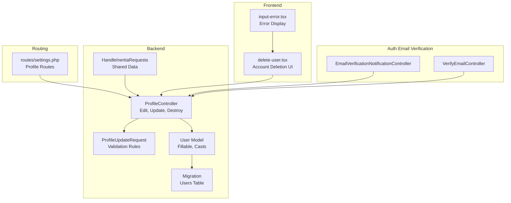
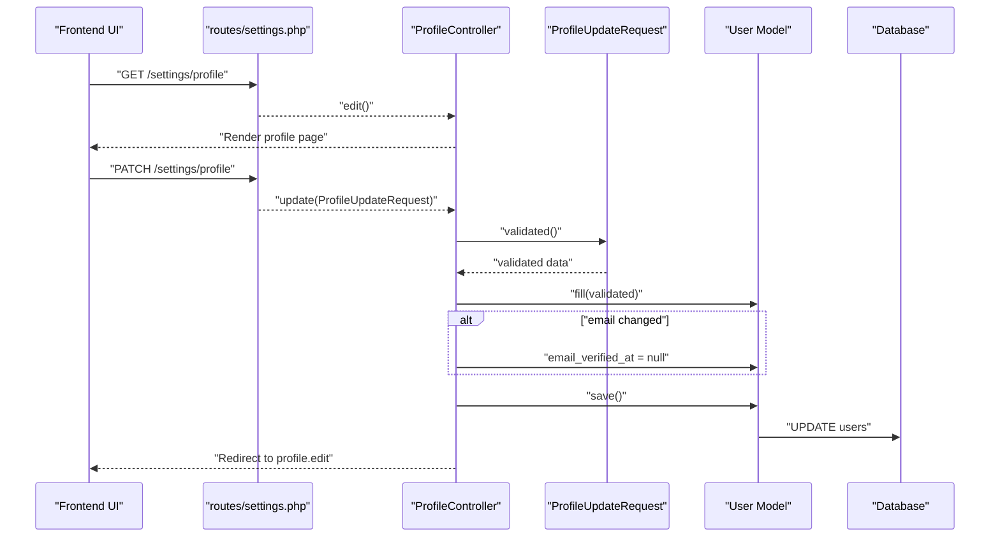
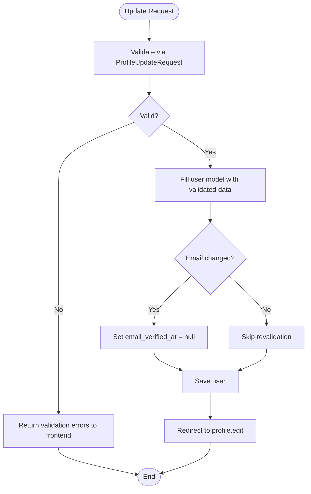
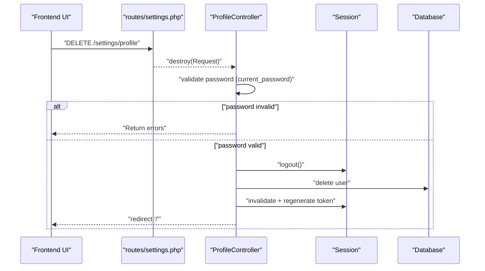
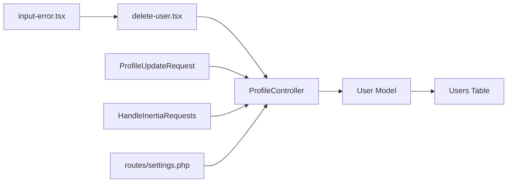

# Profile Management

<cite>
**Referenced Files in This Document**
- [ProfileController.php](file://app/Http/Controllers/Settings/ProfileController.php)
- [ProfileUpdateRequest.php](file://app/Http/Requests/Settings/ProfileUpdateRequest.php)
- [settings.php](file://routes/settings.php)
- [User.php](file://app/Models/User.php)
- [0001_01_01_000000_create_users_table.php](file://database/migrations/0001_01_01_000000_create_users_table.php)
- [HandleInertiaRequests.php](file://app/Http/Middleware/HandleInertiaRequests.php)
- [EmailVerificationNotificationController.php](file://app/Http/Controllers/Auth/EmailVerificationNotificationController.php)
- [VerifyEmailController.php](file://app/Http/Controllers/Auth/VerifyEmailController.php)
- [delete-user.tsx](file://resources/js/components/delete-user.tsx)
- [input-error.tsx](file://resources/js/components/input-error.tsx)
</cite>

## Table of Contents
1. [Introduction](#introduction)
2. [Project Structure](#project-structure)
3. [Core Components](#core-components)
4. [Architecture Overview](#architecture-overview)
5. [Detailed Component Analysis](#detailed-component-analysis)
6. [Dependency Analysis](#dependency-analysis)
7. [Performance Considerations](#performance-considerations)
8. [Security Considerations](#security-considerations)
9. [Troubleshooting Guide](#troubleshooting-guide)
10. [Conclusion](#conclusion)

## Introduction
This document provides comprehensive documentation for the user profile management functionality. It covers the profile editing interface, form validation processes, data update mechanisms, email verification status handling, and the profile deletion process. It also documents the ProfileUpdateRequest validation rules, user interface components, form handling, error validation, success feedback mechanisms, and security considerations for profile modifications and data protection.

## Project Structure
The profile management feature spans backend controllers and requests, frontend components, routing, and database schema. The key areas include:
- Backend: Settings controller for profile operations, validation request, and authentication-related email verification controllers
- Frontend: React components for profile editing and account deletion
- Routing: Named routes for profile edit, update, and destroy actions
- Persistence: Eloquent model and migration defining user attributes and verification fields

**Diagram sources**
- [ProfileController.php:14-63](file://app/Http/Controllers/Settings/ProfileController.php#L14-L63)
- [ProfileUpdateRequest.php:10-32](file://app/Http/Requests/Settings/ProfileUpdateRequest.php#L10-L32)
- [User.php:10-48](file://app/Models/User.php#L10-L48)
- [0001_01_01_000000_create_users_table.php:7-22](file://database/migrations/0001_01_01_000000_create_users_table.php#L7-L22)
- [HandleInertiaRequests.php:9-54](file://app/Http/Middleware/HandleInertiaRequests.php#L9-L54)
- [settings.php:8-21](file://routes/settings.php#L8-L21)
- [EmailVerificationNotificationController.php:9-24](file://app/Http/Controllers/Auth/EmailVerificationNotificationController.php#L9-L24)
- [VerifyEmailController.php:10-30](file://app/Http/Controllers/Auth/VerifyEmailController.php#L10-L30)
- [delete-user.tsx:14-90](file://resources/js/components/delete-user.tsx#L14-L90)
- [input-error.tsx:4-10](file://resources/js/components/input-error.tsx#L4-L10)

**Section sources**
- [settings.php:8-21](file://routes/settings.php#L8-L21)
- [ProfileController.php:14-63](file://app/Http/Controllers/Settings/ProfileController.php#L14-L63)
- [ProfileUpdateRequest.php:10-32](file://app/Http/Requests/Settings/ProfileUpdateRequest.php#L10-L32)
- [User.php:10-48](file://app/Models/User.php#L10-L48)
- [0001_01_01_000000_create_users_table.php:7-22](file://database/migrations/0001_01_01_000000_create_users_table.php#L7-L22)
- [HandleInertiaRequests.php:9-54](file://app/Http/Middleware/HandleInertiaRequests.php#L9-L54)
- [EmailVerificationNotificationController.php:9-24](file://app/Http/Controllers/Auth/EmailVerificationNotificationController.php#L9-L24)
- [VerifyEmailController.php:10-30](file://app/Http/Controllers/Auth/VerifyEmailController.php#L10-L30)
- [delete-user.tsx:14-90](file://resources/js/components/delete-user.tsx#L14-L90)
- [input-error.tsx:4-10](file://resources/js/components/input-error.tsx#L4-L10)

## Core Components
- ProfileController: Handles rendering the profile settings page, updating profile data, and deleting the user account. It integrates with Inertia for server-rendered frontend responses and manages email verification state transitions.
- ProfileUpdateRequest: Defines strict validation rules for name and email, ensuring uniqueness scoped to the current user ID and enforcing lowercase email formatting.
- User Model: Declares fillable attributes and casts for email verification timestamps and password hashing.
- Migration: Creates the users table with unique email constraint and nullable email verification timestamp.
- Frontend Components: React components for account deletion with confirmation dialogs, password prompts, and error feedback.
- Shared Data: Middleware shares authenticated user and flash messages to the frontend for consistent UX.

**Section sources**
- [ProfileController.php:19-62](file://app/Http/Controllers/Settings/ProfileController.php#L19-L62)
- [ProfileUpdateRequest.php:17-31](file://app/Http/Requests/Settings/ProfileUpdateRequest.php#L17-L31)
- [User.php:20-47](file://app/Models/User.php#L20-L47)
- [0001_01_01_000000_create_users_table.php:14-22](file://database/migrations/0001_01_01_000000_create_users_table.php#L14-L22)
- [delete-user.tsx:14-90](file://resources/js/components/delete-user.tsx#L14-L90)
- [HandleInertiaRequests.php:37-52](file://app/Http/Middleware/HandleInertiaRequests.php#L37-L52)

## Architecture Overview
The profile management flow connects frontend components to backend controllers via named routes. Validation occurs in the request object before persistence, and email changes trigger revalidation by clearing the verification timestamp. Deletion requires password confirmation and performs logout, account removal, and session cleanup.

**Diagram sources**
- [settings.php:11-13](file://routes/settings.php#L11-L13)
- [ProfileController.php:19-41](file://app/Http/Controllers/Settings/ProfileController.php#L19-L41)
- [ProfileUpdateRequest.php:17-31](file://app/Http/Requests/Settings/ProfileUpdateRequest.php#L17-L31)
- [User.php:20-24](file://app/Models/User.php#L20-L24)
- [0001_01_01_000000_create_users_table.php:14-22](file://database/migrations/0001_01_01_000000_create_users_table.php#L14-L22)

## Detailed Component Analysis

### Profile Editing Interface
- Endpoint: GET /settings/profile renders the profile settings page.
- Data exposure: The controller passes whether the user must verify their email and flash status messages to the frontend via shared data.
- Frontend integration: Uses Inertia to render the settings profile page with reactive forms and error handling.

**Section sources**
- [ProfileController.php:19-25](file://app/Http/Controllers/Settings/ProfileController.php#L19-L25)
- [HandleInertiaRequests.php:45-51](file://app/Http/Middleware/HandleInertiaRequests.php#L45-L51)

### Form Validation Processes
- Validation rules enforced by ProfileUpdateRequest:
  - Name: required, string, max length 255
  - Email: required, string, lowercase, email format, max length 255, unique across users except the current user’s ID
- Validation lifecycle: Laravel FormRequest validates incoming data before reaching the controller action.

**Section sources**
- [ProfileUpdateRequest.php:17-31](file://app/Http/Requests/Settings/ProfileUpdateRequest.php#L17-L31)

### Data Update Mechanisms
- Update endpoint: PATCH /settings/profile triggers ProfileController@update.
- Dirty tracking: If the email attribute changed, the controller clears the email verification timestamp to initiate revalidation.
- Persistence: The validated data is filled into the user model and saved to the database.

**Diagram sources**
- [ProfileUpdateRequest.php:17-31](file://app/Http/Requests/Settings/ProfileUpdateRequest.php#L17-L31)
- [ProfileController.php:30-41](file://app/Http/Controllers/Settings/ProfileController.php#L30-L41)

**Section sources**
- [ProfileController.php:30-41](file://app/Http/Controllers/Settings/ProfileController.php#L30-L41)

### Email Verification Status Handling
- Verification state: The profile page receives a flag indicating whether email verification is required.
- Automatic revalidation on change: When a user updates their email, the controller clears the email verification timestamp so the system treats the address as unverified until reconfirmation.
- Resending verification: Users can request a new verification email via the email verification notification controller.
- Manual verification: Verified emails are processed by the verify email controller.

**Section sources**
- [ProfileController.php:22-36](file://app/Http/Controllers/Settings/ProfileController.php#L22-L36)
- [EmailVerificationNotificationController.php:14-23](file://app/Http/Controllers/Auth/EmailVerificationNotificationController.php#L14-L23)
- [VerifyEmailController.php:15-29](file://app/Http/Controllers/Auth/VerifyEmailController.php#L15-L29)

### Profile Deletion Process
- Endpoint: DELETE /settings/profile triggers ProfileController@destroy.
- Password confirmation: Requires the current password via the current_password validation rule.
- Termination procedure:
  - Logs out the user
  - Deletes the user record
  - Invalidates and regenerates the session token
  - Redirects to the home page

**Diagram sources**
- [settings.php:13](file://routes/settings.php#L13)
- [ProfileController.php:46-62](file://app/Http/Controllers/Settings/ProfileController.php#L46-L62)

**Section sources**
- [ProfileController.php:46-62](file://app/Http/Controllers/Settings/ProfileController.php#L46-L62)
- [delete-user.tsx:14-90](file://resources/js/components/delete-user.tsx#L14-L90)

### User Interface Components and Feedback
- Account deletion UI:
  - Confirmation dialog with warning text
  - Password input with error display
  - Submit button disabled during processing
  - Focus management and error clearing on close
- Error feedback:
  - InputError component renders validation messages in red
- Success feedback:
  - Flash messages are shared via middleware and can be displayed after successful operations

**Section sources**
- [delete-user.tsx:14-90](file://resources/js/components/delete-user.tsx#L14-L90)
- [input-error.tsx:4-10](file://resources/js/components/input-error.tsx#L4-L10)
- [HandleInertiaRequests.php:48-51](file://app/Http/Middleware/HandleInertiaRequests.php#L48-L51)

## Dependency Analysis
- Controller-to-Request: ProfileController@update depends on ProfileUpdateRequest for validation.
- Controller-to-Model: ProfileController uses the User model for data filling and saving.
- Model-to-Database: User model persists to the users table with unique email and verification timestamp fields.
- Frontend-to-Backend: React components submit forms to named routes handled by ProfileController.
- Shared Data: HandleInertiaRequests middleware exposes auth.user and flash messages to the frontend.

**Diagram sources**
- [delete-user.tsx:14-90](file://resources/js/components/delete-user.tsx#L14-L90)
- [input-error.tsx:4-10](file://resources/js/components/input-error.tsx#L4-L10)
- [ProfileUpdateRequest.php:10-32](file://app/Http/Requests/Settings/ProfileUpdateRequest.php#L10-L32)
- [ProfileController.php:14-63](file://app/Http/Controllers/Settings/ProfileController.php#L14-L63)
- [User.php:10-48](file://app/Models/User.php#L10-L48)
- [0001_01_01_000000_create_users_table.php:14-22](file://database/migrations/0001_01_01_000000_create_users_table.php#L14-L22)
- [HandleInertiaRequests.php:37-52](file://app/Http/Middleware/HandleInertiaRequests.php#L37-L52)
- [settings.php:8-21](file://routes/settings.php#L8-L21)

**Section sources**
- [ProfileController.php:14-63](file://app/Http/Controllers/Settings/ProfileController.php#L14-L63)
- [ProfileUpdateRequest.php:10-32](file://app/Http/Requests/Settings/ProfileUpdateRequest.php#L10-L32)
- [User.php:10-48](file://app/Models/User.php#L10-L48)
- [0001_01_01_000000_create_users_table.php:14-22](file://database/migrations/0001_01_01_000000_create_users_table.php#L14-L22)
- [HandleInertiaRequests.php:37-52](file://app/Http/Middleware/HandleInertiaRequests.php#L37-L52)
- [settings.php:8-21](file://routes/settings.php#L8-L21)

## Performance Considerations
- Validation overhead: Keep validation rules minimal and targeted to avoid unnecessary database queries.
- Email revalidation: Clearing the verification timestamp avoids stale verification states but triggers subsequent verification steps; ensure this behavior aligns with UX expectations.
- Session operations: Logout, invalidate, and regenerate token operations are lightweight but should be executed atomically with account deletion to prevent session fixation risks.

## Security Considerations
- Password confirmation for deletion: Enforced via current_password rule to prevent unauthorized account termination.
- Email uniqueness: Unique rule scoped to the current user prevents conflicts while allowing email updates.
- Email verification lifecycle: Clearing email_verified_at on email change ensures secure re-verification.
- Data exposure: Hidden attributes (password, remember tokens) and casted fields protect sensitive data.
- CSRF and middleware: Routes are protected by the auth middleware; ensure frontend requests use proper CSRF tokens and route helpers.

**Section sources**
- [ProfileController.php:48-50](file://app/Http/Controllers/Settings/ProfileController.php#L48-L50)
- [ProfileUpdateRequest.php:28](file://app/Http/Requests/Settings/ProfileUpdateRequest.php#L28)
- [User.php:31-34](file://app/Models/User.php#L31-L34)
- [settings.php:8](file://routes/settings.php#L8)

## Troubleshooting Guide
- Validation errors on update:
  - Ensure name and email meet the specified constraints (required, string, max length, unique).
  - Check that the email is lowercase and properly formatted.
- Email not reverified after change:
  - Confirm that the controller clears the email verification timestamp when the email attribute changes.
  - Verify that the frontend displays the mustVerifyEmail flag and allows resending verification notifications.
- Account deletion fails:
  - Confirm that the password matches the current password.
  - Ensure the frontend focuses the password input on validation errors and clears them on close.
- Flash messages not visible:
  - Confirm that shared flash messages are accessed via the shared data middleware and rendered appropriately in the UI.

**Section sources**
- [ProfileUpdateRequest.php:19-30](file://app/Http/Requests/Settings/ProfileUpdateRequest.php#L19-L30)
- [ProfileController.php:34-36](file://app/Http/Controllers/Settings/ProfileController.php#L34-L36)
- [delete-user.tsx:18-27](file://resources/js/components/delete-user.tsx#L18-L27)
- [HandleInertiaRequests.php:48-51](file://app/Http/Middleware/HandleInertiaRequests.php#L48-L51)

## Conclusion
The profile management feature provides a secure, validated, and user-friendly mechanism for editing personal information, handling email verification lifecycle, and deleting accounts. The backend enforces strict validation rules, the frontend delivers responsive feedback, and the middleware ensures consistent shared data. Adhering to the outlined security and troubleshooting practices will maintain data integrity and a robust user experience.