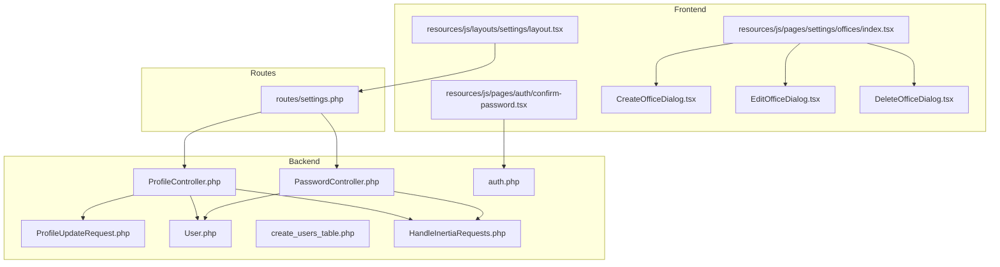
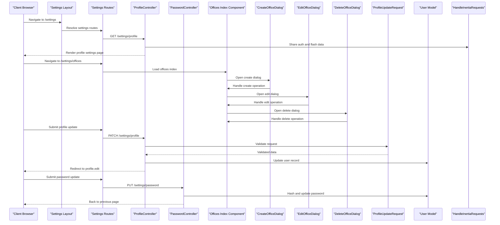
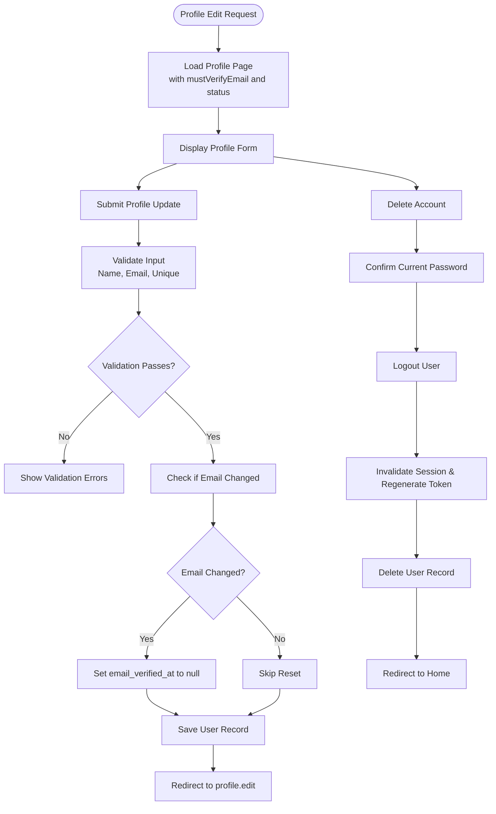
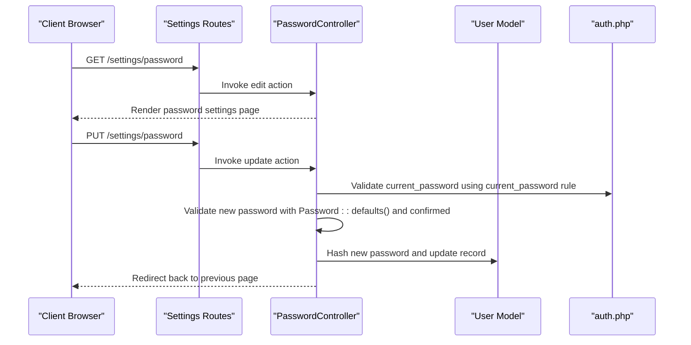
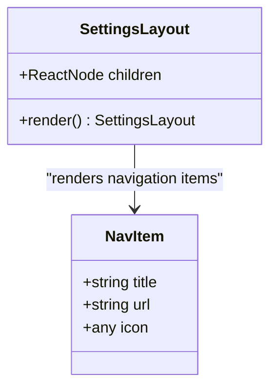
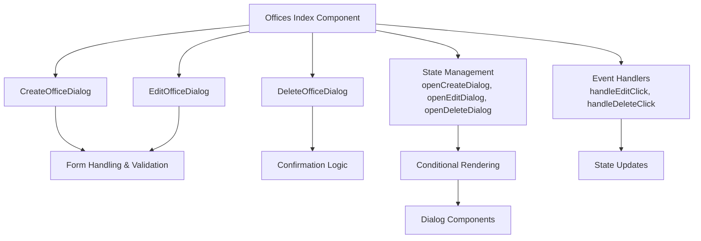
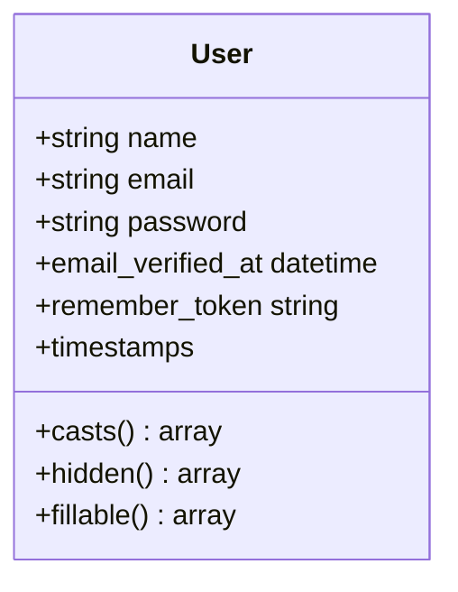
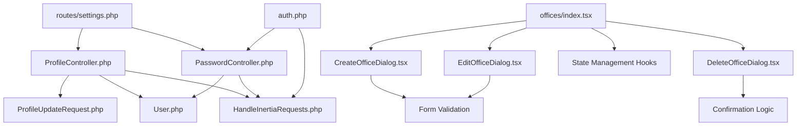

# Settings Management

<cite>
**Referenced Files in This Document**
- [ProfileController.php](file://app/Http/Controllers/Settings/ProfileController.php)
- [PasswordController.php](file://app/Http/Controllers/Settings/PasswordController.php)
- [ProfileUpdateRequest.php](file://app/Http/Requests/Settings/ProfileUpdateRequest.php)
- [settings.php](file://routes/settings.php)
- [layout.tsx](file://resources/js/layouts/settings/layout.tsx)
- [User.php](file://app/Models/User.php)
- [auth.php](file://config/auth.php)
- [HandleInertiaRequests.php](file://app/Http/Middleware/HandleInertiaRequests.php)
- [create_users_table.php](file://database/migrations/0001_01_01_000000_create_users_table.php)
- [confirm-password.tsx](file://resources/js/pages/auth/confirm-password.tsx)
- [offices/index.tsx](file://resources/js/pages/settings/offices/index.tsx)
</cite>

## Update Summary
**Changes Made**
- Added new section documenting the office management interface refactoring
- Updated architecture overview to include reusable dialog components
- Enhanced component analysis with dialog-based office management
- Added new diagrams showing the refactored dialog component structure

## Table of Contents
1. [Introduction](#introduction)
2. [Project Structure](#project-structure)
3. [Core Components](#core-components)
4. [Architecture Overview](#architecture-overview)
5. [Detailed Component Analysis](#detailed-component-analysis)
6. [Dependency Analysis](#dependency-analysis)
7. [Performance Considerations](#performance-considerations)
8. [Troubleshooting Guide](#troubleshooting-guide)
9. [Conclusion](#conclusion)

## Introduction
This document provides comprehensive settings management documentation for user profile management, password updates, and account preferences. It covers profile editing processes, validation rules, security measures, password change procedures, confirmation requirements, and security policies. It also details the settings interface, form handling, data persistence, user preference management, notification settings, and account security controls. Additionally, it addresses settings validation, error handling, user feedback mechanisms, administrative settings interface capabilities, and the newly refactored office management interface with reusable dialog components.

## Project Structure
The settings management system is organized around dedicated controllers for profile and password operations, route definitions, validation requests, and frontend layouts. The backend uses Laravel controllers and middleware, while the frontend leverages Inertia.js for a seamless single-page application experience. The system now includes a refactored office management interface with reusable dialog components for improved code organization and maintainability.

**Diagram sources**
- [ProfileController.php:1-64](file://app/Http/Controllers/Settings/ProfileController.php#L1-L64)
- [PasswordController.php:1-44](file://app/Http/Controllers/Settings/PasswordController.php#L1-L44)
- [ProfileUpdateRequest.php:1-33](file://app/Http/Requests/Settings/ProfileUpdateRequest.php#L1-L33)
- [settings.php:1-22](file://routes/settings.php#L1-L22)
- [User.php:1-49](file://app/Models/User.php#L1-L49)
- [auth.php:1-116](file://config/auth.php#L1-L116)
- [HandleInertiaRequests.php:1-55](file://app/Http/Middleware/HandleInertiaRequests.php#L1-L55)
- [layout.tsx:1-63](file://resources/js/layouts/settings/layout.tsx#L1-L63)
- [confirm-password.tsx:1-60](file://resources/js/pages/auth/confirm-password.tsx#L1-L60)
- [create_users_table.php:1-50](file://database/migrations/0001_01_01_000000_create_users_table.php#L1-L50)
- [offices/index.tsx:1-145](file://resources/js/pages/settings/offices/index.tsx#L1-L145)

**Section sources**
- [settings.php:1-22](file://routes/settings.php#L1-L22)
- [ProfileController.php:1-64](file://app/Http/Controllers/Settings/ProfileController.php#L1-L64)
- [PasswordController.php:1-44](file://app/Http/Controllers/Settings/PasswordController.php#L1-L44)
- [ProfileUpdateRequest.php:1-33](file://app/Http/Requests/Settings/ProfileUpdateRequest.php#L1-L33)
- [User.php:1-49](file://app/Models/User.php#L1-L49)
- [HandleInertiaRequests.php:1-55](file://app/Http/Middleware/HandleInertiaRequests.php#L1-L55)
- [layout.tsx:1-63](file://resources/js/layouts/settings/layout.tsx#L1-L63)
- [auth.php:1-116](file://config/auth.php#L1-L116)
- [create_users_table.php:1-50](file://database/migrations/0001_01_01_000000_create_users_table.php#L1-L50)
- [offices/index.tsx:1-145](file://resources/js/pages/settings/offices/index.tsx#L1-L145)

## Core Components
- ProfileController: Handles profile viewing, updating, and account deletion with email verification logic and session management.
- PasswordController: Manages password viewing and updating with current password confirmation and hashing.
- ProfileUpdateRequest: Defines validation rules for profile updates including unique email constraints and formatting.
- Settings Routes: Defines authenticated routes for profile, password, and appearance settings.
- Settings Layout: Provides a navigation layout for settings pages.
- User Model: Defines fillable attributes, hidden fields, and attribute casting for secure data handling.
- Authentication Configuration: Configures guards, providers, password reset behavior, and password confirmation timeouts.
- Middleware: Shares authentication and flash data across Inertia.js requests.
- Database Migration: Creates the users table with unique email constraints and timestamps.
- Office Management Interface: **Updated** Now features refactored dialog components for create, edit, and delete operations with improved code organization.

**Section sources**
- [ProfileController.php:1-64](file://app/Http/Controllers/Settings/ProfileController.php#L1-L64)
- [PasswordController.php:1-44](file://app/Http/Controllers/Settings/PasswordController.php#L1-L44)
- [ProfileUpdateRequest.php:1-33](file://app/Http/Requests/Settings/ProfileUpdateRequest.php#L1-L33)
- [settings.php:1-22](file://routes/settings.php#L1-L22)
- [layout.tsx:1-63](file://resources/js/layouts/settings/layout.tsx#L1-L63)
- [User.php:1-49](file://app/Models/User.php#L1-L49)
- [auth.php:1-116](file://config/auth.php#L1-L116)
- [HandleInertiaRequests.php:1-55](file://app/Http/Middleware/HandleInertiaRequests.php#L1-L55)
- [create_users_table.php:1-50](file://database/migrations/0001_01_01_000000_create_users_table.php#L1-L50)
- [offices/index.tsx:1-145](file://resources/js/pages/settings/offices/index.tsx#L1-L145)

## Architecture Overview
The settings architecture follows a layered approach with enhanced modularity for office management operations:
- Frontend: Inertia.js renders settings pages with a shared layout and navigation.
- Backend: Controllers handle requests, enforce validation, and manage persistence.
- Data Layer: Eloquent model and database migration define user data structure and constraints.
- Security: Authentication configuration and middleware ensure secure access and data sharing.
- **Updated** Dialog Components: Office management now uses reusable dialog components for create, edit, and delete operations, improving code organization and maintainability.

**Diagram sources**
- [layout.tsx:1-63](file://resources/js/layouts/settings/layout.tsx#L1-L63)
- [settings.php:1-22](file://routes/settings.php#L1-L22)
- [ProfileController.php:1-64](file://app/Http/Controllers/Settings/ProfileController.php#L1-L64)
- [PasswordController.php:1-44](file://app/Http/Controllers/Settings/PasswordController.php#L1-L44)
- [ProfileUpdateRequest.php:1-33](file://app/Http/Requests/Settings/ProfileUpdateRequest.php#L1-L33)
- [User.php:1-49](file://app/Models/User.php#L1-L49)
- [HandleInertiaRequests.php:1-55](file://app/Http/Middleware/HandleInertiaRequests.php#L1-L55)
- [offices/index.tsx:1-145](file://resources/js/pages/settings/offices/index.tsx#L1-L145)

## Detailed Component Analysis

### Profile Management
Profile management encompasses viewing, updating, and deleting user accounts. The process ensures email uniqueness, handles email verification resets, and manages session lifecycle during account deletion.

**Diagram sources**
- [ProfileController.php:1-64](file://app/Http/Controllers/Settings/ProfileController.php#L1-L64)
- [ProfileUpdateRequest.php:1-33](file://app/Http/Requests/Settings/ProfileUpdateRequest.php#L1-L33)

Key behaviors:
- Email uniqueness validation prevents duplicate registrations.
- Changing the email triggers a verification reset to maintain security.
- Account deletion requires current password confirmation and performs logout and session invalidation.

Security measures:
- Current password confirmation for destructive actions.
- Session invalidation after logout to prevent session fixation.
- Hidden sensitive fields in the User model.

**Section sources**
- [ProfileController.php:1-64](file://app/Http/Controllers/Settings/ProfileController.php#L1-L64)
- [ProfileUpdateRequest.php:1-33](file://app/Http/Requests/Settings/ProfileUpdateRequest.php#L1-L33)
- [User.php:1-49](file://app/Models/User.php#L1-L49)

### Password Management
Password management enforces strong password policies, requires current password confirmation, and securely hashes new passwords.

**Diagram sources**
- [PasswordController.php:1-44](file://app/Http/Controllers/Settings/PasswordController.php#L1-L44)
- [auth.php:1-116](file://config/auth.php#L1-L116)

Validation rules:
- Current password must match the stored hash.
- New password must meet Laravel's default password requirements and be confirmed.

Security policies:
- Password hashing via Hash facade.
- Password confirmation timeout configured in authentication settings.

**Section sources**
- [PasswordController.php:1-44](file://app/Http/Controllers/Settings/PasswordController.php#L1-L44)
- [auth.php:1-116](file://config/auth.php#L1-L116)

### Settings Interface and Navigation
The settings interface provides a structured layout with navigation items for profile, password, and appearance settings. The layout dynamically highlights the active navigation item based on the current path.

**Diagram sources**
- [layout.tsx:1-63](file://resources/js/layouts/settings/layout.tsx#L1-L63)

Navigation items:
- Profile: Links to the profile settings page.
- Password: Links to the password settings page.
- Appearance: Links to the appearance settings page.

**Section sources**
- [layout.tsx:1-63](file://resources/js/layouts/settings/layout.tsx#L1-L63)

### Office Management Interface
**Updated** The office management interface has been refactored to use reusable dialog components for improved code organization and maintainability. The main index component now delegates create, edit, and delete operations to separate dialog components.

**Diagram sources**
- [offices/index.tsx:1-145](file://resources/js/pages/settings/offices/index.tsx#L1-L145)

Key features of the refactored interface:
- **Reusable Dialog Components**: Separate components for create, edit, and delete operations
- **State Management**: Centralized state management for dialog visibility and selected office data
- **Event Handling**: Clean event handlers for opening dialogs with proper office context
- **Conditional Rendering**: Efficient rendering of dialog components only when needed
- **Improved Maintainability**: Better separation of concerns and easier testing of individual dialog components

Component responsibilities:
- **CreateOfficeDialog**: Handles new office creation with form validation and submission
- **EditOfficeDialog**: Manages office modification with pre-filled data and update operations
- **DeleteOfficeDialog**: Implements safe deletion with confirmation and error handling

**Section sources**
- [offices/index.tsx:1-145](file://resources/js/pages/settings/offices/index.tsx#L1-L145)

### Data Persistence and Model Behavior
The User model defines fillable attributes, hidden fields, and attribute casting to ensure secure data handling and serialization.

**Diagram sources**
- [User.php:1-49](file://app/Models/User.php#L1-L49)
- [create_users_table.php:1-50](file://database/migrations/0001_01_01_000000_create_users_table.php#L1-L50)

Data structure:
- Fillable attributes include name, email, and password.
- Hidden attributes include password and remember token.
- Attribute casting ensures email_verified_at and password are properly typed.

**Section sources**
- [User.php:1-49](file://app/Models/User.php#L1-L49)
- [create_users_table.php:1-50](file://database/migrations/0001_01_01_000000_create_users_table.php#L1-L50)

### Administrative Settings Interface
Administrative capabilities are primarily handled through dedicated controllers and routes for user management tasks such as creating, editing, and managing employees. While the core settings focus on user self-service, administrative features extend to broader user management operations.

Note: Administrative settings for user management are implemented in separate controllers and routes outside the core settings namespace. The scope of this document focuses on user self-service settings.

**Section sources**
- [settings.php:1-22](file://routes/settings.php#L1-L22)

## Dependency Analysis
The settings system exhibits clear separation of concerns with minimal coupling between components. Controllers depend on validation requests and the User model, while routes connect to controllers. The middleware ensures consistent data sharing across Inertia.js requests. **Updated** The office management interface now depends on reusable dialog components for enhanced modularity.

**Diagram sources**
- [settings.php:1-22](file://routes/settings.php#L1-L22)
- [ProfileController.php:1-64](file://app/Http/Controllers/Settings/ProfileController.php#L1-L64)
- [PasswordController.php:1-44](file://app/Http/Controllers/Settings/PasswordController.php#L1-L44)
- [ProfileUpdateRequest.php:1-33](file://app/Http/Requests/Settings/ProfileUpdateRequest.php#L1-L33)
- [User.php:1-49](file://app/Models/User.php#L1-L49)
- [HandleInertiaRequests.php:1-55](file://app/Http/Middleware/HandleInertiaRequests.php#L1-L55)
- [auth.php:1-116](file://config/auth.php#L1-L116)
- [offices/index.tsx:1-145](file://resources/js/pages/settings/offices/index.tsx#L1-L145)

**Section sources**
- [settings.php:1-22](file://routes/settings.php#L1-L22)
- [ProfileController.php:1-64](file://app/Http/Controllers/Settings/ProfileController.php#L1-L64)
- [PasswordController.php:1-44](file://app/Http/Controllers/Settings/PasswordController.php#L1-L44)
- [ProfileUpdateRequest.php:1-33](file://app/Http/Requests/Settings/ProfileUpdateRequest.php#L1-L33)
- [User.php:1-49](file://app/Models/User.php#L1-L49)
- [HandleInertiaRequests.php:1-55](file://app/Http/Middleware/HandleInertiaRequests.php#L1-L55)
- [auth.php:1-116](file://config/auth.php#L1-L116)
- [offices/index.tsx:1-145](file://resources/js/pages/settings/offices/index.tsx#L1-L145)

## Performance Considerations
- Validation occurs server-side using FormRequest classes, ensuring efficient and consistent validation logic.
- Password hashing is performed server-side, leveraging Laravel's built-in hashing mechanisms.
- Inertia.js provides client-side navigation without full page reloads, improving perceived performance.
- Middleware shares authentication and flash data efficiently across requests.
- **Updated** Dialog components improve performance by lazy-loading only when needed, reducing initial bundle size and improving render performance.

## Troubleshooting Guide
Common issues and resolutions:
- Validation failures: Ensure input matches validation rules defined in ProfileUpdateRequest. Check for unique email violations and required fields.
- Password confirmation errors: Verify that the current password matches the stored hash before attempting password changes.
- Session-related issues: After account deletion, ensure logout and session invalidation occur to prevent session fixation.
- Authentication timeouts: Adjust password confirmation timeout in authentication configuration if users frequently encounter timeouts.
- **Updated** Dialog component issues: Ensure proper state management for dialog visibility and selected office data. Check that dialog components receive required props and handle loading states appropriately.

**Section sources**
- [ProfileUpdateRequest.php:1-33](file://app/Http/Requests/Settings/ProfileUpdateRequest.php#L1-L33)
- [PasswordController.php:1-44](file://app/Http/Controllers/Settings/PasswordController.php#L1-L44)
- [ProfileController.php:1-64](file://app/Http/Controllers/Settings/ProfileController.php#L1-L64)
- [auth.php:1-116](file://config/auth.php#L1-L116)
- [offices/index.tsx:1-145](file://resources/js/pages/settings/offices/index.tsx#L1-L145)

## Conclusion
The settings management system provides a secure, user-friendly interface for managing profiles, passwords, and preferences. It enforces robust validation, maintains strict security policies, and integrates seamlessly with the application's authentication and middleware layers. The modular design allows for easy extension and maintenance while preserving a consistent user experience. **Updated** The recent refactoring of the office management interface with reusable dialog components significantly improves code organization, maintainability, and user experience, setting a foundation for further enhancements to the settings management system.