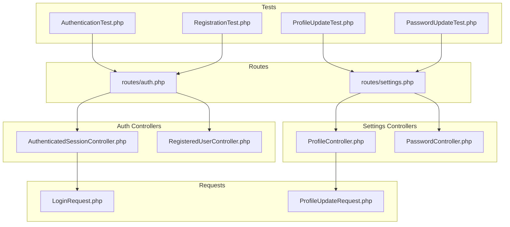
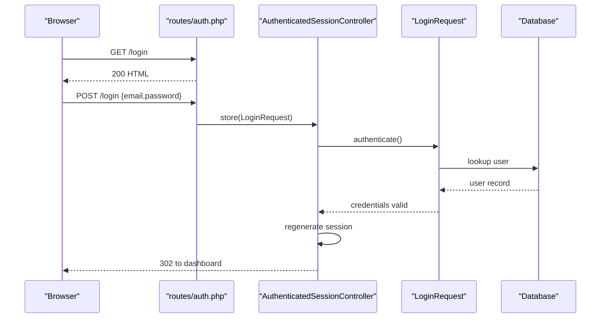
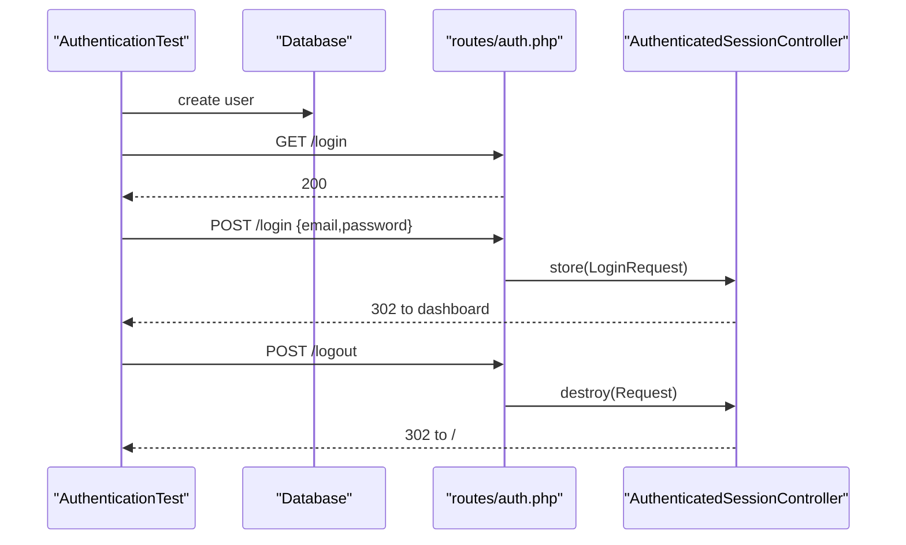
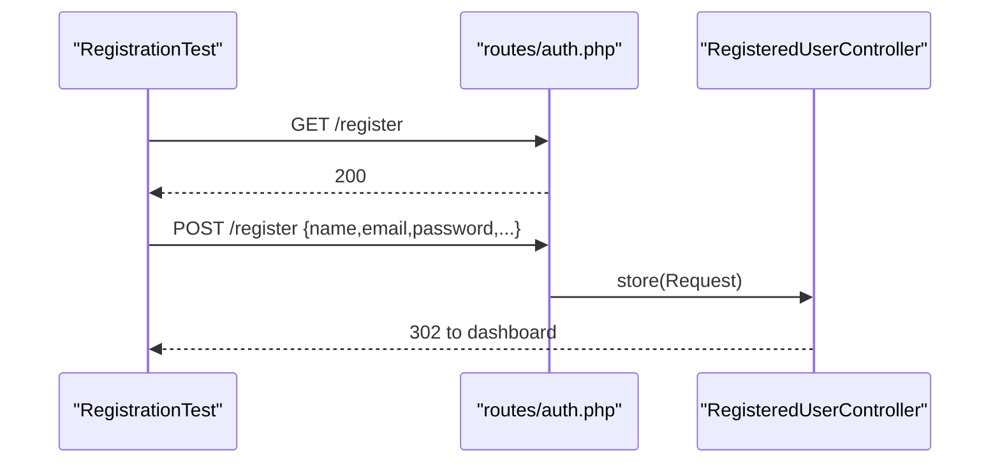
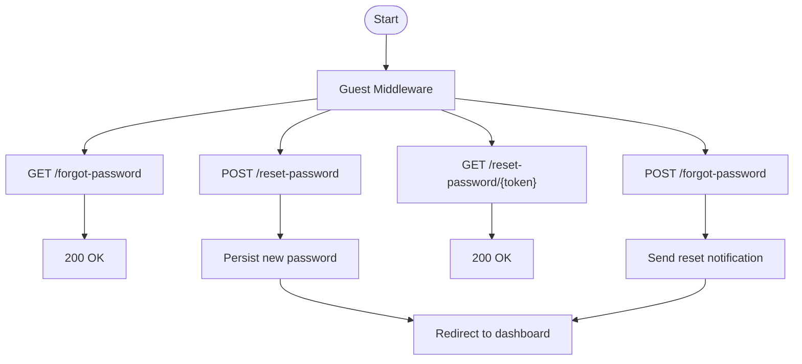
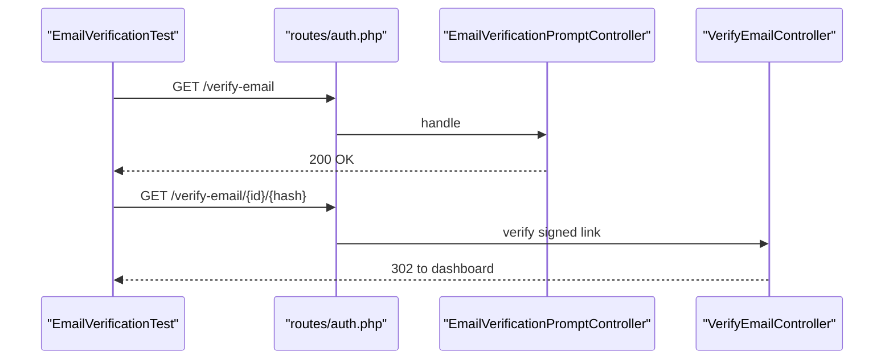
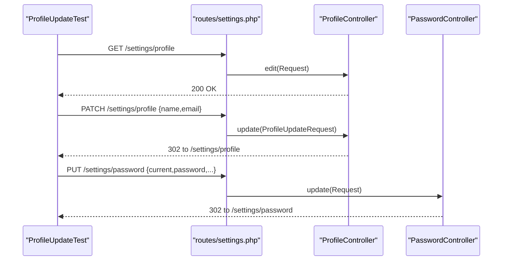
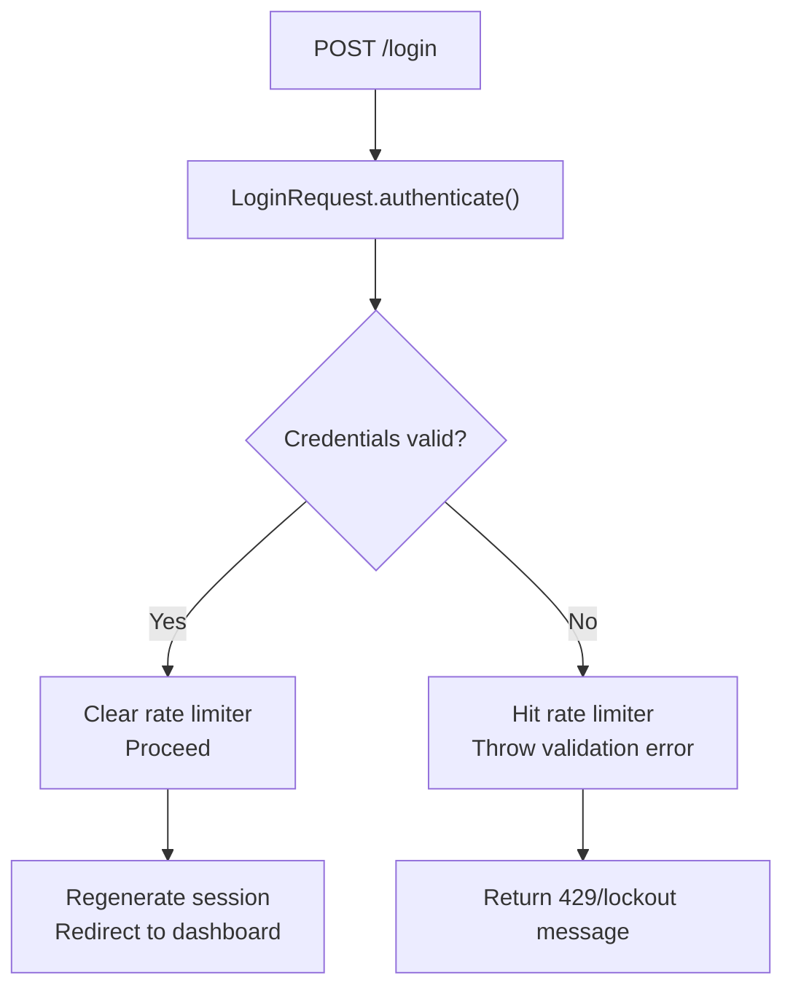
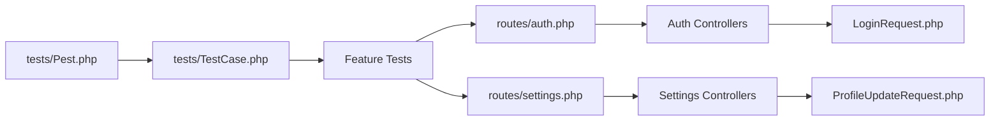

# Feature Tests

<cite>
**Referenced Files in This Document**
- [routes/auth.php](file://routes/auth.php)
- [routes/settings.php](file://routes/settings.php)
- [app/Http/Controllers/Auth/AuthenticatedSessionController.php](file://app/Http/Controllers/Auth/AuthenticatedSessionController.php)
- [app/Http/Controllers/Auth/RegisteredUserController.php](file://app/Http/Controllers/Auth/RegisteredUserController.php)
- [app/Http/Controllers/Settings/ProfileController.php](file://app/Http/Controllers/Settings/ProfileController.php)
- [app/Http/Controllers/Settings/PasswordController.php](file://app/Http/Controllers/Settings/PasswordController.php)
- [app/Http/Requests/Auth/LoginRequest.php](file://app/Http/Requests/Auth/LoginRequest.php)
- [app/Http/Requests/Settings/ProfileUpdateRequest.php](file://app/Http/Requests/Settings/ProfileUpdateRequest.php)
- [tests/Feature/Auth/AuthenticationTest.php](file://tests/Feature/Auth/AuthenticationTest.php)
- [tests/Feature/Auth/RegistrationTest.php](file://tests/Feature/Auth/RegistrationTest.php)
- [tests/Feature/Settings/ProfileUpdateTest.php](file://tests/Feature/Settings/ProfileUpdateTest.php)
- [tests/Feature/Settings/PasswordUpdateTest.php](file://tests/Feature/Settings/PasswordUpdateTest.php)
- [tests/Pest.php](file://tests/Pest.php)
- [tests/TestCase.php](file://tests/TestCase.php)
- [database/factories/UserFactory.php](file://database/factories/UserFactory.php)
- [config/auth.php](file://config/auth.php)
- [config/session.php](file://config/session.php)
</cite>

## Table of Contents
1. [Introduction](#introduction)
2. [Project Structure](#project-structure)
3. [Core Components](#core-components)
4. [Architecture Overview](#architecture-overview)
5. [Detailed Component Analysis](#detailed-component-analysis)
6. [Dependency Analysis](#dependency-analysis)
7. [Performance Considerations](#performance-considerations)
8. [Troubleshooting Guide](#troubleshooting-guide)
9. [Conclusion](#conclusion)
10. [Appendices](#appendices)

## Introduction
This document provides comprehensive feature testing documentation for end-to-end application functionality. It focuses on authentication flows (login, registration, password reset, email verification), settings management (profile updates, password changes, account deletion), and validation of API endpoints and UI interactions. It also covers test data management, user roles, permission validation, and integration point checks using the existing Laravel test suite.

## Project Structure
The application follows a layered architecture with routes delegating to controllers, which validate input via FormRequests and persist changes to the database. Feature tests target HTTP endpoints and validate redirects, session state, and model changes.

**Diagram sources**
- [routes/auth.php:1-57](file://routes/auth.php#L1-L57)
- [routes/settings.php:1-22](file://routes/settings.php#L1-L22)
- [app/Http/Controllers/Auth/AuthenticatedSessionController.php:14-51](file://app/Http/Controllers/Auth/AuthenticatedSessionController.php#L14-L51)
- [app/Http/Controllers/Auth/RegisteredUserController.php:16-51](file://app/Http/Controllers/Auth/RegisteredUserController.php#L16-L51)
- [app/Http/Controllers/Settings/ProfileController.php:14-63](file://app/Http/Controllers/Settings/ProfileController.php#L14-L63)
- [app/Http/Controllers/Settings/PasswordController.php:14-43](file://app/Http/Controllers/Settings/PasswordController.php#L14-L43)
- [app/Http/Requests/Auth/LoginRequest.php:12-85](file://app/Http/Requests/Auth/LoginRequest.php#L12-L85)
- [app/Http/Requests/Settings/ProfileUpdateRequest.php:10-32](file://app/Http/Requests/Settings/ProfileUpdateRequest.php#L10-L32)
- [tests/Feature/Auth/AuthenticationTest.php:9-54](file://tests/Feature/Auth/AuthenticationTest.php#L9-L54)
- [tests/Feature/Auth/RegistrationTest.php:8-31](file://tests/Feature/Auth/RegistrationTest.php#L8-L31)
- [tests/Feature/Settings/ProfileUpdateTest.php:9-99](file://tests/Feature/Settings/ProfileUpdateTest.php#L9-L99)
- [tests/Feature/Settings/PasswordUpdateTest.php:10-51](file://tests/Feature/Settings/PasswordUpdateTest.php#L10-L51)

**Section sources**
- [routes/auth.php:1-57](file://routes/auth.php#L1-L57)
- [routes/settings.php:1-22](file://routes/settings.php#L1-L22)
- [tests/Pest.php:14-16](file://tests/Pest.php#L14-L16)
- [tests/TestCase.php:7-10](file://tests/TestCase.php#L7-L10)

## Core Components
- Authentication routes and controllers handle guest-only actions (register, login, forgot/reset password) and authenticated actions (logout, resend verification, confirm password).
- Settings routes and controllers manage profile editing, password updates, and account deletion.
- FormRequests encapsulate validation logic for robust input sanitization and error messaging.
- Feature tests leverage Laravel’s database refresh trait to isolate tests and use actingAs for authenticated scenarios.

Key responsibilities:
- Routes define middleware groups for guest/auth contexts and named endpoints.
- Controllers coordinate request validation, session regeneration, and redirection.
- Tests assert HTTP status codes, redirects, session state, and model changes.

**Section sources**
- [routes/auth.php:13-56](file://routes/auth.php#L13-L56)
- [routes/settings.php:8-21](file://routes/settings.php#L8-L21)
- [app/Http/Controllers/Auth/AuthenticatedSessionController.php:19-50](file://app/Http/Controllers/Auth/AuthenticatedSessionController.php#L19-L50)
- [app/Http/Controllers/Auth/RegisteredUserController.php:21-49](file://app/Http/Controllers/Auth/RegisteredUserController.php#L21-L49)
- [app/Http/Controllers/Settings/ProfileController.php:19-62](file://app/Http/Controllers/Settings/ProfileController.php#L19-L62)
- [app/Http/Controllers/Settings/PasswordController.php:19-42](file://app/Http/Controllers/Settings/PasswordController.php#L19-L42)
- [app/Http/Requests/Auth/LoginRequest.php:27-53](file://app/Http/Requests/Auth/LoginRequest.php#L27-L53)
- [app/Http/Requests/Settings/ProfileUpdateRequest.php:17-31](file://app/Http/Requests/Settings/ProfileUpdateRequest.php#L17-L31)

## Architecture Overview
The authentication and settings subsystems are organized around route-driven controllers and request validation. Feature tests exercise these endpoints to validate end-to-end behavior.

**Diagram sources**
- [routes/auth.php:19-22](file://routes/auth.php#L19-L22)
- [app/Http/Controllers/Auth/AuthenticatedSessionController.php:30-36](file://app/Http/Controllers/Auth/AuthenticatedSessionController.php#L30-L36)
- [app/Http/Requests/Auth/LoginRequest.php:40-53](file://app/Http/Requests/Auth/LoginRequest.php#L40-L53)

## Detailed Component Analysis

### Authentication Feature Testing
Focus areas:
- Login screen rendering and successful authentication with intended redirect.
- Invalid credential handling and guest assertion.
- Logout behavior and redirect to home.

Validation checklist:
- GET /login returns 200.
- POST /login authenticates and redirects to dashboard.
- POST /login with wrong password keeps guest.
- POST /logout invalidates session and redirects to home.

**Diagram sources**
- [tests/Feature/Auth/AuthenticationTest.php:13-53](file://tests/Feature/Auth/AuthenticationTest.php#L13-L53)
- [routes/auth.php:19-22](file://routes/auth.php#L19-L22)
- [app/Http/Controllers/Auth/AuthenticatedSessionController.php:30-49](file://app/Http/Controllers/Auth/AuthenticatedSessionController.php#L30-L49)

**Section sources**
- [tests/Feature/Auth/AuthenticationTest.php:13-53](file://tests/Feature/Auth/AuthenticationTest.php#L13-L53)
- [routes/auth.php:13-35](file://routes/auth.php#L13-L35)
- [app/Http/Controllers/Auth/AuthenticatedSessionController.php:19-50](file://app/Http/Controllers/Auth/AuthenticatedSessionController.php#L19-L50)

### Registration Feature Testing
Focus areas:
- Registration screen rendering.
- Successful registration followed by automatic login and dashboard redirect.

Validation checklist:
- GET /register returns 200.
- POST /register creates a user, authenticates, and redirects to dashboard.

**Diagram sources**
- [tests/Feature/Auth/RegistrationTest.php:12-30](file://tests/Feature/Auth/RegistrationTest.php#L12-L30)
- [routes/auth.php:14-17](file://routes/auth.php#L14-L17)
- [app/Http/Controllers/Auth/RegisteredUserController.php:31-49](file://app/Http/Controllers/Auth/RegisteredUserController.php#L31-L49)

**Section sources**
- [tests/Feature/Auth/RegistrationTest.php:12-30](file://tests/Feature/Auth/RegistrationTest.php#L12-L30)
- [routes/auth.php:13-17](file://routes/auth.php#L13-L17)
- [app/Http/Controllers/Auth/RegisteredUserController.php:21-49](file://app/Http/Controllers/Auth/RegisteredUserController.php#L21-L49)

### Password Reset Feature Testing
Focus areas:
- Forgot password link rendering and submission.
- Reset password form rendering and submission with token.
- Throttling and signed link middleware for verification.

Validation checklist:
- GET /forgot-password returns 200.
- POST /forgot-password triggers notification.
- GET /reset-password/{token} renders reset form.
- POST /reset-password stores new password.

**Diagram sources**
- [routes/auth.php:24-34](file://routes/auth.php#L24-L34)

**Section sources**
- [routes/auth.php:24-34](file://routes/auth.php#L24-L34)

### Email Verification Feature Testing
Focus areas:
- Verification prompt rendering for authenticated users.
- Signed verification link with throttling.
- Resending verification notifications.

Validation checklist:
- GET /verify-email renders prompt for authenticated users.
- GET /verify-email/{id}/{hash} validates signed link and marks email verified.
- POST /email/verification-notification resends notification with rate limit.

**Diagram sources**
- [routes/auth.php:38-47](file://routes/auth.php#L38-L47)

**Section sources**
- [routes/auth.php:37-47](file://routes/auth.php#L37-L47)

### Settings Management Feature Testing
Focus areas:
- Profile editing and updates, including email uniqueness and verification status changes.
- Password updates requiring current password confirmation.
- Account deletion with current password validation.

Validation checklist:
- GET /settings/profile returns 200.
- PATCH /settings/profile updates name/email and clears email_verified_at when email changes.
- PUT /settings/password updates password and verifies hash.
- DELETE /settings/profile deletes user and logs out.

**Diagram sources**
- [tests/Feature/Settings/ProfileUpdateTest.php:13-44](file://tests/Feature/Settings/ProfileUpdateTest.php#L13-L44)
- [tests/Feature/Settings/PasswordUpdateTest.php:14-32](file://tests/Feature/Settings/PasswordUpdateTest.php#L14-L32)
- [routes/settings.php:11-16](file://routes/settings.php#L11-L16)
- [app/Http/Controllers/Settings/ProfileController.php:30-41](file://app/Http/Controllers/Settings/ProfileController.php#L30-L41)
- [app/Http/Controllers/Settings/PasswordController.php:30-42](file://app/Http/Controllers/Settings/PasswordController.php#L30-L42)

**Section sources**
- [tests/Feature/Settings/ProfileUpdateTest.php:13-98](file://tests/Feature/Settings/ProfileUpdateTest.php#L13-L98)
- [tests/Feature/Settings/PasswordUpdateTest.php:14-50](file://tests/Feature/Settings/PasswordUpdateTest.php#L14-L50)
- [routes/settings.php:8-21](file://routes/settings.php#L8-L21)
- [app/Http/Controllers/Settings/ProfileController.php:19-62](file://app/Http/Controllers/Settings/ProfileController.php#L19-L62)
- [app/Http/Controllers/Settings/PasswordController.php:19-42](file://app/Http/Controllers/Settings/PasswordController.php#L19-L42)

### Request Validation and Error Handling
- LoginRequest enforces rate limiting and throws validation errors for failed attempts.
- ProfileUpdateRequest ensures unique email per user and applies length/email rules.
- Tests assert session errors for invalid inputs and redirects to the originating page.

Validation checklist:
- LoginRequest.authenticate() authenticates or throws with throttled messages.
- ProfileUpdateRequest.unique() respects current user ID.
- Tests assert sessionHasErrors and redirects for invalid inputs.

**Diagram sources**
- [app/Http/Requests/Auth/LoginRequest.php:40-76](file://app/Http/Requests/Auth/LoginRequest.php#L40-L76)

**Section sources**
- [app/Http/Requests/Auth/LoginRequest.php:27-85](file://app/Http/Requests/Auth/LoginRequest.php#L27-L85)
- [app/Http/Requests/Settings/ProfileUpdateRequest.php:17-31](file://app/Http/Requests/Settings/ProfileUpdateRequest.php#L17-L31)
- [tests/Feature/Auth/AuthenticationTest.php:33-43](file://tests/Feature/Auth/AuthenticationTest.php#L33-L43)
- [tests/Feature/Settings/ProfileUpdateTest.php:82-98](file://tests/Feature/Settings/ProfileUpdateTest.php#L82-L98)
- [tests/Feature/Settings/PasswordUpdateTest.php:34-50](file://tests/Feature/Settings/PasswordUpdateTest.php#L34-L50)

## Dependency Analysis
- Routes depend on controllers for action resolution.
- Controllers depend on FormRequests for validation and on the Auth facade/session for state management.
- Tests depend on the database refresh trait and actingAs for authenticated scenarios.
- Pest configuration binds base test case and enables RefreshDatabase for Feature tests.

**Diagram sources**
- [tests/Pest.php:14-16](file://tests/Pest.php#L14-L16)
- [tests/TestCase.php:7-10](file://tests/TestCase.php#L7-L10)
- [routes/auth.php:1-57](file://routes/auth.php#L1-L57)
- [routes/settings.php:1-22](file://routes/settings.php#L1-L22)
- [app/Http/Requests/Auth/LoginRequest.php:12-85](file://app/Http/Requests/Auth/LoginRequest.php#L12-L85)
- [app/Http/Requests/Settings/ProfileUpdateRequest.php:10-32](file://app/Http/Requests/Settings/ProfileUpdateRequest.php#L10-L32)

**Section sources**
- [tests/Pest.php:14-16](file://tests/Pest.php#L14-L16)
- [tests/TestCase.php:7-10](file://tests/TestCase.php#L7-L10)

## Performance Considerations
- Use database refresh per test to avoid cross-test contamination and keep tests fast.
- Prefer targeted factories for minimal data creation.
- Limit heavy external integrations (mail/notifications) in feature tests; stub or disable where appropriate.
- Keep assertions focused on HTTP status, redirects, and model changes to minimize flakiness.

## Troubleshooting Guide
Common issues and resolutions:
- Throttling failures during login: Adjust rate limiter thresholds or simulate delays between attempts in tests.
- Session state inconsistencies: Ensure session regeneration after login and logout; verify middleware order.
- Validation errors not appearing: Confirm FormRequest rules and that tests assert sessionHasErrors with correct keys.
- Redirect loops: Verify intended redirect logic and guest/auth middleware placement.

**Section sources**
- [app/Http/Requests/Auth/LoginRequest.php:60-76](file://app/Http/Requests/Auth/LoginRequest.php#L60-L76)
- [app/Http/Controllers/Auth/AuthenticatedSessionController.php:34-36](file://app/Http/Controllers/Auth/AuthenticatedSessionController.php#L34-L36)
- [tests/Feature/Auth/AuthenticationTest.php:33-53](file://tests/Feature/Auth/AuthenticationTest.php#L33-L53)

## Conclusion
The feature tests comprehensively validate authentication and settings workflows, ensuring robust behavior across login, registration, password reset, email verification, profile updates, password changes, and account deletion. By leveraging FormRequests, middleware, and session management, the tests maintain reliability and clarity while validating both backend logic and frontend routing.

## Appendices
- Test data management: Use UserFactory to create deterministic users for each test.
- Role and permission testing: Extend tests to assert redirects for unauthenticated users and enforce middleware gating.
- Integration point validation: Add assertions for flash messages, meta tags, and inertia props where applicable.

**Section sources**
- [database/factories/UserFactory.php](file://database/factories/UserFactory.php)
- [config/auth.php](file://config/auth.php)
- [config/session.php](file://config/session.php)