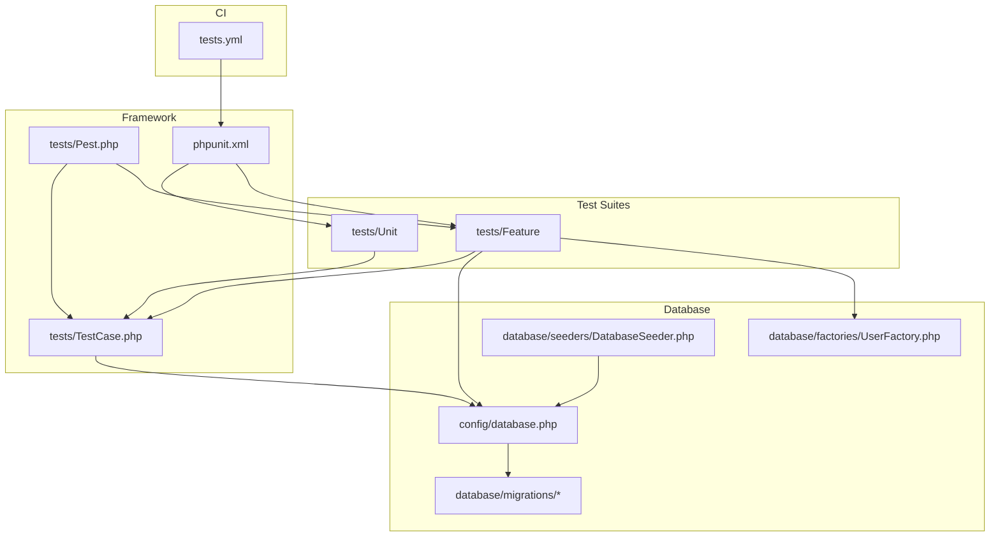
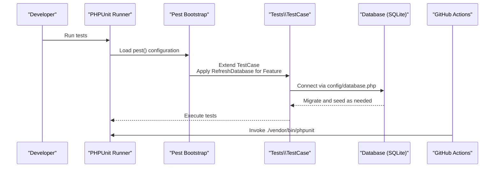
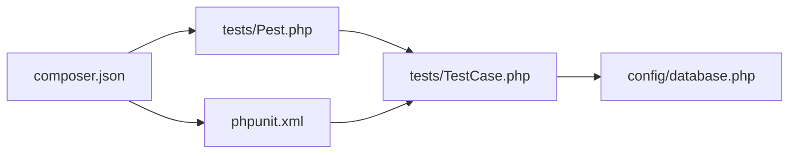

# Test Setup & Configuration

<cite>
**Referenced Files in This Document**
- [phpunit.xml](file://phpunit.xml)
- [tests/Pest.php](file://tests/Pest.php)
- [tests/TestCase.php](file://tests/TestCase.php)
- [composer.json](file://composer.json)
- [config/database.php](file://config/database.php)
- [.github/workflows/tests.yml](file://.github/workflows/tests.yml)
- [tests/Feature/Auth/AuthenticationTest.php](file://tests/Feature/Auth/AuthenticationTest.php)
- [tests/Unit/ExampleTest.php](file://tests/Unit/ExampleTest.php)
- [database/migrations/0001_01_01_000000_create_users_table.php](file://database/migrations/0001_01_01_000000_create_users_table.php)
- [database/factories/UserFactory.php](file://database/factories/UserFactory.php)
- [database/seeders/DatabaseSeeder.php](file://database/seeders/DatabaseSeeder.php)
- [package.json](file://package.json)
</cite>

## Table of Contents
1. [Introduction](#introduction)
2. [Project Structure](#project-structure)
3. [Core Components](#core-components)
4. [Architecture Overview](#architecture-overview)
5. [Detailed Component Analysis](#detailed-component-analysis)
6. [Dependency Analysis](#dependency-analysis)
7. [Performance Considerations](#performance-considerations)
8. [Troubleshooting Guide](#troubleshooting-guide)
9. [Conclusion](#conclusion)
10. [Appendices](#appendices)

## Introduction
This document explains the testing framework setup and configuration for the project. It covers PHPUnit configuration, Pest PHP setup, test database configuration and migrations, test data isolation, coverage reporting, parallel execution, CI/CD integration, environment setup, database seeding, mock service configuration, debugging, IDE integration, and test runner options. The goal is to provide a clear, actionable guide for running, maintaining, and extending tests locally and in CI.

## Project Structure
The testing stack is organized around Laravel’s built-in PHPUnit support and a minimal Pest configuration that extends the base test case and applies database refresh behavior for feature tests. Tests are split into Unit and Feature suites, with feature tests leveraging database refresh and factories for realistic test data.

**Diagram sources**
- [phpunit.xml:1-34](file://phpunit.xml#L1-L34)
- [tests/Pest.php:14-16](file://tests/Pest.php#L14-L16)
- [tests/TestCase.php:7-10](file://tests/TestCase.php#L7-L10)
- [config/database.php:32-43](file://config/database.php#L32-L43)
- [.github/workflows/tests.yml:52-53](file://.github/workflows/tests.yml#L52-L53)

**Section sources**
- [phpunit.xml:7-14](file://phpunit.xml#L7-L14)
- [tests/Pest.php:14-16](file://tests/Pest.php#L14-L16)
- [tests/TestCase.php:7-10](file://tests/TestCase.php#L7-L10)
- [config/database.php:19](file://config/database.php#L19)

## Core Components
- PHPUnit configuration defines two test suites (Unit and Feature), source inclusion for coverage, and environment overrides for testing.
- Pest configuration extends the base test case and applies database refresh for feature tests.
- Laravel’s database configuration supports SQLite by default and exposes environment-driven connection settings.
- CI workflow executes tests using PHPUnit with PHP and Node tooling preconfigured.

Key capabilities:
- Test suite organization via PHPUnit XML.
- Environment isolation via environment variables in PHPUnit.
- Database refresh and transaction rollback via Laravel’s RefreshDatabase trait.
- Factories and seeders for deterministic test data.
- CI pipeline invoking PHPUnit.

**Section sources**
- [phpunit.xml:7-19](file://phpunit.xml#L7-L19)
- [phpunit.xml:20-32](file://phpunit.xml#L20-L32)
- [tests/Pest.php:14-16](file://tests/Pest.php#L14-L16)
- [config/database.php:19](file://config/database.php#L19)

## Architecture Overview
The testing architecture centers on PHPUnit as the runner, Laravel’s testing traits for database isolation, Pest for concise feature tests, and CI orchestration.

**Diagram sources**
- [phpunit.xml:4](file://phpunit.xml#L4)
- [tests/Pest.php:14-16](file://tests/Pest.php#L14-L16)
- [tests/TestCase.php:7-10](file://tests/TestCase.php#L7-L10)
- [config/database.php:32-43](file://config/database.php#L32-L43)
- [.github/workflows/tests.yml:52-53](file://.github/workflows/tests.yml#L52-L53)

## Detailed Component Analysis

### PHPUnit Configuration
- Test suites: Two named suites (Unit and Feature) pointing to respective directories.
- Source coverage: Includes the app directory for coverage reporting.
- Environment overrides: Sets APP_ENV to testing, cache/session/mail/queue drivers to in-memory/array equivalents, and DB to SQLite with an in-memory database.

Operational impact:
- Ensures tests run in a controlled environment with minimal external dependencies.
- SQLite in-memory database improves speed and isolation.

**Section sources**
- [phpunit.xml:7-14](file://phpunit.xml#L7-L14)
- [phpunit.xml:15-19](file://phpunit.xml#L15-L19)
- [phpunit.xml:20-32](file://phpunit.xml#L20-L32)

### Pest PHP Setup
- Extends the base test case and applies the RefreshDatabase trait to feature tests.
- Applies the configuration to the Feature suite, ensuring database isolation per test.

Best practices:
- Keep shared setup in the base TestCase and suite-specific behavior in Pest configuration.
- Use RefreshDatabase for feature tests requiring database state isolation.

**Section sources**
- [tests/Pest.php:14-16](file://tests/Pest.php#L14-L16)

### Test Database Configuration and Migrations
- Default connection is SQLite; database path defaults to a local SQLite file unless overridden.
- PHPUnit sets DB_CONNECTION to sqlite and DB_DATABASE to an in-memory database for tests.
- Users table migration is included; sessions and password reset tokens are part of the schema.

Implications:
- Tests run against an in-memory SQLite database by default, minimizing IO overhead.
- Migrations are applied automatically by Laravel’s testing infrastructure when using RefreshDatabase.

**Section sources**
- [config/database.php:19](file://config/database.php#L19)
- [config/database.php:32-43](file://config/database.php#L32-L43)
- [phpunit.xml:25-26](file://phpunit.xml#L25-L26)
- [database/migrations/0001_01_01_000000_create_users_table.php:12-38](file://database/migrations/0001_01_01_000000_create_users_table.php#L12-L38)

### Test Data Isolation Strategies
- RefreshDatabase trait resets the database between tests, ensuring clean state.
- Factories produce deterministic records; unverified emails can be generated via factory states.
- Seeding creates baseline data for development and CI.

Recommended patterns:
- Prefer factories for test data generation.
- Use seeder calls for initial fixtures in feature tests.

**Section sources**
- [tests/Feature/Auth/AuthenticationTest.php:11](file://tests/Feature/Auth/AuthenticationTest.php#L11)
- [tests/Unit/ExampleTest.php:10](file://tests/Unit/ExampleTest.php#L10)
- [database/factories/UserFactory.php:24-44](file://database/factories/UserFactory.php#L24-L44)
- [database/seeders/DatabaseSeeder.php:15-29](file://database/seeders/DatabaseSeeder.php#L15-L29)

### Coverage Reporting Configuration
- PHPUnit includes the app directory for coverage reporting.
- CI workflow enables Xdebug for coverage collection.

Guidance:
- Use PHPUnit’s built-in coverage options to generate reports.
- Ensure coverage excludes irrelevant directories and focuses on application code.

**Section sources**
- [phpunit.xml:15-19](file://phpunit.xml#L15-L19)
- [.github/workflows/tests.yml:26](file://.github/workflows/tests.yml#L26)

### Parallel Test Execution Settings
- No explicit parallelization configuration is present in the repository files.
- Consider adding processIsolation or groups to enable parallel execution if test suites grow.

Action items:
- Evaluate test dependencies and introduce grouping or process isolation as appropriate.
- Monitor resource usage and adjust concurrency limits accordingly.

[No sources needed since this section provides general guidance]

### CI/CD Integration
- Workflow triggers on pushes and pull requests to mainline branches.
- PHP and Node environments are installed; assets are built prior to running tests.
- SQLite database file is created for test execution.
- Composer dependencies are installed and the application key is generated.
- Tests are executed via PHPUnit.

Recommendations:
- Cache Composer and NPM dependencies to improve performance.
- Add dedicated jobs for linting and type checking to complement tests.

**Section sources**
- [.github/workflows/tests.yml:3-11](file://.github/workflows/tests.yml#L3-L11)
- [.github/workflows/tests.yml:17-53](file://.github/workflows/tests.yml#L17-L53)

### Test Environment Setup
- Environment variables override production defaults for testing:
  - APP_ENV set to testing.
  - Maintenance driver set to file.
  - BCRYPT_ROUNDS reduced for faster hashing.
  - CACHE_STORE set to array.
  - MAIL_MAILER set to array.
  - QUEUE_CONNECTION set to sync.
  - SESSION_DRIVER set to array.
  - TELESCOPE_ENABLED and PULSE_ENABLED disabled.

These settings optimize test performance and reliability.

**Section sources**
- [phpunit.xml:20-32](file://phpunit.xml#L20-L32)

### Database Seeding for Tests
- The base seeder creates a default admin user and delegates to additional seeders for domain data.
- Feature tests can rely on factories and RefreshDatabase for isolated state.

Usage tips:
- Seeders are ideal for cross-cutting fixtures; factories for per-test data.

**Section sources**
- [database/seeders/DatabaseSeeder.php:15-29](file://database/seeders/DatabaseSeeder.php#L15-L29)

### Mock Service Configuration
- No explicit mock service configuration was found in the repository.
- For HTTP clients or external services, consider using Mockery or Laravel’s built-in HTTP mocking capabilities.

[No sources needed since this section provides general guidance]

### Debugging Configurations and IDE Integration
- PHPUnit supports colored output and can be invoked directly from the command line.
- Composer scripts and package.json provide development tooling; while not test-specific, they support a smooth developer experience.

Suggested improvements:
- Configure IDE test runners to use PHPUnit directly.
- Leverage Xdebug with CI coverage enabled for local debugging.

**Section sources**
- [phpunit.xml:5](file://phpunit.xml#L5)
- [package.json:4-10](file://package.json#L4-L10)

### Test Runner Options
- PHPUnit is configured to run via the vendor binary.
- Pest configuration extends the base test case and applies suite-specific traits.

Runner invocation:
- Use the PHPUnit binary to execute tests locally and in CI.

**Section sources**
- [.github/workflows/tests.yml:52-53](file://.github/workflows/tests.yml#L52-L53)
- [tests/Pest.php:14-16](file://tests/Pest.php#L14-L16)

## Dependency Analysis
The testing stack depends on Laravel’s framework, PHPUnit, and optional Pest extensions. Composer autoload configuration ensures test classes are discoverable.

**Diagram sources**
- [composer.json:18-26](file://composer.json#L18-L26)
- [composer.json:34-38](file://composer.json#L34-L38)
- [phpunit.xml:4](file://phpunit.xml#L4)
- [tests/Pest.php:14-16](file://tests/Pest.php#L14-L16)
- [tests/TestCase.php:7-10](file://tests/TestCase.php#L7-L10)
- [config/database.php:19](file://config/database.php#L19)

**Section sources**
- [composer.json:18-26](file://composer.json#L18-L26)
- [composer.json:34-38](file://composer.json#L34-L38)
- [phpunit.xml:4](file://phpunit.xml#L4)
- [tests/Pest.php:14-16](file://tests/Pest.php#L14-L16)
- [tests/TestCase.php:7-10](file://tests/TestCase.php#L7-L10)
- [config/database.php:19](file://config/database.php#L19)

## Performance Considerations
- SQLite in-memory database reduces IO overhead during tests.
- Lower bcrypt rounds and array caches/queues improve speed.
- RefreshDatabase ensures clean state but may increase runtime for large suites.

Recommendations:
- Use factories for lightweight, deterministic data.
- Group related tests and leverage database transactions where appropriate.
- Consider splitting large suites into smaller, focused groups.

[No sources needed since this section provides general guidance]

## Troubleshooting Guide
Common issues and resolutions:
- Tests failing due to missing SQLite database file: ensure the SQLite file exists or rely on in-memory database via PHPUnit environment.
- RefreshDatabase conflicts: verify that database migrations are up-to-date and that the in-memory database is properly initialized.
- CI failures due to missing environment variables: confirm that environment variables are set in CI and that the application key is generated before running tests.

**Section sources**
- [phpunit.xml:25-26](file://phpunit.xml#L25-L26)
- [database/migrations/0001_01_01_000000_create_users_table.php:12-38](file://database/migrations/0001_01_01_000000_create_users_table.php#L12-L38)
- [.github/workflows/tests.yml:46-53](file://.github/workflows/tests.yml#L46-L53)

## Conclusion
The project’s testing setup leverages PHPUnit and Pest with Laravel’s database refresh capabilities to deliver fast, isolated tests. SQLite in-memory databases, environment overrides, and CI automation streamline local and remote execution. Extending the setup with parallel execution, explicit coverage thresholds, and IDE integration will further improve developer productivity and test reliability.

[No sources needed since this section summarizes without analyzing specific files]

## Appendices

### Appendix A: Test Suite Organization
- Unit tests: Lightweight, stateless assertions.
- Feature tests: End-to-end scenarios with database refresh and factories.

**Section sources**
- [phpunit.xml:7-14](file://phpunit.xml#L7-L14)
- [tests/Feature/Auth/AuthenticationTest.php:9-54](file://tests/Feature/Auth/AuthenticationTest.php#L9-L54)
- [tests/Unit/ExampleTest.php:8-16](file://tests/Unit/ExampleTest.php#L8-L16)

### Appendix B: Environment Variables for Testing
- APP_ENV/testing: Activates testing mode.
- BCRYPT_ROUNDS: Reduced for faster hashing.
- CACHE_STORE/SESSION_DRIVER/QUEUE_CONNECTION: Array/file/sync for in-memory operations.
- DB_CONNECTION/DB_DATABASE: SQLite with in-memory database for tests.

**Section sources**
- [phpunit.xml:20-32](file://phpunit.xml#L20-L32)

### Appendix C: CI Workflow Highlights
- PHP and Node setup with caching.
- Asset build and database initialization.
- Composer install and key generation.
- PHPUnit execution.

**Section sources**
- [.github/workflows/tests.yml:17-53](file://.github/workflows/tests.yml#L17-L53)