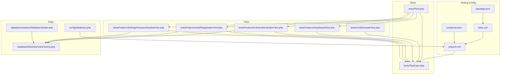
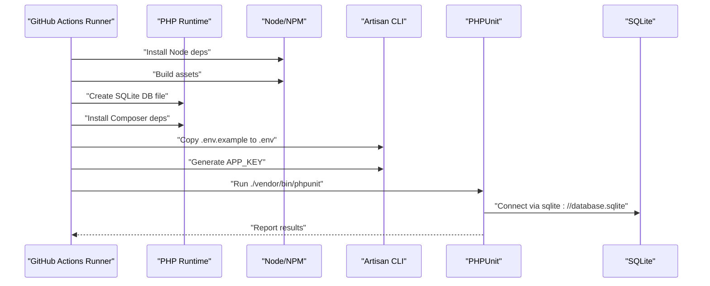
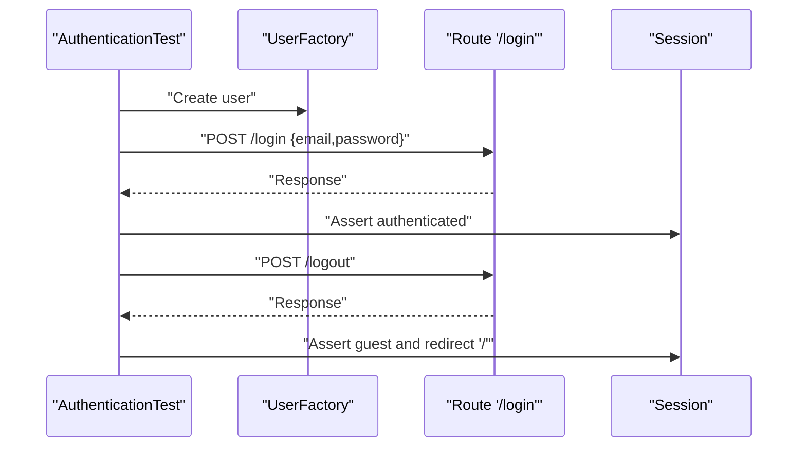
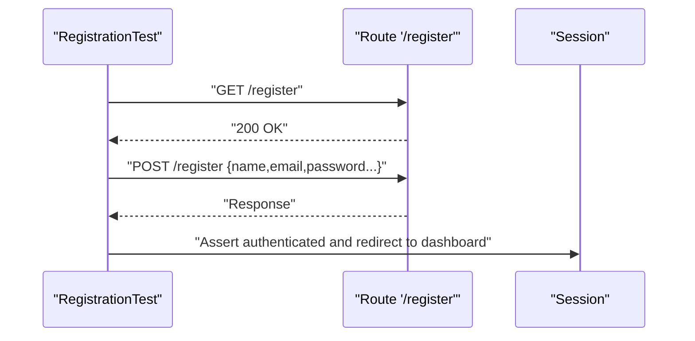
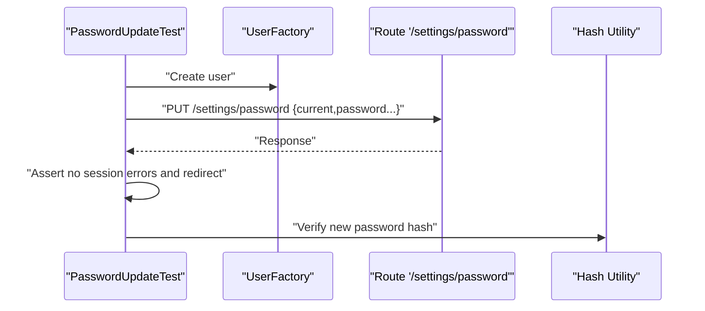
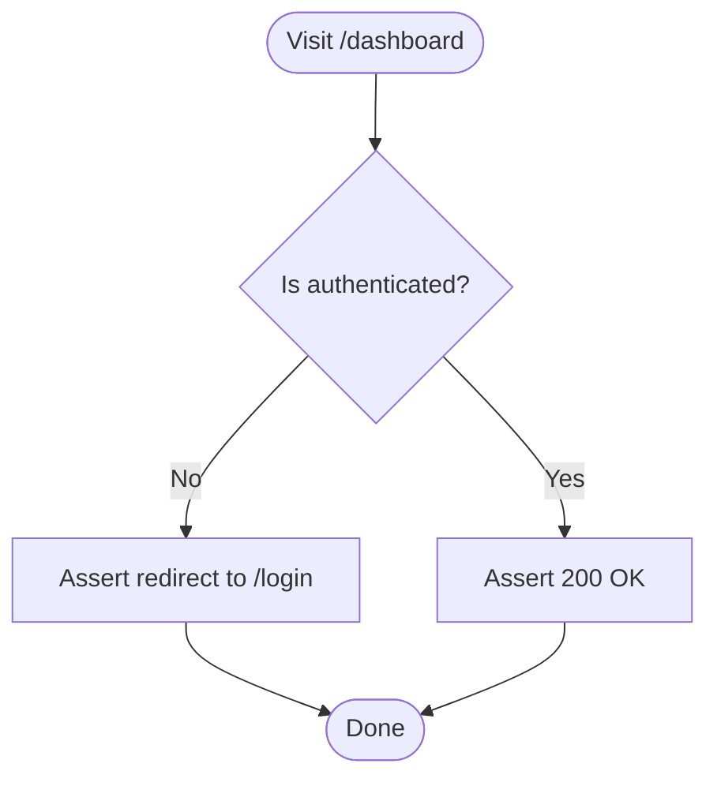
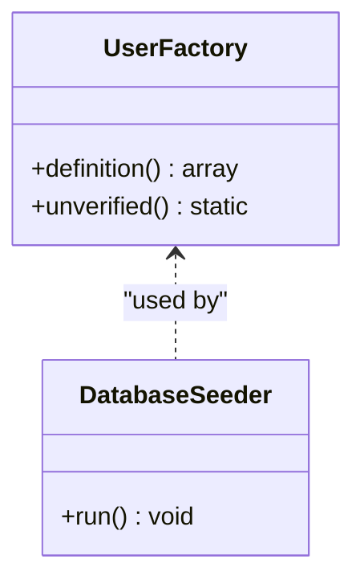
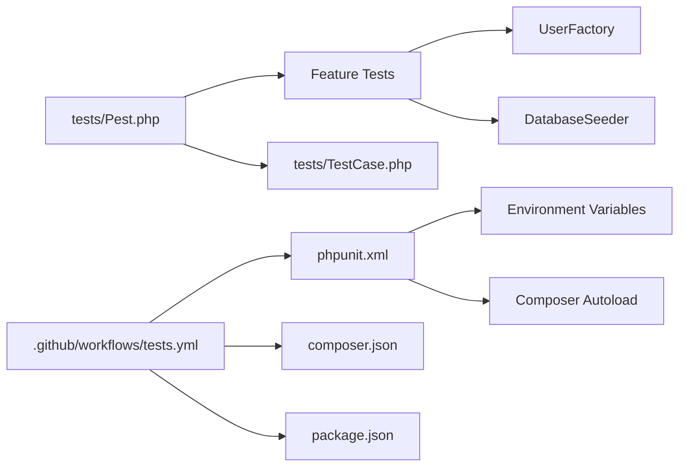

# Testing Framework

<cite>
**Referenced Files in This Document**
- [phpunit.xml](file://phpunit.xml)
- [composer.json](file://composer.json)
- [package.json](file://package.json)
- [.github/workflows/tests.yml](file://.github/workflows/tests.yml)
- [tests/TestCase.php](file://tests/TestCase.php)
- [tests/Pest.php](file://tests/Pest.php)
- [tests/Unit/ExampleTest.php](file://tests/Unit/ExampleTest.php)
- [tests/Feature/DashboardTest.php](file://tests/Feature/DashboardTest.php)
- [tests/Feature/Auth/AuthenticationTest.php](file://tests/Feature/Auth/AuthenticationTest.php)
- [tests/Feature/Auth/RegistrationTest.php](file://tests/Feature/Auth/RegistrationTest.php)
- [tests/Feature/Settings/PasswordUpdateTest.php](file://tests/Feature/Settings/PasswordUpdateTest.php)
- [database/factories/UserFactory.php](file://database/factories/UserFactory.php)
- [database/seeders/DatabaseSeeder.php](file://database/seeders/DatabaseSeeder.php)
- [config/database.php](file://config/database.php)
</cite>

## Table of Contents
1. [Introduction](#introduction)
2. [Project Structure](#project-structure)
3. [Core Components](#core-components)
4. [Architecture Overview](#architecture-overview)
5. [Detailed Component Analysis](#detailed-component-analysis)
6. [Dependency Analysis](#dependency-analysis)
7. [Performance Considerations](#performance-considerations)
8. [Troubleshooting Guide](#troubleshooting-guide)
9. [Conclusion](#conclusion)
10. [Appendices](#appendices)

## Introduction
This document describes the testing framework for the Laravel application, focusing on PHPUnit and Pest configurations, test organization, and testing strategies. It covers unit tests, feature tests, and integration-style tests, along with authentication, authorization, and API endpoint testing patterns. It also documents test configuration, database seeding, environment setup, coverage and CI, and best practices for debugging both frontend and backend components.

## Project Structure
The testing setup is organized around:
- PHPUnit configuration defining test suites and environment variables
- A base test case class extended by all tests
- Pest configuration extending the base test case and enabling database refresh for feature tests
- Feature tests under tests/Feature grouped by domain (Auth, Settings)
- Unit tests under tests/Unit
- Factories and seeders for deterministic test data
- GitHub Actions workflow orchestrating CI

**Diagram sources**
- [phpunit.xml:1-34](file://phpunit.xml#L1-L34)
- [composer.json:1-77](file://composer.json#L1-L77)
- [package.json:1-73](file://package.json#L1-L73)
- [.github/workflows/tests.yml:1-54](file://.github/workflows/tests.yml#L1-L54)
- [tests/TestCase.php:1-11](file://tests/TestCase.php#L1-L11)
- [tests/Pest.php:1-48](file://tests/Pest.php#L1-L48)
- [tests/Unit/ExampleTest.php:1-17](file://tests/Unit/ExampleTest.php#L1-L17)
- [tests/Feature/DashboardTest.php:1-25](file://tests/Feature/DashboardTest.php#L1-L25)
- [tests/Feature/Auth/AuthenticationTest.php:1-55](file://tests/Feature/Auth/AuthenticationTest.php#L1-L55)
- [tests/Feature/Auth/RegistrationTest.php:1-32](file://tests/Feature/Auth/RegistrationTest.php#L1-L32)
- [tests/Feature/Settings/PasswordUpdateTest.php:1-52](file://tests/Feature/Settings/PasswordUpdateTest.php#L1-L52)
- [database/factories/UserFactory.php:1-45](file://database/factories/UserFactory.php#L1-L45)
- [database/seeders/DatabaseSeeder.php:1-31](file://database/seeders/DatabaseSeeder.php#L1-L31)
- [config/database.php:1-175](file://config/database.php#L1-L175)

**Section sources**
- [phpunit.xml:1-34](file://phpunit.xml#L1-L34)
- [tests/TestCase.php:1-11](file://tests/TestCase.php#L1-L11)
- [tests/Pest.php:1-48](file://tests/Pest.php#L1-L48)
- [composer.json:1-77](file://composer.json#L1-L77)
- [package.json:1-73](file://package.json#L1-L73)
- [.github/workflows/tests.yml:1-54](file://.github/workflows/tests.yml#L1-L54)

## Core Components
- PHPUnit configuration defines two test suites (Unit and Feature), source inclusion for coverage, and environment variables optimized for testing (SQLite in-memory, array caches, sync queues, etc.).
- Base test case class extends the framework’s base test case.
- Pest configuration extends the base test case, applies database refresh for feature tests, and exposes helpers and expectations.
- Feature tests validate routing, authentication, authorization, and form submissions.
- Factories and seeders provide deterministic, reusable test data.
- CI workflow installs dependencies, builds assets, creates SQLite database, generates keys, and runs PHPUnit.

Key behaviors:
- RefreshDatabase trait is used across feature tests to reset the database per test.
- Factories auto-hash passwords and provide verified/unverified states.
- Seeding creates initial admin and related domain data.

**Section sources**
- [phpunit.xml:7-32](file://phpunit.xml#L7-L32)
- [tests/TestCase.php:7-10](file://tests/TestCase.php#L7-L10)
- [tests/Pest.php:14-16](file://tests/Pest.php#L14-L16)
- [tests/Feature/DashboardTest.php:11-23](file://tests/Feature/DashboardTest.php#L11-L23)
- [database/factories/UserFactory.php:24-43](file://database/factories/UserFactory.php#L24-L43)
- [database/seeders/DatabaseSeeder.php:15-29](file://database/seeders/DatabaseSeeder.php#L15-L29)
- [.github/workflows/tests.yml:40-53](file://.github/workflows/tests.yml#L40-L53)

## Architecture Overview
The testing architecture centers on a shared base test case and Pest extensions, with feature tests leveraging database refresh and factories. CI automates environment setup and execution.

**Diagram sources**
- [.github/workflows/tests.yml:18-53](file://.github/workflows/tests.yml#L18-L53)
- [phpunit.xml:20-31](file://phpunit.xml#L20-L31)
- [composer.json:50-58](file://composer.json#L50-L58)
- [package.json:4-11](file://package.json#L4-L11)

## Detailed Component Analysis

### PHPUnit Configuration
- Defines Unit and Feature test suites and includes app/ for coverage.
- Sets environment variables for testing:
  - APP_ENV=testing
  - CACHE_STORE=array
  - QUEUE_CONNECTION=sync
  - SESSION_DRIVER=array
  - DB_CONNECTION=sqlite with DB_DATABASE=:memory:
  - MAIL_MAILER=array
  - TELESCOPE_ENABLED=false
  - PULSE_ENABLED=false
- Ensures fast, isolated tests with minimal external dependencies.

Best practices:
- Keep environment variables aligned with test needs.
- Prefer in-memory SQLite for speed and isolation.
- Disable telemetry and non-essential services in tests.

**Section sources**
- [phpunit.xml:7-32](file://phpunit.xml#L7-L32)

### Base Test Case
- Provides a shared foundation for all tests.
- Extends the framework’s base test case class.

Usage:
- Extend this class in all feature and unit tests to inherit common behaviors and helpers.

**Section sources**
- [tests/TestCase.php:7-10](file://tests/TestCase.php#L7-L10)

### Pest Configuration
- Extends the base test case and applies RefreshDatabase to feature tests.
- Declares test scope to Feature directory.
- Adds custom expectation and helper functions for convenience.

Benefits:
- Reduces boilerplate in feature tests.
- Encourages consistent assertions and helpers across tests.

**Section sources**
- [tests/Pest.php:14-16](file://tests/Pest.php#L14-L16)
- [tests/Pest.php:29-31](file://tests/Pest.php#L29-L31)
- [tests/Pest.php:44-47](file://tests/Pest.php#L44-L47)

### Feature Tests: Authentication
- Validates login screen rendering, successful login, invalid password handling, and logout.
- Uses actingAs to simulate authenticated users.
- Asserts redirects to dashboard and guest states after logout.

**Diagram sources**
- [tests/Feature/Auth/AuthenticationTest.php:20-53](file://tests/Feature/Auth/AuthenticationTest.php#L20-L53)
- [database/factories/UserFactory.php:24-33](file://database/factories/UserFactory.php#L24-L33)

**Section sources**
- [tests/Feature/Auth/AuthenticationTest.php:13-53](file://tests/Feature/Auth/AuthenticationTest.php#L13-L53)

### Feature Tests: Registration
- Renders registration page and validates successful registration flow.
- Asserts authentication and redirection to dashboard.

**Diagram sources**
- [tests/Feature/Auth/RegistrationTest.php:12-30](file://tests/Feature/Auth/RegistrationTest.php#L12-L30)

**Section sources**
- [tests/Feature/Auth/RegistrationTest.php:12-30](file://tests/Feature/Auth/RegistrationTest.php#L12-L30)

### Feature Tests: Settings (Password Update)
- Tests updating password with correct current password and enforcing validation errors when incorrect.
- Verifies session errors and redirect behavior.
- Confirms password hash update using hashing verification.

**Diagram sources**
- [tests/Feature/Settings/PasswordUpdateTest.php:14-32](file://tests/Feature/Settings/PasswordUpdateTest.php#L14-L32)
- [database/factories/UserFactory.php:24-33](file://database/factories/UserFactory.php#L24-L33)

**Section sources**
- [tests/Feature/Settings/PasswordUpdateTest.php:14-50](file://tests/Feature/Settings/PasswordUpdateTest.php#L14-L50)

### Feature Tests: Authorization and Routing
- Validates guest redirection to login for protected routes.
- Confirms authenticated users can access dashboard.

**Diagram sources**
- [tests/Feature/DashboardTest.php:13-23](file://tests/Feature/DashboardTest.php#L13-L23)

**Section sources**
- [tests/Feature/DashboardTest.php:13-23](file://tests/Feature/DashboardTest.php#L13-L23)

### Unit Tests
- Minimal example demonstrating a basic assertion within the shared base test case.

**Section sources**
- [tests/Unit/ExampleTest.php:12-15](file://tests/Unit/ExampleTest.php#L12-L15)

### Test Data: Factories and Seeders
- UserFactory provides default attributes and hashed passwords, with an unverified state option.
- DatabaseSeeder creates an initial admin user and delegates to domain-specific seeders.

**Diagram sources**
- [database/factories/UserFactory.php:24-43](file://database/factories/UserFactory.php#L24-L43)
- [database/seeders/DatabaseSeeder.php:15-29](file://database/seeders/DatabaseSeeder.php#L15-L29)

**Section sources**
- [database/factories/UserFactory.php:24-43](file://database/factories/UserFactory.php#L24-L43)
- [database/seeders/DatabaseSeeder.php:15-29](file://database/seeders/DatabaseSeeder.php#L15-L29)

### CI and Test Environment
- Workflow installs Node dependencies, builds assets, creates SQLite database file, installs Composer dependencies, copies .env, generates key, and runs PHPUnit.
- PHP version and Node version pinned for reproducibility.
- Coverage configured via Xdebug in the action.

**Section sources**
- [.github/workflows/tests.yml:18-53](file://.github/workflows/tests.yml#L18-L53)
- [composer.json:50-58](file://composer.json#L50-L58)
- [package.json:4-11](file://package.json#L4-L11)

## Dependency Analysis
- PHPUnit depends on Composer autoload and environment variables defined in phpunit.xml.
- Pest depends on the base test case and the RefreshDatabase trait applied to feature tests.
- Feature tests depend on factories and seeders for deterministic data.
- CI depends on Composer and NPM scripts, and Artisan commands to prepare the environment.

**Diagram sources**
- [phpunit.xml:20-31](file://phpunit.xml#L20-L31)
- [composer.json:25-26](file://composer.json#L25-L26)
- [tests/Pest.php:14-16](file://tests/Pest.php#L14-L16)
- [tests/TestCase.php:7-10](file://tests/TestCase.php#L7-L10)
- [tests/Feature/Auth/AuthenticationTest.php:22-29](file://tests/Feature/Auth/AuthenticationTest.php#L22-L29)
- [database/seeders/DatabaseSeeder.php:17-28](file://database/seeders/DatabaseSeeder.php#L17-L28)
- [.github/workflows/tests.yml:40-53](file://.github/workflows/tests.yml#L40-L53)

**Section sources**
- [phpunit.xml:20-31](file://phpunit.xml#L20-L31)
- [composer.json:25-26](file://composer.json#L25-L26)
- [tests/Pest.php:14-16](file://tests/Pest.php#L14-L16)
- [tests/TestCase.php:7-10](file://tests/TestCase.php#L7-L10)
- [tests/Feature/Auth/AuthenticationTest.php:22-29](file://tests/Feature/Auth/AuthenticationTest.php#L22-L29)
- [database/seeders/DatabaseSeeder.php:17-28](file://database/seeders/DatabaseSeeder.php#L17-L28)
- [.github/workflows/tests.yml:40-53](file://.github/workflows/tests.yml#L40-L53)

## Performance Considerations
- Use SQLite in-memory database for fast test runs.
- Apply RefreshDatabase trait selectively to feature tests to avoid unnecessary overhead in unit tests.
- Keep factories minimal and reuse common states.
- Run CI jobs with cached dependencies to reduce cold-start times.

## Troubleshooting Guide
Common issues and resolutions:
- Database connection failures in CI: Ensure SQLite database file exists and is writable; verify environment variables match phpunit.xml.
- Missing application key: Generate key during CI before running tests.
- Asset build failures: Confirm Node dependencies install and build completes prior to running tests.
- Authentication assertions failing: Verify factories produce hashed passwords and that login credentials match factory defaults.
- Redirect assertions: Confirm route names and absolute/relative redirect expectations align with application routes.

**Section sources**
- [.github/workflows/tests.yml:40-53](file://.github/workflows/tests.yml#L40-L53)
- [phpunit.xml:20-31](file://phpunit.xml#L20-L31)
- [database/factories/UserFactory.php:30](file://database/factories/UserFactory.php#L30)

## Conclusion
The testing framework leverages PHPUnit and Pest to provide a robust, maintainable suite of unit and feature tests. With environment-driven configuration, deterministic factories and seeders, and an automated CI pipeline, the project ensures reliable development and deployment workflows. Following the outlined strategies and best practices will keep tests fast, readable, and effective.

## Appendices

### Test Organization Summary
- Unit tests: Lightweight assertions under tests/Unit.
- Feature tests: End-to-end scenarios under tests/Feature grouped by domain.
- Base test case: Shared foundation for all tests.
- Pest extensions: Consistent setup and helpers for feature tests.

**Section sources**
- [tests/Unit/ExampleTest.php:1-17](file://tests/Unit/ExampleTest.php#L1-L17)
- [tests/Feature/DashboardTest.php:1-25](file://tests/Feature/DashboardTest.php#L1-L25)
- [tests/Feature/Auth/AuthenticationTest.php:1-55](file://tests/Feature/Auth/AuthenticationTest.php#L1-L55)
- [tests/Feature/Auth/RegistrationTest.php:1-32](file://tests/Feature/Auth/RegistrationTest.php#L1-L32)
- [tests/Feature/Settings/PasswordUpdateTest.php:1-52](file://tests/Feature/Settings/PasswordUpdateTest.php#L1-L52)
- [tests/TestCase.php:1-11](file://tests/TestCase.php#L1-L11)
- [tests/Pest.php:1-48](file://tests/Pest.php#L1-L48)