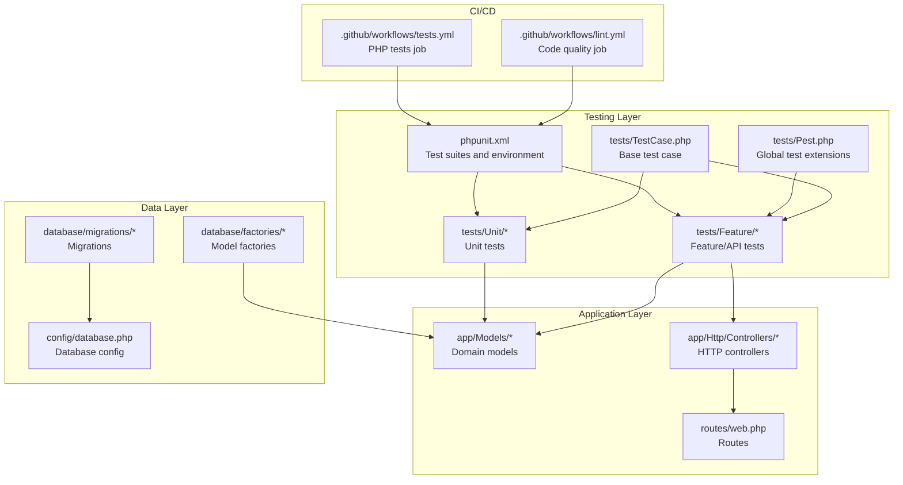
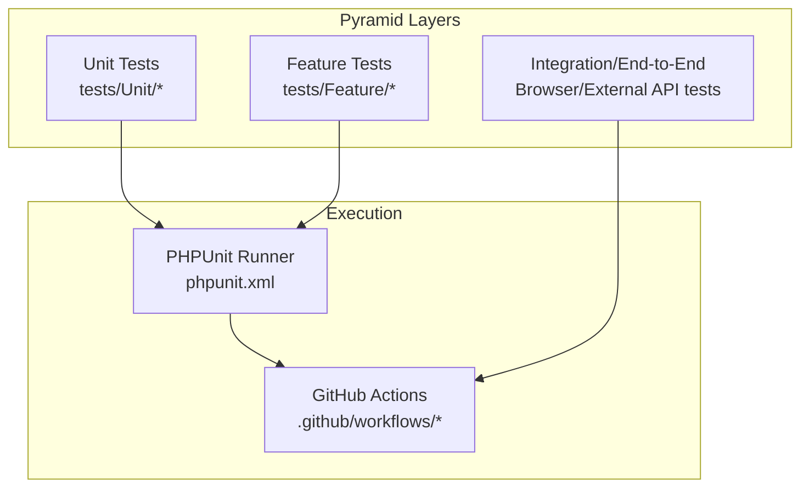
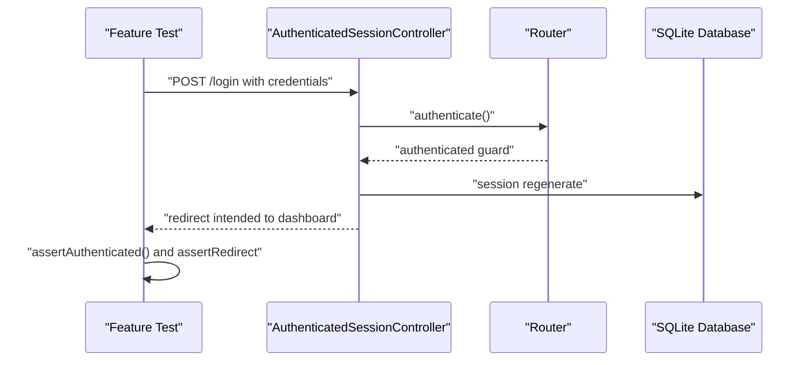
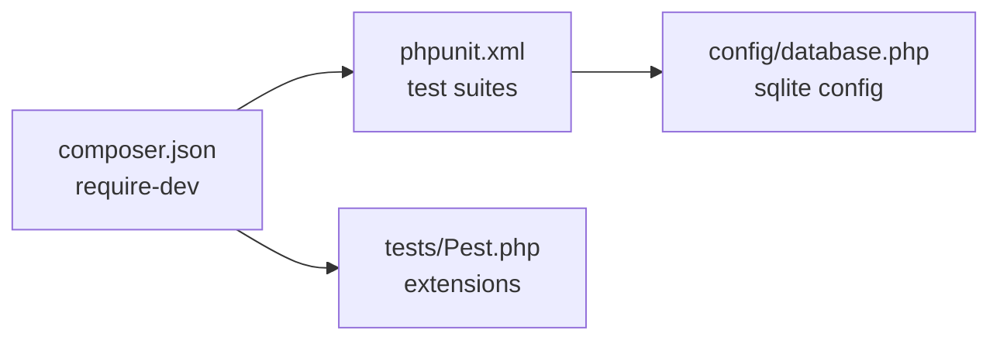

# Testing Strategies & Best Practices

<cite>
**Referenced Files in This Document**
- [phpunit.xml](file://phpunit.xml)
- [composer.json](file://composer.json)
- [tests/Pest.php](file://tests/Pest.php)
- [tests/TestCase.php](file://tests/TestCase.php)
- [tests/Unit/ExampleTest.php](file://tests/Unit/ExampleTest.php)
- [tests/Feature/Auth/AuthenticationTest.php](file://tests/Feature/Auth/AuthenticationTest.php)
- [tests/Feature/DashboardTest.php](file://tests/Feature/DashboardTest.php)
- [.github/workflows/tests.yml](file://.github/workflows/tests.yml)
- [.github/workflows/lint.yml](file://.github/workflows/lint.yml)
- [database/factories/UserFactory.php](file://database/factories/UserFactory.php)
- [database/migrations/0001_01_01_000000_create_users_table.php](file://database/migrations/0001_01_01_000000_create_users_table.php)
- [routes/web.php](file://routes/web.php)
- [config/database.php](file://config/database.php)
- [app/Models/User.php](file://app/Models/User.php)
- [app/Http/Controllers/Controller.php](file://app/Http/Controllers/Controller.php)
- [app/Http/Controllers/Auth/AuthenticatedSessionController.php](file://app/Http/Controllers/Auth/AuthenticatedSessionController.php)
</cite>

## Table of Contents
1. [Introduction](#introduction)
2. [Project Structure](#project-structure)
3. [Core Components](#core-components)
4. [Architecture Overview](#architecture-overview)
5. [Detailed Component Analysis](#detailed-component-analysis)
6. [Dependency Analysis](#dependency-analysis)
7. [Performance Considerations](#performance-considerations)
8. [Troubleshooting Guide](#troubleshooting-guide)
9. [Conclusion](#conclusion)
10. [Appendices](#appendices)

## Introduction
This document provides comprehensive testing strategies and best practices tailored to the Laravel application. It covers the test pyramid, test organization, maintainable architecture, patterns across models, controllers, services, and APIs, test data management via factories, database testing strategies, continuous integration workflows, automated testing, coverage analysis, performance and load testing approaches, debugging techniques, failure analysis, and guidelines for test maintenance and documentation.

## Project Structure
The repository follows Laravel conventions with a clear separation between unit and feature tests, a Pest configuration extending the base test case, and a CI pipeline configured in GitHub Actions. The test suite targets the app directory and uses an in-memory SQLite database for speed and isolation during testing.

**Diagram sources**
- [phpunit.xml:1-34](file://phpunit.xml#L1-L34)
- [tests/Pest.php:14-16](file://tests/Pest.php#L14-L16)
- [tests/TestCase.php:7-10](file://tests/TestCase.php#L7-L10)
- [routes/web.php:1-100](file://routes/web.php#L1-L100)
- [config/database.php:32-43](file://config/database.php#L32-L43)

**Section sources**
- [phpunit.xml:7-19](file://phpunit.xml#L7-L19)
- [composer.json:34-37](file://composer.json#L34-L37)
- [tests/Pest.php:14-16](file://tests/Pest.php#L14-L16)
- [tests/TestCase.php:7-10](file://tests/TestCase.php#L7-L10)

## Core Components
- Test Suites: Separate Unit and Feature test suites configured in phpunit.xml.
- Base Test Case: Minimal base class extended by all tests.
- Pest Extensions: Global test extensions and expectations configured for Feature tests.
- Factories: Eloquent factories for deterministic and reusable test data.
- Database Configuration: SQLite in-memory database for fast, isolated tests.
- CI Workflows: Automated PHP tests and code quality checks.

Key implementation references:
- Test suites and environment: [phpunit.xml:7-32](file://phpunit.xml#L7-L32)
- Pest configuration: [tests/Pest.php:14-16](file://tests/Pest.php#L14-L16)
- Base test case: [tests/TestCase.php:7-10](file://tests/TestCase.php#L7-L10)
- User factory: [database/factories/UserFactory.php:12-44](file://database/factories/UserFactory.php#L12-L44)
- Database config: [config/database.php:32-43](file://config/database.php#L32-L43)

**Section sources**
- [phpunit.xml:7-32](file://phpunit.xml#L7-L32)
- [tests/Pest.php:14-16](file://tests/Pest.php#L14-L16)
- [tests/TestCase.php:7-10](file://tests/TestCase.php#L7-L10)
- [database/factories/UserFactory.php:12-44](file://database/factories/UserFactory.php#L12-L44)
- [config/database.php:32-43](file://config/database.php#L32-L43)

## Architecture Overview
The testing architecture aligns with the test pyramid:
- Unit tests validate individual units (models, small functions).
- Feature tests validate HTTP/API interactions and end-to-end flows.
- CI pipelines automate unit and feature tests, ensuring consistent feedback.

[No sources needed since this diagram shows conceptual workflow, not actual code structure]

## Detailed Component Analysis

### Test Organization Principles
- Directory separation: Unit vs Feature tests for clarity and focused execution.
- Pest extensions: Centralized trait usage and expectations for Feature tests.
- Base test case: Shared setup and helpers for all tests.

References:
- Suite organization: [phpunit.xml:7-19](file://phpunit.xml#L7-L19)
- Pest Feature scope: [tests/Pest.php:14-16](file://tests/Pest.php#L14-L16)
- Base test case: [tests/TestCase.php:7-10](file://tests/TestCase.php#L7-L10)

**Section sources**
- [phpunit.xml:7-19](file://phpunit.xml#L7-L19)
- [tests/Pest.php:14-16](file://tests/Pest.php#L14-L16)
- [tests/TestCase.php:7-10](file://tests/TestCase.php#L7-L10)

### Test Data Management and Factories
- Eloquent factories encapsulate default model states and common mutations.
- Factories leverage Faker and hashed passwords for realistic yet deterministic data.
- Factories are autoloaded and used across tests to create records efficiently.

References:
- Factory definition: [database/factories/UserFactory.php:12-44](file://database/factories/UserFactory.php#L12-L44)
- Model relationship: [app/Models/User.php:10-48](file://app/Models/User.php#L10-L48)
- Migration schema: [database/migrations/0001_01_01_000000_create_users_table.php:12-38](file://database/migrations/0001_01_01_000000_create_users_table.php#L12-L38)

**Section sources**
- [database/factories/UserFactory.php:12-44](file://database/factories/UserFactory.php#L12-L44)
- [app/Models/User.php:10-48](file://app/Models/User.php#L10-L48)
- [database/migrations/0001_01_01_000000_create_users_table.php:12-38](file://database/migrations/0001_01_01_000000_create_users_table.php#L12-L38)

### Database Testing Strategies
- In-memory SQLite: Fast, isolated databases per test run.
- RefreshDatabase trait: Per-test database refresh for isolation.
- Environment overrides: Ensures consistent test behavior across environments.

References:
- PHPUnit environment: [phpunit.xml:20-32](file://phpunit.xml#L20-L32)
- RefreshDatabase usage: [tests/Feature/Auth/AuthenticationTest.php:11](file://tests/Feature/Auth/AuthenticationTest.php#L11), [tests/Feature/DashboardTest.php:11](file://tests/Feature/DashboardTest.php#L11)
- SQLite config: [config/database.php:32-43](file://config/database.php#L32-L43)

**Section sources**
- [phpunit.xml:20-32](file://phpunit.xml#L20-L32)
- [tests/Feature/Auth/AuthenticationTest.php:11](file://tests/Feature/Auth/AuthenticationTest.php#L11)
- [tests/Feature/DashboardTest.php:11](file://tests/Feature/DashboardTest.php#L11)
- [config/database.php:32-43](file://config/database.php#L32-L43)

### Testing Patterns Across Application Layers

#### Models
- Validation and casting: Ensure model attributes behave as expected under various inputs.
- Relationships: Verify foreign keys and cascading behaviors via factory-driven tests.
- Hashing and hidden attributes: Confirm sensitive data handling.

References:
- Model definition: [app/Models/User.php:10-48](file://app/Models/User.php#L10-L48)
- Factory defaults: [database/factories/UserFactory.php:24-33](file://database/factories/UserFactory.php#L24-L33)

**Section sources**
- [app/Models/User.php:10-48](file://app/Models/User.php#L10-L48)
- [database/factories/UserFactory.php:24-33](file://database/factories/UserFactory.php#L24-L33)

#### Controllers
- HTTP response assertions: Status codes, redirects, and inertia renders.
- Authentication middleware: Ensure protected routes redirect guests appropriately.
- Request handling: Validate request lifecycle from controller action to response.

References:
- Base controller: [app/Http/Controllers/Controller.php:5-8](file://app/Http/Controllers/Controller.php#L5-L8)
- Auth controller actions: [app/Http/Controllers/Auth/AuthenticatedSessionController.php:19-50](file://app/Http/Controllers/Auth/AuthenticatedSessionController.php#L19-L50)
- Routes: [routes/web.php:20-96](file://routes/web.php#L20-L96)

**Section sources**
- [app/Http/Controllers/Controller.php:5-8](file://app/Http/Controllers/Controller.php#L5-L8)
- [app/Http/Controllers/Auth/AuthenticatedSessionController.php:19-50](file://app/Http/Controllers/Auth/AuthenticatedSessionController.php#L19-L50)
- [routes/web.php:20-96](file://routes/web.php#L20-L96)

#### Services and APIs
- Feature tests: Drive HTTP endpoints and assert outcomes.
- Request objects: Validate request shaping and validation rules.
- Middleware and routing: Ensure proper authorization and route resolution.

References:
- Feature test examples: [tests/Feature/Auth/AuthenticationTest.php:13-53](file://tests/Feature/Auth/AuthenticationTest.php#L13-L53), [tests/Feature/DashboardTest.php:13-23](file://tests/Feature/DashboardTest.php#L13-L23)
- Routes: [routes/web.php:16-96](file://routes/web.php#L16-L96)

**Section sources**
- [tests/Feature/Auth/AuthenticationTest.php:13-53](file://tests/Feature/Auth/AuthenticationTest.php#L13-L53)
- [tests/Feature/DashboardTest.php:13-23](file://tests/Feature/DashboardTest.php#L13-L23)
- [routes/web.php:16-96](file://routes/web.php#L16-L96)

### Continuous Integration and Automated Testing
- PHP tests job: Sets up PHP and Node, installs dependencies, builds assets, creates SQLite, generates keys, and runs PHPUnit.
- Linting job: Runs code formatting and linting for backend and frontend.
- Coverage: Xdebug enabled in CI for coverage reporting.

References:
- Tests workflow: [.github/workflows/tests.yml:13-53](file://.github/workflows/tests.yml#L13-L53)
- Lint workflow: [.github/workflows/lint.yml:16-39](file://.github/workflows/lint.yml#L16-L39)

**Section sources**
- [.github/workflows/tests.yml:13-53](file://.github/workflows/tests.yml#L13-L53)
- [.github/workflows/lint.yml:16-39](file://.github/workflows/lint.yml#L16-L39)

### Test Coverage Analysis
- PHPUnit configuration includes the app directory as source for coverage analysis.
- CI enables Xdebug for coverage collection.

References:
- Source inclusion: [phpunit.xml:15-19](file://phpunit.xml#L15-L19)
- Coverage enablement: [.github/workflows/tests.yml:26](file://.github/workflows/tests.yml#L26)

**Section sources**
- [phpunit.xml:15-19](file://phpunit.xml#L15-L19)
- [.github/workflows/tests.yml:26](file://.github/workflows/tests.yml#L26)

### API Workflow Sequence (Feature Test)

**Diagram sources**
- [tests/Feature/Auth/AuthenticationTest.php:20-31](file://tests/Feature/Auth/AuthenticationTest.php#L20-L31)
- [app/Http/Controllers/Auth/AuthenticatedSessionController.php:30-37](file://app/Http/Controllers/Auth/AuthenticatedSessionController.php#L30-L37)
- [routes/web.php:20-23](file://routes/web.php#L20-L23)

## Dependency Analysis
- Test dependencies: PHPUnit, Pest, Faker, Mockery, and Laravel testing traits.
- Autoloading: PSR-4 namespaces for app, factories, seeders, and tests.
- Database connectivity: SQLite driver configured for testing.

**Diagram sources**
- [composer.json:18-26](file://composer.json#L18-L26)
- [phpunit.xml:7-19](file://phpunit.xml#L7-L19)
- [tests/Pest.php:14-16](file://tests/Pest.php#L14-L16)
- [config/database.php:32-43](file://config/database.php#L32-L43)

**Section sources**
- [composer.json:18-26](file://composer.json#L18-L26)
- [composer.json:34-37](file://composer.json#L34-L37)
- [phpunit.xml:7-19](file://phpunit.xml#L7-L19)
- [tests/Pest.php:14-16](file://tests/Pest.php#L14-L16)
- [config/database.php:32-43](file://config/database.php#L32-L43)

## Performance Considerations
- Use SQLite in-memory for fast test execution.
- Leverage RefreshDatabase trait to minimize cross-test contamination.
- Keep feature tests focused and avoid heavy external dependencies.
- Parallelize independent tests where appropriate using PHPUnit’s built-in capabilities.

[No sources needed since this section provides general guidance]

## Troubleshooting Guide
Common issues and resolutions:
- Database connection errors in tests: Ensure SQLite database file exists and environment variables are set correctly.
  - References: [phpunit.xml:20-32](file://phpunit.xml#L20-L32), [.github/workflows/tests.yml:40-41](file://.github/workflows/tests.yml#L40-L41)
- Missing application key: Generate key before running tests.
  - Reference: [.github/workflows/tests.yml:49-50](file://.github/workflows/tests.yml#L49-L50)
- Pest trait not applied: Verify Pest configuration binds RefreshDatabase and Feature scope.
  - Reference: [tests/Pest.php:14-16](file://tests/Pest.php#L14-L16)
- Authentication failures: Confirm factory-generated credentials match controller expectations.
  - Reference: [tests/Feature/Auth/AuthenticationTest.php:20-31](file://tests/Feature/Auth/AuthenticationTest.php#L20-L31)

**Section sources**
- [phpunit.xml:20-32](file://phpunit.xml#L20-L32)
- [.github/workflows/tests.yml:40-50](file://.github/workflows/tests.yml#L40-L50)
- [tests/Pest.php:14-16](file://tests/Pest.php#L14-L16)
- [tests/Feature/Auth/AuthenticationTest.php:20-31](file://tests/Feature/Auth/AuthenticationTest.php#L20-L31)

## Conclusion
The application employs a pragmatic testing strategy aligned with the test pyramid, leveraging Pest for expressive Feature tests, Eloquent factories for robust test data, and SQLite for fast, isolated database tests. CI pipelines automate verification, while configuration ensures consistent behavior across environments. Adopting the patterns and practices outlined here will help maintain a reliable, scalable, and efficient test suite.

[No sources needed since this section summarizes without analyzing specific files]

## Appendices

### Test Pyramid Implementation Checklist
- Unit tests cover model logic and small functions.
- Feature tests validate HTTP flows and integrations.
- CI jobs run unit and feature tests automatically.
- Coverage thresholds and linting enforced in CI.

[No sources needed since this section provides general guidance]