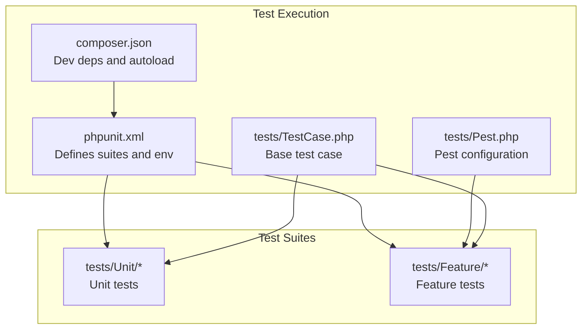
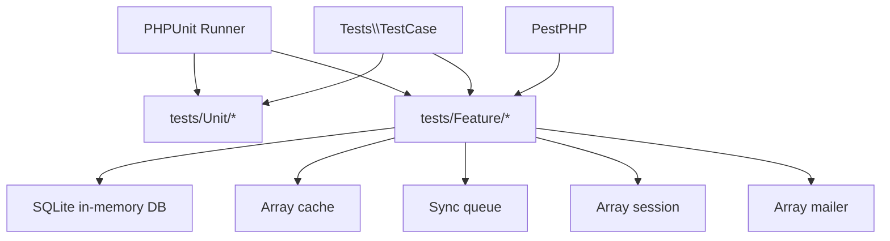
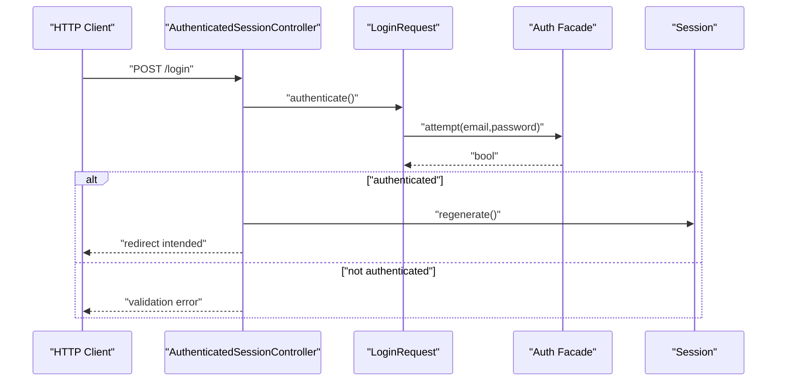
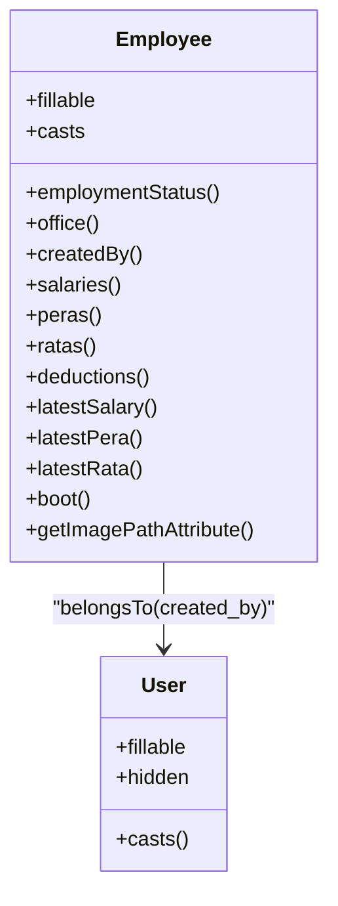
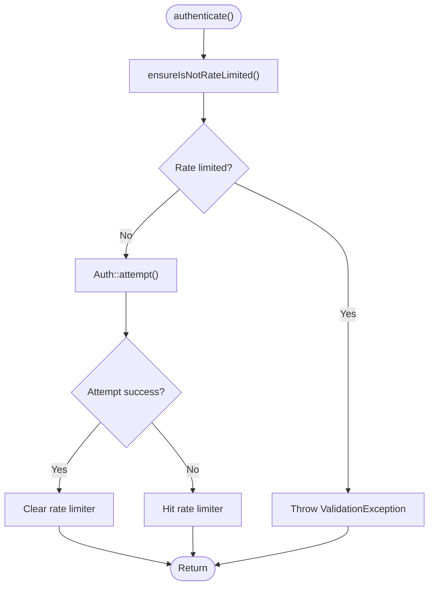
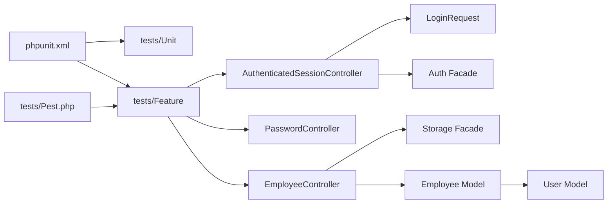

# Unit Tests

<cite>
**Referenced Files in This Document**
- [phpunit.xml](file://phpunit.xml)
- [composer.json](file://composer.json)
- [tests/Pest.php](file://tests/Pest.php)
- [tests/TestCase.php](file://tests/TestCase.php)
- [tests/Unit/ExampleTest.php](file://tests/Unit/ExampleTest.php)
- [tests/Feature/Auth/AuthenticationTest.php](file://tests/Feature/Auth/AuthenticationTest.php)
- [tests/Feature/DashboardTest.php](file://tests/Feature/DashboardTest.php)
- [app/Http/Controllers/Auth/AuthenticatedSessionController.php](file://app/Http/Controllers/Auth/AuthenticatedSessionController.php)
- [app/Http/Controllers/Settings/PasswordController.php](file://app/Http/Controllers/Settings/PasswordController.php)
- [app/Http/Controllers/EmployeeController.php](file://app/Http/Controllers/EmployeeController.php)
- [app/Http/Requests/Auth/LoginRequest.php](file://app/Http/Requests/Auth/LoginRequest.php)
- [app/Models/User.php](file://app/Models/User.php)
- [app/Models/Employee.php](file://app/Models/Employee.php)
- [database/factories/UserFactory.php](file://database/factories/UserFactory.php)
</cite>

## Table of Contents
1. [Introduction](#introduction)
2. [Project Structure](#project-structure)
3. [Core Components](#core-components)
4. [Architecture Overview](#architecture-overview)
5. [Detailed Component Analysis](#detailed-component-analysis)
6. [Dependency Analysis](#dependency-analysis)
7. [Performance Considerations](#performance-considerations)
8. [Troubleshooting Guide](#troubleshooting-guide)
9. [Conclusion](#conclusion)
10. [Appendices](#appendices)

## Introduction
This document explains how unit and feature tests are structured and executed in this Laravel application, focusing on best practices for organizing test suites, isolating tests, preparing deterministic test data, and asserting outcomes. It covers patterns for controllers, requests, models, and utility-like behaviors, and provides guidance for mocking, database interactions, and external service strategies. It also outlines naming conventions, descriptive organization, and TDD/refactoring practices grounded in the repository’s current testing setup.

## Project Structure
The testing stack uses PHPUnit and PestPHP. Tests are organized into two primary suites:
- Unit tests under tests/Unit
- Feature tests under tests/Feature

Configuration and environment:
- phpunit.xml defines suite directories and environment variables for testing, including an in-memory SQLite database and array-backed stores for caches, queues, sessions, and mailers.
- composer.json lists development dependencies including PHPUnit and Mockery, and autoloads the Tests namespace for test classes.
- tests/Pest.php configures Pest to extend the base test case, apply database refresh behavior, and scan the Feature suite automatically.
- tests/TestCase.php provides a minimal base class extending Laravel’s base test case.

**Diagram sources**
- [phpunit.xml:1-34](file://phpunit.xml#L1-L34)
- [composer.json:18-26](file://composer.json#L18-L26)
- [tests/Pest.php:14-16](file://tests/Pest.php#L14-L16)
- [tests/TestCase.php:7-10](file://tests/TestCase.php#L7-L10)

**Section sources**
- [phpunit.xml:7-14](file://phpunit.xml#L7-L14)
- [composer.json:18-26](file://composer.json#L18-L26)
- [tests/Pest.php:14-16](file://tests/Pest.php#L14-L16)
- [tests/TestCase.php:7-10](file://tests/TestCase.php#L7-L10)

## Core Components
- Base test case: tests/TestCase.php extends Laravel’s base test case and serves as the foundation for all tests.
- Pest configuration: tests/Pest.php extends the base test case, applies RefreshDatabase for database isolation, and scans Feature tests.
- Example unit test: tests/Unit/ExampleTest.php demonstrates a minimal unit test using RefreshDatabase.
- Example feature tests: tests/Feature/Auth/AuthenticationTest.php and tests/Feature/DashboardTest.php demonstrate HTTP assertions, authentication helpers, and redirects.
- Request validation and throttling: app/Http/Requests/Auth/LoginRequest.php encapsulates validation and rate-limiting logic suitable for unit testing.
- Controllers under test: app/Http/Controllers/Auth/AuthenticatedSessionController.php, app/Http/Controllers/Settings/PasswordController.php, and app/Http/Controllers/EmployeeController.php represent typical controller behaviors to test.

Best practices reflected in the codebase:
- Use RefreshDatabase trait in Feature tests to isolate database state.
- Prefer actingAs for authenticated requests.
- Use factories to create deterministic test data.
- Assert HTTP status codes, redirects, and authentication state.
- Keep unit tests small and focused; use Feature tests for HTTP and integration behavior.

**Section sources**
- [tests/TestCase.php:7-10](file://tests/TestCase.php#L7-L10)
- [tests/Pest.php:14-16](file://tests/Pest.php#L14-L16)
- [tests/Unit/ExampleTest.php:8-16](file://tests/Unit/ExampleTest.php#L8-L16)
- [tests/Feature/Auth/AuthenticationTest.php:9-54](file://tests/Feature/Auth/AuthenticationTest.php#L9-L54)
- [tests/Feature/DashboardTest.php:9-24](file://tests/Feature/DashboardTest.php#L9-L24)
- [app/Http/Requests/Auth/LoginRequest.php:12-85](file://app/Http/Requests/Auth/LoginRequest.php#L12-L85)
- [app/Http/Controllers/Auth/AuthenticatedSessionController.php:14-51](file://app/Http/Controllers/Auth/AuthenticatedSessionController.php#L14-L51)
- [app/Http/Controllers/Settings/PasswordController.php:14-43](file://app/Http/Controllers/Settings/PasswordController.php#L14-L43)
- [app/Http/Controllers/EmployeeController.php:12-127](file://app/Http/Controllers/EmployeeController.php#L12-L127)

## Architecture Overview
The testing architecture centers on:
- PHPUnit as the runner and assertion engine.
- PestPHP for expressive test DSL and automatic suite scanning.
- Laravel’s testing traits (e.g., RefreshDatabase) for database isolation.
- Factories for deterministic model creation.
- Controllers, Requests, and Models as the primary units under test.

**Diagram sources**
- [phpunit.xml:20-32](file://phpunit.xml#L20-L32)
- [tests/Pest.php:14-16](file://tests/Pest.php#L14-L16)
- [tests/TestCase.php:7-10](file://tests/TestCase.php#L7-L10)

## Detailed Component Analysis

### Unit Testing Patterns
- Structure: Extend Tests\TestCase and optionally use RefreshDatabase for database-dependent unit tests.
- Assertions: Use Laravel’s assertion helpers (e.g., assertTrue) and Pest expectations where applicable.
- Organization: Place unit tests alongside source files or in dedicated tests/Unit directory.

Recommended patterns:
- Keep unit tests focused on pure logic or isolated behaviors.
- Use factories to construct models deterministically.
- Avoid HTTP assertions in unit tests; reserve them for Feature tests.

**Section sources**
- [tests/Unit/ExampleTest.php:8-16](file://tests/Unit/ExampleTest.php#L8-L16)
- [tests/TestCase.php:7-10](file://tests/TestCase.php#L7-L10)

### Feature Testing Patterns
- Structure: Extend Tests\TestCase and use RefreshDatabase.
- HTTP assertions: Assert status codes, redirects, and response content.
- Authentication: Use actingAs to simulate logged-in users.
- Data preparation: Use factories to create models and relations.

Representative examples:
- Authentication screen rendering and login/logout flows.
- Guest redirection to login for protected routes.

**Section sources**
- [tests/Feature/Auth/AuthenticationTest.php:9-54](file://tests/Feature/Auth/AuthenticationTest.php#L9-L54)
- [tests/Feature/DashboardTest.php:9-24](file://tests/Feature/DashboardTest.php#L9-L24)

### Testing Controllers
Controllers to consider:
- AuthenticatedSessionController: Renders login, authenticates via validated request, and logs out.
- PasswordController: Renders settings and updates passwords after validation.
- EmployeeController: Handles listing, creating, updating, and paginated queries with validation and file storage.

Testing strategies:
- Unit-test request validation and controller logic by injecting validated data.
- Feature-test full HTTP flows, including redirects and inertia-rendered pages.
- Mock external dependencies (e.g., Storage) when appropriate.

**Diagram sources**
- [app/Http/Controllers/Auth/AuthenticatedSessionController.php:30-37](file://app/Http/Controllers/Auth/AuthenticatedSessionController.php#L30-L37)
- [app/Http/Requests/Auth/LoginRequest.php:40-53](file://app/Http/Requests/Auth/LoginRequest.php#L40-L53)

**Section sources**
- [app/Http/Controllers/Auth/AuthenticatedSessionController.php:14-51](file://app/Http/Controllers/Auth/AuthenticatedSessionController.php#L14-L51)
- [app/Http/Controllers/Settings/PasswordController.php:14-43](file://app/Http/Controllers/Settings/PasswordController.php#L14-L43)
- [app/Http/Controllers/EmployeeController.php:12-127](file://app/Http/Controllers/EmployeeController.php#L12-L127)
- [app/Http/Requests/Auth/LoginRequest.php:12-85](file://app/Http/Requests/Auth/LoginRequest.php#L12-L85)

### Testing Models
Models to consider:
- User: Standard Eloquent model with fillable, hidden, and casts.
- Employee: Eloquent model with relationships, accessors, and boot logic setting created_by.

Testing strategies:
- Validate fillable attributes and casts.
- Verify relationships and accessors.
- Test model lifecycle hooks (e.g., boot creating callback) using factories and assertions.

**Diagram sources**
- [app/Models/User.php:10-48](file://app/Models/User.php#L10-L48)
- [app/Models/Employee.php:10-103](file://app/Models/Employee.php#L10-L103)

**Section sources**
- [app/Models/User.php:10-48](file://app/Models/User.php#L10-L48)
- [app/Models/Employee.php:10-103](file://app/Models/Employee.php#L10-L103)

### Testing Requests (Validation and Throttling)
LoginRequest encapsulates:
- Validation rules for email and password.
- authenticate method attempting authentication and clearing rate limiter.
- ensureIsNotRateLimited checking rate limits and throwing exceptions.
- throttleKey generating a composite key for rate limiting.

Testing strategies:
- Unit-test validation rules and throttle key generation.
- Unit-test authenticate and ensureIsNotRateLimited with mocked Auth and RateLimiter.
- Feature-test throttling behavior by simulating repeated failed attempts.

**Diagram sources**
- [app/Http/Requests/Auth/LoginRequest.php:40-76](file://app/Http/Requests/Auth/LoginRequest.php#L40-L76)

**Section sources**
- [app/Http/Requests/Auth/LoginRequest.php:12-85](file://app/Http/Requests/Auth/LoginRequest.php#L12-L85)

### Test Data Preparation and Factories
- database/factories/UserFactory.php creates realistic User instances with hashed passwords and optional verification state.
- Use factories in Feature tests to create users and related models.

Guidelines:
- Keep factories generic but override defaults when needed.
- Use unverified() factory variant for negative tests.
- Combine factories with RefreshDatabase to ensure clean state.

**Section sources**
- [database/factories/UserFactory.php:12-44](file://database/factories/UserFactory.php#L12-L44)

### Mocking Strategies
Current repository usage:
- No explicit mocks are shown in unit tests; most tests rely on factories and database refresh.

Recommended strategies:
- Mock external services (e.g., Storage facade) to avoid disk writes during unit tests.
- Mock Auth facade for login-related logic when testing controllers or requests.
- Use Mockery or Laravel’s built-in facades for targeted isolation.

Note: Implement mocks in unit tests that exercise logic depending on external systems.

**Section sources**
- [composer.json:23-25](file://composer.json#L23-L25)

### Test Isolation and Cleanup
- RefreshDatabase trait resets the database between tests, ensuring isolation.
- Environment variables in phpunit.xml configure ephemeral stores (cache, queue, session, mailer) and in-memory SQLite.

Cleanup:
- No manual cleanup required for ephemeral stores.
- Use database transactions or refresh per test via RefreshDatabase.

**Section sources**
- [tests/Unit/ExampleTest.php:10](file://tests/Unit/ExampleTest.php#L10)
- [phpunit.xml:20-32](file://phpunit.xml#L20-L32)

### Assertion Patterns
- Feature tests commonly assert HTTP status codes, redirects, and authentication state.
- Use Pest expectations for expressive assertions where appropriate.

Examples:
- Assert guest vs authenticated states.
- Assert redirects to intended destinations.
- Assert successful responses for rendered pages.

**Section sources**
- [tests/Feature/Auth/AuthenticationTest.php:13-53](file://tests/Feature/Auth/AuthenticationTest.php#L13-L53)
- [tests/Feature/DashboardTest.php:13-23](file://tests/Feature/DashboardTest.php#L13-L23)
- [tests/Pest.php:29-31](file://tests/Pest.php#L29-L31)

### Naming Conventions and Descriptive Organization
- Use descriptive test method names that explain the scenario and expected outcome.
- Group related tests in the same class.
- Place Feature tests under tests/Feature/<Category> to reflect domain areas.

Examples:
- test_login_screen_can_be_rendered
- test_users_can_authenticate_using_the_login_screen
- test_guests_are_redirected_to_the_login_page

**Section sources**
- [tests/Feature/Auth/AuthenticationTest.php:13-53](file://tests/Feature/Auth/AuthenticationTest.php#L13-L53)
- [tests/Feature/DashboardTest.php:13-23](file://tests/Feature/DashboardTest.php#L13-L23)

### Examples by Component Type
- Models: Validate fillable, casts, relationships, and accessors using factories and assertions.
- Controllers: Test route-level behavior with Feature tests; unit-test validation and request handling separately.
- Requests: Unit-test validation rules, throttle keys, and rate-limiting logic.
- Utilities: If present, unit-test pure functions and edge cases.

**Section sources**
- [app/Models/User.php:10-48](file://app/Models/User.php#L10-L48)
- [app/Models/Employee.php:10-103](file://app/Models/Employee.php#L10-L103)
- [app/Http/Controllers/Auth/AuthenticatedSessionController.php:14-51](file://app/Http/Controllers/Auth/AuthenticatedSessionController.php#L14-L51)
- [app/Http/Controllers/Settings/PasswordController.php:14-43](file://app/Http/Controllers/Settings/PasswordController.php#L14-L43)
- [app/Http/Controllers/EmployeeController.php:12-127](file://app/Http/Controllers/EmployeeController.php#L12-L127)
- [app/Http/Requests/Auth/LoginRequest.php:12-85](file://app/Http/Requests/Auth/LoginRequest.php#L12-L85)

## Dependency Analysis
- PHPUnit runs the suites defined in phpunit.xml.
- PestPHP extends the base test case and applies RefreshDatabase to Feature tests.
- Controllers depend on Requests for validation and on Auth/Storage for runtime behavior.
- Models depend on Eloquent and relationships; boot logic depends on Auth.

**Diagram sources**
- [phpunit.xml:7-14](file://phpunit.xml#L7-L14)
- [tests/Pest.php:14-16](file://tests/Pest.php#L14-L16)
- [app/Http/Controllers/Auth/AuthenticatedSessionController.php:14-51](file://app/Http/Controllers/Auth/AuthenticatedSessionController.php#L14-L51)
- [app/Http/Controllers/Settings/PasswordController.php:14-43](file://app/Http/Controllers/Settings/PasswordController.php#L14-L43)
- [app/Http/Controllers/EmployeeController.php:12-127](file://app/Http/Controllers/EmployeeController.php#L12-L127)
- [app/Http/Requests/Auth/LoginRequest.php:12-85](file://app/Http/Requests/Auth/LoginRequest.php#L12-L85)
- [app/Models/Employee.php:10-103](file://app/Models/Employee.php#L10-L103)
- [app/Models/User.php:10-48](file://app/Models/User.php#L10-L48)

**Section sources**
- [phpunit.xml:7-14](file://phpunit.xml#L7-L14)
- [tests/Pest.php:14-16](file://tests/Pest.php#L14-L16)
- [app/Http/Controllers/Auth/AuthenticatedSessionController.php:14-51](file://app/Http/Controllers/Auth/AuthenticatedSessionController.php#L14-L51)
- [app/Http/Controllers/Settings/PasswordController.php:14-43](file://app/Http/Controllers/Settings/PasswordController.php#L14-L43)
- [app/Http/Controllers/EmployeeController.php:12-127](file://app/Http/Controllers/EmployeeController.php#L12-L127)
- [app/Http/Requests/Auth/LoginRequest.php:12-85](file://app/Http/Requests/Auth/LoginRequest.php#L12-L85)
- [app/Models/Employee.php:10-103](file://app/Models/Employee.php#L10-L103)
- [app/Models/User.php:10-48](file://app/Models/User.php#L10-L48)

## Performance Considerations
- Use SQLite in-memory database for fast test runs.
- Keep Feature tests scoped; avoid heavy client-side rendering in tests.
- Use RefreshDatabase judiciously; prefer smaller, focused tests to minimize teardown overhead.
- Limit external I/O (e.g., file uploads) in unit tests by mocking Storage.

[No sources needed since this section provides general guidance]

## Troubleshooting Guide
Common issues and resolutions:
- Database state bleeding between tests: Ensure RefreshDatabase is used in Feature tests.
- Authentication assertions failing: Use actingAs to log in a user before testing protected routes.
- Rate-limiting failures: Adjust throttle key or temporarily lower rate limit thresholds in tests.
- Redirect loops: Verify intended route and middleware behavior in Feature tests.

**Section sources**
- [tests/Feature/Auth/AuthenticationTest.php:20-53](file://tests/Feature/Auth/AuthenticationTest.php#L20-L53)
- [tests/Feature/DashboardTest.php:13-23](file://tests/Feature/DashboardTest.php#L13-L23)
- [app/Http/Requests/Auth/LoginRequest.php:60-76](file://app/Http/Requests/Auth/LoginRequest.php#L60-L76)

## Conclusion
This repository establishes a solid foundation for testing with PHPUnit and PestPHP, leveraging RefreshDatabase for isolation and factories for deterministic data. Controllers, requests, and models are structured to support both unit and feature testing. By following the recommended patterns—descriptive naming, isolation, mocking external dependencies, and TDD—you can build maintainable and reliable tests across the application.

[No sources needed since this section summarizes without analyzing specific files]

## Appendices

### Appendix A: Environment and Suite Configuration
- Suites: Unit and Feature directories configured in phpunit.xml.
- Environment: In-memory SQLite, array stores, and reduced encryption rounds for faster hashing.

**Section sources**
- [phpunit.xml:7-14](file://phpunit.xml#L7-L14)
- [phpunit.xml:20-32](file://phpunit.xml#L20-L32)

### Appendix B: Dev Dependencies and Autoload
- PHPUnit and Mockery included for testing.
- Tests namespace autoloaded under autoload-dev.

**Section sources**
- [composer.json:18-26](file://composer.json#L18-L26)
- [composer.json:34-37](file://composer.json#L34-L37)